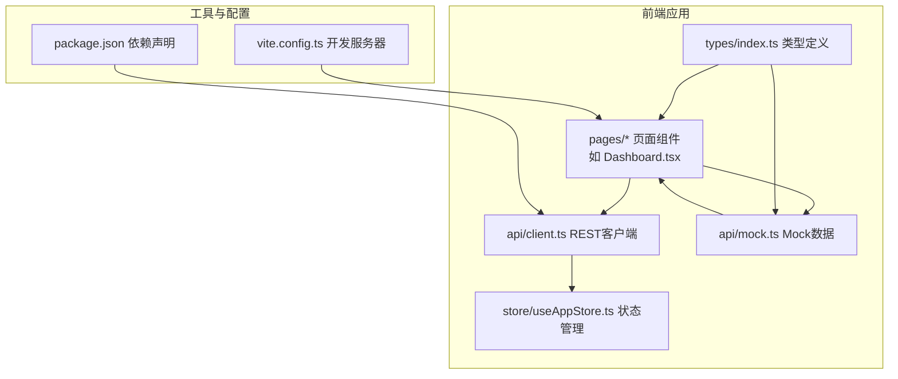
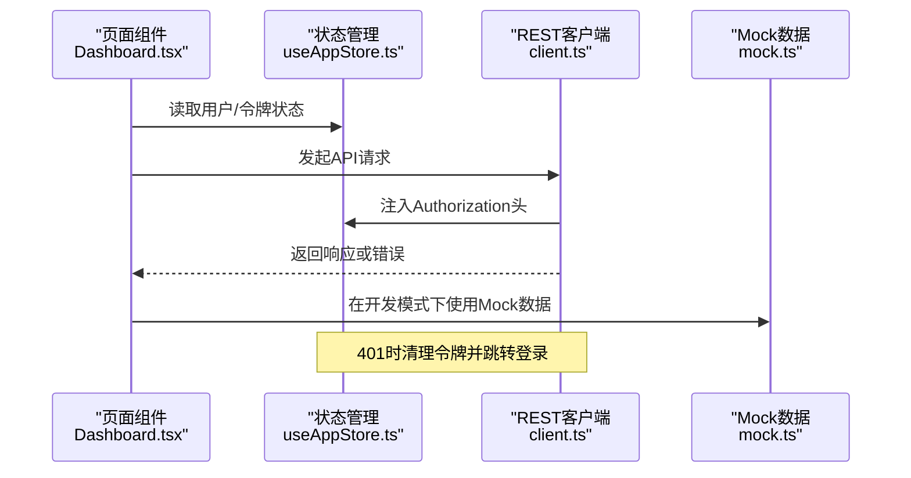
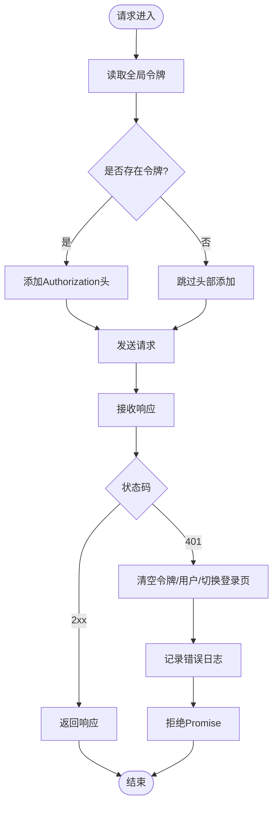
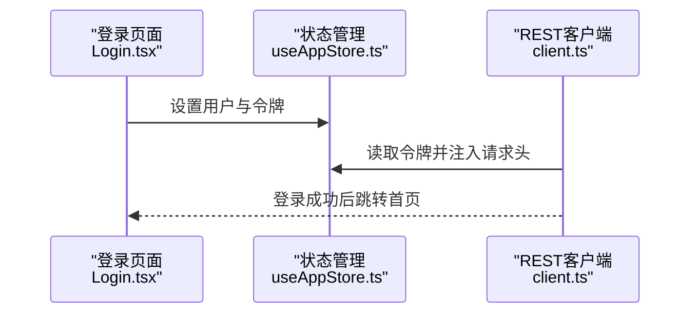
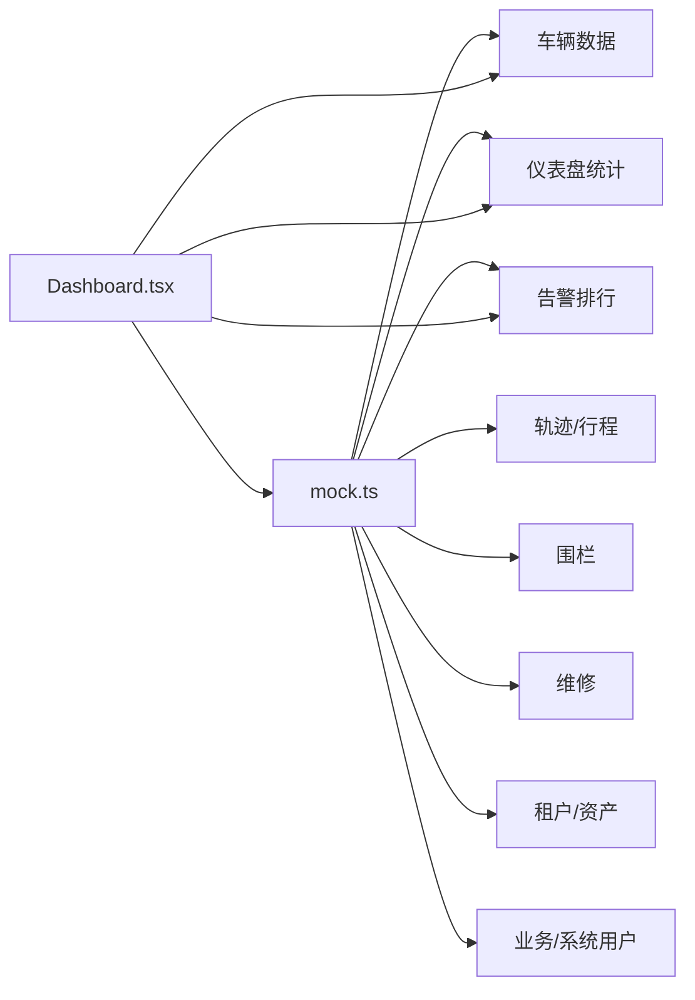
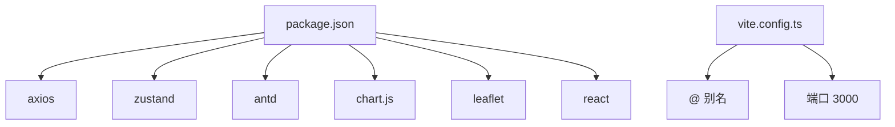

# API集成

<cite>
**本文引用的文件**
- [client.ts](file://weidu-fleet/src/api/client.ts)
- [mock.ts](file://weidu-fleet/src/api/mock.ts)
- [index.ts](file://weidu-fleet/src/types/index.ts)
- [useAppStore.ts](file://weidu-fleet/src/store/useAppStore.ts)
- [Dashboard.tsx](file://weidu-fleet/src/pages/Dashboard.tsx)
- [Login.tsx](file://weidu-fleet/src/pages/Login.tsx)
- [package.json](file://weidu-fleet/package.json)
- [vite.config.ts](file://weidu-fleet/vite.config.ts)
</cite>

## 目录
1. [简介](#简介)
2. [项目结构](#项目结构)
3. [核心组件](#核心组件)
4. [架构概览](#架构概览)
5. [详细组件分析](#详细组件分析)
6. [依赖分析](#依赖分析)
7. [性能考虑](#性能考虑)
8. [故障排除指南](#故障排除指南)
9. [结论](#结论)
10. [附录](#附录)

## 简介
本文件为“苇渡-智利车队管理”项目的API集成文档，聚焦于RESTful API客户端的设计与实现、请求配置、响应处理与错误管理、API拦截器与认证机制、Mock数据配置与使用策略，以及开发与测试环境中的API模拟方案。同时提供最佳实践、性能优化与缓存策略建议，并给出具体API使用示例与常见问题解决方案。

## 项目结构
该项目采用前端单页应用（SPA）架构，基于React与Vite构建，API层通过Axios封装并统一注入认证头与错误处理逻辑；数据模型在types目录下集中定义；状态管理采用Zustand；页面组件按功能模块划分，Dashboard等页面直接消费Mock数据以支持开发与演示。

图表来源
- [client.ts:1-32](file://weidu-fleet/src/api/client.ts#L1-L32)
- [mock.ts:1-634](file://weidu-fleet/src/api/mock.ts#L1-L634)
- [useAppStore.ts:1-87](file://weidu-fleet/src/store/useAppStore.ts#L1-L87)
- [Dashboard.tsx:1-257](file://weidu-fleet/src/pages/Dashboard.tsx#L1-L257)
- [vite.config.ts:1-16](file://weidu-fleet/vite.config.ts#L1-L16)
- [package.json:1-41](file://weidu-fleet/package.json#L1-L41)

章节来源
- [client.ts:1-32](file://weidu-fleet/src/api/client.ts#L1-L32)
- [mock.ts:1-634](file://weidu-fleet/src/api/mock.ts#L1-L634)
- [useAppStore.ts:1-87](file://weidu-fleet/src/store/useAppStore.ts#L1-L87)
- [Dashboard.tsx:1-257](file://weidu-fleet/src/pages/Dashboard.tsx#L1-L257)
- [vite.config.ts:1-16](file://weidu-fleet/vite.config.ts#L1-L16)
- [package.json:1-41](file://weidu-fleet/package.json#L1-L41)

## 核心组件
- REST客户端：基于Axios创建，设置基础URL与超时，统一注入Authorization头，并在401时自动清理本地状态并跳转登录。
- Mock数据：提供车辆、监控、风险、驾驶、电池、行程、围栏、维修、租户、业务与系统用户等全量数据生成与查询函数，支持增删改查演示。
- 类型系统：集中定义车辆、告警、轨迹、行程、围栏、维修、租户、资产、业务与系统用户等接口类型。
- 状态管理：Zustand Store保存用户、令牌、语言、当前页面与筛选条件等全局状态。
- 页面组件：Dashboard等页面直接导入Mock数据进行渲染，便于开发与联调。

章节来源
- [client.ts:1-32](file://weidu-fleet/src/api/client.ts#L1-L32)
- [mock.ts:1-634](file://weidu-fleet/src/api/mock.ts#L1-L634)
- [index.ts:1-261](file://weidu-fleet/src/types/index.ts#L1-L261)
- [useAppStore.ts:1-87](file://weidu-fleet/src/store/useAppStore.ts#L1-L87)
- [Dashboard.tsx:1-257](file://weidu-fleet/src/pages/Dashboard.tsx#L1-L257)

## 架构概览
下图展示了从页面组件到API客户端与Mock数据的整体交互流程，以及认证与错误处理的关键节点。

图表来源
- [client.ts:9-29](file://weidu-fleet/src/api/client.ts#L9-L29)
- [useAppStore.ts:40-87](file://weidu-fleet/src/store/useAppStore.ts#L40-L87)
- [Dashboard.tsx:25](file://weidu-fleet/src/pages/Dashboard.tsx#L25)
- [mock.ts:27-29](file://weidu-fleet/src/api/mock.ts#L27-L29)

## 详细组件分析

### REST客户端（Axios封装）
- 基础配置
  - 基础URL：/api
  - 超时：10秒
- 请求拦截器
  - 从全局状态读取令牌并在请求头添加Authorization: Bearer <token>
- 响应拦截器
  - 统一返回响应体
  - 对401错误：清空令牌、用户信息，切换至登录页，并记录错误日志

图表来源
- [client.ts:4-7](file://weidu-fleet/src/api/client.ts#L4-L7)
- [client.ts:9-15](file://weidu-fleet/src/api/client.ts#L9-L15)
- [client.ts:17-29](file://weidu-fleet/src/api/client.ts#L17-L29)
- [useAppStore.ts:62-64](file://weidu-fleet/src/store/useAppStore.ts#L62-L64)

章节来源
- [client.ts:1-32](file://weidu-fleet/src/api/client.ts#L1-L32)
- [useAppStore.ts:1-87](file://weidu-fleet/src/store/useAppStore.ts#L1-L87)

### 认证机制
- 令牌来源：登录流程中设置令牌并保存到全局状态
- 注入方式：请求拦截器自动附加Authorization头
- 失效处理：401时自动清除令牌与用户信息并跳转登录

图表来源
- [Login.tsx:46-51](file://weidu-fleet/src/pages/Login.tsx#L46-L51)
- [useAppStore.ts:61-64](file://weidu-fleet/src/store/useAppStore.ts#L61-L64)
- [client.ts:9-15](file://weidu-fleet/src/api/client.ts#L9-L15)

章节来源
- [Login.tsx:1-167](file://weidu-fleet/src/pages/Login.tsx#L1-L167)
- [useAppStore.ts:1-87](file://weidu-fleet/src/store/useAppStore.ts#L1-L87)
- [client.ts:1-32](file://weidu-fleet/src/api/client.ts#L1-L32)

### Mock数据体系
- 数据生成
  - 车辆列表、仪表盘统计、告警排行、在线/离线车辆、轨迹点、行程、围栏、维修、租户、资产、业务与系统用户等
  - 支持按VIN查询、按ID查询、统计聚合与分布数据
- 可变操作
  - 提供新增/删除围栏、新增/完成维修等可变操作，便于演示CRUD
- 使用方式
  - 页面组件直接导入mock函数进行渲染，无需真实后端

图表来源
- [mock.ts:27-29](file://weidu-fleet/src/api/mock.ts#L27-L29)
- [mock.ts:35-51](file://weidu-fleet/src/api/mock.ts#L35-L51)
- [mock.ts:53-69](file://weidu-fleet/src/api/mock.ts#L53-L69)
- [mock.ts:80-102](file://weidu-fleet/src/api/mock.ts#L80-L102)
- [mock.ts:105-170](file://weidu-fleet/src/api/mock.ts#L105-L170)
- [mock.ts:175-200](file://weidu-fleet/src/api/mock.ts#L175-L200)
- [mock.ts:203-247](file://weidu-fleet/src/api/mock.ts#L203-L247)
- [mock.ts:272-387](file://weidu-fleet/src/api/mock.ts#L272-L387)
- [mock.ts:390-419](file://weidu-fleet/src/api/mock.ts#L390-L419)
- [mock.ts:404-419](file://weidu-fleet/src/api/mock.ts#L404-L419)
- [mock.ts:422-432](file://weidu-fleet/src/api/mock.ts#L422-L432)
- [mock.ts:435-450](file://weidu-fleet/src/api/mock.ts#L435-L450)
- [mock.ts:453-464](file://weidu-fleet/src/api/mock.ts#L453-L464)
- [mock.ts:467-493](file://weidu-fleet/src/api/mock.ts#L467-L493)
- [mock.ts:496-505](file://weidu-fleet/src/api/mock.ts#L496-L505)
- [mock.ts:508-533](file://weidu-fleet/src/api/mock.ts#L508-L533)
- [Dashboard.tsx:25](file://weidu-fleet/src/pages/Dashboard.tsx#L25)

章节来源
- [mock.ts:1-634](file://weidu-fleet/src/api/mock.ts#L1-L634)
- [Dashboard.tsx:1-257](file://weidu-fleet/src/pages/Dashboard.tsx#L1-L257)

### 类型系统
- 车辆与监控：Vehicle、TrajectoryPoint、BatteryMonitorItem等
- 风险与驾驶：FenceAlert、FaultAlert、BatteryAlert、DrivingAlert、DrivingReport等
- 行程与围栏：TripInfo、TripDetail、FenceItem、TripAlertItem等
- 维修与租户：RepairItem、TenantItem、AssetItem等
- 业务与系统：BizUserItem、BizRoleItem、Sys用户与角色等

章节来源
- [index.ts:1-261](file://weidu-fleet/src/types/index.ts#L1-L261)

### 页面组件与API集成
- Dashboard页面
  - 导入mock函数用于统计、车辆与排行数据
  - 使用图表库渲染风险趋势与地图展示在线车辆位置
- 其他页面
  - 各功能页面（如Vehicles、Risk、Driving、Battery、Trips、Fence、Repair、Tenant、Biz、Sys）均以类似方式引入对应Mock数据函数

章节来源
- [Dashboard.tsx:25](file://weidu-fleet/src/pages/Dashboard.tsx#L25)
- [Dashboard.tsx:38-40](file://weidu-fleet/src/pages/Dashboard.tsx#L38-L40)

## 依赖分析
- Axios：HTTP客户端，提供拦截器能力与请求/响应处理
- Zustand：轻量状态管理，持久化存储用户、令牌与语言等
- Vite：开发服务器与构建工具，配置别名与端口
- Ant Design：UI组件库，配合图表与地图组件使用

图表来源
- [package.json:11-26](file://weidu-fleet/package.json#L11-L26)
- [vite.config.ts:7-14](file://weidu-fleet/vite.config.ts#L7-L14)

章节来源
- [package.json:1-41](file://weidu-fleet/package.json#L1-L41)
- [vite.config.ts:1-16](file://weidu-fleet/vite.config.ts#L1-L16)

## 性能考虑
- 请求超时与并发
  - 客户端已设置10秒超时，可根据网络状况调整
  - 建议对高频请求进行去抖/节流与批量合并
- 缓存策略
  - 对静态或不频繁变化的数据（如围栏、租户、角色）启用内存缓存
  - 对分页数据使用分段缓存，结合“最后更新时间”字段实现失效控制
- 渲染优化
  - 使用React.memo与useMemo避免不必要的重渲染
  - 图表与地图组件按需加载与懒渲染
- Mock数据优化
  - 仅在开发环境使用Mock；生产环境替换为真实API调用
  - 对大数据集进行虚拟滚动与分页展示

## 故障排除指南
- 401未授权
  - 现象：接口返回401并触发登录页跳转
  - 处理：检查令牌是否正确写入状态；确认拦截器是否注入Authorization头
- 网络超时
  - 现象：请求超过10秒无响应
  - 处理：提升超时阈值或增加重试机制；检查服务端可用性
- Mock数据不刷新
  - 现象：修改Mock数据后页面未更新
  - 处理：确保页面组件重新计算依赖；避免重复使用旧的useMemo结果
- 状态不同步
  - 现象：登录后仍提示未登录
  - 处理：确认登录流程正确设置令牌与用户；检查拦截器逻辑

章节来源
- [client.ts:17-29](file://weidu-fleet/src/api/client.ts#L17-L29)
- [useAppStore.ts:61-64](file://weidu-fleet/src/store/useAppStore.ts#L61-L64)
- [Login.tsx:46-51](file://weidu-fleet/src/pages/Login.tsx#L46-L51)

## 结论
本项目通过Axios封装实现了统一的请求与错误处理，结合Zustand状态管理与Mock数据体系，为开发与测试提供了高效、可控的API集成方案。建议在后续阶段逐步替换Mock为真实后端接口，并完善缓存与性能优化策略，以满足生产环境需求。

## 附录

### API调用最佳实践
- 统一入口：所有HTTP请求通过client.ts发起
- 明确错误处理：在调用处捕获并提示用户
- 参数校验：在调用前对参数进行格式与范围校验
- 幂等性：对幂等请求（GET/HEAD）启用缓存，非幂等请求避免缓存

### 开发与测试环境的API模拟策略
- 开发环境
  - 使用mock.ts提供的函数直接渲染页面
  - 通过浏览器开发者工具观察请求与响应
- 测试环境
  - 使用Mock数据驱动单元测试与集成测试
  - 对关键流程编写端到端测试脚本

### 具体API使用示例（路径指引）
- 获取车辆列表
  - [Dashboard.tsx:39](file://weidu-fleet/src/pages/Dashboard.tsx#L39)
  - [mock.ts:27-29](file://weidu-fleet/src/api/mock.ts#L27-L29)
- 获取仪表盘统计
  - [Dashboard.tsx:38](file://weidu-fleet/src/pages/Dashboard.tsx#L38)
  - [mock.ts:35-51](file://weidu-fleet/src/api/mock.ts#L35-L51)
- 获取围栏列表
  - [mock.ts:399-401](file://weidu-fleet/src/api/mock.ts#L399-L401)
- 新增围栏
  - [mock.ts:618-622](file://weidu-fleet/src/api/mock.ts#L618-L622)
- 删除围栏
  - [mock.ts:624-626](file://weidu-fleet/src/api/mock.ts#L624-L626)
- 获取维修列表
  - [mock.ts:417-419](file://weidu-fleet/src/api/mock.ts#L417-L419)
- 新增维修
  - [mock.ts:598-610](file://weidu-fleet/src/api/mock.ts#L598-L610)
- 完成维修
  - [mock.ts:612-615](file://weidu-fleet/src/api/mock.ts#L612-L615)