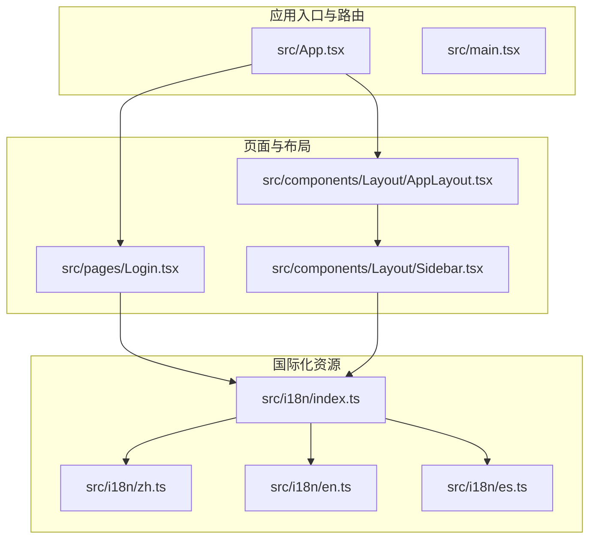
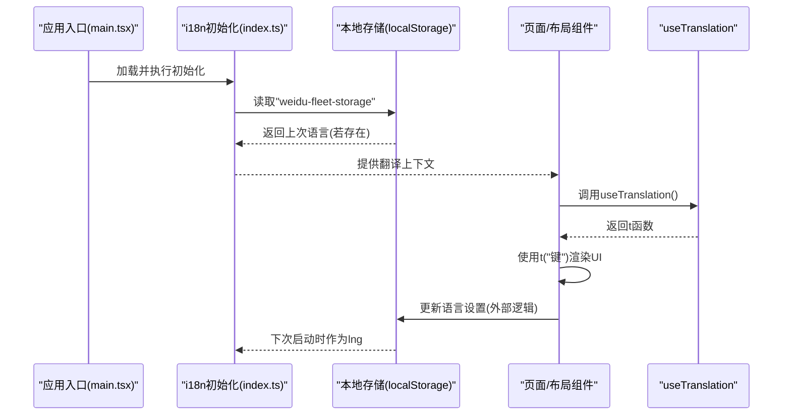
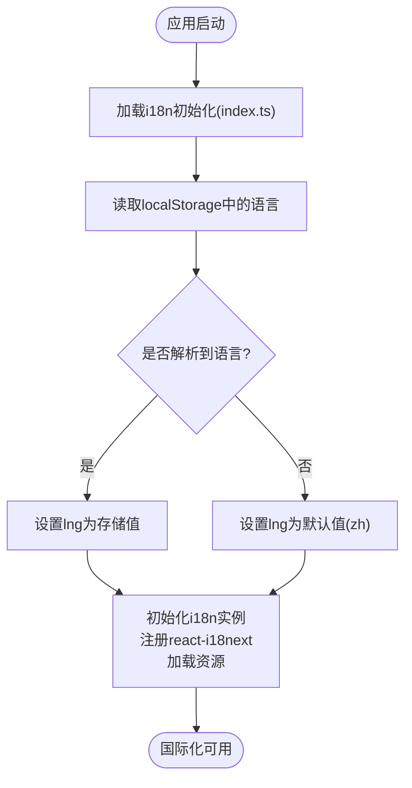
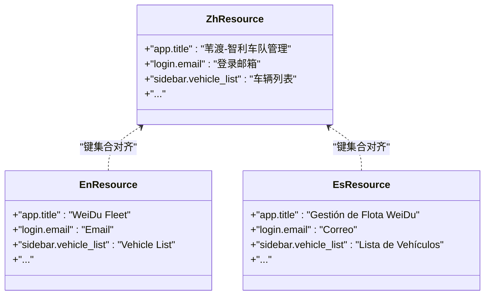
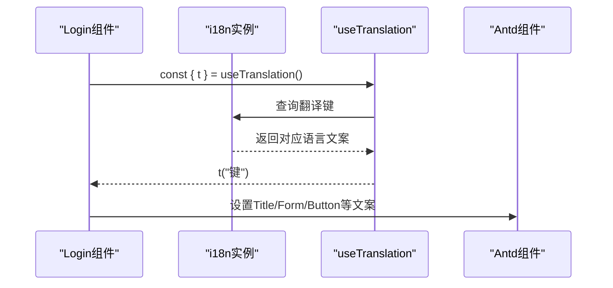
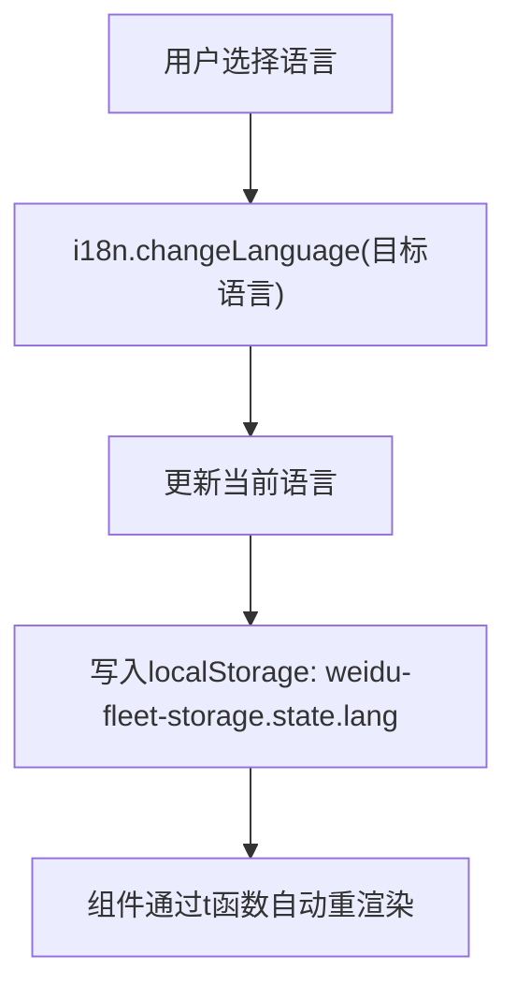
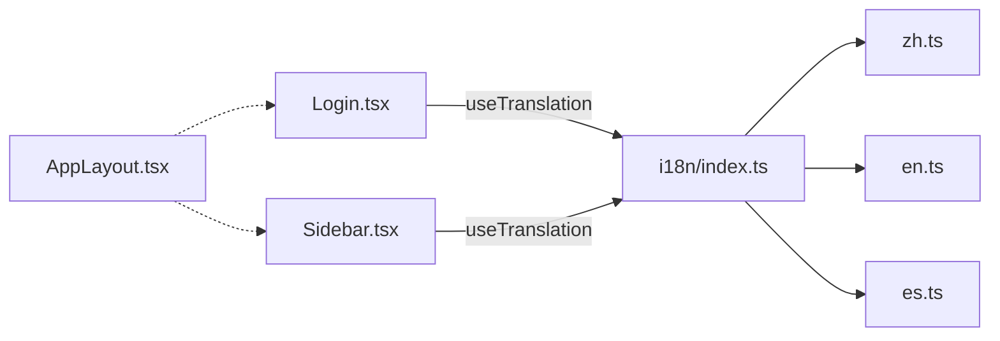

# 国际化实现

<cite>
**本文引用的文件**
- [index.ts](file://weidu-fleet/src/i18n/index.ts)
- [zh.ts](file://weidu-fleet/src/i18n/zh.ts)
- [en.ts](file://weidu-fleet/src/i18n/en.ts)
- [es.ts](file://weidu-fleet/src/i18n/es.ts)
- [App.tsx](file://weidu-fleet/src/App.tsx)
- [Login.tsx](file://weidu-fleet/src/pages/Login.tsx)
- [AppLayout.tsx](file://weidu-fleet/src/components/Layout/AppLayout.tsx)
- [Sidebar.tsx](file://weidu-fleet/src/components/Layout/Sidebar.tsx)
- [format.ts](file://weidu-fleet/src/utils/format.ts)
</cite>

## 目录
1. [引言](#引言)
2. [项目结构](#项目结构)
3. [核心组件](#核心组件)
4. [架构总览](#架构总览)
5. [详细组件分析](#详细组件分析)
6. [依赖关系分析](#依赖关系分析)
7. [性能考量](#性能考量)
8. [故障排查指南](#故障排查指南)
9. [结论](#结论)
10. [附录](#附录)

## 引言
本文件面向“苇渡-智利车队管理”项目的国际化实现，系统性阐述 i18next 的配置与使用、多语言资源的组织与管理、语言切换机制、本地化策略、文本提取流程、新增语言支持方法、翻译管理最佳实践、国际化组件使用示例以及日期与数字的本地化处理。文档以仓库现有代码为依据，结合组件调用链路与数据流，帮助开发者快速理解并扩展国际化能力。

## 项目结构
国际化相关的核心文件集中在 src/i18n 目录，采用按语言拆分的资源文件组织方式；在页面与布局组件中通过 react-i18next 的 hooks 使用翻译键值，形成“资源定义—初始化—消费”的完整链路。

**图表来源**
- [index.ts:1-30](file://weidu-fleet/src/i18n/index.ts#L1-L30)
- [zh.ts:1-424](file://weidu-fleet/src/i18n/zh.ts#L1-L424)
- [en.ts:1-422](file://weidu-fleet/src/i18n/en.ts#L1-L422)
- [es.ts:1-422](file://weidu-fleet/src/i18n/es.ts#L1-L422)
- [App.tsx:1-88](file://weidu-fleet/src/App.tsx#L1-L88)
- [Login.tsx:1-167](file://weidu-fleet/src/pages/Login.tsx#L1-L167)
- [AppLayout.tsx:1-85](file://weidu-fleet/src/components/Layout/AppLayout.tsx#L1-L85)
- [Sidebar.tsx:1-272](file://weidu-fleet/src/components/Layout/Sidebar.tsx#L1-L272)

**章节来源**
- [index.ts:1-30](file://weidu-fleet/src/i18n/index.ts#L1-L30)
- [zh.ts:1-424](file://weidu-fleet/src/i18n/zh.ts#L1-L424)
- [en.ts:1-422](file://weidu-fleet/src/i18n/en.ts#L1-L422)
- [es.ts:1-422](file://weidu-fleet/src/i18n/es.ts#L1-L422)
- [App.tsx:1-88](file://weidu-fleet/src/App.tsx#L1-L88)

## 核心组件
- i18n 初始化与资源配置
  - 在初始化文件中注册 react-i18next 并加载三种语言资源，设置默认语言与回退语言，关闭转义以允许富文本渲染。
  - 初始语言优先从本地存储恢复，若无则默认中文。
- 翻译键值资源
  - 资源文件按模块划分键名空间（如 app、login、common、sidebar、menu、title、dash、veh、risk、driving、battery、trip、fence、repair、tenant、biz、sys 等），便于维护与查找。
- 页面与布局中的翻译消费
  - 登录页与侧边栏等组件通过 useTranslation 获取 t 函数，使用翻译键动态渲染文案。

**章节来源**
- [index.ts:1-30](file://weidu-fleet/src/i18n/index.ts#L1-L30)
- [zh.ts:1-424](file://weidu-fleet/src/i18n/zh.ts#L1-L424)
- [en.ts:1-422](file://weidu-fleet/src/i18n/en.ts#L1-L422)
- [es.ts:1-422](file://weidu-fleet/src/i18n/es.ts#L1-L422)
- [Login.tsx:1-167](file://weidu-fleet/src/pages/Login.tsx#L1-L167)
- [Sidebar.tsx:1-272](file://weidu-fleet/src/components/Layout/Sidebar.tsx#L1-L272)

## 架构总览
国际化工作流由“初始化—消费—持久化”三部分构成：初始化阶段完成 i18n 实例配置；消费阶段在组件中通过 hooks 使用翻译；持久化阶段将当前语言写入本地存储以便刷新后恢复。

**图表来源**
- [index.ts:7-27](file://weidu-fleet/src/i18n/index.ts#L7-L27)
- [Login.tsx:14-14](file://weidu-fleet/src/pages/Login.tsx#L14-L14)
- [Sidebar.tsx:28-28](file://weidu-fleet/src/components/Layout/Sidebar.tsx#L28-L28)

## 详细组件分析

### i18n 初始化与配置
- 初始化流程
  - 注册 react-i18next 适配器，加载 zh/en/es 三套资源，设置 lng 为本地存储恢复的语言或默认 zh，fallbackLng 为 en。
  - 关闭插值转义，允许在翻译中使用简单 HTML 标签。
- 初始语言恢复
  - 尝试从本地存储中解析 state.lang，若失败则回退到 zh。
- 资源结构
  - 每个语言文件导出一个对象，键为“命名空间.键名”，值为对应语言的文案。

**图表来源**
- [index.ts:7-27](file://weidu-fleet/src/i18n/index.ts#L7-L27)

**章节来源**
- [index.ts:1-30](file://weidu-fleet/src/i18n/index.ts#L1-L30)

### 翻译键值资源组织
- 键命名规范
  - 采用“模块.子模块.属性”或“页面.字段”的层级命名，例如 app.title、login.email、sidebar.vehicle_list、menu.monitor 等。
- 资源覆盖范围
  - 包含登录、通用控件、侧边栏菜单、标题、仪表盘、车辆、驾驶、电池、行程、围栏、维修、租户、业务、系统等模块的文案。
- 语言一致性
  - 中文、英文、西班牙文资源键集合基本一致，便于统一管理与校验。

**图表来源**
- [zh.ts:1-424](file://weidu-fleet/src/i18n/zh.ts#L1-L424)
- [en.ts:1-422](file://weidu-fleet/src/i18n/en.ts#L1-L422)
- [es.ts:1-422](file://weidu-fleet/src/i18n/es.ts#L1-L422)

**章节来源**
- [zh.ts:1-424](file://weidu-fleet/src/i18n/zh.ts#L1-L424)
- [en.ts:1-422](file://weidu-fleet/src/i18n/en.ts#L1-L422)
- [es.ts:1-422](file://weidu-fleet/src/i18n/es.ts#L1-L422)

### 页面与布局中的翻译消费
- 登录页
  - 使用 useTranslation 获取 t，渲染标题、表单项标签、按钮文案与提示信息。
- 侧边栏
  - 使用 useTranslation 渲染菜单项与子菜单项的中文文案，配合 Ant Design Menu 组件展示。
- 布局与路由
  - AppLayout 控制登录态与路由跳转，不影响翻译消费。

**图表来源**
- [Login.tsx:14-14](file://weidu-fleet/src/pages/Login.tsx#L14-L14)
- [Login.tsx:77-128](file://weidu-fleet/src/pages/Login.tsx#L77-L128)
- [Sidebar.tsx:28-28](file://weidu-fleet/src/components/Layout/Sidebar.tsx#L28-L28)
- [Sidebar.tsx:44-164](file://weidu-fleet/src/components/Layout/Sidebar.tsx#L44-L164)

**章节来源**
- [Login.tsx:1-167](file://weidu-fleet/src/pages/Login.tsx#L1-L167)
- [Sidebar.tsx:1-272](file://weidu-fleet/src/components/Layout/Sidebar.tsx#L1-L272)
- [AppLayout.tsx:1-85](file://weidu-fleet/src/components/Layout/AppLayout.tsx#L1-L85)

### 语言切换机制与本地化策略
- 初始语言恢复
  - 通过读取本地存储中的语言设置，确保刷新后语言不丢失。
- 本地化策略
  - 默认语言 zh，回退语言 en，避免缺失键导致的显示问题。
  - 插值转义关闭，允许在翻译中嵌入简单 HTML（如图标提示文案）。
- 语言切换流程（建议）
  - 在应用层增加语言选择器，调用 i18n.changeLanguage 并将结果写入本地存储，随后触发全站文案更新。

**图表来源**
- [index.ts:7-27](file://weidu-fleet/src/i18n/index.ts#L7-L27)

**章节来源**
- [index.ts:1-30](file://weidu-fleet/src/i18n/index.ts#L1-L30)

### 文本提取与翻译管理最佳实践
- 键命名规范
  - 采用“模块.属性”或“页面.字段”的层级命名，避免重复与歧义。
- 资源文件拆分
  - 按语言拆分资源文件，便于团队协作与审阅。
- 缺失键处理
  - 使用 fallbackLng 保证回退文案，减少线上错误。
- 提取流程建议
  - 定期扫描组件中使用的翻译键，生成差异报告，核对各语言资源完整性。
  - 对于动态文案，尽量通过参数化拼接，避免硬编码不同语言的片段。

**章节来源**
- [zh.ts:1-424](file://weidu-fleet/src/i18n/zh.ts#L1-L424)
- [en.ts:1-422](file://weidu-fleet/src/i18n/en.ts#L1-L422)
- [es.ts:1-422](file://weidu-fleet/src/i18n/es.ts#L1-L422)

### 新增语言支持方法
- 步骤
  - 在 src/i18n 下新增语言文件，键集合与现有语言保持一致。
  - 在初始化文件中引入新语言并加入 resources。
  - 如需默认语言切换，可在初始化逻辑中调整默认值。
- 验证
  - 启动应用后切换至新语言，检查页面文案是否正确渲染，缺失键是否回退到回退语言。

**章节来源**
- [index.ts:3-5](file://weidu-fleet/src/i18n/index.ts#L3-L5)
- [index.ts:22-27](file://weidu-fleet/src/i18n/index.ts#L22-L27)

### 国际化组件使用示例
- 登录页
  - 使用 t('app.title')、t('login.sub')、t('login.email') 等键渲染界面。
- 侧边栏
  - 使用 t('menu.*')、t('sidebar.*') 渲染菜单与子菜单项。
- 布局
  - AppLayout 不直接消费翻译，但通过路由与页面组件间接参与国际化体验。

**章节来源**
- [Login.tsx:77-128](file://weidu-fleet/src/pages/Login.tsx#L77-L128)
- [Sidebar.tsx:44-164](file://weidu-fleet/src/components/Layout/Sidebar.tsx#L44-L164)
- [AppLayout.tsx:20-31](file://weidu-fleet/src/components/Layout/AppLayout.tsx#L20-L31)

### 跨文化设计考虑
- 文案长度与排版
  - 不同语言的文案长度差异较大，建议在 UI 设计时预留弹性空间，避免截断。
- 文字方向与字体
  - 当前项目使用西里尔/拉丁文字，无需 RTL 处理；新增其他文字体系时需评估布局与字体支持。
- 数字与日期
  - 数字格式与日期格式应遵循当地习惯；当前项目在格式化工具中固定时区，建议在国际化中结合 ICU 或地区化库进一步完善。

**章节来源**
- [format.ts:1-27](file://weidu-fleet/src/utils/format.ts#L1-L27)

## 依赖关系分析
- 组件依赖
  - Login 与 Sidebar 通过 useTranslation 消费翻译键。
  - AppLayout 作为路由容器，不直接依赖翻译。
- 资源依赖
  - index.ts 统一加载 zh/en/es 资源，形成全局翻译上下文。
- 外部库
  - i18next 与 react-i18next 提供翻译能力；Ant Design 组件用于 UI 展示。

**图表来源**
- [Login.tsx:14-14](file://weidu-fleet/src/pages/Login.tsx#L14-L14)
- [Sidebar.tsx:28-28](file://weidu-fleet/src/components/Layout/Sidebar.tsx#L28-L28)
- [index.ts:1-30](file://weidu-fleet/src/i18n/index.ts#L1-L30)
- [zh.ts:1-424](file://weidu-fleet/src/i18n/zh.ts#L1-L424)
- [en.ts:1-422](file://weidu-fleet/src/i18n/en.ts#L1-L422)
- [es.ts:1-422](file://weidu-fleet/src/i18n/es.ts#L1-L422)

**章节来源**
- [Login.tsx:1-167](file://weidu-fleet/src/pages/Login.tsx#L1-L167)
- [Sidebar.tsx:1-272](file://weidu-fleet/src/components/Layout/Sidebar.tsx#L1-L272)
- [index.ts:1-30](file://weidu-fleet/src/i18n/index.ts#L1-L30)

## 性能考量
- 资源体积
  - 每个语言资源约数百键，整体体积较小；建议按需懒加载语言包以降低首屏体积。
- 渲染性能
  - 使用 useTranslation 的组件在语言切换时会自动重渲染，建议避免在高频渲染场景中频繁切换语言。
- 初始化开销
  - 初始化仅在应用启动时执行一次，成本可忽略。

## 故障排查指南
- 语言未生效
  - 检查本地存储中是否存在 weidu-fleet-storage，确认 state.lang 是否正确。
  - 若无，确认初始化逻辑是否正确设置默认语言。
- 键缺失
  - 检查资源文件中是否存在该键，或是否属于某个命名空间。
  - 确认 fallbackLng 是否正确配置。
- 文案错位
  - 检查文案长度与布局约束，必要时调整样式或缩短文案。
- 日期/数字格式异常
  - 当前格式化工具固定时区，如需按地区格式化，建议引入地区化库并在组件中按需转换。

**章节来源**
- [index.ts:7-27](file://weidu-fleet/src/i18n/index.ts#L7-L27)
- [format.ts:7-7](file://weidu-fleet/src/utils/format.ts#L7-L7)

## 结论
本项目基于 i18next 与 react-i18next 实现了完善的多语言支持，资源按语言拆分、键命名规范清晰、初始化与消费链路简洁可靠。建议后续在以下方面持续优化：引入语言包懒加载、完善日期/数字的地区化格式、建立翻译键审计与回归测试流程，以提升国际化质量与可维护性。

## 附录
- 术语
  - 翻译键：用于标识文案的唯一字符串，形如“模块.属性”。
  - 命名空间：按功能模块划分的键前缀，如 sidebar、menu、title 等。
  - 回退语言：当当前语言缺少某键时使用的回退语言，默认为 en。
- 参考路径
  - 初始化与资源：[index.ts:1-30](file://weidu-fleet/src/i18n/index.ts#L1-L30)，[zh.ts:1-424](file://weidu-fleet/src/i18n/zh.ts#L1-L424)，[en.ts:1-422](file://weidu-fleet/src/i18n/en.ts#L1-L422)，[es.ts:1-422](file://weidu-fleet/src/i18n/es.ts#L1-L422)
  - 页面与布局：[Login.tsx:1-167](file://weidu-fleet/src/pages/Login.tsx#L1-L167)，[Sidebar.tsx:1-272](file://weidu-fleet/src/components/Layout/Sidebar.tsx#L1-L272)，[AppLayout.tsx:1-85](file://weidu-fleet/src/components/Layout/AppLayout.tsx#L1-L85)
  - 日期/时间格式化：[format.ts:1-27](file://weidu-fleet/src/utils/format.ts#L1-L27)