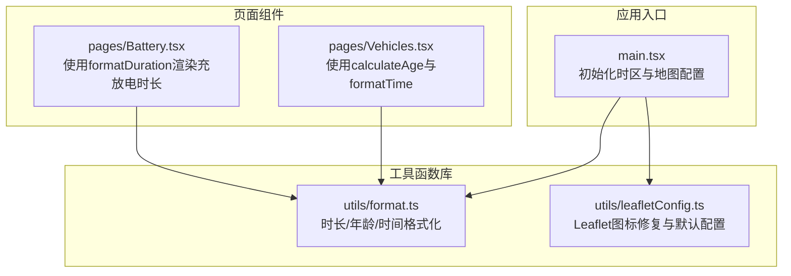
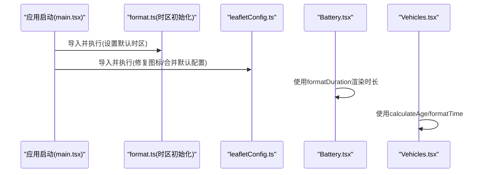
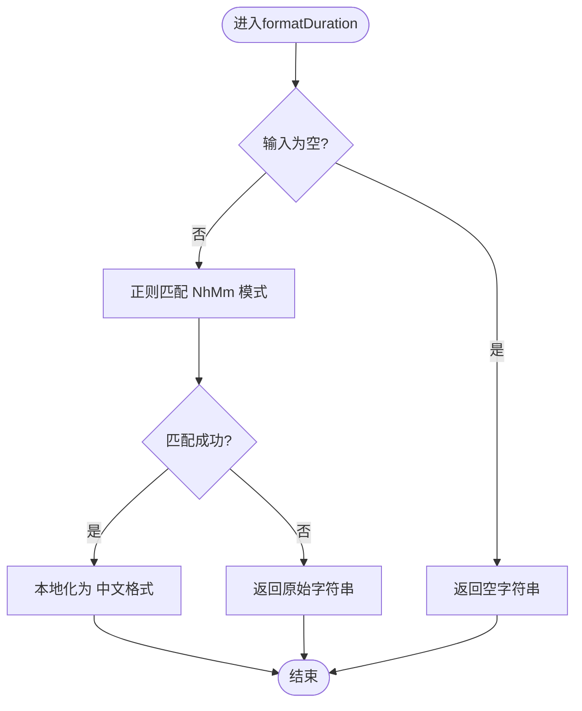
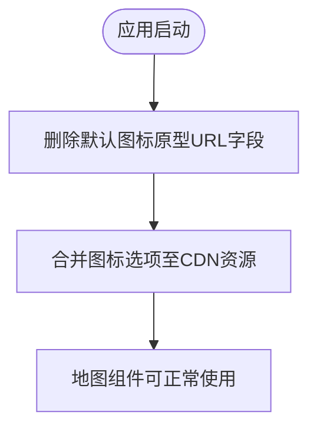
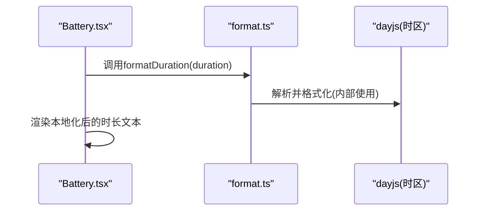
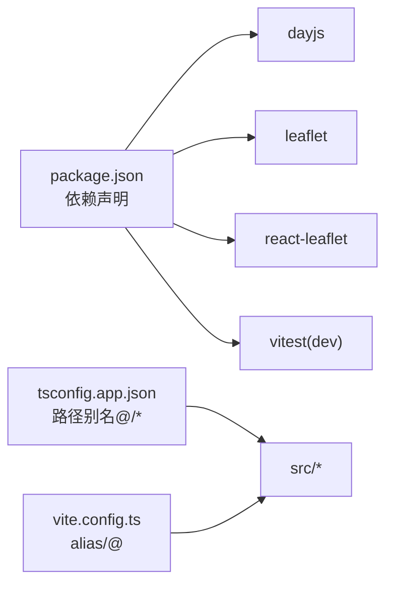

# 工具函数库

<cite>
**本文引用的文件**
- [format.ts](file://weidu-fleet/src/utils/format.ts)
- [format.test.ts](file://weidu-fleet/src/utils/format.test.ts)
- [leafletConfig.ts](file://weidu-fleet/src/utils/leafletConfig.ts)
- [main.tsx](file://weidu-fleet/src/main.tsx)
- [Battery.tsx](file://weidu-fleet/src/pages/Battery.tsx)
- [Vehicles.tsx](file://weidu-fleet/src/pages/Vehicles.tsx)
- [package.json](file://weidu-fleet/package.json)
- [tsconfig.app.json](file://weidu-fleet/tsconfig.app.json)
- [vite.config.ts](file://weidu-fleet/vite.config.ts)
- [index.ts](file://weidu-fleet/src/types/index.ts)
</cite>

## 目录
1. [简介](#简介)
2. [项目结构](#项目结构)
3. [核心组件](#核心组件)
4. [架构总览](#架构总览)
5. [详细组件分析](#详细组件分析)
6. [依赖分析](#依赖分析)
7. [性能考虑](#性能考虑)
8. [故障排查指南](#故障排查指南)
9. [结论](#结论)
10. [附录](#附录)

## 简介
本文件系统性梳理“苇渡-智利车队管理”项目中的工具函数库，重点覆盖以下方面：
- 格式化工具：时长格式化、年龄计算、时间本地化格式化
- 地图配置工具：Leaflet 图标资源修复与默认合并配置
- 通用工具函数的设计原则与实现模式
- 单元测试编写方法与测试覆盖率建议
- 性能优化与错误处理策略
- 扩展与维护指导原则

## 项目结构
工具函数库位于 src/utils 下，分别提供格式化与地图配置两大类工具，并在应用入口统一初始化。

**图表来源**
- [main.tsx:12-16](file://weidu-fleet/src/main.tsx#L12-L16)
- [format.ts:1-27](file://weidu-fleet/src/utils/format.ts#L1-L27)
- [leafletConfig.ts:1-14](file://weidu-fleet/src/utils/leafletConfig.ts#L1-L14)
- [Battery.tsx:7,141](file://weidu-fleet/src/pages/Battery.tsx#L7,L141)
- [Vehicles.tsx:34,155](file://weidu-fleet/src/pages/Vehicles.tsx#L34,L155)

**章节来源**
- [main.tsx:12-16](file://weidu-fleet/src/main.tsx#L12-L16)
- [format.ts:1-27](file://weidu-fleet/src/utils/format.ts#L1-L27)
- [leafletConfig.ts:1-14](file://weidu-fleet/src/utils/leafletConfig.ts#L1-L14)
- [Battery.tsx:7,141](file://weidu-fleet/src/pages/Battery.tsx#L7,L141)
- [Vehicles.tsx:34,155](file://weidu-fleet/src/pages/Vehicles.tsx#L34,L155)

## 核心组件
- 时长格式化：将形如“NhMm”的字符串解析为本地化显示文本，支持大小写与空格容错
- 年龄计算：基于购买日期与当前时间计算车辆车龄（保留一位小数），对无效日期与未来日期进行安全兜底
- 时间格式化：基于 dayjs 的时区本地化输出，确保界面显示与智利时区一致
- 地图配置：修复 Leaflet 在打包环境下的默认图标路径问题，并合并图标资源到 CDN

这些工具被多个页面复用，形成统一的数据展示与交互体验。

**章节来源**
- [format.ts:9-27](file://weidu-fleet/src/utils/format.ts#L9-L27)
- [leafletConfig.ts:3-13](file://weidu-fleet/src/utils/leafletConfig.ts#L3-L13)
- [Battery.tsx:141](file://weidu-fleet/src/pages/Battery.tsx#L141)
- [Vehicles.tsx:155](file://weidu-fleet/src/pages/Vehicles.tsx#L155)

## 架构总览
工具函数库通过应用入口一次性初始化，随后在各页面组件中按需导入使用。Leaflet 配置在应用启动阶段完成，避免后续组件重复处理；格式化工具则以纯函数形式提供，便于在表格列渲染、统计卡片等多处直接调用。

**图表来源**
- [main.tsx:12-16](file://weidu-fleet/src/main.tsx#L12-L16)
- [format.ts:5-7](file://weidu-fleet/src/utils/format.ts#L5-L7)
- [leafletConfig.ts:4-13](file://weidu-fleet/src/utils/leafletConfig.ts#L4-L13)
- [Battery.tsx:7,141](file://weidu-fleet/src/pages/Battery.tsx#L7,L141)
- [Vehicles.tsx:34,155](file://weidu-fleet/src/pages/Vehicles.tsx#L34,L155)

## 详细组件分析

### 组件A：格式化工具库（format.ts）
- 设计原则
  - 纯函数：无副作用，输入输出可预测
  - 容错性：对空值、非法格式与异常输入进行安全返回
  - 可复用：面向 UI 渲染场景（表格列、统计卡片、提示信息）
- 实现要点
  - 时长格式化：正则匹配“NhMm”模式，支持大小写与空格，不匹配时回退原串
  - 年龄计算：基于购买日期与当前时间差，换算为年并保留一位小数，负值或无效日期返回 0
  - 时间格式化：基于 dayjs 的时区本地化输出，确保界面显示与智利时区一致
- 使用场景
  - 充放电记录表：将“时长”字段本地化显示
  - 车辆列表页：将“购买日期”转换为“车龄”展示
  - 监控与仪表盘：统一时间显示格式

**图表来源**
- [format.ts:9-16](file://weidu-fleet/src/utils/format.ts#L9-L16)

**章节来源**
- [format.ts:9-27](file://weidu-fleet/src/utils/format.ts#L9-L27)
- [Battery.tsx:141](file://weidu-fleet/src/pages/Battery.tsx#L141)
- [Vehicles.tsx:155](file://weidu-fleet/src/pages/Vehicles.tsx#L155)

### 组件B：地图配置工具（leafletConfig.ts）
- 设计原则
  - 启动即配置：在应用入口导入一次，避免重复初始化
  - 资源外链：使用 CDN 提升加载稳定性与缓存效率
  - 兼容打包器：解决 webpack/vite 等打包工具下默认图标路径问题
- 实现要点
  - 删除默认图标原型上的内部 URL 字段，避免运行时报错
  - 合并图标资源至 CDN，确保 marker 正常显示
- 最佳实践
  - 在应用根组件导入该配置文件，保证地图组件首次渲染时可用
  - 如需自定义图标，可在业务层二次覆盖样式或替换资源

**图表来源**
- [leafletConfig.ts:4-13](file://weidu-fleet/src/utils/leafletConfig.ts#L4-L13)

**章节来源**
- [leafletConfig.ts:3-13](file://weidu-fleet/src/utils/leafletConfig.ts#L3-L13)
- [main.tsx:16](file://weidu-fleet/src/main.tsx#L16)

### 组件C：使用示例与调用流程
- 页面组件对工具函数的调用
  - 电池页：在充放电记录表列渲染中使用时长格式化
  - 车辆页：在列表列渲染中使用年龄计算与时间格式化
- 初始化流程
  - 应用入口导入格式化与时区初始化，再导入地图配置

**图表来源**
- [Battery.tsx:7,141](file://weidu-fleet/src/pages/Battery.tsx#L7,L141)
- [format.ts:9-16](file://weidu-fleet/src/utils/format.ts#L9-L16)

**章节来源**
- [Battery.tsx:7,141](file://weidu-fleet/src/pages/Battery.tsx#L7,L141)
- [Vehicles.tsx:34,155](file://weidu-fleet/src/pages/Vehicles.tsx#L34,L155)
- [main.tsx:12-16](file://weidu-fleet/src/main.tsx#L12-L16)

## 依赖分析
- 运行时依赖
  - dayjs：用于时间解析与本地化
  - leaflet 与 react-leaflet：地图能力与 React 组件封装
- 开发时依赖
  - vitest：单元测试框架
  - @types/leaflet：地图类型声明
- 路径别名与构建配置
  - TypeScript 路径别名 @/* 指向 src
  - Vite 别名与模块解析策略适配 bundler

**图表来源**
- [package.json:11-26](file://weidu-fleet/package.json#L11-L26)
- [tsconfig.app.json:20-22](file://weidu-fleet/tsconfig.app.json#L20-L22)
- [vite.config.ts:7-11](file://weidu-fleet/vite.config.ts#L7-L11)

**章节来源**
- [package.json:11-26](file://weidu-fleet/package.json#L11-L26)
- [tsconfig.app.json:20-22](file://weidu-fleet/tsconfig.app.json#L20-L22)
- [vite.config.ts:7-11](file://weidu-fleet/vite.config.ts#L7-L11)

## 性能考虑
- 格式化工具
  - 纯函数与轻量依赖：dayjs 插件按需启用，避免额外开销
  - 缓存策略：在高频渲染场景（如表格）中，建议结合 useMemo/useCallback 减少重复计算
- 地图配置
  - CDN 资源：图标资源来自 CDN，减少本地体积与首屏等待
  - 启动即配置：避免在组件内重复初始化，降低运行时抖动
- 构建与打包
  - 使用 bundler 模块解析，配合路径别名提升模块解析效率

[本节为通用性能建议，无需特定文件引用]

## 故障排查指南
- 时区显示异常
  - 确认应用入口已导入格式化模块，且默认时区已设置为智利时区
  - 检查 dayjs 的 locale 与时区插件是否正确加载
- Leaflet 图标缺失或报错
  - 确认已在应用入口导入地图配置模块
  - 检查网络访问与 CDN 可达性
- 表格列渲染异常
  - 对于时长字段，确认传入格式符合“NhMm”模式；否则将回退原串
  - 对于年龄字段，确认传入日期有效且非未来日期

**章节来源**
- [main.tsx:12-16](file://weidu-fleet/src/main.tsx#L12-L16)
- [format.ts:5-7](file://weidu-fleet/src/utils/format.ts#L5-L7)
- [leafletConfig.ts:4-13](file://weidu-fleet/src/utils/leafletConfig.ts#L4-L13)
- [format.ts:9-16](file://weidu-fleet/src/utils/format.ts#L9-L16)

## 结论
工具函数库以简洁、可复用为核心目标，通过统一的初始化流程与清晰的职责划分，支撑了页面组件在数据展示与地图可视化方面的稳定表现。建议在新增工具函数时遵循“纯函数、可测试、可维护”的原则，并配套完善单元测试与类型定义。

[本节为总结性内容，无需特定文件引用]

## 附录

### 单元测试编写方法与覆盖率建议
- 测试框架
  - 使用 vitest 进行单元测试，参考现有测试文件组织方式
- 覆盖率建议
  - 基础功能：时长格式化、年龄计算、时间格式化均应覆盖正常与异常分支
  - 异常分支：空输入、非法格式、未来日期、无效日期等
- 示例参考
  - 时长格式化：标准格式、带空格、不匹配格式、空串
  - 年龄计算：精确到 0.5 年、无效日期、未来日期、当前时间点

**章节来源**
- [format.test.ts:4-45](file://weidu-fleet/src/utils/format.test.ts#L4-L45)

### 类型定义与工具函数的协同
- 类型定义
  - 项目中提供了丰富的业务类型（如 Vehicle、AlertRecord、TripRecord 等），工具函数的输入输出应尽量与之契合
- 单测与类型
  - 在测试中可利用类型约束确保参数与返回值的正确性

**章节来源**
- [index.ts:1-261](file://weidu-fleet/src/types/index.ts#L1-L261)