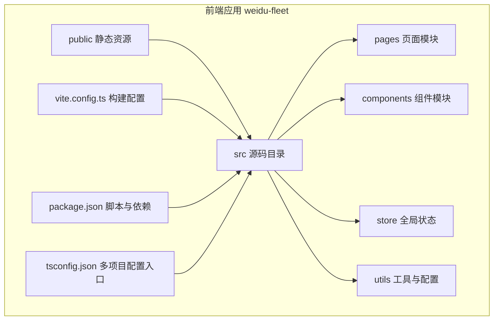
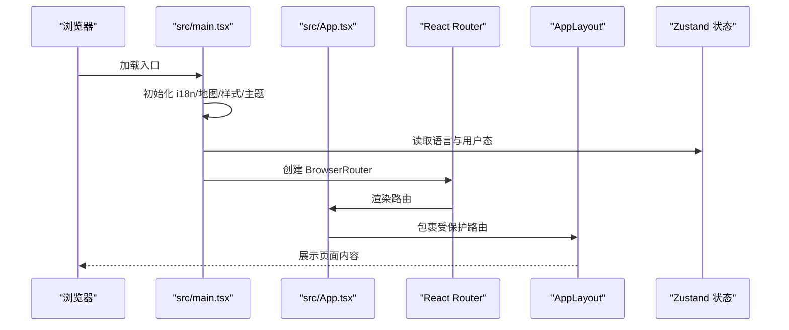
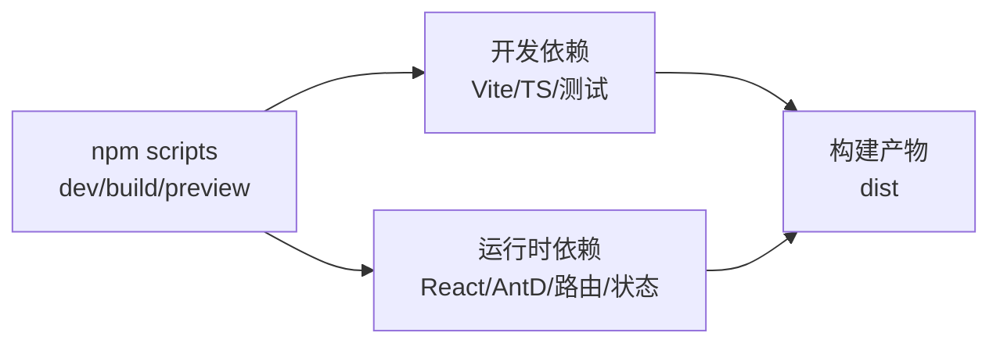
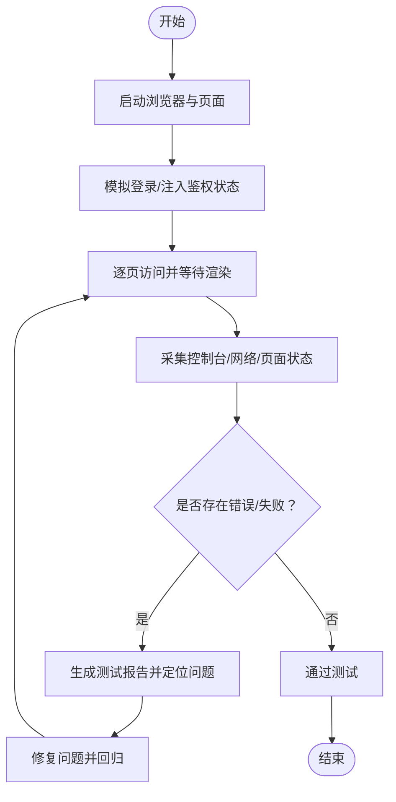

# 开发流程

<cite>
**本文引用的文件**
- [package.json](file://weidu-fleet/package.json)
- [vite.config.ts](file://weidu-fleet/vite.config.ts)
- [tsconfig.json](file://weidu-fleet/tsconfig.json)
- [.gitignore](file://.gitignore)
- [CLAUDE.md](file://CLAUDE.md)
- [test-automation.mjs](file://weidu-fleet/test-automation.mjs)
- [src/main.tsx](file://weidu-fleet/src/main.tsx)
- [src/App.tsx](file://weidu-fleet/src/App.tsx)
- [自动化测试与Bug排查报告-01.md](file://weidu-fleet/自动化测试与Bug排查报告-01.md)
- [自动化测试与Bug排查报告-02.md](file://weidu-fleet/自动化测试与Bug排查报告-02.md)
- [自动化测试与Bug排查报告-04.md](file://weidu-fleet/自动化测试与Bug排查报告-04.md)
- [自动化测试与Bug排查报告-05.md](file://weidu-fleet/自动化测试与Bug排查报告-05.md)
- [自动化测试与Bug排查报告-06.md](file://weidu-fleet/自动化测试与Bug排查报告-06.md)
- [自动化测试与Bug排查报告.md](file://weidu-fleet/自动化测试与Bug排查报告.md)
- [Review_05-测试计划.md](file://Review_05-测试计划.md)
- [智利车队管理平台-测试用例.md](file://智利车队管理平台-测试用例.md)
- [智利车队管理平台_CodeReview报告_03.md](file://智利车队管理平台_CodeReview报告_03.md)
- [智利车队管理平台_React重构版_Review报告_04.md](file://智利车队管理平台_React重构版_Review报告_04.md)
- [苇渡-智利车队管理平台-Review_05报告.md](file://苇渡-智利车队管理平台-Review_05报告.md)
</cite>

## 目录
1. [引言](#引言)
2. [项目结构](#项目结构)
3. [核心组件](#核心组件)
4. [架构总览](#架构总览)
5. [详细组件分析](#详细组件分析)
6. [依赖分析](#依赖分析)
7. [性能考虑](#性能考虑)
8. [故障排查指南](#故障排查指南)
9. [结论](#结论)
10. [附录](#附录)

## 引言
本开发流程文档面向“苇渡-智利车队管理”项目，聚焦于前端工程（React + TypeScript + Vite）的开发规范、分支与提交策略、环境配置与管理、代码审查流程、冲突解决与合并策略、开发工具与调试技巧、团队协作与沟通机制，以及开发效率最佳实践与工具推荐。文档内容基于仓库现有配置与测试脚本进行归纳总结，并提供可操作的落地建议。

## 项目结构
项目采用前后端分离的前端单页应用结构，核心位于 weidu-fleet 目录，使用 Vite 作为构建与开发服务器，TypeScript 提供类型安全，Ant Design 作为 UI 基础组件库，React Router 实现路由懒加载与权限控制，Zustand 管理全局状态，i18n 支持多语言切换。

图表来源
- [vite.config.ts:1-16](file://weidu-fleet/vite.config.ts#L1-L16)
- [package.json:1-41](file://weidu-fleet/package.json#L1-L41)
- [tsconfig.json:1-8](file://weidu-fleet/tsconfig.json#L1-L8)

章节来源
- [package.json:1-41](file://weidu-fleet/package.json#L1-L41)
- [vite.config.ts:1-16](file://weidu-fleet/vite.config.ts#L1-L16)
- [tsconfig.json:1-8](file://weidu-fleet/tsconfig.json#L1-L8)

## 核心组件
- 应用入口与国际化主题：应用在入口处初始化 i18n、地图配置、全局样式与 Ant Design 主题，并根据当前语言动态设置日期本地化。
- 路由与权限：通过 React Router 的懒加载与受保护路由包装实现页面级权限控制；登录页无需认证，其余页面统一包裹布局组件。
- 全局状态：使用 Zustand 管理语言、用户态等全局状态，支持持久化存储。
- 构建与开发：Vite 提供开发服务器与打包能力，TypeScript 多项目配置拆分应用与 Node 工具链。

章节来源
- [src/main.tsx:1-49](file://weidu-fleet/src/main.tsx#L1-L49)
- [src/App.tsx:1-88](file://weidu-fleet/src/App.tsx#L1-L88)

## 架构总览
下图展示从浏览器启动到页面渲染的关键路径，包括国际化、主题、路由与状态初始化。

图表来源
- [src/main.tsx:19-42](file://weidu-fleet/src/main.tsx#L19-L42)
- [src/App.tsx:36-84](file://weidu-fleet/src/App.tsx#L36-L84)

## 详细组件分析

### 代码规范与风格
- 设计原则与简化：遵循“先思考再编码、最小可用、精准修改、目标驱动”的行为准则，避免过度设计与无关重构。
- 一致性：保持与既有风格一致，不随意改动相邻代码或格式；变更应直接服务于需求。
- 可验证性：以可验证的成功标准推进任务，形成“定义标准—执行—验证”的闭环。

章节来源
- [CLAUDE.md:1-66](file://CLAUDE.md#L1-L66)

### 分支管理策略
- 基线分支：以 main 作为稳定基线，发布前通过拉取请求（Pull Request）合并。
- 功能分支：按功能点创建短期分支，命名建议采用“feat/描述”“fix/描述”“docs/描述”等语义化前缀。
- 预发布分支：hotfix 或 release/* 用于紧急修复与预发布准备。
- 冲突预防：频繁同步主干，减少长周期分支带来的合并成本。

### 提交规范
- 类型与范围：feat、fix、docs、style、refactor、perf、test、build、ci、chore、revert。
- 描述简洁明确，必要时补充背景与影响范围；引用相关 Issue 或需求链接。
- 提交前自检：运行测试与格式校验，确保无破坏性变更。

### 环境配置与管理
- 忽略项：.gitignore 明确忽略 node_modules、dist、VSCode 缓存与本地环境变量文件，避免污染仓库。
- 本地开发：Vite 默认监听 3000 端口；如需调整，请在本地复制 .env 并按需覆盖默认值。
- 生产构建：通过 npm scripts 执行 TypeScript 编译与 Vite 打包，产物输出至 dist。

章节来源
- [.gitignore:1-10](file://.gitignore#L1-L10)
- [vite.config.ts:12-14](file://weidu-fleet/vite.config.ts#L12-L14)
- [package.json:6-10](file://weidu-fleet/package.json#L6-L10)

### 代码审查流程
- 触发与范围：所有跨分支的合并均需 PR 审查，涉及核心路由、状态、国际化与地图配置的变更优先审查。
- 审查清单：是否满足需求、是否有回归风险、是否符合规范、是否具备可验证的测试依据。
- 结果处理：通过 CI 与本地验证后方可合并；阻塞项需在合并前解决。

### 冲突解决与版本合并策略
- 预防：小步快跑、频繁同步主干；复杂改动拆分为多个 PR。
- 解决：优先使用 rebase 保持线性历史；冲突集中在路由、状态与国际化时，优先对齐接口与键名。
- 回滚：谨慎使用 revert，必要时配合 hotfix 分支快速恢复。

### 开发工具配置与 IDE 设置
- 路径别名：Vite 配置 @ 指向 src，便于统一导入路径，降低层级过深导致的相对路径混乱。
- TypeScript 多项目：通过 tsconfig.json 引用应用与 Node 工具链配置，确保编译与类型检查一致性。
- 插件生态：React 插件与热更新开箱即用；建议在 IDE 中启用 TypeScript/ESLint/Prettier 插件以获得即时反馈。

章节来源
- [vite.config.ts:7-11](file://weidu-fleet/vite.config.ts#L7-L11)
- [tsconfig.json:3-6](file://weidu-fleet/tsconfig.json#L3-L6)

### 调试技巧
- 路由与状态：利用浏览器开发者工具观察路由跳转与状态变化；在入口处设置断点验证语言与主题初始化。
- 网络与错误：结合自动化测试脚本中的网络失败与控制台错误收集，定位接口异常与渲染错误。
- 地图与国际化：确认地图配置与 i18n 初始化顺序，避免渲染阶段出现样式或文案错乱。

章节来源
- [src/main.tsx:19-42](file://weidu-fleet/src/main.tsx#L19-L42)
- [test-automation.mjs:57-112](file://weidu-fleet/test-automation.mjs#L57-L112)

### 团队协作规范与沟通机制
- 计划与评审：使用测试计划与用例文档明确验收标准，评审阶段提出边界条件与潜在风险。
- 文档协同：将测试报告、代码评审报告与回顾报告沉淀为知识资产，持续改进流程。
- 沟通渠道：Issue/PR 讨论、站会同步进展、评审会议对齐方案。

章节来源
- [Review_05-测试计划.md](file://Review_05-测试计划.md)
- [智利车队管理平台-测试用例.md](file://智利车队管理平台-测试用例.md)
- [苇渡-智利车队管理平台-Review_05报告.md](file://苇渡-智利车队管理平台-Review_05报告.md)

### 开发效率提升最佳实践与工具推荐
- 自动化测试：使用 Puppeteer 对全菜单进行端到端遍历，自动收集控制台错误与网络失败，生成可读的测试报告。
- 本地联调：通过本地 .env 覆盖默认端口与服务地址，缩短联调等待时间。
- 代码质量：结合 ESLint/Prettier 与 TypeScript 编译器，提前暴露类型与风格问题。
- 版本与发布：使用语义化版本与变更日志，配合 PR 标签与里程碑管理发布节奏。

章节来源
- [test-automation.mjs:1-321](file://weidu-fleet/test-automation.mjs#L1-L321)

## 依赖分析
- 运行时依赖：React 生态、Ant Design、Chart.js、React Router、Axios、XLSX、Zustand、i18n 与 Leaflet。
- 开发依赖：Vite、React 插件、TypeScript、Testing Library、JSDOM、Vitest。
- 构建与运行：npm scripts 提供 dev/build/preview 三类命令；Vite 别名与端口配置清晰。

图表来源
- [package.json:27-39](file://weidu-fleet/package.json#L27-L39)
- [package.json:11-26](file://weidu-fleet/package.json#L11-L26)
- [package.json:6-10](file://weidu-fleet/package.json#L6-L10)

章节来源
- [package.json:1-41](file://weidu-fleet/package.json#L1-L41)

## 性能考虑
- 路由懒加载：通过 React.lazy 与 Suspense 减少首屏体积与初次渲染压力。
- 图表与地图：按需引入 Chart.js 与 React-Leaflet，避免不必要的包体增长。
- 构建优化：Vite 默认开启压缩与资源内联策略；生产构建前建议进行体积分析与缓存策略评估。

## 故障排查指南
- 控制台错误：自动化测试脚本会过滤已知无害警告并记录错误堆栈，优先排查高危错误与重复出现的问题。
- 网络失败：关注 4xx/5xx 请求与超时，结合后端日志定位接口异常。
- 页面状态快照：测试脚本记录页面标题、URL 与正文预览，辅助快速定位渲染异常。
- 登录与鉴权：若登录后重定向异常，检查本地存储与状态注入逻辑，确保路由守卫生效。

图表来源
- [test-automation.mjs:114-247](file://weidu-fleet/test-automation.mjs#L114-L247)

章节来源
- [test-automation.mjs:1-321](file://weidu-fleet/test-automation.mjs#L1-L321)

## 结论
本流程文档围绕代码规范、分支与提交策略、环境配置、代码审查、冲突解决与合并策略、开发工具与调试、团队协作与效率提升等方面提供了系统化的指导。建议团队在实践中持续沉淀测试报告与评审记录，逐步完善自动化与标准化流程，保障项目高质量交付。

## 附录
- 测试报告归档：项目包含多期自动化测试与 Bug 排查报告，建议在每次迭代后归档并对比问题收敛情况。
- 评审与回顾：将代码评审与平台回顾报告纳入知识库，形成可追溯的质量闭环。

章节来源
- [自动化测试与Bug排查报告-01.md](file://weidu-fleet/自动化测试与Bug排查报告-01.md)
- [自动化测试与Bug排查报告-02.md](file://weidu-fleet/自动化测试与Bug排查报告-02.md)
- [自动化测试与Bug排查报告-04.md](file://weidu-fleet/自动化测试与Bug排查报告-04.md)
- [自动化测试与Bug排查报告-05.md](file://weidu-fleet/自动化测试与Bug排查报告-05.md)
- [自动化测试与Bug排查报告-06.md](file://weidu-fleet/自动化测试与Bug排查报告-06.md)
- [自动化测试与Bug排查报告.md](file://weidu-fleet/自动化测试与Bug排查报告.md)
- [智利车队管理平台_CodeReview报告_03.md](file://智利车队管理平台_CodeReview报告_03.md)
- [智利车队管理平台_React重构版_Review报告_04.md](file://智利车队管理平台_React重构版_Review报告_04.md)
- [苇渡-智利车队管理平台-Review_05报告.md](file://苇渡-智利车队管理平台-Review_05报告.md)