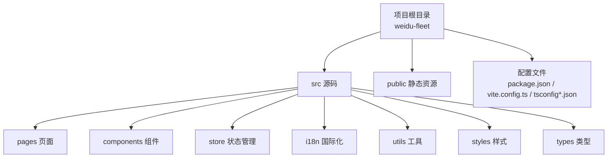
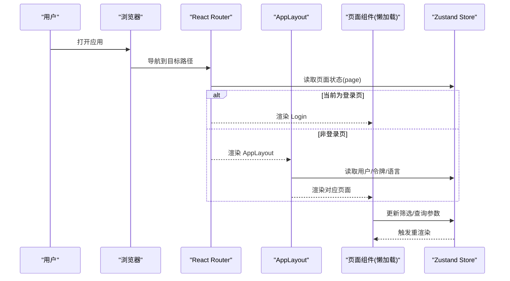
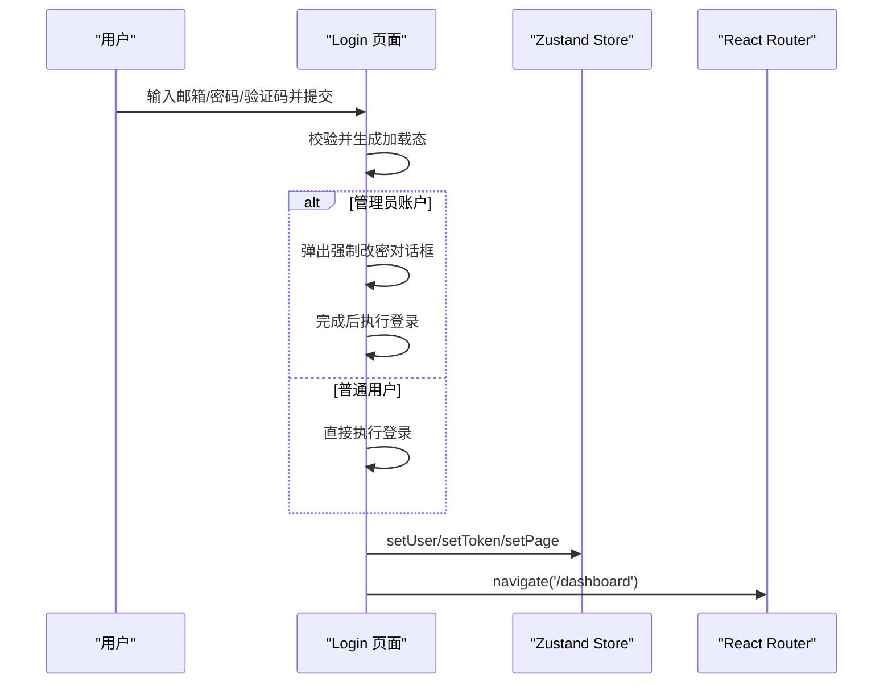
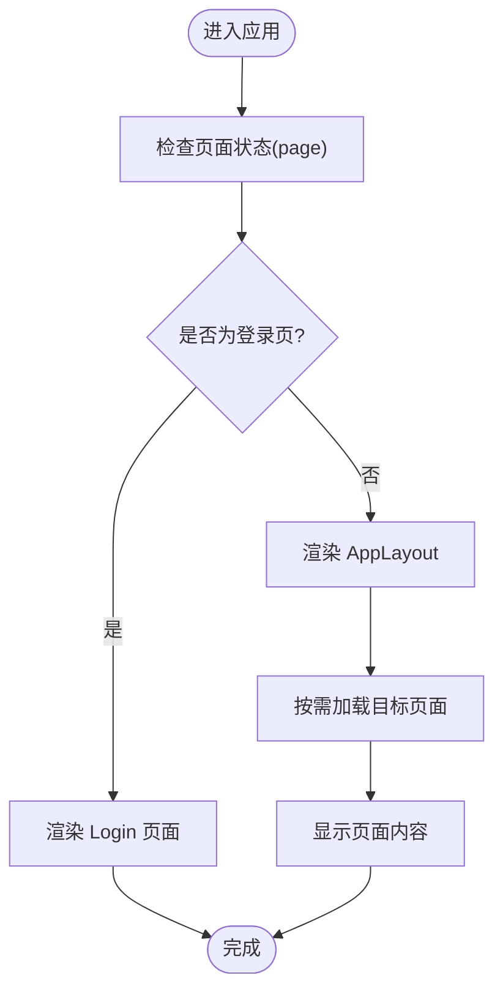
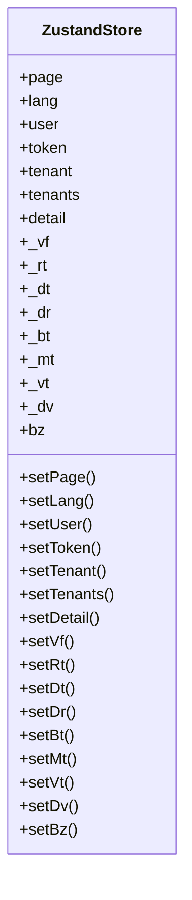
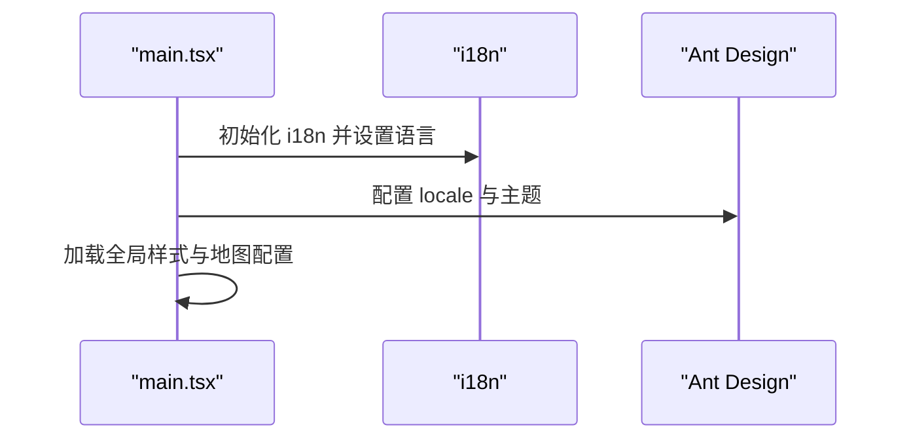
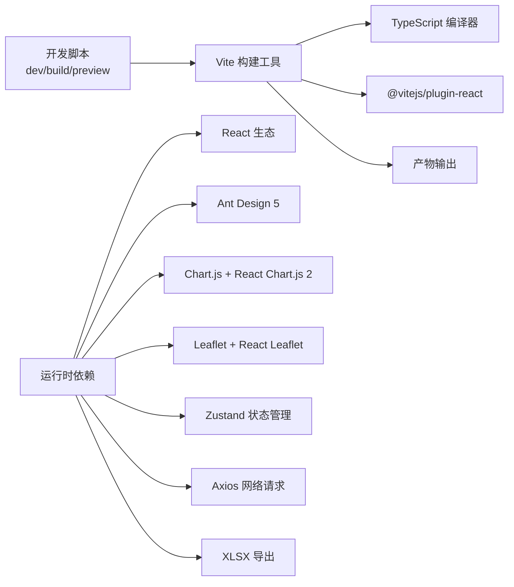

# 快速开始

<cite>
**本文引用的文件**
- [package.json](file://weidu-fleet/package.json)
- [vite.config.ts](file://weidu-fleet/vite.config.ts)
- [tsconfig.json](file://weidu-fleet/tsconfig.json)
- [tsconfig.app.json](file://weidu-fleet/tsconfig.app.json)
- [tsconfig.node.json](file://weidu-fleet/tsconfig.node.json)
- [src/main.tsx](file://weidu-fleet/src/main.tsx)
- [src/App.tsx](file://weidu-fleet/src/App.tsx)
- [src/pages/Login.tsx](file://weidu-fleet/src/pages/Login.tsx)
- [src/components/Layout/AppLayout.tsx](file://weidu-fleet/src/components/Layout/AppLayout.tsx)
- [src/store/useAppStore.ts](file://weidu-fleet/src/store/useAppStore.ts)
- [src/i18n/index.ts](file://weidu-fleet/src/i18n/index.ts)
</cite>

## 目录
1. [简介](#简介)
2. [项目结构](#项目结构)
3. [核心组件](#核心组件)
4. [架构总览](#架构总览)
5. [详细组件分析](#详细组件分析)
6. [依赖分析](#依赖分析)
7. [性能考虑](#性能考虑)
8. [故障排除指南](#故障排除指南)
9. [结论](#结论)
10. [附录](#附录)

## 简介
本指南面向新手开发者，帮助你在本地快速搭建“苇渡-智利车队管理”项目的开发环境，并完成依赖安装、开发服务器启动、生产构建与预览部署等全流程操作。项目基于 React 18、TypeScript、Vite 6 与 Ant Design 5 构建，采用 Zustand 状态管理、i18n 国际化以及 React Router v6 路由系统。

## 项目结构
- 项目位于 weidu-fleet 目录，包含前端源码、类型定义、国际化资源、样式与构建配置。
- 关键目录与文件：
  - src：源代码根目录，包含页面、组件、布局、状态管理、国际化、工具与全局样式。
  - public：静态资源目录（如 index.html）。
  - 配置文件：package.json、vite.config.ts、tsconfig*.json。
  - 测试与自动化脚本：test-automation.mjs、多个 Markdown 报告文件。

**章节来源**
- [package.json:1-41](file://weidu-fleet/package.json#L1-L41)
- [vite.config.ts:1-16](file://weidu-fleet/vite.config.ts#L1-L16)
- [tsconfig.json:1-8](file://weidu-fleet/tsconfig.json#L1-L8)

## 核心组件
- 应用入口与路由：
  - 入口文件负责初始化 Ant Design 主题、国际化、Leaflet 地图配置与全局样式，并挂载 React 应用。
  - App.tsx 使用 React.lazy 实现页面级懒加载，结合 Suspense 提供加载态，路由覆盖登录、仪表盘、车辆、监控、风险、驾驶、电池、行程、围栏、维修、租户、业务、系统等模块。
- 登录页与认证演示：
  - Login.tsx 提供邮箱、密码、验证码表单，支持管理员初始密码强制修改流程，模拟登录成功后跳转至仪表盘。
- 布局与导航：
  - AppLayout.tsx 提供侧边栏与顶部栏布局，根据应用状态决定是否渲染登录页或主内容区。
- 状态管理：
  - useAppStore.ts 使用 Zustand + persist，持久化用户、语言、令牌与筛选参数等状态。
- 国际化：
  - i18n/index.ts 初始化 i18next，从本地存储恢复语言设置，默认语言为中文，回退语言为英文。

**章节来源**
- [src/main.tsx:1-49](file://weidu-fleet/src/main.tsx#L1-L49)
- [src/App.tsx:1-88](file://weidu-fleet/src/App.tsx#L1-L88)
- [src/pages/Login.tsx:1-167](file://weidu-fleet/src/pages/Login.tsx#L1-L167)
- [src/components/Layout/AppLayout.tsx:1-85](file://weidu-fleet/src/components/Layout/AppLayout.tsx#L1-L85)
- [src/store/useAppStore.ts:1-87](file://weidu-fleet/src/store/useAppStore.ts#L1-L87)
- [src/i18n/index.ts:1-30](file://weidu-fleet/src/i18n/index.ts#L1-L30)

## 架构总览
下图展示了从浏览器访问到页面渲染的关键交互路径，包括路由、懒加载、布局与状态管理的协作关系。

**图表来源**
- [src/App.tsx:36-84](file://weidu-fleet/src/App.tsx#L36-L84)
- [src/components/Layout/AppLayout.tsx:10-31](file://weidu-fleet/src/components/Layout/AppLayout.tsx#L10-L31)
- [src/store/useAppStore.ts:40-85](file://weidu-fleet/src/store/useAppStore.ts#L40-L85)

## 详细组件分析

### 登录流程与演示认证
- 功能要点：
  - 表单包含邮箱、密码、验证码字段；验证码可刷新。
  - 管理员账户触发强制修改密码弹窗，完成后自动登录。
  - 登录成功后写入用户信息与令牌，切换到仪表盘。
- 关键行为：
  - 使用 Ant Design 的表单组件与图标。
  - 通过 Zustand 设置当前页面与用户状态。
  - 使用 React Router 导航到目标路径。

**图表来源**
- [src/pages/Login.tsx:32-57](file://weidu-fleet/src/pages/Login.tsx#L32-L57)
- [src/store/useAppStore.ts:59-74](file://weidu-fleet/src/store/useAppStore.ts#L59-L74)
- [src/App.tsx:44-50](file://weidu-fleet/src/App.tsx#L44-L50)

**章节来源**
- [src/pages/Login.tsx:1-167](file://weidu-fleet/src/pages/Login.tsx#L1-L167)
- [src/store/useAppStore.ts:1-87](file://weidu-fleet/src/store/useAppStore.ts#L1-L87)
- [src/App.tsx:36-84](file://weidu-fleet/src/App.tsx#L36-L84)

### 路由与懒加载策略
- 路由规则：
  - 登录路由无需鉴权，其他路由均在 AppLayout 包裹下受保护。
  - 支持根路径重定向至仪表盘，未知路径统一跳转至仪表盘。
- 懒加载与加载态：
  - 页面组件通过 React.lazy 按需加载，配合 Suspense 提供加载指示器。

**图表来源**
- [src/App.tsx:40-84](file://weidu-fleet/src/App.tsx#L40-L84)
- [src/components/Layout/AppLayout.tsx:20-31](file://weidu-fleet/src/components/Layout/AppLayout.tsx#L20-L31)

**章节来源**
- [src/App.tsx:1-88](file://weidu-fleet/src/App.tsx#L1-L88)
- [src/components/Layout/AppLayout.tsx:1-85](file://weidu-fleet/src/components/Layout/AppLayout.tsx#L1-L85)

### 状态管理与持久化
- 状态域概览：
  - 页面状态、语言、用户、令牌、租户、详情、筛选参数等。
- 持久化策略：
  - 仅持久化用户、令牌、语言与租户等关键信息，避免存储过多数据。
- 更新方式：
  - 通过一组 setter 方法更新状态，页面组件订阅所需字段以触发重渲染。

**图表来源**
- [src/store/useAppStore.ts:5-38](file://weidu-fleet/src/store/useAppStore.ts#L5-L38)

**章节来源**
- [src/store/useAppStore.ts:1-87](file://weidu-fleet/src/store/useAppStore.ts#L1-L87)

### 国际化与主题初始化
- 国际化：
  - 从本地存储恢复语言设置，若无则默认中文，回退英文。
  - 支持中/英/西三种语言资源。
- 主题与语言包：
  - Ant Design 主题与语言包在入口处初始化，随应用状态动态切换语言。

**图表来源**
- [src/main.tsx:19-41](file://weidu-fleet/src/main.tsx#L19-L41)
- [src/i18n/index.ts:22-27](file://weidu-fleet/src/i18n/index.ts#L22-L27)

**章节来源**
- [src/main.tsx:1-49](file://weidu-fleet/src/main.tsx#L1-L49)
- [src/i18n/index.ts:1-30](file://weidu-fleet/src/i18n/index.ts#L1-L30)

## 依赖分析
- 运行时依赖（节选）：
  - React 18、React DOM、React Router DOM、Ant Design 5、Ant Design Icons、Axios、Chart.js、React Chart.js 2、React Leaflet、Leaflet、XLSX、Zustand。
- 开发依赖（节选）：
  - TypeScript、Vite 6、@vitejs/plugin-react、Testing Library、JSDOM、Vitest。
- 构建与脚本：
  - dev：Vite 开发服务器（端口 3000）。
  - build：TypeScript 编译 + Vite 构建。
  - preview：Vite 预览生产包。

**图表来源**
- [package.json:6-10](file://weidu-fleet/package.json#L6-L10)
- [package.json:11-26](file://weidu-fleet/package.json#L11-L26)
- [package.json:27-39](file://weidu-fleet/package.json#L27-L39)
- [vite.config.ts:5-15](file://weidu-fleet/vite.config.ts#L5-L15)

**章节来源**
- [package.json:1-41](file://weidu-fleet/package.json#L1-L41)
- [vite.config.ts:1-16](file://weidu-fleet/vite.config.ts#L1-L16)
- [tsconfig.app.json:1-27](file://weidu-fleet/tsconfig.app.json#L1-L27)
- [tsconfig.node.json:1-21](file://weidu-fleet/tsconfig.node.json#L1-L21)

## 性能考虑
- 懒加载页面组件减少首屏体积，提升初始加载速度。
- TypeScript 严格模式与 noUncheckedIndexedAccess 等选项有助于提前发现潜在问题。
- Vite 默认启用按需编译与热更新，开发体验更佳。
- 建议在生产构建后进行性能分析与代码分割优化（如按需引入图表/地图库）。

## 故障排除指南
- 启动失败（端口占用）
  - Vite 默认监听 3000 端口，若被占用请调整端口或释放端口。
  - 参考配置：[vite.config.ts:12-14](file://weidu-fleet/vite.config.ts#L12-L14)
- 依赖安装异常
  - 确保使用 Node.js 与包管理器版本满足项目要求（见下一节）。
  - 清理缓存后重试：删除 node_modules 与 lock 文件，重新安装。
- 国际化语言不生效
  - 检查本地存储中的语言键值是否存在，必要时清除后重试。
  - 参考初始化逻辑：[src/i18n/index.ts:7-20](file://weidu-fleet/src/i18n/index.ts#L7-L20)
- 登录后仍跳转到登录页
  - 确认 Store 中 page、user、token 是否正确设置。
  - 参考登录流程：[src/pages/Login.tsx:46-51](file://weidu-fleet/src/pages/Login.tsx#L46-L51)，[src/store/useAppStore.ts:59-74](file://weidu-fleet/src/store/useAppStore.ts#L59-L74)

**章节来源**
- [vite.config.ts:12-14](file://weidu-fleet/vite.config.ts#L12-L14)
- [src/i18n/index.ts:7-20](file://weidu-fleet/src/i18n/index.ts#L7-L20)
- [src/pages/Login.tsx:46-51](file://weidu-fleet/src/pages/Login.tsx#L46-L51)
- [src/store/useAppStore.ts:59-74](file://weidu-fleet/src/store/useAppStore.ts#L59-L74)

## 结论
按照本指南完成环境准备与依赖安装后，你可以在本地顺利启动开发服务器、浏览应用、进行功能验证，并完成生产构建与预览。建议在开发过程中关注路由懒加载、状态持久化与国际化初始化等关键点，以获得稳定一致的开发体验。

## 附录

### 开发环境要求
- Node.js 版本：建议使用 LTS 版本（如 18.x 或 20.x），以确保与 TypeScript 5 与 Vite 6 兼容。
- 包管理器：推荐使用 npm 9+ 或 pnpm 8+，yarn 也可用但不作为默认首选。
- 其他：确保系统已安装 Git，用于克隆仓库。

### 依赖安装步骤
- 步骤 1：克隆仓库到本地
  - 使用 Git 将项目克隆到本地目录。
- 步骤 2：进入项目目录
  - 切换到 weidu-fleet 子目录。
- 步骤 3：安装依赖
  - 使用 npm 或 pnpm 安装依赖（推荐使用 pnpm 以获得更快的安装速度与更小的磁盘占用）。
- 步骤 4：安装完成
  - 依赖安装完成后，即可进入下一步。

**章节来源**
- [package.json:1-41](file://weidu-fleet/package.json#L1-L41)

### 开发服务器启动流程
- 启动开发服务器
  - 在 weidu-fleet 目录下执行开发脚本，Vite 将启动本地服务并打开浏览器。
  - 默认端口为 3000，可在配置中调整。
- 访问应用
  - 浏览器访问 http://localhost:3000 即可看到登录页。
- 环境变量与代理
  - 若需要后端接口联调，可在 Vite 配置中添加代理规则（如需）。

**章节来源**
- [package.json:6-10](file://weidu-fleet/package.json#L6-L10)
- [vite.config.ts:12-14](file://weidu-fleet/vite.config.ts#L12-L14)

### 生产构建与预览部署
- 生产构建
  - 执行构建脚本生成生产包，产物位于默认 dist 目录。
- 预览生产包
  - 使用 Vite 预览命令在本地查看生产包效果，便于快速验证。
- 部署建议
  - 将 dist 目录部署到静态站点托管服务（如 Vercel、Netlify、Nginx）或容器镜像中。
  - 如需服务端渲染或 API 聚合，请另行配置后端服务。

**章节来源**
- [package.json:6-10](file://weidu-fleet/package.json#L6-L10)