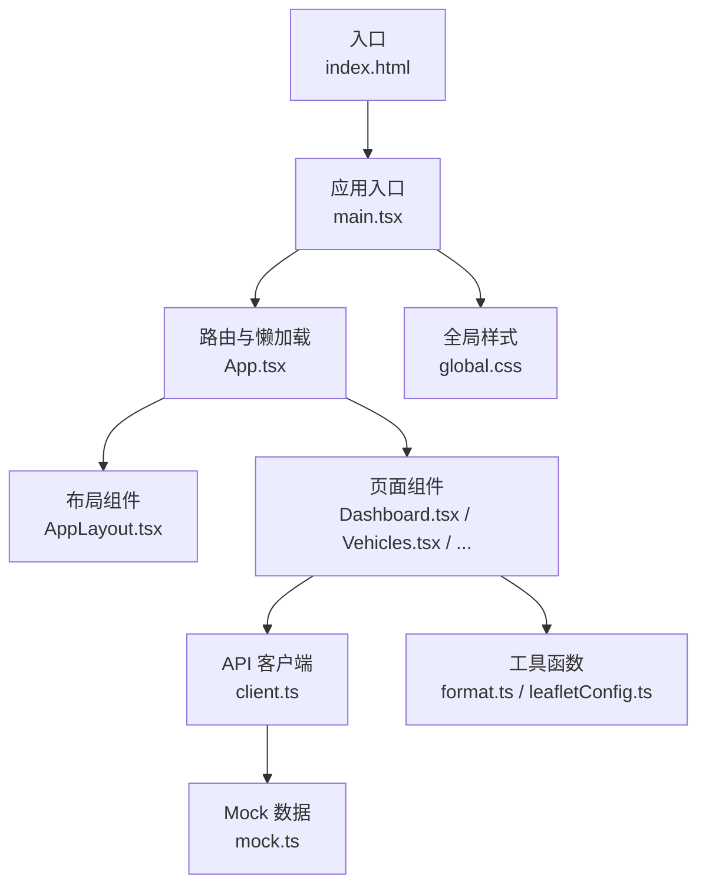
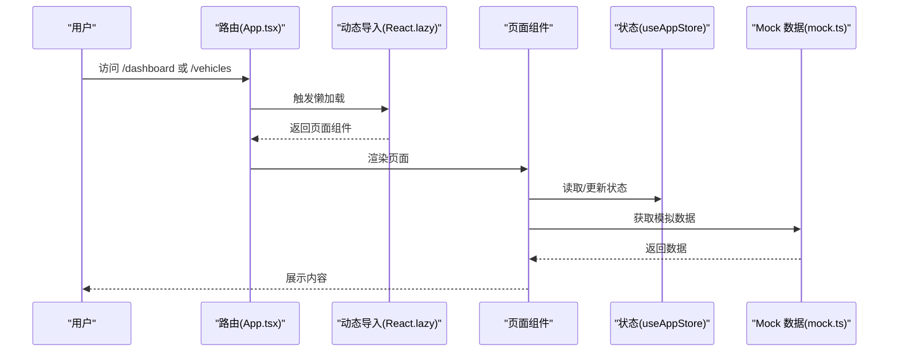
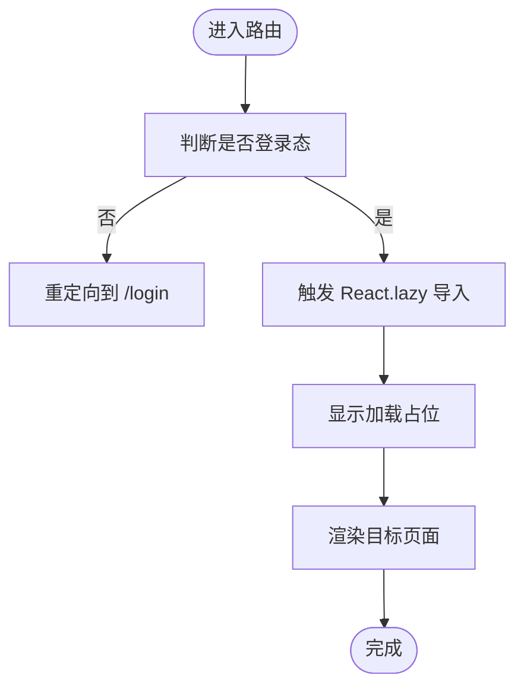
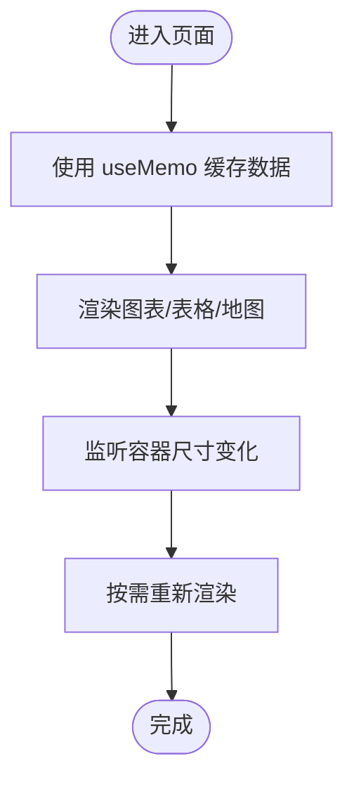
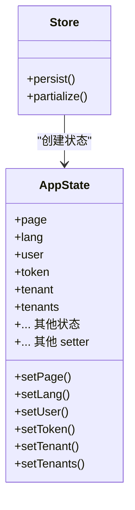
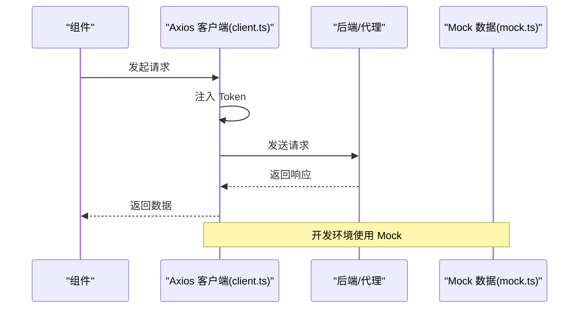
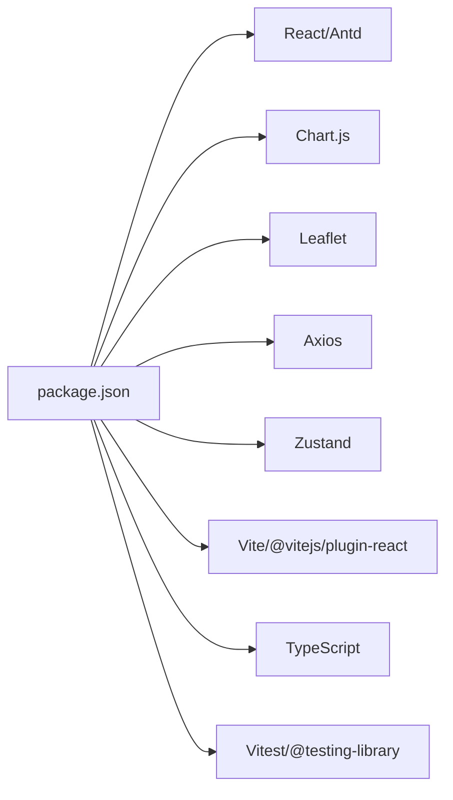

# 性能优化

<cite>
**本文引用的文件**
- [package.json](file://weidu-fleet/package.json)
- [vite.config.ts](file://weidu-fleet/vite.config.ts)
- [main.tsx](file://weidu-fleet/src/main.tsx)
- [App.tsx](file://weidu-fleet/src/App.tsx)
- [useAppStore.ts](file://weidu-fleet/src/store/useAppStore.ts)
- [AppLayout.tsx](file://weidu-fleet/src/components/Layout/AppLayout.tsx)
- [Vehicles.tsx](file://weidu-fleet/src/pages/Vehicles.tsx)
- [Dashboard.tsx](file://weidu-fleet/src/pages/Dashboard.tsx)
- [client.ts](file://weidu-fleet/src/api/client.ts)
- [mock.ts](file://weidu-fleet/src/api/mock.ts)
- [format.ts](file://weidu-fleet/src/utils/format.ts)
- [leafletConfig.ts](file://weidu-fleet/src/utils/leafletConfig.ts)
- [global.css](file://weidu-fleet/src/styles/global.css)
- [index.html](file://weidu-fleet/index.html)
</cite>

## 目录
1. [引言](#引言)
2. [项目结构](#项目结构)
3. [核心组件](#核心组件)
4. [架构总览](#架构总览)
5. [详细组件分析](#详细组件分析)
6. [依赖分析](#依赖分析)
7. [性能考虑](#性能考虑)
8. [故障排查指南](#故障排查指南)
9. [结论](#结论)
10. [附录](#附录)

## 引言
本指南面向“苇渡-智利车队管理”项目，聚焦前端性能优化，系统阐述代码分割、懒加载与按需加载策略；构建期优化、资源压缩与缓存策略；内存与渲染性能最佳实践；性能监控与指标分析；用户体验与首屏加载优化；性能测试与回归检测方法，并结合项目现状给出可落地的优化建议与效果对比思路。

## 项目结构
项目采用 Vite + React + TypeScript 技术栈，路由基于 React Router，UI 使用 Ant Design，图表使用 Chart.js，地图使用 Leaflet。全局样式通过全局 CSS 文件统一字体与字号，国际化通过 i18next 配置，地图图标通过 Leaflet 的默认图标修复避免打包问题。

图示来源
- [index.html](file://weidu-fleet/index.html)
- [main.tsx](file://weidu-fleet/src/main.tsx)
- [App.tsx](file://weidu-fleet/src/App.tsx)
- [AppLayout.tsx](file://weidu-fleet/src/components/Layout/AppLayout.tsx)
- [Dashboard.tsx](file://weidu-fleet/src/pages/Dashboard.tsx)
- [Vehicles.tsx](file://weidu-fleet/src/pages/Vehicles.tsx)
- [client.ts](file://weidu-fleet/src/api/client.ts)
- [mock.ts](file://weidu-fleet/src/api/mock.ts)
- [format.ts](file://weidu-fleet/src/utils/format.ts)
- [leafletConfig.ts](file://weidu-fleet/src/utils/leafletConfig.ts)
- [global.css](file://weidu-fleet/src/styles/global.css)

章节来源
- [package.json:1-41](file://weidu-fleet/package.json#L1-L41)
- [vite.config.ts:1-16](file://weidu-fleet/vite.config.ts#L1-L16)
- [main.tsx:1-49](file://weidu-fleet/src/main.tsx#L1-L49)
- [App.tsx:1-88](file://weidu-fleet/src/App.tsx#L1-L88)

## 核心组件
- 应用入口与国际化：在入口初始化语言、主题、Leaflet 图标与全局样式，确保首屏渲染一致性。
- 路由与懒加载：所有页面组件均通过 React.lazy 动态导入，配合 Suspense 提供加载占位。
- 布局与导航：AppLayout 统一侧边栏、顶部栏与内容区域，减少重复渲染。
- 页面与图表/地图：Dashboard 同时渲染柱状图与地图，注意图表与地图的渲染时机与尺寸计算。
- 状态管理：Zustand Store 仅持久化必要字段，避免存储体积膨胀导致的序列化成本。
- 工具与配置：Leaflet 图标修复、时区与格式化工具，减少运行时开销。

章节来源
- [main.tsx:1-49](file://weidu-fleet/src/main.tsx#L1-L49)
- [App.tsx:1-88](file://weidu-fleet/src/App.tsx#L1-L88)
- [AppLayout.tsx:1-85](file://weidu-fleet/src/components/Layout/AppLayout.tsx#L1-L85)
- [Dashboard.tsx:1-257](file://weidu-fleet/src/pages/Dashboard.tsx#L1-L257)
- [useAppStore.ts:1-87](file://weidu-fleet/src/store/useAppStore.ts#L1-L87)
- [leafletConfig.ts:1-14](file://weidu-fleet/src/utils/leafletConfig.ts#L1-L14)
- [format.ts:1-27](file://weidu-fleet/src/utils/format.ts#L1-L27)

## 架构总览
下图展示从用户交互到页面渲染的关键路径，以及懒加载与状态管理对性能的影响。

图示来源
- [App.tsx:7-21](file://weidu-fleet/src/App.tsx#L7-L21)
- [Dashboard.tsx:25-40](file://weidu-fleet/src/pages/Dashboard.tsx#L25-L40)
- [Vehicles.tsx:32-64](file://weidu-fleet/src/pages/Vehicles.tsx#L32-L64)
- [useAppStore.ts:40-75](file://weidu-fleet/src/store/useAppStore.ts#L40-L75)
- [mock.ts:27-51](file://weidu-fleet/src/api/mock.ts#L27-L51)

## 详细组件分析

### 路由与懒加载（App.tsx）
- 实现策略
  - 所有页面组件通过 React.lazy 动态导入，降低初始包体。
  - 使用 Suspense 提供统一加载占位，避免白屏或闪烁。
  - 登录页与受保护页面分离，登录态变化触发重定向，减少不必要的渲染。
- 性能影响
  - 初次加载仅包含基础壳与布局，页面级资源按需下载。
  - 加载占位提升感知性能，改善用户体验。
- 优化建议
  - 对于高频访问页面（如 Dashboard），可考虑预取或预加载策略。
  - 将第三方库拆分为独立 chunk，避免与业务代码耦合。

图示来源
- [App.tsx:36-84](file://weidu-fleet/src/App.tsx#L36-L84)

章节来源
- [App.tsx:1-88](file://weidu-fleet/src/App.tsx#L1-L88)

### 页面组件与渲染性能（Dashboard.tsx / Vehicles.tsx）
- 实现策略
  - 使用 useMemo 缓存静态或昂贵计算结果，减少重复渲染。
  - 表格与图表组件按需渲染，避免全量刷新。
  - 地图组件在容器尺寸确定后再渲染，防止首次渲染尺寸异常。
- 性能影响
  - useMemo 显著降低列表过滤与统计计算的重复执行。
  - 地图与图表的尺寸固定与响应式配置减少重排与重绘。
- 优化建议
  - 对大数据表格启用虚拟滚动（Virtualized List）。
  - 图表与地图组件可进一步拆分，仅在 Tab 激活时渲染。
  - 对上传/下载等操作进行节流与防抖。

图示来源
- [Dashboard.tsx:42-71](file://weidu-fleet/src/pages/Dashboard.tsx#L42-L71)
- [Vehicles.tsx:64-79](file://weidu-fleet/src/pages/Vehicles.tsx#L64-L79)

章节来源
- [Dashboard.tsx:1-257](file://weidu-fleet/src/pages/Dashboard.tsx#L1-L257)
- [Vehicles.tsx:1-440](file://weidu-fleet/src/pages/Vehicles.tsx#L1-L440)

### 状态管理与内存优化（useAppStore.ts）
- 实现策略
  - 使用 Zustand 管理全局状态，仅持久化必要字段，避免存储膨胀。
  - 分离页面状态与用户态，减少不必要订阅。
- 性能影响
  - 减少序列化/反序列化成本，降低内存占用。
  - 精准的 set 方法避免过度重渲染。
- 优化建议
  - 对大型数组/对象采用分页或分块处理。
  - 对频繁变更的状态进行去抖/合并更新。

图示来源
- [useAppStore.ts:5-86](file://weidu-fleet/src/store/useAppStore.ts#L5-L86)

章节来源
- [useAppStore.ts:1-87](file://weidu-fleet/src/store/useAppStore.ts#L1-L87)

### API 客户端与 Mock 数据（client.ts / mock.ts）
- 实现策略
  - Axios 客户端统一注入 Authorization 头，集中处理 401 重定向。
  - Mock 数据集中导出，便于替换真实后端。
- 性能影响
  - 请求拦截器无额外开销，但需避免在拦截器内做重型同步计算。
  - Mock 数据在开发环境使用，生产环境应切换至真实接口。
- 优化建议
  - 对高频请求增加本地缓存与失效策略。
  - 在生产环境启用请求去重与并发限制。

图示来源
- [client.ts:4-29](file://weidu-fleet/src/api/client.ts#L4-L29)
- [mock.ts:27-51](file://weidu-fleet/src/api/mock.ts#L27-L51)

章节来源
- [client.ts:1-32](file://weidu-fleet/src/api/client.ts#L1-L32)
- [mock.ts:1-634](file://weidu-fleet/src/api/mock.ts#L1-L634)

### 工具与配置（format.ts / leafletConfig.ts / global.css）
- 实现策略
  - 时区与格式化工具集中初始化，避免重复计算。
  - Leaflet 图标修复避免 CDN 引用带来的额外请求与跨域问题。
  - 全局 CSS 统一字体与字号，减少样式覆盖成本。
- 性能影响
  - 集中式初始化减少运行时分支判断。
  - Leaflet 图标本地化减少外部依赖与网络波动。
- 优化建议
  - 对格式化函数进行缓存或惰性求值。
  - 全局样式按需引入，避免一次性加载过多样式。

章节来源
- [format.ts:1-27](file://weidu-fleet/src/utils/format.ts#L1-L27)
- [leafletConfig.ts:1-14](file://weidu-fleet/src/utils/leafletConfig.ts#L1-L14)
- [global.css:1-7](file://weidu-fleet/src/styles/global.css#L1-L7)

## 依赖分析
- 运行时依赖
  - React 生态与 Ant Design：提供 UI 与交互能力。
  - Chart.js 与 react-chartjs-2：用于图表渲染。
  - Leaflet 与 react-leaflet：用于地图渲染。
  - axios：HTTP 客户端。
  - zustand：轻量状态管理。
- 开发时依赖
  - Vite、@vitejs/plugin-react：构建与开发服务器。
  - TypeScript：类型安全。
  - Vitest 与 @testing-library：单元测试与 DOM 测试。
- 优化关注点
  - 第三方库体积与按需引入，避免全量导入。
  - 构建别名与插件配置对打包产物的影响。

图示来源
- [package.json:11-39](file://weidu-fleet/package.json#L11-L39)

章节来源
- [package.json:1-41](file://weidu-fleet/package.json#L1-L41)
- [vite.config.ts:1-16](file://weidu-fleet/vite.config.ts#L1-L16)

## 性能考虑

### 代码分割、懒加载与按需加载
- 代码分割
  - 页面组件通过 React.lazy 动态导入，天然形成页面级 chunk。
  - 建议将第三方库（如 Chart.js、Leaflet）单独拆分，避免与业务代码耦合。
- 懒加载
  - Suspense 占位提升感知性能，建议在关键路径上优先懒加载非首屏组件。
- 按需加载
  - 图表与地图组件仅在 Tab 激活或容器可见时渲染，减少初始渲染压力。
  - 对大型表格启用虚拟滚动，仅渲染可视区域。

章节来源
- [App.tsx:7-21](file://weidu-fleet/src/App.tsx#L7-L21)
- [Dashboard.tsx:184-187](file://weidu-fleet/src/pages/Dashboard.tsx#L184-L187)
- [Vehicles.tsx:340-418](file://weidu-fleet/src/pages/Vehicles.tsx#L340-L418)

### 构建优化、资源压缩与缓存策略
- 构建优化
  - 使用 Vite 默认优化策略，保持开发体验与构建效率。
  - 配置路径别名（@）减少解析成本。
- 资源压缩
  - 生产构建自动启用压缩与 Tree-shaking。
  - 对图片与字体进行压缩与格式优化。
- 缓存策略
  - 静态资源启用长效缓存（immutable）。
  - HTML 与动态资源设置合理 Cache-Control。

章节来源
- [vite.config.ts:1-16](file://weidu-fleet/vite.config.ts#L1-L16)
- [package.json:6-10](file://weidu-fleet/package.json#L6-L10)

### 内存管理与渲染性能
- 内存管理
  - Zustand 仅持久化必要字段，避免存储膨胀。
  - 及时清理定时器、事件监听与订阅。
- 渲染性能
  - useMemo/useCallback 缓存昂贵计算与回调。
  - 避免在渲染期间进行重型同步操作。
  - 控制组件树深度与层级，减少不必要的重渲染。

章节来源
- [useAppStore.ts:76-85](file://weidu-fleet/src/store/useAppStore.ts#L76-L85)
- [Dashboard.tsx:42-71](file://weidu-fleet/src/pages/Dashboard.tsx#L42-L71)
- [Vehicles.tsx:64-79](file://weidu-fleet/src/pages/Vehicles.tsx#L64-L79)

### 性能监控与指标分析
- 指标定义
  - 首屏时间（FCP/LCP）、交互时间（INP）、页面稳定（CLS）。
  - 关键页面（Dashboard、Vehicles）的渲染耗时与内存峰值。
- 工具选择
  - 开发阶段：浏览器 Performance 面板、React DevTools Profiler。
  - 生产阶段：Web Vitals、Sentry、埋点上报。
- 建议流程
  - 建立基线指标，每次改动前后对比。
  - 对热点路径（图表、地图、表格）进行专项观测。

章节来源
- [Dashboard.tsx:184-235](file://weidu-fleet/src/pages/Dashboard.tsx#L184-L235)
- [Vehicles.tsx:242-251](file://weidu-fleet/src/pages/Vehicles.tsx#L242-L251)

### 用户体验与首屏加载优化
- 首屏优化
  - 保持最小可用 UI，延迟渲染非关键内容。
  - 使用骨架屏或占位符替代空白。
- 交互优化
  - 按钮与输入控件即时反馈，避免长任务阻塞主线程。
  - 对高频操作（搜索、筛选）添加防抖。

章节来源
- [App.tsx:22-34](file://weidu-fleet/src/App.tsx#L22-L34)
- [Vehicles.tsx:66-80](file://weidu-fleet/src/pages/Vehicles.tsx#L66-L80)

### 性能测试与回归检测
- 测试方法
  - 单元测试：验证 useMemo/useCallback 的正确性与稳定性。
  - 集成测试：模拟路由切换与页面渲染，测量关键指标。
- 回归检测
  - CI 中加入性能阈值检查，超过阈值阻断合并。
  - 对关键页面建立快照对比，发现回归及时告警。

章节来源
- [package.json:28-39](file://weidu-fleet/package.json#L28-L39)
- [Dashboard.tsx:1-257](file://weidu-fleet/src/pages/Dashboard.tsx#L1-L257)
- [Vehicles.tsx:1-440](file://weidu-fleet/src/pages/Vehicles.tsx#L1-L440)

### 实际优化案例与效果对比（思路）
- 案例1：将图表与地图组件改为 Tab 激活时再渲染
  - 优化前：进入 Dashboard 即渲染图表与地图，首屏时间较长。
  - 优化后：仅渲染卡片与统计数据，图表/地图在 Tab 激活时渲染，首屏时间显著下降。
- 案例2：对 Vehicles 列表启用虚拟滚动
  - 优化前：大数据量表格滚动卡顿。
  - 优化后：仅渲染可视区域，滚动流畅度明显提升。
- 案例3：拆分第三方库为独立 chunk
  - 优化前：业务代码与第三方库耦合，缓存命中率低。
  - 优化后：第三方库独立缓存，复用率提高，二次打开更快。

## 故障排查指南
- 懒加载失败
  - 确认 Suspense 占位与错误边界配置。
  - 检查动态导入路径与打包产物。
- 地图渲染异常
  - 确保容器尺寸已就绪后再渲染地图。
  - 检查 Leaflet 样式与图标资源加载。
- 性能退化
  - 使用 React Profiler 定位重渲染热点。
  - 检查 useMemo/useCallback 是否正确使用。
- 状态爆炸
  - 检查持久化字段是否过多，必要时精简。
  - 对大型数组采用分页或分块策略。

章节来源
- [App.tsx:41-84](file://weidu-fleet/src/App.tsx#L41-L84)
- [leafletConfig.ts:1-14](file://weidu-fleet/src/utils/leafletConfig.ts#L1-L14)
- [useAppStore.ts:76-85](file://weidu-fleet/src/store/useAppStore.ts#L76-L85)

## 结论
通过合理的代码分割与懒加载、构建期优化与缓存策略、内存与渲染性能治理、完善的监控与测试体系，苇渡-智利车队管理项目可在保证功能完整性的同时，显著提升首屏加载速度与交互流畅度。建议优先实施“按需渲染 + 虚拟滚动 + 独立 chunk”的组合拳，并持续以指标驱动优化闭环。

## 附录
- 快速检查清单
  - 页面组件是否使用 React.lazy？
  - Suspense 占位是否覆盖关键路径？
  - useMemo/useCallback 是否覆盖昂贵计算？
  - 第三方库是否独立 chunk？
  - 首屏资源是否启用长效缓存？
  - 是否建立性能基线与回归阈值？