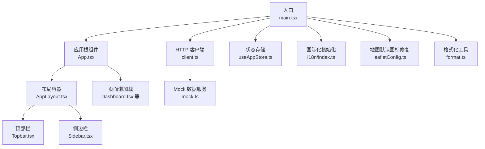
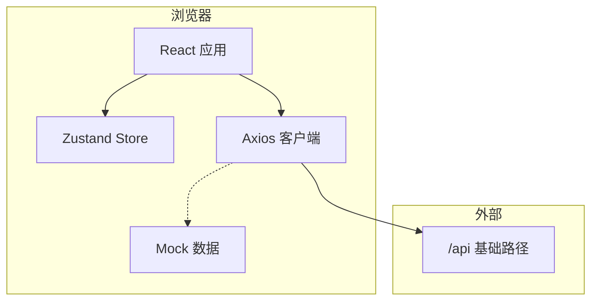
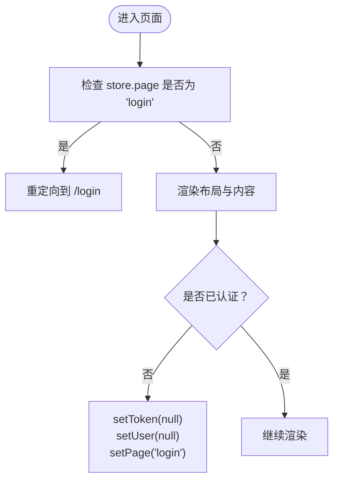
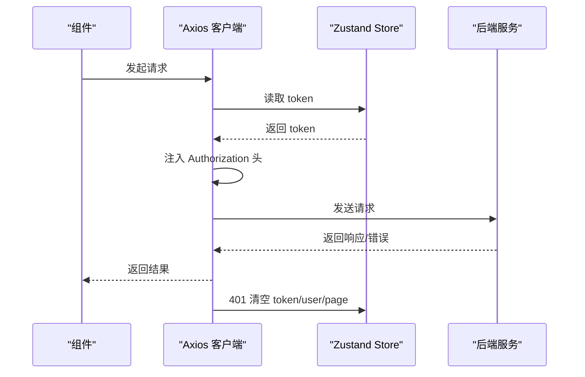
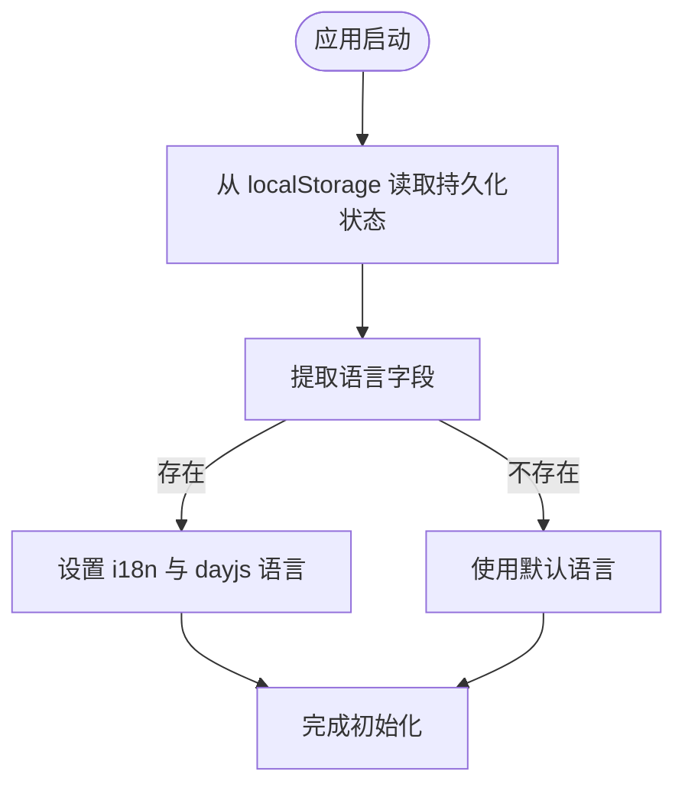
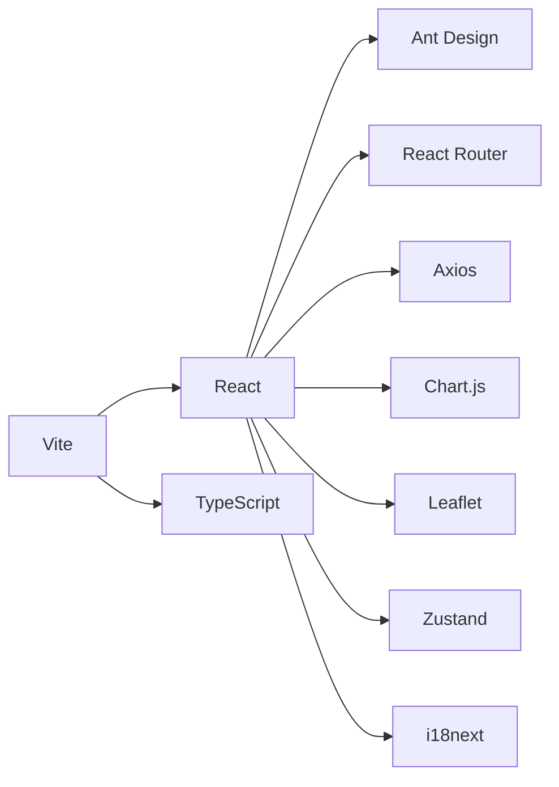
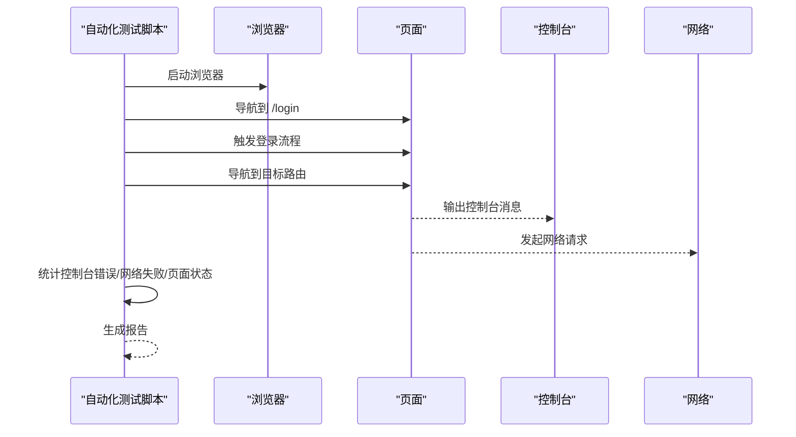

# 故障排除

<cite>
**本文引用的文件**
- [package.json](file://weidu-fleet/package.json)
- [vite.config.ts](file://weidu-fleet/vite.config.ts)
- [main.tsx](file://weidu-fleet/src/main.tsx)
- [App.tsx](file://weidu-fleet/src/App.tsx)
- [client.ts](file://weidu-fleet/src/api/client.ts)
- [useAppStore.ts](file://weidu-fleet/src/store/useAppStore.ts)
- [format.ts](file://weidu-fleet/src/utils/format.ts)
- [index.ts（i18n）](file://weidu-fleet/src/i18n/index.ts)
- [AppLayout.tsx](file://weidu-fleet/src/components/Layout/AppLayout.tsx)
- [Login.tsx](file://weidu-fleet/src/pages/Login.tsx)
- [Dashboard.tsx](file://weidu-fleet/src/pages/Dashboard.tsx)
- [Sidebar.tsx](file://weidu-fleet/src/components/Layout/Sidebar.tsx)
- [Topbar.tsx](file://weidu-fleet/src/components/Layout/Topbar.tsx)
- [mock.ts](file://weidu-fleet/src/api/mock.ts)
- [format.test.ts](file://weidu-fleet/src/utils/format.test.ts)
- [test-automation.mjs](file://weidu-fleet/test-automation.mjs)
</cite>

## 目录
1. [简介](#简介)
2. [项目结构](#项目结构)
3. [核心组件](#核心组件)
4. [架构总览](#架构总览)
5. [详细组件分析](#详细组件分析)
6. [依赖关系分析](#依赖关系分析)
7. [性能考虑](#性能考虑)
8. [故障排除指南](#故障排除指南)
9. [结论](#结论)
10. [附录](#附录)

## 简介
本指南面向“苇渡-智利车队管理”项目的开发与运维人员，聚焦于常见问题的诊断与解决，覆盖开发环境、运行时错误、性能问题、调试工具与日志分析、错误监控与告警配置、API 调用失败、状态管理异常、组件渲染问题等。文档同时提供可视化图示与可操作的排查步骤，帮助快速定位并修复问题。

## 项目结构
项目采用 React + TypeScript + Vite 构建，前端通过 Zustand 管理全局状态，Axios 封装 HTTP 客户端，Ant Design 提供 UI 组件，React Router 实现路由，i18n 支持多语言，Leaflet 地图集成，Chart.js 可视化图表。

**图示来源**
- [main.tsx:1-49](file://weidu-fleet/src/main.tsx#L1-L49)
- [App.tsx:1-88](file://weidu-fleet/src/App.tsx#L1-L88)
- [AppLayout.tsx:1-85](file://weidu-fleet/src/components/Layout/AppLayout.tsx#L1-L85)
- [Topbar.tsx:1-233](file://weidu-fleet/src/components/Layout/Topbar.tsx#L1-L233)
- [Sidebar.tsx:1-272](file://weidu-fleet/src/components/Layout/Sidebar.tsx#L1-L272)
- [Dashboard.tsx:1-257](file://weidu-fleet/src/pages/Dashboard.tsx#L1-L257)
- [client.ts:1-32](file://weidu-fleet/src/api/client.ts#L1-L32)
- [mock.ts:1-634](file://weidu-fleet/src/api/mock.ts#L1-L634)
- [useAppStore.ts:1-87](file://weidu-fleet/src/store/useAppStore.ts#L1-L87)
- [index.ts（i18n）:1-30](file://weidu-fleet/src/i18n/index.ts#L1-L30)
- [format.ts:1-27](file://weidu-fleet/src/utils/format.ts#L1-L27)

**章节来源**
- [main.tsx:1-49](file://weidu-fleet/src/main.tsx#L1-L49)
- [vite.config.ts:1-16](file://weidu-fleet/vite.config.ts#L1-L16)

## 核心组件
- 应用入口与主题/国际化：负责 Ant Design 主题、语言切换、dayjs 本地化、Leaflet 图标修复、全局样式与 i18n 初始化。
- 路由与布局：App 组件定义路由与懒加载；AppLayout 提供侧边栏、顶部栏与内容区域；Topbar 处理面包屑、语言切换、租户切换与登出；Sidebar 管理菜单与标签页状态同步。
- 全局状态：Zustand Store 管理用户、令牌、语言、当前页面、租户、查询参数等，并持久化到 localStorage。
- HTTP 客户端：Axios 创建带基础路径与超时的客户端，统一注入 Authorization 头，处理 401 并重置登录态。
- Mock 数据：为各页面提供静态数据，便于开发与测试。
- 工具与国际化：format.ts 提供时长、年龄、时间格式化；i18n/index.ts 从持久化存储读取语言并初始化。

**章节来源**
- [main.tsx:1-49](file://weidu-fleet/src/main.tsx#L1-L49)
- [App.tsx:1-88](file://weidu-fleet/src/App.tsx#L1-L88)
- [AppLayout.tsx:1-85](file://weidu-fleet/src/components/Layout/AppLayout.tsx#L1-L85)
- [Topbar.tsx:1-233](file://weidu-fleet/src/components/Layout/Topbar.tsx#L1-L233)
- [Sidebar.tsx:1-272](file://weidu-fleet/src/components/Layout/Sidebar.tsx#L1-L272)
- [useAppStore.ts:1-87](file://weidu-fleet/src/store/useAppStore.ts#L1-L87)
- [client.ts:1-32](file://weidu-fleet/src/api/client.ts#L1-L32)
- [mock.ts:1-634](file://weidu-fleet/src/api/mock.ts#L1-L634)
- [format.ts:1-27](file://weidu-fleet/src/utils/format.ts#L1-L27)
- [index.ts（i18n）:1-30](file://weidu-fleet/src/i18n/index.ts#L1-L30)

## 架构总览
前端采用单页应用（SPA）模式，路由懒加载提升首屏性能；状态持久化保障刷新后体验一致；Mock 数据用于开发阶段替代真实后端；Axios 拦截器集中处理认证与错误。

**图示来源**
- [client.ts:1-32](file://weidu-fleet/src/api/client.ts#L1-L32)
- [mock.ts:1-634](file://weidu-fleet/src/api/mock.ts#L1-L634)
- [useAppStore.ts:1-87](file://weidu-fleet/src/store/useAppStore.ts#L1-L87)

## 详细组件分析

### 状态管理与持久化（Zustand）
- 状态键：页面、语言、用户、令牌、租户、多标签页参数、筛选条件等。
- 持久化策略：仅持久化用户、令牌、语言、租户，避免存储敏感或体积较大的数据。
- 认证守卫：AppLayout 基于 store.page 判断是否跳转登录；Login 设置令牌与页面状态。

**图示来源**
- [AppLayout.tsx:20-31](file://weidu-fleet/src/components/Layout/AppLayout.tsx#L20-L31)
- [useAppStore.ts:40-87](file://weidu-fleet/src/store/useAppStore.ts#L40-L87)
- [client.ts:17-29](file://weidu-fleet/src/api/client.ts#L17-L29)

**章节来源**
- [useAppStore.ts:1-87](file://weidu-fleet/src/store/useAppStore.ts#L1-L87)
- [AppLayout.tsx:1-85](file://weidu-fleet/src/components/Layout/AppLayout.tsx#L1-L85)

### HTTP 客户端与拦截器
- 基础配置：baseURL 为 /api，超时 10 秒。
- 请求拦截：从 store 读取 token 注入 Authorization。
- 响应拦截：401 时清空 token/user/page，便于自动登出。

**图示来源**
- [client.ts:1-32](file://weidu-fleet/src/api/client.ts#L1-L32)
- [useAppStore.ts:1-87](file://weidu-fleet/src/store/useAppStore.ts#L1-L87)

**章节来源**
- [client.ts:1-32](file://weidu-fleet/src/api/client.ts#L1-L32)

### 国际化与本地化
- 语言来源：优先从持久化存储读取，否则默认中文。
- 语言切换：Topbar 通过 i18n.changeLanguage 与 dayjs.locale 更新。
- i18n 初始化：资源包含中文、英文、西班牙文。

**图示来源**
- [index.ts（i18n）:1-30](file://weidu-fleet/src/i18n/index.ts#L1-L30)
- [Topbar.tsx:55-62](file://weidu-fleet/src/components/Layout/Topbar.tsx#L55-L62)
- [main.tsx:19-26](file://weidu-fleet/src/main.tsx#L19-L26)

**章节来源**
- [index.ts（i18n）:1-30](file://weidu-fleet/src/i18n/index.ts#L1-L30)
- [Topbar.tsx:1-233](file://weidu-fleet/src/components/Layout/Topbar.tsx#L1-L233)
- [main.tsx:1-49](file://weidu-fleet/src/main.tsx#L1-L49)

### 地图与图表初始化
- Leaflet 图标修复：解决打包后默认图标路径问题。
- Chart.js 注册：按需注册组件，避免冗余。
- 时间格式化：统一时区与显示格式。

**章节来源**
- [format.ts:1-27](file://weidu-fleet/src/utils/format.ts#L1-L27)
- [Dashboard.tsx:23-28](file://weidu-fleet/src/pages/Dashboard.tsx#L23-L28)
- [leafletConfig.ts:1-14](file://weidu-fleet/src/utils/leafletConfig.ts#L1-L14)

## 依赖关系分析
- 开发与构建：Vite 提供开发服务器与构建能力；React 插件启用 JSX/TSX；路径别名 @ 指向 src。
- 运行时依赖：React 生态、Ant Design、Axios、Chart.js、Leaflet、i18next、zustand 等。
- 开发依赖：TypeScript、Vitest、Testing Library、jsdom、@vitejs/plugin-react 等。

**图示来源**
- [package.json:1-41](file://weidu-fleet/package.json#L1-L41)
- [vite.config.ts:1-16](file://weidu-fleet/vite.config.ts#L1-L16)

**章节来源**
- [package.json:1-41](file://weidu-fleet/package.json#L1-L41)
- [vite.config.ts:1-16](file://weidu-fleet/vite.config.ts#L1-L16)

## 性能考虑
- 路由懒加载：App 中对页面组件进行 React.lazy，减少首屏包体。
- 图表与地图：按需注册 Chart.js 组件，避免不必要的渲染。
- 状态持久化：仅持久化必要字段，降低存储压力。
- Mock 数据：开发阶段使用静态数据，避免真实网络抖动影响性能评估。

**章节来源**
- [App.tsx:1-88](file://weidu-fleet/src/App.tsx#L1-L88)
- [Dashboard.tsx:23-28](file://weidu-fleet/src/pages/Dashboard.tsx#L23-L28)
- [useAppStore.ts:76-85](file://weidu-fleet/src/store/useAppStore.ts#L76-L85)

## 故障排除指南

### 一、开发环境问题
- 端口冲突
  - 现象：启动时报端口占用。
  - 排查：检查 vite.config.ts 的 server.port，默认 3000；修改为其他可用端口。
  - 参考：[vite.config.ts:12-14](file://weidu-fleet/vite.config.ts#L12-L14)
- 依赖安装失败
  - 现象：npm/yarn/pnpm 安装报错。
  - 排查：清理缓存、删除 node_modules 与 lock 文件后重装；确保 Node 版本满足要求。
  - 参考：[package.json:1-41](file://weidu-fleet/package.json#L1-L41)
- 路径别名无效
  - 现象：导入 @/xxx 报模块解析错误。
  - 排查：确认 Vite 配置中的 alias 与实际目录一致；重启开发服务器。
  - 参考：[vite.config.ts:7-11](file://weidu-fleet/vite.config.ts#L7-L11)

**章节来源**
- [vite.config.ts:1-16](file://weidu-fleet/vite.config.ts#L1-L16)
- [package.json:1-41](file://weidu-fleet/package.json#L1-L41)

### 二、运行时错误

#### 1) 登录与认证
- 现象：无法进入系统或反复跳转登录。
  - 排查：
    - 检查 store.page 是否被设为 'login'；AppLayout 会据此重定向。
    - 确认 Login 是否正确设置 token 与 page。
    - 若使用 Mock，确认 localStorage 中持久化状态存在且有效。
  - 参考：
    - [AppLayout.tsx:20-31](file://weidu-fleet/src/components/Layout/AppLayout.tsx#L20-L31)
    - [Login.tsx:46-51](file://weidu-fleet/src/pages/Login.tsx#L46-L51)
    - [useAppStore.ts:40-87](file://weidu-fleet/src/store/useAppStore.ts#L40-L87)

#### 2) 401 未授权
- 现象：接口返回 401，页面自动登出。
- 排查：
  - 检查请求头 Authorization 是否正确注入。
  - 确认 store.token 是否为空；拦截器会在 401 时清空 token/user/page。
- 参考：
  - [client.ts:9-29](file://weidu-fleet/src/api/client.ts#L9-L29)

#### 3) 页面空白或白屏
- 现象：路由切换后无内容或出现空白。
- 排查：
  - 检查 Suspense fallback 是否生效；确认路由路径与懒加载组件映射正确。
  - 检查 AppLayout 是否正确渲染 Outlet。
- 参考：
  - [App.tsx:41-84](file://weidu-fleet/src/App.tsx#L41-L84)
  - [AppLayout.tsx:77-81](file://weidu-fleet/src/components/Layout/AppLayout.tsx#L77-L81)

#### 4) 地图不显示或图标缺失
- 现象：地图空白或标记图标不显示。
- 排查：
  - 确认已执行 Leaflet 图标修复；检查 CSS 与容器尺寸。
- 参考：
  - [leafletConfig.ts:1-14](file://weidu-fleet/src/utils/leafletConfig.ts#L1-L14)
  - [Dashboard.tsx:196-235](file://weidu-fleet/src/pages/Dashboard.tsx#L196-L235)

#### 5) 图表渲染异常
- 现象：图表不显示或报错。
- 排查：
  - 确认 Chart.js 组件已按需注册；容器高度与宽度过小会导致渲染失败。
- 参考：
  - [Dashboard.tsx:23-28](file://weidu-fleet/src/pages/Dashboard.tsx#L23-L28)

**章节来源**
- [App.tsx:1-88](file://weidu-fleet/src/App.tsx#L1-L88)
- [AppLayout.tsx:1-85](file://weidu-fleet/src/components/Layout/AppLayout.tsx#L1-L85)
- [client.ts:1-32](file://weidu-fleet/src/api/client.ts#L1-L32)
- [leafletConfig.ts:1-14](file://weidu-fleet/src/utils/leafletConfig.ts#L1-L14)
- [Dashboard.tsx:1-257](file://weidu-fleet/src/pages/Dashboard.tsx#L1-L257)

### 三、性能问题

#### 1) 首屏加载慢
- 排查：
  - 检查路由懒加载是否生效；确认组件拆分合理。
  - 分析包体大小，移除未使用的依赖或按需引入。
- 参考：
  - [App.tsx:8-21](file://weidu-fleet/src/App.tsx#L8-L21)

#### 2) 图表/地图卡顿
- 排查：
  - 减少一次性渲染的数据量；使用虚拟滚动或分页。
  - 确保容器尺寸固定，避免频繁重排。
- 参考：
  - [Dashboard.tsx:167-237](file://weidu-fleet/src/pages/Dashboard.tsx#L167-L237)

#### 3) 状态更新导致过度渲染
- 排查：
  - 使用 useMemo/useCallback 缓存计算结果；拆分细粒度状态。
  - 避免在渲染期间进行昂贵计算。
- 参考：
  - [Dashboard.tsx:42-71](file://weidu-fleet/src/pages/Dashboard.tsx#L42-L71)

**章节来源**
- [App.tsx:1-88](file://weidu-fleet/src/App.tsx#L1-L88)
- [Dashboard.tsx:1-257](file://weidu-fleet/src/pages/Dashboard.tsx#L1-L257)

### 四、调试工具与日志分析

#### 1) 浏览器开发者工具
- 控制台：查看错误、警告与堆栈；过滤无害警告（如图标包提示）。
- 网络：检查请求/响应状态、Headers、Body；关注 4xx/5xx。
- 存储：检查 localStorage 中的持久化状态是否正确。
- 应用：查看 React DevTools 的组件树与状态变化。

#### 2) 自动化测试与 Bug 排查脚本
- 功能：全菜单点击测试、控制台错误捕获、网络请求失败统计、页面状态快照。
- 使用：调整 BASE_URL 与端口；根据需要扩展路由清单；关注报告中的“控制台错误”“网络失败”“异常崩溃”。

**图示来源**
- [test-automation.mjs:1-321](file://weidu-fleet/test-automation.mjs#L1-L321)

**章节来源**
- [test-automation.mjs:1-321](file://weidu-fleet/test-automation.mjs#L1-L321)

### 五、错误监控与告警配置
- 控制台错误：脚本会过滤无害警告，保留 error/warning 与包含 error/fail 的消息，并记录堆栈。
- 网络失败：监听 requestfailed，记录状态码与失败原因。
- 页面异常：捕获页面级异常并记录堆栈。
- 建议：
  - 在生产环境接入统一错误上报（如 Sentry），结合用户会话与路由信息。
  - 对高频错误建立阈值告警，结合日志聚合平台进行趋势分析。

**章节来源**
- [test-automation.mjs:23-112](file://weidu-fleet/test-automation.mjs#L23-L112)

### 六、API 调用失败排查
- 常见原因：跨域、401、超时、Mock 未实现、路径错误。
- 排查步骤：
  - 检查 baseURL 与路径拼接；确认 /api 前缀是否正确。
  - 确认 Authorization 头是否注入；检查 token 是否过期。
  - 查看拦截器响应逻辑；关注 401 自动登出。
  - 如使用 Mock，确认对应接口已实现。
- 参考：
  - [client.ts:4-7](file://weidu-fleet/src/api/client.ts#L4-L7)
  - [client.ts:17-29](file://weidu-fleet/src/api/client.ts#L17-L29)
  - [mock.ts:1-634](file://weidu-fleet/src/api/mock.ts#L1-L634)

**章节来源**
- [client.ts:1-32](file://weidu-fleet/src/api/client.ts#L1-L32)
- [mock.ts:1-634](file://weidu-fleet/src/api/mock.ts#L1-L634)

### 七、状态管理异常排查
- 现象：页面状态不同步、刷新后丢失、菜单选中异常。
- 排查：
  - 检查持久化字段是否包含所需状态；确认只持久化必要字段。
  - 确认 store 初始化与页面挂载顺序；避免在未读取持久化前使用状态。
  - 检查标签页参数同步逻辑（如 _mt/_rt/_dt/_bt/_dv/_vt/_dr/_bz）。
- 参考：
  - [useAppStore.ts:76-85](file://weidu-fleet/src/store/useAppStore.ts#L76-L85)
  - [Sidebar.tsx:150-178](file://weidu-fleet/src/components/Layout/Sidebar.tsx#L150-L178)

**章节来源**
- [useAppStore.ts:1-87](file://weidu-fleet/src/store/useAppStore.ts#L1-L87)
- [Sidebar.tsx:1-272](file://weidu-fleet/src/components/Layout/Sidebar.tsx#L1-L272)

### 八、组件渲染问题排查
- 现象：菜单不展开、面包屑不更新、语言切换无效。
- 排查：
  - 检查菜单项与子项的 key 映射；确认 openKeys 与 selectedKeys 的联动。
  - 检查面包屑映射表与当前路径匹配。
  - 确认 i18n.changeLanguage 与 dayjs.locale 更新生效。
- 参考：
  - [Sidebar.tsx:182-201](file://weidu-fleet/src/components/Layout/Sidebar.tsx#L182-L201)
  - [Topbar.tsx:52-54](file://weidu-fleet/src/components/Layout/Topbar.tsx#L52-L54)
  - [Topbar.tsx:55-62](file://weidu-fleet/src/components/Layout/Topbar.tsx#L55-L62)

**章节来源**
- [Sidebar.tsx:1-272](file://weidu-fleet/src/components/Layout/Sidebar.tsx#L1-L272)
- [Topbar.tsx:1-233](file://weidu-fleet/src/components/Layout/Topbar.tsx#L1-L233)

### 九、单元测试与格式化工具验证
- 单元测试：验证 formatDuration 与 calculateAge 的边界情况。
- 建议：为关键工具函数补充更多边界用例，确保国际化与日期处理稳定。

**章节来源**
- [format.test.ts:1-45](file://weidu-fleet/src/utils/format.test.ts#L1-L45)
- [format.ts:1-27](file://weidu-fleet/src/utils/format.ts#L1-L27)

## 结论
本指南提供了从开发环境、运行时错误到性能优化与自动化测试的完整故障排除路径。建议在日常开发中：
- 使用自动化测试脚本进行全链路巡检；
- 通过浏览器开发者工具与日志快速定位问题；
- 严格控制状态持久化范围，避免过度存储；
- 对图表/地图等重渲染组件进行性能优化；
- 在生产环境接入统一错误监控与告警体系。

## 附录

### A. 常用命令与端口
- 开发：npm run dev（默认端口 3000）
- 构建：npm run build
- 预览：npm run preview

**章节来源**
- [package.json:6-10](file://weidu-fleet/package.json#L6-L10)
- [vite.config.ts:12-14](file://weidu-fleet/vite.config.ts#L12-L14)

### B. 关键文件路径速查
- 入口与配置：[main.tsx:1-49](file://weidu-fleet/src/main.tsx#L1-L49)、[vite.config.ts:1-16](file://weidu-fleet/vite.config.ts#L1-L16)
- 路由与布局：[App.tsx:1-88](file://weidu-fleet/src/App.tsx#L1-L88)、[AppLayout.tsx:1-85](file://weidu-fleet/src/components/Layout/AppLayout.tsx#L1-L85)
- 状态与拦截器：[useAppStore.ts:1-87](file://weidu-fleet/src/store/useAppStore.ts#L1-L87)、[client.ts:1-32](file://weidu-fleet/src/api/client.ts#L1-L32)
- 国际化与地图：[index.ts（i18n）:1-30](file://weidu-fleet/src/i18n/index.ts#L1-L30)、[leafletConfig.ts:1-14](file://weidu-fleet/src/utils/leafletConfig.ts#L1-L14)
- 页面与工具：[Dashboard.tsx:1-257](file://weidu-fleet/src/pages/Dashboard.tsx#L1-L257)、[format.ts:1-27](file://weidu-fleet/src/utils/format.ts#L1-L27)
- 自动化测试：[test-automation.mjs:1-321](file://weidu-fleet/test-automation.mjs#L1-L321)