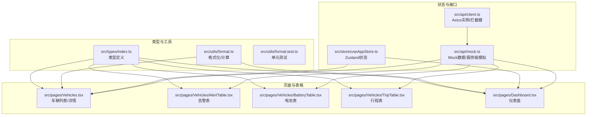
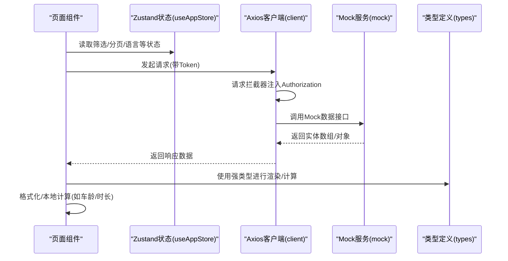
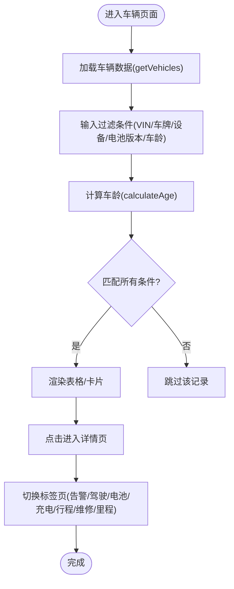
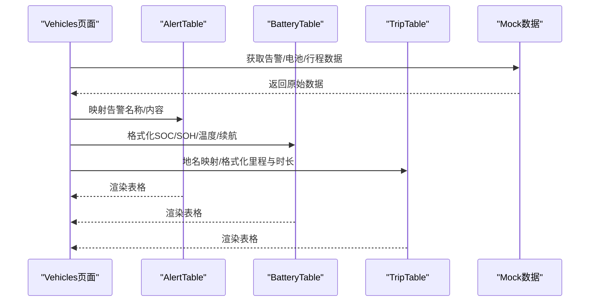
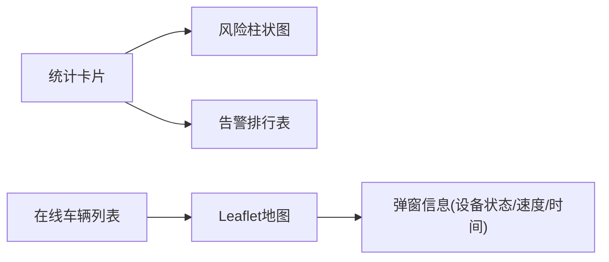
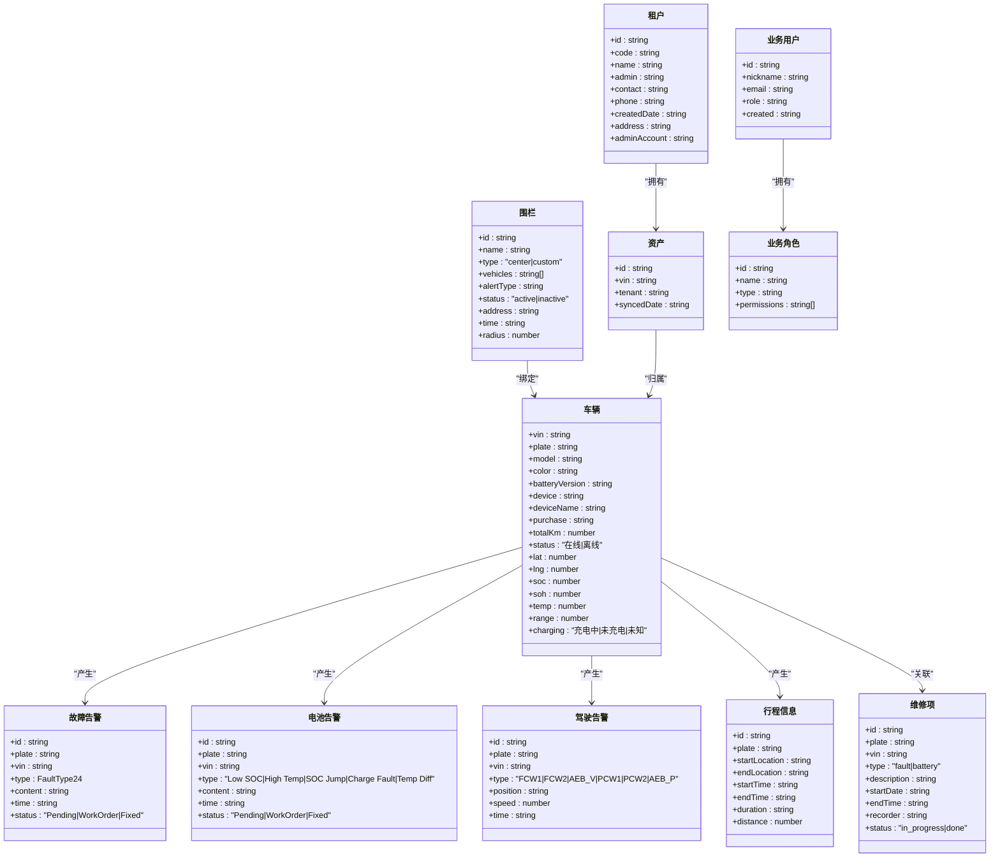
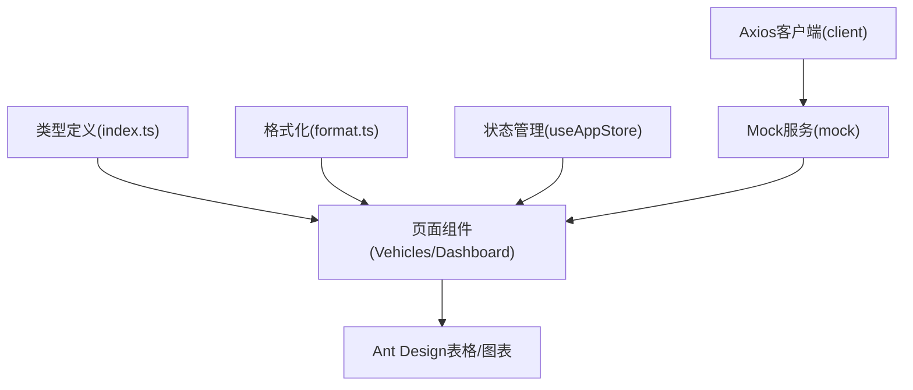

# 数据模型

<cite>
**本文引用的文件**
- [src/types/index.ts](file://src/types/index.ts)
- [src/utils/format.ts](file://src/utils/format.ts)
- [src/utils/format.test.ts](file://src/utils/format.test.ts)
- [src/store/useAppStore.ts](file://src/store/useAppStore.ts)
- [src/api/client.ts](file://src/api/client.ts)
- [src/api/mock.ts](file://src/api/mock.ts)
- [src/pages/Vehicles.tsx](file://src/pages/Vehicles.tsx)
- [src/pages/Vehicles/AlertTable.tsx](file://src/pages/Vehicles/AlertTable.tsx)
- [src/pages/Vehicles/BatteryTable.tsx](file://src/pages/Vehicles/BatteryTable.tsx)
- [src/pages/Vehicles/TripTable.tsx](file://src/pages/Vehicles/TripTable.tsx)
- [src/pages/Dashboard.tsx](file://src/pages/Dashboard.tsx)
- [package.json](file://package.json)
</cite>

## 目录
1. [引言](#引言)
2. [项目结构](#项目结构)
3. [核心组件](#核心组件)
4. [架构总览](#架构总览)
5. [详细组件分析](#详细组件分析)
6. [依赖分析](#依赖分析)
7. [性能考虑](#性能考虑)
8. [故障排查指南](#故障排查指南)
9. [结论](#结论)
10. [附录](#附录)

## 引言
本文件面向“苇渡-智利车队管理”项目，系统性梳理前端数据模型设计与实现，覆盖 TypeScript 类型定义、数据验证与转换、格式化工具、数据生命周期与缓存策略、以及数据在系统中的流转过程。文档同时提供实体关系图与数据流图，帮助读者快速理解从数据源到视图层的全链路。

## 项目结构
项目采用以功能域划分的目录组织方式，数据模型主要集中在 types 与 api 层，页面组件负责消费与展示数据，工具函数提供格式化与计算能力，状态管理持久化用户偏好与筛选条件。

图表来源
- [src/types/index.ts:1-261](file://src/types/index.ts#L1-L261)
- [src/utils/format.ts:1-27](file://src/utils/format.ts#L1-L27)
- [src/store/useAppStore.ts:1-87](file://src/store/useAppStore.ts#L1-L87)
- [src/api/client.ts:1-32](file://src/api/client.ts#L1-L32)
- [src/api/mock.ts:1-634](file://src/api/mock.ts#L1-L634)
- [src/pages/Vehicles.tsx:1-440](file://src/pages/Vehicles.tsx#L1-L440)
- [src/pages/Vehicles/AlertTable.tsx:1-42](file://src/pages/Vehicles/AlertTable.tsx#L1-L42)
- [src/pages/Vehicles/BatteryTable.tsx:1-20](file://src/pages/Vehicles/BatteryTable.tsx#L1-L20)
- [src/pages/Vehicles/TripTable.tsx:1-30](file://src/pages/Vehicles/TripTable.tsx#L1-L30)
- [src/pages/Dashboard.tsx:1-257](file://src/pages/Dashboard.tsx#L1-L257)

章节来源
- [src/types/index.ts:1-261](file://src/types/index.ts#L1-L261)
- [src/utils/format.ts:1-27](file://src/utils/format.ts#L1-L27)
- [src/store/useAppStore.ts:1-87](file://src/store/useAppStore.ts#L1-L87)
- [src/api/client.ts:1-32](file://src/api/client.ts#L1-L32)
- [src/api/mock.ts:1-634](file://src/api/mock.ts#L1-L634)
- [src/pages/Vehicles.tsx:1-440](file://src/pages/Vehicles.tsx#L1-L440)
- [src/pages/Vehicles/AlertTable.tsx:1-42](file://src/pages/Vehicles/AlertTable.tsx#L1-L42)
- [src/pages/Vehicles/BatteryTable.tsx:1-20](file://src/pages/Vehicles/BatteryTable.tsx#L1-L20)
- [src/pages/Vehicles/TripTable.tsx:1-30](file://src/pages/Vehicles/TripTable.tsx#L1-L30)
- [src/pages/Dashboard.tsx:1-257](file://src/pages/Dashboard.tsx#L1-L257)

## 核心组件
本节聚焦数据模型的核心类型与工具函数，说明其设计原则、字段语义与约束。

- 车辆基础信息与实时状态
  - 字段：VIN、车牌、品牌/型号、颜色、电池版本、设备ID/名称、购买日期、总里程、在线状态、经纬度、SOC、SOH、温度、续航、充电状态
  - 设计要点：统一使用字符串表示日期时间；数值型指标（如里程、温度、续航）明确单位；枚举类字段（在线/离线、充电状态）限制取值范围
  - 复杂度：单实体 O(1) 访问；批量过滤按 VIN/车牌/设备/电池版本等字段进行 O(n) 匹配

- 告警与事件
  - 告警记录：包含类型、内容、时间、状态、位置、速度等
  - 故障告警：类型为固定集合（24 种），状态为待处理/工单/已修复
  - 电池告警：类型限定为低SOC、高温、跳变、充电故障、温差
  - 驾驶告警：类型限定为前向碰撞、自动紧急制动、行人碰撞等
  - 设计要点：通过联合类型与字面量枚举保证类型安全；状态字段使用受控枚举

- 行程与轨迹
  - 行程信息：起止时间、地点、时长、距离
  - 轨迹点：经纬度序列与时标
  - 设计要点：行程与轨迹分离，便于按需加载；轨迹点数组支持可视化渲染

- 维修与围栏
  - 维修项：类型（故障/电池）、描述、起止时间、状态、记录人
  - 围栏：名称、类型（中心/自定义）、绑定车辆、告警类型、状态、地址、时间、半径
  - 设计要点：状态字段使用受控枚举；围栏支持地理半径配置

- 租户与资产
  - 租户：编号、名称、管理员、联系方式、电话、创建日期、地址、管理员账号
  - 资产：VIN、所属租户、同步时间
  - 设计要点：资产与租户建立弱关联，便于跨租户统计与权限控制

- 业务用户与角色
  - 用户：昵称、邮箱、角色、创建时间
  - 角色：名称、类型、权限列表
  - 设计要点：权限以字符串列表表达，支持细粒度控制

- 页面键与语言
  - 页面键：仪表盘、车辆、监控、风险、驾驶、电池、行程、围栏、维修、租户、业务、系统
  - 语言：简体中文、英语、西班牙语
  - 设计要点：统一的导航与国际化入口

章节来源
- [src/types/index.ts:1-261](file://src/types/index.ts#L1-L261)

## 架构总览
下图展示从前端类型定义到页面消费的端到端数据流，包括状态管理、API 客户端与本地 Mock 数据的关系。

图表来源
- [src/store/useAppStore.ts:1-87](file://src/store/useAppStore.ts#L1-L87)
- [src/api/client.ts:1-32](file://src/api/client.ts#L1-L32)
- [src/api/mock.ts:1-634](file://src/api/mock.ts#L1-L634)
- [src/types/index.ts:1-261](file://src/types/index.ts#L1-L261)

章节来源
- [src/store/useAppStore.ts:1-87](file://src/store/useAppStore.ts#L1-L87)
- [src/api/client.ts:1-32](file://src/api/client.ts#L1-L32)
- [src/api/mock.ts:1-634](file://src/api/mock.ts#L1-L634)
- [src/types/index.ts:1-261](file://src/types/index.ts#L1-L261)

## 详细组件分析

### 车辆数据模型与页面应用
- 列表视图：支持 VIN/车牌/设备/电池版本/最小/最大车龄多维过滤；导出模板下载与导入结果反馈
- 详情视图：左侧展示车辆与设备信息，右侧以标签页承载告警、驾驶、电池、充电、行程、维修、里程图表
- 关键流程：筛选 → 过滤 → 渲染；导入 → 校验 → 结果回显

图表来源
- [src/pages/Vehicles.tsx:47-120](file://src/pages/Vehicles.tsx#L47-L120)
- [src/utils/format.ts:18-23](file://src/utils/format.ts#L18-L23)
- [src/api/mock.ts:27-33](file://src/api/mock.ts#L27-L33)

章节来源
- [src/pages/Vehicles.tsx:1-440](file://src/pages/Vehicles.tsx#L1-L440)
- [src/utils/format.ts:1-27](file://src/utils/format.ts#L1-L27)
- [src/api/mock.ts:1-634](file://src/api/mock.ts#L1-L634)

### 告警与电池/行程表格组件
- 告警表：将英文告警类型映射为中文显示名与内容，统一时间列
- 电池表：对 SOC、SOH、温度、续航进行本地格式化显示
- 行程表：对起点/终点进行智利地名映射，对里程与时长进行本地格式化

图表来源
- [src/pages/Vehicles/AlertTable.tsx:1-42](file://src/pages/Vehicles/AlertTable.tsx#L1-L42)
- [src/pages/Vehicles/BatteryTable.tsx:1-20](file://src/pages/Vehicles/BatteryTable.tsx#L1-L20)
- [src/pages/Vehicles/TripTable.tsx:1-30](file://src/pages/Vehicles/TripTable.tsx#L1-L30)
- [src/api/mock.ts:536-594](file://src/api/mock.ts#L536-L594)

章节来源
- [src/pages/Vehicles/AlertTable.tsx:1-42](file://src/pages/Vehicles/AlertTable.tsx#L1-L42)
- [src/pages/Vehicles/BatteryTable.tsx:1-20](file://src/pages/Vehicles/BatteryTable.tsx#L1-L20)
- [src/pages/Vehicles/TripTable.tsx:1-30](file://src/pages/Vehicles/TripTable.tsx#L1-L30)
- [src/api/mock.ts:536-594](file://src/api/mock.ts#L536-L594)

### 仪表盘与地图集成
- 统计卡片：在线/离线、当日里程、总里程、今日告警数、围栏告警数、低电量告警数、平均SOC/温度/续航
- 风险柱状图：按时间段切换（今日/7日/30日）
- 实时地图：基于在线车辆位置绘制圆点，弹窗展示设备状态、速度、上报时间等

图表来源
- [src/pages/Dashboard.tsx:34-257](file://src/pages/Dashboard.tsx#L34-L257)
- [src/api/mock.ts:35-69](file://src/api/mock.ts#L35-L69)

章节来源
- [src/pages/Dashboard.tsx:1-257](file://src/pages/Dashboard.tsx#L1-L257)
- [src/api/mock.ts:1-634](file://src/api/mock.ts#L1-L634)

### 数据模型类图
以下类图展示核心实体之间的关系与字段概览（仅列出关键字段与类型）：

图表来源
- [src/types/index.ts:1-261](file://src/types/index.ts#L1-L261)

章节来源
- [src/types/index.ts:1-261](file://src/types/index.ts#L1-L261)

## 依赖分析
- 类型依赖：页面组件与表格组件均依赖类型定义文件中的接口与联合类型
- 工具依赖：页面组件调用格式化工具进行本地计算与展示
- 状态依赖：页面通过 Zustand 状态管理存储筛选条件与界面状态，并持久化至本地存储
- 接口依赖：Axios 客户端在请求头注入 Token 并统一处理 401 无权限场景
- Mock 依赖：所有页面数据来源于 Mock 服务，便于开发与演示

图表来源
- [src/types/index.ts:1-261](file://src/types/index.ts#L1-L261)
- [src/utils/format.ts:1-27](file://src/utils/format.ts#L1-L27)
- [src/store/useAppStore.ts:1-87](file://src/store/useAppStore.ts#L1-L87)
- [src/api/client.ts:1-32](file://src/api/client.ts#L1-L32)
- [src/api/mock.ts:1-634](file://src/api/mock.ts#L1-L634)
- [src/pages/Vehicles.tsx:1-440](file://src/pages/Vehicles.tsx#L1-L440)
- [src/pages/Dashboard.tsx:1-257](file://src/pages/Dashboard.tsx#L1-L257)

章节来源
- [src/types/index.ts:1-261](file://src/types/index.ts#L1-L261)
- [src/utils/format.ts:1-27](file://src/utils/format.ts#L1-L27)
- [src/store/useAppStore.ts:1-87](file://src/store/useAppStore.ts#L1-L87)
- [src/api/client.ts:1-32](file://src/api/client.ts#L1-L32)
- [src/api/mock.ts:1-634](file://src/api/mock.ts#L1-L634)
- [src/pages/Vehicles.tsx:1-440](file://src/pages/Vehicles.tsx#L1-L440)
- [src/pages/Dashboard.tsx:1-257](file://src/pages/Dashboard.tsx#L1-L257)

## 性能考虑
- 渲染性能
  - 使用 useMemo 缓存计算结果（如车辆筛选、图表数据），避免重复计算
  - 表格启用虚拟滚动与横向滚动条，减少 DOM 节点数量
- 网络性能
  - Axios 设置合理超时时间，拦截器统一处理 401，避免无效重试
  - Mock 数据在本地生成，减少真实网络请求带来的延迟
- 存储性能
  - Zustand 使用持久化中间件仅保存必要字段，降低存储体积
  - 本地 CSV 导入/导出采用 Blob 流式处理，避免内存峰值
- 可维护性
  - 类型定义集中管理，配合单元测试保障格式化逻辑正确性
  - 页面组件职责单一，通过组合多个子表格组件实现复杂视图

## 故障排查指南
- 车龄计算异常
  - 现象：车龄显示为 0 或负数
  - 排查：检查购买日期格式是否为合法日期字符串；确认当前时间戳是否被篡改（测试中会替换 Date.now）
  - 参考
    - [src/utils/format.ts:18-23](file://src/utils/format.ts#L18-L23)
    - [src/utils/format.test.ts:21-45](file://src/utils/format.test.ts#L21-L45)

- 时长格式化不生效
  - 现象：时长字符串未按预期转换为中文格式
  - 排查：确认输入格式符合“NhMm”或带空格的变体；否则返回原字符串
  - 参考
    - [src/utils/format.ts:9-16](file://src/utils/format.ts#L9-L16)
    - [src/utils/format.test.ts:4-19](file://src/utils/format.test.ts#L4-L19)

- 登录态失效导致页面异常
  - 现象：401 错误后页面未重定向至登录页
  - 排查：检查拦截器是否正确设置 Token；确认状态管理中 user/token/page 是否被清空
  - 参考
    - [src/api/client.ts:9-29](file://src/api/client.ts#L9-L29)
    - [src/store/useAppStore.ts:6-38](file://src/store/useAppStore.ts#L6-L38)

- 表格数据为空或错位
  - 现象：表格列不显示或显示乱码
  - 排查：核对列配置的 dataIndex 与实体字段一致；检查本地格式化函数是否正确
  - 参考
    - [src/pages/Vehicles/AlertTable.tsx:33-38](file://src/pages/Vehicles/AlertTable.tsx#L33-L38)
    - [src/pages/Vehicles/BatteryTable.tsx:10-16](file://src/pages/Vehicles/BatteryTable.tsx#L10-L16)
    - [src/pages/Vehicles/TripTable.tsx:16-26](file://src/pages/Vehicles/TripTable.tsx#L16-L26)

## 结论
本项目通过严格的 TypeScript 类型定义、清晰的实体关系与受控枚举，确保了数据的一致性与可维护性。结合本地 Mock 数据、Zustand 状态管理与 Ant Design 组件，实现了高效的数据消费与展示。建议在后续迭代中逐步接入真实后端接口，并持续完善数据校验与错误处理机制。

## 附录
- 依赖清单（部分）
  - axios：HTTP 客户端与拦截器
  - zustand：轻量状态管理与持久化
  - dayjs：时区与时长格式化
  - xlsx：Excel 导入导出
  - react-leaflet / chart.js：地图与图表渲染
  - antd：UI 组件库
  - 参考
    - [package.json:11-40](file://package.json#L11-L40)