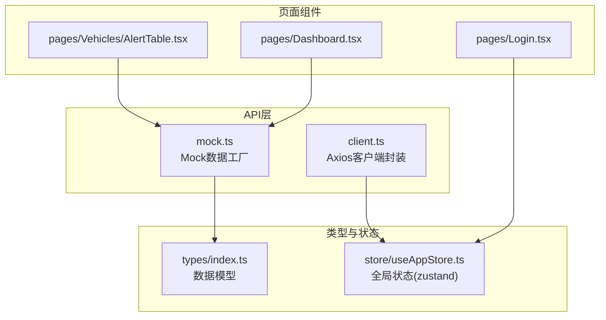
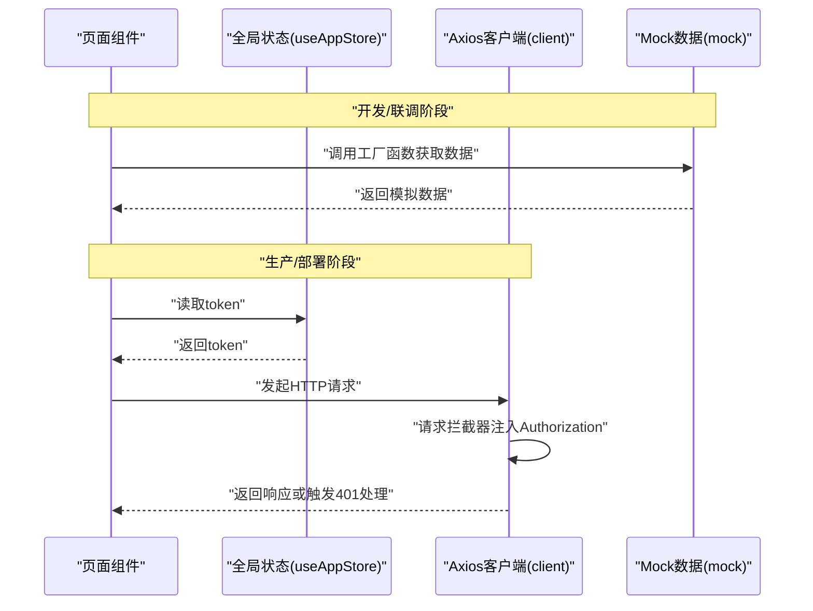
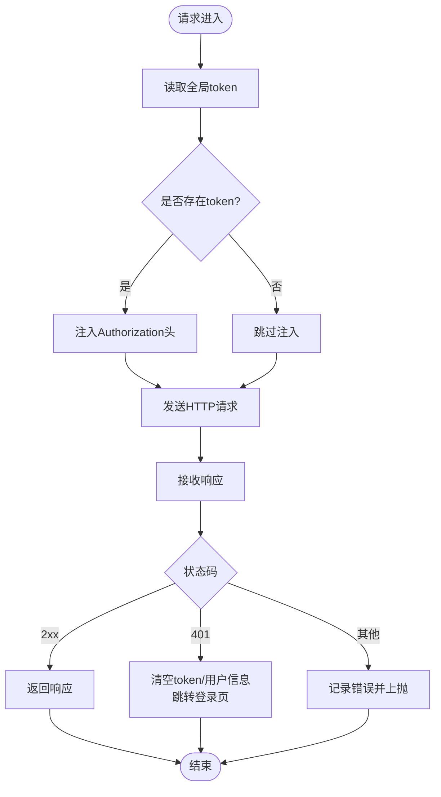
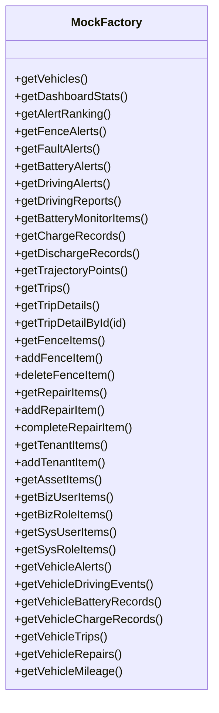
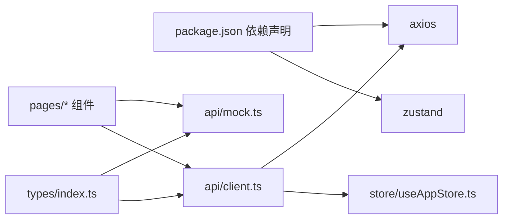

# API层设计

<cite>
**本文引用的文件**
- [client.ts](file://weidu-fleet/src/api/client.ts)
- [mock.ts](file://weidu-fleet/src/api/mock.ts)
- [index.ts](file://weidu-fleet/src/types/index.ts)
- [useAppStore.ts](file://weidu-fleet/src/store/useAppStore.ts)
- [Dashboard.tsx](file://weidu-fleet/src/pages/Dashboard.tsx)
- [AlertTable.tsx](file://weidu-fleet/src/pages/Vehicles/AlertTable.tsx)
- [Login.tsx](file://weidu-fleet/src/pages/Login.tsx)
- [package.json](file://weidu-fleet/package.json)
- [vite.config.ts](file://weidu-fleet/vite.config.ts)
</cite>

## 目录
1. [引言](#引言)
2. [项目结构](#项目结构)
3. [核心组件](#核心组件)
4. [架构总览](#架构总览)
5. [详细组件分析](#详细组件分析)
6. [依赖关系分析](#依赖关系分析)
7. [性能考量](#性能考量)
8. [故障排查指南](#故障排查指南)
9. [结论](#结论)
10. [附录](#附录)

## 引言
本文件面向“苇渡-智利车队管理”项目的前端API层，系统化阐述基于Axios的客户端配置与封装策略、统一接口管理方式、Mock数据体系与开发调试策略、HTTP请求标准化流程、认证机制与数据格式规范，并给出在组件中使用API客户端的实践路径。同时，文档强调API层与业务逻辑的解耦设计与可测试性考虑，帮助开发者在保持清晰职责边界的同时提升可维护性与扩展性。

## 项目结构
API层位于 src/api 目录，包含两个核心文件：
- 客户端封装：client.ts
- Mock数据：mock.ts

类型定义集中在 src/types/index.ts，用于约束Mock数据与后续真实接口的数据结构一致性。全局状态通过 Zustand 的 useAppStore.ts 管理用户令牌与页面状态，驱动认证头注入与路由跳转。

图表来源
- [client.ts:1-32](file://weidu-fleet/src/api/client.ts#L1-L32)
- [mock.ts:1-634](file://weidu-fleet/src/api/mock.ts#L1-L634)
- [index.ts:1-261](file://weidu-fleet/src/types/index.ts#L1-L261)
- [useAppStore.ts:1-87](file://weidu-fleet/src/store/useAppStore.ts#L1-L87)
- [Dashboard.tsx:1-257](file://weidu-fleet/src/pages/Dashboard.tsx#L1-L257)
- [AlertTable.tsx:1-42](file://weidu-fleet/src/pages/Vehicles/AlertTable.tsx#L1-L42)
- [Login.tsx:1-167](file://weidu-fleet/src/pages/Login.tsx#L1-L167)

章节来源
- [client.ts:1-32](file://weidu-fleet/src/api/client.ts#L1-L32)
- [mock.ts:1-634](file://weidu-fleet/src/api/mock.ts#L1-L634)
- [index.ts:1-261](file://weidu-fleet/src/types/index.ts#L1-L261)
- [useAppStore.ts:1-87](file://weidu-fleet/src/store/useAppStore.ts#L1-L87)
- [Dashboard.tsx:1-257](file://weidu-fleet/src/pages/Dashboard.tsx#L1-L257)
- [AlertTable.tsx:1-42](file://weidu-fleet/src/pages/Vehicles/AlertTable.tsx#L1-L42)
- [Login.tsx:1-167](file://weidu-fleet/src/pages/Login.tsx#L1-L167)

## 核心组件
- Axios客户端封装（client.ts）
  - 基础URL与超时设置
  - 请求拦截器：从全局状态读取token并注入Authorization头
  - 响应拦截器：统一处理401未授权，清空token与用户信息并跳转登录页；记录错误日志并透传Promise拒绝
- Mock数据工厂（mock.ts）
  - 车队车辆、仪表盘统计、告警排行、监控轨迹、行程、围栏、维修、租户、资产、业务用户与角色等多维度数据生成
  - 提供查询、聚合与部分可变操作（新增/完成/删除），便于演示与联调
- 类型系统（types/index.ts）
  - 统一的数据模型定义，确保Mock与未来真实接口的数据结构一致
- 全局状态（store/useAppStore.ts）
  - 维护token、用户、语言、当前页面等状态，驱动认证头与路由跳转

章节来源
- [client.ts:1-32](file://weidu-fleet/src/api/client.ts#L1-L32)
- [mock.ts:1-634](file://weidu-fleet/src/api/mock.ts#L1-L634)
- [index.ts:1-261](file://weidu-fleet/src/types/index.ts#L1-L261)
- [useAppStore.ts:1-87](file://weidu-fleet/src/store/useAppStore.ts#L1-L87)

## 架构总览
API层采用“Axios客户端 + Mock工厂”的双轨架构：
- 开发阶段：页面组件直接调用 mock.ts 工厂函数，快速产出模拟数据，降低对后端的耦合
- 部署阶段：将 client.ts 作为统一HTTP客户端，自动注入认证头并集中处理错误，逐步替换mock调用

图表来源
- [client.ts:9-29](file://weidu-fleet/src/api/client.ts#L9-L29)
- [useAppStore.ts:40-87](file://weidu-fleet/src/store/useAppStore.ts#L40-L87)
- [mock.ts:27-31](file://weidu-fleet/src/api/mock.ts#L27-L31)

## 详细组件分析

### Axios客户端封装（client.ts）
- 配置要点
  - 基础URL：统一前缀 /api，便于代理与后端对接
  - 超时：10秒，平衡稳定性与用户体验
- 请求拦截器
  - 从全局状态读取token，存在则在请求头添加 Authorization: Bearer {token}
  - 保证所有受保护资源自动携带认证信息
- 响应拦截器
  - 成功响应原样返回
  - 失败响应：若状态码为401，清空token与用户信息，切换页面至登录页，并在控制台打印错误
  - 所有错误均以Promise.reject形式上抛，便于上层统一捕获

图表来源
- [client.ts:9-29](file://weidu-fleet/src/api/client.ts#L9-L29)
- [useAppStore.ts:61-64](file://weidu-fleet/src/store/useAppStore.ts#L61-L64)

章节来源
- [client.ts:1-32](file://weidu-fleet/src/api/client.ts#L1-L32)
- [useAppStore.ts:1-87](file://weidu-fleet/src/store/useAppStore.ts#L1-L87)

### Mock数据工厂（mock.ts）
- 数据维度
  - 车辆与基础属性、实时位置、SOC/SOH/温度/续航
  - 仪表盘统计与告警排行
  - 围栏告警、故障告警、电池告警、驾驶告警与驾驶报告
  - 电池充放电记录、轨迹点、行程详情
  - 租户、资产、业务用户与角色、系统用户与角色
  - 车辆级明细：告警事件、驾驶事件、电池记录、充放电记录、行程、维修、里程趋势
- 可变操作
  - 新增/完成/删除维修工单
  - 新增/删除围栏
  - 新增租户
- 使用建议
  - 页面组件通过工厂函数直接消费数据，无需关心数据生成细节
  - 在联调阶段，可将工厂函数替换为真实HTTP调用，保持组件不变

图表来源
- [mock.ts:27-634](file://weidu-fleet/src/api/mock.ts#L27-L634)

章节来源
- [mock.ts:1-634](file://weidu-fleet/src/api/mock.ts#L1-L634)

### 统一接口管理与Mock策略
- 统一入口
  - 所有HTTP请求通过 client.ts 发起；所有Mock数据通过 mock.ts 工厂函数提供
- 开发调试策略
  - 页面组件优先调用 mock.ts，快速迭代界面与交互
  - 通过简单替换导入源，即可切换到真实API（例如将 '@/api/mock' 替换为 '@/api/client' 的对应方法）
- 类型一致性
  - types/index.ts 定义了完整的数据模型，确保Mock与真实接口字段一致，避免后期变更导致的不兼容

章节来源
- [Dashboard.tsx:25](file://weidu-fleet/src/pages/Dashboard.tsx#L25)
- [AlertTable.tsx:4](file://weidu-fleet/src/pages/Vehicles/AlertTable.tsx#L4)
- [index.ts:1-261](file://weidu-fleet/src/types/index.ts#L1-L261)

### 认证机制与数据格式规范
- 认证机制
  - 前端：从全局状态读取token，请求拦截器自动附加 Authorization: Bearer {token}
  - 后端：401未授权时，前端清空token与用户信息并跳转登录页
- 数据格式
  - 统一使用 types/index.ts 中的接口定义，确保字段名、枚举值与嵌套结构一致
  - Mock数据严格遵循类型定义，便于后续替换为真实接口

章节来源
- [client.ts:10-14](file://weidu-fleet/src/api/client.ts#L10-L14)
- [client.ts:20-25](file://weidu-fleet/src/api/client.ts#L20-L25)
- [index.ts:1-261](file://weidu-fleet/src/types/index.ts#L1-L261)

### 在组件中使用API客户端的实践
- 登录流程（Login.tsx）
  - 设置用户与token后，切换页面至仪表盘
  - 该流程与API层无直接HTTP交互，但为后续接入真实登录接口预留状态更新点
- 仪表盘与表格（Dashboard.tsx、AlertTable.tsx）
  - 仪表盘：调用 getDashboardStats、getVehicles、getAlertRanking 获取统计数据与列表
  - 车辆告警表：调用 getVehicleAlerts 获取告警明细并进行本地映射
- 切换到真实API
  - 将页面中的 '@/api/mock' 替换为 '@/api/client' 对应方法
  - 保持组件渲染逻辑不变，仅替换数据源

章节来源
- [Login.tsx:46-51](file://weidu-fleet/src/pages/Login.tsx#L46-L51)
- [Dashboard.tsx:38-40](file://weidu-fleet/src/pages/Dashboard.tsx#L38-L40)
- [AlertTable.tsx:26-31](file://weidu-fleet/src/pages/Vehicles/AlertTable.tsx#L26-L31)

## 依赖关系分析
- 外部依赖
  - axios：HTTP客户端
  - zustand：全局状态管理
- 内部依赖
  - client.ts 依赖 useAppStore.ts 注入token
  - pages 组件依赖 mock.ts 或 client.ts 提供数据
  - types/index.ts 为所有数据提供类型约束

图表来源
- [package.json:11-26](file://weidu-fleet/package.json#L11-L26)
- [client.ts:1-32](file://weidu-fleet/src/api/client.ts#L1-L32)
- [useAppStore.ts:1-87](file://weidu-fleet/src/store/useAppStore.ts#L1-L87)
- [Dashboard.tsx:25](file://weidu-fleet/src/pages/Dashboard.tsx#L25)
- [AlertTable.tsx:4](file://weidu-fleet/src/pages/Vehicles/AlertTable.tsx#L4)
- [index.ts:1-261](file://weidu-fleet/src/types/index.ts#L1-L261)

章节来源
- [package.json:1-41](file://weidu-fleet/package.json#L1-L41)
- [client.ts:1-32](file://weidu-fleet/src/api/client.ts#L1-L32)
- [useAppStore.ts:1-87](file://weidu-fleet/src/store/useAppStore.ts#L1-L87)
- [Dashboard.tsx:1-257](file://weidu-fleet/src/pages/Dashboard.tsx#L1-L257)
- [AlertTable.tsx:1-42](file://weidu-fleet/src/pages/Vehicles/AlertTable.tsx#L1-L42)
- [index.ts:1-261](file://weidu-fleet/src/types/index.ts#L1-L261)

## 性能考量
- 请求超时：10秒，避免长时间挂起影响用户体验
- 本地Mock：在开发阶段减少网络抖动与后端压力，提升迭代效率
- 类型约束：提前发现字段缺失或类型不匹配问题，降低运行期错误率
- 状态持久化：zustand 的 persist 中间件减少刷新后的状态丢失

## 故障排查指南
- 401未授权
  - 现象：自动跳转登录页，控制台打印错误
  - 排查：确认token是否正确写入全局状态；检查后端鉴权策略
- 请求未注入Authorization头
  - 现象：受保护接口返回401
  - 排查：确认全局状态中token存在；检查请求拦截器是否生效
- Mock数据不一致
  - 现象：组件渲染异常或类型报错
  - 排查：对照 types/index.ts 校验字段与枚举值；确保工厂函数返回结构一致

章节来源
- [client.ts:17-29](file://weidu-fleet/src/api/client.ts#L17-L29)
- [useAppStore.ts:61-64](file://weidu-fleet/src/store/useAppStore.ts#L61-L64)
- [index.ts:1-261](file://weidu-fleet/src/types/index.ts#L1-L261)

## 结论
本API层通过Axios客户端封装与Mock数据工厂实现了“开发与生产双轨制”，既满足快速迭代需求，又为后续接入真实后端提供了清晰的迁移路径。配合类型系统与全局状态管理，API层与业务逻辑实现了解耦与高内聚，具备良好的可测试性与可维护性。建议在后续版本中逐步将Mock调用替换为真实HTTP请求，并完善错误处理与日志上报机制。

## 附录
- 开发环境配置
  - Vite别名 @ 指向 src，便于在组件中使用 '@/api/*' 等相对路径
- 迁移清单
  - 将页面组件中对 '@/api/mock' 的导入替换为 '@/api/client' 的对应方法
  - 确保 types/index.ts 中的类型定义与后端接口文档一致
  - 在响应拦截器基础上增加更细粒度的错误分类与提示

章节来源
- [vite.config.ts:7-11](file://weidu-fleet/vite.config.ts#L7-L11)
- [index.ts:1-261](file://weidu-fleet/src/types/index.ts#L1-L261)