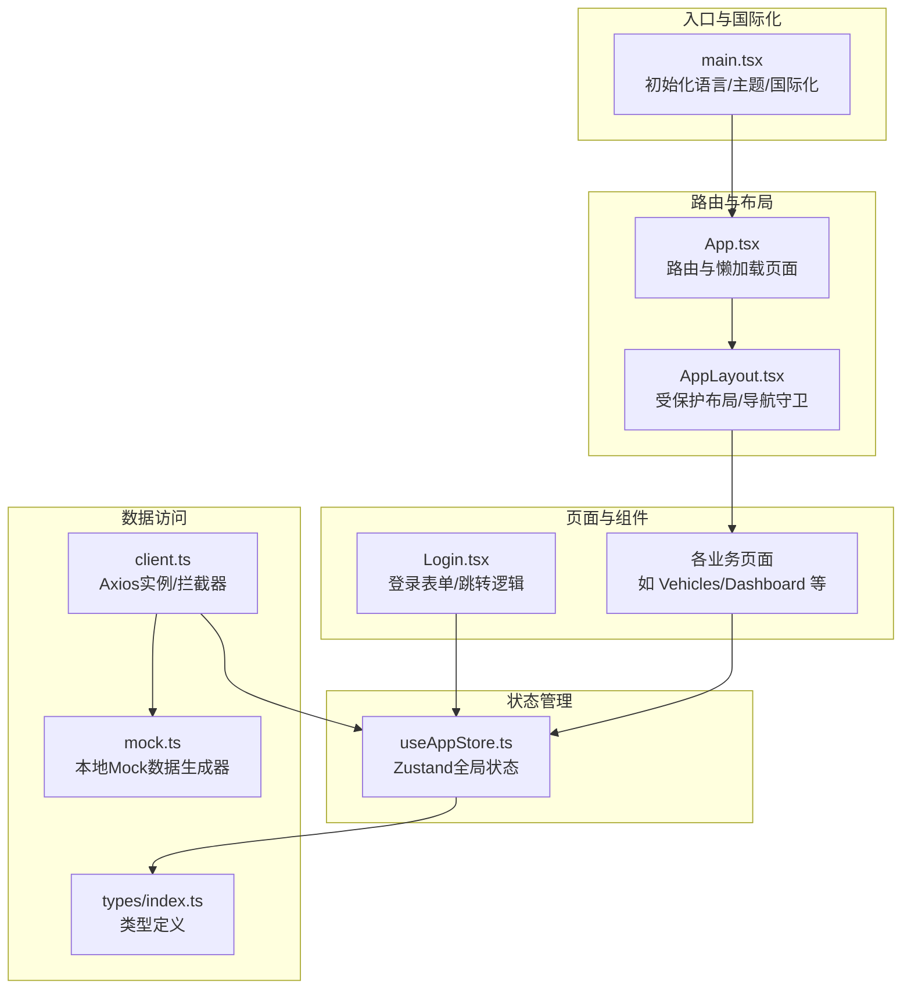
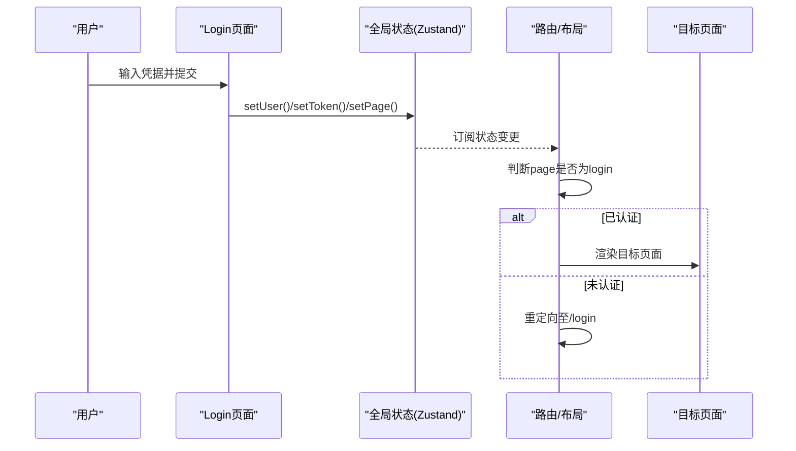
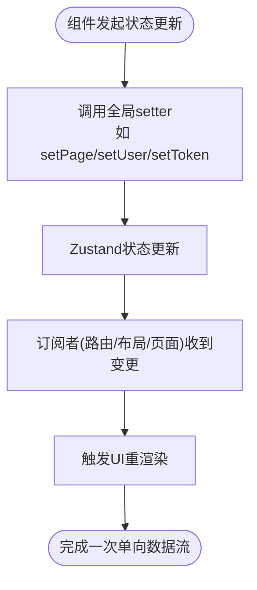
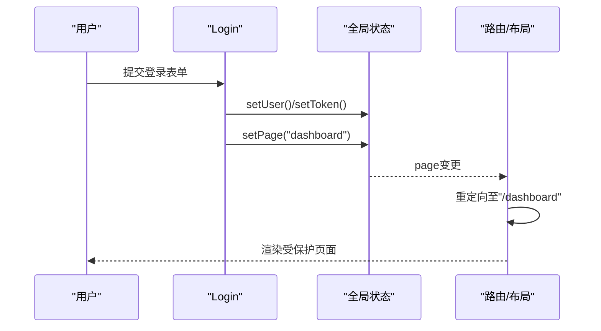
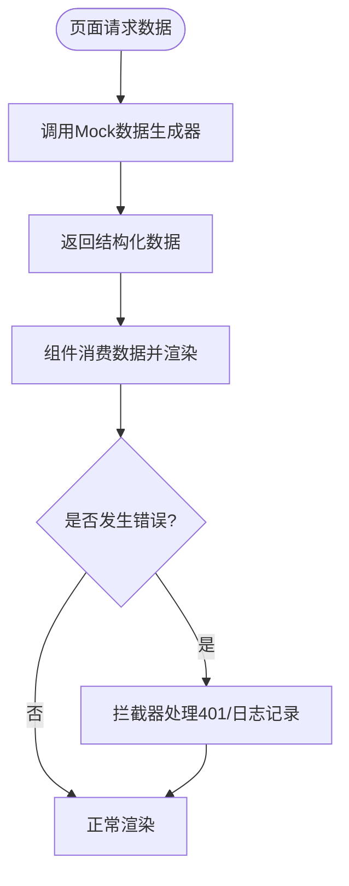
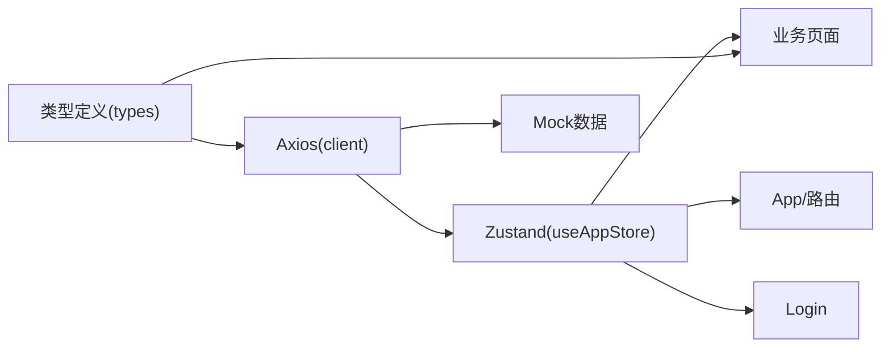

# 数据流模式

<cite>
**本文引用的文件**
- [useAppStore.ts](file://weidu-fleet/src/store/useAppStore.ts)
- [App.tsx](file://weidu-fleet/src/App.tsx)
- [main.tsx](file://weidu-fleet/src/main.tsx)
- [client.ts](file://weidu-fleet/src/api/client.ts)
- [mock.ts](file://weidu-fleet/src/api/mock.ts)
- [Login.tsx](file://weidu-fleet/src/pages/Login.tsx)
- [AppLayout.tsx](file://weidu-fleet/src/components/Layout/AppLayout.tsx)
- [index.ts](file://weidu-fleet/src/types/index.ts)
- [package.json](file://weidu-fleet/package.json)
</cite>

## 目录
1. [引言](#引言)
2. [项目结构](#项目结构)
3. [核心组件](#核心组件)
4. [架构总览](#架构总览)
5. [详细组件分析](#详细组件分析)
6. [依赖分析](#依赖分析)
7. [性能考量](#性能考量)
8. [故障排查指南](#故障排查指南)
9. [结论](#结论)
10. [附录](#附录)

## 引言
本文件面向“苇渡-智利车队管理”项目，系统化阐述其数据流架构与状态管理模式。重点覆盖以下方面：
- 单向数据流与状态提升策略
- 局部状态与全局状态的平衡
- 异步数据获取、缓存与错误恢复
- 用户交互到UI更新的完整数据路径
- 数据流与组件架构的协同关系
- 性能优化建议与最佳实践

## 项目结构
项目采用以页面为中心的组织方式，结合轻量的状态管理（Zustand）与路由控制，形成清晰的单向数据流：
- 入口与国际化：在入口层初始化语言、主题与国际化资源，并通过路由控制页面渲染。
- 路由与布局：根据全局状态决定是否显示登录页或受保护的布局；布局内包含侧边栏与顶部工具条。
- 页面与表格：各业务页面按需加载，部分页面内部维护局部状态，同时共享全局查询参数与筛选条件。
- API与Mock：统一的HTTP客户端拦截器注入鉴权头；演示阶段使用本地Mock数据生成器。

图表来源
- [main.tsx:1-49](file://weidu-fleet/src/main.tsx#L1-L49)
- [App.tsx:1-88](file://weidu-fleet/src/App.tsx#L1-L88)
- [AppLayout.tsx:1-85](file://weidu-fleet/src/components/Layout/AppLayout.tsx#L1-L85)
- [useAppStore.ts:1-87](file://weidu-fleet/src/store/useAppStore.ts#L1-L87)
- [client.ts:1-32](file://weidu-fleet/src/api/client.ts#L1-L32)
- [mock.ts:1-634](file://weidu-fleet/src/api/mock.ts#L1-L634)
- [index.ts:1-261](file://weidu-fleet/src/types/index.ts#L1-L261)

章节来源
- [main.tsx:1-49](file://weidu-fleet/src/main.tsx#L1-L49)
- [App.tsx:1-88](file://weidu-fleet/src/App.tsx#L1-L88)
- [AppLayout.tsx:1-85](file://weidu-fleet/src/components/Layout/AppLayout.tsx#L1-L85)
- [useAppStore.ts:1-87](file://weidu-fleet/src/store/useAppStore.ts#L1-L87)
- [client.ts:1-32](file://weidu-fleet/src/api/client.ts#L1-L32)
- [mock.ts:1-634](file://weidu-fleet/src/api/mock.ts#L1-L634)
- [index.ts:1-261](file://weidu-fleet/src/types/index.ts#L1-L261)

## 核心组件
- 全局状态存储（Zustand）
  - 维护页面、语言、用户、令牌、租户、详情等全局状态。
  - 提供状态提升的setter方法，支持持久化与部分序列化。
  - 关键字段与动作包括：page/lang/user/token/tenant/tenants/detail/_vf/_rt/_dt/_dr/_bt/_mt/_vt/_dv/bz 及对应setter。
- HTTP客户端（Axios + 拦截器）
  - 在请求头注入Bearer Token；对401响应进行登出重定向与状态清理。
- Mock数据生成器
  - 提供车辆、仪表盘统计、告警、行驶、电池、维修、围栏、租户、业务用户/角色、系统用户/角色等数据接口。
- 登录流程
  - 设置用户信息与令牌，切换页面至仪表盘并跳转。
- 布局与导航
  - 根据全局状态判断是否进入登录页；受保护路由下渲染侧边栏与内容区域。

章节来源
- [useAppStore.ts:1-87](file://weidu-fleet/src/store/useAppStore.ts#L1-L87)
- [client.ts:1-32](file://weidu-fleet/src/api/client.ts#L1-L32)
- [mock.ts:1-634](file://weidu-fleet/src/api/mock.ts#L1-L634)
- [Login.tsx:1-167](file://weidu-fleet/src/pages/Login.tsx#L1-L167)
- [AppLayout.tsx:1-85](file://weidu-fleet/src/components/Layout/AppLayout.tsx#L1-L85)

## 架构总览
本项目采用“单向数据流 + 状态提升 + 局部状态”的混合模式：
- 单向数据流：用户操作触发状态变更，状态变化驱动UI更新，不反向写回用户事件。
- 状态提升：登录态、语言、当前页面、全局筛选条件等提升至全局存储，避免跨层级传递。
- 局部状态：页面内的表格过滤、分页、弹窗可见性等维持在组件内部，降低全局抖动。
- 异步数据：演示阶段使用本地Mock；生产环境可替换为真实API调用，保持相同接口契约。

图表来源
- [Login.tsx:1-167](file://weidu-fleet/src/pages/Login.tsx#L1-L167)
- [useAppStore.ts:1-87](file://weidu-fleet/src/store/useAppStore.ts#L1-L87)
- [AppLayout.tsx:1-85](file://weidu-fleet/src/components/Layout/AppLayout.tsx#L1-L85)

## 详细组件分析

### 全局状态与单向数据流
- 状态模型
  - 包含页面、语言、用户、令牌、租户、详情、筛选条件等字段。
  - 使用持久化中间件仅保存必要字段，减少存储体积与副作用。
- 更新路径
  - 组件通过setter函数更新状态；状态变更触发订阅者重渲染。
- 与路由的协作
  - App根据page决定是否渲染登录路由；AppLayout根据page守卫受保护路由。

图表来源
- [useAppStore.ts:1-87](file://weidu-fleet/src/store/useAppStore.ts#L1-L87)
- [App.tsx:1-88](file://weidu-fleet/src/App.tsx#L1-L88)
- [AppLayout.tsx:1-85](file://weidu-fleet/src/components/Layout/AppLayout.tsx#L1-L85)

章节来源
- [useAppStore.ts:1-87](file://weidu-fleet/src/store/useAppStore.ts#L1-L87)
- [App.tsx:1-88](file://weidu-fleet/src/App.tsx#L1-L88)
- [AppLayout.tsx:1-85](file://weidu-fleet/src/components/Layout/AppLayout.tsx#L1-L85)

### 登录流程与状态提升
- 用户交互
  - 登录页收集邮箱、密码、验证码，模拟强制改密后执行登录。
- 状态提升
  - 写入用户信息与令牌，切换页面至仪表盘。
- 导航与守卫
  - AppLayout监听page，若为login则重定向至/login，否则渲染受保护布局。

图表来源
- [Login.tsx:1-167](file://weidu-fleet/src/pages/Login.tsx#L1-L167)
- [useAppStore.ts:1-87](file://weidu-fleet/src/store/useAppStore.ts#L1-L87)
- [AppLayout.tsx:1-85](file://weidu-fleet/src/components/Layout/AppLayout.tsx#L1-L85)

章节来源
- [Login.tsx:1-167](file://weidu-fleet/src/pages/Login.tsx#L1-L167)
- [AppLayout.tsx:1-85](file://weidu-fleet/src/components/Layout/AppLayout.tsx#L1-L85)

### 异步数据获取与Mock集成
- 数据源
  - 演示阶段使用本地Mock生成器，提供车辆、仪表盘、告警、行驶、电池、维修、围栏、租户、业务与系统相关数据。
- 接口契约
  - 各页面通过统一的类型定义进行数据建模，确保前后端一致。
- 错误处理
  - Axios拦截器对401进行自动登出与重定向，保证会话一致性。

图表来源
- [mock.ts:1-634](file://weidu-fleet/src/api/mock.ts#L1-L634)
- [index.ts:1-261](file://weidu-fleet/src/types/index.ts#L1-L261)
- [client.ts:1-32](file://weidu-fleet/src/api/client.ts#L1-L32)

章节来源
- [mock.ts:1-634](file://weidu-fleet/src/api/mock.ts#L1-L634)
- [index.ts:1-261](file://weidu-fleet/src/types/index.ts#L1-L261)
- [client.ts:1-32](file://weidu-fleet/src/api/client.ts#L1-L32)

### 缓存策略与性能优化
- 状态持久化
  - 全局状态仅持久化用户、令牌、语言、租户等关键字段，降低存储压力。
- 组件级缓存
  - 页面内使用记忆化（如useMemo）缓存计算结果，避免重复渲染。
- 懒加载与骨架屏
  - 页面采用动态导入与Suspense骨架屏，缩短首屏等待时间。
- 国际化与主题
  - 入口层集中配置Ant Design语言与主题，减少重复初始化成本。

章节来源
- [useAppStore.ts:1-87](file://weidu-fleet/src/store/useAppStore.ts#L1-L87)
- [main.tsx:1-49](file://weidu-fleet/src/main.tsx#L1-L49)
- [App.tsx:1-88](file://weidu-fleet/src/App.tsx#L1-L88)

## 依赖分析
- 外部依赖
  - Zustand用于轻量状态管理；Axios用于HTTP请求；Ant Design提供UI与国际化；React Router负责路由。
- 内部耦合
  - 所有页面与组件通过全局状态解耦；HTTP客户端集中处理鉴权与错误。
- 循环依赖
  - 当前结构无明显循环依赖；状态与路由相互独立，仅通过订阅联动。

图表来源
- [useAppStore.ts:1-87](file://weidu-fleet/src/store/useAppStore.ts#L1-L87)
- [client.ts:1-32](file://weidu-fleet/src/api/client.ts#L1-L32)
- [mock.ts:1-634](file://weidu-fleet/src/api/mock.ts#L1-L634)
- [index.ts:1-261](file://weidu-fleet/src/types/index.ts#L1-L261)

章节来源
- [package.json:1-41](file://weidu-fleet/package.json#L1-L41)
- [useAppStore.ts:1-87](file://weidu-fleet/src/store/useAppStore.ts#L1-L87)
- [client.ts:1-32](file://weidu-fleet/src/api/client.ts#L1-L32)
- [mock.ts:1-634](file://weidu-fleet/src/api/mock.ts#L1-L634)
- [index.ts:1-261](file://weidu-fleet/src/types/index.ts#L1-L261)

## 性能考量
- 减少全局抖动
  - 将筛选条件与查询参数提升至全局，避免多层props传递；局部状态仅用于UI交互。
- 避免不必要的渲染
  - 对昂贵计算使用记忆化；对高频状态使用选择器订阅特定字段。
- 请求与渲染分离
  - 将异步数据获取与UI渲染解耦，优先展示骨架屏与占位符。
- 本地开发体验
  - Mock数据可快速迭代，减少对后端联调的等待；生产环境只需替换客户端实现。

## 故障排查指南
- 登录后仍跳转至登录页
  - 检查全局状态page是否被正确设置为非login；确认AppLayout守卫逻辑。
- 401未登出
  - 检查Axios拦截器是否生效；确认token是否为空；查看控制台错误日志。
- 语言/主题不生效
  - 确认入口层语言切换与Ant Design locale配置；检查主题token是否正确传入。
- 页面空白或白屏
  - 检查Suspense的fallback是否正确；确认动态导入的页面组件是否存在。

章节来源
- [client.ts:1-32](file://weidu-fleet/src/api/client.ts#L1-L32)
- [AppLayout.tsx:1-85](file://weidu-fleet/src/components/Layout/AppLayout.tsx#L1-L85)
- [main.tsx:1-49](file://weidu-fleet/src/main.tsx#L1-L49)

## 结论
本项目通过Zustand实现轻量、可预测的全局状态管理，配合Axios拦截器与Mock数据，构建了清晰的单向数据流。登录态、语言、页面与筛选等关键状态被提升至全局，既简化了组件间通信，又保持了良好的可扩展性。页面内局部状态与懒加载进一步提升了用户体验与性能。后续接入真实API时，可沿用现有接口契约与拦截器机制，平滑过渡。

## 附录
- 术语
  - 单向数据流：数据只在一个方向流动，从用户操作到状态更新再到UI渲染。
  - 状态提升：将共享状态提升到最近的共同祖先，减少跨层级传递。
  - 局部状态：仅在组件内部使用的状态，避免污染全局。
- 最佳实践
  - 明确划分全局与局部状态边界。
  - 使用拦截器统一处理鉴权与错误。
  - 对昂贵计算与异步数据使用缓存与骨架屏。
  - 保持类型定义与API契约一致，便于演进。