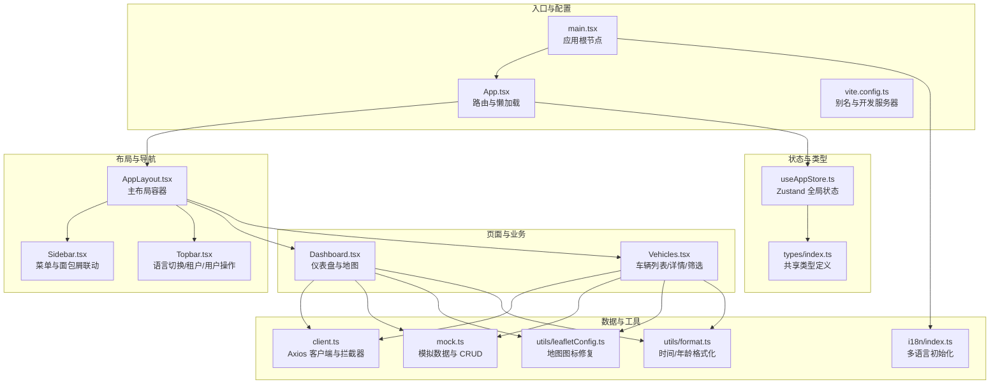
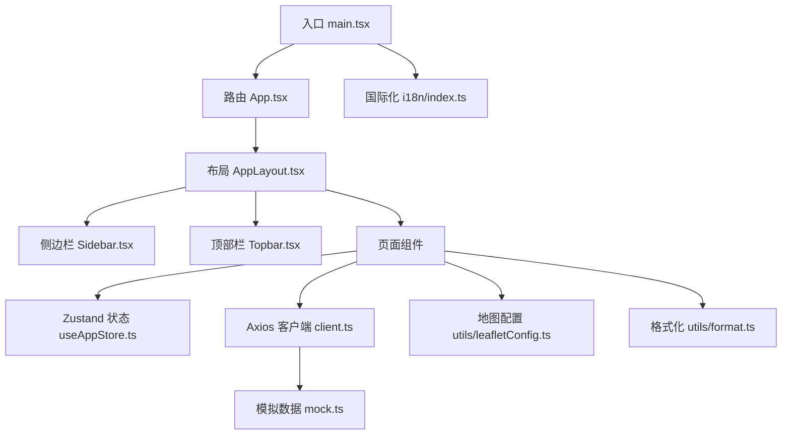
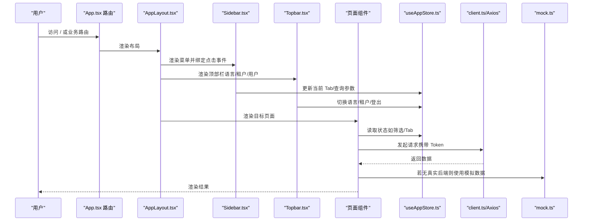
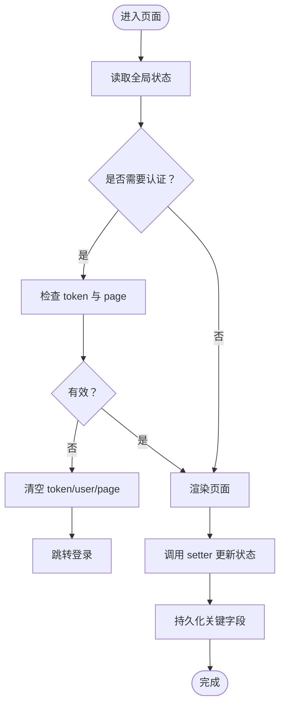
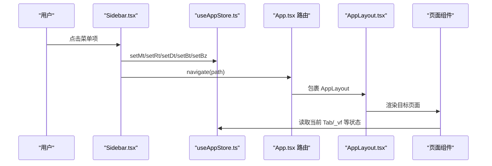
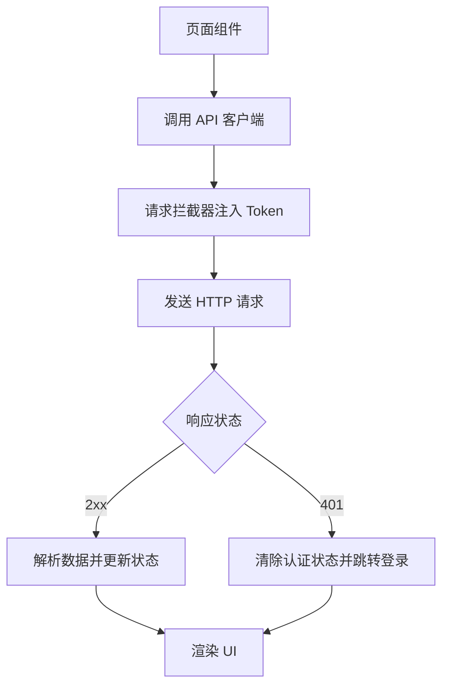
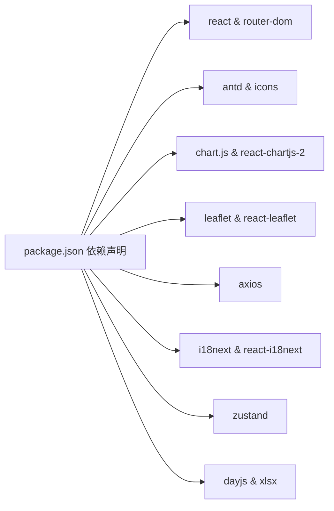

# 架构设计

<cite>
**本文引用的文件**
- [package.json](file://weidu-fleet/package.json)
- [vite.config.ts](file://weidu-fleet/vite.config.ts)
- [main.tsx](file://weidu-fleet/src/main.tsx)
- [App.tsx](file://weidu-fleet/src/App.tsx)
- [useAppStore.ts](file://weidu-fleet/src/store/useAppStore.ts)
- [index.ts](file://weidu-fleet/src/types/index.ts)
- [AppLayout.tsx](file://weidu-fleet/src/components/Layout/AppLayout.tsx)
- [Sidebar.tsx](file://weidu-fleet/src/components/Layout/Sidebar.tsx)
- [Topbar.tsx](file://weidu-fleet/src/components/Layout/Topbar.tsx)
- [Dashboard.tsx](file://weidu-fleet/src/pages/Dashboard.tsx)
- [Vehicles.tsx](file://weidu-fleet/src/pages/Vehicles.tsx)
- [client.ts](file://weidu-fleet/src/api/client.ts)
- [mock.ts](file://weidu-fleet/src/api/mock.ts)
- [index.ts](file://weidu-fleet/src/i18n/index.ts)
- [leafletConfig.ts](file://weidu-fleet/src/utils/leafletConfig.ts)
- [format.ts](file://weidu-fleet/src/utils/format.ts)
</cite>

## 目录
1. [引言](#引言)
2. [项目结构](#项目结构)
3. [核心组件](#核心组件)
4. [架构总览](#架构总览)
5. [详细组件分析](#详细组件分析)
6. [依赖分析](#依赖分析)
7. [性能考量](#性能考量)
8. [故障排查指南](#故障排查指南)
9. [结论](#结论)
10. [附录](#附录)

## 引言
本项目为“苇渡-智利车队管理”前端应用，采用组件化架构与状态管理模式，结合模块化设计实现多页面、多业务域的统一管理平台。系统围绕车辆监控、风险预警、驾驶行为分析、电池状态监测、行程追踪、围栏管理、维修记录以及租户与业务权限等模块展开，提供仪表盘、列表与详情页的组合式视图，并通过本地持久化状态与国际化、地图可视化增强用户体验。

## 项目结构
项目采用基于功能域的模块化组织方式，主要目录与职责如下：
- src/api：API 客户端与模拟数据层
- src/components/Layout：布局组件（侧边栏、顶部栏、主框架）
- src/pages：页面级组件（按业务域划分）
- src/store：全局状态管理（Zustand + 持久化）
- src/types：共享类型定义
- src/utils：通用工具函数（日期格式化、Leaflet 配置）
- src/i18n：国际化资源初始化
- public：静态资源
- vite.config.ts：构建与开发服务器配置

**图表来源**
- [main.tsx:1-49](file://weidu-fleet/src/main.tsx#L1-L49)
- [App.tsx:1-88](file://weidu-fleet/src/App.tsx#L1-L88)
- [AppLayout.tsx:1-85](file://weidu-fleet/src/components/Layout/AppLayout.tsx#L1-L85)
- [Sidebar.tsx:1-272](file://weidu-fleet/src/components/Layout/Sidebar.tsx#L1-L272)
- [Topbar.tsx:1-233](file://weidu-fleet/src/components/Layout/Topbar.tsx#L1-L233)
- [Dashboard.tsx:1-257](file://weidu-fleet/src/pages/Dashboard.tsx#L1-L257)
- [Vehicles.tsx:1-440](file://weidu-fleet/src/pages/Vehicles.tsx#L1-L440)
- [useAppStore.ts:1-87](file://weidu-fleet/src/store/useAppStore.ts#L1-L87)
- [index.ts:1-261](file://weidu-fleet/src/types/index.ts#L1-L261)
- [client.ts:1-32](file://weidu-fleet/src/api/client.ts#L1-L32)
- [mock.ts:1-634](file://weidu-fleet/src/api/mock.ts#L1-L634)
- [index.ts:1-30](file://weidu-fleet/src/i18n/index.ts#L1-L30)
- [leafletConfig.ts:1-14](file://weidu-fleet/src/utils/leafletConfig.ts#L1-L14)
- [format.ts:1-27](file://weidu-fleet/src/utils/format.ts#L1-L27)

**章节来源**
- [package.json:1-41](file://weidu-fleet/package.json#L1-L41)
- [vite.config.ts:1-16](file://weidu-fleet/vite.config.ts#L1-L16)
- [main.tsx:1-49](file://weidu-fleet/src/main.tsx#L1-L49)
- [App.tsx:1-88](file://weidu-fleet/src/App.tsx#L1-L88)

## 核心组件
- 应用入口与主题配置：在入口文件中集成路由、Ant Design 主题与国际化，设置 Ant Design 多语言与 dayjs 本地化，初始化地图图标与全局样式。
- 路由与懒加载：使用 React Router DOM 实现路由分发，登录页与业务页分别懒加载，提升首屏性能。
- 布局系统：AppLayout 将侧边栏、顶部栏与内容区域组合，支持折叠与 Outlet 渲染；侧边栏与面包屑联动，根据当前路径与状态同步选中项。
- 全局状态：Zustand 提供跨组件的状态共享，包含页面键、语言、用户信息、租户、令牌、查询过滤条件与各模块当前 Tab 等，部分字段持久化到本地存储。
- 国际化与地图：i18n 初始化从本地存储恢复语言；Leaflet 图标修复避免打包后默认图标缺失；格式化工具统一时间与时长显示。

**章节来源**
- [main.tsx:1-49](file://weidu-fleet/src/main.tsx#L1-L49)
- [App.tsx:1-88](file://weidu-fleet/src/App.tsx#L1-L88)
- [AppLayout.tsx:1-85](file://weidu-fleet/src/components/Layout/AppLayout.tsx#L1-L85)
- [Sidebar.tsx:1-272](file://weidu-fleet/src/components/Layout/Sidebar.tsx#L1-L272)
- [Topbar.tsx:1-233](file://weidu-fleet/src/components/Layout/Topbar.tsx#L1-L233)
- [useAppStore.ts:1-87](file://weidu-fleet/src/store/useAppStore.ts#L1-L87)
- [index.ts:1-30](file://weidu-fleet/src/i18n/index.ts#L1-L30)
- [leafletConfig.ts:1-14](file://weidu-fleet/src/utils/leafletConfig.ts#L1-L14)
- [format.ts:1-27](file://weidu-fleet/src/utils/format.ts#L1-L27)

## 架构总览
系统采用“入口配置 → 路由分发 → 布局容器 → 页面组件 → 状态与数据”的分层设计。页面组件通过 Axios 客户端访问后端接口或使用本地模拟数据；全局状态驱动 UI 交互与路由跳转；国际化与地图工具贯穿于渲染层。

**图表来源**
- [main.tsx:1-49](file://weidu-fleet/src/main.tsx#L1-L49)
- [App.tsx:1-88](file://weidu-fleet/src/App.tsx#L1-L88)
- [AppLayout.tsx:1-85](file://weidu-fleet/src/components/Layout/AppLayout.tsx#L1-L85)
- [Sidebar.tsx:1-272](file://weidu-fleet/src/components/Layout/Sidebar.tsx#L1-L272)
- [Topbar.tsx:1-233](file://weidu-fleet/src/components/Layout/Topbar.tsx#L1-L233)
- [useAppStore.ts:1-87](file://weidu-fleet/src/store/useAppStore.ts#L1-L87)
- [client.ts:1-32](file://weidu-fleet/src/api/client.ts#L1-L32)
- [mock.ts:1-634](file://weidu-fleet/src/api/mock.ts#L1-L634)
- [index.ts:1-30](file://weidu-fleet/src/i18n/index.ts#L1-L30)
- [leafletConfig.ts:1-14](file://weidu-fleet/src/utils/leafletConfig.ts#L1-L14)
- [format.ts:1-27](file://weidu-fleet/src/utils/format.ts#L1-L27)

## 详细组件分析

### 组件层次结构与数据流向
- 层次结构：入口 → 路由 → 布局 → 侧边栏/顶部栏 → 页面 → 子表格/图表/地图
- 数据流向：页面组件通过状态钩子读取全局状态，发起 API 请求或消费模拟数据，渲染 UI 并更新状态（如筛选条件、当前 Tab）。

**图表来源**
- [App.tsx:1-88](file://weidu-fleet/src/App.tsx#L1-L88)
- [AppLayout.tsx:1-85](file://weidu-fleet/src/components/Layout/AppLayout.tsx#L1-L85)
- [Sidebar.tsx:1-272](file://weidu-fleet/src/components/Layout/Sidebar.tsx#L1-L272)
- [Topbar.tsx:1-233](file://weidu-fleet/src/components/Layout/Topbar.tsx#L1-L233)
- [useAppStore.ts:1-87](file://weidu-fleet/src/store/useAppStore.ts#L1-L87)
- [client.ts:1-32](file://weidu-fleet/src/api/client.ts#L1-L32)
- [mock.ts:1-634](file://weidu-fleet/src/api/mock.ts#L1-L634)

**章节来源**
- [App.tsx:1-88](file://weidu-fleet/src/App.tsx#L1-L88)
- [AppLayout.tsx:1-85](file://weidu-fleet/src/components/Layout/AppLayout.tsx#L1-L85)
- [Sidebar.tsx:1-272](file://weidu-fleet/src/components/Layout/Sidebar.tsx#L1-L272)
- [Topbar.tsx:1-233](file://weidu-fleet/src/components/Layout/Topbar.tsx#L1-L233)

### 状态管理策略
- 状态模型：集中式状态包含页面键、语言、用户、令牌、租户、租户列表、详情标识、查询过滤器与各模块当前 Tab。
- 更新机制：每个字段提供 setter 方法；复合字段通过局部合并更新，减少不必要的重渲染。
- 持久化：仅持久化用户、令牌、语言、租户等关键字段，降低存储体积并保证隐私安全。
- 认证守卫：通过 store 中的 page 字段与 token 控制登录态，响应 401 自动清空状态并跳转登录。

**图表来源**
- [useAppStore.ts:1-87](file://weidu-fleet/src/store/useAppStore.ts#L1-L87)
- [client.ts:1-32](file://weidu-fleet/src/api/client.ts#L1-L32)

**章节来源**
- [useAppStore.ts:1-87](file://weidu-fleet/src/store/useAppStore.ts#L1-L87)
- [client.ts:1-32](file://weidu-fleet/src/api/client.ts#L1-L32)

### 路由系统与页面组织
- 路由规则：登录页无需认证；其余页面均在 AppLayout 下渲染；支持通配符重定向至仪表盘；车辆详情页支持动态参数。
- 懒加载：所有页面组件使用 React.lazy 动态导入，配合 Suspense 显示加载指示。
- 导航联动：侧边栏点击根据路径与查询参数更新对应模块的当前 Tab；顶部栏面包屑映射当前路径。

**图表来源**
- [Sidebar.tsx:1-272](file://weidu-fleet/src/components/Layout/Sidebar.tsx#L1-L272)
- [useAppStore.ts:1-87](file://weidu-fleet/src/store/useAppStore.ts#L1-L87)
- [App.tsx:1-88](file://weidu-fleet/src/App.tsx#L1-L88)
- [AppLayout.tsx:1-85](file://weidu-fleet/src/components/Layout/AppLayout.tsx#L1-L85)

**章节来源**
- [App.tsx:1-88](file://weidu-fleet/src/App.tsx#L1-L88)
- [Sidebar.tsx:1-272](file://weidu-fleet/src/components/Layout/Sidebar.tsx#L1-L272)
- [Topbar.tsx:1-233](file://weidu-fleet/src/components/Layout/Topbar.tsx#L1-L233)

### API 层设计与数据流
- Axios 客户端：统一基地址、超时与请求头注入；响应拦截处理 401 自动登出。
- 模拟数据：提供车辆、告警、驾驶、电池、行程、围栏、维修、租户、资产、业务与系统用户等数据，支持增删改查演示。
- 页面消费：仪表盘与车辆页面分别调用不同数据源，统一通过 useMemo 缓存计算结果，减少重复渲染。

**图表来源**
- [client.ts:1-32](file://weidu-fleet/src/api/client.ts#L1-L32)
- [mock.ts:1-634](file://weidu-fleet/src/api/mock.ts#L1-L634)
- [Dashboard.tsx:1-257](file://weidu-fleet/src/pages/Dashboard.tsx#L1-L257)
- [Vehicles.tsx:1-440](file://weidu-fleet/src/pages/Vehicles.tsx#L1-L440)

**章节来源**
- [client.ts:1-32](file://weidu-fleet/src/api/client.ts#L1-L32)
- [mock.ts:1-634](file://weidu-fleet/src/api/mock.ts#L1-L634)
- [Dashboard.tsx:1-257](file://weidu-fleet/src/pages/Dashboard.tsx#L1-L257)
- [Vehicles.tsx:1-440](file://weidu-fleet/src/pages/Vehicles.tsx#L1-L440)

### 可视化与地图集成
- 地图：使用 react-leaflet 与 OpenStreetMap，展示在线车辆位置与弹窗信息；通过 dayjs 进行时间格式化。
- 图表：使用 Chart.js 与 react-chartjs-2 展示驾驶风险统计；支持 Tab 切换周期维度。
- 表格与筛选：车辆列表支持多条件筛选、导入导出模板、批量上传与失败明细下载。

**章节来源**
- [Dashboard.tsx:1-257](file://weidu-fleet/src/pages/Dashboard.tsx#L1-L257)
- [Vehicles.tsx:1-440](file://weidu-fleet/src/pages/Vehicles.tsx#L1-L440)
- [leafletConfig.ts:1-14](file://weidu-fleet/src/utils/leafletConfig.ts#L1-L14)
- [format.ts:1-27](file://weidu-fleet/src/utils/format.ts#L1-L27)

## 依赖分析
- 前端框架与 UI：React、React Router DOM、Ant Design、Ant Design Icons
- 可视化：Chart.js、react-chartjs-2、Leaflet、react-leaflet
- 网络与国际化：axios、i18next、react-i18next
- 工具与格式化：dayjs、xlsx
- 状态管理：zustand（含持久化中间件）

**图表来源**
- [package.json:1-41](file://weidu-fleet/package.json#L1-L41)

**章节来源**
- [package.json:1-41](file://weidu-fleet/package.json#L1-L41)

## 性能考量
- 懒加载与代码分割：页面组件懒加载显著降低首屏体积与加载时间。
- 状态持久化：仅持久化必要字段，避免存储膨胀；本地恢复语言与主题一致性。
- 渲染优化：页面内使用 useMemo 缓存计算结果；表格与地图组件按需渲染。
- 构建优化：Vite 别名与开发服务器端口配置，提升开发体验与构建效率。

[本节为通用指导，不直接分析具体文件]

## 故障排查指南
- 登录态失效：当后端返回 401 时，客户端自动清除 token 与用户信息并跳转登录页。
- 语言与主题：入口文件根据 store 中语言设置 dayjs 与 Ant Design 语言包；若语言不生效，检查本地存储中的持久化状态。
- 地图图标：确保已执行 Leaflet 图标修复脚本，避免打包后默认图标缺失。
- 时间显示：统一使用格式化工具进行时区转换与格式化，避免跨时区显示异常。

**章节来源**
- [client.ts:1-32](file://weidu-fleet/src/api/client.ts#L1-L32)
- [main.tsx:1-49](file://weidu-fleet/src/main.tsx#L1-L49)
- [leafletConfig.ts:1-14](file://weidu-fleet/src/utils/leafletConfig.ts#L1-L14)
- [format.ts:1-27](file://weidu-fleet/src/utils/format.ts#L1-L27)

## 结论
本项目以组件化架构为核心，结合 Zustand 状态管理与模块化设计，实现了多业务域的统一管理平台。通过路由懒加载、状态持久化、国际化与地图可视化等手段，兼顾了性能与用户体验。建议后续在真实后端接入时完善错误边界与加载态、细化权限控制与审计日志，并持续优化大数据量场景下的渲染性能。

[本节为总结性内容，不直接分析具体文件]

## 附录
- 类型系统：共享类型定义覆盖车辆、告警、围栏、行程、维修、租户、资产、业务与系统用户等实体，保障前后端契约一致。
- 开发配置：Vite 别名指向 src，便于模块导入；开发服务器端口 3000，便于本地联调。

**章节来源**
- [index.ts:1-261](file://weidu-fleet/src/types/index.ts#L1-L261)
- [vite.config.ts:1-16](file://weidu-fleet/vite.config.ts#L1-L16)