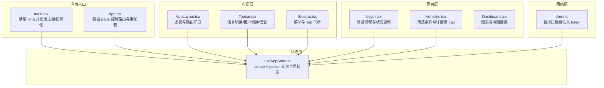
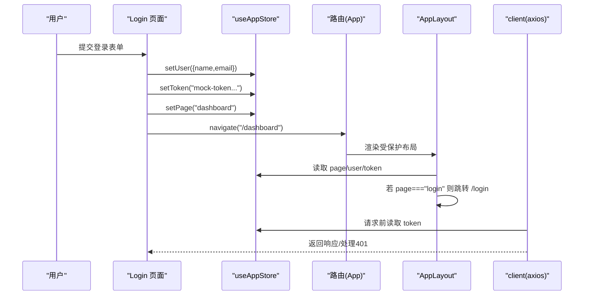
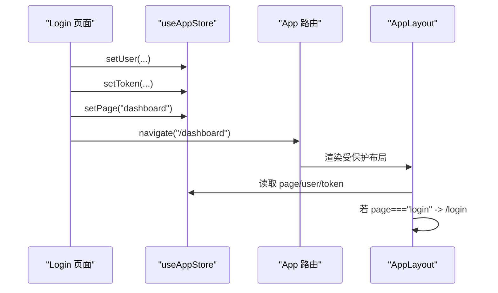
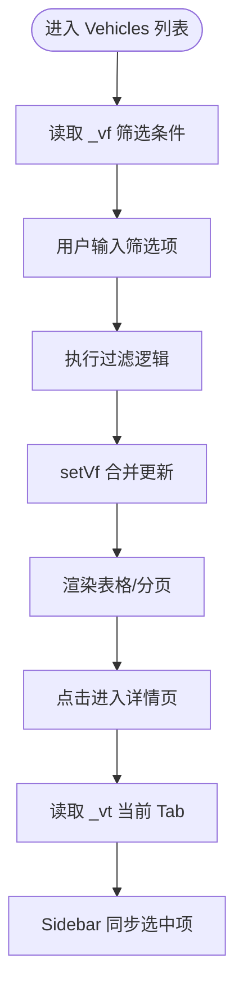
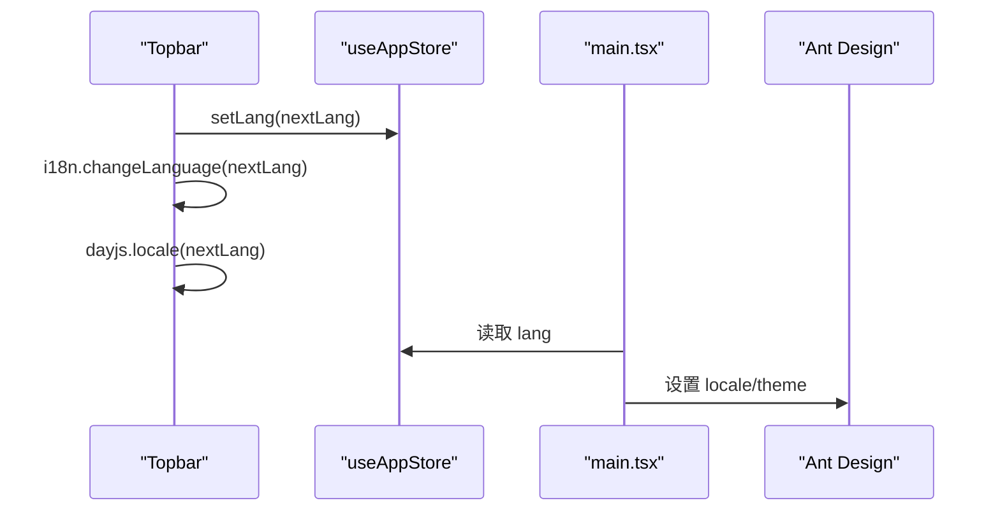
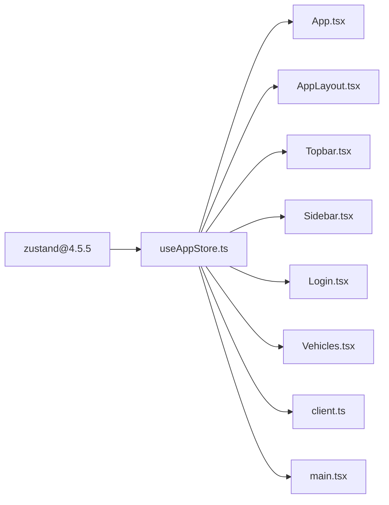

# 状态管理

<cite>
**本文引用的文件列表**
- [useAppStore.ts](file://weidu-fleet/src/store/useAppStore.ts)
- [package.json](file://weidu-fleet/package.json)
- [App.tsx](file://weidu-fleet/src/App.tsx)
- [main.tsx](file://weidu-fleet/src/main.tsx)
- [Login.tsx](file://weidu-fleet/src/pages/Login.tsx)
- [Dashboard.tsx](file://weidu-fleet/src/pages/Dashboard.tsx)
- [Vehicles.tsx](file://weidu-fleet/src/pages/Vehicles.tsx)
- [AppLayout.tsx](file://weidu-fleet/src/components/Layout/AppLayout.tsx)
- [Topbar.tsx](file://weidu-fleet/src/components/Layout/Topbar.tsx)
- [Sidebar.tsx](file://weidu-fleet/src/components/Layout/Sidebar.tsx)
- [client.ts](file://weidu-fleet/src/api/client.ts)
- [index.ts](file://weidu-fleet/src/types/index.ts)
</cite>

## 目录
1. [简介](#简介)
2. [项目结构](#项目结构)
3. [核心组件](#核心组件)
4. [架构总览](#架构总览)
5. [详细组件分析](#详细组件分析)
6. [依赖分析](#依赖分析)
7. [性能考量](#性能考量)
8. [故障排查指南](#故障排查指南)
9. [结论](#结论)
10. [附录](#附录)

## 简介
本文件系统性梳理苇渡-智利车队管理项目的全局状态管理方案，围绕 Zustand 的使用方式、设计理念、全局状态结构、状态更新机制与持久化策略展开。文档同时总结最佳实践（状态划分原则、性能优化、调试技巧），并通过组件与状态的绑定关系、数据流向图示帮助读者快速掌握状态管理在项目中的落地方式。

## 项目结构
项目采用基于 Zustand 的单仓库全局状态模型，状态定义集中在 store/useAppStore.ts 中，通过 create/persist 组合实现状态创建与本地持久化；应用入口 main.tsx 读取语言状态以配置 Ant Design 主题与国际化；路由层 App.tsx 根据 page 状态控制登录态与页面渲染；布局层 AppLayout.tsx 基于 store 进行鉴权跳转；各业务页面（如 Login、Vehicles）通过 useAppStore 钩子读写状态，完成用户态、租户、筛选条件、当前 Tab 等信息的共享与同步。



**图表来源**
- [main.tsx:21-42](file://weidu-fleet/src/main.tsx#L21-L42)
- [App.tsx:36-84](file://weidu-fleet/src/App.tsx#L36-L84)
- [useAppStore.ts:40-86](file://weidu-fleet/src/store/useAppStore.ts#L40-L86)
- [AppLayout.tsx:10-31](file://weidu-fleet/src/components/Layout/AppLayout.tsx#L10-L31)
- [Topbar.tsx:35-83](file://weidu-fleet/src/components/Layout/Topbar.tsx#L35-L83)
- [Sidebar.tsx:25-178](file://weidu-fleet/src/components/Layout/Sidebar.tsx#L25-L178)
- [Login.tsx:13-51](file://weidu-fleet/src/pages/Login.tsx#L13-L51)
- [Vehicles.tsx:47-90](file://weidu-fleet/src/pages/Vehicles.tsx#L47-L90)
- [client.ts:1-32](file://weidu-fleet/src/api/client.ts#L1-L32)

**章节来源**
- [main.tsx:1-49](file://weidu-fleet/src/main.tsx#L1-L49)
- [App.tsx:1-88](file://weidu-fleet/src/App.tsx#L1-L88)
- [useAppStore.ts:1-87](file://weidu-fleet/src/store/useAppStore.ts#L1-L87)

## 核心组件
- 全局状态仓库：useAppStore.ts 使用 create + persist 创建状态，包含页面状态、用户信息、语言、租户、筛选条件、当前 Tab 等字段及对应的 setter。
- 应用入口：main.tsx 从 store 读取 lang 并设置 Ant Design 主题与 dayjs 语言，确保 UI 与日期显示随语言变化。
- 路由与鉴权：App.tsx 根据 page 判断是否渲染登录页或受保护布局；AppLayout.tsx 在每次渲染时检查 page，若为 login 则重定向至 /login。
- 业务页面：Login.tsx 在登录成功后写入 user、token，并将 page 切换为 dashboard；Vehicles.tsx 使用 _vf 存储筛选条件并在搜索时更新；Topbar.tsx 支持语言切换、租户切换与登出。
- 网络层：client.ts 在请求前从 store 获取 token 注入 Authorization 头，在 401 时回退到登录态。

**章节来源**
- [useAppStore.ts:5-38](file://weidu-fleet/src/store/useAppStore.ts#L5-L38)
- [main.tsx:21-31](file://weidu-fleet/src/main.tsx#L21-L31)
- [App.tsx:36-48](file://weidu-fleet/src/App.tsx#L36-L48)
- [AppLayout.tsx:15-26](file://weidu-fleet/src/components/Layout/AppLayout.tsx#L15-L26)
- [Login.tsx:16-51](file://weidu-fleet/src/pages/Login.tsx#L16-L51)
- [Vehicles.tsx:47-90](file://weidu-fleet/src/pages/Vehicles.tsx#L47-L90)
- [Topbar.tsx:35-83](file://weidu-fleet/src/components/Layout/Topbar.tsx#L35-L83)
- [client.ts:9-29](file://weidu-fleet/src/api/client.ts#L9-L29)

## 架构总览
Zustand 在本项目中承担“单一真相源”的角色，所有需要跨组件共享的数据均来自该 store。持久化策略仅保存必要的用户态与语言等轻量信息，避免存储重型业务数据，降低持久化体积与恢复成本。



**图表来源**
- [Login.tsx:46-51](file://weidu-fleet/src/pages/Login.tsx#L46-L51)
- [App.tsx:36-48](file://weidu-fleet/src/App.tsx#L36-L48)
- [AppLayout.tsx:22-26](file://weidu-fleet/src/components/Layout/AppLayout.tsx#L22-L26)
- [client.ts:9-29](file://weidu-fleet/src/api/client.ts#L9-L29)
- [useAppStore.ts:59-74](file://weidu-fleet/src/store/useAppStore.ts#L59-L74)

## 详细组件分析

### 全局状态结构与持久化策略
- 状态键位概览
  - 页面与鉴权：page、user、token、tenant、tenants、detail
  - 国际化：lang
  - 业务筛选与 Tab：_vf（车辆筛选）、_rt/_dt/_dr/_bt/_mt/_vt/_dv/_bz（各模块当前 Tab）
- 更新机制
  - 基础 setter：setPage、setLang、setUser、setToken、setTenant、setTenants、setDetail
  - 复合更新：setVf 对内部对象进行浅合并；其余 setter 直接替换对应字段
- 持久化策略
  - 仅持久化 user、token、lang、tenant，避免持久化重型业务数据
  - 使用 partialize 选择性序列化，减少存储开销

```mermaid
classDiagram
class AppState {
+page : PageKey|"login"
+lang : Lang
+user : {name,email,mustChangePassword?}|null
+token : string|null
+tenant : string|null
+tenants : TenantItem[]
+detail : string|null
+_vf : {vin?,plate?,device?,batteryVer?,minAge?,maxAge?}
+_rt : string
+_dt : string
+_dr : string
+_bt : string
+_mt : string
+_vt : string
+_dv : string
+bz : string
+setPage(page)
+setLang(lang)
+setUser(user)
+setToken(token)
+setTenant(tenant)
+setTenants(tenants)
+setDetail(detail)
+setVf(vf)
+setRt(rt)
+setDt(dt)
+setDr(dr)
+setBt(bt)
+setMt(mt)
+setVt(vt)
+setDv(dv)
+setBz(bz)
}
```

**图表来源**
- [useAppStore.ts:5-38](file://weidu-fleet/src/store/useAppStore.ts#L5-L38)

**章节来源**
- [useAppStore.ts:40-86](file://weidu-fleet/src/store/useAppStore.ts#L40-L86)
- [index.ts:176-177](file://weidu-fleet/src/types/index.ts#L176-L177)

### 登录流程与状态联动
- 登录成功后写入 user、token，并将 page 切换为 dashboard，随后导航到 /dashboard
- 顶层路由根据 page 决定是否渲染登录页或受保护布局
- AppLayout 作为受保护布局的根容器，若检测到 page 为 login，则直接跳转 /login



**图表来源**
- [Login.tsx:46-51](file://weidu-fleet/src/pages/Login.tsx#L46-L51)
- [App.tsx:36-48](file://weidu-fleet/src/App.tsx#L36-L48)
- [AppLayout.tsx:22-26](file://weidu-fleet/src/components/Layout/AppLayout.tsx#L22-L26)

**章节来源**
- [Login.tsx:16-51](file://weidu-fleet/src/pages/Login.tsx#L16-L51)
- [App.tsx:36-48](file://weidu-fleet/src/App.tsx#L36-L48)
- [AppLayout.tsx:15-31](file://weidu-fleet/src/components/Layout/AppLayout.tsx#L15-L31)

### 车辆列表筛选与 Tab 状态
- 车辆列表页使用 _vf 存储筛选条件（VIN、车牌、设备、电池版本、最小/最大车龄），搜索时调用 setVf 合并更新
- 详情页 Tab 通过 _vt 记录当前激活标签页，Sidebar 根据当前路径与 _mt/_rt/_dt/_bt/_bz 同步选中项



**图表来源**
- [Vehicles.tsx:47-90](file://weidu-fleet/src/pages/Vehicles.tsx#L47-L90)
- [Sidebar.tsx:150-178](file://weidu-fleet/src/components/Layout/Sidebar.tsx#L150-L178)

**章节来源**
- [Vehicles.tsx:47-90](file://weidu-fleet/src/pages/Vehicles.tsx#L47-L90)
- [Sidebar.tsx:150-178](file://weidu-fleet/src/components/Layout/Sidebar.tsx#L150-L178)

### 语言切换与国际化联动
- Topbar 提供语言切换按钮，循环切换 zh/en/es
- 切换时调用 setLang，并通过 i18n.changeLanguage 与 dayjs.locale 同步更新
- main.tsx 读取 lang 并配置 Ant Design 主题与 locale



**图表来源**
- [Topbar.tsx:55-62](file://weidu-fleet/src/components/Layout/Topbar.tsx#L55-L62)
- [main.tsx:21-31](file://weidu-fleet/src/main.tsx#L21-L31)

**章节来源**
- [Topbar.tsx:35-62](file://weidu-fleet/src/components/Layout/Topbar.tsx#L35-L62)
- [main.tsx:21-31](file://weidu-fleet/src/main.tsx#L21-L31)

### 租户切换与权限 Tab
- Topbar 提供租户下拉切换，写入 tenant
- Sidebar 根据当前路径与 _bz 同步业务模块的权限/信息/资产等 Tab

**章节来源**
- [Topbar.tsx:127-146](file://weidu-fleet/src/components/Layout/Topbar.tsx#L127-L146)
- [Sidebar.tsx:150-163](file://weidu-fleet/src/components/Layout/Sidebar.tsx#L150-L163)

### 网络层与鉴权
- client.ts 在请求拦截器中从 store 读取 token 注入 Authorization
- 响应拦截器在 401 时清空 token/user/page，回到登录态

**章节来源**
- [client.ts:9-29](file://weidu-fleet/src/api/client.ts#L9-L29)

## 依赖分析
- Zustand 版本：4.5.5
- 依赖关系
  - store/useAppStore.ts 为全局状态中心，被 App.tsx、AppLayout.tsx、Topbar.tsx、Sidebar.tsx、Login.tsx、Vehicles.tsx 等多处消费
  - axios 通过 client.ts 间接依赖 store 以获取 token
  - main.tsx 依赖 store 以配置语言与主题



**图表来源**
- [package.json:25](file://weidu-fleet/package.json#L25)
- [useAppStore.ts:1-3](file://weidu-fleet/src/store/useAppStore.ts#L1-L3)

**章节来源**
- [package.json:11-26](file://weidu-fleet/package.json#L11-L26)
- [useAppStore.ts:1-3](file://weidu-fleet/src/store/useAppStore.ts#L1-L3)

## 性能考量
- 状态粒度与订阅范围
  - 将页面状态、用户态、语言、租户等轻量信息持久化，避免在组件内重复计算或缓存重型数据
  - 在组件中按需订阅字段，避免不必要的重渲染
- 计算与缓存
  - 使用 useMemo 缓存静态数据（如 Dashboard 图表数据、车辆列表）
  - 在 Vehicles 列表中对筛选结果进行一次性计算并复用
- 持久化体积控制
  - 仅持久化 user、token、lang、tenant，避免持久化大数据集合
- 网络层优化
  - 通过拦截器统一注入 token，减少重复逻辑
  - 401 自动回退登录态，避免无效请求堆积

[本节为通用指导，不直接分析具体文件，故无“章节来源”]

## 故障排查指南
- 登录后仍跳转到登录页
  - 检查 Login 是否正确调用 setUser/setToken/setPage
  - 确认 AppLayout 的 page 检测逻辑与 navigate 调用
- 语言切换无效
  - 确认 Topbar 的 setLang 与 i18n.changeLanguage/dayjs.locale 调用顺序
  - 检查 main.tsx 是否读取到最新 lang 并设置 Ant Design locale
- 401 后未回到登录页
  - 检查 client.ts 响应拦截器是否正确读取 store 并调用 setToken/setUser/setPage
- 筛选条件未生效
  - 确认 Vehicles 中 setVf 的调用时机与参数合并逻辑
- Tab 未同步
  - 检查 Sidebar 的 getSelectedKey 与各模块 _rt/_dt/_bt/_mt/_vt/_bz 的写入

**章节来源**
- [Login.tsx:46-51](file://weidu-fleet/src/pages/Login.tsx#L46-L51)
- [AppLayout.tsx:22-26](file://weidu-fleet/src/components/Layout/AppLayout.tsx#L22-L26)
- [Topbar.tsx:55-62](file://weidu-fleet/src/components/Layout/Topbar.tsx#L55-L62)
- [main.tsx:21-31](file://weidu-fleet/src/main.tsx#L21-L31)
- [client.ts:17-29](file://weidu-fleet/src/api/client.ts#L17-L29)
- [Vehicles.tsx:66-90](file://weidu-fleet/src/pages/Vehicles.tsx#L66-L90)
- [Sidebar.tsx:150-178](file://weidu-fleet/src/components/Layout/Sidebar.tsx#L150-L178)

## 结论
本项目采用 Zustand 实现轻量、可持久化的全局状态管理，通过 create + persist 将用户态与语言等关键信息持久化，结合路由与布局层的鉴权逻辑，形成清晰的数据流与控制流。组件通过 useAppStore 的细粒度订阅实现高效渲染，配合拦截器与语言/租户等状态联动，构建了稳定且易维护的状态体系。

[本节为总结性内容，不直接分析具体文件，故无“章节来源”]

## 附录
- 状态更新函数参考路径
  - [setUser:47-48](file://weidu-fleet/src/pages/Login.tsx#L47-L48)
  - [setToken:48-49](file://weidu-fleet/src/pages/Login.tsx#L48-L49)
  - [setPage:49-50](file://weidu-fleet/src/pages/Login.tsx#L49-L50)
  - [setVf:78-79](file://weidu-fleet/src/pages/Vehicles.tsx#L78-L79)
  - [setLang:59-60](file://weidu-fleet/src/components/Layout/Topbar.tsx#L59-L60)
  - [setTenant:134-134](file://weidu-fleet/src/components/Layout/Topbar.tsx#L134-L134)
  - [setRt/setDt/setBt/setMt/setVt/setDv/setBz:30-34](file://weidu-fleet/src/components/Layout/Sidebar.tsx#L30-L34)
- 数据流向参考路径
  - [AppLayout 鉴权跳转:22-26](file://weidu-fleet/src/components/Layout/AppLayout.tsx#L22-L26)
  - [client 注入 token:9-14](file://weidu-fleet/src/api/client.ts#L9-L14)
  - [main 语言配置:21-31](file://weidu-fleet/src/main.tsx#L21-L31)

[本节为补充说明，不直接分析具体文件，故无“章节来源”]