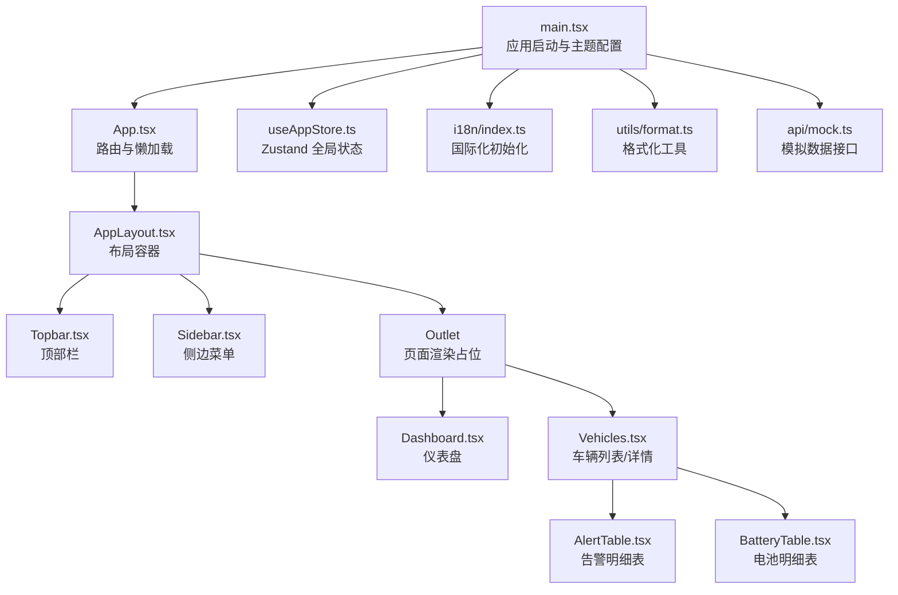
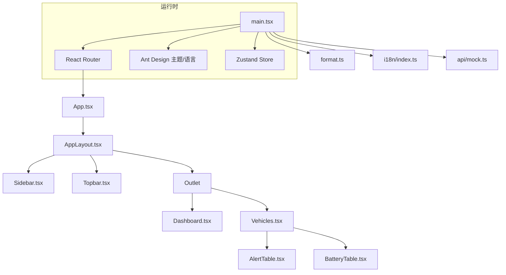
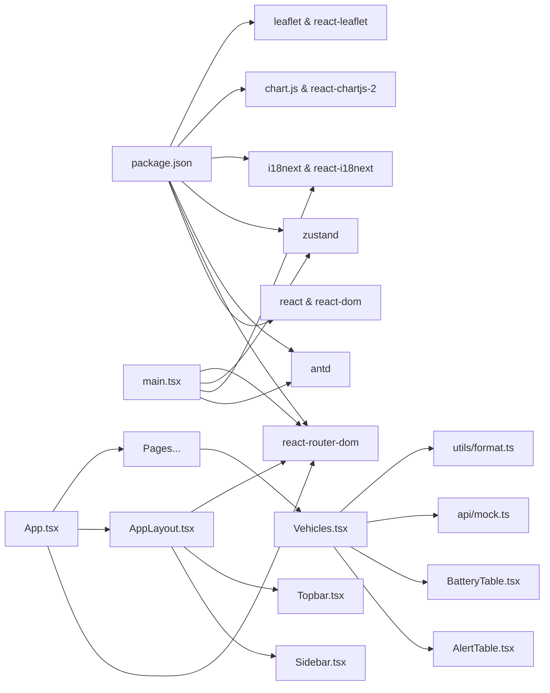

# 组件架构

<cite>
**本文引用的文件**
- [App.tsx](file://weidu-fleet/src/App.tsx)
- [main.tsx](file://weidu-fleet/src/main.tsx)
- [AppLayout.tsx](file://weidu-fleet/src/components/Layout/AppLayout.tsx)
- [Sidebar.tsx](file://weidu-fleet/src/components/Layout/Sidebar.tsx)
- [Topbar.tsx](file://weidu-fleet/src/components/Layout/Topbar.tsx)
- [useAppStore.ts](file://weidu-fleet/src/store/useAppStore.ts)
- [Dashboard.tsx](file://weidu-fleet/src/pages/Dashboard.tsx)
- [Vehicles.tsx](file://weidu-fleet/src/pages/Vehicles.tsx)
- [AlertTable.tsx](file://weidu-fleet/src/pages/Vehicles/AlertTable.tsx)
- [BatteryTable.tsx](file://weidu-fleet/src/pages/Vehicles/BatteryTable.tsx)
- [index.ts](file://weidu-fleet/src/i18n/index.ts)
- [format.ts](file://weidu-fleet/src/utils/format.ts)
- [mock.ts](file://weidu-fleet/src/api/mock.ts)
- [package.json](file://weidu-fleet/package.json)
- [vite.config.ts](file://weidu-fleet/vite.config.ts)
</cite>

## 目录
1. [引言](#引言)
2. [项目结构](#项目结构)
3. [核心组件](#核心组件)
4. [架构总览](#架构总览)
5. [组件详解](#组件详解)
6. [依赖关系分析](#依赖关系分析)
7. [性能考量](#性能考量)
8. [故障排查指南](#故障排查指南)
9. [结论](#结论)
10. [附录](#附录)

## 引言
本文件面向“苇渡-智利车队管理”项目，系统化梳理基于 React 的组件化架构设计，重点覆盖以下方面：
- 函数式组件与 Hooks 模式在项目中的应用
- 根组件、布局组件与导航组件的层次结构与职责划分
- 组件间通信机制：状态提升、全局状态管理、路由与参数传递
- 可复用性设计与组合模式
- 生命周期管理与最佳实践
- 具体代码示例路径，便于对照实现

## 项目结构
项目采用按功能域分层的组织方式，核心入口位于 src/main.tsx，路由与页面由 App.tsx 配置；布局层由 AppLayout 及其子组件 Sidebar、Topbar 提供；全局状态通过 Zustand 的 useAppStore 管理；页面组件按业务模块划分。

图表来源
- [main.tsx:1-49](file://weidu-fleet/src/main.tsx#L1-L49)
- [App.tsx:1-88](file://weidu-fleet/src/App.tsx#L1-L88)
- [AppLayout.tsx:1-85](file://weidu-fleet/src/components/Layout/AppLayout.tsx#L1-L85)
- [Topbar.tsx:1-233](file://weidu-fleet/src/components/Layout/Topbar.tsx#L1-L233)
- [Sidebar.tsx:1-272](file://weidu-fleet/src/components/Layout/Sidebar.tsx#L1-L272)
- [Dashboard.tsx:1-257](file://weidu-fleet/src/pages/Dashboard.tsx#L1-L257)
- [Vehicles.tsx:1-200](file://weidu-fleet/src/pages/Vehicles.tsx#L1-L200)
- [AlertTable.tsx:1-42](file://weidu-fleet/src/pages/Vehicles/AlertTable.tsx#L1-L42)
- [BatteryTable.tsx:1-20](file://weidu-fleet/src/pages/Vehicles/BatteryTable.tsx#L1-L20)
- [useAppStore.ts:1-87](file://weidu-fleet/src/store/useAppStore.ts#L1-L87)
- [index.ts:1-30](file://weidu-fleet/src/i18n/index.ts#L1-L30)
- [format.ts:1-27](file://weidu-fleet/src/utils/format.ts#L1-L27)
- [mock.ts:1-200](file://weidu-fleet/src/api/mock.ts#L1-L200)

章节来源
- [main.tsx:1-49](file://weidu-fleet/src/main.tsx#L1-L49)
- [App.tsx:1-88](file://weidu-fleet/src/App.tsx#L1-L88)
- [vite.config.ts:1-16](file://weidu-fleet/vite.config.ts#L1-L16)

## 核心组件
- 应用入口与主题配置：main.tsx 负责 Ant Design 主题、语言环境与 StrictMode 包装，并挂载根组件 App。
- 根组件与路由：App.tsx 使用 React Router 进行路由配置，支持登录页与受保护页面的懒加载与权限控制。
- 布局容器：AppLayout.tsx 提供 Sider、Header、Content 的 Ant Design 布局骨架，负责折叠状态与页面跳转。
- 导航组件：Sidebar.tsx 实现菜单项、面包屑联动与 Tab 参数同步；Topbar.tsx 提供语言切换、租户切换、用户下拉等。
- 页面组件：Dashboard.tsx 展示统计卡片、图表与地图；Vehicles.tsx 提供车辆列表筛选、导入导出、详情页及多个子表组件。
- 子表组件：AlertTable.tsx、BatteryTable.tsx 等以纯函数组件+Memo化的方式实现高内聚、可复用的数据表格。
- 全局状态：useAppStore.ts 使用 Zustand 管理页面键、语言、用户、令牌、租户、查询过滤器等状态，并持久化部分字段。
- 工具与数据：format.ts 提供时间与年龄格式化；mock.ts 提供各模块的模拟数据；i18n/index.ts 初始化多语言资源。

章节来源
- [main.tsx:1-49](file://weidu-fleet/src/main.tsx#L1-L49)
- [App.tsx:1-88](file://weidu-fleet/src/App.tsx#L1-L88)
- [AppLayout.tsx:1-85](file://weidu-fleet/src/components/Layout/AppLayout.tsx#L1-L85)
- [Sidebar.tsx:1-272](file://weidu-fleet/src/components/Layout/Sidebar.tsx#L1-L272)
- [Topbar.tsx:1-233](file://weidu-fleet/src/components/Layout/Topbar.tsx#L1-L233)
- [Dashboard.tsx:1-257](file://weidu-fleet/src/pages/Dashboard.tsx#L1-L257)
- [Vehicles.tsx:1-200](file://weidu-fleet/src/pages/Vehicles.tsx#L1-L200)
- [AlertTable.tsx:1-42](file://weidu-fleet/src/pages/Vehicles/AlertTable.tsx#L1-L42)
- [BatteryTable.tsx:1-20](file://weidu-fleet/src/pages/Vehicles/BatteryTable.tsx#L1-L20)
- [useAppStore.ts:1-87](file://weidu-fleet/src/store/useAppStore.ts#L1-L87)
- [format.ts:1-27](file://weidu-fleet/src/utils/format.ts#L1-L27)
- [mock.ts:1-200](file://weidu-fleet/src/api/mock.ts#L1-L200)
- [index.ts:1-30](file://weidu-fleet/src/i18n/index.ts#L1-L30)

## 架构总览
整体采用“入口配置 -> 路由分发 -> 布局容器 -> 页面/子组件”的分层架构。全局状态集中于 Zustand，路由与国际化在入口处统一初始化，页面组件通过 Hooks 访问状态与数据。

图表来源
- [main.tsx:1-49](file://weidu-fleet/src/main.tsx#L1-L49)
- [App.tsx:1-88](file://weidu-fleet/src/App.tsx#L1-L88)
- [AppLayout.tsx:1-85](file://weidu-fleet/src/components/Layout/AppLayout.tsx#L1-L85)
- [Sidebar.tsx:1-272](file://weidu-fleet/src/components/Layout/Sidebar.tsx#L1-L272)
- [Topbar.tsx:1-233](file://weidu-fleet/src/components/Layout/Topbar.tsx#L1-L233)
- [Dashboard.tsx:1-257](file://weidu-fleet/src/pages/Dashboard.tsx#L1-L257)
- [Vehicles.tsx:1-200](file://weidu-fleet/src/pages/Vehicles.tsx#L1-L200)
- [AlertTable.tsx:1-42](file://weidu-fleet/src/pages/Vehicles/AlertTable.tsx#L1-L42)
- [BatteryTable.tsx:1-20](file://weidu-fleet/src/pages/Vehicles/BatteryTable.tsx#L1-L20)
- [useAppStore.ts:1-87](file://weidu-fleet/src/store/useAppStore.ts#L1-L87)
- [format.ts:1-27](file://weidu-fleet/src/utils/format.ts#L1-L27)
- [index.ts:1-30](file://weidu-fleet/src/i18n/index.ts#L1-L30)
- [mock.ts:1-200](file://weidu-fleet/src/api/mock.ts#L1-L200)

## 组件详解

### 根组件与路由（App.tsx）
- 设计要点
  - 使用 React.lazy 对页面进行懒加载，减少首屏体积
  - 登录页无需认证，其他路由均被 AppLayout 包裹
  - 使用 Suspense 提供页面级加载指示
  - 通过 useAppStore 判断是否处于登录态，决定是否重定向
- 最佳实践
  - 将所有页面组件以懒加载形式引入，结合 PageLoading 提升用户体验
  - 路由守卫逻辑集中在 App.tsx，避免在各页面重复判断
- 示例路径
  - [App.tsx:8-21](file://weidu-fleet/src/App.tsx#L8-L21)
  - [App.tsx:36-84](file://weidu-fleet/src/App.tsx#L36-L84)

章节来源
- [App.tsx:1-88](file://weidu-fleet/src/App.tsx#L1-L88)

### 布局容器（AppLayout.tsx）
- 设计要点
  - 使用 Ant Design Layout 提供 Sider/Header/Content 结构
  - 内部维护折叠状态，计算样式过渡与定位
  - 通过 useAppStore 监听 page 状态，必要时重定向至登录
  - 通过 Outlet 渲染当前路由页面
- 最佳实践
  - 折叠状态与样式计算集中在布局组件，避免在子组件重复处理
  - 将认证判断放在布局层，确保受保护页面的一致性
- 示例路径
  - [AppLayout.tsx:10-82](file://weidu-fleet/src/components/Layout/AppLayout.tsx#L10-L82)

章节来源
- [AppLayout.tsx:1-85](file://weidu-fleet/src/components/Layout/AppLayout.tsx#L1-L85)

### 顶部栏（Topbar.tsx）
- 设计要点
  - 面包屑根据当前路径映射到多语言标题
  - 支持语言切换与 dayjs 本地化更新
  - 租户选择与用户下拉菜单，触发全局状态变更
  - 密码修改弹窗与表单校验
- 最佳实践
  - 将跨页面通用的用户操作收敛到 Topbar，保持页面简洁
  - 通过 useAppStore 更新全局状态，保证多组件共享
- 示例路径
  - [Topbar.tsx:35-100](file://weidu-fleet/src/components/Layout/Topbar.tsx#L35-L100)
  - [Topbar.tsx:166-228](file://weidu-fleet/src/components/Layout/Topbar.tsx#L166-L228)

章节来源
- [Topbar.tsx:1-233](file://weidu-fleet/src/components/Layout/Topbar.tsx#L1-L233)

### 侧边菜单（Sidebar.tsx）
- 设计要点
  - 多级菜单项，支持展开/收起与选中态联动
  - 根据当前路径与 store 中的 Tab 键（如 _mt/_rt/_dt/_bt/_bz）动态设置选中项
  - 点击菜单时解析 URL 查询参数，写入对应 Tab 状态后导航
- 最佳实践
  - 将 Tab 状态与路由参数解耦，通过 store 同步，增强导航一致性
  - 使用 useMemo/useState 控制菜单展开与选中，避免不必要的重渲染
- 示例路径
  - [Sidebar.tsx:25-181](file://weidu-fleet/src/components/Layout/Sidebar.tsx#L25-L181)
  - [Sidebar.tsx:150-165](file://weidu-fleet/src/components/Layout/Sidebar.tsx#L150-L165)

章节来源
- [Sidebar.tsx:1-272](file://weidu-fleet/src/components/Layout/Sidebar.tsx#L1-L272)

### 页面组件（Dashboard.tsx）
- 设计要点
  - 使用 useMemo 缓存统计数据、车辆列表与排行榜，降低渲染成本
  - 集成 Chart.js 与 react-leaflet，实现可视化与地图展示
  - Tabs 切换风险统计周期，动态生成柱状图数据
- 最佳实践
  - 将昂贵计算放入 useMemo，配合依赖数组精准更新
  - 图表与地图组件独立封装，便于扩展与替换
- 示例路径
  - [Dashboard.tsx:34-71](file://weidu-fleet/src/pages/Dashboard.tsx#L34-L71)
  - [Dashboard.tsx:167-251](file://weidu-fleet/src/pages/Dashboard.tsx#L167-L251)

章节来源
- [Dashboard.tsx:1-257](file://weidu-fleet/src/pages/Dashboard.tsx#L1-L257)

### 页面组件（Vehicles.tsx）
- 设计要点
  - 列表视图：输入框与数值范围筛选，结合 useMemo 过滤车辆集合
  - 导入/导出：CSV 模板下载、Excel 导入结果展示与失败明细导出
  - 详情页：通过 params 获取 vin 并渲染多个子表组件
  - 子表组件：AlertTable、BatteryTable 等以 props 注入数据，保持单一职责
- 最佳实践
  - 使用 useCallback 包装搜索与重置逻辑，避免子组件重复渲染
  - 将筛选条件写入全局 store（如 _vf），实现刷新后状态保留
- 示例路径
  - [Vehicles.tsx:47-90](file://weidu-fleet/src/pages/Vehicles.tsx#L47-L90)
  - [Vehicles.tsx:104-131](file://weidu-fleet/src/pages/Vehicles.tsx#L104-L131)
  - [Vehicles.tsx:173-172](file://weidu-fleet/src/pages/Vehicles.tsx#L173-L172)

章节来源
- [Vehicles.tsx:1-200](file://weidu-fleet/src/pages/Vehicles.tsx#L1-L200)

### 子表组件（AlertTable.tsx、BatteryTable.tsx）
- 设计要点
  - 纯函数组件 + useMemo，对原始数据进行轻量映射与列定义
  - 通过 props 接收上下文数据，避免直接访问全局状态
  - 表格尺寸与分页配置统一，提升一致性和可维护性
- 最佳实践
  - 将“展示型”组件与“状态型”组件分离，遵循单一职责
  - 使用 rowKey 与 scroll 配置优化大数据表格体验
- 示例路径
  - [AlertTable.tsx:24-39](file://weidu-fleet/src/pages/Vehicles/AlertTable.tsx#L24-L39)
  - [BatteryTable.tsx:7-17](file://weidu-fleet/src/pages/Vehicles/BatteryTable.tsx#L7-L17)

章节来源
- [AlertTable.tsx:1-42](file://weidu-fleet/src/pages/Vehicles/AlertTable.tsx#L1-L42)
- [BatteryTable.tsx:1-20](file://weidu-fleet/src/pages/Vehicles/BatteryTable.tsx#L1-L20)

### 全局状态（useAppStore.ts）
- 设计要点
  - 使用 create/persist 创建带持久化的 Zustand Store
  - 定义页面键、语言、用户、令牌、租户、查询过滤器等状态
  - 提供 setter 方法，集中管理状态变更
- 最佳实践
  - 将“跨页面共享的状态”放入全局 Store，避免 props 深度传递
  - 仅持久化必要字段，减小存储体积
- 示例路径
  - [useAppStore.ts:40-86](file://weidu-fleet/src/store/useAppStore.ts#L40-L86)

章节来源
- [useAppStore.ts:1-87](file://weidu-fleet/src/store/useAppStore.ts#L1-L87)

### 国际化与工具（i18n/index.ts、format.ts）
- 设计要点
  - i18n 初始化从本地存储读取语言偏好，fallback 至英文
  - format.ts 设置时区、提供时长格式化、年龄计算与时间格式化
- 最佳实践
  - 在入口统一初始化 i18n 与 dayjs 本地化，保证全局一致性
- 示例路径
  - [index.ts:7-27](file://weidu-fleet/src/i18n/index.ts#L7-L27)
  - [format.ts:1-27](file://weidu-fleet/src/utils/format.ts#L1-L27)

章节来源
- [index.ts:1-30](file://weidu-fleet/src/i18n/index.ts#L1-L30)
- [format.ts:1-27](file://weidu-fleet/src/utils/format.ts#L1-L27)

### 数据接口（api/mock.ts）
- 设计要点
  - 提供车辆、仪表盘统计、轨迹点、告警、报表等模拟数据
  - 页面组件通过 hooks 访问 mock 数据，便于开发与演示
- 最佳实践
  - 将真实 API 与 mock 解耦，页面组件不感知数据来源
- 示例路径
  - [mock.ts:27-51](file://weidu-fleet/src/api/mock.ts#L27-L51)
  - [mock.ts:104-170](file://weidu-fleet/src/api/mock.ts#L104-L170)

章节来源
- [mock.ts:1-200](file://weidu-fleet/src/api/mock.ts#L1-L200)

## 依赖关系分析
- 组件依赖
  - App.tsx 依赖 AppLayout、各页面组件与 useAppStore
  - AppLayout 依赖 Sidebar、Topbar、useAppStore 与 react-router-dom
  - Sidebar/Topbar 依赖 useAppStore、i18n 与 Ant Design 组件
  - 页面组件依赖 Ant Design、Chart.js、react-leaflet、mock 数据与工具函数
- 外部依赖
  - React、React Router、Ant Design、Zustand、i18next、Chart.js、Leaflet 等
- 依赖可视化

图表来源
- [package.json:11-26](file://weidu-fleet/package.json#L11-L26)
- [main.tsx:1-49](file://weidu-fleet/src/main.tsx#L1-L49)
- [App.tsx:1-88](file://weidu-fleet/src/App.tsx#L1-L88)
- [AppLayout.tsx:1-85](file://weidu-fleet/src/components/Layout/AppLayout.tsx#L1-L85)
- [Sidebar.tsx:1-272](file://weidu-fleet/src/components/Layout/Sidebar.tsx#L1-L272)
- [Topbar.tsx:1-233](file://weidu-fleet/src/components/Layout/Topbar.tsx#L1-L233)
- [Vehicles.tsx:1-200](file://weidu-fleet/src/pages/Vehicles.tsx#L1-L200)
- [AlertTable.tsx:1-42](file://weidu-fleet/src/pages/Vehicles/AlertTable.tsx#L1-L42)
- [BatteryTable.tsx:1-20](file://weidu-fleet/src/pages/Vehicles/BatteryTable.tsx#L1-L20)
- [mock.ts:1-200](file://weidu-fleet/src/api/mock.ts#L1-L200)
- [format.ts:1-27](file://weidu-fleet/src/utils/format.ts#L1-L27)

章节来源
- [package.json:1-41](file://weidu-fleet/package.json#L1-L41)

## 性能考量
- 懒加载与分包
  - App.tsx 中对页面组件使用 React.lazy，结合 Suspense 提升首屏性能
- 计算缓存
  - Dashboard、Vehicles、AlertTable、BatteryTable 等广泛使用 useMemo 缓存昂贵计算
- 渲染优化
  - 表格组件设置 rowKey、scroll 与分页，避免大数据渲染阻塞
- 状态持久化
  - useAppStore 使用 persist，仅持久化必要字段，减少存储压力
- 本地化与时区
  - 入口统一设置 dayjs 与 i18n，避免多处重复初始化带来的性能损耗

## 故障排查指南
- 登录态异常
  - 现象：刷新后被重定向到登录页或无法进入受保护页面
  - 排查：检查 useAppStore 中 page、token、user 状态是否正确设置
  - 参考路径：[AppLayout.tsx:22-26](file://weidu-fleet/src/components/Layout/AppLayout.tsx#L22-L26)、[Topbar.tsx:76-83](file://weidu-fleet/src/components/Layout/Topbar.tsx#L76-L83)
- 菜单选中与 Tab 不一致
  - 现象：点击菜单后 Tab 参数未生效
  - 排查：确认 Sidebar 中点击事件是否调用对应 setXxx 方法并导航
  - 参考路径：[Sidebar.tsx:150-165](file://weidu-fleet/src/components/Layout/Sidebar.tsx#L150-L165)
- 语言切换无效
  - 现象：切换语言后界面未更新
  - 排查：确认 i18n.changeLanguage 与 dayjs.locale 是否被调用
  - 参考路径：[Topbar.tsx:55-62](file://weidu-fleet/src/components/Layout/Topbar.tsx#L55-L62)、[index.ts:22-27](file://weidu-fleet/src/i18n/index.ts#L22-L27)
- 表格渲染卡顿
  - 现象：大数据表格滚动卡顿
  - 排查：确认是否设置了 scroll、rowKey 与分页；避免在 render 中创建新对象
  - 参考路径：[AlertTable.tsx:38](file://weidu-fleet/src/pages/Vehicles/AlertTable.tsx#L38)、[BatteryTable.tsx:16](file://weidu-fleet/src/pages/Vehicles/BatteryTable.tsx#L16)

章节来源
- [AppLayout.tsx:22-26](file://weidu-fleet/src/components/Layout/AppLayout.tsx#L22-L26)
- [Topbar.tsx:55-62](file://weidu-fleet/src/components/Layout/Topbar.tsx#L55-L62)
- [index.ts:22-27](file://weidu-fleet/src/i18n/index.ts#L22-L27)
- [Sidebar.tsx:150-165](file://weidu-fleet/src/components/Layout/Sidebar.tsx#L150-L165)
- [AlertTable.tsx:38](file://weidu-fleet/src/pages/Vehicles/AlertTable.tsx#L38)
- [BatteryTable.tsx:16](file://weidu-fleet/src/pages/Vehicles/BatteryTable.tsx#L16)

## 结论
本项目以函数式组件与 Hooks 为核心，结合 React Router、Ant Design 与 Zustand，构建了清晰的分层架构。通过全局状态集中管理、路由守卫与懒加载策略，实现了良好的可维护性与性能表现。建议在后续迭代中持续：
- 将真实 API 与 mock 抽象为统一接口，便于替换
- 对复杂页面进一步拆分细分子组件，强化组合模式
- 增加类型安全与单元测试，保障重构稳定性

## 附录
- 代码示例路径汇总
  - 根组件与路由：[App.tsx:36-84](file://weidu-fleet/src/App.tsx#L36-L84)
  - 布局容器：[AppLayout.tsx:10-82](file://weidu-fleet/src/components/Layout/AppLayout.tsx#L10-L82)
  - 顶部栏：[Topbar.tsx:35-100](file://weidu-fleet/src/components/Layout/Topbar.tsx#L35-L100)
  - 侧边菜单：[Sidebar.tsx:25-181](file://weidu-fleet/src/components/Layout/Sidebar.tsx#L25-L181)
  - 仪表盘：[Dashboard.tsx:34-71](file://weidu-fleet/src/pages/Dashboard.tsx#L34-L71)
  - 车辆列表：[Vehicles.tsx:47-90](file://weidu-fleet/src/pages/Vehicles.tsx#L47-L90)
  - 告警表：[AlertTable.tsx:24-39](file://weidu-fleet/src/pages/Vehicles/AlertTable.tsx#L24-L39)
  - 电池表：[BatteryTable.tsx:7-17](file://weidu-fleet/src/pages/Vehicles/BatteryTable.tsx#L7-L17)
  - 全局状态：[useAppStore.ts:40-86](file://weidu-fleet/src/store/useAppStore.ts#L40-L86)
  - 国际化：[index.ts:7-27](file://weidu-fleet/src/i18n/index.ts#L7-L27)
  - 工具函数：[format.ts:18-27](file://weidu-fleet/src/utils/format.ts#L18-L27)
  - 模拟数据：[mock.ts:27-51](file://weidu-fleet/src/api/mock.ts#L27-L51)