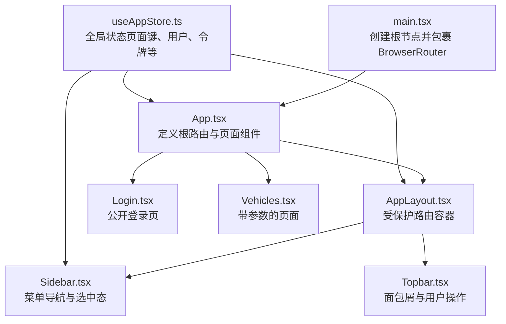
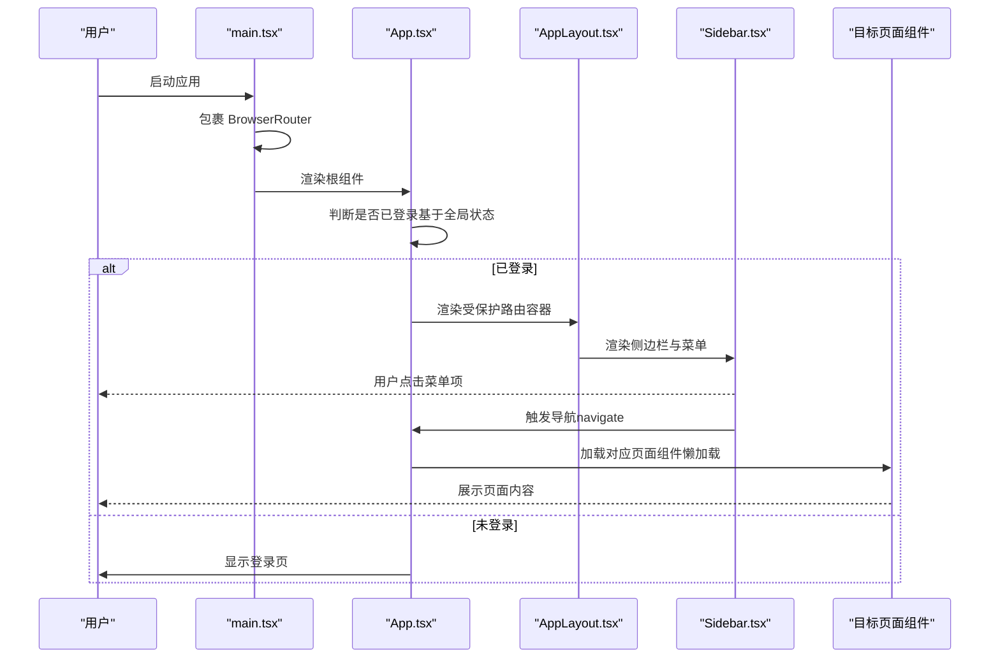
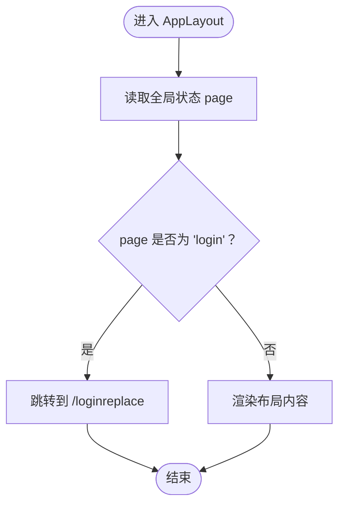
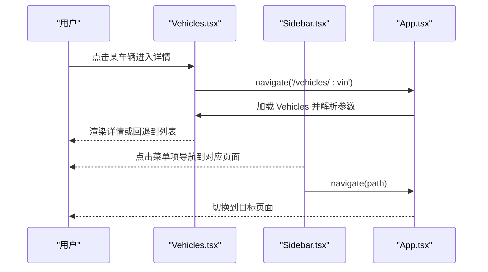
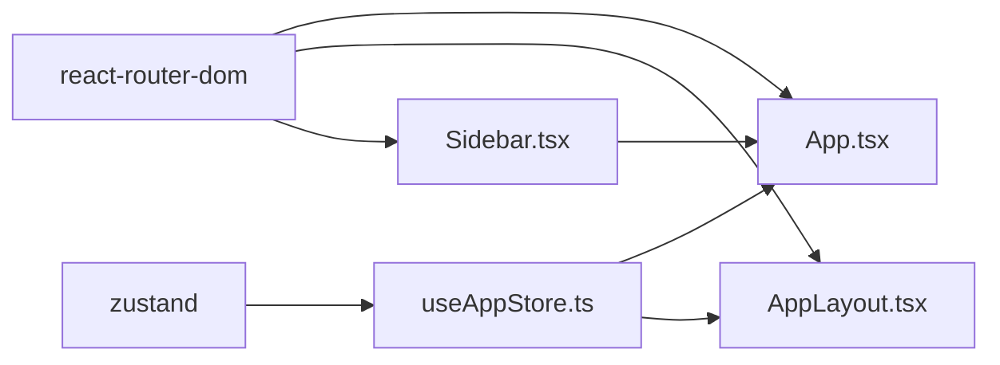

# 路由系统

<cite>
**本文引用的文件**
- [App.tsx](file://weidu-fleet/src/App.tsx)
- [main.tsx](file://weidu-fleet/src/main.tsx)
- [AppLayout.tsx](file://weidu-fleet/src/components/Layout/AppLayout.tsx)
- [Sidebar.tsx](file://weidu-fleet/src/components/Layout/Sidebar.tsx)
- [Topbar.tsx](file://weidu-fleet/src/components/Layout/Topbar.tsx)
- [Login.tsx](file://weidu-fleet/src/pages/Login.tsx)
- [Vehicles.tsx](file://weidu-fleet/src/pages/Vehicles.tsx)
- [useAppStore.ts](file://weidu-fleet/src/store/useAppStore.ts)
- [package.json](file://weidu-fleet/package.json)
</cite>

## 目录
1. [简介](#简介)
2. [项目结构](#项目结构)
3. [核心组件](#核心组件)
4. [架构总览](#架构总览)
5. [详细组件分析](#详细组件分析)
6. [依赖关系分析](#依赖关系分析)
7. [性能考虑](#性能考虑)
8. [故障排除指南](#故障排除指南)
9. [结论](#结论)
10. [附录](#附录)

## 简介
本文件面向“苇渡-智利车队管理”项目，系统性阐述前端路由体系的设计与实现，重点覆盖以下方面：
- React Router 的配置与使用：路由层级、嵌套路由、通配符与重定向
- 懒加载策略：按需加载页面组件，提升首屏性能
- 权限控制机制：基于应用状态的保护路由与公开路由
- 路由守卫原理：通过布局组件与全局状态联动实现无侵入式守卫
- 参数传递与导航：查询参数、路径参数、面包屑与侧边栏联动
- 新路由接入流程与最佳实践
- 组件加载与性能优化策略

## 项目结构
项目采用以功能域为中心的组织方式，路由相关的关键文件分布如下：
- 入口与路由器：在入口中包裹 BrowserRouter，统一提供路由上下文
- 根路由与页面：在根组件中定义公开路由（如登录）与受保护路由（包裹于布局）
- 布局与导航：AppLayout 提供容器与 Outlet，Sidebar/Topbar 提供导航与面包屑
- 状态与守卫：通过全局状态驱动路由跳转与页面渲染

图示来源
- [main.tsx:1-49](file://weidu-fleet/src/main.tsx#L1-L49)
- [App.tsx:1-88](file://weidu-fleet/src/App.tsx#L1-L88)
- [AppLayout.tsx:1-85](file://weidu-fleet/src/components/Layout/AppLayout.tsx#L1-L85)
- [Sidebar.tsx:1-272](file://weidu-fleet/src/components/Layout/Sidebar.tsx#L1-L272)
- [Topbar.tsx](file://weidu-fleet/src/components/Layout/Topbar.tsx)
- [Login.tsx:1-167](file://weidu-fleet/src/pages/Login.tsx#L1-L167)
- [Vehicles.tsx:1-440](file://weidu-fleet/src/pages/Vehicles.tsx#L1-L440)
- [useAppStore.ts:1-87](file://weidu-fleet/src/store/useAppStore.ts#L1-L87)

章节来源
- [main.tsx:1-49](file://weidu-fleet/src/main.tsx#L1-L49)
- [App.tsx:1-88](file://weidu-fleet/src/App.tsx#L1-L88)

## 核心组件
- 根路由与页面注册：在根组件中集中声明所有页面组件，并进行懒加载包装
- 受保护路由容器：AppLayout 作为受保护路由的外壳，内部包含侧边栏、顶部栏与内容区域
- 登录路由：独立于受保护路由之外，支持未认证访问
- 全局状态：useAppStore 提供 page、user、token 等状态，用于驱动守卫与页面渲染

章节来源
- [App.tsx:7-20](file://weidu-fleet/src/App.tsx#L7-L20)
- [App.tsx:51-81](file://weidu-fleet/src/App.tsx#L51-L81)
- [AppLayout.tsx:10-31](file://weidu-fleet/src/components/Layout/AppLayout.tsx#L10-L31)
- [useAppStore.ts:5-38](file://weidu-fleet/src/store/useAppStore.ts#L5-L38)

## 架构总览
下图展示了从入口到页面渲染的完整链路，以及路由守卫与状态联动的工作方式。

图示来源
- [main.tsx:37-41](file://weidu-fleet/src/main.tsx#L37-L41)
- [App.tsx:36-84](file://weidu-fleet/src/App.tsx#L36-L84)
- [AppLayout.tsx:20-31](file://weidu-fleet/src/components/Layout/AppLayout.tsx#L20-L31)
- [Sidebar.tsx:150-165](file://weidu-fleet/src/components/Layout/Sidebar.tsx#L150-L165)
- [Vehicles.tsx:422-437](file://weidu-fleet/src/pages/Vehicles.tsx#L422-L437)

## 详细组件分析

### 根路由与路由层级
- 公开路由：登录页独立于受保护路由之外，未认证可直接访问；若已登录则自动重定向至仪表盘
- 受保护路由：根路径 "/" 下包裹 AppLayout，内部定义各业务模块路由
- 嵌套路由：通过 AppLayout 的 Outlet 实现子路由渲染
- 重定向策略：根路径重定向至仪表盘；未知路径统一重定向至仪表盘

章节来源
- [App.tsx:43-49](file://weidu-fleet/src/App.tsx#L43-L49)
- [App.tsx:51-81](file://weidu-fleet/src/App.tsx#L51-L81)

### 懒加载实现
- 页面组件均通过 React.lazy 动态导入，配合 Suspense 提供加载占位
- 懒加载有助于减少首屏包体，提升初始化速度
- 加载失败或长时间加载时，显示统一的加载提示

章节来源
- [App.tsx:7-20](file://weidu-fleet/src/App.tsx#L7-L20)
- [App.tsx:22-34](file://weidu-fleet/src/App.tsx#L22-L34)

### 权限控制与路由守卫
- 守卫实现：通过全局状态 page 决定当前是否处于登录态；AppLayout 在挂载后根据状态决定是否跳转到登录页
- 登录流程：登录页提交后写入用户信息与令牌，切换 page 状态，触发守卫跳转至仪表盘
- Demo 模式：在刷新场景下，仅当状态明确为登录页时才执行跳转，避免误跳转

图示来源
- [AppLayout.tsx:20-26](file://weidu-fleet/src/components/Layout/AppLayout.tsx#L20-L26)
- [useAppStore.ts:59](file://weidu-fleet/src/store/useAppStore.ts#L59)
- [Login.tsx:46-51](file://weidu-fleet/src/pages/Login.tsx#L46-L51)

章节来源
- [AppLayout.tsx:15-31](file://weidu-fleet/src/components/Layout/AppLayout.tsx#L15-L31)
- [Login.tsx:24-26](file://weidu-fleet/src/pages/Login.tsx#L24-L26)
- [useAppStore.ts:40-75](file://weidu-fleet/src/store/useAppStore.ts#L40-L75)

### 路由参数传递与导航
- 路径参数：车辆详情页支持通过路径参数传入 VIN，页面根据参数决定渲染列表或详情
- 导航：页面内按钮与侧边栏点击均使用 useNavigate 进行编程式导航
- 面包屑与菜单联动：侧边栏根据当前路径高亮并展开对应分组，同时支持查询参数驱动的标签页选择

图示来源
- [Vehicles.tsx:165-167](file://weidu-fleet/src/pages/Vehicles.tsx#L165-L167)
- [Vehicles.tsx:362-366](file://weidu-fleet/src/pages/Vehicles.tsx#L362-L366)
- [Vehicles.tsx:422-437](file://weidu-fleet/src/pages/Vehicles.tsx#L422-L437)
- [Sidebar.tsx:150-165](file://weidu-fleet/src/components/Layout/Sidebar.tsx#L150-L165)

章节来源
- [Vehicles.tsx:1-440](file://weidu-fleet/src/pages/Vehicles.tsx#L1-L440)
- [Sidebar.tsx:180-201](file://weidu-fleet/src/components/Layout/Sidebar.tsx#L180-L201)

### 布局与导航组件
- AppLayout：提供侧边栏、顶部栏与内容区域，通过 Outlet 承载子路由
- Sidebar：菜单项与当前路径联动，支持查询参数驱动的标签页状态同步
- Topbar：负责面包屑与用户操作（如退出登录），与路由状态协同工作

章节来源
- [AppLayout.tsx:33-81](file://weidu-fleet/src/components/Layout/AppLayout.tsx#L33-L81)
- [Sidebar.tsx:40-144](file://weidu-fleet/src/components/Layout/Sidebar.tsx#L40-L144)
- [Topbar.tsx](file://weidu-fleet/src/components/Layout/Topbar.tsx)

### 添加新路由的操作指南
- 步骤一：在根组件中新增页面组件的懒加载导入
- 步骤二：在受保护路由容器内注册新路由路径
- 步骤三：在侧边栏菜单中添加对应菜单项（含图标、文案与可选查询参数）
- 步骤四：在全局状态中为该页面新增必要的状态字段（如标签页键值）
- 步骤五：在页面组件中使用 useNavigate 与 useParams 处理导航与参数
- 步骤六：如需面包屑联动，更新面包屑映射与选中态逻辑

章节来源
- [App.tsx:7-20](file://weidu-fleet/src/App.tsx#L7-L20)
- [App.tsx:51-81](file://weidu-fleet/src/App.tsx#L51-L81)
- [Sidebar.tsx:40-144](file://weidu-fleet/src/components/Layout/Sidebar.tsx#L40-L144)
- [useAppStore.ts:59-75](file://weidu-fleet/src/store/useAppStore.ts#L59-L75)

## 依赖关系分析
- 路由库：react-router-dom 版本在依赖中声明
- 状态库：zustand 用于全局状态管理
- UI 库：Ant Design 与 react-router-dom 协作提供导航与布局能力

图示来源
- [package.json:23](file://weidu-fleet/package.json#L23)
- [package.json:25](file://weidu-fleet/package.json#L25)
- [App.tsx:1-88](file://weidu-fleet/src/App.tsx#L1-L88)
- [AppLayout.tsx:1-85](file://weidu-fleet/src/components/Layout/AppLayout.tsx#L1-L85)
- [Sidebar.tsx:1-272](file://weidu-fleet/src/components/Layout/Sidebar.tsx#L1-L272)
- [useAppStore.ts:1-87](file://weidu-fleet/src/store/useAppStore.ts#L1-L87)

章节来源
- [package.json:11-26](file://weidu-fleet/package.json#L11-L26)

## 性能考虑
- 懒加载：页面组件按需加载，降低首屏体积
- Suspense：统一加载占位，改善用户体验
- 状态持久化：全局状态持久化到本地存储，减少重复初始化
- 组件拆分：页面组件内部按功能拆分（列表/详情），避免单文件过大
- 导航优化：侧边栏与面包屑联动，减少无效渲染

## 故障排除指南
- 登录后仍被重定向到登录页
  - 检查全局状态 page 是否正确切换为非登录态
  - 确认守卫逻辑是否在刷新场景下按预期执行
- 侧边栏未正确高亮或展开
  - 检查当前路径与菜单项映射关系
  - 确认查询参数是否影响标签页状态
- 车辆详情页无法根据 VIN 参数渲染
  - 检查路由参数解析与页面分支逻辑
  - 确认路径参数命名与使用一致

章节来源
- [AppLayout.tsx:20-26](file://weidu-fleet/src/components/Layout/AppLayout.tsx#L20-L26)
- [Sidebar.tsx:180-201](file://weidu-fleet/src/components/Layout/Sidebar.tsx#L180-L201)
- [Vehicles.tsx:422-437](file://weidu-fleet/src/pages/Vehicles.tsx#L422-L437)

## 结论
本项目采用“公开路由 + 受保护路由 + 懒加载 + 全局状态守卫”的组合方案，既保证了安全性，又兼顾了性能与可维护性。通过布局容器与侧边栏的协同，实现了良好的导航体验与状态一致性。后续扩展新路由时，建议严格遵循现有模式，确保路由、状态与导航的一致性。

## 附录
- 依赖版本参考：react-router-dom 与 zustand 已在依赖清单中声明
- 开发与构建脚本：通过 Vite 与 TypeScript 进行开发与打包

章节来源
- [package.json:6-10](file://weidu-fleet/package.json#L6-L10)
- [package.json:23](file://weidu-fleet/package.json#L23)
- [package.json:25](file://weidu-fleet/package.json#L25)