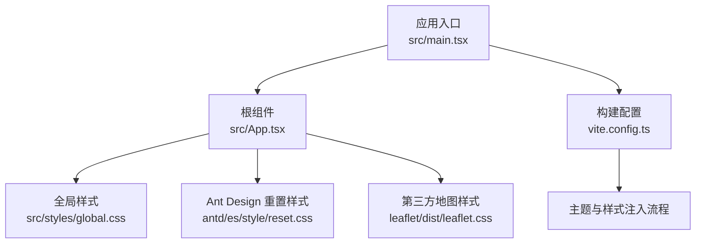
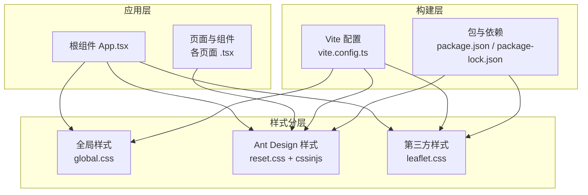
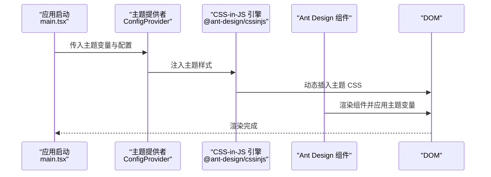
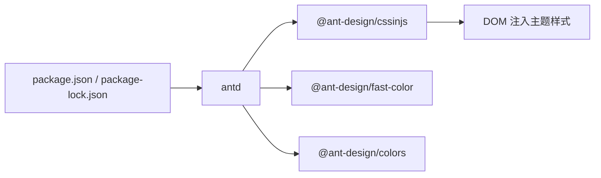

# 样式与主题

<cite>
**本文引用的文件**
- [global.css](file://weidu-fleet/src/styles/global.css)
- [package.json](file://weidu-fleet/package.json)
- [package-lock.json](file://weidu-fleet/package-lock.json)
- [vite.config.ts](file://weidu-fleet/vite.config.ts)
- [index.html](file://weidu-fleet/index.html)
- [App.tsx](file://weidu-fleet/src/App.tsx)
- [main.tsx](file://weidu-fleet/src/main.tsx)
- [leaflet.css](file://weidu-fleet/node_modules/leaflet/dist/leaflet.css)
- [reset.css](file://weidu-fleet/node_modules/antd/es/style/reset.css)
- [Ant Design 主题变量与定制说明](file://weidu-fleet/智利车队管理-详细设计.html)
</cite>

## 目录
1. [简介](#简介)
2. [项目结构](#项目结构)
3. [核心组件](#核心组件)
4. [架构总览](#架构总览)
5. [详细组件分析](#详细组件分析)
6. [依赖分析](#依赖分析)
7. [性能考虑](#性能考虑)
8. [故障排查指南](#故障排查指南)
9. [结论](#结论)
10. [附录](#附录)

## 简介
本文件面向“苇渡-智利车队管理”项目的样式与主题体系，系统阐述 CSS 架构设计、样式组织原则与命名规范；详解 Ant Design 主题定制方法与组件样式覆盖策略；给出响应式设计与移动端适配方案；明确主题变量配置、颜色系统与字体排版规范；总结样式模块化与性能优化策略，并提供调试与维护最佳实践。

## 项目结构
样式与主题相关的关键位置如下：
- 全局样式入口：src/styles/global.css
- 组件与页面样式：各页面与组件目录下以 .tsx 文件为主，样式通过 Ant Design 与 CSS-in-JS 注入
- 第三方样式：Leaflet 地图样式（node_modules/leaflet/dist/leaflet.css）
- Ant Design 重置样式：node_modules/antd/es/style/reset.css
- 构建与主题配置：vite.config.ts、package.json
- 应用入口：src/main.tsx、src/App.tsx
- HTML 入口：index.html

图表来源
- [main.tsx](file://weidu-fleet/src/main.tsx)
- [App.tsx](file://weidu-fleet/src/App.tsx)
- [global.css](file://weidu-fleet/src/styles/global.css)
- [reset.css](file://weidu-fleet/node_modules/antd/es/style/reset.css)
- [leaflet.css](file://weidu-fleet/node_modules/leaflet/dist/leaflet.css)
- [vite.config.ts](file://weidu-fleet/vite.config.ts)

章节来源
- [global.css:1-6](file://weidu-fleet/src/styles/global.css#L1-L6)
- [main.tsx](file://weidu-fleet/src/main.tsx)
- [App.tsx](file://weidu-fleet/src/App.tsx)
- [vite.config.ts](file://weidu-fleet/vite.config.ts)

## 核心组件
- 全局样式层：统一字体、字号、行高与基础排版，确保跨页面一致性
- Ant Design 组件层：通过 Ant Design 提供的组件与样式体系，结合 CSS-in-JS 实现主题注入与动态样式
- 地图与可视化层：使用 Leaflet 地图库，引入其默认样式以保证地图控件与瓦片渲染一致
- 构建与主题层：在 Vite 中通过插件或预处理器进行主题变量注入与样式打包

章节来源
- [global.css:1-6](file://weidu-fleet/src/styles/global.css#L1-L6)
- [reset.css](file://weidu-fleet/node_modules/antd/es/style/reset.css)
- [leaflet.css](file://weidu-fleet/node_modules/leaflet/dist/leaflet.css)

## 架构总览
样式与主题系统采用“全局样式 + 组件样式 + 第三方样式 + 构建注入”的分层架构。Ant Design 使用 CSS-in-JS 注入主题变量，全局样式负责基础排版与通用规则，第三方库样式独立引入，构建阶段完成打包与最小化。

图表来源
- [global.css](file://weidu-fleet/src/styles/global.css)
- [reset.css](file://weidu-fleet/node_modules/antd/es/style/reset.css)
- [leaflet.css](file://weidu-fleet/node_modules/leaflet/dist/leaflet.css)
- [vite.config.ts](file://weidu-fleet/vite.config.ts)
- [package.json](file://weidu-fleet/package.json)
- [package-lock.json](file://weidu-fleet/package-lock.json)

## 详细组件分析

### 全局样式与排版规范
- 字体与字号：全局设置系统字体栈与基础字号，保证跨平台一致性
- 基础排版：统一 margin/padding，避免浏览器默认差异
- 可扩展性：建议后续引入 CSS 变量作为主题开关，配合媒体查询实现响应式

章节来源
- [global.css:1-6](file://weidu-fleet/src/styles/global.css#L1-L6)

### Ant Design 主题定制与覆盖策略
- CSS-in-JS 注入：Ant Design 通过 @ant-design/cssinjs 将主题变量注入到 DOM，支持运行时切换与按需注入
- 主题变量来源：@ant-design/fast-color、@ant-design/colors 等提供颜色计算与调色板
- 覆盖策略：
  - 局部覆盖：在组件内使用 CSS-in-JS 或 styled 方案对特定组件进行样式覆盖
  - 全局覆盖：通过 Ant Design 的 ConfigProvider 或主题插件集中注入主题变量
  - 重置与基线：使用 reset.css 清理默认样式，确保自定义主题生效

图表来源
- [package-lock.json:50-67](file://weidu-fleet/package-lock.json#L50-L67)
- [package-lock.json:83-94](file://weidu-fleet/package-lock.json#L83-L94)
- [reset.css](file://weidu-fleet/node_modules/antd/es/style/reset.css)
- [main.tsx](file://weidu-fleet/src/main.tsx)

章节来源
- [package-lock.json:50-67](file://weidu-fleet/package-lock.json#L50-L67)
- [package-lock.json:83-94](file://weidu-fleet/package-lock.json#L83-L94)
- [reset.css](file://weidu-fleet/node_modules/antd/es/style/reset.css)

### 第三方地图样式与集成
- Leaflet 默认样式：引入 node_modules/leaflet/dist/leaflet.css，确保地图控件、瓦片与交互元素一致
- 注意事项：避免与 Ant Design 样式冲突，必要时通过作用域或命名空间隔离

章节来源
- [leaflet.css](file://weidu-fleet/node_modules/leaflet/dist/leaflet.css)

### 响应式设计与移动端适配
- 媒体查询：建议在全局样式中统一定义断点，结合 Ant Design 组件的栅格与布局能力
- 移动端优先：优先考虑小屏设备的可读性与交互可用性，控制字号、行高与间距
- 交互优化：针对触摸设备调整按钮尺寸与点击热区，减少不必要的 hover 效果

章节来源
- [global.css:1-6](file://weidu-fleet/src/styles/global.css#L1-L6)

### 主题变量配置与颜色系统
- 设计文档中的颜色变量示例：背景、表面、文本、强调色、危险/警告/成功等语义色
- 建议：将这些变量迁移到 CSS 变量或 Ant Design 主题变量中，形成统一的主题词典
- 与 Ant Design 对齐：使用 @ant-design/colors 生成调色板，保持品牌一致性

章节来源
- [Ant Design 主题变量与定制说明:8-21](file://weidu-fleet/智利车队管理-详细设计.html#L8-L21)

### 字体排版规范
- 字体族：系统字体栈，兼顾可读性与性能
- 字号与行高：全局字号与行高统一，页面内标题层级与段落排版遵循层级递减
- 代码与 API 区块：使用更小字号与等宽字体，提升可读性

章节来源
- [global.css:1-6](file://weidu-fleet/src/styles/global.css#L1-L6)
- [Ant Design 主题变量与定制说明:23-30](file://weidu-fleet/智利车队管理-详细设计.html#L23-L30)

### 样式模块化与命名规范
- 模块化：按功能域拆分样式文件，组件级样式尽量局部化，避免全局污染
- 命名规范：推荐 BEM 或基于功能域的前缀命名，增强可读性与可维护性
- 变量与常量：颜色、字号、间距等抽象为变量，便于主题切换与一致性维护

章节来源
- [global.css:1-6](file://weidu-fleet/src/styles/global.css#L1-L6)

### 性能优化策略
- CSS-in-JS 选择性注入：仅注入当前页面或路由所需的样式，减少冗余
- 样式去重与压缩：构建阶段合并与压缩，移除未使用样式
- 图片与图标：使用矢量图标与 WebP 等现代格式，降低体积
- 媒体查询优化：避免过度嵌套与重复匹配，减少回流与重绘

章节来源
- [package-lock.json:50-67](file://weidu-fleet/package-lock.json#L50-L67)
- [vite.config.ts](file://weidu-fleet/vite.config.ts)

### 调试与维护最佳实践
- 开发期：启用 CSS-in-JS 的开发工具链，定位样式来源与覆盖关系
- 生产期：保留样式映射与版本信息，便于回溯与问题定位
- 规范化：建立样式审查清单，包括可访问性、对比度与一致性检查

章节来源
- [main.tsx](file://weidu-fleet/src/main.tsx)

## 依赖分析
Ant Design 核心依赖与样式注入链路如下：

图表来源
- [package.json](file://weidu-fleet/package.json)
- [package-lock.json:50-67](file://weidu-fleet/package-lock.json#L50-L67)
- [package-lock.json:83-94](file://weidu-fleet/package-lock.json#L83-L94)

章节来源
- [package.json](file://weidu-fleet/package.json)
- [package-lock.json:50-67](file://weidu-fleet/package-lock.json#L50-L67)
- [package-lock.json:83-94](file://weidu-fleet/package-lock.json#L83-L94)

## 性能考虑
- 减少全局样式：优先使用组件级样式与 CSS-in-JS，避免全局污染导致的重绘
- 合理使用媒体查询：集中定义断点，避免在多个组件重复声明
- 图标与图片：使用矢量与现代格式，控制尺寸与缓存策略
- 构建优化：开启 Tree Shaking、CSS 压缩与资源内联策略

## 故障排查指南
- 样式不生效
  - 检查 Ant Design 主题是否正确注入（ConfigProvider 与 CSS-in-JS）
  - 确认 reset.css 是否被正确加载
  - 排查第三方样式（如 Leaflet）是否覆盖了预期样式
- 响应式异常
  - 检查媒体查询断点与设备 viewport 设置
  - 确保全局样式与组件样式无冲突
- 性能问题
  - 分析构建产物，确认未使用的样式已被移除
  - 关注 CSS-in-JS 注入规模，避免一次性注入过多样式

章节来源
- [reset.css](file://weidu-fleet/node_modules/antd/es/style/reset.css)
- [leaflet.css](file://weidu-fleet/node_modules/leaflet/dist/leaflet.css)
- [vite.config.ts](file://weidu-fleet/vite.config.ts)

## 结论
本项目采用“全局样式 + Ant Design CSS-in-JS 主题注入 + 第三方库样式”的混合架构，具备良好的可扩展性与可维护性。建议进一步完善 CSS 变量体系、统一命名规范与响应式断点，并在构建阶段强化样式优化与审查流程，以持续提升用户体验与开发效率。

## 附录
- 构建入口与 HTML 入口：确保全局样式与第三方样式的正确加载顺序
- 主题迁移建议：将设计文档中的颜色变量迁移到 CSS 变量或 Ant Design 主题变量中，形成统一主题词典

章节来源
- [index.html](file://weidu-fleet/index.html)
- [vite.config.ts](file://weidu-fleet/vite.config.ts)
- [Ant Design 主题变量与定制说明:8-21](file://weidu-fleet/智利车队管理-详细设计.html#L8-L21)