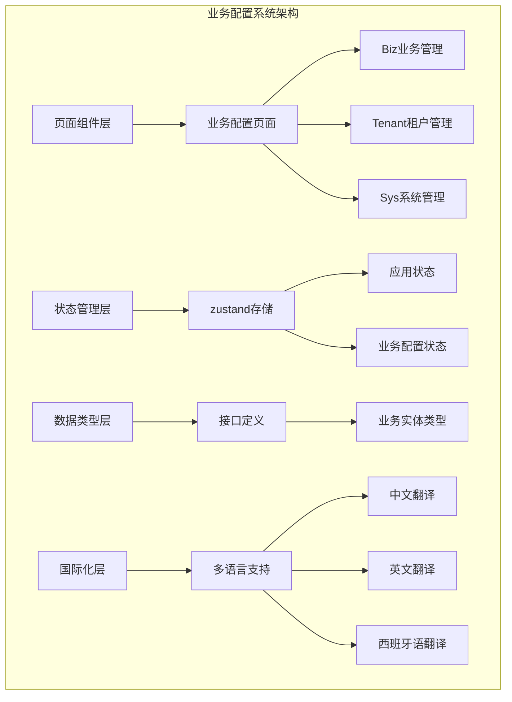
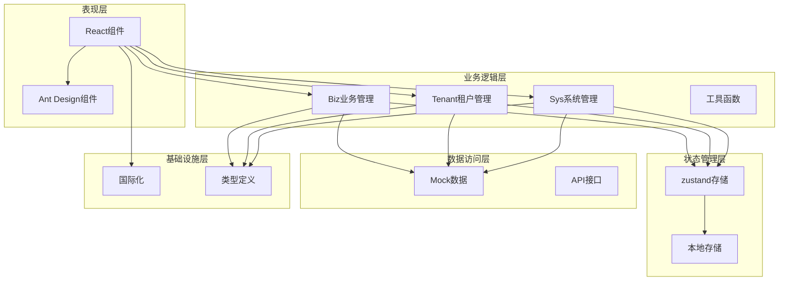
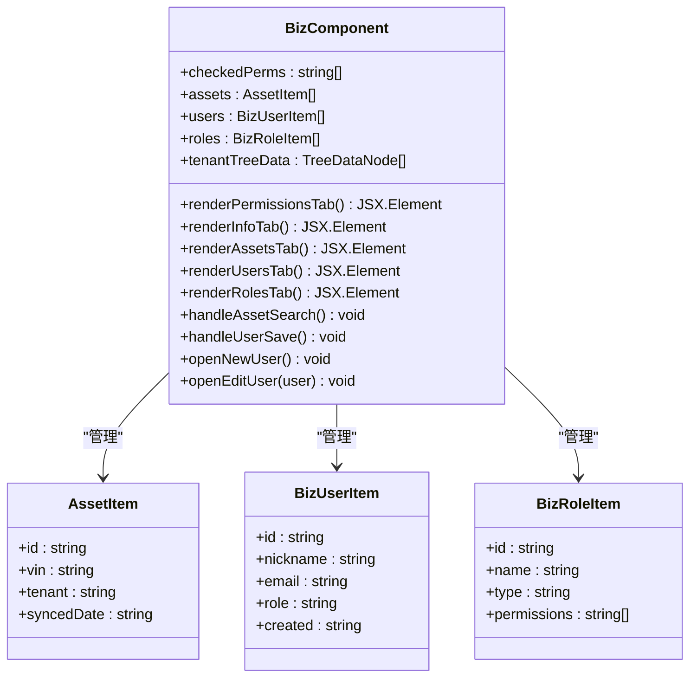
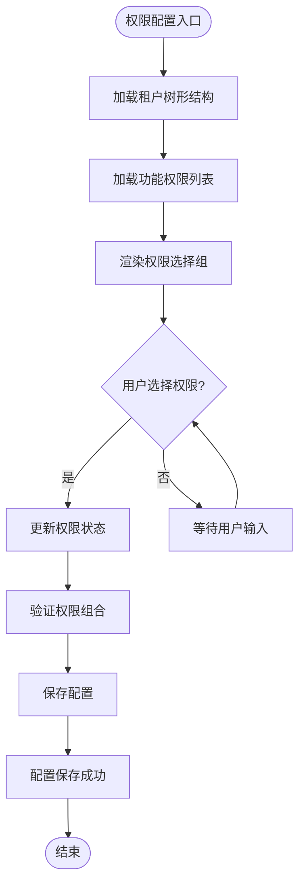
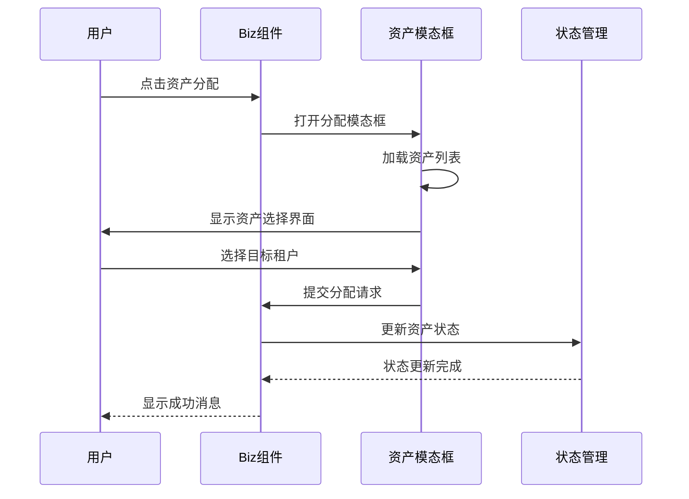
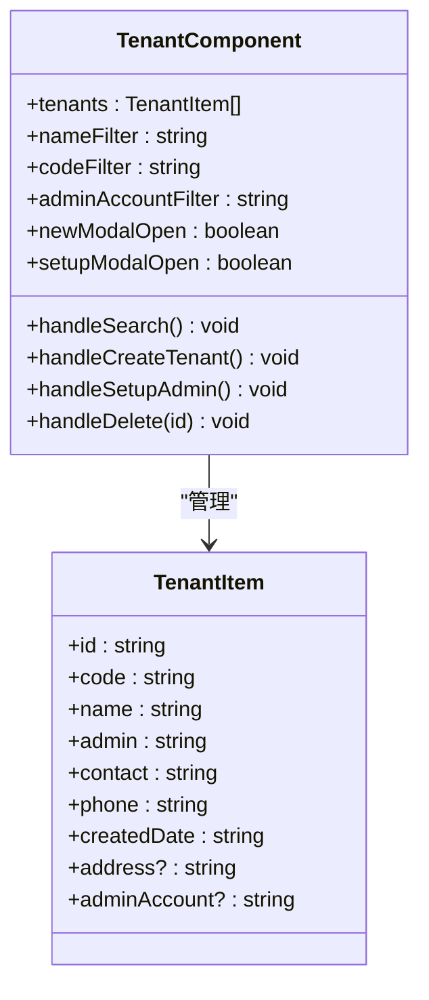
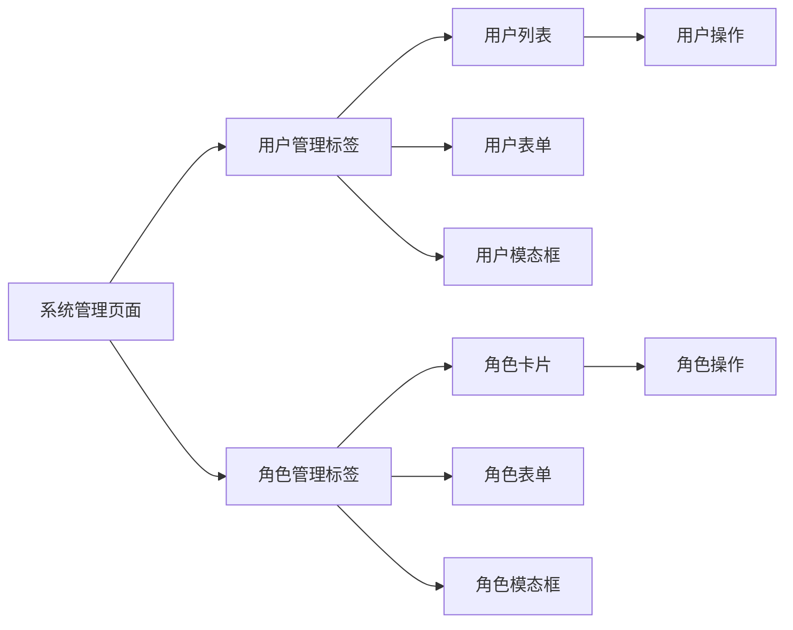
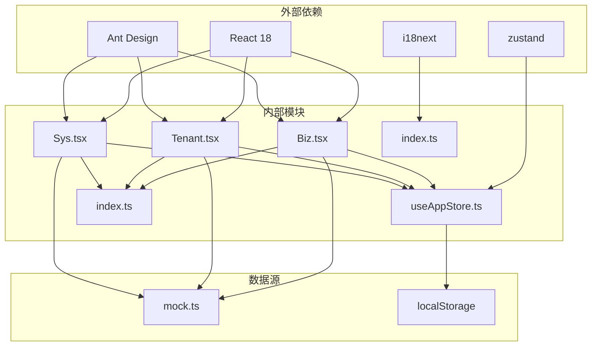
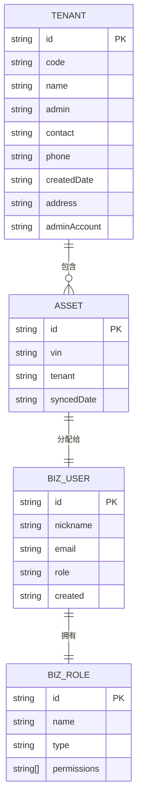

# 业务配置系统

<cite>
**本文档引用的文件**
- [Biz.tsx](file://weidu-fleet/src/pages/Biz.tsx)
- [Tenant.tsx](file://weidu-fleet/src/pages/Tenant.tsx)
- [Sys.tsx](file://weidu-fleet/src/pages/Sys.tsx)
- [useAppStore.ts](file://weidu-fleet/src/store/useAppStore.ts)
- [index.ts](file://weidu-fleet/src/types/index.ts)
- [index.ts](file://weidu-fleet/src/i18n/index.ts)
- [zh.ts](file://weidu-fleet/src/i18n/zh.ts)
- [en.ts](file://weidufleet/src/i18n/en.ts)
- [es.ts](file://weidu-fleet/src/i18n/es.ts)
- [mock.ts](file://weidu-fleet/src/api/mock.ts)
- [智利车队管理-详细设计.html](file://智利车队管理-详细设计.html)
</cite>

## 目录
1. [简介](#简介)
2. [项目结构](#项目结构)
3. [核心组件](#核心组件)
4. [架构概览](#架构概览)
5. [详细组件分析](#详细组件分析)
6. [依赖分析](#依赖分析)
7. [性能考虑](#性能考虑)
8. [故障排除指南](#故障排除指南)
9. [结论](#结论)
10. [附录](#附录)

## 简介

业务配置系统是苇渡-智利车队管理平台的核心功能模块，负责管理租户、用户、角色和资产等业务配置信息。该系统提供了完整的业务参数配置、规则引擎设置、流程定制和模板管理功能，支持多租户架构下的灵活配置和权限控制。

系统基于React + TypeScript技术栈构建，采用Ant Design作为UI框架，实现了完整的业务配置管理功能。通过模块化的组件设计和状态管理，为用户提供直观易用的业务配置界面。

## 项目结构

业务配置系统主要分布在以下目录结构中：

**图表来源**
- [Biz.tsx:1-609](file://weidu-fleet/src/pages/Biz.tsx#L1-L609)
- [Tenant.tsx:1-288](file://weidu-fleet/src/pages/Tenant.tsx#L1-L288)
- [Sys.tsx:1-349](file://weidu-fleet/src/pages/Sys.tsx#L1-L349)

**章节来源**
- [Biz.tsx:1-609](file://weidu-fleet/src/pages/Biz.tsx#L1-L609)
- [Tenant.tsx:1-288](file://weidu-fleet/src/pages/Tenant.tsx#L1-L288)
- [Sys.tsx:1-349](file://weidu-fleet/src/pages/Sys.tsx#L1-L349)

## 核心组件

业务配置系统由三个主要业务页面组成，每个页面都针对不同的业务配置需求：

### 业务管理页面 (Biz)
业务管理页面是系统的核心配置中心，提供租户、用户、角色和资产管理功能。该页面采用标签页布局，支持权限配置、信息管理、资产分配、用户管理和角色管理等功能。

### 租户管理页面 (Tenant)
租户管理页面专门用于管理多租户架构下的租户信息，包括租户的创建、编辑、删除和管理员账户设置。支持租户层级的树形结构展示和权限管理。

### 系统管理页面 (Sys)
系统管理页面提供系统级的用户和角色管理功能，支持系统管理员对整个系统的用户和权限进行统一管理。

**章节来源**
- [Biz.tsx:117-609](file://weidu-fleet/src/pages/Biz.tsx#L117-L609)
- [Tenant.tsx:28-288](file://weidu-fleet/src/pages/Tenant.tsx#L28-L288)
- [Sys.tsx:50-349](file://weidu-fleet/src/pages/Sys.tsx#L50-L349)

## 架构概览

业务配置系统采用分层架构设计，确保了良好的可维护性和扩展性：

**图表来源**
- [useAppStore.ts:1-87](file://weidu-fleet/src/store/useAppStore.ts#L1-L87)
- [Biz.tsx:1-609](file://weidu-fleet/src/pages/Biz.tsx#L1-L609)
- [Tenant.tsx:1-288](file://weidu-fleet/src/pages/Tenant.tsx#L1-L288)
- [Sys.tsx:1-349](file://weidu-fleet/src/pages/Sys.tsx#L1-L349)

系统的核心特点包括：

1. **模块化设计**: 每个业务页面独立封装，职责清晰
2. **状态管理**: 使用zustand实现轻量级状态管理
3. **本地持久化**: 关键配置信息持久化到localStorage
4. **国际化支持**: 完整的多语言支持
5. **响应式设计**: 适配不同屏幕尺寸

## 详细组件分析

### Biz业务管理组件

Biz组件是业务配置系统的核心，实现了完整的业务参数配置功能：

**图表来源**
- [Biz.tsx:117-609](file://weidu-fleet/src/pages/Biz.tsx#L117-L609)
- [index.ts:240-261](file://weidu-fleet/src/types/index.ts#L240-L261)

#### 权限配置功能

权限配置功能允许管理员为租户设置功能权限，支持多选的权限组合：

**图表来源**
- [Biz.tsx:153-179](file://weidu-fleet/src/pages/Biz.tsx#L153-L179)

#### 资产管理功能

资产管理功能提供车辆资产的查询、筛选和分配功能：

**图表来源**
- [Biz.tsx:196-336](file://weidu-fleet/src/pages/Biz.tsx#L196-L336)

**章节来源**
- [Biz.tsx:117-609](file://weidu-fleet/src/pages/Biz.tsx#L117-L609)

### Tenant租户管理组件

Tenant组件专注于多租户架构下的租户管理：

**图表来源**
- [Tenant.tsx:28-288](file://weidu-fleet/src/pages/Tenant.tsx#L28-L288)
- [index.ts:228-238](file://weidu-fleet/src/types/index.ts#L228-L238)

**章节来源**
- [Tenant.tsx:28-288](file://weidu-fleet/src/pages/Tenant.tsx#L28-L288)

### Sys系统管理组件

Sys组件提供系统级的用户和角色管理：

**图表来源**
- [Sys.tsx:50-349](file://weidu-fleet/src/pages/Sys.tsx#L50-L349)

**章节来源**
- [Sys.tsx:50-349](file://weidu-fleet/src/pages/Sys.tsx#L50-L349)

## 依赖分析

业务配置系统的依赖关系体现了清晰的分层架构：

**图表来源**
- [useAppStore.ts:1-87](file://weidu-fleet/src/store/useAppStore.ts#L1-L87)
- [Biz.tsx:1-609](file://weidu-fleet/src/pages/Biz.tsx#L1-L609)
- [Tenant.tsx:1-288](file://weidu-fleet/src/pages/Tenant.tsx#L1-L288)
- [Sys.tsx:1-349](file://weidu-fleet/src/pages/Sys.tsx#L1-L349)

**章节来源**
- [useAppStore.ts:1-87](file://weidu-fleet/src/store/useAppStore.ts#L1-L87)
- [Biz.tsx:1-609](file://weidu-fleet/src/pages/Biz.tsx#L1-L609)
- [Tenant.tsx:1-288](file://weidu-fleet/src/pages/Tenant.tsx#L1-L288)
- [Sys.tsx:1-349](file://weidu-fleet/src/pages/Sys.tsx#L1-L349)

## 性能考虑

业务配置系统在设计时充分考虑了性能优化：

### 状态管理优化
- 使用zustand替代redux，减少不必要的状态更新
- 本地持久化关键配置，避免重复加载
- 组件级别的状态隔离，提高渲染效率

### 数据处理优化
- Mock数据本地缓存，减少API调用
- 表格数据虚拟滚动，支持大数据量展示
- 搜索功能防抖处理，提升用户体验

### 渲染优化
- 按需加载组件，减少初始包体积
- 图标和样式按需引入，避免全量打包
- 表单验证异步处理，避免阻塞主线程

## 故障排除指南

### 常见问题及解决方案

#### 权限配置问题
**问题**: 权限保存后不生效
**解决方案**: 
1. 检查权限组合的有效性
2. 确认用户会话状态
3. 刷新页面重新加载配置

#### 资产分配问题  
**问题**: 资产分配后状态未更新
**解决方案**:
1. 检查网络连接状态
2. 验证目标租户是否存在
3. 确认资产权限是否充足

#### 用户管理问题
**问题**: 新建用户失败
**解决方案**:
1. 检查邮箱格式是否正确
2. 验证角色权限配置
3. 确认用户数量限制

**章节来源**
- [Biz.tsx:350-376](file://weidu-fleet/src/pages/Biz.tsx#L350-L376)
- [Tenant.tsx:62-97](file://weidu-fleet/src/pages/Tenant.tsx#L62-L97)
- [Sys.tsx:82-108](file://weidu-fleet/src/pages/Sys.tsx#L82-L108)

## 结论

业务配置系统通过模块化的设计和完善的架构，为苇渡-智利车队管理平台提供了强大的业务配置能力。系统支持多租户架构下的灵活配置，具备完整的权限管理体系和用户友好的操作界面。

系统的主要优势包括：
- 清晰的分层架构设计
- 完善的状态管理机制  
- 强大的权限控制功能
- 多语言国际化支持
- 良好的性能表现

未来可以进一步增强的功能包括：配置导入导出、批量修改、审计日志、版本管理和回滚策略等高级功能。

## 附录

### 配置项数据结构

系统使用标准化的数据结构来表示各种配置信息：

**图表来源**
- [index.ts:240-261](file://weidu-fleet/src/types/index.ts#L240-L261)

### 国际化配置

系统支持中文、英文、西班牙语三种语言，通过i18next实现完整的国际化支持：

| 功能模块 | 中文 | 英文 | 西班牙语 |
|---------|------|------|----------|
| 权限配置 | 权限配置 | Permissions | Permisos |
| 用户管理 | 用户管理 | User Management | Gestión de Usuarios |
| 角色管理 | 角色管理 | Role Management | Gestión de Roles |
| 资产分配 | 资产分配 | Asset Allocation | Asignación de Activos |

**章节来源**
- [index.ts:1-30](file://weidu-fleet/src/i18n/index.ts#L1-L30)
- [zh.ts:1-424](file://weidu-fleet/src/i18n/zh.ts#L1-L424)
- [en.ts:1-422](file://weidu-fleet/src/i18n/en.ts#L1-L422)
- [es.ts:1-422](file://weidu-fleet/src/i18n/es.ts#L1-L422)