# 核心功能模块

<cite>
**本文档引用的文件**
- [package.json](file://weidu-fleet/package.json)
- [App.tsx](file://weidu-fleet/src/App.tsx)
- [main.tsx](file://weidu-fleet/src/main.tsx)
- [index.ts](file://weidu-fleet/src/types/index.ts)
- [useAppStore.ts](file://weidu-fleet/src/store/useAppStore.ts)
- [Dashboard.tsx](file://weidu-fleet/src/pages/Dashboard.tsx)
- [Vehicles.tsx](file://weidu-fleet/src/pages/Vehicles.tsx)
- [Monitor.tsx](file://weidu-fleet/src/pages/Monitor.tsx)
- [Risk.tsx](file://weidu-fleet/src/pages/Risk.tsx)
- [Driving.tsx](file://weidu-fleet/src/pages/Driving.tsx)
- [Battery.tsx](file://weidu-fleet/src/pages/Battery.tsx)
- [Trips.tsx](file://weidu-fleet/src/pages/Trips.tsx)
- [Fence.tsx](file://weidu-fleet/src/pages/Fence.tsx)
- [Repair.tsx](file://weidu-fleet/src/pages/Repair.tsx)
- [Tenant.tsx](file://weidu-fleet/src/pages/Tenant.tsx)
- [Biz.tsx](file://weidu-fleet/src/pages/Biz.tsx)
- [Sys.tsx](file://weidu-fleet/src/pages/Sys.tsx)
- [vite.config.ts](file://weidu-fleet/vite.config.ts)
</cite>

## 目录
1. [简介](#简介)
2. [项目结构](#项目结构)
3. [核心组件](#核心组件)
4. [架构概览](#架构概览)
5. [详细组件分析](#详细组件分析)
6. [依赖分析](#依赖分析)
7. [性能考虑](#性能考虑)
8. [故障排除指南](#故障排除指南)
9. [结论](#结论)
10. [附录](#附录)

## 简介
苇渡-智利车队管理项目是一个基于 React 的前端应用，采用 Ant Design 组件库、Chart.js 图表库、React Router 路由管理和 Zustand 状态管理。项目支持多语言（中/英/西），提供完整的车队管理解决方案，涵盖车辆管理、运营监控、风险预警、驾驶行为分析、行程管理、电子围栏、电池管理、维修保养、租户管理、业务配置和系统管理等核心功能模块。

## 项目结构
项目采用典型的 React 单页应用架构，主要目录结构如下：

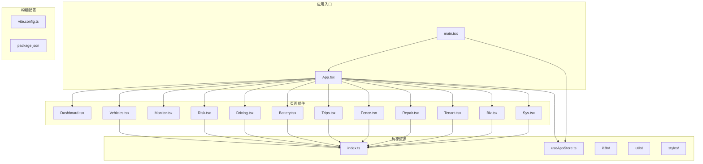

**图表来源**
- [main.tsx:1-49](file://weidu-fleet/src/main.tsx#L1-L49)
- [App.tsx:1-88](file://weidu-fleet/src/App.tsx#L1-L88)

**章节来源**
- [package.json:1-41](file://weidu-fleet/package.json#L1-L41)
- [vite.config.ts:1-16](file://weidu-fleet/vite.config.ts#L1-L16)

## 核心组件
项目的核心组件包括路由系统、状态管理、国际化支持和主题配置。应用通过 React Router 实现页面级路由，Zustand 提供全局状态管理，Ant Design 提供丰富的 UI 组件库。

### 数据模型架构
项目定义了完整的 TypeScript 类型系统，涵盖所有业务实体和数据结构：

```mermaid
classDiagram
class Vehicle {
+string vin
+string plate
+string model
+string color
+string batteryVersion
+string device
+string deviceName
+string purchase
+number totalKm
+string status
+number lat
+number lng
+number soc
+number soh
+number temp
+number range
+string charging
}
class AlertRecord {
+string plate
+string vin
+string type
+string content
+string time
+string status
+string location
+number speed
}
class FenceInfo {
+string name
+string type
+number vehicleCount
+string status
+string address
+string time
}
class TripRecord {
+string plate
+string start
+string end
+string startLocation
+string endLocation
+number km
+string duration
+number avgSpeed
+number alerts
+string vin
}
class FenceAlert {
+string id
+string plate
+string vin
+string type
+string fence_name
+string location
+string time
}
class FaultAlert {
+string id
+string plate
+string vin
+string device
+string type
+string content
+string time
+string status
}
class BatteryAlert {
+string id
+string plate
+string vin
+string device
+string type
+string content
+string time
+string status
}
class DrivingAlert {
+string id
+string plate
+string vin
+string type
+string position
+number speed
+string time
}
class DrivingReport {
+string id
+string plate
+string vin
+string period
+number km
+number risks
+string level
+number score
}
class BatteryMonitorItem {
+string id
+string plate
+number soc
+number soh
+number temp
+number range
+number charges
+string status
}
class ChargeRecord {
+string id
+string plate
+string vin
+number count
+number voltage
+number current
+number power
+number before
+number after
+string duration
+string time
}
class DischargeRecord {
+string id
+string plate
+string vin
+number count
+number voltage
+number current
+number power
+number before
+number after
+string duration
+number energyConsumed
+string time
}
class TripDetail {
+string id
+string vin
+string plate
+string startTime
+string endTime
+string startLocation
+string endLocation
+number distance
+string duration
+number avgSpeed
+number maxSpeed
+number minSpeed
+TripAlertItem[] alerts
+number alertCount
}
class FenceItem {
+string id
+string name
+string type
+string[] vehicles
+string alertType
+string status
+string address
+string time
+number radius
}
class RepairItem {
+string id
+string plate
+string vin
+string type
+string description
+string startDate
+string endTime
+string recorder
+string status
}
class TenantItem {
+string id
+string code
+string name
+string admin
+string contact
+string phone
+string createdDate
+string address
+string adminAccount
}
class AssetItem {
+string id
+string vin
+string tenant
+string syncedDate
}
class BizUserItem {
+string id
+string nickname
+string email
+string role
+string created
}
class BizRoleItem {
+string id
+string name
+string type
+string[] permissions
}
```

**图表来源**
- [index.ts:1-261](file://weidu-fleet/src/types/index.ts#L1-L261)

**章节来源**
- [index.ts:1-261](file://weidu-fleet/src/types/index.ts#L1-L261)

## 架构概览
项目采用模块化的架构设计，各功能模块相对独立又相互关联：

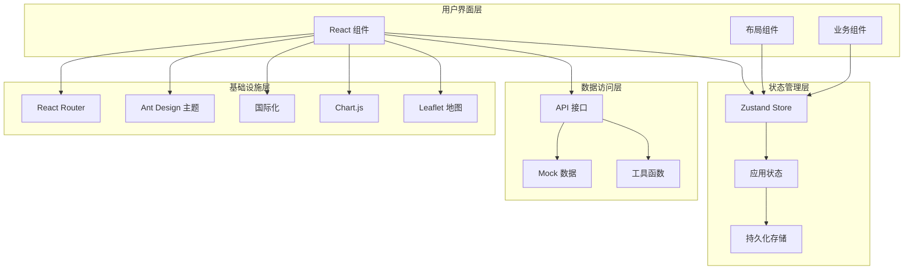

**图表来源**
- [useAppStore.ts:1-87](file://weidu-fleet/src/store/useAppStore.ts#L1-L87)
- [App.tsx:1-88](file://weidu-fleet/src/App.tsx#L1-L88)

## 详细组件分析

### 车辆管理模块 (Vehicles)
车辆管理模块提供完整的车辆生命周期管理功能：

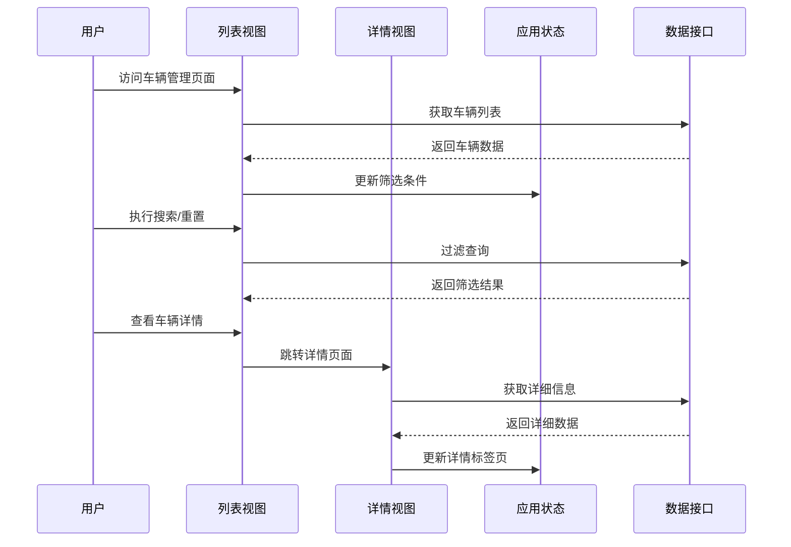

**图表来源**
- [Vehicles.tsx:1-440](file://weidu-fleet/src/pages/Vehicles.tsx#L1-L440)
- [useAppStore.ts:1-87](file://weidu-fleet/src/store/useAppStore.ts#L1-L87)

车辆管理的核心特性包括：
- 多维度筛选：VIN、车牌号、设备ID、电池版本、车龄范围
- 批量导入导出：支持 Excel/CSV 格式
- 详情面板：风险、驾驶、电池、充电、行程、维修、里程统计
- 实时状态显示：在线/离线状态、位置信息

**章节来源**
- [Vehicles.tsx:1-440](file://weidu-fleet/src/pages/Vehicles.tsx#L1-L440)

### 运营监控模块 (Monitor)
运营监控模块提供实时车辆位置跟踪和轨迹回放功能：

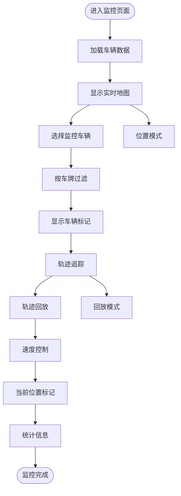

**图表来源**
- [Monitor.tsx:1-268](file://weidu-fleet/src/pages/Monitor.tsx#L1-L268)

监控模块的关键功能：
- 实时位置显示：绿色标记表示在线车辆
- 企业树形结构：层级化组织管理
- 轨迹回放：支持播放/暂停、速度调节
- 历史轨迹：多维坐标点记录

**章节来源**
- [Monitor.tsx:1-268](file://weidu-fleet/src/pages/Monitor.tsx#L1-L268)

### 风险预警模块 (Risk)
风险预警模块整合多种类型的告警信息：

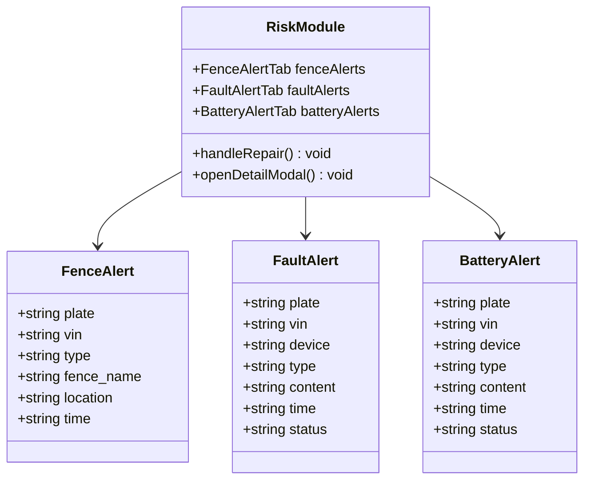

**图表来源**
- [Risk.tsx:1-435](file://weidu-fleet/src/pages/Risk.tsx#L1-L435)

风险预警的分类管理：
- 围栏告警：入栏/出栏报警
- 故障告警：24种电控系统故障类型
- 电池告警：SOC、温度、充电异常等

**章节来源**
- [Risk.tsx:1-435](file://weidu-fleet/src/pages/Risk.tsx#L1-L435)

### 驾驶行为分析模块 (Driving)
驾驶行为分析模块提供详细的驾驶行为评估和统计：

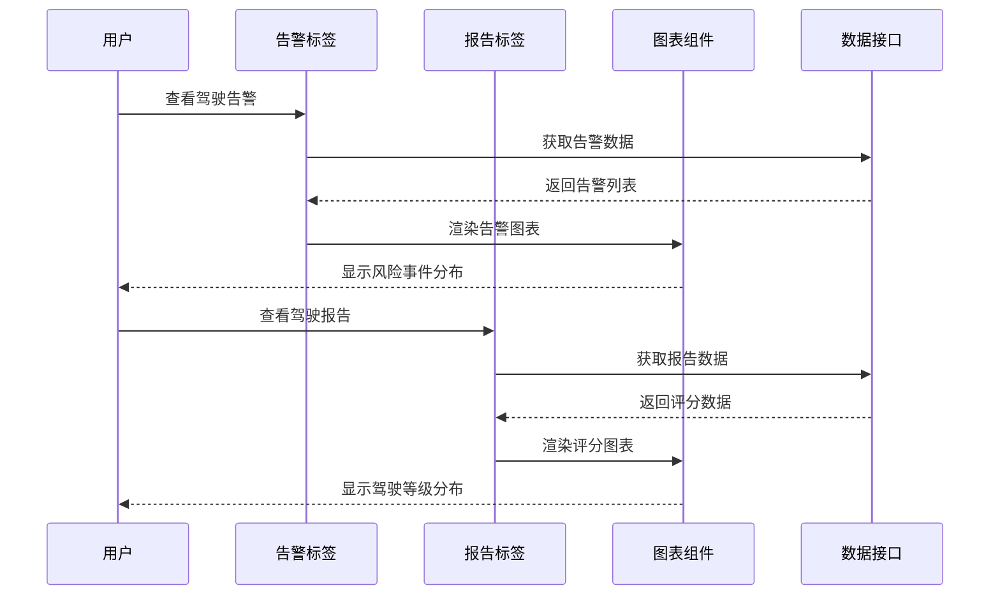

**图表来源**
- [Driving.tsx:1-490](file://weidu-fleet/src/pages/Driving.tsx#L1-L490)

驾驶分析的核心指标：
- 风险事件统计：急加速、急刹车、急转弯、疲劳驾驶、AEB
- 驾驶等级评估：安全/低/中/高四个等级
- 时间分布分析：日间/夜间、不同时间段
- 区域分布：高速公路、城市道路、乡村道路

**章节来源**
- [Driving.tsx:1-490](file://weidu-fleet/src/pages/Driving.tsx#L1-L490)

### 电池管理系统 (Battery)
电池管理系统专注于电池状态监控和维护：

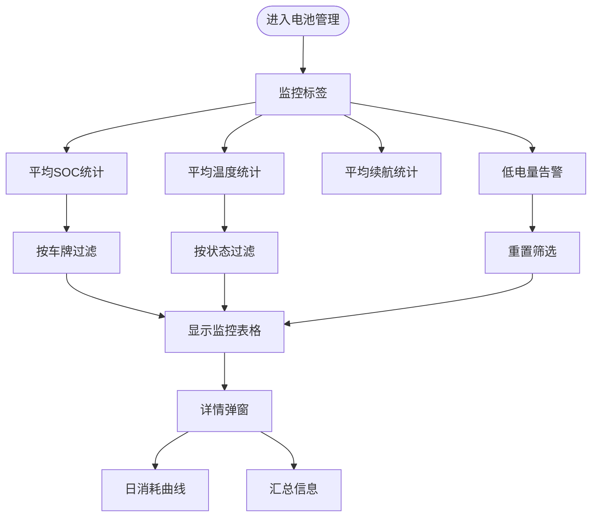

**图表来源**
- [Battery.tsx:1-343](file://weidu-fleet/src/pages/Battery.tsx#L1-L343)

电池管理的关键功能：
- 实时监控：SOC、SOH、温度、续航里程
- 充放电记录：电压、电流、功率、耗时
- 历史数据分析：30天日消耗趋势
- 告警管理：低电量、高温、充电异常等

**章节来源**
- [Battery.tsx:1-343](file://weidu-fleet/src/pages/Battery.tsx#L1-L343)

### 行程管理模块 (Trips)
行程管理模块提供完整的行程追踪和分析：

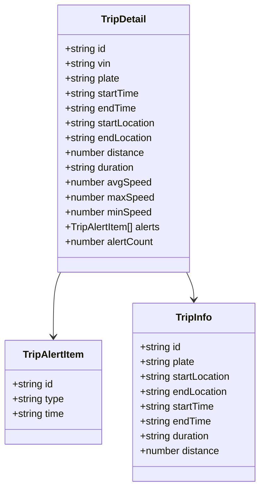

**图表来源**
- [Trips.tsx:1-231](file://weidu-fleet/src/pages/Trips.tsx#L1-L231)
- [index.ts:165-202](file://weidu-fleet/src/types/index.ts#L165-L202)

行程管理的核心功能：
- 行程列表：时间范围、起止地点、里程、时速
- 详情视图：完整轨迹、速度变化、预警记录
- 地图展示：Polyline 轨迹绘制、起点终点标记
- 统计分析：平均速度、最高速度、最低速度

**章节来源**
- [Trips.tsx:1-231](file://weidu-fleet/src/pages/Trips.tsx#L1-L231)

### 电子围栏模块 (Fence)
电子围栏模块提供地理围栏管理和车辆管控：

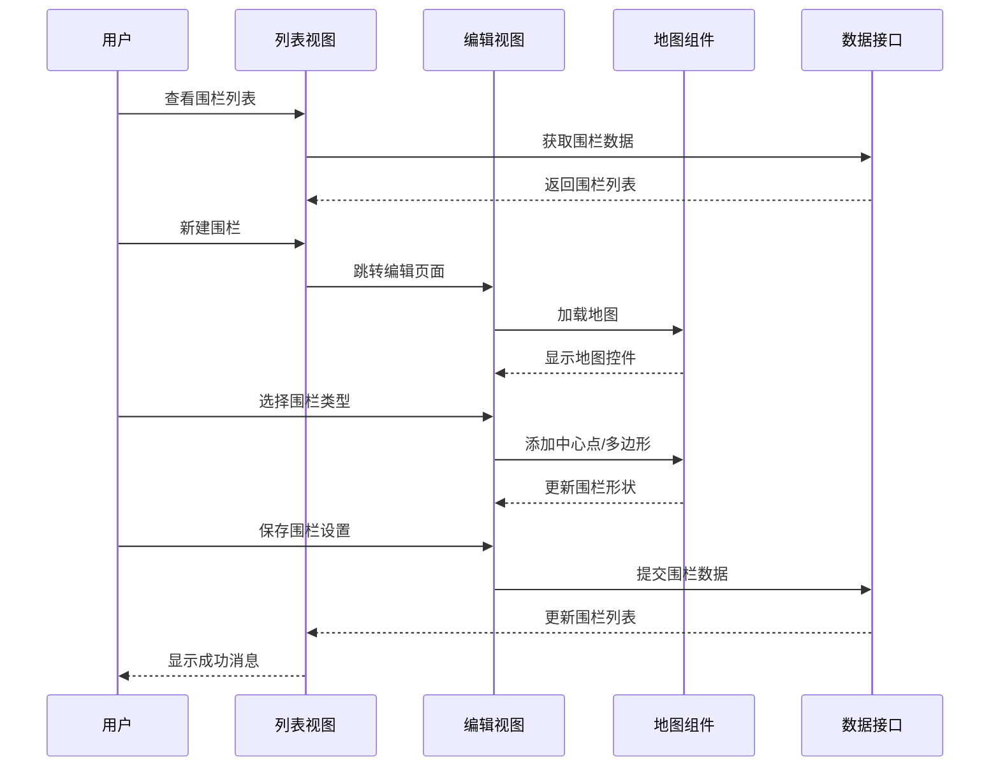

**图表来源**
- [Fence.tsx:1-353](file://weidu-fleet/src/pages/Fence.tsx#L1-L353)

围栏管理的完整流程：
- 围栏类型：中心点围栏、自定义多边形围栏
- 车辆配置：批量添加/移除使用车辆
- 实时监控：围栏状态切换、告警触发
- 可视化编辑：地图点击添加、撤销操作

**章节来源**
- [Fence.tsx:1-353](file://weidu-fleet/src/pages/Fence.tsx#L1-L353)

### 维修保养模块 (Repair)
维修保养模块提供完整的维修工单管理：

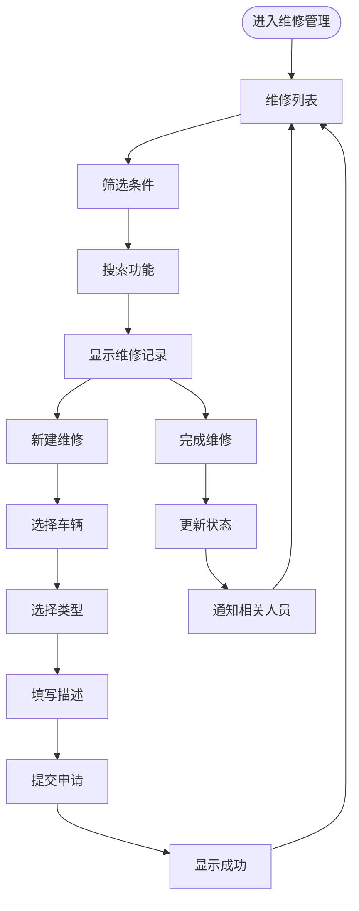

**图表来源**
- [Repair.tsx:1-263](file://weidu-fleet/src/pages/Repair.tsx#L1-L263)

维修管理的核心流程：
- 工单创建：选择车辆、类型、描述、时间
- 状态跟踪：维修中/已完成
- 完成确认：维修人员确认完成
- 历史记录：完整的维修历史查询

**章节来源**
- [Repair.tsx:1-263](file://weidu-fleet/src/pages/Repair.tsx#L1-L263)

### 租户管理模块 (Tenant)
租户管理模块提供多租户环境下的用户和资产管理：

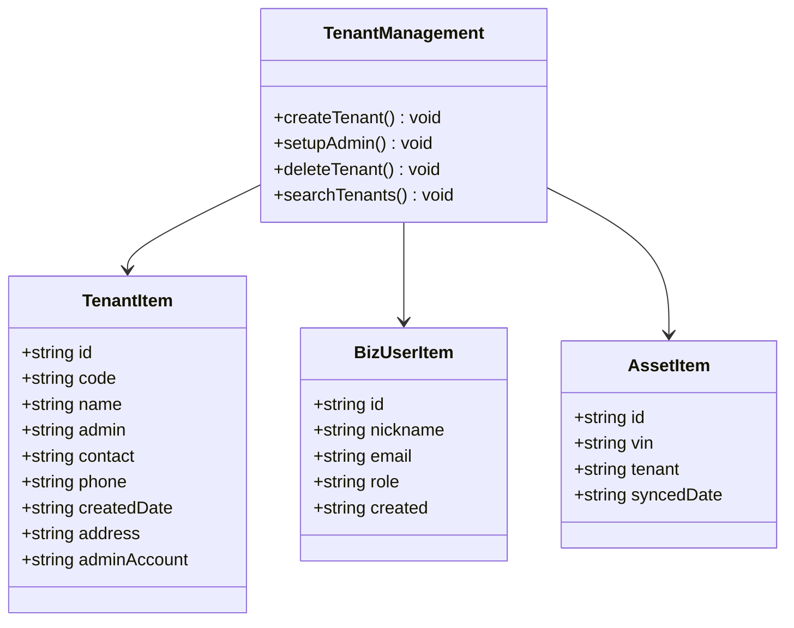

**图表来源**
- [Tenant.tsx:1-288](file://weidu-fleet/src/pages/Tenant.tsx#L1-L288)
- [index.ts:228-261](file://weidu-fleet/src/types/index.ts#L228-L261)

租户管理的关键功能：
- 租户创建：公司信息、联系方式、地址
- 管理员设置：自动生成临时密码
- 资产分配：车辆在租户间的划拨
- 权限管理：基于租户的访问控制

**章节来源**
- [Tenant.tsx:1-288](file://weidu-fleet/src/pages/Tenant.tsx#L1-L288)

### 业务配置模块 (Biz)
业务配置模块提供企业级的权限和资源配置：

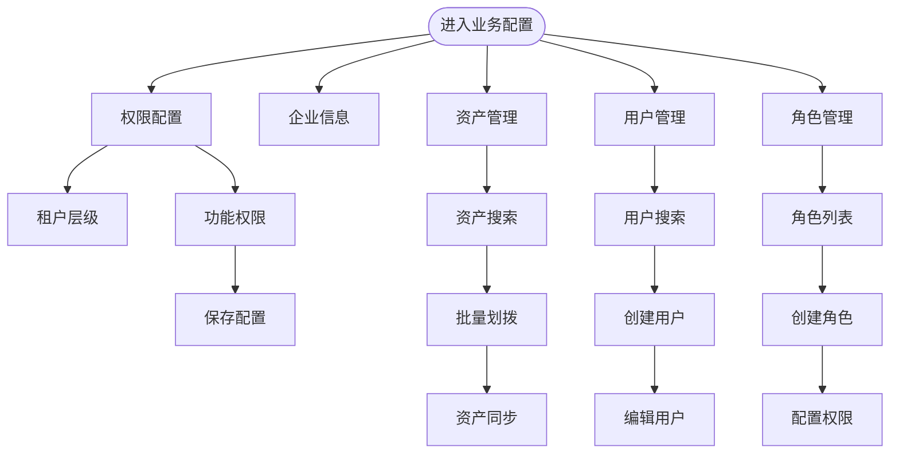

**图表来源**
- [Biz.tsx:1-609](file://weidu-fleet/src/pages/Biz.tsx#L1-L609)

业务配置的管理维度：
- 权限体系：功能权限、租户权限
- 资产管理：车辆资产的分配和历史
- 用户管理：多角色用户体系
- 角色定义：灵活的角色权限组合

**章节来源**
- [Biz.tsx:1-609](file://weidu-fleet/src/pages/Biz.tsx#L1-L609)

### 系统管理模块 (Sys)
系统管理模块提供系统级的用户和角色管理：

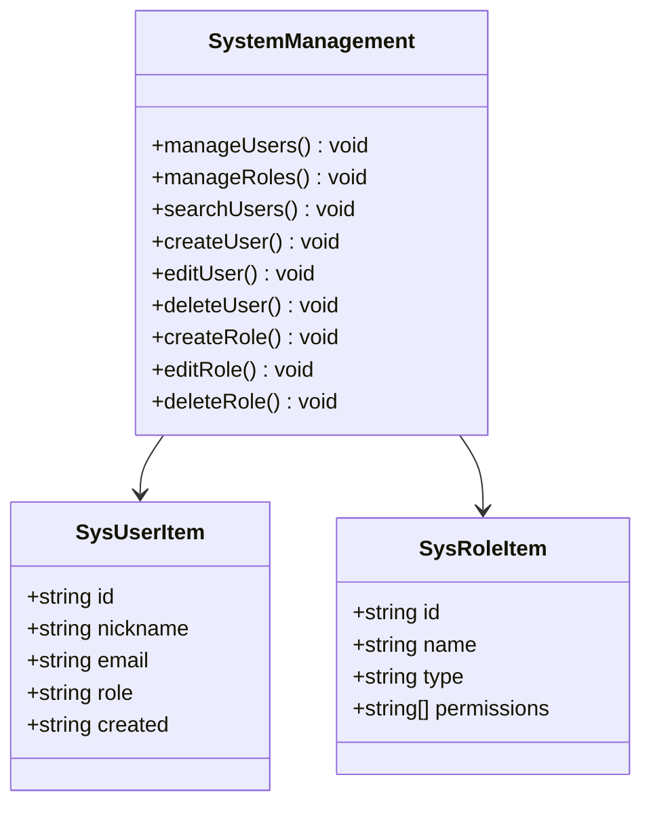

**图表来源**
- [Sys.tsx:1-349](file://weidu-fleet/src/pages/Sys.tsx#L1-L349)
- [index.ts:247-253](file://weidu-fleet/src/types/index.ts#L247-L253)

系统管理的核心功能：
- 用户管理：系统用户的增删改查
- 角色管理：系统角色的权限配置
- 权限控制：基于角色的系统访问控制
- 审计日志：用户操作记录

**章节来源**
- [Sys.tsx:1-349](file://weidu-fleet/src/pages/Sys.tsx#L1-L349)

## 依赖分析
项目采用现代化的前端技术栈，依赖关系清晰明确：

```mermaid
graph TB
subgraph "运行时依赖"
react[react ^18.3.1]
react_dom[react-dom ^18.3.1]
antd[antd ^5.21.0]
axios[axios ^1.7.7]
chart_js[chart.js ^4.4.4]
leaflet[leaflet ^1.9.4]
react_leaflet[react-leaflet ^4.2.1]
react_router[react-router-dom ^6.28.0]
zustand[zustand ^4.5.5]
xlsx[xlsx ^0.18.5]
i18next[i18next ^23.16.4]
react_i18next[react-i18next ^15.1.0]
end
subgraph "开发依赖"
vite[vite ^6.0.1]
typescript[typescript ~5.6.2]
@vitejs/plugin-react[@vitejs/plugin-react ^4.3.4]
vitest[vitest ^4.1.8]
jsdom[jsdom ^29.1.1]
@types/react[@types/react ^18.3.12]
@types/node[@types/node ^25.9.2]
@types/leaflet[@types/leaflet ^1.9.14]
end
main_tsx --> react
main_tsx --> antd
main_tsx --> chart_js
main_tsx --> leaflet
main_tsx --> react_router
main_tsx --> zustand
main_tsx --> i18next
main_tsx --> react_i18next
App_tsx --> react_router
App_tsx --> antd
App_tsx --> zustand
pages --> react
pages --> antd
pages --> chart_js
pages --> leaflet
pages --> react_leaflet
pages --> xlsx
```

**图表来源**
- [package.json:11-39](file://weidu-fleet/package.json#L11-L39)

**章节来源**
- [package.json:1-41](file://weidu-fleet/package.json#L1-L41)

## 性能考虑
项目在性能优化方面采用了多项策略：

### 代码分割和懒加载
- 使用 React.lazy 和 Suspense 实现页面级懒加载
- 减少初始包体积，提升首屏加载速度
- 按需加载大型组件如地图、图表等

### 状态管理优化
- Zustand 提供轻量级状态管理，避免不必要的重渲染
- 局部状态更新，减少全局状态波动
- 持久化存储，提升用户体验

### 图表和地图优化
- Chart.js 按需注册组件，避免加载完整库
- Leaflet 地图组件优化，支持大数据量渲染
- 图表数据分页处理，避免内存溢出

### 国际化性能
- 动态语言切换，避免重复加载翻译资源
- 按需加载语言包，减少内存占用

## 故障排除指南
常见问题及解决方案：

### 页面加载问题
**症状**：页面空白或加载缓慢
**原因**：资源文件缺失或网络问题
**解决**：
1. 检查网络连接和代理设置
2. 清除浏览器缓存
3. 验证静态资源路径配置

### 地图显示异常
**症状**：地图不显示或显示不完整
**原因**：地图服务访问受限
**解决**：
1. 检查网络代理设置
2. 验证地图服务可用性
3. 考虑使用本地地图服务

### 图表渲染问题
**症状**：图表不显示或渲染异常
**原因**：Chart.js 版本兼容性问题
**解决**：
1. 确认 Chart.js 版本匹配
2. 检查 Canvas 支持情况
3. 验证数据格式正确性

### 状态管理异常
**症状**：页面状态不同步或丢失
**原因**：Zustand 状态持久化失败
**解决**：
1. 检查浏览器存储权限
2. 验证持久化配置
3. 重启应用恢复状态

**章节来源**
- [useAppStore.ts:40-87](file://weidu-fleet/src/store/useAppStore.ts#L40-L87)

## 结论
苇渡-智利车队管理项目展现了现代前端开发的最佳实践，通过模块化设计、完善的类型系统、优秀的用户体验和可扩展的架构，为智利物流集团提供了全面的车队管理解决方案。项目在技术选型上注重实用性，在功能实现上追求完整性，为后续的功能扩展和维护奠定了坚实基础。

## 附录

### 配置选项说明
项目支持的配置选项包括：

**国际化配置**：
- 支持中文、英文、西班牙语三种语言
- 动态语言切换，自动适配系统语言
- 国际化资源按需加载

**主题配置**：
- Ant Design 主题定制
- 字体大小统一配置
- 响应式设计适配

**路由配置**：
- 嵌套路由支持
- 权限路由保护
- 动态路由参数

**构建配置**：
- Vite 开发服务器配置
- 别名路径映射
- 端口自定义

**章节来源**
- [main.tsx:19-42](file://weidu-fleet/src/main.tsx#L19-L42)
- [vite.config.ts:5-15](file://weidu-fleet/vite.config.ts#L5-L15)