# 电池管理系统

<cite>
**本文档引用的文件**
- [Battery.tsx](file://weidu-fleet/src/pages/Battery.tsx)
- [index.ts](file://weidu-fleet/src/types/index.ts)
- [mock.ts](file://weidu-fleet/src/api/mock.ts)
- [useAppStore.ts](file://weidu-fleet/src/store/useAppStore.ts)
- [BatteryTable.tsx](file://weidu-fleet/src/pages/Vehicles/BatteryTable.tsx)
- [ChargeTable.tsx](file://weidu-fleet/src/pages/Vehicles/ChargeTable.tsx)
- [AlertTable.tsx](file://weidu-fleet/src/pages/Vehicles/AlertTable.tsx)
- [MileageChart.tsx](file://weidu-fleet/src/pages/Vehicles/MileageChart.tsx)
- [format.ts](file://weidu-fleet/src/utils/format.ts)
- [zh.ts](file://weidu-fleet/src/i18n/zh.ts)
- [package.json](file://weidu-fleet/package.json)
</cite>

## 目录
1. [简介](#简介)
2. [项目结构](#项目结构)
3. [核心组件](#核心组件)
4. [架构概览](#架构概览)
5. [详细组件分析](#详细组件分析)
6. [依赖关系分析](#依赖关系分析)
7. [性能考虑](#性能考虑)
8. [故障排除指南](#故障排除指南)
9. [结论](#结论)
10. [附录](#附录)

## 简介

电池管理系统是一个基于React和TypeScript开发的智能电池监控平台，专为智利车队管理而设计。该系统提供了全面的电池状态监控、充电管理、电池健康度分析和告警机制，帮助车队管理者有效监控和管理电动车辆的电池性能。

系统采用现代化的技术栈，包括Ant Design UI框架、Chart.js图表库、React i18n国际化支持和Zustand状态管理。通过Mock数据模拟真实场景，为用户提供完整的电池管理解决方案。

## 项目结构

该电池管理系统采用模块化的前端架构，主要分为以下几个核心部分：

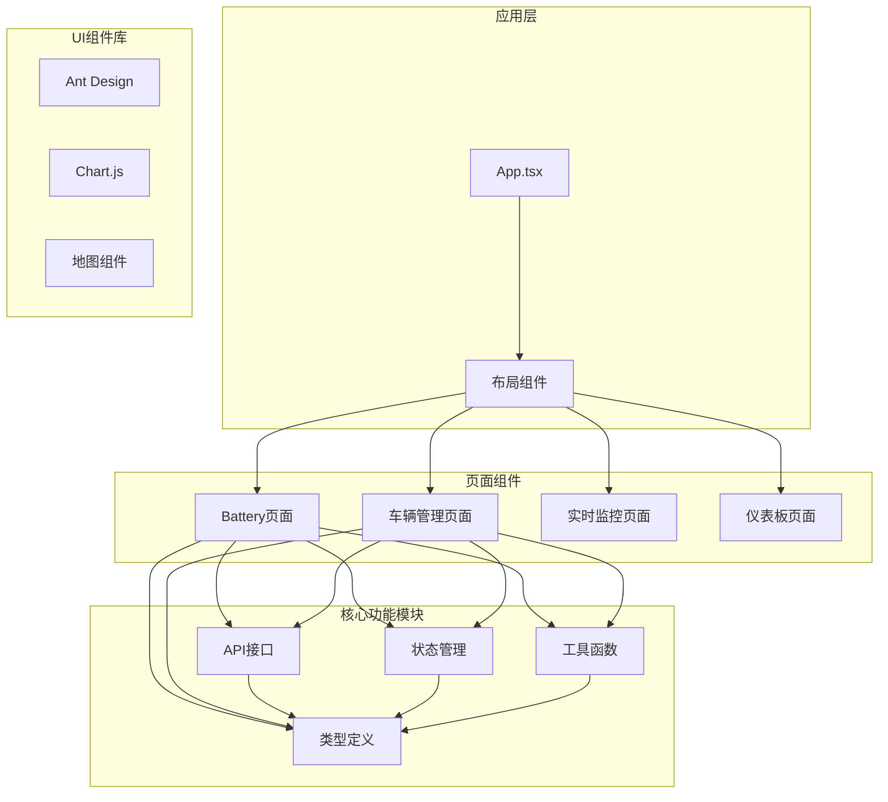

**图表来源**
- [Battery.tsx:1-343](file://weidu-fleet/src/pages/Battery.tsx#L1-L343)
- [index.ts:1-261](file://weidu-fleet/src/types/index.ts#L1-L261)
- [mock.ts:1-634](file://weidu-fleet/src/api/mock.ts#L1-L634)

**章节来源**
- [Battery.tsx:1-343](file://weidu-fleet/src/pages/Battery.tsx#L1-L343)
- [package.json:1-41](file://weidu-fleet/package.json#L1-L41)

## 核心组件

### 数据模型架构

系统的核心数据模型围绕电池管理需求构建，主要包括以下关键实体：

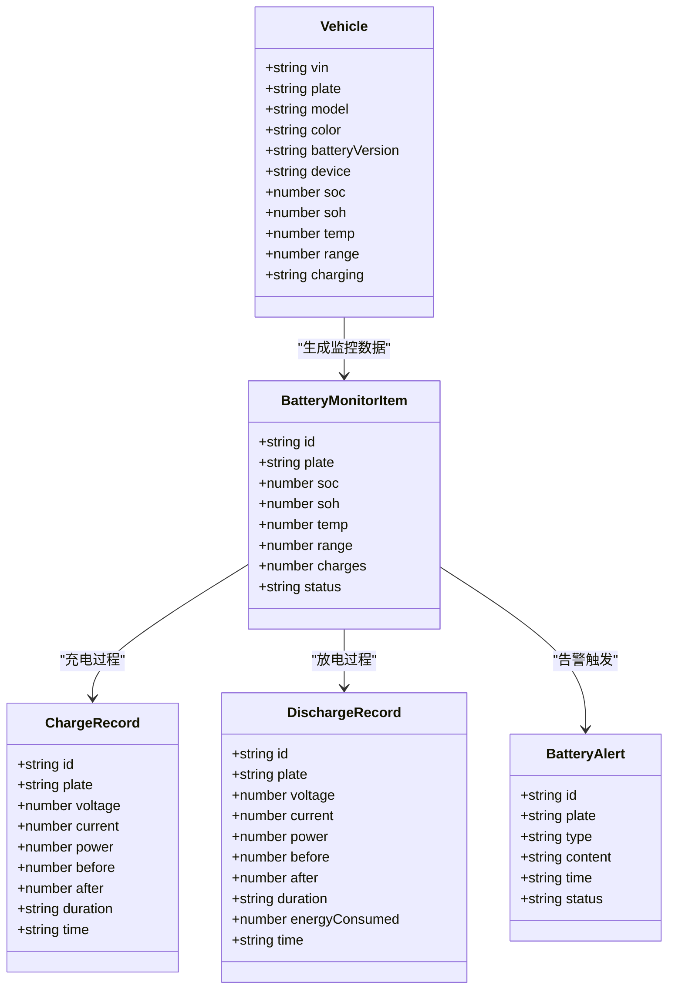

**图表来源**
- [index.ts:1-157](file://weidu-fleet/src/types/index.ts#L1-L157)

### 状态管理架构

系统采用Zustand实现全局状态管理，支持多页面间的状态共享和持久化存储：

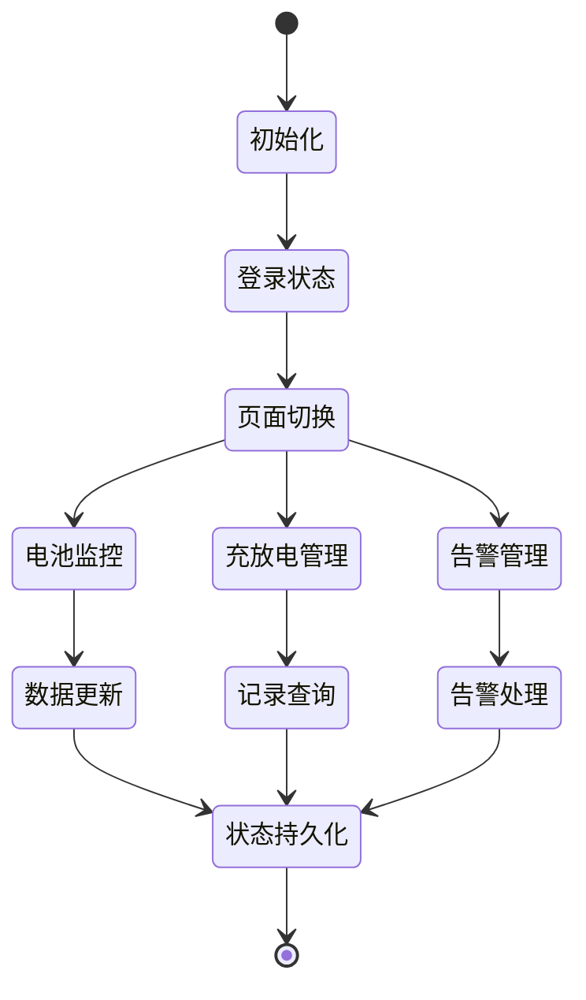

**图表来源**
- [useAppStore.ts:1-87](file://weidu-fleet/src/store/useAppStore.ts#L1-L87)

**章节来源**
- [index.ts:1-157](file://weidu-fleet/src/types/index.ts#L1-L157)
- [useAppStore.ts:1-87](file://weidu-fleet/src/store/useAppStore.ts#L1-L87)

## 架构概览

### 整体架构设计

系统采用分层架构设计，确保各组件职责清晰、耦合度低：

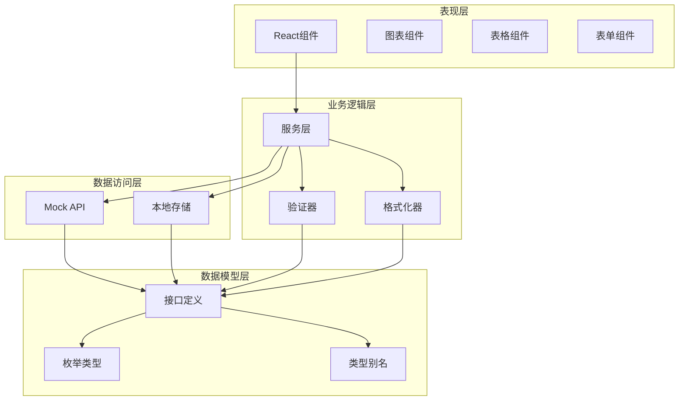

**图表来源**
- [Battery.tsx:1-343](file://weidu-fleet/src/pages/Battery.tsx#L1-L343)
- [mock.ts:1-634](file://weidu-fleet/src/api/mock.ts#L1-L634)

### 数据流架构

系统内部的数据流遵循单向数据流原则，确保数据的一致性和可预测性：

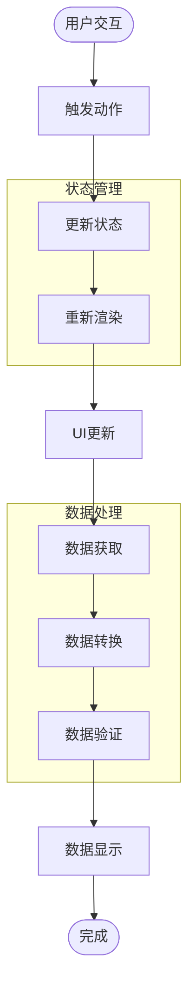

**图表来源**
- [Battery.tsx:33-343](file://weidu-fleet/src/pages/Battery.tsx#L33-L343)
- [mock.ts:203-247](file://weidu-fleet/src/api/mock.ts#L203-L247)

## 详细组件分析

### 电池监控页面

电池监控页面是系统的核心功能模块，提供实时的电池状态监控和历史数据分析：

#### 主要功能特性

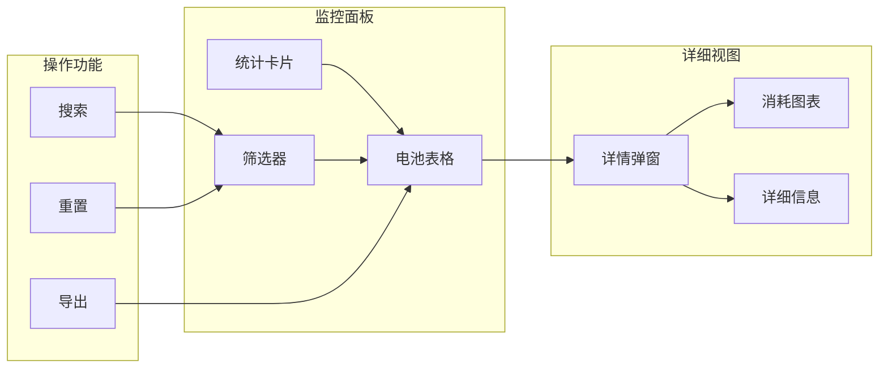

**图表来源**
- [Battery.tsx:159-258](file://weidu-fleet/src/pages/Battery.tsx#L159-L258)

#### 数据展示逻辑

系统通过多种维度展示电池状态数据：

| 展示维度 | 数据字段 | 颜色标识 | 阈值设置 |
|---------|----------|----------|----------|
| 电池状态 | SOC(%) | 绿色: >20%, 红色: ≤20% | 低电量告警阈值 |
| 电池健康 | SOH(%) | 绿色: >85%, 黄色: 70-85%, 红色: ≤70% | 健康度评估 |
| 工作温度 | 温度(°C) | 蓝色: 正常, 红色: 过高 | 温度监控 |
| 续航里程 | 续航(km) | 绿色: >100km, 橙色: 50-100km, 红色: ≤50km | 续航评估 |

**章节来源**
- [Battery.tsx:84-130](file://weidu-fleet/src/pages/Battery.tsx#L84-L130)
- [Battery.tsx:163-185](file://weidu-fleet/src/pages/Battery.tsx#L163-L185)

### 充放电管理模块

系统提供完整的充放电记录管理功能，支持充电和放电两种模式的详细追踪：

#### 充电记录分析

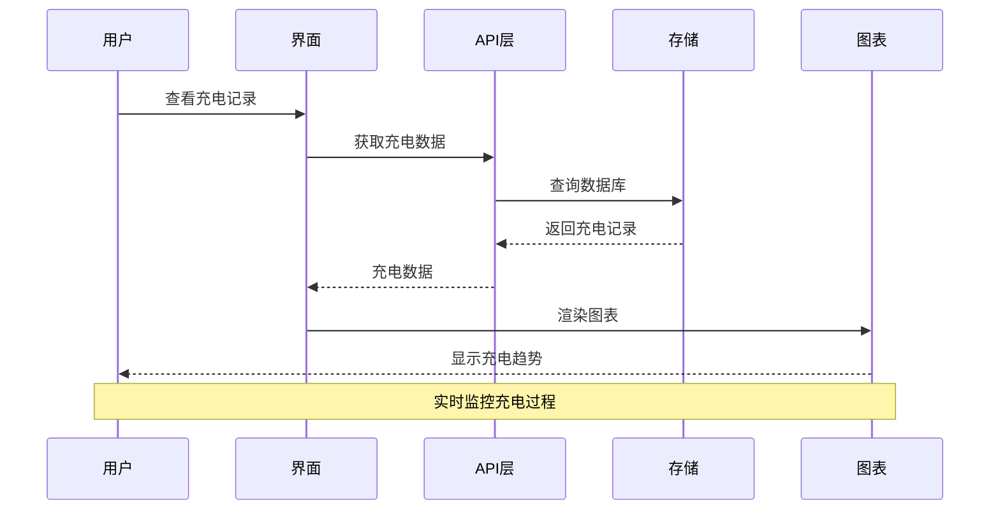

**图表来源**
- [ChargeTable.tsx:1-27](file://weidu-fleet/src/pages/Vehicles/ChargeTable.tsx#L1-L27)
- [mock.ts:216-230](file://weidu-fleet/src/api/mock.ts#L216-L230)

#### 放电记录监控

放电记录模块专注于车辆运行过程中的能耗分析：

| 参数指标 | 单位 | 正常范围 | 异常判断 |
|---------|------|----------|----------|
| 电压(V) | V | 300-400 | <300: 电压不足, >400: 过压警告 |
| 电流(A) | A | 30-100 | 超过额定电流: 过载风险 |
| 功率(kW) | kW | 20-60 | 功率异常波动: 系统故障 |
| 能耗(kWh) | kWh | 30-80 | 能耗异常增加: 电池老化 |

**章节来源**
- [ChargeTable.tsx:10-22](file://weidu-fleet/src/pages/Vehicles/ChargeTable.tsx#L10-L22)
- [mock.ts:232-246](file://weidu-fleet/src/api/mock.ts#L232-L246)

### 告警管理系统

系统实现了多层次的电池告警机制，能够及时发现和处理电池异常情况：

#### 告警类型分类

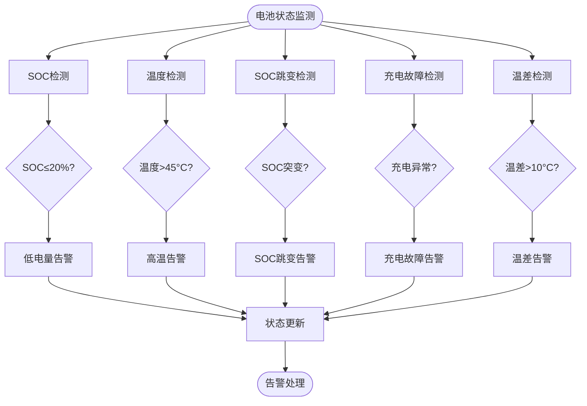

**图表来源**
- [mock.ts:158-170](file://weidu-fleet/src/api/mock.ts#L158-L170)
- [AlertTable.tsx:6-22](file://weidu-fleet/src/pages/Vehicles/AlertTable.tsx#L6-L22)

#### 告警处理流程

系统采用标准化的告警处理流程：

1. **告警检测**: 实时监控电池参数变化
2. **阈值比较**: 与预设阈值进行对比
3. **告警生成**: 创建告警记录并标记状态
4. **通知发送**: 通过系统通知相关人员
5. **处理跟踪**: 跟踪告警处理进度
6. **历史归档**: 归档处理完成的告警

**章节来源**
- [AlertTable.tsx:24-42](file://weidu-fleet/src/pages/Vehicles/AlertTable.tsx#L24-L42)
- [mock.ts:158-170](file://weidu-fleet/src/api/mock.ts#L158-L170)

### 数据可视化方案

系统提供了丰富的数据可视化功能，帮助用户直观地理解电池状态和趋势：

#### 图表组件架构

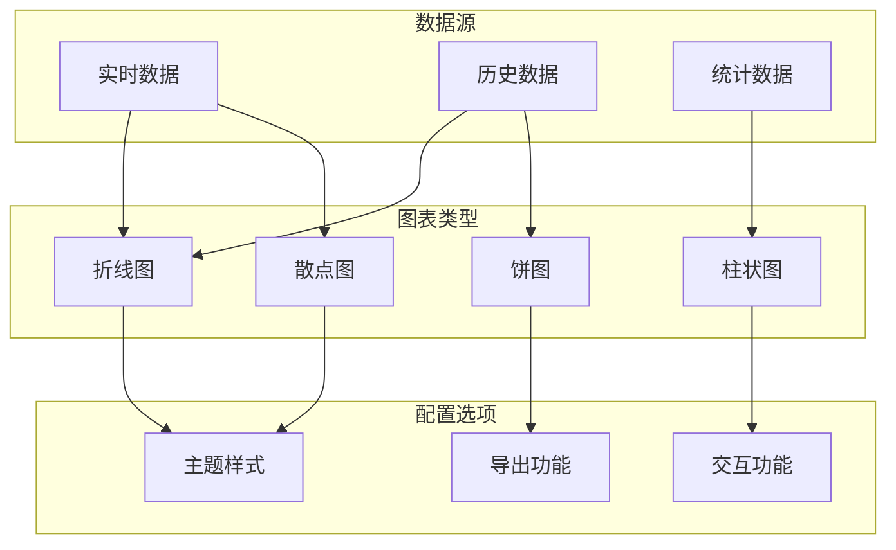

**图表来源**
- [Battery.tsx:58-82](file://weidu-fleet/src/pages/Battery.tsx#L58-L82)
- [MileageChart.tsx:23-56](file://weidu-fleet/src/pages/Vehicles/MileageChart.tsx#L23-L56)

#### 可视化数据指标

| 图表类型 | 数据指标 | 展示方式 | 分析价值 |
|---------|----------|----------|----------|
| 折线图 | 日消耗电量 | 时间序列曲线 | 能耗趋势分析 |
| 柱状图 | 充电次数统计 | 分类柱状 | 使用频率评估 |
| 饼图 | 电池状态分布 | 百分比扇形 | 健康度概览 |
| 散点图 | 电压电流关系 | 散点分布 | 性能特征分析 |

**章节来源**
- [Battery.tsx:58-82](file://weidu-fleet/src/pages/Battery.tsx#L58-L82)
- [MileageChart.tsx:19-76](file://weidu-fleet/src/pages/Vehicles/MileageChart.tsx#L19-L76)

## 依赖关系分析

### 技术栈依赖

系统采用现代化的前端技术栈，确保良好的开发体验和用户体验：

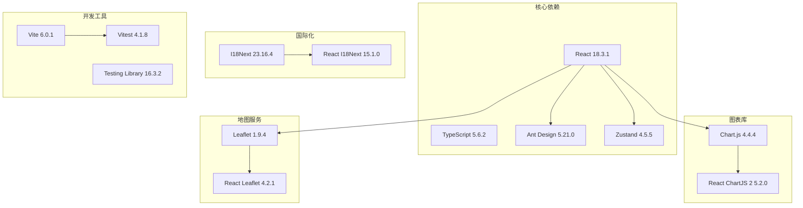

**图表来源**
- [package.json:11-26](file://weidu-fleet/package.json#L11-L26)

### 组件间依赖关系

系统组件之间建立了清晰的依赖关系，确保模块化设计的有效性：

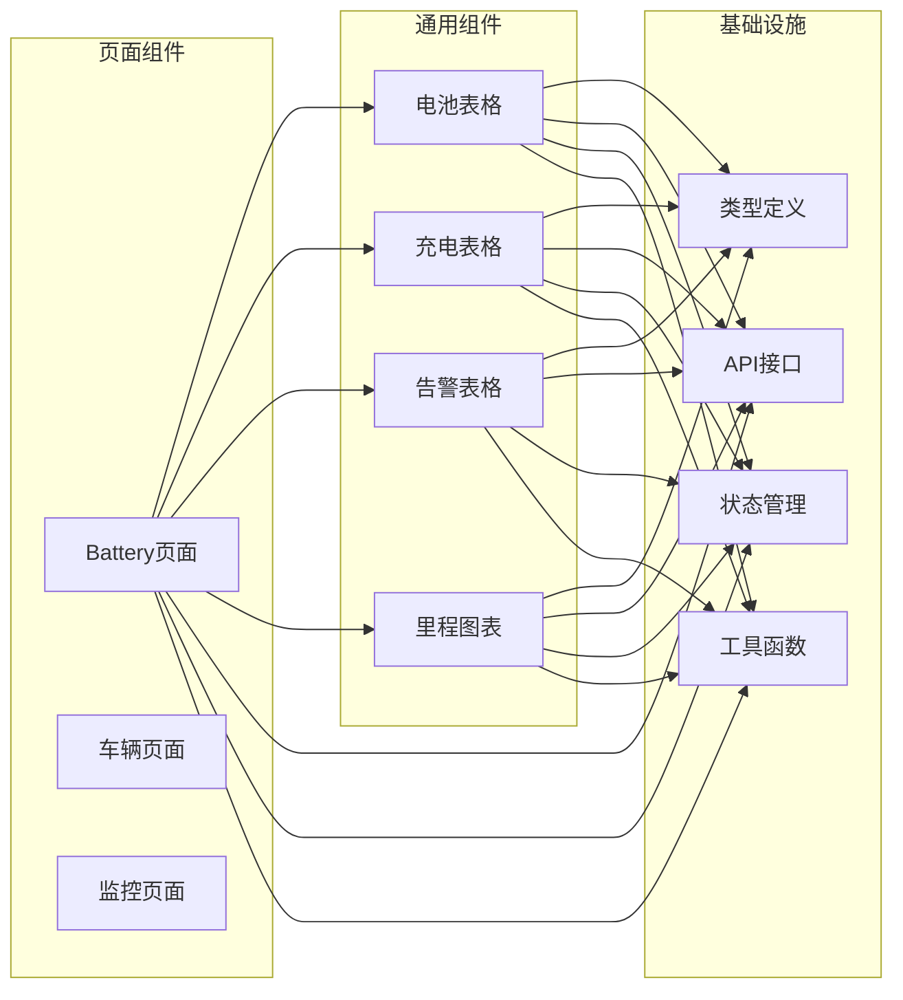

**图表来源**
- [Battery.tsx:1-343](file://weidu-fleet/src/pages/Battery.tsx#L1-L343)
- [BatteryTable.tsx:1-20](file://weidu-fleet/src/pages/Vehicles/BatteryTable.tsx#L1-L20)
- [ChargeTable.tsx:1-27](file://weidu-fleet/src/pages/Vehicles/ChargeTable.tsx#L1-L27)
- [AlertTable.tsx:1-42](file://weidu-fleet/src/pages/Vehicles/AlertTable.tsx#L1-L42)

**章节来源**
- [package.json:1-41](file://weidu-fleet/package.json#L1-L41)
- [Battery.tsx:1-343](file://weidu-fleet/src/pages/Battery.tsx#L1-L343)

## 性能考虑

### 数据加载优化

系统在数据加载方面采用了多种优化策略：

1. **懒加载机制**: 使用`useMemo`缓存计算结果，避免重复计算
2. **虚拟滚动**: 对于大量数据的表格采用虚拟滚动技术
3. **分页加载**: 支持大数据量的分页显示
4. **防抖处理**: 输入框搜索采用防抖机制减少请求频率

### 内存管理

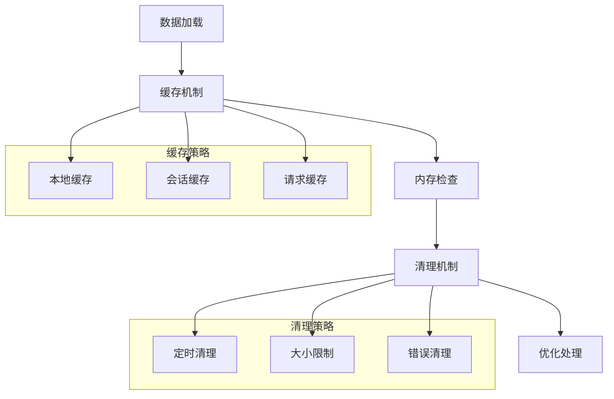

### 响应式设计

系统采用响应式设计确保在不同设备上的良好体验：

- **移动端适配**: 使用Flexbox和Grid布局适应移动设备
- **图表自适应**: Chart.js图表自动调整尺寸
- **表格滚动**: 大表格支持横向滚动
- **字体缩放**: 支持字体大小调整

## 故障排除指南

### 常见问题诊断

#### 数据显示异常

**问题症状**: 电池数据不显示或显示错误

**可能原因**:
1. API接口连接失败
2. 数据格式不匹配
3. 状态管理异常
4. 缓存数据过期

**解决步骤**:
1. 检查网络连接状态
2. 验证API响应格式
3. 清除浏览器缓存
4. 重启应用进程

#### 图表渲染问题

**问题症状**: 图表无法正常显示或显示异常

**可能原因**:
1. Chart.js库加载失败
2. 数据格式不符合要求
3. Canvas元素初始化问题
4. 浏览器兼容性问题

**解决步骤**:
1. 检查Chart.js依赖是否正确安装
2. 验证数据格式和结构
3. 确认Canvas元素可用
4. 测试不同浏览器兼容性

#### 告警功能异常

**问题症状**: 告警不触发或触发异常

**可能原因**:
1. 阈值配置错误
2. 监控逻辑异常
3. 通知机制故障
4. 数据更新延迟

**解决步骤**:
1. 检查告警阈值配置
2. 验证监控逻辑实现
3. 测试通知渠道
4. 调整数据更新频率

**章节来源**
- [Battery.tsx:226-256](file://weidu-fleet/src/pages/Battery.tsx#L226-L256)
- [mock.ts:158-170](file://weidu-fleet/src/api/mock.ts#L158-L170)

## 结论

电池管理系统通过模块化的设计和丰富的功能特性，为智利车队提供了全面的电池管理解决方案。系统具备以下优势：

### 核心优势

1. **完整的监控体系**: 提供从实时监控到历史分析的全方位电池管理
2. **智能化告警机制**: 多层次的告警系统确保及时发现和处理电池异常
3. **直观的数据可视化**: 丰富的图表和表格帮助用户快速理解电池状态
4. **灵活的扩展性**: 模块化架构便于功能扩展和定制开发
5. **良好的用户体验**: 响应式设计和国际化支持提升用户满意度

### 技术亮点

- **现代化技术栈**: React + TypeScript + Ant Design + Chart.js
- **状态管理优化**: Zustand提供轻量级状态管理解决方案
- **Mock数据驱动**: 完整的Mock数据确保开发效率和测试覆盖
- **国际化支持**: 多语言支持满足不同地区用户需求
- **性能优化**: 多种性能优化策略确保系统流畅运行

### 发展前景

该系统为未来的电池管理功能扩展奠定了坚实基础，可以进一步集成真实的电池管理系统API，实现真正的电池状态监控和远程管理功能。同时，系统架构的模块化设计也为后续的功能增强提供了便利。

## 附录

### 实际使用案例

#### 案例一：电池健康度分析

某物流公司使用系统监控其100辆电动货车的电池状态，通过以下步骤实现：

1. **初始配置**: 设置电池健康度阈值(>85%为优秀，70-85%为良好，≤70%为需要关注)
2. **日常监控**: 查看平均SOC、平均温度和平均续航数据
3. **趋势分析**: 通过日消耗电量图表识别电池老化趋势
4. **预防维护**: 基于健康度分析制定预防性维护计划

#### 案例二：充电策略优化

某公交公司利用系统优化充电策略：

1. **充电模式分析**: 比较快充和慢充对电池寿命的影响
2. **时间安排优化**: 根据运营需求安排最佳充电时间
3. **成本控制**: 通过峰谷电价策略降低充电成本
4. **效率提升**: 优化充电站利用率和充电排队时间

### 最佳实践建议

1. **定期维护**: 建议每季度进行一次电池健康度全面检查
2. **数据备份**: 定期备份电池历史数据防止数据丢失
3. **人员培训**: 对操作人员进行系统使用培训
4. **应急预案**: 制定电池异常情况的应急处理预案
5. **持续改进**: 根据使用反馈持续优化系统配置