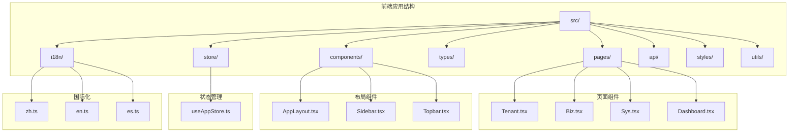
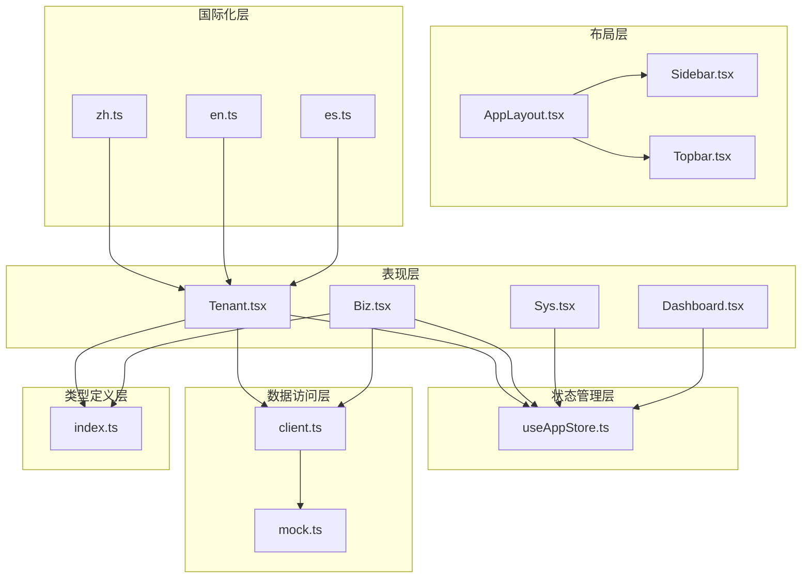
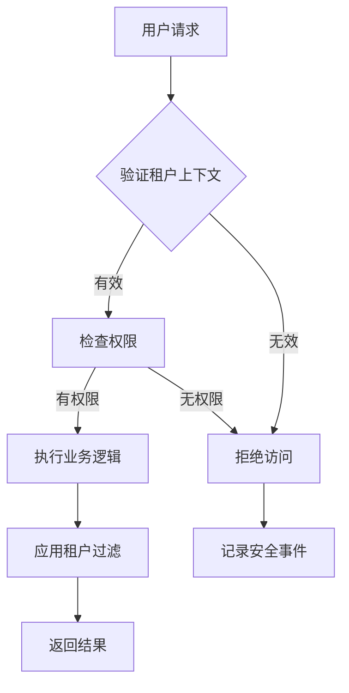
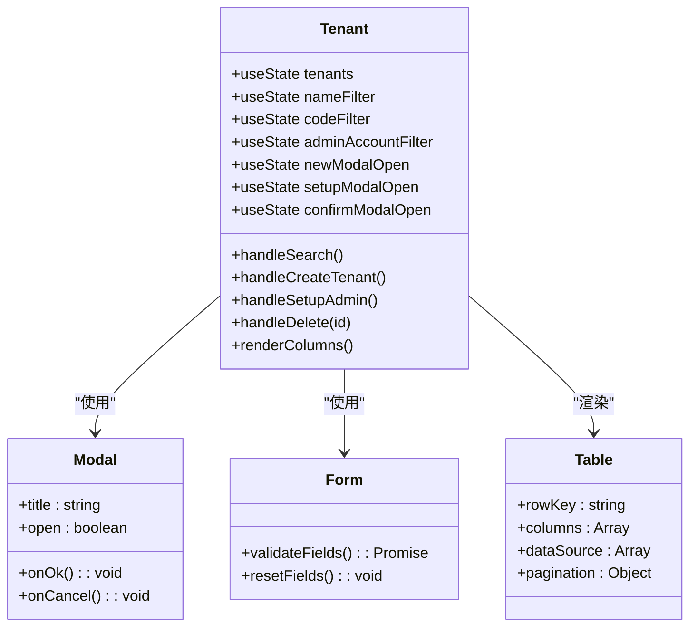
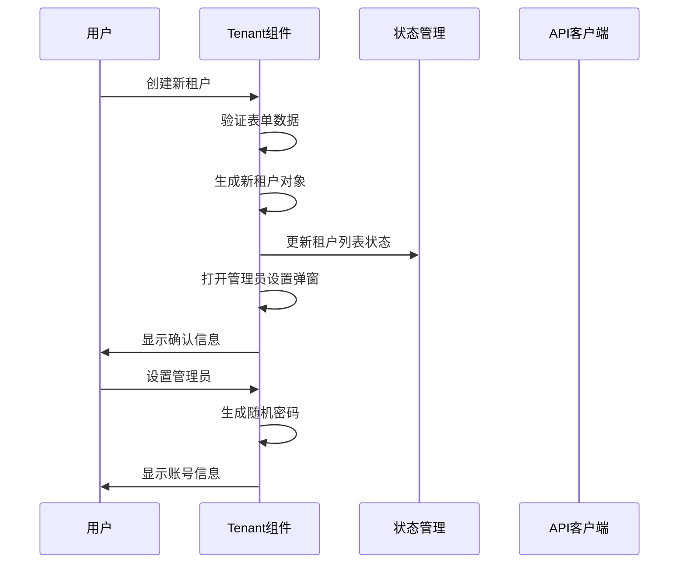
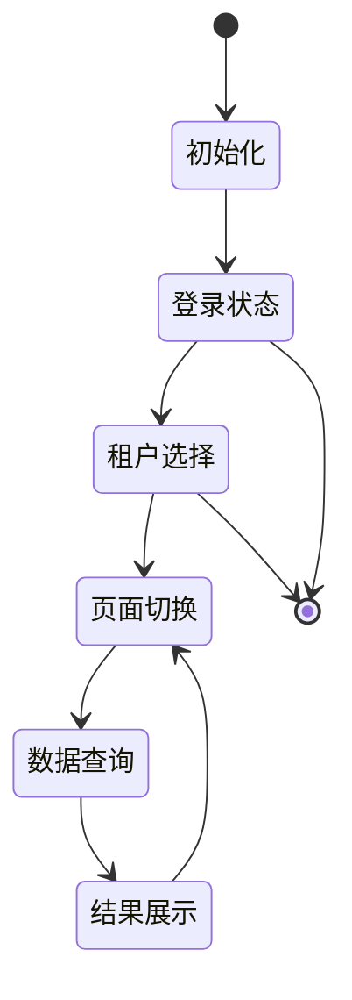
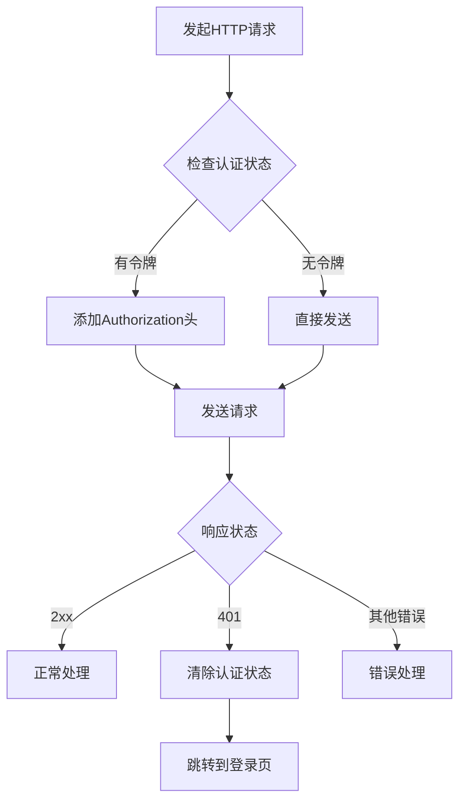
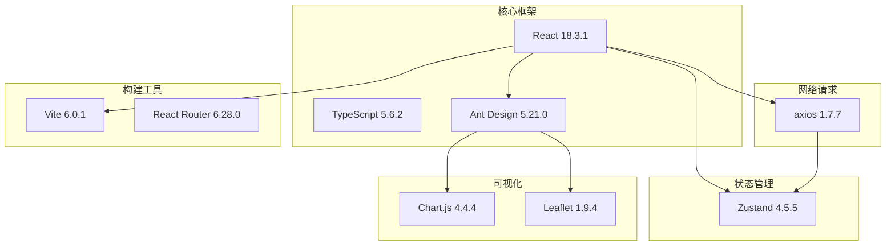
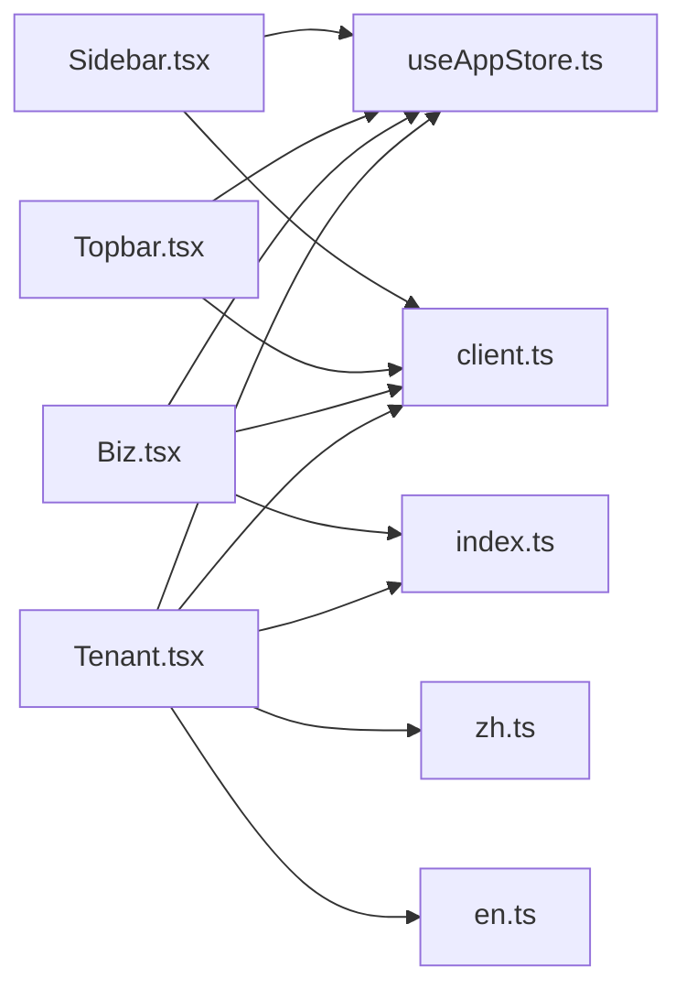
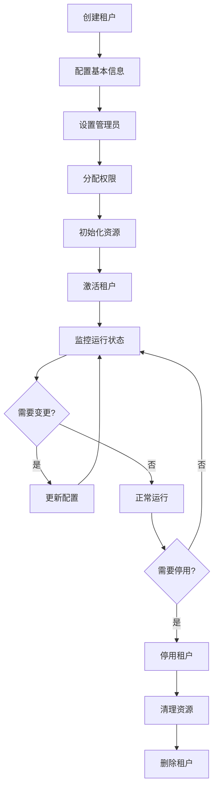

# 租户管理系统

<cite>
**本文档引用的文件**
- [Tenant.tsx](file://weidu-fleet/src/pages/Tenant.tsx)
- [useAppStore.ts](file://weidu-fleet/src/store/useAppStore.ts)
- [index.ts](file://weidu-fleet/src/types/index.ts)
- [client.ts](file://weidu-fleet/src/api/client.ts)
- [zh.ts](file://weidu-fleet/src/i18n/zh.ts)
- [en.ts](file://weidu-fleet/src/i18n/en.ts)
- [vite.config.ts](file://weidu-fleet/vite.config.ts)
- [package.json](file://weidu-fleet/package.json)
- [App.tsx](file://weidu-fleet/src/App.tsx)
- [Sidebar.tsx](file://weidu-fleet/src/components/Layout/Sidebar.tsx)
- [Topbar.tsx](file://weidu-fleet/src/components/Layout/Topbar.tsx)
- [Biz.tsx](file://weidu-fleet/src/pages/Biz.tsx)
</cite>

## 目录
1. [简介](#简介)
2. [项目结构](#项目结构)
3. [核心组件](#核心组件)
4. [架构概览](#架构概览)
5. [详细组件分析](#详细组件分析)
6. [依赖关系分析](#依赖关系分析)
7. [性能考虑](#性能考虑)
8. [故障排除指南](#故障排除指南)
9. [结论](#结论)
10. [附录](#附录)

## 简介

苇渡-智利车队管理平台是一个基于React技术栈开发的多租户车队管理解决方案。该系统专为智利地区的物流和运输企业提供全面的车队管理服务，包括车辆监控、驾驶行为分析、电池管理、围栏管理等功能。

本系统采用现代化的前端架构，使用TypeScript确保类型安全，配合Ant Design组件库提供丰富的UI交互体验。系统支持多语言切换（中英文），具备完整的租户管理功能，能够有效管理多个租户及其子租户。

## 项目结构

项目采用模块化的组织方式，主要分为以下几个核心部分：

**图表来源**
- [App.tsx:1-80](file://weidu-fleet/src/App.tsx#L1-L80)
- [vite.config.ts:1-16](file://weidu-fleet/vite.config.ts#L1-L16)

**章节来源**
- [package.json:1-41](file://weidu-fleet/package.json#L1-L41)
- [vite.config.ts:1-16](file://weidu-fleet/vite.config.ts#L1-L16)

## 核心组件

### 租户管理页面组件

租户管理页面是系统的核心功能模块之一，提供了完整的租户生命周期管理能力。该组件实现了以下关键功能：

- **租户信息展示**：通过表格形式展示所有租户的基本信息
- **租户搜索过滤**：支持按名称、编码、管理员账号进行多条件筛选
- **租户创建流程**：提供标准化的租户创建向导
- **管理员设置**：支持为租户设置管理员账户
- **租户删除功能**：提供安全的租户删除机制

### 应用状态管理

系统使用Zustand作为状态管理解决方案，提供了全局状态的持久化存储：

- **用户认证状态**：管理用户的登录状态和认证令牌
- **租户切换功能**：支持在不同租户间的快速切换
- **页面路由状态**：维护应用的导航状态
- **本地存储优化**：仅持久化必要的状态信息

### 类型定义系统

系统建立了完整的TypeScript类型定义体系，确保代码的类型安全性和可维护性：

- **租户数据模型**：定义了TenantItem接口的完整结构
- **业务实体类型**：涵盖了车辆、报警、围栏等核心业务对象
- **API响应类型**：定义了前后端交互的数据结构

**章节来源**
- [Tenant.tsx:1-288](file://weidu-fleet/src/pages/Tenant.tsx#L1-L288)
- [useAppStore.ts:1-87](file://weidu-fleet/src/store/useAppStore.ts#L1-L87)
- [index.ts:228-238](file://weidu-fleet/src/types/index.ts#L228-L238)

## 架构概览

系统采用分层架构设计，各层职责明确，耦合度低：

**图表来源**
- [App.tsx:1-80](file://weidu-fleet/src/App.tsx#L1-L80)
- [client.ts:1-32](file://weidu-fleet/src/api/client.ts#L1-L32)
- [useAppStore.ts:1-87](file://weidu-fleet/src/store/useAppStore.ts#L1-L87)

### 多租户架构设计原理

系统采用共享数据库、分离Schema的多租户架构模式：

- **数据隔离**：每个租户拥有独立的数据命名空间
- **资源共享**：公共组件和基础设施在租户间共享
- **权限控制**：严格的访问控制确保租户间数据隔离
- **扩展性**：支持动态添加新租户而无需停机

### 租户隔离机制

系统实现了多层次的租户隔离策略：

**图表来源**
- [client.ts:9-29](file://weidu-fleet/src/api/client.ts#L9-L29)
- [Topbar.tsx:126-140](file://weidu-fleet/src/components/Layout/Topbar.tsx#L126-L140)

## 详细组件分析

### 租户管理页面组件分析

#### 组件架构图

**图表来源**
- [Tenant.tsx:28-288](file://weidu-fleet/src/pages/Tenant.tsx#L28-L288)

#### 数据流分析

**图表来源**
- [Tenant.tsx:62-97](file://weidu-fleet/src/pages/Tenant.tsx#L62-L97)
- [useAppStore.ts:40-87](file://weidu-fleet/src/store/useAppStore.ts#L40-L87)

**章节来源**
- [Tenant.tsx:1-288](file://weidu-fleet/src/pages/Tenant.tsx#L1-L288)

### 状态管理组件分析

#### 状态管理模式

**图表来源**
- [useAppStore.ts:40-87](file://weidu-fleet/src/store/useAppStore.ts#L40-L87)

#### 状态持久化策略

系统采用选择性持久化策略，仅保存必要的用户状态信息：

- **用户信息**：用户名、邮箱、必须修改密码标识
- **认证令牌**：JWT令牌用于API认证
- **语言偏好**：用户界面语言设置
- **当前租户**：用户当前选择的租户标识

**章节来源**
- [useAppStore.ts:76-86](file://weidu-fleet/src/store/useAppStore.ts#L76-L86)

### API客户端组件分析

#### 请求拦截器流程

**图表来源**
- [client.ts:9-29](file://weidu-fleet/src/api/client.ts#L9-L29)

**章节来源**
- [client.ts:1-32](file://weidu-fleet/src/api/client.ts#L1-L32)

## 依赖关系分析

### 技术栈依赖关系

**图表来源**
- [package.json:11-26](file://weidu-fleet/package.json#L11-L26)

### 组件间依赖关系

**图表来源**
- [Tenant.tsx:1-15](file://weidu-fleet/src/pages/Tenant.tsx#L1-L15)
- [Biz.tsx:1-30](file://weidu-fleet/src/pages/Biz.tsx#L1-L30)

**章节来源**
- [package.json:1-41](file://weidu-fleet/package.json#L1-L41)

## 性能考虑

### 前端性能优化策略

1. **组件懒加载**：使用React.lazy实现租户管理页面的按需加载
2. **状态局部化**：避免不必要的全局状态更新
3. **虚拟滚动**：对于大量数据的表格使用虚拟滚动技术
4. **图片优化**：使用适当的图片格式和尺寸

### 网络请求优化

1. **请求缓存**：合理利用浏览器缓存机制
2. **批量请求**：合并多个API调用减少网络往返
3. **超时控制**：设置合理的请求超时时间
4. **错误重试**：实现智能的错误重试机制

## 故障排除指南

### 常见问题及解决方案

#### 租户管理功能异常

**问题症状**：租户列表无法显示或操作按钮失效

**可能原因**：
- 状态管理异常
- API请求失败
- 权限配置错误

**解决步骤**：
1. 检查浏览器开发者工具中的网络请求
2. 验证认证令牌的有效性
3. 确认用户权限配置
4. 查看控制台错误信息

#### 租户切换问题

**问题症状**：租户切换后页面状态未更新

**解决步骤**：
1. 清除浏览器缓存
2. 重新登录系统
3. 检查localStorage中的租户状态
4. 刷新页面强制重新加载

**章节来源**
- [client.ts:17-29](file://weidu-fleet/src/api/client.ts#L17-L29)
- [Topbar.tsx:126-140](file://weidu-fleet/src/components/Layout/Topbar.tsx#L126-L140)

## 结论

苇渡-智利车队管理平台的租户管理系统展现了现代前端架构的最佳实践。系统通过清晰的模块划分、完善的类型定义、有效的状态管理和合理的API设计，为多租户车队管理提供了可靠的技术基础。

该系统的主要优势包括：
- **架构清晰**：层次分明，职责明确
- **扩展性强**：支持动态租户添加和权限管理
- **用户体验好**：响应式设计，多语言支持
- **安全性高**：多层次的权限控制和数据隔离

未来可以考虑的功能增强：
- 实现更精细的租户权限控制
- 添加租户数据分析功能
- 优化移动端用户体验
- 增强系统监控和日志功能

## 附录

### API集成方法

系统提供了标准的API集成接口，支持RESTful风格的请求：

- **基础URL**：`/api`
- **认证方式**：Bearer Token
- **超时设置**：10秒
- **错误处理**：自动401状态处理

### 租户生命周期管理

### 安全防护措施

系统实施了多重安全防护机制：
- **认证授权**：JWT令牌认证和权限控制
- **数据加密**：敏感信息加密存储
- **输入验证**：前端和后端双重验证
- **审计日志**：完整的操作记录