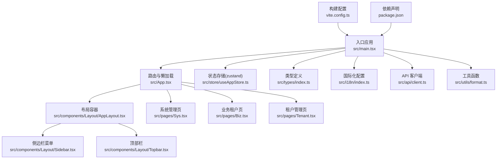
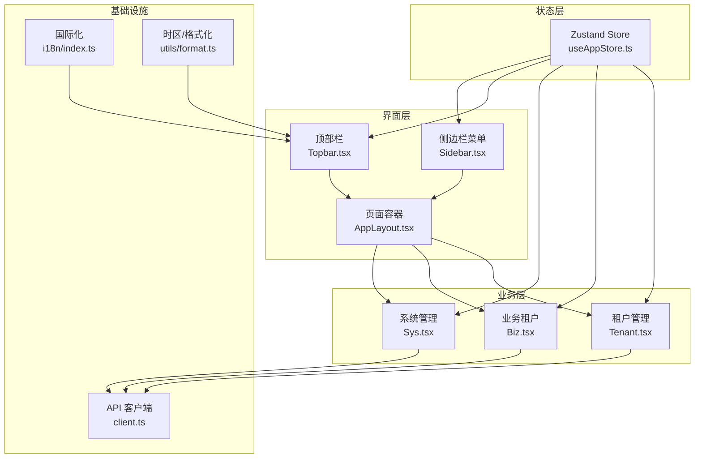
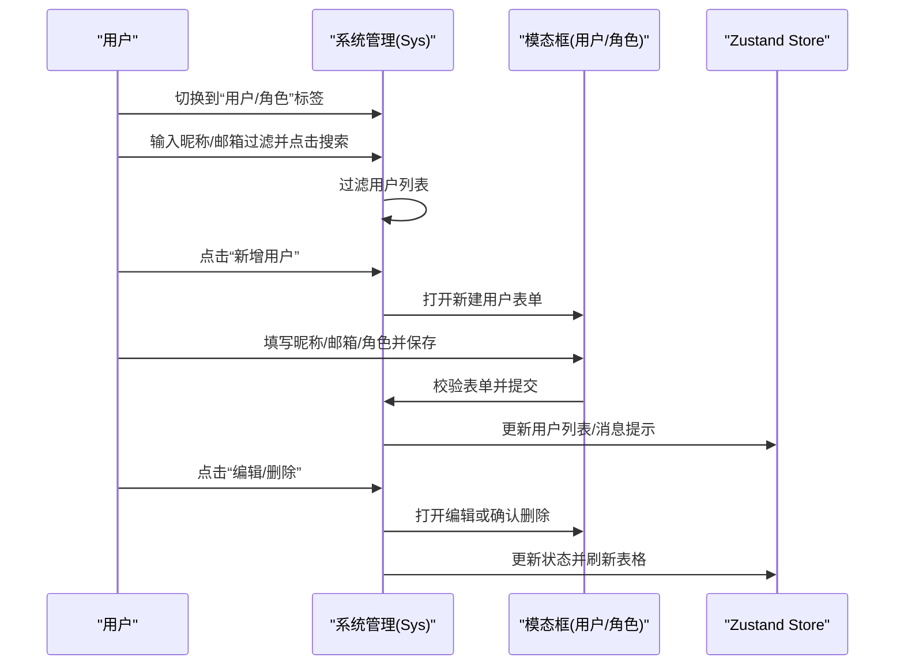
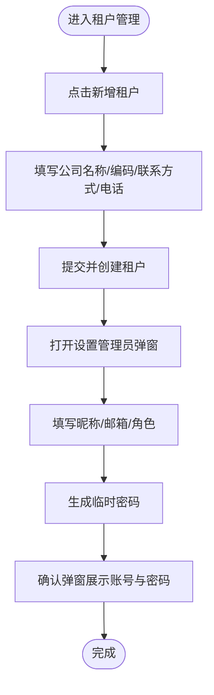
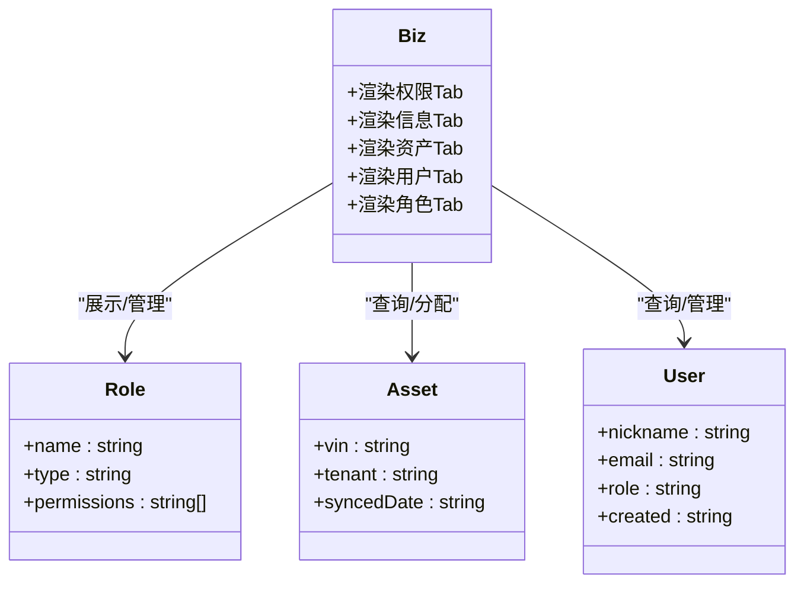
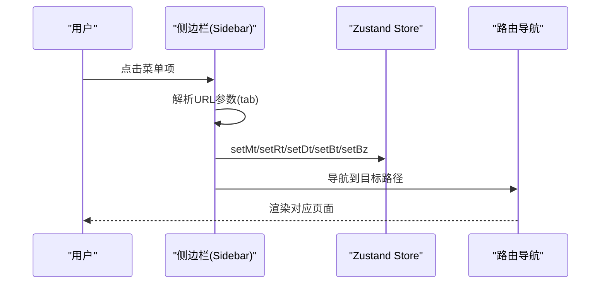
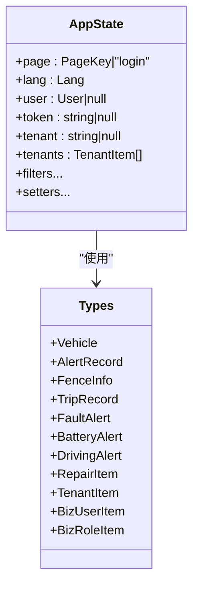
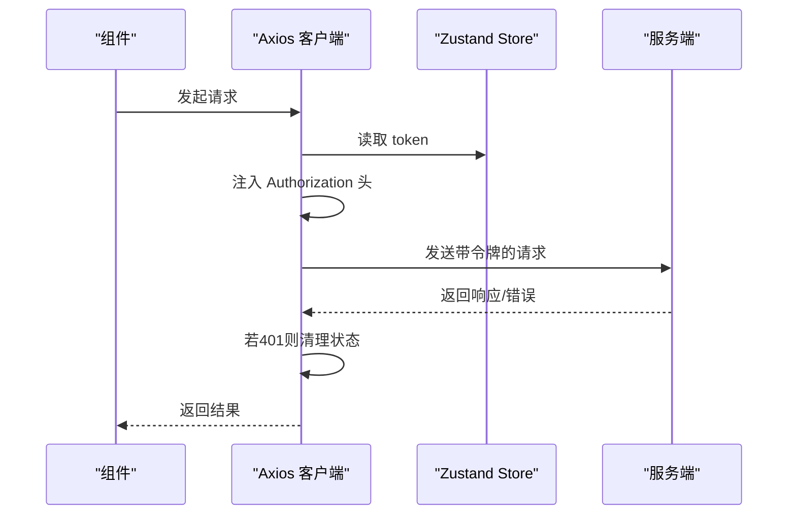
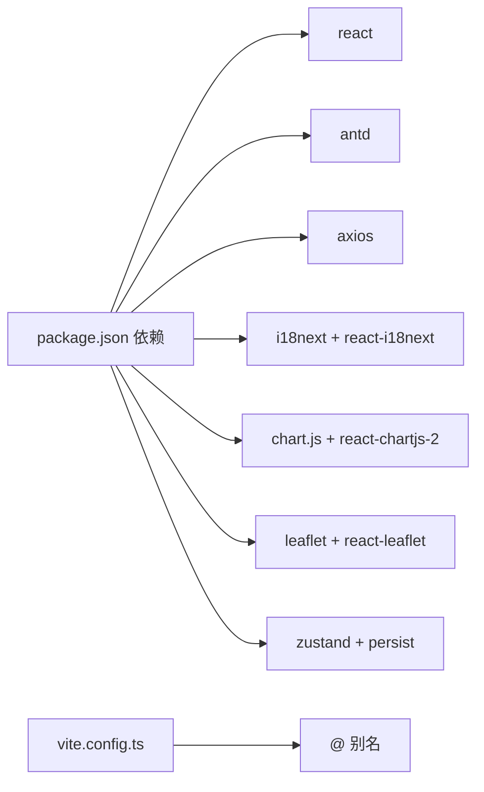

# 系统管理系统

<cite>
**本文引用的文件**
- [package.json](file://weidu-fleet/package.json)
- [vite.config.ts](file://weidu-fleet/vite.config.ts)
- [src/main.tsx](file://weidu-fleet/src/main.tsx)
- [src/App.tsx](file://weidu-fleet/src/App.tsx)
- [src/store/useAppStore.ts](file://weidu-fleet/src/store/useAppStore.ts)
- [src/types/index.ts](file://weidu-fleet/src/types/index.ts)
- [src/components/Layout/AppLayout.tsx](file://weidu-fleet/src/components/Layout/AppLayout.tsx)
- [src/components/Layout/Sidebar.tsx](file://weidu-fleet/src/components/Layout/Sidebar.tsx)
- [src/components/Layout/Topbar.tsx](file://weidu-fleet/src/components/Layout/Topbar.tsx)
- [src/i18n/index.ts](file://weidu-fleet/src/i18n/index.ts)
- [src/utils/format.ts](file://weidu-fleet/src/utils/format.ts)
- [src/api/client.ts](file://weidu-fleet/src/api/client.ts)
- [src/pages/Sys.tsx](file://weidu-fleet/src/pages/Sys.tsx)
- [src/pages/Tenant.tsx](file://weidu-fleet/src/pages/Tenant.tsx)
- [src/pages/Biz.tsx](file://weidu-fleet/src/pages/Biz.tsx)
</cite>

## 目录
1. [简介](#简介)
2. [项目结构](#项目结构)
3. [核心组件](#核心组件)
4. [架构总览](#架构总览)
5. [详细组件分析](#详细组件分析)
6. [依赖关系分析](#依赖关系分析)
7. [性能考虑](#性能考虑)
8. [故障排查指南](#故障排查指南)
9. [结论](#结论)
10. [附录](#附录)

## 简介
本文件为“苇渡-智利车队管理系统”的系统管理子系统提供全面技术文档，覆盖系统设置、用户管理、角色权限、日志管理与监控配置等能力。文档从架构设计、数据模型、组件交互到部署与运维实践进行系统化梳理，帮助开发者与运维人员快速理解与高效维护该系统。

## 项目结构
前端采用 React + TypeScript + Vite 构建，使用 Ant Design 作为 UI 组件库，Zustand 管理全局状态，Axios 进行 API 调用，i18n 实现多语言支持。页面按功能域划分，系统管理相关页面集中在 Sys（系统）、Biz（业务租户）、Tenant（租户）三大模块。

图示来源
- [src/main.tsx:1-49](file://weidu-fleet/src/main.tsx#L1-L49)
- [src/App.tsx:1-88](file://weidu-fleet/src/App.tsx#L1-L88)
- [src/components/Layout/AppLayout.tsx:1-85](file://weidu-fleet/src/components/Layout/AppLayout.tsx#L1-L85)
- [src/components/Layout/Sidebar.tsx:1-272](file://weidu-fleet/src/components/Layout/Sidebar.tsx#L1-L272)
- [src/components/Layout/Topbar.tsx:1-233](file://weidu-fleet/src/components/Layout/Topbar.tsx#L1-L233)
- [src/pages/Sys.tsx:1-349](file://weidu-fleet/src/pages/Sys.tsx#L1-L349)
- [src/pages/Biz.tsx:1-609](file://weidu-fleet/src/pages/Biz.tsx#L1-L609)
- [src/pages/Tenant.tsx:1-288](file://weidu-fleet/src/pages/Tenant.tsx#L1-L288)
- [src/store/useAppStore.ts:1-87](file://weidu-fleet/src/store/useAppStore.ts#L1-L87)
- [src/types/index.ts:1-261](file://weidu-fleet/src/types/index.ts#L1-L261)
- [src/i18n/index.ts:1-30](file://weidu-fleet/src/i18n/index.ts#L1-L30)
- [src/api/client.ts:1-32](file://weidu-fleet/src/api/client.ts#L1-L32)
- [src/utils/format.ts:1-27](file://weidu-fleet/src/utils/format.ts#L1-L27)
- [vite.config.ts:1-16](file://weidu-fleet/vite.config.ts#L1-L16)
- [package.json:1-41](file://weidu-fleet/package.json#L1-L41)

章节来源
- [src/main.tsx:1-49](file://weidu-fleet/src/main.tsx#L1-L49)
- [src/App.tsx:1-88](file://weidu-fleet/src/App.tsx#L1-L88)
- [vite.config.ts:1-16](file://weidu-fleet/vite.config.ts#L1-L16)
- [package.json:1-41](file://weidu-fleet/package.json#L1-L41)

## 核心组件
- 应用入口与主题配置：在入口文件中初始化 Ant Design 国际化、主题、时区与 i18n；挂载路由与应用根组件。
- 路由与懒加载：通过 React Router 配置受保护路由与登录路由，使用 Suspense 提供加载占位。
- 布局容器：左侧固定侧边栏，右侧内容区域，顶部顶栏集成面包屑、语言切换、租户切换与用户操作。
- 全局状态：Zustand Store 管理用户信息、令牌、当前语言、页面状态、筛选条件与各模块默认 Tab。
- 国际化：基于 i18next，支持中/英/西三种语言，本地持久化语言偏好。
- 工具函数：统一时间格式化、时区处理与持续时间格式化。
- API 客户端：Axios 实例封装，自动注入 Bearer Token，统一处理 401 无权限跳转登录。

章节来源
- [src/main.tsx:1-49](file://weidu-fleet/src/main.tsx#L1-L49)
- [src/App.tsx:1-88](file://weidu-fleet/src/App.tsx#L1-L88)
- [src/components/Layout/AppLayout.tsx:1-85](file://weidu-fleet/src/components/Layout/AppLayout.tsx#L1-L85)
- [src/components/Layout/Topbar.tsx:1-233](file://weidu-fleet/src/components/Layout/Topbar.tsx#L1-L233)
- [src/store/useAppStore.ts:1-87](file://weidu-fleet/src/store/useAppStore.ts#L1-L87)
- [src/i18n/index.ts:1-30](file://weidu-fleet/src/i18n/index.ts#L1-L30)
- [src/utils/format.ts:1-27](file://weidu-fleet/src/utils/format.ts#L1-L27)
- [src/api/client.ts:1-32](file://weidu-fleet/src/api/client.ts#L1-L32)

## 架构总览
系统采用“单页应用 + 模块化页面 + 全局状态 + 统一 API 客户端”的前端架构。侧边栏根据当前路径动态展开与选中，顶部栏提供语言、租户与用户操作；系统管理相关页面通过 Tab 切换实现用户与角色管理。

图示来源
- [src/components/Layout/Sidebar.tsx:1-272](file://weidu-fleet/src/components/Layout/Sidebar.tsx#L1-L272)
- [src/components/Layout/Topbar.tsx:1-233](file://weidu-fleet/src/components/Layout/Topbar.tsx#L1-L233)
- [src/components/Layout/AppLayout.tsx:1-85](file://weidu-fleet/src/components/Layout/AppLayout.tsx#L1-L85)
- [src/store/useAppStore.ts:1-87](file://weidu-fleet/src/store/useAppStore.ts#L1-L87)
- [src/pages/Sys.tsx:1-349](file://weidu-fleet/src/pages/Sys.tsx#L1-L349)
- [src/pages/Biz.tsx:1-609](file://weidu-fleet/src/pages/Biz.tsx#L1-L609)
- [src/pages/Tenant.tsx:1-288](file://weidu-fleet/src/pages/Tenant.tsx#L1-L288)
- [src/api/client.ts:1-32](file://weidu-fleet/src/api/client.ts#L1-L32)
- [src/i18n/index.ts:1-30](file://weidu-fleet/src/i18n/index.ts#L1-L30)
- [src/utils/format.ts:1-27](file://weidu-fleet/src/utils/format.ts#L1-L27)

## 详细组件分析

### 系统管理（Sys）组件
- 功能职责：提供系统级用户与角色管理，支持搜索、新增、编辑、删除与权限展示。
- 数据模型：使用 BizUserItem 与角色权限数组描述用户与角色。
- 交互流程：顶部 Tab 在“用户”和“角色”之间切换；用户 Tab 支持关键词过滤与弹窗表单；角色 Tab 展示角色卡片与权限列表。

图示来源
- [src/pages/Sys.tsx:50-349](file://weidu-fleet/src/pages/Sys.tsx#L50-L349)
- [src/store/useAppStore.ts:1-87](file://weidu-fleet/src/store/useAppStore.ts#L1-L87)

章节来源
- [src/pages/Sys.tsx:1-349](file://weidu-fleet/src/pages/Sys.tsx#L1-L349)
- [src/types/index.ts:247-261](file://weidu-fleet/src/types/index.ts#L247-L261)

### 租户管理（Tenant）组件
- 功能职责：租户信息维护、管理员账号创建与密码生成、租户筛选与删除。
- 流程要点：创建租户后自动打开“设置管理员”步骤，生成临时密码并在确认弹窗中展示。

图示来源
- [src/pages/Tenant.tsx:28-288](file://weidu-fleet/src/pages/Tenant.tsx#L28-L288)

章节来源
- [src/pages/Tenant.tsx:1-288](file://weidu-fleet/src/pages/Tenant.tsx#L1-L288)
- [src/types/index.ts:228-239](file://weidu-fleet/src/types/index.ts#L228-L239)

### 业务租户（Biz）组件
- 功能职责：租户权限分配（功能权限勾选）、租户信息展示、资产分配与历史查询、用户与角色管理。
- 权限模型：以树形结构展示租户层级，支持对功能模块进行勾选授权；角色卡片展示具体权限集合。

图示来源
- [src/pages/Biz.tsx:117-609](file://weidu-fleet/src/pages/Biz.tsx#L117-L609)
- [src/types/index.ts:240-261](file://weidu-fleet/src/types/index.ts#L240-L261)

章节来源
- [src/pages/Biz.tsx:1-609](file://weidu-fleet/src/pages/Biz.tsx#L1-L609)
- [src/types/index.ts:179-261](file://weidu-fleet/src/types/index.ts#L179-L261)

### 布局与导航
- 侧边栏：根据当前路径高亮选中项与展开父级分组；点击菜单项时解析 tab 参数并更新 Store 对应状态。
- 顶部栏：面包屑根据路径映射显示标题；支持语言切换、租户切换与用户下拉菜单（改密/登出）。

图示来源
- [src/components/Layout/Sidebar.tsx:150-201](file://weidu-fleet/src/components/Layout/Sidebar.tsx#L150-L201)
- [src/store/useAppStore.ts:22-74](file://weidu-fleet/src/store/useAppStore.ts#L22-L74)

章节来源
- [src/components/Layout/Sidebar.tsx:1-272](file://weidu-fleet/src/components/Layout/Sidebar.tsx#L1-L272)
- [src/components/Layout/Topbar.tsx:1-233](file://weidu-fleet/src/components/Layout/Topbar.tsx#L1-L233)

### 全局状态与数据模型
- 状态键：包括当前页面、语言、用户、令牌、租户、筛选器与各模块默认 Tab。
- 类型定义：涵盖车辆、告警、围栏、行程、电池、维修、租户、用户与角色等实体与枚举。

图示来源
- [src/store/useAppStore.ts:5-87](file://weidu-fleet/src/store/useAppStore.ts#L5-L87)
- [src/types/index.ts:1-261](file://weidu-fleet/src/types/index.ts#L1-L261)

章节来源
- [src/store/useAppStore.ts:1-87](file://weidu-fleet/src/store/useAppStore.ts#L1-L87)
- [src/types/index.ts:1-261](file://weidu-fleet/src/types/index.ts#L1-L261)

### 国际化与本地化
- 初始化逻辑：从本地存储读取语言偏好，若不存在则默认中文；设置回退语言为英文。
- 语言切换：顶部栏循环切换 zh/en/es，同时更新 dayjs 时区与 i18n。

章节来源
- [src/i18n/index.ts:1-30](file://weidu-fleet/src/i18n/index.ts#L1-L30)
- [src/components/Layout/Topbar.tsx:55-62](file://weidu-fleet/src/components/Layout/Topbar.tsx#L55-L62)

### API 客户端与鉴权
- 基础配置：baseURL 指向 /api，超时 10 秒。
- 请求拦截：从 Store 读取 token 并附加 Authorization 头。
- 响应拦截：捕获 401 错误，清空用户状态并跳转登录页。

图示来源
- [src/api/client.ts:4-32](file://weidu-fleet/src/api/client.ts#L4-L32)
- [src/store/useAppStore.ts:62-64](file://weidu-fleet/src/store/useAppStore.ts#L62-L64)

章节来源
- [src/api/client.ts:1-32](file://weidu-fleet/src/api/client.ts#L1-L32)
- [src/store/useAppStore.ts:1-87](file://weidu-fleet/src/store/useAppStore.ts#L1-L87)

## 依赖关系分析
- 构建与运行：Vite 提供开发服务器与打包，别名 @ 指向 src；React 18 与 Ant Design 5 提供 UI 能力。
- 状态管理：Zustand 结合 persist 中间件实现本地持久化，仅持久化用户、令牌、语言与租户等关键字段。
- 国际化：i18next 与 react-i18next 提供多语言支持，dayjs 与时区插件用于时间本地化。
- 图表与地图：Chart.js 与 react-chartjs-2 用于可视化，Leaflet 与 react-leaflet 用于地图展示（配置入口已引入）。

图示来源
- [package.json:11-26](file://weidu-fleet/package.json#L11-L26)
- [vite.config.ts:7-11](file://weidu-fleet/vite.config.ts#L7-L11)

章节来源
- [package.json:1-41](file://weidu-fleet/package.json#L1-L41)
- [vite.config.ts:1-16](file://weidu-fleet/vite.config.ts#L1-L16)

## 性能考虑
- 代码分割与懒加载：路由级懒加载与 Suspense 占位，减少首屏体积与提升首屏速度。
- 状态最小化：Store 仅持久化必要字段，避免冗余数据影响性能。
- 表格与列表：Ant Design Table 默认虚拟滚动适用于大数据集场景；建议在 Sys/Biz/Tenant 的表格中启用分页与列宽自适应。
- 时间处理：统一使用 dayjs 与时区插件，避免重复计算与跨时区误差。
- 构建优化：Vite 默认开启压缩与预构建；生产环境建议开启资源缓存与 CDN 加速。

## 故障排查指南
- 登录态异常
  - 现象：接口返回 401 或页面反复跳转登录。
  - 排查：检查 Store 中 token 是否存在；确认 Axios 拦截器是否正确注入 Authorization 头；查看响应拦截器是否触发清理逻辑。
- 语言切换无效
  - 现象：点击语言按钮后界面未切换。
  - 排查：确认 i18n.changeLanguage 是否被调用；检查 dayjs.locale 是否同步更新。
- 租户切换不生效
  - 现象：切换租户后数据未更新。
  - 排查：确认顶部栏 Select 的 onChange 是否调用 setTenant；检查相关页面是否监听租户变化并重新拉取数据。
- 页面空白或加载卡住
  - 现象：路由切换后出现空白或长时间加载。
  - 排查：检查 Suspense fallback 是否正常；确认懒加载组件是否存在语法错误；检查网络面板是否有失败请求。
- 本地存储损坏
  - 现象：语言/主题/租户等偏好丢失。
  - 排查：清除浏览器 LocalStorage 中 weidu-fleet-storage 后重启应用；确认 persist 配置是否正确。

章节来源
- [src/api/client.ts:17-29](file://weidu-fleet/src/api/client.ts#L17-L29)
- [src/components/Layout/Topbar.tsx:55-62](file://weidu-fleet/src/components/Layout/Topbar.tsx#L55-L62)
- [src/store/useAppStore.ts:76-85](file://weidu-fleet/src/store/useAppStore.ts#L76-L85)

## 结论
该系统管理子系统以清晰的模块划分、完善的全局状态与国际化支持为基础，结合路由懒加载与 API 统一拦截，实现了良好的可维护性与用户体验。通过 Sys/Biz/Tenant 三页协同，覆盖了系统设置、用户与角色管理、租户与资产分配等关键能力。建议在后续迭代中补充真实后端对接、权限细粒度控制与审计日志记录，进一步完善安全与合规能力。

## 附录
- 部署与升级最佳实践
  - 构建：使用 Vite 生产构建，确保静态资源版本化；在 CI/CD 中缓存依赖与构建产物。
  - 部署：将 dist 目录部署至 Nginx/Apache，配置 gzip/br 压缩与缓存头；如需 API，确保代理到后端服务。
  - 升级：先在测试环境验证依赖升级与路由变更；灰度发布逐步放量；保留回滚分支。
- 维护与监控
  - 日志：在 API 客户端与关键页面埋点错误日志；使用浏览器 DevTools 与网络面板定位问题。
  - 性能：定期分析包体积与首屏时间；对大表格启用虚拟滚动与分页；对图片与字体资源启用 CDN。
- 故障恢复与备份
  - 本地数据：Store 使用持久化，建议在关键操作前后做快照；用户可手动清除 LocalStorage。
  - 配置备份：将 vite.config.ts、package.json 与 i18n 资源纳入版本控制；对自定义主题与样式保持可追溯。