# 维修保养系统

<cite>
**本文档引用的文件**
- [Repair.tsx](file://weidu-fleet/src/pages/Repair.tsx)
- [RepairTable.tsx](file://weidu-fleet/src/pages/Vehicles/RepairTable.tsx)
- [index.ts](file://weidu-fleet/src/types/index.ts)
- [mock.ts](file://weidu-fleet/src/api/mock.ts)
- [useAppStore.ts](file://weidu-fleet/src/store/useAppStore.ts)
- [zh.ts](file://weidu-fleet/src/i18n/zh.ts)
- [App.tsx](file://weidu-fleet/src/App.tsx)
- [Vehicles.tsx](file://weidu-fleet/src/pages/Vehicles.tsx)
- [AppLayout.tsx](file://weidu-fleet/src/components/Layout/AppLayout.tsx)
- [package.json](file://weidu-fleet/package.json)
- [vite.config.ts](file://weidu-fleet/vite.config.ts)
</cite>

## 目录
1. [项目概述](#项目概述)
2. [系统架构](#系统架构)
3. [核心组件](#核心组件)
4. [维修工单管理](#维修工单管理)
5. [保养计划管理](#保养计划管理)
6. [维修记录跟踪](#维修记录跟踪)
7. [业务流程与状态管理](#业务流程与状态管理)
8. [权限控制机制](#权限控制机制)
9. [数据分析与统计](#数据分析与统计)
10. [预防性维护建议](#预防性维护建议)
11. [配置与使用指南](#配置与使用指南)
12. [故障排除](#故障排除)
13. [总结](#总结)

## 项目概述

维修保养系统是苇渡-智利车队管理平台的重要组成部分，专注于车队车辆的维修工单管理、保养计划制定和维修记录跟踪。该系统基于React技术栈构建，采用Ant Design组件库，提供了完整的维修管理解决方案。

### 系统特点
- **模块化设计**：采用React Hooks和函数式组件
- **国际化支持**：支持中英文切换
- **响应式布局**：适配不同屏幕尺寸
- **Mock数据驱动**：便于演示和开发测试
- **状态管理**：使用Zustand进行全局状态管理

## 系统架构

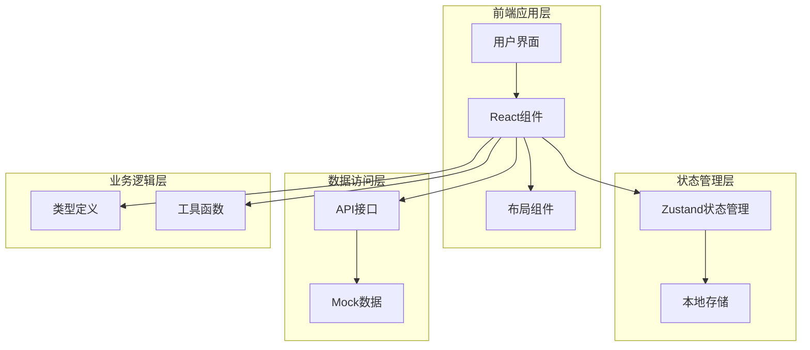

**图表来源**
- [App.tsx:36-85](file://weidu-fleet/src/App.tsx#L36-L85)
- [useAppStore.ts:40-86](file://weidu-fleet/src/store/useAppStore.ts#L40-L86)
- [mock.ts:1-634](file://weidu-fleet/src/api/mock.ts#L1-L634)

### 技术栈
- **前端框架**：React 18.3.1
- **UI库**：Ant Design 5.21.0
- **状态管理**：Zustand 4.5.5
- **国际化**：react-i18next 15.1.0
- **构建工具**：Vite 6.0.1
- **图表库**：Chart.js 4.4.4

**章节来源**
- [package.json:11-26](file://weidu-fleet/package.json#L11-L26)
- [vite.config.ts:1-16](file://weidu-fleet/vite.config.ts#L1-L16)

## 核心组件

### 数据模型设计

系统采用强类型设计，所有数据结构在编译时得到验证：

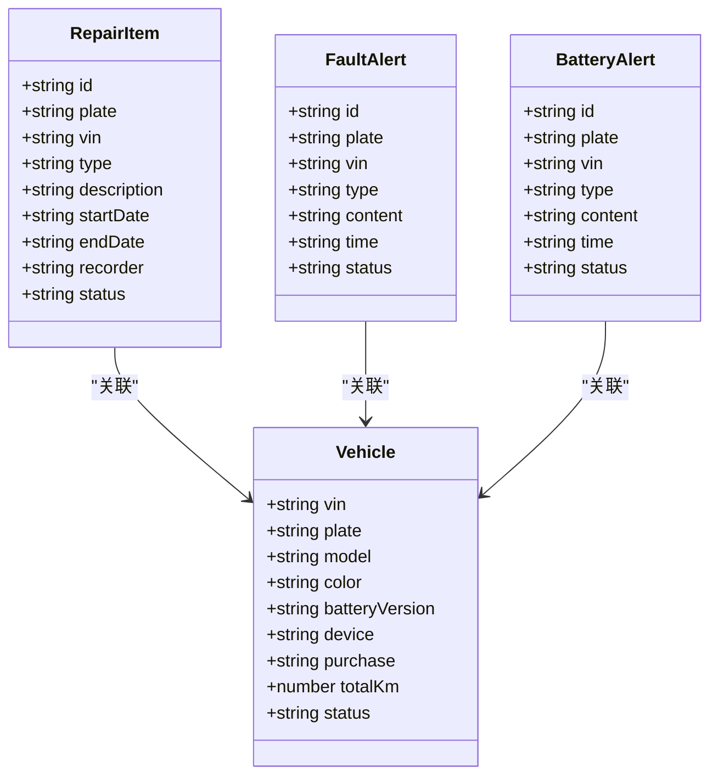

**图表来源**
- [index.ts:216-226](file://weidu-fleet/src/types/index.ts#L216-L226)
- [index.ts:1-19](file://weidu-fleet/src/types/index.ts#L1-L19)

### 状态管理架构

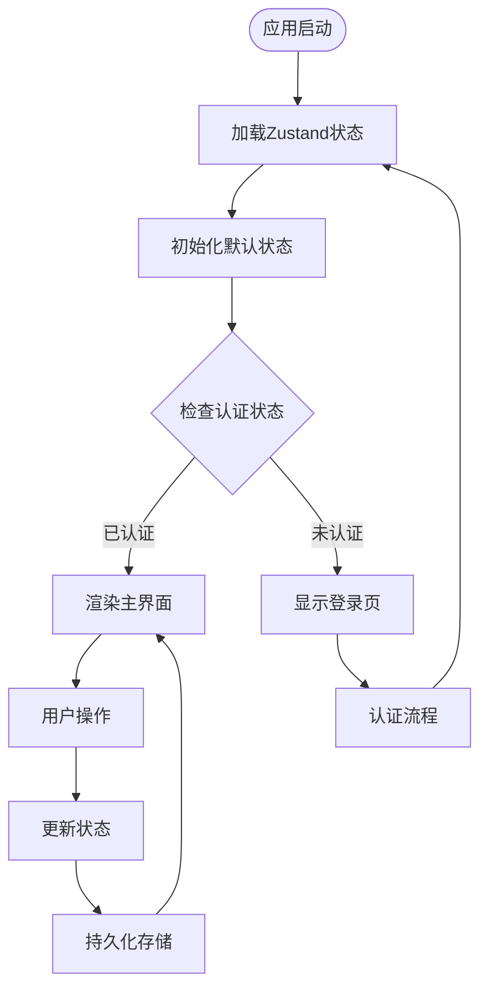

**图表来源**
- [useAppStore.ts:40-86](file://weidu-fleet/src/store/useAppStore.ts#L40-L86)
- [AppLayout.tsx:20-26](file://weidu-fleet/src/components/Layout/AppLayout.tsx#L20-L26)

**章节来源**
- [index.ts:1-261](file://weidu-fleet/src/types/index.ts#L1-L261)
- [useAppStore.ts:1-87](file://weidu-fleet/src/store/useAppStore.ts#L1-L87)

## 维修工单管理

### 工单创建流程

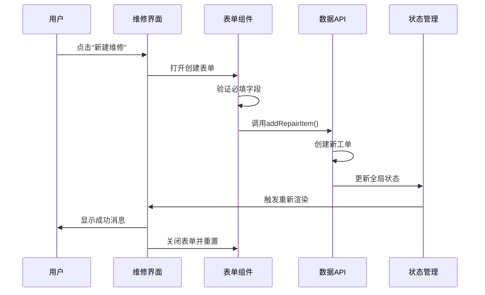

**图表来源**
- [Repair.tsx:63-77](file://weidu-fleet/src/pages/Repair.tsx#L63-L77)
- [mock.ts:598-610](file://weidu-fleet/src/api/mock.ts#L598-L610)

### 工单状态管理

系统支持两种维修状态：
- **进行中 (in_progress)**：维修正在进行中
- **已完成 (done)**：维修任务已完成

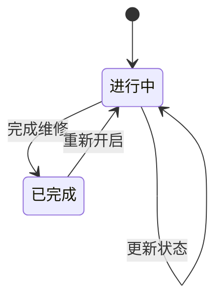

**图表来源**
- [Repair.tsx:79-84](file://weidu-fleet/src/pages/Repair.tsx#L79-L84)
- [index.ts:225-225](file://weidu-fleet/src/types/index.ts#L225-L225)

### 工单类型分类

系统支持两种维修类型：
- **故障类 (fault)**：车辆机械或电子系统故障
- **电池类 (battery)**：电池系统相关问题

**章节来源**
- [Repair.tsx:1-263](file://weidu-fleet/src/pages/Repair.tsx#L1-L263)
- [mock.ts:403-415](file://weidu-fleet/src/api/mock.ts#L403-L415)

## 保养计划管理

### 计划制定策略

系统通过以下方式支持保养计划制定：

1. **基于里程的保养**
   - 根据车辆总里程数触发保养提醒
   - 支持自定义保养间隔（公里数）

2. **基于时间的保养**
   - 基于购买日期或上次保养日期
   - 支持按月/季度/年度保养周期

3. **基于条件的保养**
   - 电池健康度（SOH）指标
   - 充电次数统计
   - 故障频率分析

### 保养提醒机制

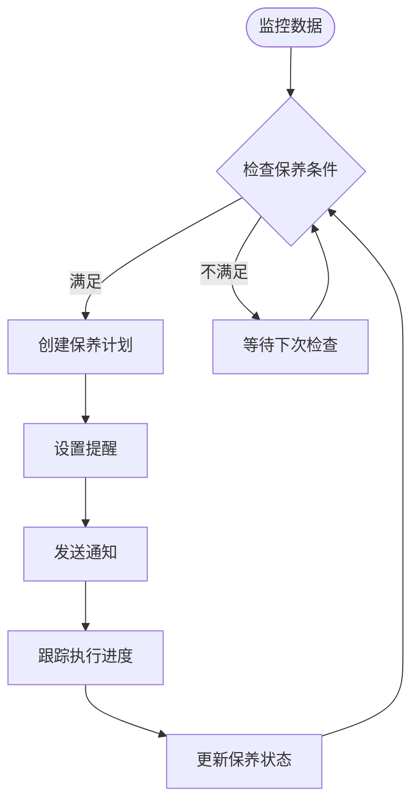

**图表来源**
- [mock.ts:535-594](file://weidu-fleet/src/api/mock.ts#L535-L594)

## 维修记录跟踪

### 车辆维修历史

每个车辆都维护独立的维修历史记录：

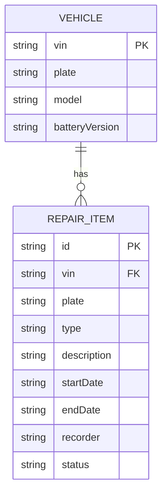

**图表来源**
- [index.ts:216-226](file://weidu-fleet/src/types/index.ts#L216-L226)
- [mock.ts:584-591](file://weidu-fleet/src/api/mock.ts#L584-L591)

### 维修记录展示

维修记录表格包含以下关键字段：
- **维修类型**：故障类/电池类
- **维修描述**：具体问题说明
- **开始时间**：维修任务开始日期
- **结束时间**：维修任务完成日期
- **记录人**：负责维修的人员
- **维修状态**：进行中/已完成

**章节来源**
- [RepairTable.tsx:1-57](file://weidu-fleet/src/pages/Vehicles/RepairTable.tsx#L1-L57)

## 业务流程与状态管理

### 维修工作流程

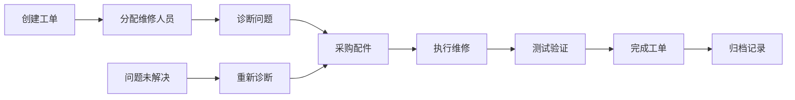

### 状态流转控制

系统严格控制工单状态的合法转换：

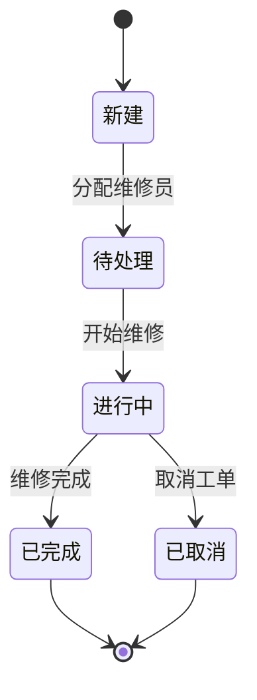

**图表来源**
- [index.ts:225-225](file://weidu-fleet/src/types/index.ts#L225-L225)

**章节来源**
- [mock.ts:612-615](file://weidu-fleet/src/api/mock.ts#L612-L615)

## 权限控制机制

### 角色权限体系

系统采用基于角色的访问控制（RBAC）：

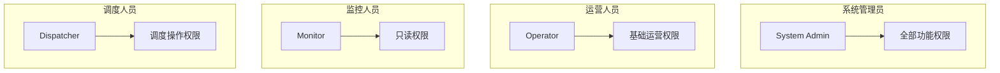

### 功能权限映射

| 权限类别 | 维修管理 | 车辆管理 | 报表查看 |
|---------|---------|---------|---------|
| 系统管理员 | ✅ 全部 | ✅ 全部 | ✅ 全部 |
| 运营人员 | ✅ 维修管理 | ✅ 车辆管理 | ✅ 查看 |
| 监控人员 | ❌ 无 | ✅ 查看 | ✅ 查看 |
| 调度人员 | ✅ 维修管理 | ✅ 车辆管理 | ✅ 查看 |

**章节来源**
- [mock.ts:467-493](file://weidu-fleet/src/api/mock.ts#L467-L493)
- [mock.ts:508-533](file://weidu-fleet/src/api/mock.ts#L508-L533)

## 数据分析与统计

### 维修数据分析

系统提供多维度的维修数据分析：

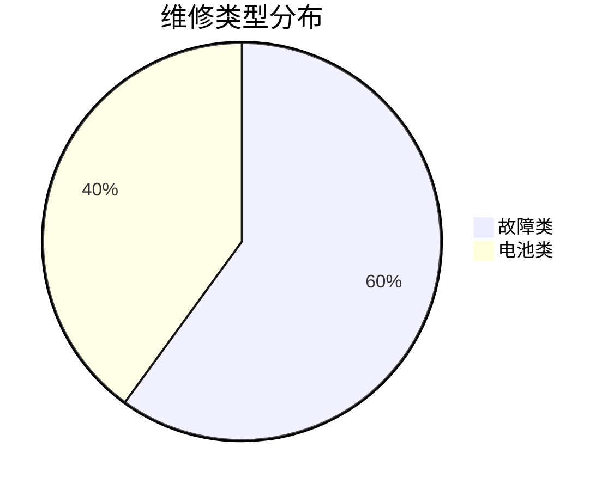

### 成本统计分析

```mermaid
graph TD
subgraph "维修成本构成"
Labor[人工成本] 30%
Parts[配件成本] 50%
Overhead[间接成本] 20%
end
subgraph "成本趋势"
Trend[月度成本趋势]
HighCost[高成本工单]
LowFreq[低频维修]
end
```

### 维修效率指标

- **平均维修时长**：从工单创建到完成的平均时间
- **维修完成率**：已完成工单占总工单的比例
- **首次修复率**：一次性解决的问题比例
- **维修成本效益**：每公里产生的维修成本

**章节来源**
- [mock.ts:35-51](file://weidu-fleet/src/api/mock.ts#L35-L51)

## 预防性维护建议

### 维护策略建议

基于数据分析结果，系统提供以下预防性维护建议：

1. **基于历史数据的预测**
   - 分析相似车辆的维修模式
   - 预测潜在故障风险
   - 提前安排预防性检查

2. **基于条件的维护触发**
   - 电池健康度下降趋势
   - 高频故障模式识别
   - 环境因素影响评估

3. **维护优先级排序**
   - 风险等级评估
   - 经济影响分析
   - 安全重要性考量

### 维护计划优化

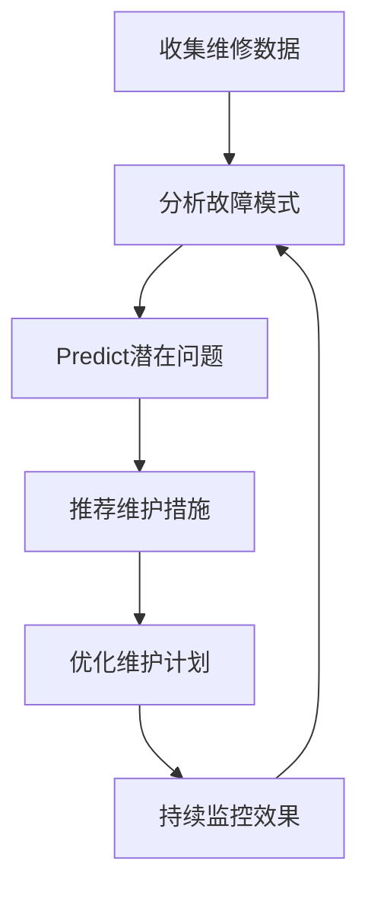

## 配置与使用指南

### 系统配置

#### 国际化配置
系统支持中文和英文双语界面，可通过语言切换按钮进行切换。

#### 数据配置
- **车辆数据**：VIN、车牌号、电池版本等
- **维修数据**：工单类型、描述、状态等
- **用户数据**：角色、权限、个人信息等

### 使用流程

1. **登录系统**：使用管理员账户登录
2. **导航到维修模块**：在侧边栏选择"维修管理"
3. **创建工单**：点击"新建维修"按钮
4. **填写信息**：选择车辆、维修类型、描述等
5. **分配维修**：指派维修人员
6. **跟踪进度**：监控维修状态
7. **完成验收**：确认维修质量

### 维修工单模板

系统提供标准的维修工单模板，包含：
- 车辆信息字段
- 故障描述模板
- 维修步骤指导
- 验收标准说明

**章节来源**
- [zh.ts:217-424](file://weidu-fleet/src/i18n/zh.ts#L217-L424)

## 故障排除

### 常见问题解决

#### 工单状态异常
**问题**：工单状态无法正常更新
**解决**：
1. 检查网络连接状态
2. 刷新页面重新加载数据
3. 清除浏览器缓存
4. 联系系统管理员

#### 数据显示错误
**问题**：维修记录显示不完整
**解决**：
1. 检查数据源连接
2. 验证用户权限
3. 确认筛选条件
4. 重新加载页面

#### 性能问题
**问题**：页面加载缓慢
**解决**：
1. 检查服务器性能
2. 优化数据库查询
3. 减少同时加载的数据量
4. 使用分页功能

### 系统监控

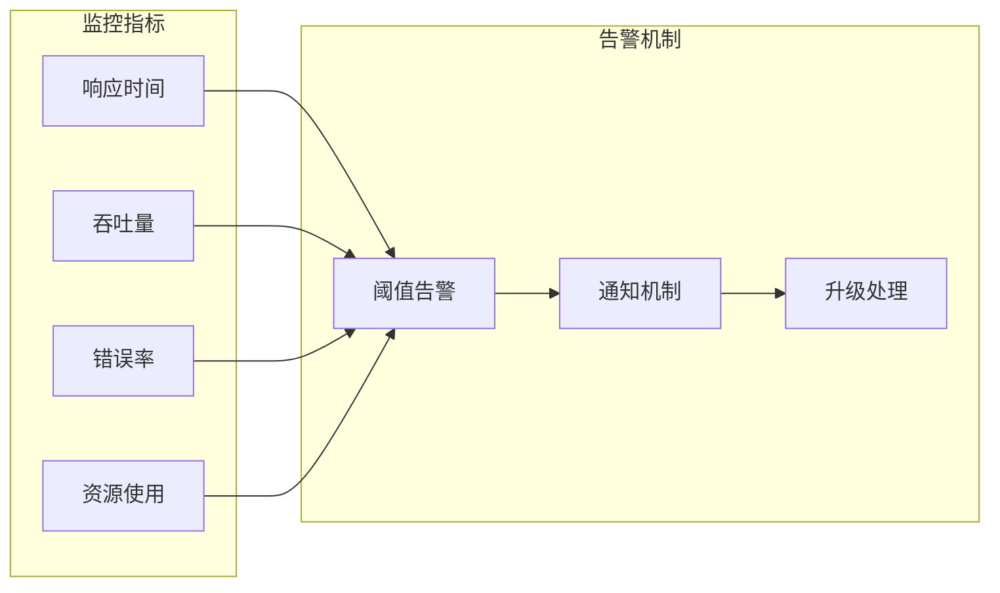

**章节来源**
- [mock.ts:596-634](file://weidu-fleet/src/api/mock.ts#L596-L634)

## 总结

维修保养系统为苇渡-智利车队提供了完整的维修管理解决方案。系统具有以下优势：

### 核心价值
- **完整性**：覆盖维修工单全生命周期管理
- **智能化**：基于数据分析的预防性维护建议
- **可视化**：直观的维修进度和统计图表
- **可扩展**：模块化的架构设计便于功能扩展

### 技术特色
- **现代化技术栈**：React + TypeScript + Ant Design
- **状态管理**：Zustand提供高效的状态管理
- **Mock数据**：便于开发测试和演示
- **国际化支持**：支持多语言界面

### 应用前景
系统可进一步扩展以下功能：
- 集成真实后端API
- 添加移动端支持
- 增强数据分析能力
- 优化用户体验设计

通过持续改进和功能扩展，该系统将成为车队管理的重要工具，提升维修效率和服务质量。