# 车辆列表视图

<cite>
**本文档引用的文件**
- [Vehicles.tsx](file://weidu-fleet/src/pages/Vehicles.tsx)
- [index.ts](file://weidu-fleet/src/types/index.ts)
- [useAppStore.ts](file://weidu-fleet/src/store/useAppStore.ts)
- [mock.ts](file://weidu-fleet/src/api/mock.ts)
- [format.ts](file://weidu-fleet/src/utils/format.ts)
- [index.ts](file://weidu-fleet/src/i18n/index.ts)
- [zh.ts](file://weidu-fleet/src/i18n/zh.ts)
- [en.ts](file://weidu-fleet/src/i18n/en.ts)
</cite>

## 目录
1. [简介](#简介)
2. [项目结构](#项目结构)
3. [核心组件](#核心组件)
4. [架构概览](#架构概览)
5. [详细组件分析](#详细组件分析)
6. [依赖关系分析](#依赖关系分析)
7. [性能考虑](#性能考虑)
8. [故障排除指南](#故障排除指南)
9. [结论](#结论)

## 简介

车辆列表视图是智利车队管理平台的核心功能模块，为用户提供了一个完整的车辆管理界面。该视图实现了多种搜索过滤功能，包括VIN码、车牌号、设备ID、电池版本和车龄范围的综合筛选；提供了响应式的数据表格展示；集成了批量导入导出机制；支持国际化多语言切换；并采用了现代化的状态管理模式。

本系统基于React + TypeScript + Ant Design构建，使用Zustand进行全局状态管理，通过Mock API提供数据服务，实现了从数据获取到UI渲染的完整数据流。

## 项目结构

车辆列表视图位于应用的页面层，采用模块化的设计模式：

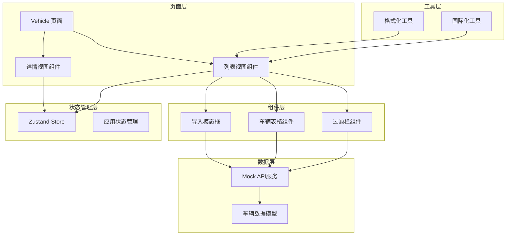

**图表来源**
- [Vehicles.tsx:422-440](file://weidu-fleet/src/pages/Vehicles.tsx#L422-L440)
- [useAppStore.ts:40-87](file://weidu-fleet/src/store/useAppStore.ts#L40-L87)

**章节来源**
- [Vehicles.tsx:1-440](file://weidu-fleet/src/pages/Vehicles.tsx#L1-L440)
- [index.ts:1-261](file://weidu-fleet/src/types/index.ts#L1-L261)

## 核心组件

### 车辆数据模型

系统定义了完整的车辆数据模型，支持丰富的车辆信息展示：

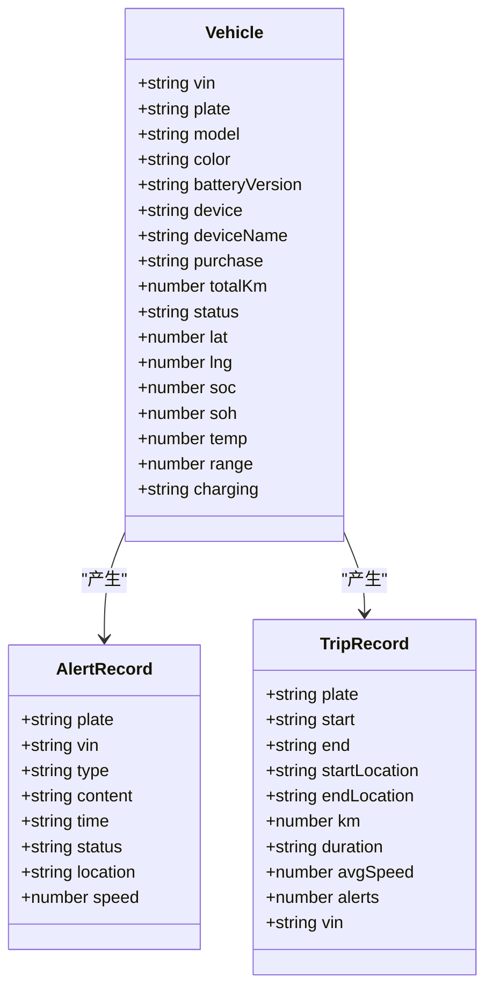

**图表来源**
- [index.ts:1-52](file://weidu-fleet/src/types/index.ts#L1-L52)

### 状态管理架构

系统采用Zustand实现全局状态管理，支持持久化存储：

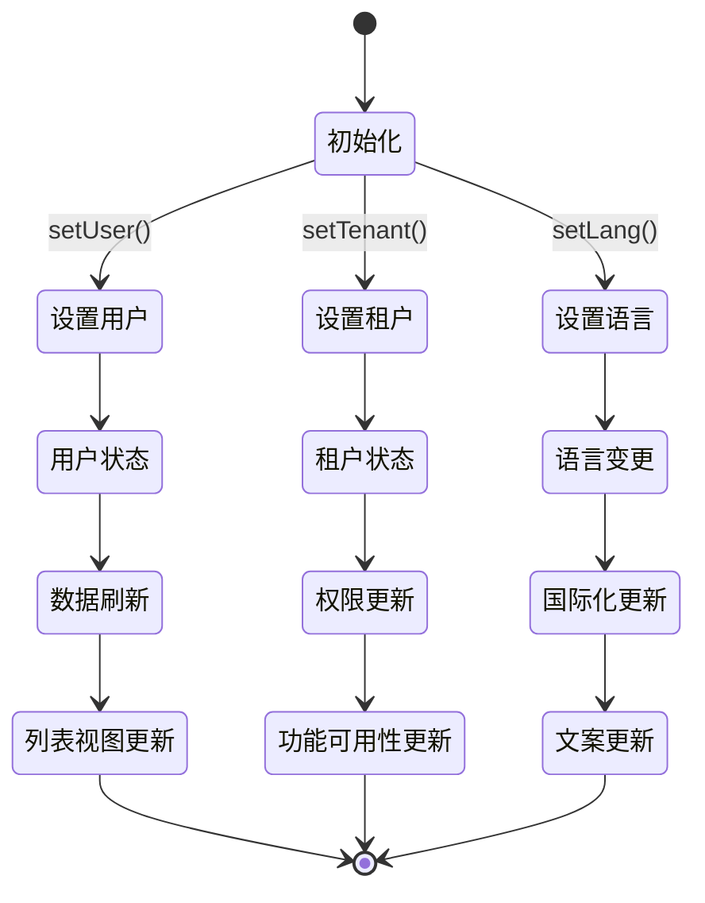

**图表来源**
- [useAppStore.ts:40-87](file://weidu-fleet/src/store/useAppStore.ts#L40-L87)

**章节来源**
- [index.ts:1-261](file://weidu-fleet/src/types/index.ts#L1-L261)
- [useAppStore.ts:1-87](file://weidu-fleet/src/store/useAppStore.ts#L1-L87)

## 架构概览

车辆列表视图采用分层架构设计，确保了良好的可维护性和扩展性：

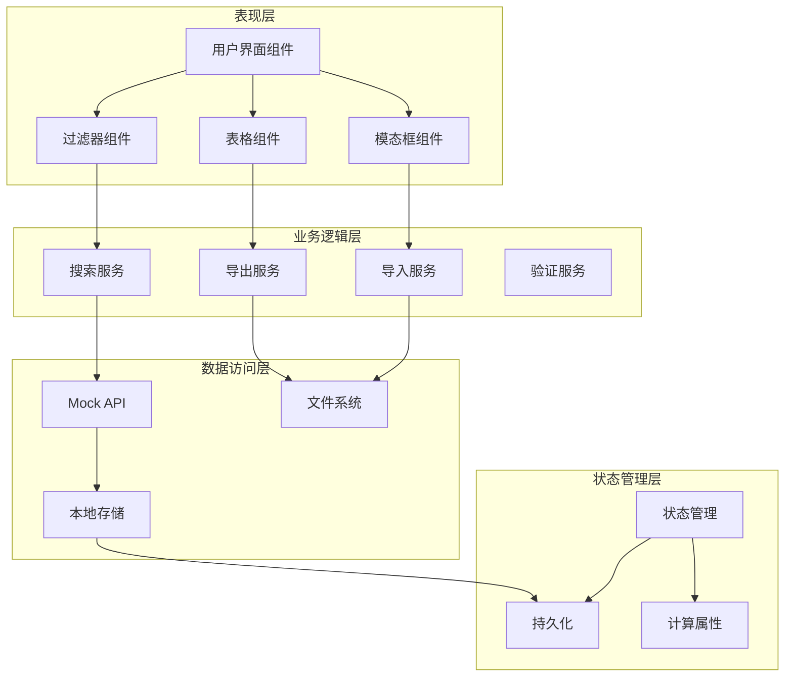

**图表来源**
- [Vehicles.tsx:47-337](file://weidu-fleet/src/pages/Vehicles.tsx#L47-L337)
- [mock.ts:27-29](file://weidu-fleet/src/api/mock.ts#L27-L29)

## 详细组件分析

### 列表视图组件

ListView组件是车辆列表的核心实现，包含了完整的搜索过滤功能：

#### 搜索过滤功能

系统实现了多维度的搜索过滤机制：

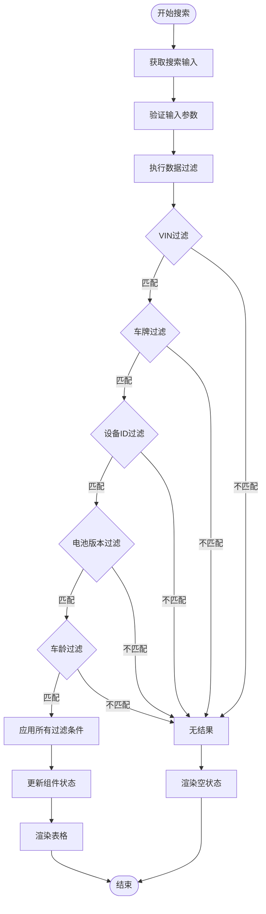

**图表来源**
- [Vehicles.tsx:66-79](file://weidu-fleet/src/pages/Vehicles.tsx#L66-L79)

#### 数据表格展示

表格组件支持响应式布局和丰富的交互功能：

| 功能特性 | 实现方式 | 描述 |
|---------|----------|------|
| 响应式布局 | Ant Design Grid | 使用Row和Col组件实现不同屏幕尺寸的自适应布局 |
| 数据分页 | Table组件 | 内置分页功能，支持每页记录数切换 |
| 列宽自适应 | scroll属性 | 设置scroll={{x: 'max-content'}}实现水平滚动 |
| 行键唯一性 | rowKey="vin" | 使用VIN作为行标识符确保数据唯一性 |
| 交互按钮 | 操作列渲染 | 在最后一列显示查看详情按钮 |

#### 批量导入导出机制

系统提供了完整的数据导入导出功能：

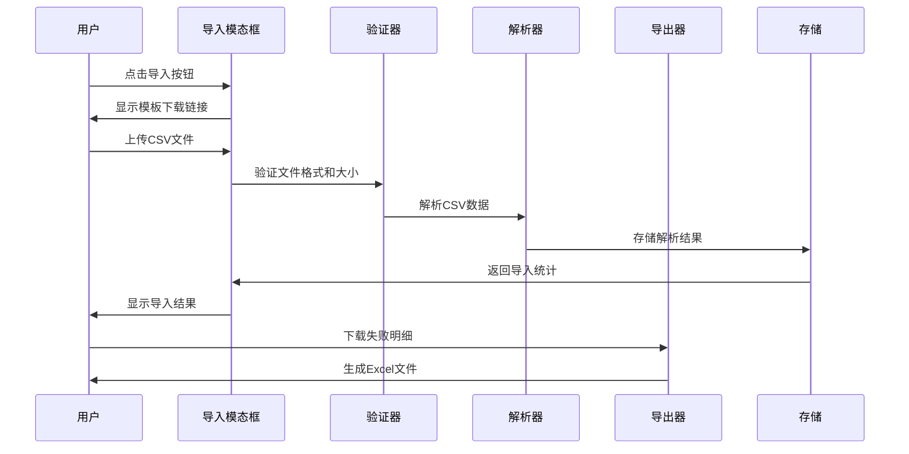

**图表来源**
- [Vehicles.tsx:104-131](file://weidu-fleet/src/pages/Vehicles.tsx#L104-L131)

**章节来源**
- [Vehicles.tsx:47-337](file://weidu-fleet/src/pages/Vehicles.tsx#L47-L337)

### 详情视图组件

DetailView组件提供了车辆的详细信息展示：

#### 仪表板布局

详情视图采用两栏布局设计：

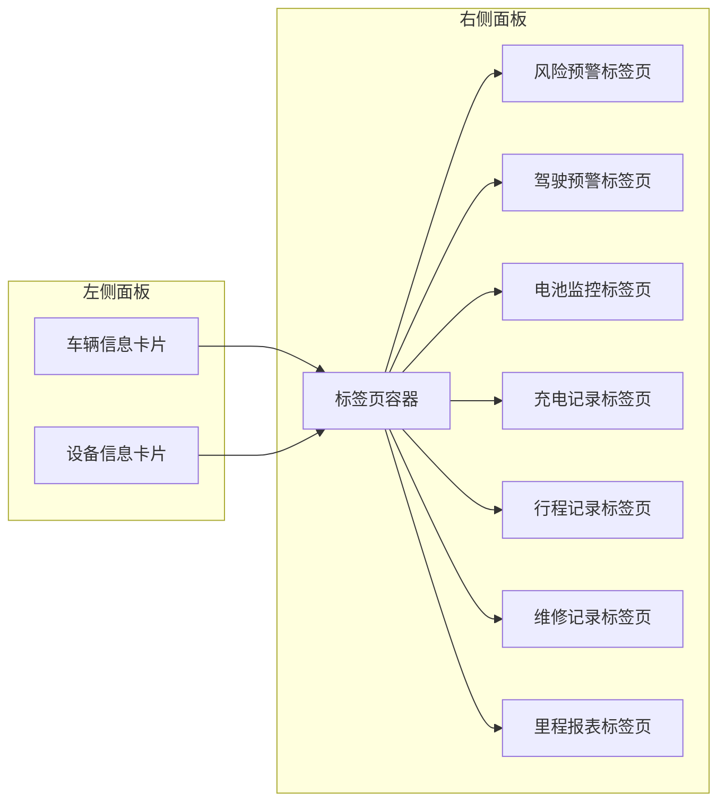

**图表来源**
- [Vehicles.tsx:341-418](file://weidu-fleet/src/pages/Vehicles.tsx#L341-L418)

#### 车龄计算逻辑

系统实现了精确的车龄计算算法：

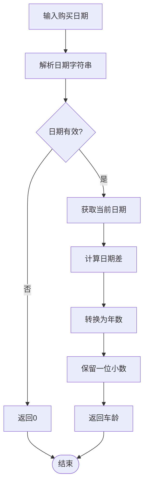

**图表来源**
- [format.ts:18-23](file://weidu-fleet/src/utils/format.ts#L18-L23)

**章节来源**
- [Vehicles.tsx:341-418](file://weidu-fleet/src/pages/Vehicles.tsx#L341-L418)
- [format.ts:18-23](file://weidu-fleet/src/utils/format.ts#L18-L23)

### 国际化支持

系统支持中文、英文、西班牙文三种语言：

#### 多语言资源管理

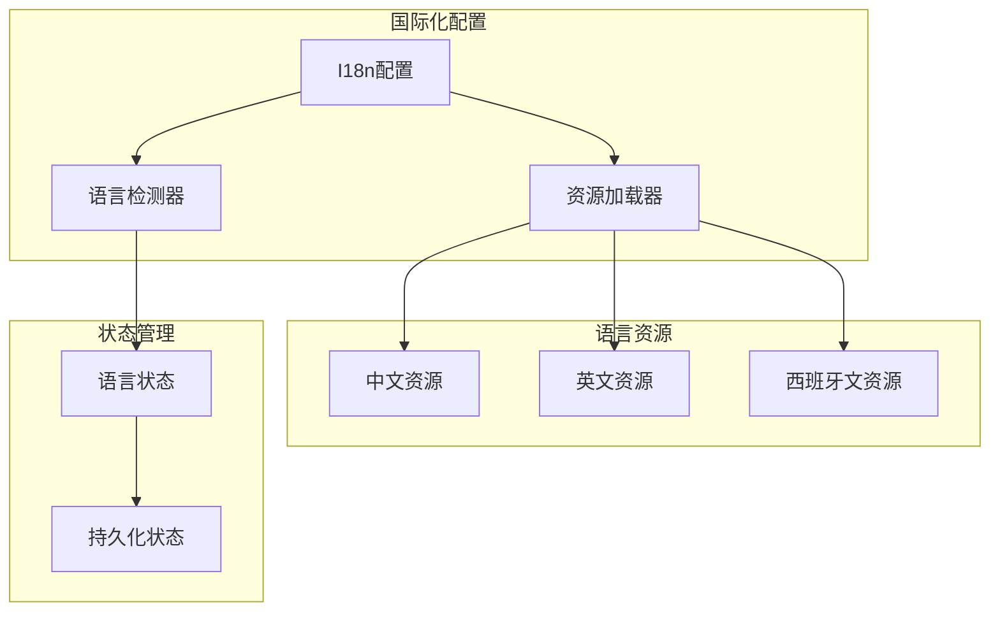

**图表来源**
- [index.ts:1-30](file://weidu-fleet/src/i18n/index.ts#L1-L30)

#### 语言切换机制

系统实现了智能的语言检测和切换功能：

**章节来源**
- [index.ts:1-30](file://weidu-fleet/src/i18n/index.ts#L1-L30)
- [zh.ts:1-424](file://weidu-fleet/src/i18n/zh.ts#L1-L424)
- [en.ts:1-422](file://weidu-fleet/src/i18n/en.ts#L1-L422)

## 依赖关系分析

### 核心依赖关系

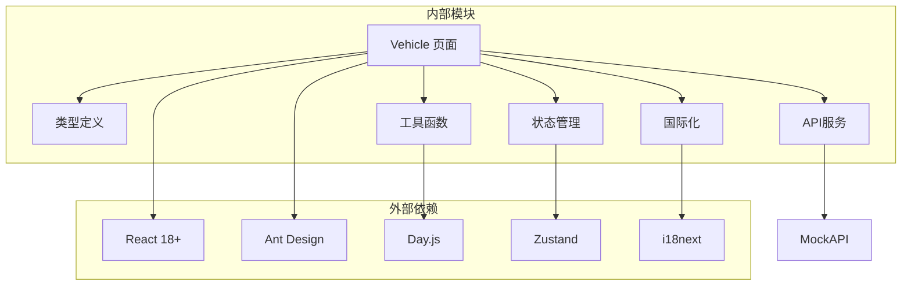

**图表来源**
- [Vehicles.tsx:1-440](file://weidu-fleet/src/pages/Vehicles.tsx#L1-L440)
- [useAppStore.ts:1-87](file://weidu-fleet/src/store/useAppStore.ts#L1-L87)

### 数据流依赖

系统采用单向数据流设计，确保了数据的一致性和可预测性：

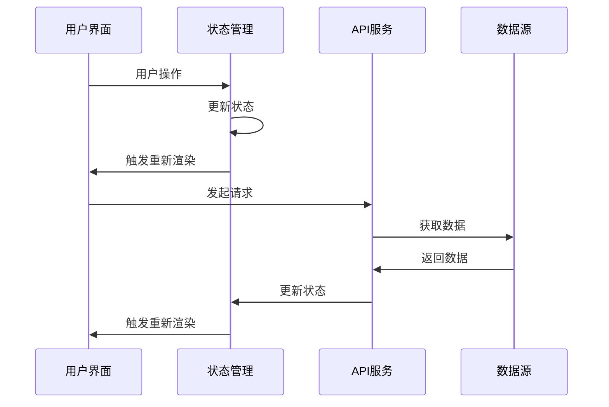

**图表来源**
- [Vehicles.tsx:64-79](file://weidu-fleet/src/pages/Vehicles.tsx#L64-L79)
- [mock.ts:27-29](file://weidu-fleet/src/api/mock.ts#L27-L29)

**章节来源**
- [Vehicles.tsx:1-440](file://weidu-fleet/src/pages/Vehicles.tsx#L1-L440)
- [useAppStore.ts:1-87](file://weidu-fleet/src/store/useAppStore.ts#L1-L87)

## 性能考虑

### 性能优化策略

系统采用了多种性能优化技术：

1. **虚拟化渲染**: 对于大量数据的表格，可以考虑实现虚拟化渲染以提升性能
2. **防抖处理**: 搜索功能实现了防抖机制，避免频繁的API调用
3. **状态缓存**: 使用useMemo和useCallback优化组件渲染性能
4. **懒加载**: 图表和复杂组件采用懒加载策略
5. **内存管理**: 合理的清理机制避免内存泄漏

### 内存管理

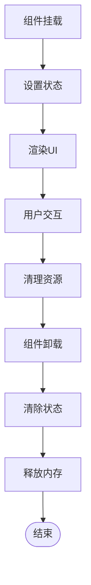

## 故障排除指南

### 常见问题及解决方案

| 问题类型 | 症状描述 | 可能原因 | 解决方案 |
|---------|----------|----------|----------|
| 搜索无结果 | 输入条件后无数据显示 | 过滤条件过于严格 | 调整过滤条件或重置搜索 |
| 表格显示异常 | 表格列错位或显示不全 | 屏幕分辨率或列宽问题 | 调整浏览器窗口或使用横向滚动 |
| 导入失败 | CSV文件上传后提示格式错误 | 文件格式或编码问题 | 检查文件格式是否为CSV，编码是否为UTF-8 |
| 语言切换失效 | 切换语言后部分文案未更新 | 缓存或状态同步问题 | 刷新页面或检查i18n配置 |
| 性能问题 | 页面加载缓慢或卡顿 | 数据量过大或渲染优化不足 | 优化数据查询或实现分页加载 |

### 调试技巧

1. **开发者工具**: 使用浏览器开发者工具检查网络请求和状态变化
2. **日志输出**: 在关键节点添加console.log进行调试
3. **状态检查**: 通过React DevTools检查组件状态
4. **性能分析**: 使用Performance面板分析渲染性能

**章节来源**
- [Vehicles.tsx:104-131](file://weidu-fleet/src/pages/Vehicles.tsx#L104-L131)
- [format.ts:18-23](file://weidu-fleet/src/utils/format.ts#L18-L23)

## 结论

车辆列表视图是一个功能完整、架构清晰的现代化React应用组件。它成功地整合了搜索过滤、数据展示、批量导入导出、国际化支持和响应式设计等多种功能特性。

系统的主要优势包括：

1. **模块化设计**: 清晰的组件分离和职责划分
2. **状态管理**: 基于Zustand的轻量级状态管理方案
3. **国际化支持**: 完善的多语言切换机制
4. **性能优化**: 合理的渲染优化和数据处理策略
5. **用户体验**: 直观的界面设计和流畅的交互体验

该组件为智利车队管理平台提供了坚实的基础，支持未来的功能扩展和技术演进。