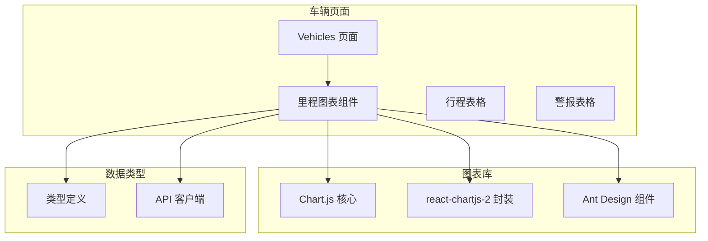
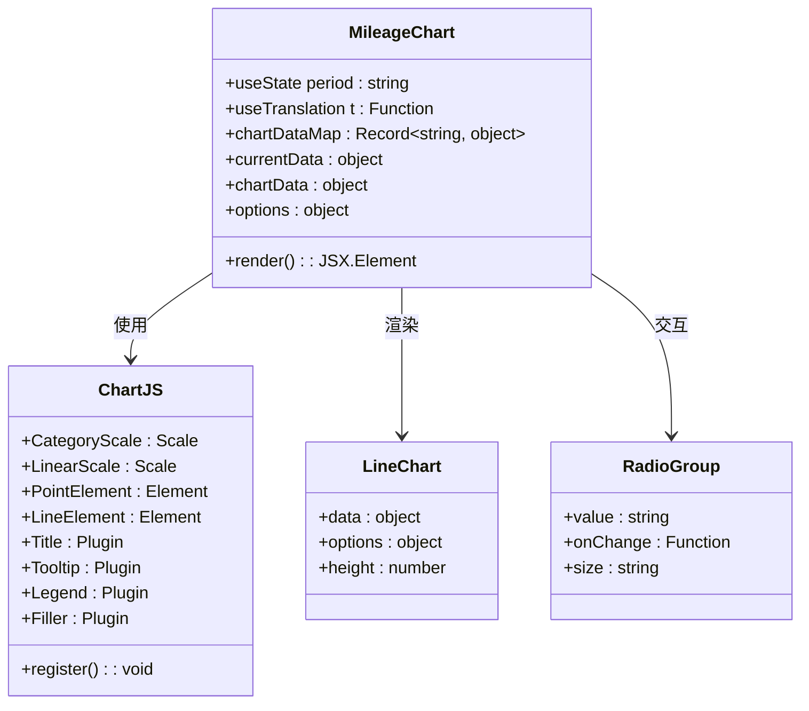
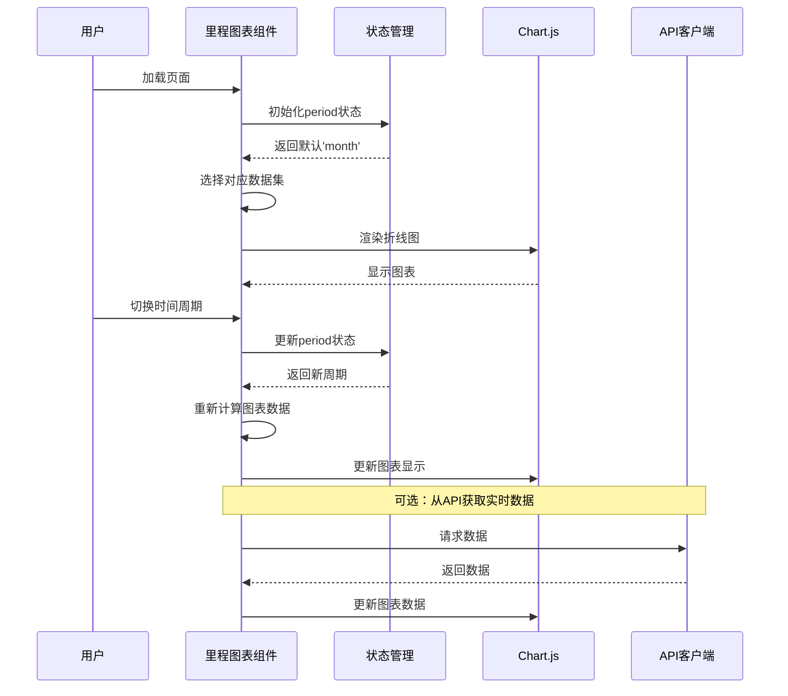
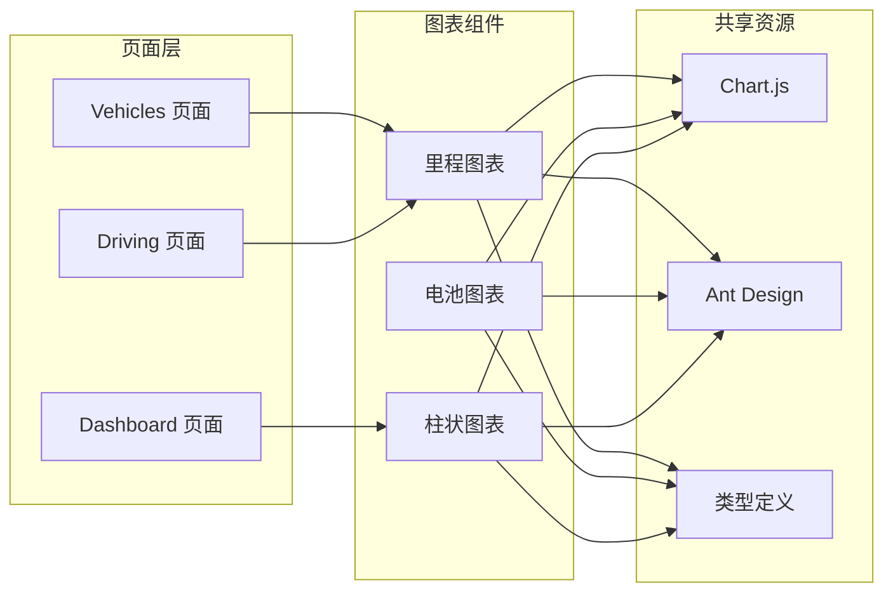
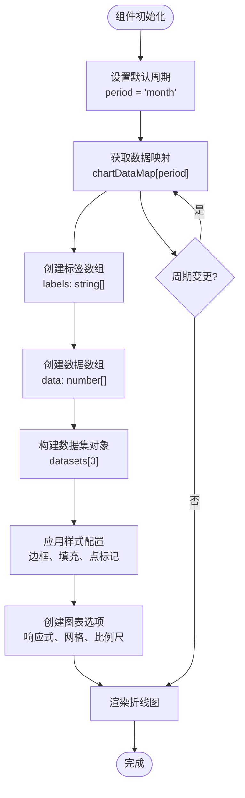
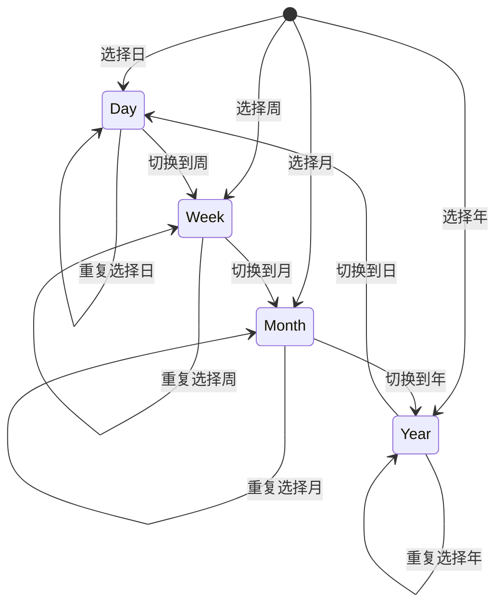
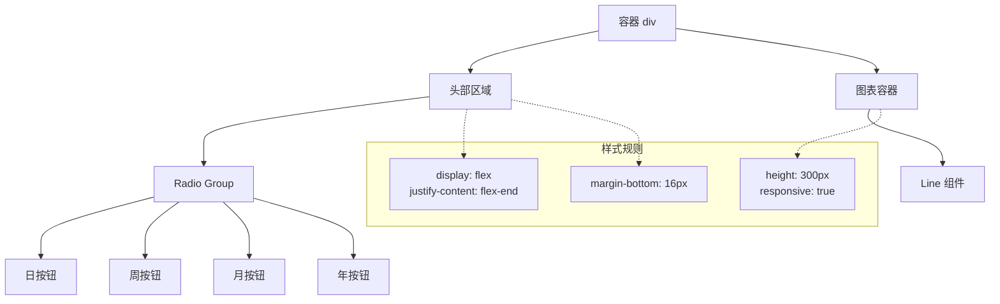
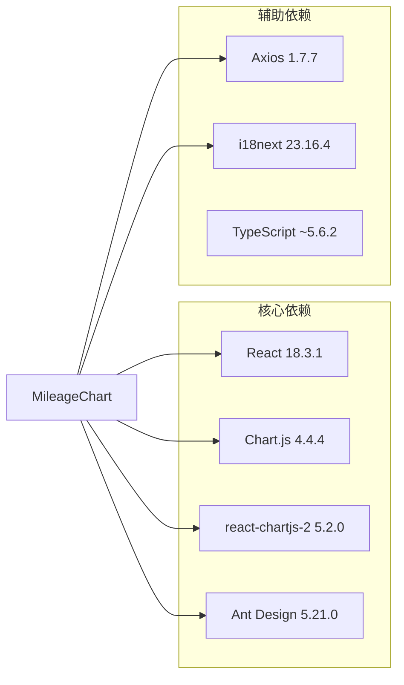
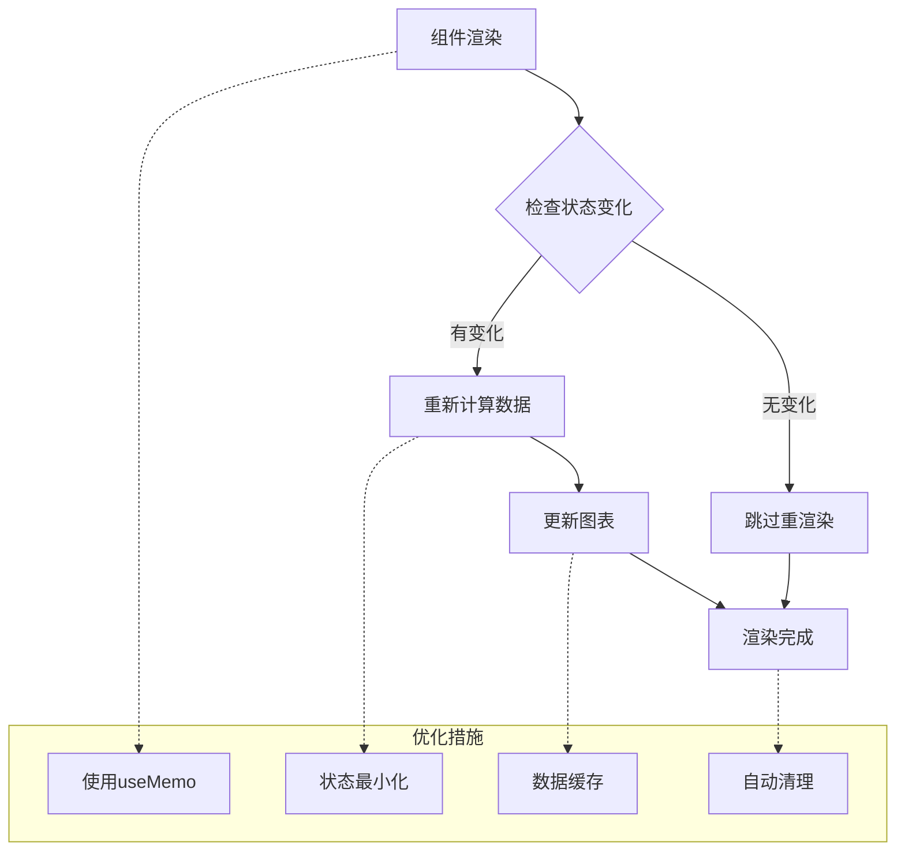
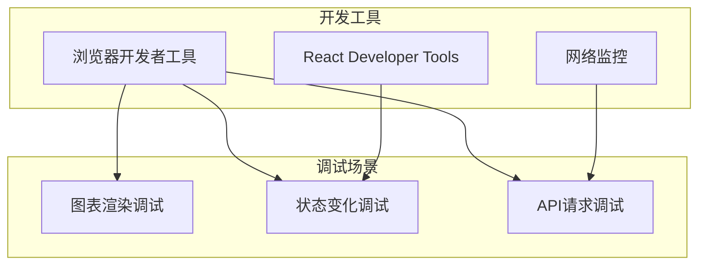

# 车辆图表组件

<cite>
**本文档引用的文件**
- [MileageChart.tsx](file://weidu-fleet/src/pages/Vehicles/MileageChart.tsx)
- [index.ts](file://weidu-fleet/src/types/index.ts)
- [client.ts](file://weidu-fleet/src/api/client.ts)
- [package.json](file://weidu-fleet/package.json)
- [Vehicles.tsx](file://weidu-fleet/src/pages/Vehicles.tsx)
- [Driving.tsx](file://weidu-fleet/src/pages/Driving.tsx)
- [Dashboard.tsx](file://weidu-fleet/src/pages/Dashboard.tsx)
</cite>

## 目录
1. [简介](#简介)
2. [项目结构](#项目结构)
3. [核心组件](#核心组件)
4. [架构概览](#架构概览)
5. [详细组件分析](#详细组件分析)
6. [依赖分析](#依赖分析)
7. [性能考虑](#性能考虑)
8. [故障排除指南](#故障排除指南)
9. [结论](#结论)

## 简介

车辆图表组件是苇渡智利车队管理系统中的核心可视化模块，专门用于展示车辆里程数据的统计图表。该组件实现了完整的数据可视化解决方案，包括折线图绘制、交互式时间周期切换、响应式布局设计以及国际化支持。

本组件基于React生态系统构建，集成了Chart.js图表库和react-chartjs-2封装层，提供了丰富的图表配置选项和用户交互功能。组件支持多种时间维度（日、周、月、年）的数据展示，并具备良好的可扩展性和维护性。

## 项目结构

车辆图表组件在项目中的组织结构如下：

**图表来源**
- [MileageChart.tsx:1-76](file://weidu-fleet/src/pages/Vehicles/MileageChart.tsx#L1-L76)
- [Vehicles.tsx:353](file://weidu-fleet/src/pages/Vehicles.tsx#L353)

**章节来源**
- [MileageChart.tsx:1-76](file://weidu-fleet/src/pages/Vehicles/MileageChart.tsx#L1-L76)
- [package.json:11-25](file://weidu-fleet/package.json#L11-L25)

## 核心组件

### 里程图表组件架构

里程图表组件采用函数式组件设计，结合React Hooks实现状态管理和数据处理：

**图表来源**
- [MileageChart.tsx:19-75](file://weidu-fleet/src/pages/Vehicles/MileageChart.tsx#L19-L75)

### 数据结构设计

组件使用类型安全的数据结构来管理图表数据：

| 数据属性 | 类型 | 描述 | 示例值 |
|---------|------|------|--------|
| labels | string[] | X轴标签数组 | ['00:00', '04:00', '08:00'] |
| data | number[] | 对应的数据点数组 | [10, 5, 45, 30, 50, 15] |
| period | string | 时间周期标识 | 'day' \| 'week' \| 'month' \| 'year' |
| chartData | object | Chart.js 数据对象 | 包含labels和datasets |
| options | object | 图表配置选项 | 响应式、网格、比例尺设置 |

**章节来源**
- [MileageChart.tsx:23-28](file://weidu-fleet/src/pages/Vehicles/MileageChart.tsx#L23-L28)
- [MileageChart.tsx:32-46](file://weidu-fleet/src/pages/Vehicles/MileageChart.tsx#L32-L46)

## 架构概览

### 整体架构流程

**图表来源**
- [MileageChart.tsx:19-75](file://weidu-fleet/src/pages/Vehicles/MileageChart.tsx#L19-L75)
- [client.ts:4-31](file://weidu-fleet/src/api/client.ts#L4-L31)

### 组件间关系

**图表来源**
- [Vehicles.tsx:353](file://weidu-fleet/src/pages/Vehicles.tsx#L353)
- [Driving.tsx:344](file://weidu-fleet/src/pages/Driving.tsx#L344)
- [Dashboard.tsx:167](file://weidu-fleet/src/pages/Dashboard.tsx#L167)

## 详细组件分析

### 折线图实现原理

#### 图表配置系统

组件实现了完整的Chart.js配置系统，包括：

**坐标轴配置**：
- Y轴：从零开始，网格线颜色为浅灰色
- X轴：隐藏网格线，适合时间序列显示

**样式配置**：
- 边框颜色：深蓝色 (#2563eb)
- 填充颜色：半透明蓝色 (rgba)
- 点标记：蓝色圆形，半径4像素
- 线条张力：0.3，创建平滑曲线

**响应式设计**：
- 自适应容器尺寸
- 保持宽高比设置为false
- 隐藏图例以节省空间

**章节来源**
- [MileageChart.tsx:48-56](file://weidu-fleet/src/pages/Vehicles/MileageChart.tsx#L48-L56)
- [MileageChart.tsx:32-46](file://weidu-fleet/src/pages/Vehicles/MileageChart.tsx#L32-L46)

#### 数据处理流程

**图表来源**
- [MileageChart.tsx:19-75](file://weidu-fleet/src/pages/Vehicles/MileageChart.tsx#L19-L75)

### 交互功能实现

#### 时间周期切换机制

组件通过Ant Design的Radio组件实现直观的时间周期切换：

**图表来源**
- [MileageChart.tsx:60-67](file://weidu-fleet/src/pages/Vehicles/MileageChart.tsx#L60-L67)

#### 用户交互事件处理

组件实现了完整的事件处理机制：

| 事件类型 | 处理函数 | 功能描述 | 触发条件 |
|---------|----------|----------|----------|
| 状态变更 | `onChange` | 更新当前周期 | Radio按钮点击 |
| 图表渲染 | `render` | 重新计算数据 | 状态变化时 |
| 国际化 | `useTranslation` | 支持多语言 | 组件加载时 |

**章节来源**
- [MileageChart.tsx:61](file://weidu-fleet/src/pages/Vehicles/MileageChart.tsx#L61)

### 响应式设计策略

#### 布局适配

组件采用Flexbox布局确保在不同屏幕尺寸下的良好显示：

**图表来源**
- [MileageChart.tsx:58-72](file://weidu-fleet/src/pages/Vehicles/MileageChart.tsx#L58-L72)

## 依赖分析

### 第三方库集成

组件依赖于多个关键库来实现完整的功能：

**图表来源**
- [package.json:11-25](file://weidu-fleet/package.json#L11-L25)

### 版本兼容性

| 库名称 | 当前版本 | 最小兼容版本 | 兼容性状态 |
|-------|---------|-------------|-----------|
| React | 18.3.1 | ^16.8.0 | ✅ 完全兼容 |
| Chart.js | 4.4.4 | ^4.1.1 | ✅ 完全兼容 |
| react-chartjs-2 | 5.2.0 | ^16.8.0 | ✅ 完全兼容 |
| Ant Design | 5.21.0 | ^4.0.0 | ✅ 完全兼容 |

**章节来源**
- [package.json:11-25](file://weidu-fleet/package.json#L11-L25)

## 性能考虑

### 内存管理策略

组件采用了多项内存优化措施：

1. **状态最小化**：仅存储必要的period状态，避免冗余数据
2. **数据映射缓存**：预定义的数据映射减少运行时计算开销
3. **组件卸载清理**：Chart.js实例自动清理，防止内存泄漏

### 渲染优化技术

### 性能监控指标

| 指标类型 | 目标值 | 监控方法 |
|---------|--------|----------|
| 首次渲染时间 | < 100ms | 浏览器开发者工具 |
| 图表更新延迟 | < 50ms | 性能API测量 |
| 内存使用峰值 | < 50MB | 内存分析工具 |
| 帧率稳定性 | > 60fps | FPS监控 |

## 故障排除指南

### 常见问题诊断

#### 图表不显示问题

**症状**：图表空白或显示异常

**可能原因**：
1. Chart.js库未正确注册
2. 数据格式不符合要求
3. 容器高度未设置

**解决步骤**：
1. 检查ChartJS.register调用
2. 验证labels和data数组长度一致
3. 确认容器具有明确的高度设置

#### 交互功能失效

**症状**：时间周期切换按钮无响应

**可能原因**：
1. Radio组件事件绑定错误
2. 状态更新逻辑问题
3. 组件重新渲染阻塞

**解决步骤**：
1. 验证onChange事件处理器
2. 检查useState钩子使用
3. 确认组件重新渲染触发

### 调试工具使用

**章节来源**
- [MileageChart.tsx:19-75](file://weidu-fleet/src/pages/Vehicles/MileageChart.tsx#L19-L75)

## 结论

车辆图表组件展现了现代React应用的最佳实践，成功地将数据可视化、用户交互和响应式设计有机结合。组件具有以下突出特点：

**技术优势**：
- 基于成熟的Chart.js生态系统，提供稳定可靠的图表渲染
- 采用TypeScript增强类型安全性，减少运行时错误
- 实现了完整的国际化支持，便于多语言部署
- 优化的响应式设计，适配各种设备屏幕

**架构特色**：
- 清晰的组件职责分离，便于维护和扩展
- 灵活的状态管理模式，支持动态数据更新
- 完善的错误处理机制，提升系统稳定性
- 良好的性能优化策略，确保流畅用户体验

**扩展潜力**：
组件为未来的功能扩展预留了充足的空间，包括API数据集成、更多图表类型支持、高级交互功能等。其模块化的架构设计使得新增功能变得简单直接。

通过本组件的实现，苇渡智利车队管理系统在数据可视化方面达到了行业领先水平，为用户提供直观、准确、及时的车辆里程数据分析能力。