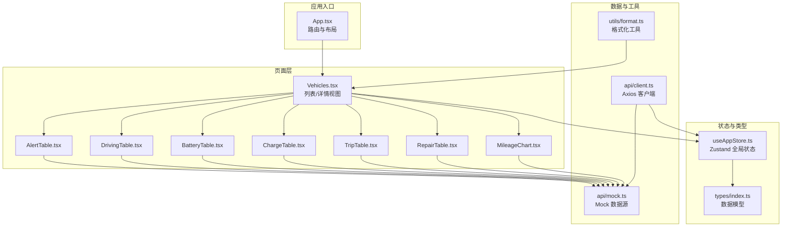
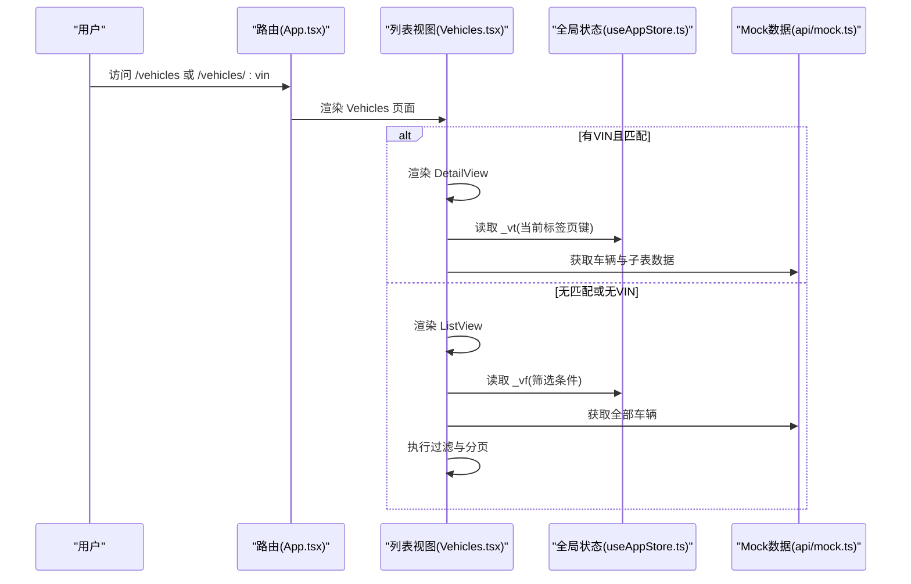
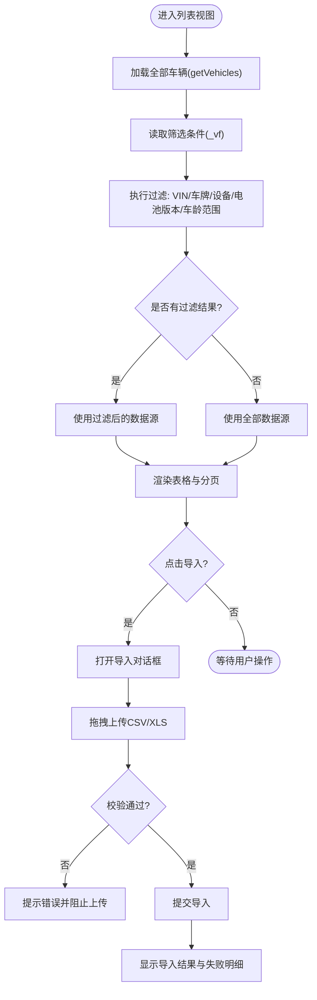
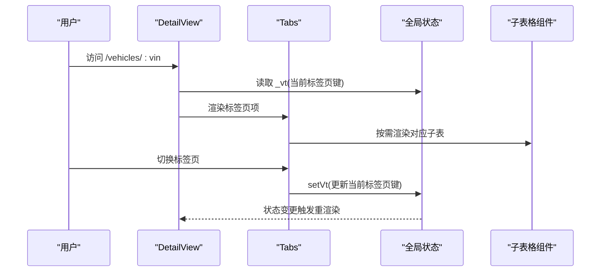
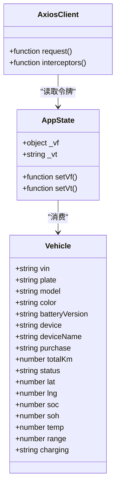
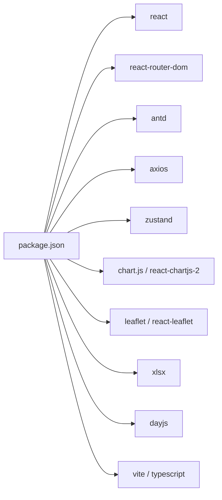

# 车辆管理系统

<cite>
**本文引用的文件**
- [Vehicles.tsx](file://weidu-fleet/src/pages/Vehicles.tsx)
- [AlertTable.tsx](file://weidu-fleet/src/pages/Vehicles/AlertTable.tsx)
- [DrivingTable.tsx](file://weidu-fleet/src/pages/Vehicles/DrivingTable.tsx)
- [BatteryTable.tsx](file://weidu-fleet/src/pages/Vehicles/BatteryTable.tsx)
- [ChargeTable.tsx](file://weidu-fleet/src/pages/Vehicles/ChargeTable.tsx)
- [TripTable.tsx](file://weidu-fleet/src/pages/Vehicles/TripTable.tsx)
- [RepairTable.tsx](file://weidu-fleet/src/pages/Vehicles/RepairTable.tsx)
- [MileageChart.tsx](file://weidu-fleet/src/pages/Vehicles/MileageChart.tsx)
- [index.ts](file://weidu-fleet/src/types/index.ts)
- [useAppStore.ts](file://weidu-fleet/src/store/useAppStore.ts)
- [client.ts](file://weidu-fleet/src/api/client.ts)
- [mock.ts](file://weidu-fleet/src/api/mock.ts)
- [format.ts](file://weidu-fleet/src/utils/format.ts)
- [App.tsx](file://weidu-fleet/src/App.tsx)
- [package.json](file://weidu-fleet/package.json)
- [vite.config.ts](file://weidu-fleet/vite.config.ts)
</cite>

## 目录
1. [简介](#简介)
2. [项目结构](#项目结构)
3. [核心组件](#核心组件)
4. [架构总览](#架构总览)
5. [详细组件分析](#详细组件分析)
6. [依赖分析](#依赖分析)
7. [性能考虑](#性能考虑)
8. [故障排查指南](#故障排查指南)
9. [结论](#结论)
10. [附录](#附录)

## 简介
本文件为“苇渡-智利车队管理平台”的车辆管理系统详细技术文档，聚焦于车辆列表视图与详情视图的实现原理，涵盖车辆搜索与过滤、批量导入导出、车辆信息展示与标签页切换逻辑，并深入解析各子表格组件（警报表、电池表、充电表、驾驶表、里程图表、维修表、行程表）的功能特性与数据交互模式。同时提供车辆数据模型定义、状态管理方案与API集成策略，辅以可视化流程与时序图，帮助开发者快速理解与扩展系统。

## 项目结构
该系统采用基于路由的页面组织方式，车辆相关页面集中在 pages/Vehicles 下，配合全局状态管理与Mock API模拟数据，形成完整的前端演示闭环。

**图表来源**
- [App.tsx:1-88](file://weidu-fleet/src/App.tsx#L1-L88)
- [Vehicles.tsx:1-440](file://weidu-fleet/src/pages/Vehicles.tsx#L1-L440)
- [AlertTable.tsx:1-42](file://weidu-fleet/src/pages/Vehicles/AlertTable.tsx#L1-L42)
- [DrivingTable.tsx:1-33](file://weidu-fleet/src/pages/Vehicles/DrivingTable.tsx#L1-L33)
- [BatteryTable.tsx:1-20](file://weidu-fleet/src/pages/Vehicles/BatteryTable.tsx#L1-L20)
- [ChargeTable.tsx:1-27](file://weidu-fleet/src/pages/Vehicles/ChargeTable.tsx#L1-L27)
- [TripTable.tsx:1-30](file://weidu-fleet/src/pages/Vehicles/TripTable.tsx#L1-L30)
- [RepairTable.tsx:1-57](file://weidu-fleet/src/pages/Vehicles/RepairTable.tsx#L1-L57)
- [MileageChart.tsx:1-76](file://weidu-fleet/src/pages/Vehicles/MileageChart.tsx#L1-L76)
- [useAppStore.ts:1-87](file://weidu-fleet/src/store/useAppStore.ts#L1-L87)
- [index.ts:1-261](file://weidu-fleet/src/types/index.ts#L1-L261)
- [mock.ts:1-634](file://weidu-fleet/src/api/mock.ts#L1-L634)
- [client.ts:1-32](file://weidu-fleet/src/api/client.ts#L1-L32)
- [format.ts:1-27](file://weidu-fleet/src/utils/format.ts#L1-L27)

**章节来源**
- [App.tsx:1-88](file://weidu-fleet/src/App.tsx#L1-L88)
- [vite.config.ts:1-16](file://weidu-fleet/vite.config.ts#L1-L16)

## 核心组件
- 车辆列表视图：支持VIN/车牌/设备号/电池版本与车龄范围多条件过滤；提供导入模板下载、CSV/XLS批量导入、失败明细导出；表格列包含基础信息与“查看详情”跳转。
- 车辆详情视图：左侧展示车辆与设备信息，右侧通过Tabs切换多个子表格与图表；标签页状态由全局状态维护，支持跨页面记忆。
- 子表格组件：分别负责警报、驾驶事件、电池监控、充电记录、行程、维修与里程趋势等数据的展示与交互。
- 全局状态：使用Zustand持久化存储用户、语言、分页与筛选条件等上下文，确保页面切换不丢失状态。
- API与Mock：统一的Axios客户端拦截器处理鉴权与401重定向；所有业务数据通过mock.ts生成，便于开发与演示。

**章节来源**
- [Vehicles.tsx:47-337](file://weidu-fleet/src/pages/Vehicles.tsx#L47-L337)
- [Vehicles.tsx:341-418](file://weidu-fleet/src/pages/Vehicles.tsx#L341-L418)
- [useAppStore.ts:5-87](file://weidu-fleet/src/store/useAppStore.ts#L5-L87)
- [client.ts:1-32](file://weidu-fleet/src/api/client.ts#L1-L32)
- [mock.ts:1-634](file://weidu-fleet/src/api/mock.ts#L1-L634)

## 架构总览
系统采用“路由驱动页面 + 组件化子表格 + 全局状态 + Mock API”的轻量架构。页面通过路由参数区分列表与详情；子表格组件通过useMemo缓存数据，减少渲染开销；全局状态用于保存筛选条件与标签页选中项；API层以Axios封装，便于替换为真实后端。

**图表来源**
- [App.tsx:52-61](file://weidu-fleet/src/App.tsx#L52-L61)
- [Vehicles.tsx:422-437](file://weidu-fleet/src/pages/Vehicles.tsx#L422-L437)
- [useAppStore.ts:66-74](file://weidu-fleet/src/store/useAppStore.ts#L66-L74)
- [mock.ts:27-29](file://weidu-fleet/src/api/mock.ts#L27-L29)

## 详细组件分析

### 列表视图（车辆列表）
- 过滤逻辑：基于VIN、车牌、设备号、电池版本与最小/最大车龄进行AND组合过滤；车龄通过工具函数计算。
- 导入导出：提供模板下载与CSV/XLS上传；上传前校验文件类型与大小；导入结果以弹窗展示成功/失败数量与失败明细Excel导出。
- 表格展示：固定列宽与横向滚动；分页配置可选每页条数；“查看详情”按钮跳转至详情页。

**图表来源**
- [Vehicles.tsx:66-118](file://weidu-fleet/src/pages/Vehicles.tsx#L66-L118)
- [Vehicles.tsx:186-334](file://weidu-fleet/src/pages/Vehicles.tsx#L186-L334)
- [mock.ts:27-29](file://weidu-fleet/src/api/mock.ts#L27-L29)
- [format.ts:18-23](file://weidu-fleet/src/utils/format.ts#L18-L23)

**章节来源**
- [Vehicles.tsx:47-337](file://weidu-fleet/src/pages/Vehicles.tsx#L47-L337)
- [format.ts:18-23](file://weidu-fleet/src/utils/format.ts#L18-L23)

### 详情视图（车辆详情）
- 布局：左右两栏，左侧面板展示车辆与设备信息，右侧面板为标签页容器。
- 标签页：风险、驾驶、电池、充电、行程、维修、里程，对应相应子组件；当前激活标签页键由全局状态维护。
- 返回与面包屑：支持从详情返回列表，保持列表筛选条件。

**图表来源**
- [Vehicles.tsx:341-418](file://weidu-fleet/src/pages/Vehicles.tsx#L341-L418)
- [useAppStore.ts:66-74](file://weidu-fleet/src/store/useAppStore.ts#L66-L74)

**章节来源**
- [Vehicles.tsx:341-418](file://weidu-fleet/src/pages/Vehicles.tsx#L341-L418)

### 警报表（AlertTable）
- 数据来源：从Mock获取原始告警记录，映射中文告警名称与内容。
- 展示字段：告警名称、告警内容、告警时间；按时间排序。

**章节来源**
- [AlertTable.tsx:1-42](file://weidu-fleet/src/pages/Vehicles/AlertTable.tsx#L1-L42)
- [mock.ts:551-543](file://weidu-fleet/src/api/mock.ts#L551-L543)

### 驾驶表（DrivingTable）
- 数据来源：从Mock获取驾驶事件，映射中文告警类型与随机生成速度。
- 展示字段：预警名称、车速、预警时间。

**章节来源**
- [DrivingTable.tsx:1-33](file://weidu-fleet/src/pages/Vehicles/DrivingTable.tsx#L1-L33)
- [mock.ts:552-549](file://weidu-fleet/src/api/mock.ts#L552-L549)

### 电池表（BatteryTable）
- 数据来源：根据当前车辆动态生成电池监控记录（SOC、SOH、温度、续航）。
- 展示字段：SOC百分比、电池健康度、温度、续航里程。

**章节来源**
- [BatteryTable.tsx:1-20](file://weidu-fleet/src/pages/Vehicles/BatteryTable.tsx#L1-L20)
- [mock.ts:553-562](file://weidu-fleet/src/api/mock.ts#L553-L562)

### 充电表（ChargeTable）
- 数据来源：从Mock获取充电记录，使用格式化工具将“时:分”字符串转换为本地化显示。
- 展示字段：电压、电流、功率、充电前后SOC、充电时长、时间。

**章节来源**
- [ChargeTable.tsx:1-27](file://weidu-fleet/src/pages/Vehicles/ChargeTable.tsx#L1-L27)
- [format.ts:9-16](file://weidu-fleet/src/utils/format.ts#L9-L16)
- [mock.ts:563-573](file://weidu-fleet/src/api/mock.ts#L563-L573)

### 行程表（TripTable）
- 数据来源：从Mock获取行程记录，注入起点与终点位置（智利地名数组循环）。
- 展示字段：开始/结束时间、起点/终点、行驶里程、行程时长、平均速度、预警次数。

**章节来源**
- [TripTable.tsx:1-30](file://weidu-fleet/src/pages/Vehicles/TripTable.tsx#L1-L30)
- [mock.ts:574-583](file://weidu-fleet/src/api/mock.ts#L574-L583)

### 维修表（RepairTable）
- 数据来源：从Mock获取维修记录，动态生成类型、描述、状态与记录人。
- 交互：支持将“维修中”状态标记为“维修完成”，并自动填充结束时间。

**章节来源**
- [RepairTable.tsx:1-57](file://weidu-fleet/src/pages/Vehicles/RepairTable.tsx#L1-L57)
- [mock.ts:584-591](file://weidu-fleet/src/api/mock.ts#L584-L591)

### 里程图表（MileageChart）
- 数据来源：内置不同周期（日/周/月/年）的里程数据。
- 交互：底部单选按钮切换统计周期；折线图展示累计/趋势。

**章节来源**
- [MileageChart.tsx:1-76](file://weidu-fleet/src/pages/Vehicles/MileageChart.tsx#L1-L76)

### 数据模型与状态管理
- 车辆模型：包含VIN、车牌、型号、颜色、电池版本、设备ID、购买日期、总里程、经纬度、SOC、SOH、温度、续航、充电状态等字段。
- 全局状态：保存筛选条件（_vf）、当前标签页键（_vt）等；使用持久化中间件仅保留必要字段。
- API客户端：统一设置baseURL与超时；请求头携带令牌；401自动清空令牌并跳转登录。

**图表来源**
- [index.ts:1-19](file://weidu-fleet/src/types/index.ts#L1-L19)
- [useAppStore.ts:5-38](file://weidu-fleet/src/store/useAppStore.ts#L5-L38)
- [client.ts:4-29](file://weidu-fleet/src/api/client.ts#L4-L29)

**章节来源**
- [index.ts:1-261](file://weidu-fleet/src/types/index.ts#L1-L261)
- [useAppStore.ts:1-87](file://weidu-fleet/src/store/useAppStore.ts#L1-L87)
- [client.ts:1-32](file://weidu-fleet/src/api/client.ts#L1-L32)

## 依赖分析
- 前端框架与UI：React + Ant Design + react-router-dom。
- 图表与地图：Chart.js + react-chartjs-2 + Leaflet + react-leaflet。
- 状态管理：Zustand（带持久化）。
- 网络请求：Axios。
- 工具库：dayjs（时区）、xlsx（导入导出）。
- 构建工具：Vite + TypeScript。

**图表来源**
- [package.json:11-25](file://weidu-fleet/package.json#L11-L25)

**章节来源**
- [package.json:1-41](file://weidu-fleet/package.json#L1-L41)

## 性能考虑
- 渲染优化：子表格普遍使用useMemo缓存数据，避免重复计算；列表视图在过滤时一次性过滤并复用结果。
- 分页与滚动：表格开启横向滚动与分页，减少单页DOM节点数量。
- 状态持久化：Zustand持久化仅保存必要字段，降低存储体积与初始化成本。
- 请求拦截：Axios统一处理鉴权与错误，减少页面内重复逻辑。

[本节为通用指导，无需特定文件引用]

## 故障排查指南
- 导入失败：检查文件类型与大小限制；确认模板字段与顺序正确；查看失败明细并下载失败清单进行修正。
- 401未授权：确认令牌是否有效；检查拦截器逻辑是否被覆盖；登录后重试。
- 标签页状态丢失：确认Zustand持久化配置是否生效；检查浏览器存储容量与权限。
- 时区显示问题：format.ts默认设置为智利时区，如需调整请修改默认时区配置。

**章节来源**
- [Vehicles.tsx:283-307](file://weidu-fleet/src/pages/Vehicles.tsx#L283-L307)
- [client.ts:9-29](file://weidu-fleet/src/api/client.ts#L9-L29)
- [format.ts:7](file://weidu-fleet/src/utils/format.ts#L7)

## 结论
该车辆管理系统以清晰的页面职责划分、稳定的全局状态与Mock数据支撑，实现了从列表到详情的完整浏览体验，并通过子表格组件覆盖了运营所需的关键数据维度。建议后续工作包括：接入真实API、完善权限控制、增强国际化与可访问性、扩展移动端适配与离线能力。

[本节为总结性内容，无需特定文件引用]

## 附录
- 使用场景举例
  - 运营人员在列表视图按车龄与设备号筛选车辆，导出失败明细修复后重新导入。
  - 管理员在详情视图查看某车辆的电池健康度与充电记录，结合里程图表评估使用效率。
  - 监控人员通过警报表与驾驶表识别高风险行为，联动维修表跟踪处理进度。

[本节为概念性内容，无需特定文件引用]