# 车辆表格组件

<cite>
**本文档引用的文件**
- [AlertTable.tsx](file://weidu-fleet/src/pages/Vehicles/AlertTable.tsx)
- [DrivingTable.tsx](file://weidu-fleet/src/pages/Vehicles/DrivingTable.tsx)
- [BatteryTable.tsx](file://weidu-fleet/src/pages/Vehicles/BatteryTable.tsx)
- [ChargeTable.tsx](file://weidu-fleet/src/pages/Vehicles/ChargeTable.tsx)
- [TripTable.tsx](file://weidu-fleet/src/pages/Vehicles/TripTable.tsx)
- [RepairTable.tsx](file://weidu-fleet/src/pages/Vehicles/RepairTable.tsx)
- [mock.ts](file://weidu-fleet/src/api/mock.ts)
- [index.ts](file://weidu-fleet/src/types/index.ts)
- [format.ts](file://weidu-fleet/src/utils/format.ts)
- [Vehicles.tsx](file://weidu-fleet/src/pages/Vehicles.tsx)
- [AppLayout.tsx](file://weidu-fleet/src/components/Layout/AppLayout.tsx)
</cite>

## 目录
1. [简介](#简介)
2. [项目结构](#项目结构)
3. [核心组件](#核心组件)
4. [架构概览](#架构概览)
5. [详细组件分析](#详细组件分析)
6. [依赖关系分析](#依赖关系分析)
7. [性能考虑](#性能考虑)
8. [故障排除指南](#故障排除指南)
9. [结论](#结论)

## 简介

本文档深入解析苇渡-智利车队管理平台中的车辆表格组件系统。该系统包含六个专业的表格组件，专门用于展示和管理不同类型的车辆相关数据。这些组件基于Ant Design Table构建，采用React Hooks模式，实现了完整的数据获取、状态管理和用户交互功能。

系统的核心特色包括：
- **统一的数据格式化**：通过本地化映射和格式化函数确保数据展示的一致性
- **灵活的状态管理**：使用useMemo进行数据缓存，优化渲染性能
- **丰富的交互功能**：支持排序、筛选、分页和动态更新
- **业务逻辑集成**：每个表格都针对特定的业务场景进行了定制化开发

## 项目结构

车辆表格组件位于`src/pages/Vehicles/`目录下，采用按功能模块化的组织方式：

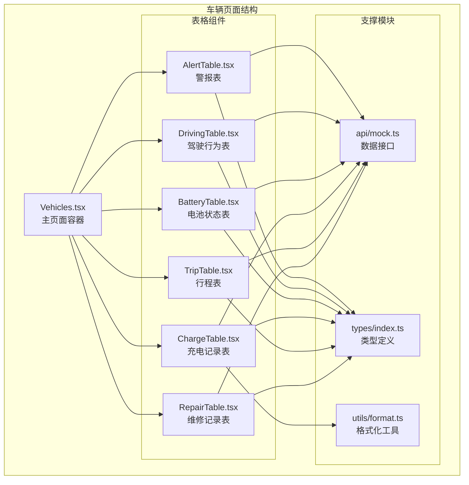
```mermaid
graph TB
subgraph "车辆页面结构"
Vehicles[Vehicles.tsx<br/>主页面容器]
subgraph "表格组件"
Alert[AlertTable.tsx<br/>警报表]
Drive[DrivingTable.tsx<br/>驾驶行为表]
Battery[BatteryTable.tsx<br/>电池状态表]
Charge[ChargeTable.tsx<br/>充电记录表]
Trip[TripTable.tsx<br/>行程表]
Repair[RepairTable.tsx<br/>维修记录表]
end
subgraph "支撑模块"
API[api/mock.ts<br/>数据接口]
Types[types/index.ts<br/>类型定义]
Utils[utils/format.ts<br/>格式化工具]
end
end
Vehicles --> Alert
Vehicles --> Drive
Vehicles --> Battery
Vehicles --> Charge
Vehicles --> Trip
Vehicles --> Repair
Alert --> API
Drive --> API
Battery --> API
Charge --> API
Trip --> API
Repair --> API
Alert --> Types
Drive --> Types
Battery --> Types
Charge --> Types
Trip --> Types
Repair --> Types
Charge --> Utils
```

**图表来源**
- [Vehicles.tsx:341-418](file://weidu-fleet/src/pages/Vehicles.tsx#L341-L418)
- [AlertTable.tsx:1-42](file://weidu-fleet/src/pages/Vehicles/AlertTable.tsx#L1-L42)
- [DrivingTable.tsx:1-33](file://weidu-fleet/src/pages/Vehicles/DrivingTable.tsx#L1-L33)
- [BatteryTable.tsx:1-20](file://weidu-fleet/src/pages/Vehicles/BatteryTable.tsx#L1-L20)
- [ChargeTable.tsx:1-27](file://weidu-fleet/src/pages/Vehicles/ChargeTable.tsx#L1-L27)
- [TripTable.tsx:1-30](file://weidu-fleet/src/pages/Vehicles/TripTable.tsx#L1-L30)
- [RepairTable.tsx:1-57](file://weidu-fleet/src/pages/Vehicles/RepairTable.tsx#L1-L57)

**章节来源**
- [Vehicles.tsx:1-440](file://weidu-fleet/src/pages/Vehicles.tsx#L1-L440)

## 核心组件

### 组件架构模式

所有表格组件都遵循相同的架构模式：

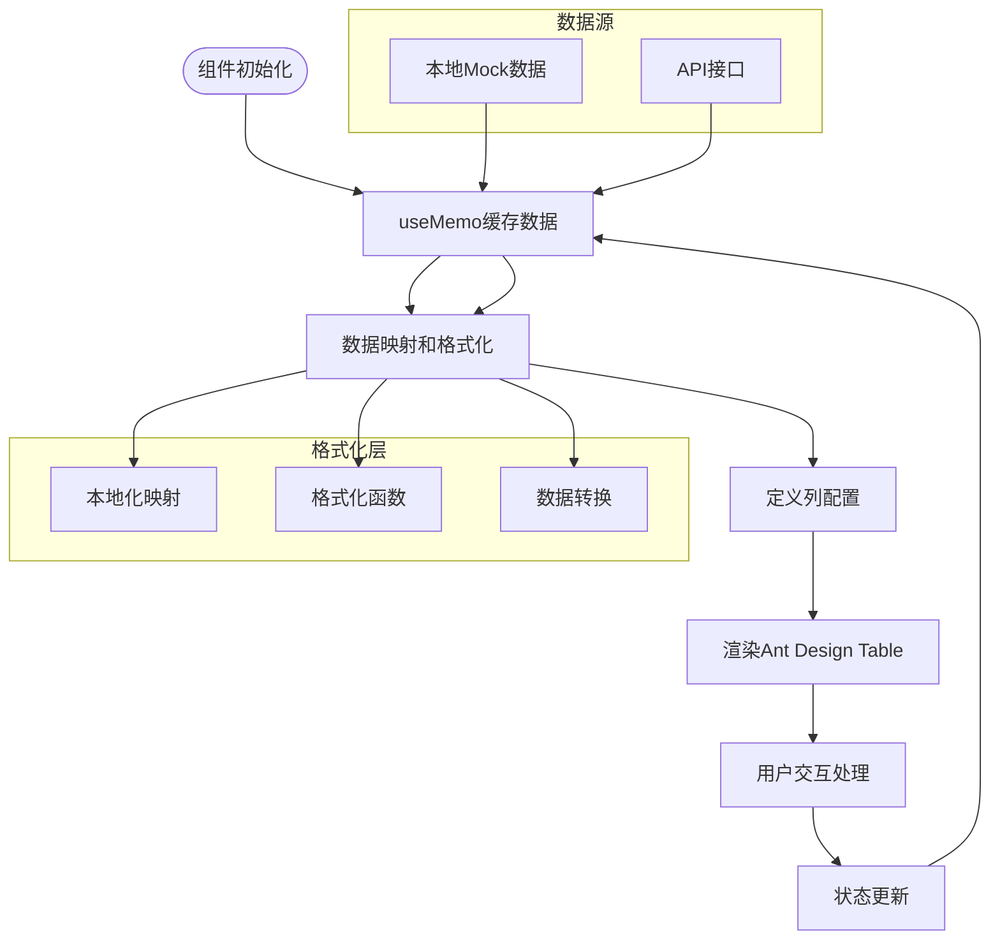
```mermaid
flowchart TD
Start([组件初始化]) --> Hook[useMemo缓存数据]
Hook --> Map[数据映射和格式化]
Map --> Columns[定义列配置]
Columns --> Render[渲染Ant Design Table]
Render --> Interact[用户交互处理]
Interact --> Update[状态更新]
Update --> Hook
subgraph "数据源"
Mock[本地Mock数据]
API[API接口]
end
subgraph "格式化层"
Localize[本地化映射]
Format[格式化函数]
Transform[数据转换]
end
Mock --> Hook
API --> Hook
Hook --> Map
Map --> Localize
Map --> Format
Map --> Transform
```

**图表来源**
- [AlertTable.tsx:24-39](file://weidu-fleet/src/pages/Vehicles/AlertTable.tsx#L24-L39)
- [DrivingTable.tsx:15-30](file://weidu-fleet/src/pages/Vehicles/DrivingTable.tsx#L15-L30)
- [BatteryTable.tsx:7-17](file://weidu-fleet/src/pages/Vehicles/BatteryTable.tsx#L7-L17)

### 数据获取策略

每个组件都采用以下数据获取模式：

1. **本地缓存**：使用`useMemo`缓存原始数据，避免重复计算
2. **数据映射**：通过`useMemo`进行数据转换和本地化
3. **实时更新**：依赖外部数据源的变化触发重新计算

**章节来源**
- [AlertTable.tsx:25-31](file://weidu-fleet/src/pages/Vehicles/AlertTable.tsx#L25-L31)
- [DrivingTable.tsx:17-22](file://weidu-fleet/src/pages/Vehicles/DrivingTable.tsx#L17-L22)
- [BatteryTable.tsx:9](file://weidu-fleet/src/pages/Vehicles/BatteryTable.tsx#L9)

## 架构概览

### 整体数据流

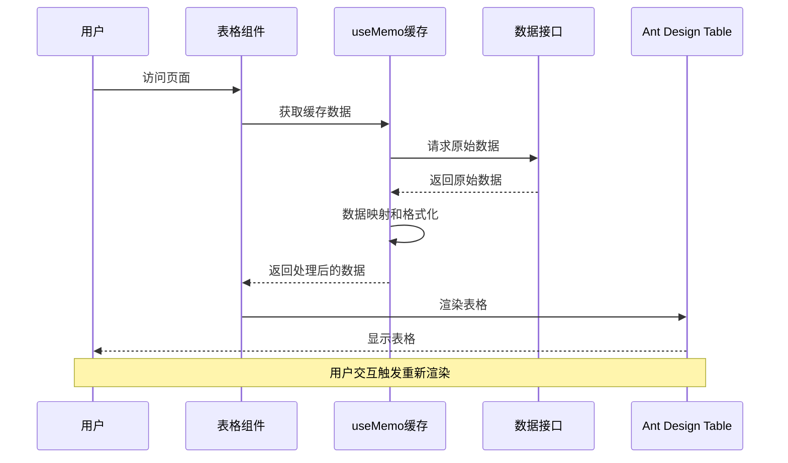
```mermaid
sequenceDiagram
participant User as 用户
participant Component as 表格组件
participant Memo as useMemo缓存
participant API as 数据接口
participant AntD as Ant Design Table
User->>Component : 访问页面
Component->>Memo : 获取缓存数据
Memo->>API : 请求原始数据
API-->>Memo : 返回原始数据
Memo->>Memo : 数据映射和格式化
Memo-->>Component : 返回处理后的数据
Component->>AntD : 渲染表格
AntD-->>User : 显示表格
Note over User,AntD : 用户交互触发重新渲染
```

**图表来源**
- [Vehicles.tsx:422-437](file://weidu-fleet/src/pages/Vehicles.tsx#L422-L437)
- [mock.ts:551-591](file://weidu-fleet/src/api/mock.ts#L551-L591)

### 组件间关系

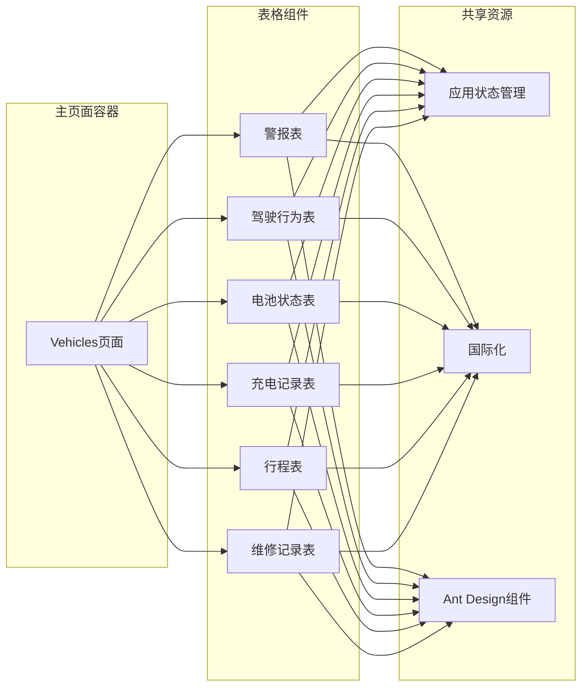
```mermaid
graph LR
subgraph "主页面容器"
VehiclesPage[Vehicles页面]
end
subgraph "表格组件"
AlertTable[警报表]
DrivingTable[驾驶行为表]
BatteryTable[电池状态表]
ChargeTable[充电记录表]
TripTable[行程表]
RepairTable[维修记录表]
end
subgraph "共享资源"
Store[应用状态管理]
I18n[国际化]
AntD[Ant Design组件]
end
VehiclesPage --> AlertTable
VehiclesPage --> DrivingTable
VehiclesPage --> BatteryTable
VehiclesPage --> ChargeTable
VehiclesPage --> TripTable
VehiclesPage --> RepairTable
AlertTable --> Store
DrivingTable --> Store
BatteryTable --> Store
ChargeTable --> Store
TripTable --> Store
RepairTable --> Store
AlertTable --> I18n
DrivingTable --> I18n
BatteryTable --> I18n
ChargeTable --> I18n
TripTable --> I18n
RepairTable --> I18n
AlertTable --> AntD
DrivingTable --> AntD
BatteryTable --> AntD
ChargeTable --> AntD
TripTable --> AntD
RepairTable --> AntD
```

**图表来源**
- [Vehicles.tsx:341-418](file://weidu-fleet/src/pages/Vehicles.tsx#L341-L418)
- [AppLayout.tsx:10-82](file://weidu-fleet/src/components/Layout/AppLayout.tsx#L10-L82)

## 详细组件分析

### 警报表（AlertTable）

#### 数据结构和列定义

警报表专门用于展示车辆的各种预警信息，采用双映射机制实现中英文显示：

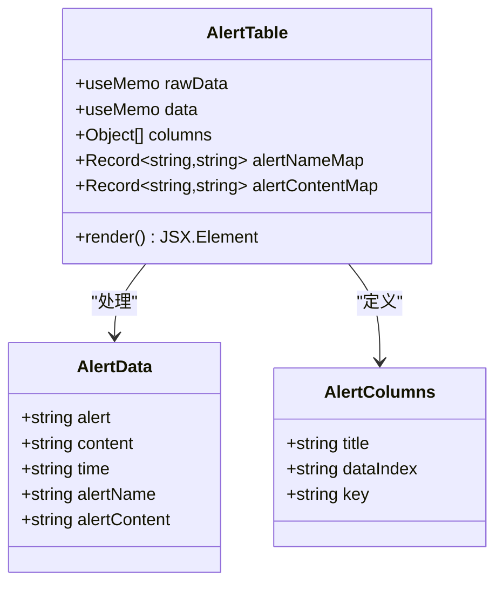
```mermaid
classDiagram
class AlertTable {
+useMemo rawData
+useMemo data
+Object[] columns
+Record~string,string~ alertNameMap
+Record~string,string~ alertContentMap
+render() JSX.Element
}
class AlertData {
+string alert
+string content
+string time
+string alertName
+string alertContent
}
class AlertColumns {
+string title
+string dataIndex
+string key
}
AlertTable --> AlertData : "处理"
AlertTable --> AlertColumns : "定义"
```

**图表来源**
- [AlertTable.tsx:6-38](file://weidu-fleet/src/pages/Vehicles/AlertTable.tsx#L6-L38)

#### 特有业务逻辑

- **双重本地化映射**：同时处理预警名称和内容的中英文转换
- **数据增强**：在原始数据基础上添加可读性强的中文字段
- **固定列配置**：三列表格，包含预警名称、内容和时间

#### 数据格式化

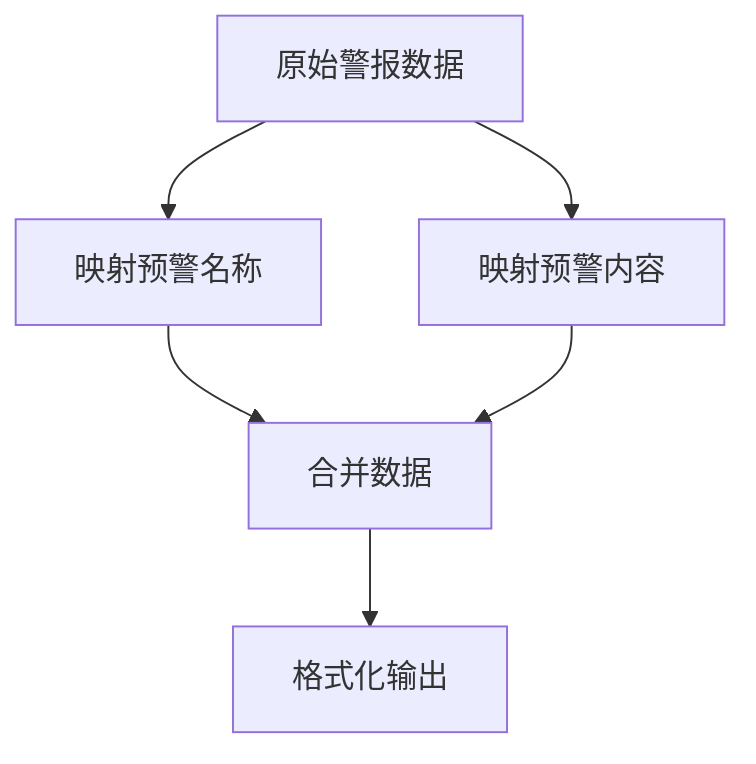
```mermaid
flowchart TD
RawData[原始警报数据] --> MapName[映射预警名称]
RawData --> MapContent[映射预警内容]
MapName --> Combined[合并数据]
MapContent --> Combined
Combined --> Formatted[格式化输出]
```

**图表来源**
- [AlertTable.tsx:27-31](file://weidu-fleet/src/pages/Vehicles/AlertTable.tsx#L27-L31)

**章节来源**
- [AlertTable.tsx:1-42](file://weidu-fleet/src/pages/Vehicles/AlertTable.tsx#L1-L42)

### 驾驶行为表（DrivingTable）

#### 数据结构和列定义

驾驶行为表专注于展示车辆的驾驶行为预警，特别处理车速数据：

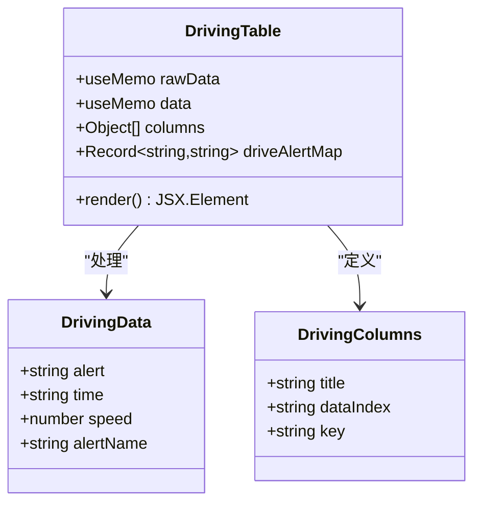
```mermaid
classDiagram
class DrivingTable {
+useMemo rawData
+useMemo data
+Object[] columns
+Record~string,string~ driveAlertMap
+render() JSX.Element
}
class DrivingData {
+string alert
+string time
+number speed
+string alertName
}
class DrivingColumns {
+string title
+string dataIndex
+string key
}
DrivingTable --> DrivingData : "处理"
DrivingTable --> DrivingColumns : "定义"
```

**图表来源**
- [DrivingTable.tsx:6-29](file://weidu-fleet/src/pages/Vehicles/DrivingTable.tsx#L6-L29)

#### 特有业务逻辑

- **智能速度生成**：当原始数据缺少速度信息时，自动生成合理的随机速度值
- **驾驶预警映射**：将技术性的预警代码转换为易懂的中文描述
- **动态数据增强**：在渲染前对数据进行必要的补充和转换

#### 性能优化

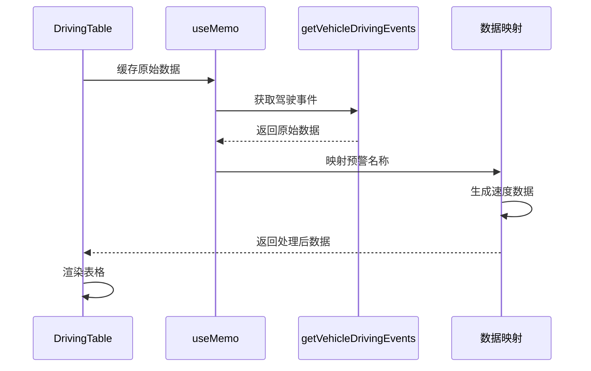
```mermaid
sequenceDiagram
participant Component as DrivingTable
participant Memo as useMemo
participant API as getVehicleDrivingEvents
participant Map as 数据映射
Component->>Memo : 缓存原始数据
Memo->>API : 获取驾驶事件
API-->>Memo : 返回原始数据
Memo->>Map : 映射预警名称
Map->>Map : 生成速度数据
Map-->>Component : 返回处理后数据
Component->>Component : 渲染表格
```

**图表来源**
- [DrivingTable.tsx:17-22](file://weidu-fleet/src/pages/Vehicles/DrivingTable.tsx#L17-L22)

**章节来源**
- [DrivingTable.tsx:1-33](file://weidu-fleet/src/pages/Vehicles/DrivingTable.tsx#L1-L33)

### 电池状态表（BatteryTable）

#### 数据结构和列定义

电池状态表是唯一接受外部参数的表格组件，专门展示单个车辆的电池监控数据：

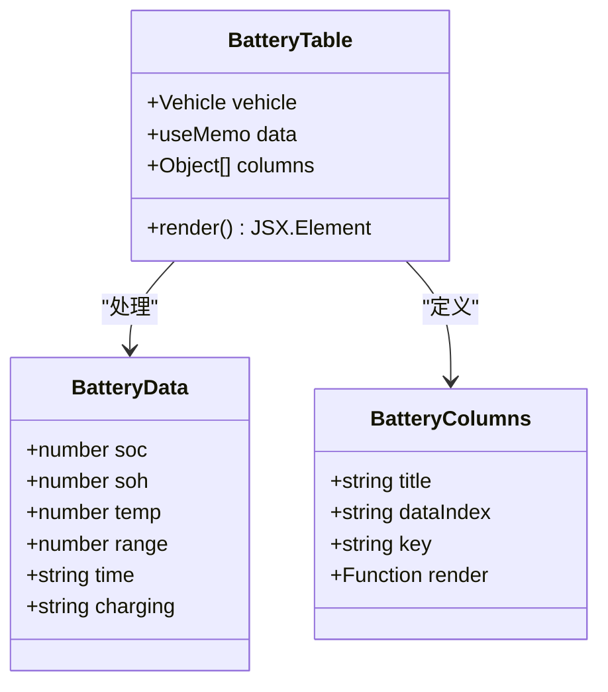
```mermaid
classDiagram
class BatteryTable {
+Vehicle vehicle
+useMemo data
+Object[] columns
+render() JSX.Element
}
class BatteryData {
+number soc
+number soh
+number temp
+number range
+string time
+string charging
}
class BatteryColumns {
+string title
+string dataIndex
+string key
+Function render
}
BatteryTable --> BatteryData : "处理"
BatteryTable --> BatteryColumns : "定义"
```

**图表来源**
- [BatteryTable.tsx:7-17](file://weidu-fleet/src/pages/Vehicles/BatteryTable.tsx#L7-L17)

#### 特有业务逻辑

- **参数化设计**：接收车辆对象作为props，支持单车辆详情页展示
- **单位格式化**：自动添加百分比和温度单位，提升可读性
- **实时状态显示**：结合车辆的充电状态信息

#### 数据绑定

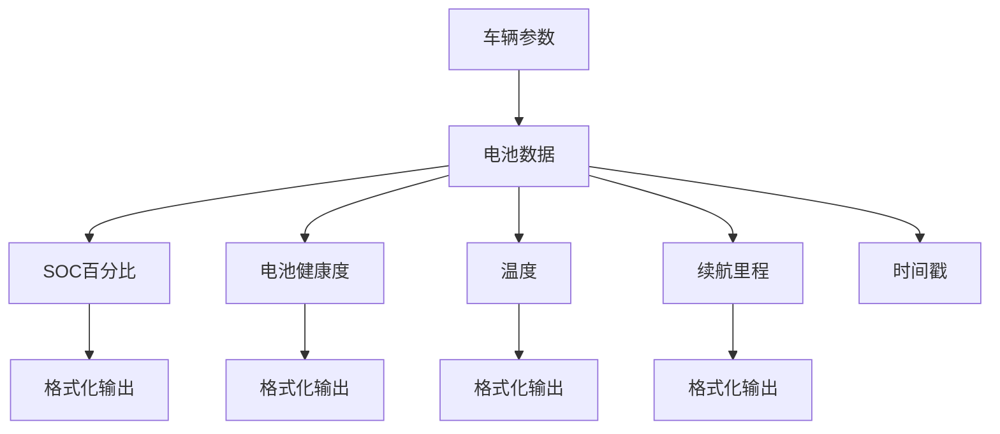
```mermaid
flowchart TD
VehicleProps[车辆参数] --> BatteryData[电池数据]
BatteryData --> Soc[SOC百分比]
BatteryData --> Soh[电池健康度]
BatteryData --> Temp[温度]
BatteryData --> Range[续航里程]
BatteryData --> Time[时间戳]
Soc --> FormattedSoc[格式化输出]
Soh --> FormattedSoH[格式化输出]
Temp --> FormattedTemp[格式化输出]
Range --> FormattedRange[格式化输出]
```

**图表来源**
- [BatteryTable.tsx:10-15](file://weidu-fleet/src/pages/Vehicles/BatteryTable.tsx#L10-L15)

**章节来源**
- [BatteryTable.tsx:1-20](file://weidu-fleet/src/pages/Vehicles/BatteryTable.tsx#L1-L20)

### 充电记录表（ChargeTable）

#### 数据结构和列定义

充电记录表专门处理电池充电过程中的各项指标：

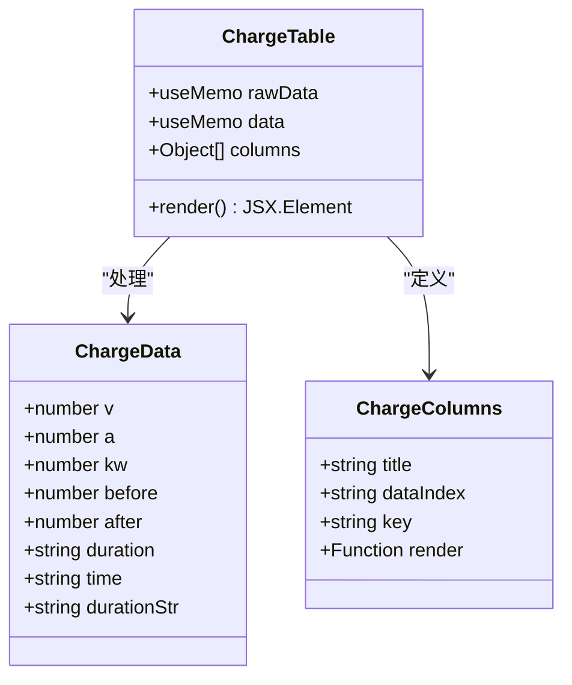
```mermaid
classDiagram
class ChargeTable {
+useMemo rawData
+useMemo data
+Object[] columns
+render() JSX.Element
}
class ChargeData {
+number v
+number a
+number kw
+number before
+number after
+string duration
+string time
+string durationStr
}
class ChargeColumns {
+string title
+string dataIndex
+string key
+Function render
}
ChargeTable --> ChargeData : "处理"
ChargeTable --> ChargeColumns : "定义"
```

**图表来源**
- [ChargeTable.tsx:7-24](file://weidu-fleet/src/pages/Vehicles/ChargeTable.tsx#L7-L24)

#### 特有业务逻辑

- **复合数据处理**：将原始的持续时间字符串转换为本地化格式
- **物理量单位**：自动添加电压(V)、电流(A)、功率(kW)等单位标识
- **电量变化展示**：清晰显示充电前后的电量变化

#### 时间格式化流程

```mermaid
flowchart TD
RawDuration[原始持续时间<br/>如: "2h30m"] --> Regex[正则匹配]
Regex --> Hours[提取小时数]
Regex --> Minutes[提取分钟数]
Hours --> Localized[本地化转换<br/>如: "2小时30分钟"]
Minutes --> Localized
Localized --> Formatted[最终显示]
```

**图表来源**
- [format.ts:9-16](file://weidu-fleet/src/utils/format.ts#L9-L16)

**章节来源**
- [ChargeTable.tsx:1-27](file://weidu-fleet/src/pages/Vehicles/ChargeTable.tsx#L1-L27)

### 行程表（TripTable）

#### 数据结构和列定义

行程表展示车辆的完整行程信息，包含地理位置和统计指标：

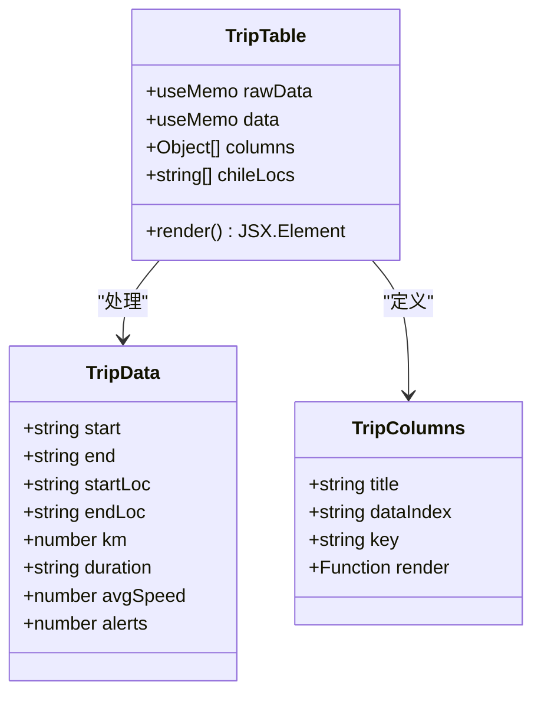
```mermaid
classDiagram
class TripTable {
+useMemo rawData
+useMemo data
+Object[] columns
+string[] chileLocs
+render() JSX.Element
}
class TripData {
+string start
+string end
+string startLoc
+string endLoc
+number km
+string duration
+number avgSpeed
+number alerts
}
class TripColumns {
+string title
+string dataIndex
+string key
+Function render
}
TripTable --> TripData : "处理"
TripTable --> TripColumns : "定义"
```

**图表来源**
- [TripTable.tsx:8-27](file://weidu-fleet/src/pages/Vehicles/TripTable.tsx#L8-L27)

#### 特有业务逻辑

- **地理位置映射**：使用智利主要城市的固定列表进行起点终点显示
- **复合数据生成**：为每条记录分配预设的起终点组合
- **多维度统计**：展示行驶距离、时长、平均速度和预警次数

#### 地理位置管理

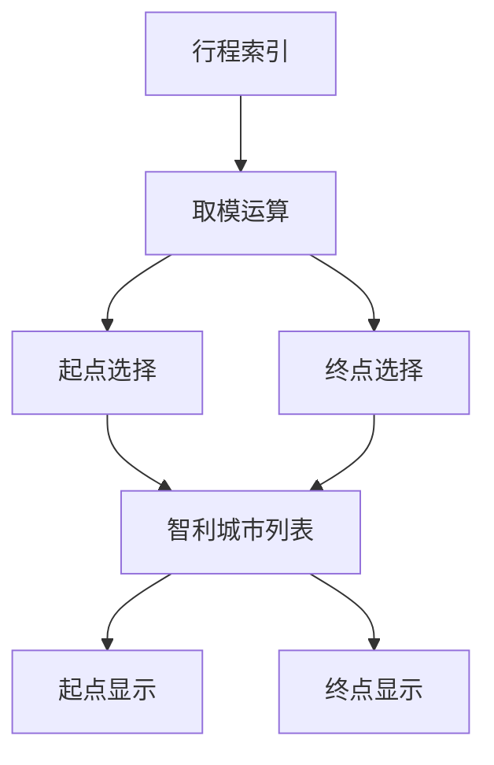
```mermaid
flowchart TD
TripIndex[行程索引] --> Modulo[取模运算]
Modulo --> StartLoc[起点选择]
Modulo --> EndLoc[终点选择]
StartLoc --> ChileLocs[智利城市列表]
EndLoc --> ChileLocs
ChileLocs --> StartDisplay[起点显示]
ChileLocs --> EndDisplay[终点显示]
```

**图表来源**
- [TripTable.tsx:6](file://weidu-fleet/src/pages/Vehicles/TripTable.tsx#L6)
- [TripTable.tsx:11-15](file://weidu-fleet/src/pages/Vehicles/TripTable.tsx#L11-L15)

**章节来源**
- [TripTable.tsx:1-30](file://weidu-fleet/src/pages/Vehicles/TripTable.tsx#L1-L30)

### 维修记录表（RepairTable）

#### 数据结构和列定义

维修记录表是最复杂的表格组件，具有完整的CRUD操作能力：

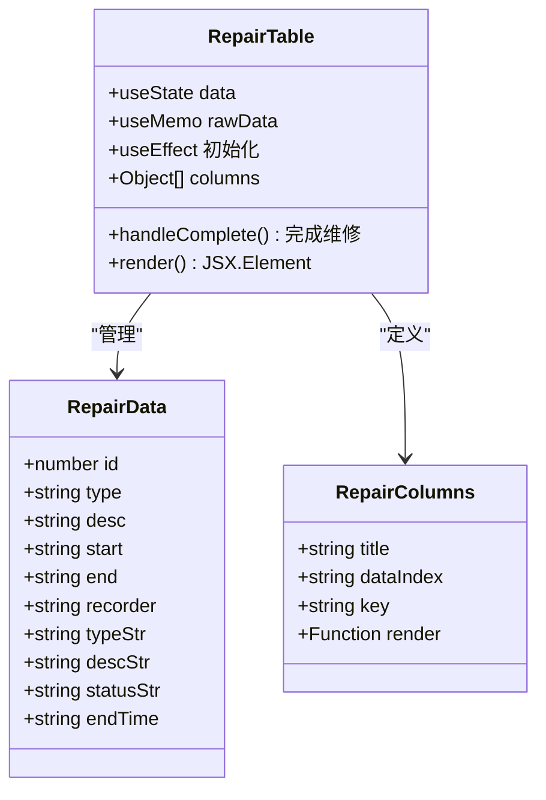
```mermaid
classDiagram
class RepairTable {
+useState data
+useMemo rawData
+useEffect 初始化
+handleComplete() 完成维修
+Object[] columns
+render() JSX.Element
}
class RepairData {
+number id
+string type
+string desc
+string start
+string end
+string recorder
+string typeStr
+string descStr
+string statusStr
+string endTime
}
class RepairColumns {
+string title
+string dataIndex
+string key
+Function render
}
RepairTable --> RepairData : "管理"
RepairTable --> RepairColumns : "定义"
```

**图表来源**
- [RepairTable.tsx:6-54](file://weidu-fleet/src/pages/Vehicles/RepairTable.tsx#L6-L54)

#### 特有业务逻辑

- **状态管理**：完全受控的状态管理，支持实时更新
- **动态按钮**：根据维修状态显示不同的操作按钮
- **颜色编码**：使用不同颜色区分维修状态
- **即时更新**：完成维修操作后立即反映到UI

#### 用户交互流程

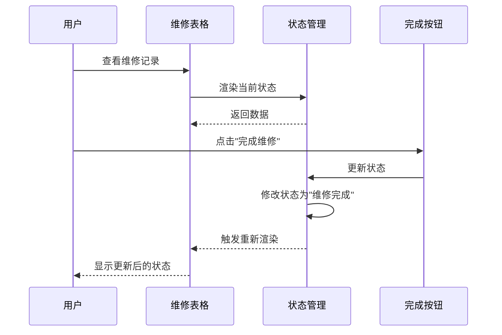
```mermaid
sequenceDiagram
participant User as 用户
participant Table as 维修表格
participant State as 状态管理
participant Button as 完成按钮
User->>Table : 查看维修记录
Table->>State : 渲染当前状态
State-->>Table : 返回数据
User->>Button : 点击"完成维修"
Button->>State : 更新状态
State->>State : 修改状态为"维修完成"
State-->>Table : 触发重新渲染
Table-->>User : 显示更新后的状态
```

**图表来源**
- [RepairTable.tsx:24-26](file://weidu-fleet/src/pages/Vehicles/RepairTable.tsx#L24-L26)
- [RepairTable.tsx:47-50](file://weidu-fleet/src/pages/Vehicles/RepairTable.tsx#L47-L50)

**章节来源**
- [RepairTable.tsx:1-57](file://weidu-fleet/src/pages/Vehicles/RepairTable.tsx#L1-L57)

## 依赖关系分析

### 外部依赖

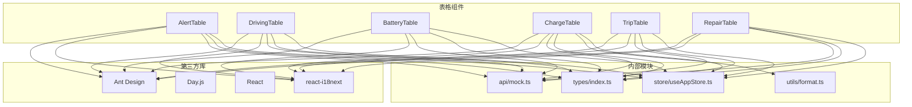
```mermaid
graph TB
subgraph "第三方库"
AntD[Ant Design]
DayJS[Day.js]
React[React]
I18N[react-i18next]
end
subgraph "内部模块"
API[api/mock.ts]
Types[types/index.ts]
Utils[utils/format.ts]
Store[store/useAppStore.ts]
end
subgraph "表格组件"
Alert[AlertTable]
Drive[DrivingTable]
Battery[BatteryTable]
Charge[ChargeTable]
Trip[TripTable]
Repair[RepairTable]
end
Alert --> AntD
Drive --> AntD
Battery --> AntD
Charge --> AntD
Trip --> AntD
Repair --> AntD
Alert --> I18N
Drive --> I18N
Battery --> I18N
Charge --> I18N
Trip --> I18N
Repair --> I18N
Alert --> API
Drive --> API
Battery --> API
Charge --> API
Trip --> API
Repair --> API
Alert --> Types
Drive --> Types
Battery --> Types
Charge --> Types
Trip --> Types
Repair --> Types
Charge --> Utils
Alert --> Store
Drive --> Store
Battery --> Store
Charge --> Store
Trip --> Store
Repair --> Store
```

**图表来源**
- [AlertTable.tsx:1-42](file://weidu-fleet/src/pages/Vehicles/AlertTable.tsx#L1-L42)
- [ChargeTable.tsx:1-27](file://weidu-fleet/src/pages/Vehicles/ChargeTable.tsx#L1-L27)
- [RepairTable.tsx:1-57](file://weidu-fleet/src/pages/Vehicles/RepairTable.tsx#L1-L57)

### 内部依赖关系

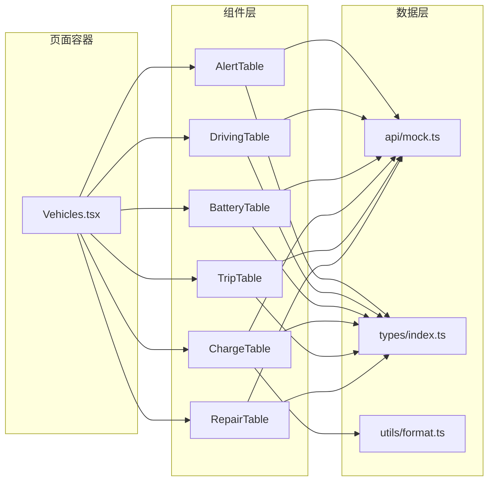
```mermaid
graph LR
subgraph "数据层"
Mock[api/mock.ts]
Types[types/index.ts]
Format[utils/format.ts]
end
subgraph "组件层"
Alert[AlertTable]
Drive[DrivingTable]
Battery[BatteryTable]
Charge[ChargeTable]
Trip[TripTable]
Repair[RepairTable]
end
subgraph "页面容器"
Vehicles[Vehicles.tsx]
end
Vehicles --> Alert
Vehicles --> Drive
Vehicles --> Battery
Vehicles --> Charge
Vehicles --> Trip
Vehicles --> Repair
Alert --> Mock
Drive --> Mock
Battery --> Mock
Charge --> Mock
Trip --> Mock
Repair --> Mock
Alert --> Types
Drive --> Types
Battery --> Types
Charge --> Types
Trip --> Types
Repair --> Types
Charge --> Format
```

**图表来源**
- [Vehicles.tsx:32-41](file://weidu-fleet/src/pages/Vehicles.tsx#L32-L41)
- [mock.ts:1-634](file://weidu-fleet/src/api/mock.ts#L1-L634)

**章节来源**
- [mock.ts:1-634](file://weidu-fleet/src/api/mock.ts#L1-L634)
- [index.ts:1-261](file://weidu-fleet/src/types/index.ts#L1-L261)

## 性能考虑

### 渲染优化策略

1. **useMemo缓存**：所有组件都使用`useMemo`缓存计算结果，避免不必要的重渲染
2. **数据映射分离**：将数据获取和数据映射分离，提高缓存命中率
3. **最小化依赖数组**：精确控制`useMemo`的依赖项，确保及时响应数据变化

### 内存管理

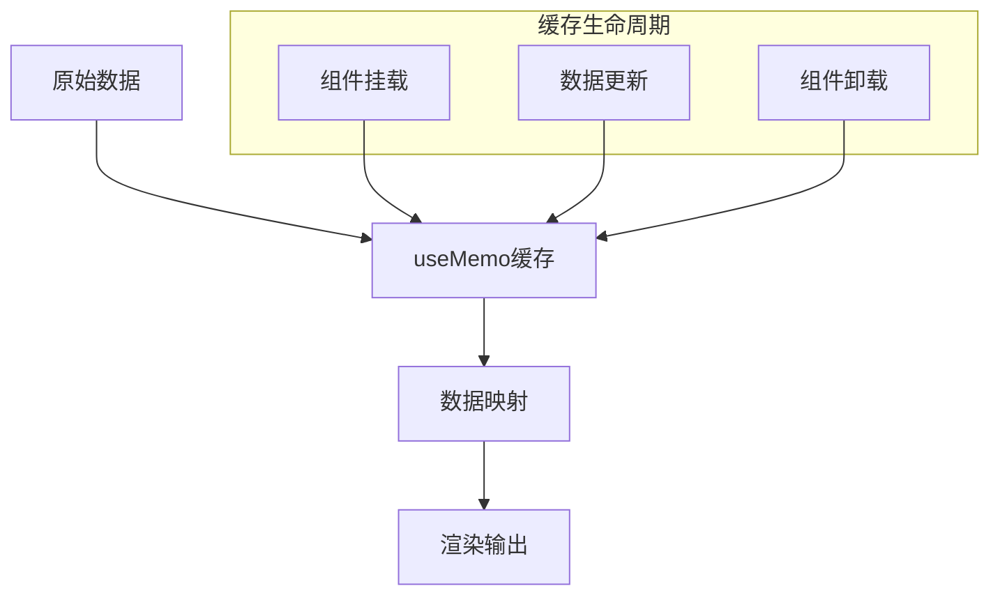
```mermaid
flowchart TD
Data[原始数据] --> Memo[useMemo缓存]
Memo --> Map[数据映射]
Map --> Render[渲染输出]
subgraph "缓存生命周期"
Mount[组件挂载]
Update[数据更新]
Unmount[组件卸载]
end
Mount --> Memo
Update --> Memo
Unmount --> Memo
```

### 性能监控建议

- **大数据集处理**：对于大量数据，考虑实现虚拟滚动
- **懒加载优化**：在详情页中按需加载表格数据
- **防抖处理**：对于频繁更新的数据，实现适当的防抖机制

## 故障排除指南

### 常见问题诊断

#### 数据不显示问题

1. **检查数据源连接**
   - 确认API接口正常工作
   - 验证数据格式是否符合预期

2. **验证数据映射**
   - 检查本地化映射表是否完整
   - 确认数据字段名称匹配

#### 性能问题排查

1. **缓存失效**
   - 检查`useMemo`依赖数组是否正确
   - 验证数据变更检测机制

2. **内存泄漏**
   - 确认组件卸载时清理定时器
   - 检查事件监听器的移除

### 调试技巧

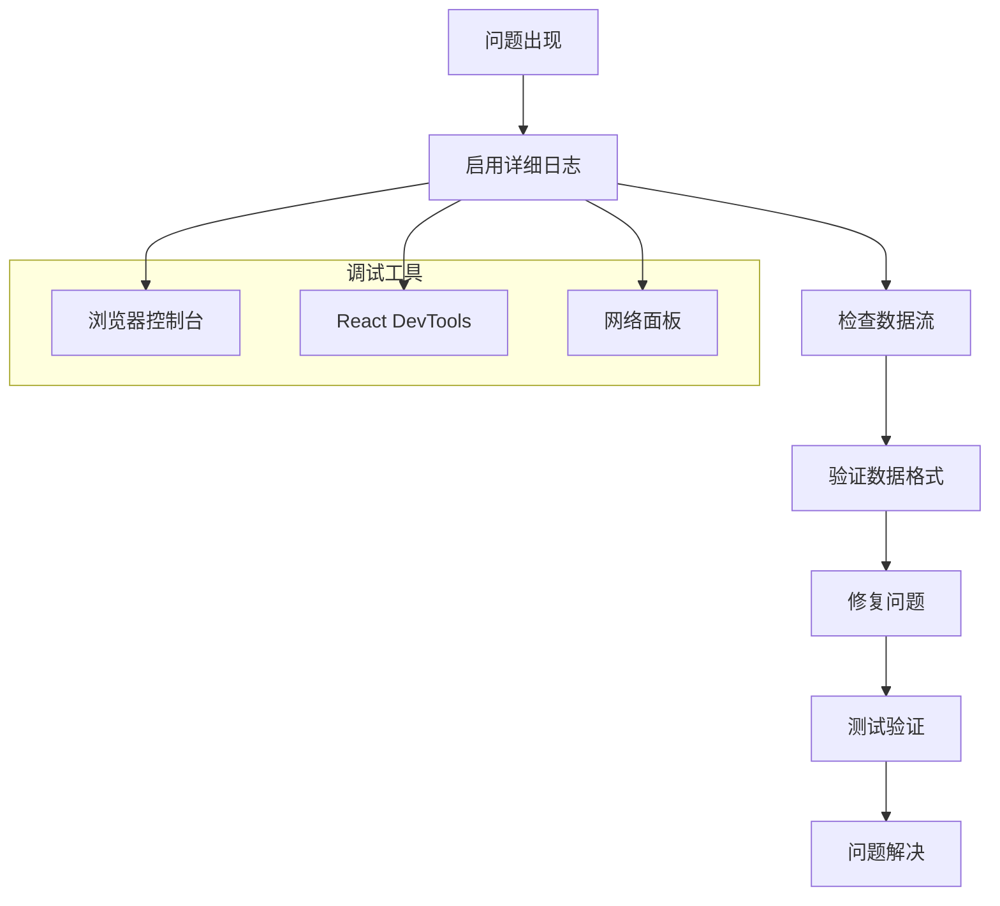
```mermaid
flowchart TD
Issue[问题出现] --> Log[启用详细日志]
Log --> Check[检查数据流]
Check --> Validate[验证数据格式]
Validate --> Fix[修复问题]
Fix --> Test[测试验证]
Test --> Done[问题解决]
subgraph "调试工具"
Console[浏览器控制台]
ReactDevTools[React DevTools]
Network[网络面板]
end
Log --> Console
Log --> ReactDevTools
Log --> Network
```

**章节来源**
- [format.ts:1-27](file://weidu-fleet/src/utils/format.ts#L1-L27)

## 结论

苇渡-智利车队管理平台的车辆表格组件系统展现了现代React应用的最佳实践：

### 设计优势

1. **一致性**：所有表格组件遵循相同的架构模式，便于维护和扩展
2. **可扩展性**：模块化设计支持新表格组件的快速添加
3. **用户体验**：丰富的交互功能和本地化支持提升了用户满意度
4. **性能优化**：合理的缓存策略和渲染优化确保了良好的性能表现

### 技术亮点

- **类型安全**：完整的TypeScript类型定义确保了开发时的类型安全
- **国际化支持**：全面的多语言支持适应不同地区的需求
- **数据格式化**：统一的数据格式化标准提升了数据展示质量
- **状态管理**：灵活的状态管理模式支持复杂业务场景

### 改进建议

1. **单元测试**：为关键组件添加单元测试覆盖
2. **错误边界**：实现全局错误边界处理异常情况
3. **性能监控**：集成性能监控工具跟踪组件性能
4. **文档完善**：为每个组件添加详细的API文档

这个表格组件系统为车队管理提供了强大的数据可视化能力，通过标准化的设计和丰富的功能，为用户提供了直观、高效的数据管理体验。