# 车辆详情视图

<cite>
**本文档引用的文件**
- [Vehicles.tsx](file://weidu-fleet/src/pages/Vehicles.tsx)
- [useAppStore.ts](file://weidu-fleet/src/store/useAppStore.ts)
- [mock.ts](file://weidu-fleet/src/api/mock.ts)
- [index.ts](file://weidu-fleet/src/types/index.ts)
- [format.ts](file://weidu-fleet/src/utils/format.ts)
- [en.ts](file://weidu-fleet/src/i18n/en.ts)
- [es.ts](file://weidu-fleet/src/i18n/es.ts)
- [zh.ts](file://weidu-fleet/src/i18n/zh.ts)
- [index.ts](file://weidu-fleet/src/i18n/index.ts)
</cite>

## 目录
1. [简介](#简介)
2. [项目结构](#项目结构)
3. [核心组件](#核心组件)
4. [架构概览](#架构概览)
5. [详细组件分析](#详细组件分析)
6. [依赖关系分析](#依赖关系分析)
7. [性能考虑](#性能考虑)
8. [故障排除指南](#故障排除指南)
9. [结论](#结论)

## 简介

车辆详情视图是智利车队管理系统中的核心功能模块，负责展示单个车辆的完整信息。该视图实现了现代化的响应式布局设计，包含面包屑导航、车辆基本信息展示、设备信息展示和多标签页切换机制。系统采用React + TypeScript + Ant Design的技术栈，结合国际化支持和状态管理，为用户提供直观的车辆信息浏览体验。

## 项目结构

车辆详情视图位于前端应用的页面层，采用模块化组织方式：

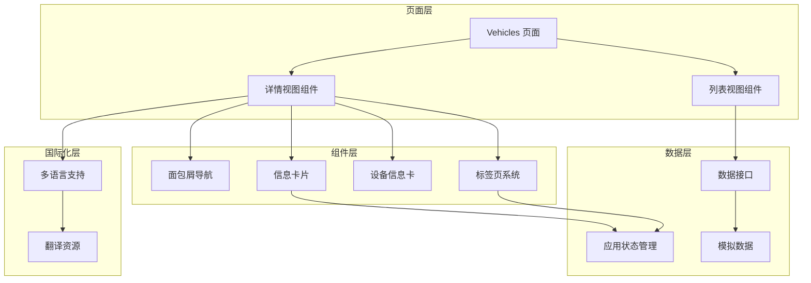

**图表来源**
- [Vehicles.tsx:1-439](file://weidu-fleet/src/pages/Vehicles.tsx#L1-L439)

**章节来源**
- [Vehicles.tsx:1-439](file://weidu-fleet/src/pages/Vehicles.tsx#L1-L439)

## 核心组件

### 主要组件架构

车辆详情视图由三个主要组件构成：主页面容器、详情视图组件和列表视图组件。每个组件都有明确的职责分工和生命周期管理。

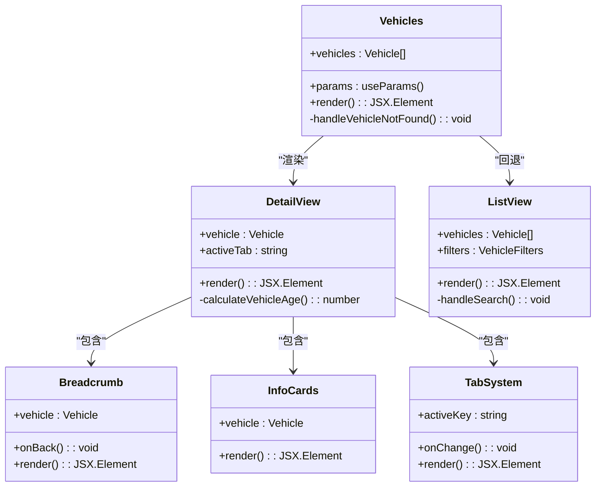

**图表来源**
- [Vehicles.tsx:47-439](file://weidu-fleet/src/pages/Vehicles.tsx#L47-L439)

### 数据流架构

系统采用自上而下的数据流向，确保数据的一致性和可预测性：

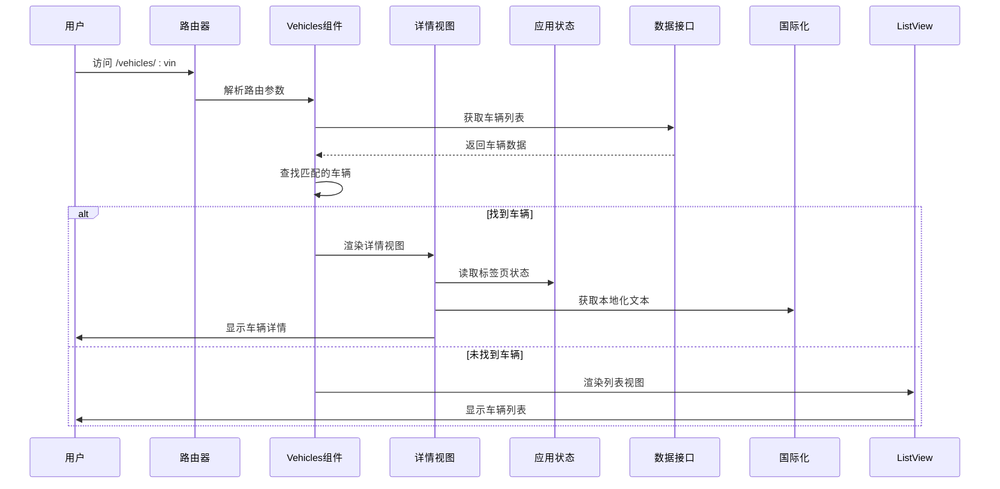

**图表来源**
- [Vehicles.tsx:422-437](file://weidu-fleet/src/pages/Vehicles.tsx#L422-L437)

**章节来源**
- [Vehicles.tsx:47-439](file://weidu-fleet/src/pages/Vehicles.tsx#L47-L439)

## 架构概览

### 整体架构设计

车辆详情视图采用了清晰的分层架构，每层都有明确的职责边界：

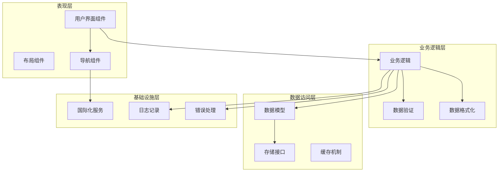

**图表来源**
- [Vehicles.tsx:1-439](file://weidu-fleet/src/pages/Vehicles.tsx#L1-L439)

### 响应式布局设计

系统实现了完整的响应式设计，支持从移动端到桌面端的各种屏幕尺寸：

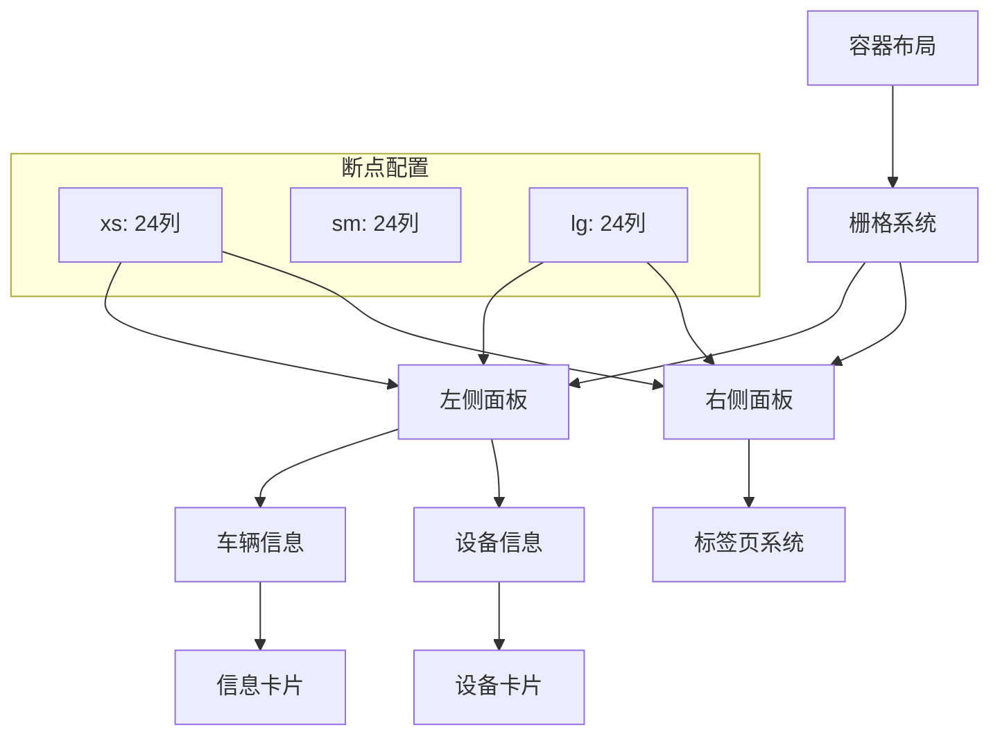

**图表来源**
- [Vehicles.tsx:370-415](file://weidu-fleet/src/pages/Vehicles.tsx#L370-L415)

**章节来源**
- [Vehicles.tsx:370-415](file://weidu-fleet/src/pages/Vehicles.tsx#L370-L415)

## 详细组件分析

### 面包屑导航组件

面包屑导航提供了清晰的页面层级指示和便捷的返回功能：

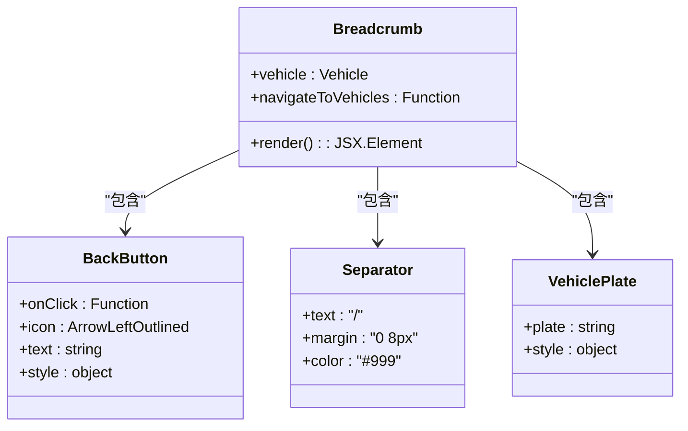

**图表来源**
- [Vehicles.tsx:361-368](file://weidu-fleet/src/pages/Vehicles.tsx#L361-L368)

面包屑导航的关键特性包括：
- **层级指示**：显示从车辆列表到具体车辆的完整路径
- **快速返回**：点击返回按钮直接导航到车辆列表页面
- **实时更新**：根据当前选中的车辆动态更新显示内容

**章节来源**
- [Vehicles.tsx:361-368](file://weidu-fleet/src/pages/Vehicles.tsx#L361-L368)

### 车辆信息展示组件

车辆信息展示区域采用卡片布局设计，提供清晰的信息层次结构：

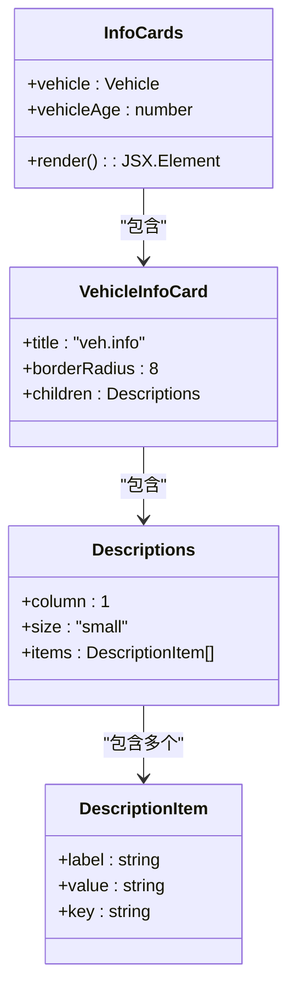

**图表来源**
- [Vehicles.tsx:374-393](file://weidu-fleet/src/pages/Vehicles.tsx#L374-L393)

车辆信息展示包含以下关键字段：
- **VIN码**：车辆识别号码
- **车牌号**：车辆注册号码
- **车型**：车辆品牌和型号
- **颜色**：车身外观颜色
- **电池版本**：电池系统版本信息
- **购买日期**：车辆购买时间
- **车龄计算**：基于购买日期自动计算
- **总里程**：车辆累计行驶里程
- **最后位置**：车辆最近定位位置

**章节来源**
- [Vehicles.tsx:374-393](file://weidu-fleet/src/pages/Vehicles.tsx#L374-L393)

### 设备信息展示组件

设备信息展示区域专门用于显示车辆连接的设备相关信息：

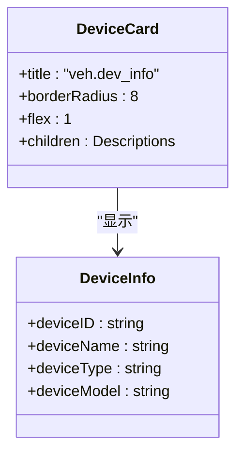

**图表来源**
- [Vehicles.tsx:394-401](file://weidu-fleet/src/pages/Vehicles.tsx#L394-L401)

设备信息包括：
- **设备ID**：设备唯一标识符
- **设备名称**：设备显示名称（默认为"OBD网关"）
- **设备类型**：OBD-II标准
- **设备型号**：WD-T100型号

**章节来源**
- [Vehicles.tsx:394-401](file://weidu-fleet/src/pages/Vehicles.tsx#L394-L401)

### 标签页切换机制

标签页系统提供了7个不同的信息展示区域，每个标签页都对应特定的功能模块：

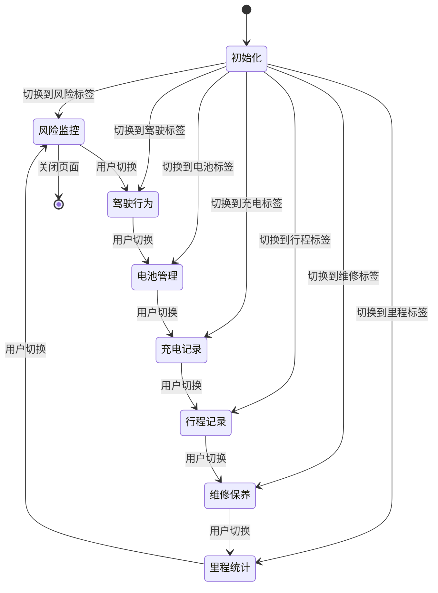

**图表来源**
- [Vehicles.tsx:347-355](file://weidu-fleet/src/pages/Vehicles.tsx#L347-L355)

标签页配置详情：
- **风险监控** (`risk`)：显示车辆安全警告和风险信息
- **驾驶行为** (`drive`)：展示驾驶行为分析数据
- **电池管理** (`battery`)：显示电池状态和性能数据
- **充电记录** (`charge`)：记录充电历史和统计信息
- **行程记录** (`trip`)：展示行程轨迹和路线信息
- **维修保养** (`repair`)：维护保养记录和提醒
- **里程统计** (`mileage`)：里程变化趋势和统计图表

**章节来源**
- [Vehicles.tsx:347-355](file://weidu-fleet/src/pages/Vehicles.tsx#L347-L355)

### 数据绑定与状态同步

系统采用集中式状态管理，确保标签页状态在组件间保持同步：

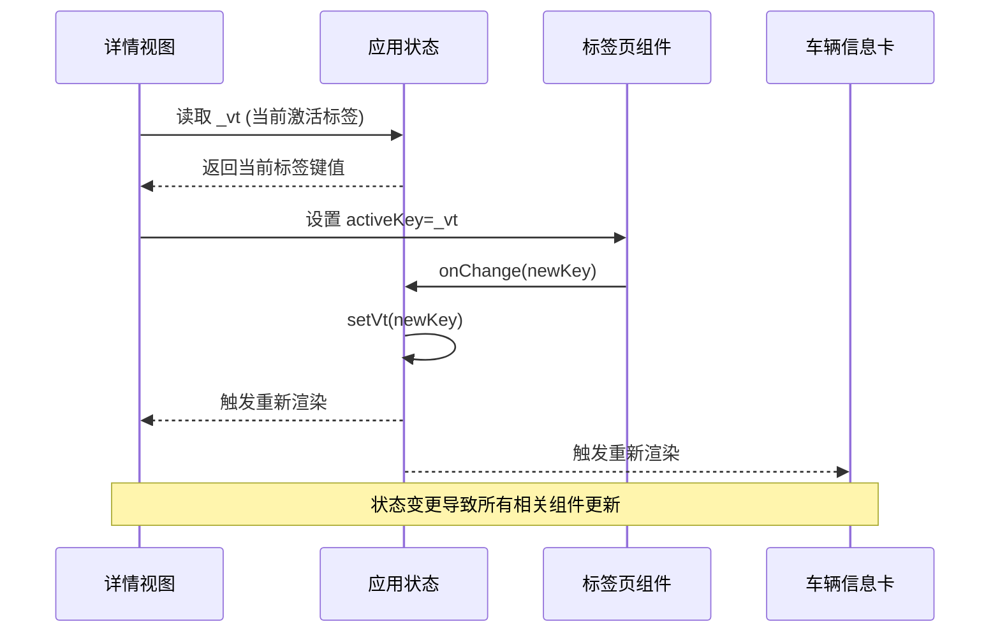

**图表来源**
- [Vehicles.tsx:344-412](file://weidu-fleet/src/pages/Vehicles.tsx#L344-L412)

状态管理机制特点：
- **全局状态**：标签页激活状态存储在应用状态中
- **双向绑定**：UI状态与应用状态实时同步
- **组件通信**：通过状态管理实现跨组件的状态共享

**章节来源**
- [Vehicles.tsx:344-412](file://weidu-fleet/src/pages/Vehicles.tsx#L344-L412)

### 路由参数处理

系统实现了智能的路由参数处理机制，能够优雅地处理各种URL场景：

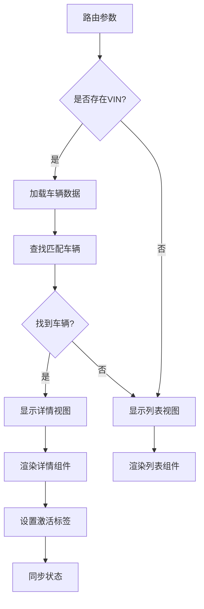

**图表来源**
- [Vehicles.tsx:422-437](file://weidu-fleet/src/pages/Vehicles.tsx#L422-L437)

路由处理流程：
1. **参数解析**：从URL中提取VIN参数
2. **数据加载**：获取完整的车辆数据列表
3. **匹配验证**：查找与VIN匹配的具体车辆
4. **视图选择**：根据匹配结果决定显示哪个视图
5. **状态初始化**：设置初始的标签页激活状态

**章节来源**
- [Vehicles.tsx:422-437](file://weidu-fleet/src/pages/Vehicles.tsx#L422-L437)

### 国际化文本显示

系统支持多语言国际化，所有用户可见文本都通过i18n服务提供：

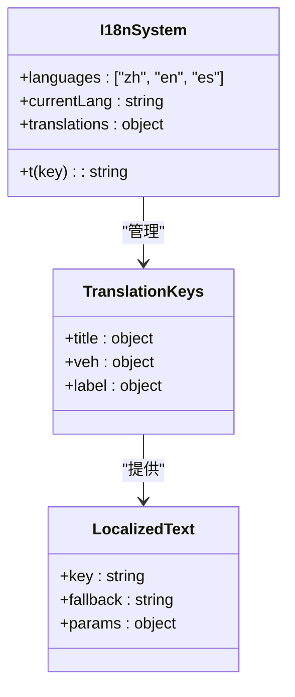

**图表来源**
- [Vehicles.tsx:342](file://weidu-fleet/src/pages/Vehicles.tsx#L342)

国际化覆盖范围：
- **页面标题**：车辆列表和详情页面标题
- **表单标签**：各种信息展示标签
- **按钮文本**：操作按钮的显示文本
- **占位符**：输入框和其他组件的提示文本

**章节来源**
- [Vehicles.tsx:342](file://weidu-fleet/src/pages/Vehicles.tsx#L342)

## 依赖关系分析

### 外部依赖关系

车辆详情视图依赖于多个外部库和框架：

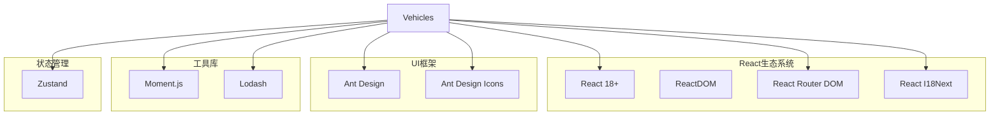

**图表来源**
- [Vehicles.tsx:1-31](file://weidu-fleet/src/pages/Vehicles.tsx#L1-L31)

### 内部依赖关系

组件间的依赖关系体现了清晰的模块化设计：

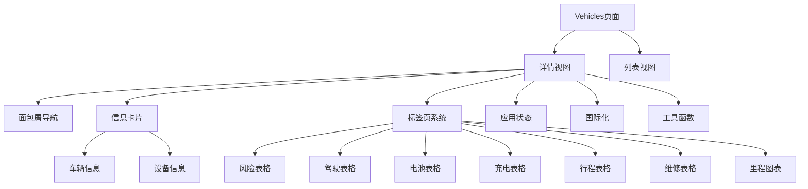

**图表来源**
- [Vehicles.tsx:35-41](file://weidu-fleet/src/pages/Vehicles.tsx#L35-L41)

**章节来源**
- [Vehicles.tsx:35-41](file://weidu-fleet/src/pages/Vehicles.tsx#L35-L41)

## 性能考虑

### 渲染优化策略

系统采用了多种性能优化技术来确保流畅的用户体验：

1. **记忆化优化**：使用`useMemo`缓存计算结果
2. **条件渲染**：根据路由参数动态选择渲染组件
3. **懒加载**：标签页内容按需加载
4. **虚拟滚动**：大数据量时使用虚拟化技术

### 内存管理

- **组件卸载**：确保组件正确清理事件监听器
- **状态释放**：避免内存泄漏的状态引用
- **图片优化**：使用适当的图片格式和尺寸

## 故障排除指南

### 常见问题诊断

1. **车辆信息不显示**
   - 检查路由参数是否正确传递
   - 验证车辆数据是否成功加载
   - 确认VIN码格式是否正确

2. **标签页状态不同步**
   - 检查应用状态管理配置
   - 验证状态更新函数是否正确调用
   - 确认组件重新渲染触发机制

3. **国际化文本显示异常**
   - 检查翻译键值是否正确
   - 验证翻译文件是否完整加载
   - 确认语言切换功能正常工作

### 调试建议

- 使用浏览器开发者工具检查网络请求
- 在控制台输出关键变量值进行调试
- 利用React DevTools检查组件树结构
- 监控应用性能指标和内存使用情况

**章节来源**
- [Vehicles.tsx:422-437](file://weidu-fleet/src/pages/Vehicles.tsx#L422-L437)

## 结论

车辆详情视图是一个功能完整、架构清晰的React组件，展现了现代前端开发的最佳实践。系统通过合理的组件拆分、状态管理和国际化支持，为用户提供了优秀的车辆信息浏览体验。

主要优势包括：
- **模块化设计**：清晰的组件职责分离
- **响应式布局**：适应各种设备屏幕尺寸
- **状态管理**：统一的状态管理和同步机制
- **国际化支持**：完整的多语言文本支持
- **性能优化**：多种性能优化技术和最佳实践

该实现为类似的企业级管理系统提供了良好的参考模板，展示了如何构建可维护、可扩展的前端应用。