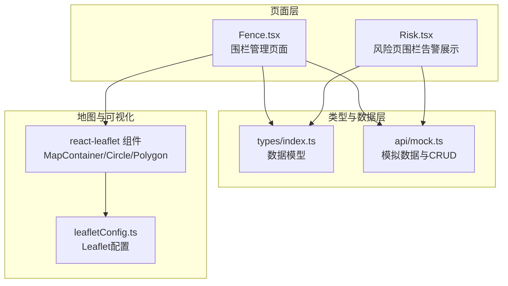
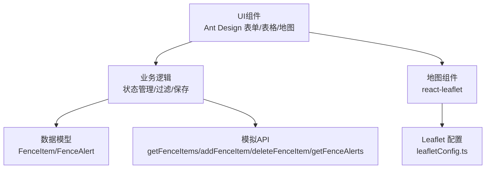
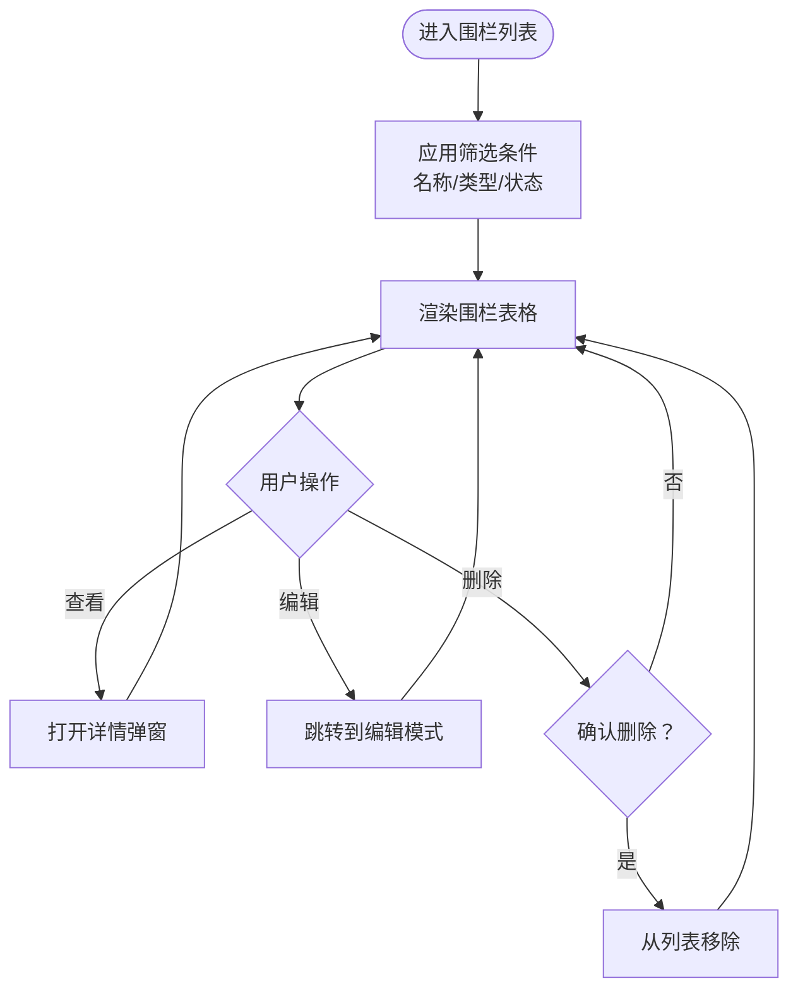
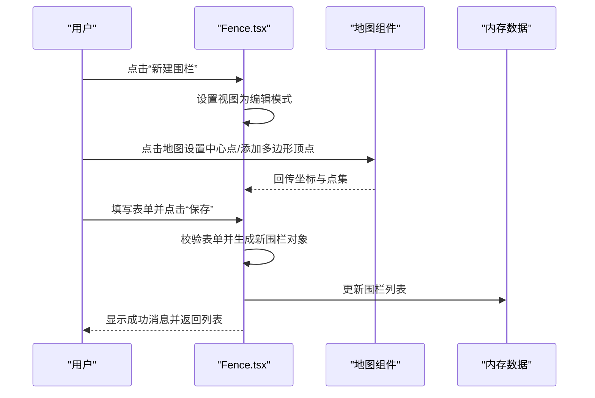
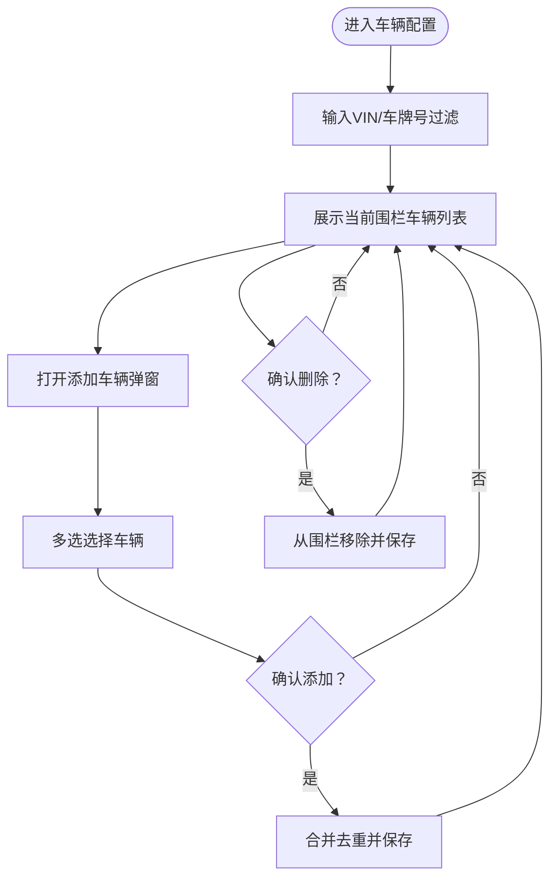
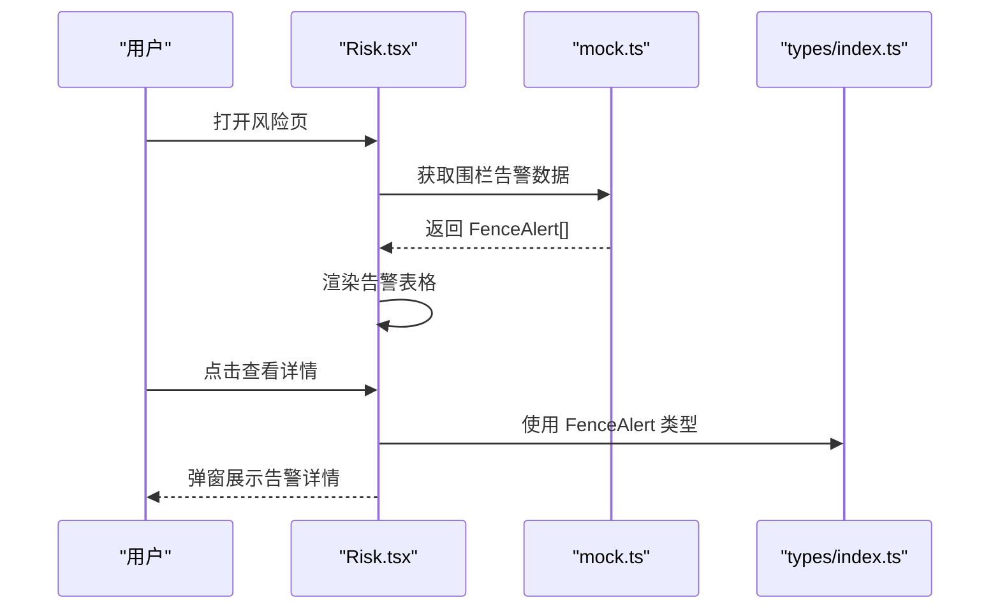
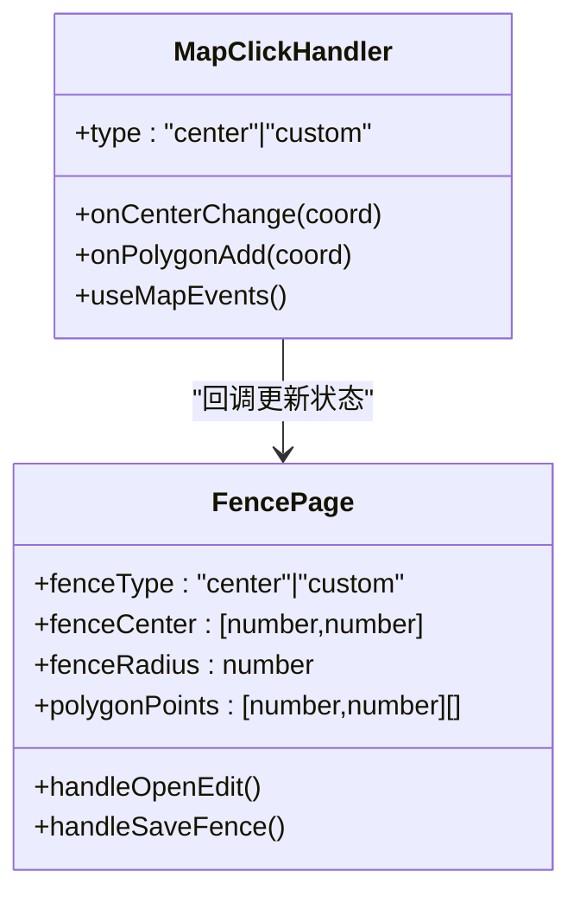
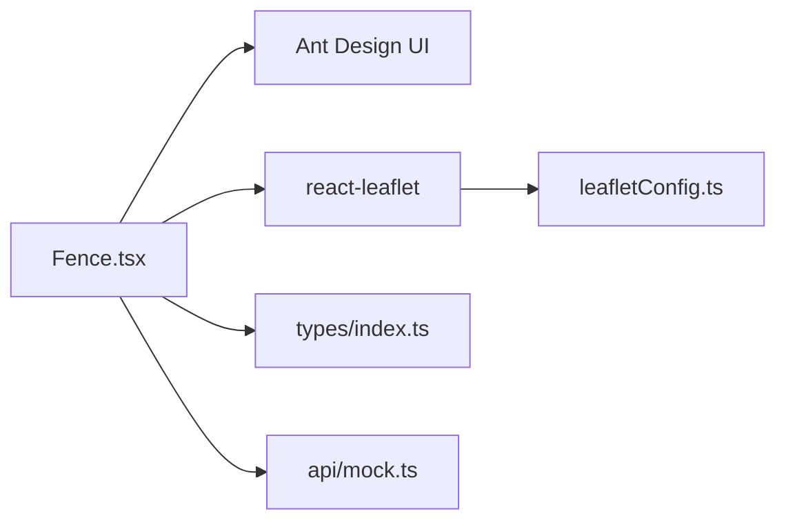

# 电子围栏

<cite>
**本文引用的文件**
- [Fence.tsx](file://weidu-fleet/src/pages/Fence.tsx)
- [types/index.ts](file://weidu-fleet/src/types/index.ts)
- [api/mock.ts](file://weidu-fleet/src/api/mock.ts)
- [Risk.tsx](file://weidu-fleet/src/pages/Risk.tsx)
- [leafletConfig.ts](file://weidu-fleet/src/utils/leafletConfig.ts)
</cite>

## 目录
1. [简介](#简介)
2. [项目结构](#项目结构)
3. [核心组件](#核心组件)
4. [架构概览](#架构概览)
5. [详细组件分析](#详细组件分析)
6. [依赖关系分析](#依赖关系分析)
7. [性能考虑](#性能考虑)
8. [故障排除指南](#故障排除指南)
9. [结论](#结论)
10. [附录](#附录)

## 简介
本文件为智利车队管理平台中的电子围栏模块提供全面的技术文档。该模块实现了围栏区域的创建与管理、边界检测逻辑、越界告警机制以及围栏状态监控等功能。当前版本采用前端本地模拟数据与地图可视化方案，支持两种围栏类型：中心点围栏（圆形）与自定义多边形围栏；支持围栏状态开关、使用车辆配置、越界事件记录与风险页展示。

## 项目结构
电子围栏模块主要由以下文件构成：
- 页面组件：负责围栏列表、编辑与地图绘制
- 类型定义：统一的数据模型与接口规范
- 模拟API：提供围栏数据与越界告警数据
- 地图配置：修复Leaflet默认图标路径问题

**图表来源**
- [Fence.tsx:1-353](file://weidu-fleet/src/pages/Fence.tsx#L1-L353)
- [types/index.ts:204-214](file://weidu-fleet/src/types/index.ts#L204-L214)
- [api/mock.ts:399-401](file://weidu-fleet/src/api/mock.ts#L399-L401)
- [leafletConfig.ts:1-14](file://weidu-fleet/src/utils/leafletConfig.ts#L1-L14)

**章节来源**
- [Fence.tsx:1-353](file://weidu-fleet/src/pages/Fence.tsx#L1-L353)
- [types/index.ts:204-214](file://weidu-fleet/src/types/index.ts#L204-L214)
- [api/mock.ts:399-401](file://weidu-fleet/src/api/mock.ts#L399-L401)
- [leafletConfig.ts:1-14](file://weidu-fleet/src/utils/leafletConfig.ts#L1-L14)

## 核心组件
- 围栏列表与筛选：支持按名称、类型、状态筛选，显示围栏基本信息与操作按钮
- 围栏编辑与地图绘制：支持中心点围栏（圆）与自定义多边形围栏，通过地图点击交互设置中心点与顶点
- 使用车辆配置：对选定围栏进行车辆增删管理
- 越界告警展示：在风险页展示围栏越界告警详情

关键数据模型：
- FenceItem：围栏实体，包含标识、名称、类型、关联车辆、预警类型、状态、地址、时间、半径等字段
- FenceAlert：越界告警实体，包含车牌、VIN、越界类型(in/out)、围栏名、位置、时间等

**章节来源**
- [Fence.tsx:46-353](file://weidu-fleet/src/pages/Fence.tsx#L46-L353)
- [types/index.ts:204-214](file://weidu-fleet/src/types/index.ts#L204-L214)
- [types/index.ts:59-67](file://weidu-fleet/src/types/index.ts#L59-L67)
- [api/mock.ts:399-401](file://weidu-fleet/src/api/mock.ts#L399-L401)

## 架构概览
电子围栏模块采用“页面组件 + 类型定义 + 模拟API + 地图可视化”的分层架构。页面组件负责用户交互与状态管理，类型定义确保前后端数据一致性，模拟API提供数据存取与CRUD能力，地图组件用于围栏绘制与可视化。

**图表来源**
- [Fence.tsx:46-353](file://weidu-fleet/src/pages/Fence.tsx#L46-L353)
- [types/index.ts:204-214](file://weidu-fleet/src/types/index.ts#L204-L214)
- [api/mock.ts:399-401](file://weidu-fleet/src/api/mock.ts#L399-L401)
- [leafletConfig.ts:1-14](file://weidu-fleet/src/utils/leafletConfig.ts#L1-L14)

## 详细组件分析

### 围栏列表与筛选
- 列表渲染：展示围栏名称、类型、使用车辆数量、预警类型、状态、地址、操作人、操作时间
- 筛选功能：支持名称、类型、状态三类筛选条件
- 操作按钮：查看、编辑、删除（仅当状态为非激活时可删除）

**图表来源**
- [Fence.tsx:303-350](file://weidu-fleet/src/pages/Fence.tsx#L303-L350)

**章节来源**
- [Fence.tsx:303-350](file://weidu-fleet/src/pages/Fence.tsx#L303-L350)

### 围栏编辑与地图绘制
- 编辑模式：支持新建与编辑两种场景，表单包含围栏名称、类型、预警类型、地址与半径等字段
- 地图交互：中心点围栏通过点击设置中心点并回填地址坐标；自定义多边形围栏通过连续点击添加顶点
- 保存逻辑：验证表单后生成新的围栏对象，更新内存中的围栏列表

**图表来源**
- [Fence.tsx:120-172](file://weidu-fleet/src/pages/Fence.tsx#L120-L172)
- [Fence.tsx:284-294](file://weidu-fleet/src/pages/Fence.tsx#L284-L294)

**章节来源**
- [Fence.tsx:120-172](file://weidu-fleet/src/pages/Fence.tsx#L120-L172)
- [Fence.tsx:284-294](file://weidu-fleet/src/pages/Fence.tsx#L284-L294)

### 使用车辆配置
- 过滤与分页：支持按VIN与车牌号过滤，分页展示当前围栏使用的车辆
- 添加与删除：支持从所有可用车辆中批量添加，或删除围栏中的指定车辆

**图表来源**
- [Fence.tsx:176-227](file://weidu-fleet/src/pages/Fence.tsx#L176-L227)

**章节来源**
- [Fence.tsx:176-227](file://weidu-fleet/src/pages/Fence.tsx#L176-L227)

### 越界告警展示（风险页）
- 数据来源：从模拟API获取围栏告警列表
- 展示内容：围栏告警详情弹窗，包含车牌、VIN、告警类型、围栏名、位置、时间等字段
- 类型映射：将内部类型(in/out)映射为中文标签

**图表来源**
- [Risk.tsx:52-434](file://weidu-fleet/src/pages/Risk.tsx#L52-L434)
- [api/mock.ts:105-116](file://weidu-fleet/src/api/mock.ts#L105-L116)
- [types/index.ts:59-67](file://weidu-fleet/src/types/index.ts#L59-L67)

**章节来源**
- [Risk.tsx:52-434](file://weidu-fleet/src/pages/Risk.tsx#L52-L434)
- [api/mock.ts:105-116](file://weidu-fleet/src/api/mock.ts#L105-L116)
- [types/index.ts:59-67](file://weidu-fleet/src/types/index.ts#L59-L67)

### 地图与可视化
- 地图组件：使用 react-leaflet 提供的地图容器与几何图形组件
- 事件处理：通过自定义事件处理器捕获点击事件，支持中心点与多边形绘制
- Leaflet配置：修复默认图标路径问题，确保Marker图标正确加载

**图表来源**
- [Fence.tsx:28-44](file://weidu-fleet/src/pages/Fence.tsx#L28-L44)
- [Fence.tsx:120-172](file://weidu-fleet/src/pages/Fence.tsx#L120-L172)

**章节来源**
- [Fence.tsx:28-44](file://weidu-fleet/src/pages/Fence.tsx#L28-L44)
- [Fence.tsx:120-172](file://weidu-fleet/src/pages/Fence.tsx#L120-L172)
- [leafletConfig.ts:1-14](file://weidu-fleet/src/utils/leafletConfig.ts#L1-L14)

## 依赖关系分析
- 组件耦合：Fence.tsx 依赖 Ant Design UI 组件、react-leaflet 地图组件与本地模拟API
- 数据契约：FenceItem 与 FenceAlert 类型定义确保跨页面数据一致性
- 外部依赖：Leaflet 图标资源通过 CDN 引入，需保证网络可达性

**图表来源**
- [Fence.tsx:1-12](file://weidu-fleet/src/pages/Fence.tsx#L1-L12)
- [types/index.ts:204-214](file://weidu-fleet/src/types/index.ts#L204-L214)
- [api/mock.ts:399-401](file://weidu-fleet/src/api/mock.ts#L399-L401)
- [leafletConfig.ts:1-14](file://weidu-fleet/src/utils/leafletConfig.ts#L1-L14)

**章节来源**
- [Fence.tsx:1-12](file://weidu-fleet/src/pages/Fence.tsx#L1-L12)
- [types/index.ts:204-214](file://weidu-fleet/src/types/index.ts#L204-L214)
- [api/mock.ts:399-401](file://weidu-fleet/src/api/mock.ts#L399-L401)
- [leafletConfig.ts:1-14](file://weidu-fleet/src/utils/leafletConfig.ts#L1-L14)

## 性能考虑
- 列表渲染优化：使用 useMemo 对围栏列表进行筛选计算，避免不必要的重渲染
- 地图交互：多边形顶点数组频繁更新，建议在绘制过程中限制点数或提供撤销/清空功能
- 数据规模：当前为本地模拟数据，实际生产环境应考虑分页与懒加载策略

## 故障排除指南
- 地图图标缺失：检查 leafletConfig.ts 是否正确引入CDN资源
- 表单校验失败：确认必填字段（名称、类型、预警类型、地址/半径）是否填写完整
- 删除权限：仅当围栏状态为非激活时允许删除，否则禁用删除按钮
- 车辆添加冲突：添加车辆时会自动去重，确保最终列表无重复

**章节来源**
- [Fence.tsx:81-89](file://weidu-fleet/src/pages/Fence.tsx#L81-L89)
- [Fence.tsx:176-227](file://weidu-fleet/src/pages/Fence.tsx#L176-L227)
- [leafletConfig.ts:1-14](file://weidu-fleet/src/utils/leafletConfig.ts#L1-L14)

## 结论
电子围栏模块通过清晰的页面职责划分与类型约束，实现了围栏的创建、编辑、可视化与告警展示。当前版本以本地模拟数据为主，便于演示与开发调试；后续可扩展为真实后端对接，增加批量导入导出、报表统计与更复杂的边界检测算法。

## 附录

### 围栏类型与规则配置
- 围栏类型
  - 中心点围栏：以经纬度为中心、半径为单位的圆形区域
  - 自定义多边形围栏：由多个顶点组成的任意形状区域
- 预警类型
  - 入栏报警：车辆进入围栏触发
  - 出栏报警：车辆离开围栏触发
- 状态管理
  - 激活/非激活：影响删除权限与告警有效性

**章节来源**
- [Fence.tsx:244-254](file://weidu-fleet/src/pages/Fence.tsx#L244-L254)
- [Fence.tsx:332](file://weidu-fleet/src/pages/Fence.tsx#L332)
- [types/index.ts:204-214](file://weidu-fleet/src/types/index.ts#L204-L214)

### 告警触发条件
- 触发条件：车辆GPS位置与围栏几何体相交即产生告警
- 告警记录：包含车牌、VIN、越界类型、围栏名、位置、时间等字段
- 展示方式：在风险页以表格形式展示，并支持详情弹窗查看

**章节来源**
- [api/mock.ts:105-116](file://weidu-fleet/src/api/mock.ts#L105-L116)
- [types/index.ts:59-67](file://weidu-fleet/src/types/index.ts#L59-L67)
- [Risk.tsx:407-429](file://weidu-fleet/src/pages/Risk.tsx#L407-L429)

### 地图绘制与可视化
- 圆形围栏：基于中心点与半径绘制
- 多边形围栏：基于顶点序列绘制
- 交互体验：点击设置中心点，连续点击添加顶点，支持撤销与清空

**章节来源**
- [Fence.tsx:284-294](file://weidu-fleet/src/pages/Fence.tsx#L284-L294)
- [Fence.tsx:28-44](file://weidu-fleet/src/pages/Fence.tsx#L28-L44)

### 批量导入导出与报表统计
- 当前状态：本地模拟数据，未实现真实导入导出与报表统计
- 建议方案：
  - 导入：支持CSV/GeoJSON格式，解析为围栏几何与属性
  - 导出：支持围栏清单与告警历史导出
  - 报表：按围栏维度统计越界次数、时长分布、车辆覆盖率等

[本节为概念性建议，不直接分析具体文件]