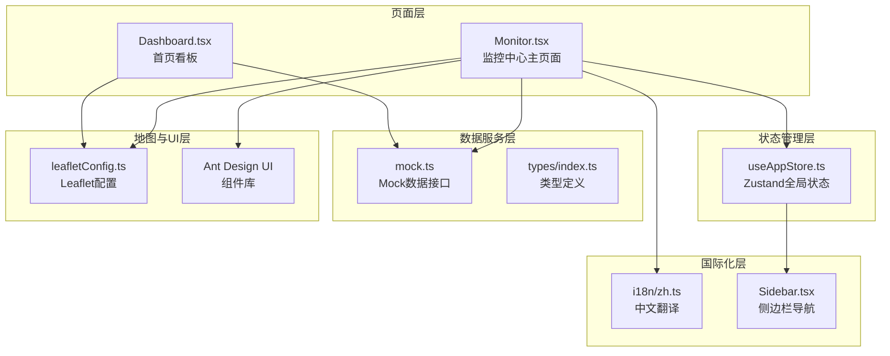
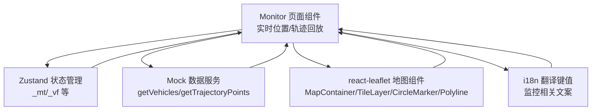
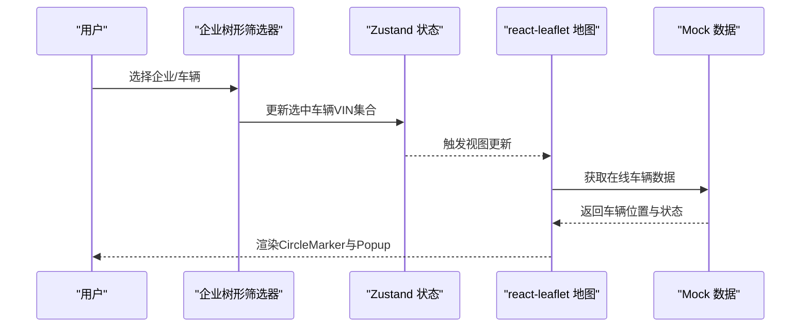
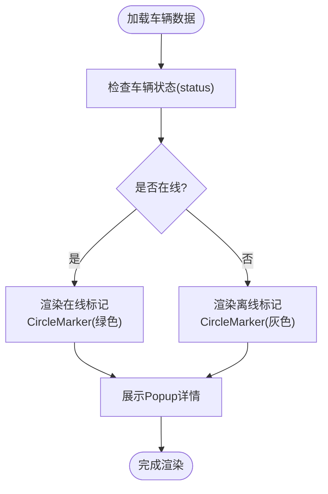
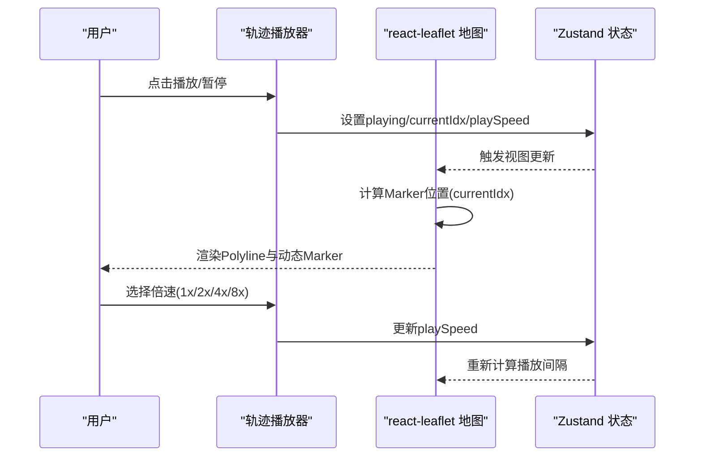
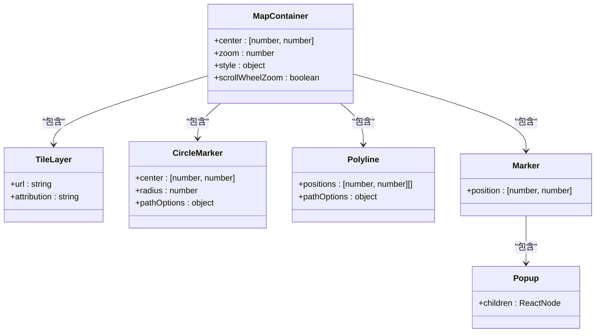
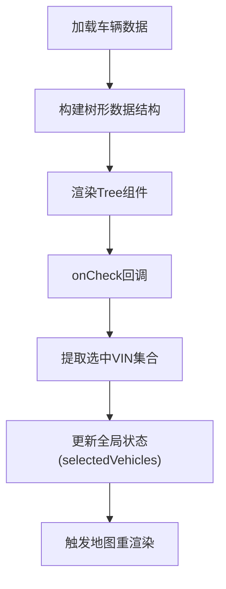
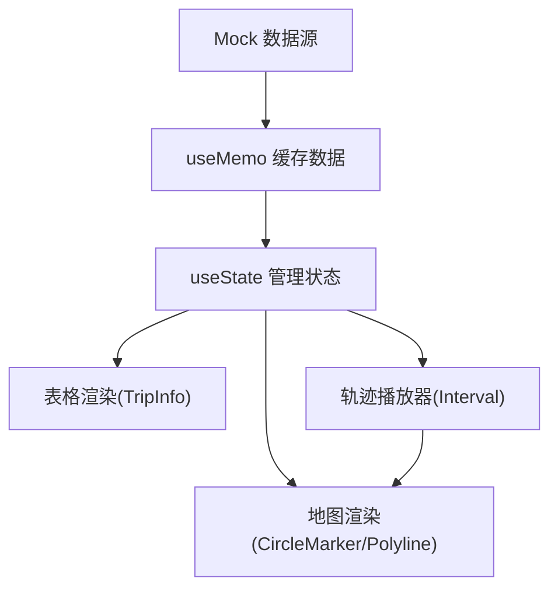
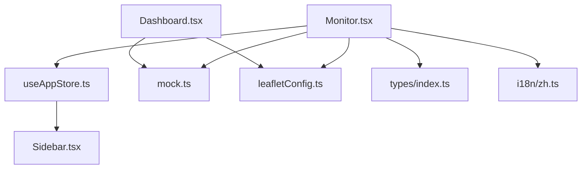

# 监控中心

<cite>
**本文档引用的文件**
- [Monitor.tsx](file://weidu-fleet/src/pages/Monitor.tsx)
- [useAppStore.ts](file://weidu-fleet/src/store/useAppStore.ts)
- [mock.ts](file://weidu-fleet/src/api/mock.ts)
- [index.ts](file://weidu-fleet/src/types/index.ts)
- [leafletConfig.ts](file://weidu-fleet/src/utils/leafletConfig.ts)
- [zh.ts](file://weidu-fleet/src/i18n/zh.ts)
- [Sidebar.tsx](file://weidu-fleet/src/components/Layout/Sidebar.tsx)
- [Dashboard.tsx](file://weidu-fleet/src/pages/Dashboard.tsx)
</cite>

## 目录
1. [简介](#简介)
2. [项目结构](#项目结构)
3. [核心组件](#核心组件)
4. [架构总览](#架构总览)
5. [详细组件分析](#详细组件分析)
6. [依赖关系分析](#依赖关系分析)
7. [性能考虑](#性能考虑)
8. [故障排除指南](#故障排除指南)
9. [结论](#结论)
10. [附录](#附录)

## 简介
监控中心模块为智利车队管理平台提供实时车辆位置监控与历史轨迹回放能力。该模块通过地图组件集成、车辆树形筛选器、轨迹播放器以及多语言国际化支持，实现对车队运营状态的可视化掌控。本文档将深入解析其实时监控面板的设计架构，涵盖车辆位置监控、在线离线状态管理、轨迹回放功能与地图集成实现，并详细说明监控数据的采集流程、处理逻辑与可视化展示方式。

## 项目结构
监控中心模块位于前端工程的页面层，采用基于 React 的组件化架构，结合 Ant Design UI 组件库与 react-leaflet 地图组件实现丰富的交互体验。整体结构围绕 Monitor 页面展开，配合全局状态管理、Mock 数据服务与类型定义，形成完整的监控数据闭环。

**图表来源**
- [Monitor.tsx:1-268](file://weidu-fleet/src/pages/Monitor.tsx#L1-L268)
- [useAppStore.ts:1-87](file://weidu-fleet/src/store/useAppStore.ts#L1-L87)
- [mock.ts:1-634](file://weidu-fleet/src/api/mock.ts#L1-L634)
- [index.ts:1-214](file://weidu-fleet/src/types/index.ts#L1-L214)
- [leafletConfig.ts:1-14](file://weidu-fleet/src/utils/leafletConfig.ts#L1-L14)
- [zh.ts:1-424](file://weidu-fleet/src/i18n/zh.ts#L1-L424)
- [Sidebar.tsx:1-38](file://weidu-fleet/src/components/Layout/Sidebar.tsx#L1-L38)
- [Dashboard.tsx:190-256](file://weidu-fleet/src/pages/Dashboard.tsx#L190-L256)

**章节来源**
- [Monitor.tsx:1-268](file://weidu-fleet/src/pages/Monitor.tsx#L1-L268)
- [useAppStore.ts:1-87](file://weidu-fleet/src/store/useAppStore.ts#L1-L87)
- [mock.ts:1-634](file://weidu-fleet/src/api/mock.ts#L1-L634)
- [index.ts:1-214](file://weidu-fleet/src/types/index.ts#L1-L214)
- [leafletConfig.ts:1-14](file://weidu-fleet/src/utils/leafletConfig.ts#L1-L14)
- [zh.ts:1-424](file://weidu-fleet/src/i18n/zh.ts#L1-L424)
- [Sidebar.tsx:1-38](file://weidu-fleet/src/components/Layout/Sidebar.tsx#L1-L38)
- [Dashboard.tsx:190-256](file://weidu-fleet/src/pages/Dashboard.tsx#L190-L256)

## 核心组件
- 实时位置面板：左侧企业树形筛选器 + 右侧地图展示在线车辆位置，支持多选筛选与弹窗详情。
- 轨迹回放面板：左侧车辆列表 + 中央地图轨迹播放 + 底部表格展示行程信息，支持播放/暂停与倍速控制。
- 全局状态管理：通过 Zustand 管理页面切换状态与筛选条件，驱动视图渲染。
- 地图集成：基于 react-leaflet 的 MapContainer、TileLayer、CircleMarker、Polyline、Marker、Popup 等组件实现地图渲染与交互。
- 国际化支持：多语言翻译键值覆盖监控相关文案，确保不同语言环境下的用户体验一致性。

**章节来源**
- [Monitor.tsx:106-264](file://weidu-fleet/src/pages/Monitor.tsx#L106-L264)
- [useAppStore.ts:55-75](file://weidu-fleet/src/store/useAppStore.ts#L55-L75)
- [mock.ts:71-102](file://weidu-fleet/src/api/mock.ts#L71-L102)
- [index.ts:159-174](file://weidu-fleet/src/types/index.ts#L159-L174)
- [leafletConfig.ts:1-14](file://weidu-fleet/src/utils/leafletConfig.ts#L1-L14)
- [zh.ts:219-231](file://weidu-fleet/src/i18n/zh.ts#L219-L231)

## 架构总览
监控中心模块采用“页面组件 + 状态管理 + 数据服务 + 地图组件 + 国际化”的分层架构。页面组件负责视图渲染与用户交互；状态管理统一维护页面切换与筛选状态；数据服务提供模拟数据；地图组件负责地理信息可视化；国际化层保证多语言支持。

**图表来源**
- [Monitor.tsx:13-268](file://weidu-fleet/src/pages/Monitor.tsx#L13-L268)
- [useAppStore.ts:40-87](file://weidu-fleet/src/store/useAppStore.ts#L40-L87)
- [mock.ts:27-102](file://weidu-fleet/src/api/mock.ts#L27-L102)
- [leafletConfig.ts:1-14](file://weidu-fleet/src/utils/leafletConfig.ts#L1-L14)
- [zh.ts:219-231](file://weidu-fleet/src/i18n/zh.ts#L219-L231)

## 详细组件分析

### 实时位置监控
实时位置监控通过左侧企业树形筛选器与右侧地图实现。树形筛选器支持多选企业与车辆，筛选结果映射到地图上的车辆标记。地图使用 react-leaflet 的 CircleMarker 进行车辆位置标注，并在 Popup 中展示车辆详情。

**图表来源**
- [Monitor.tsx:116-159](file://weidu-fleet/src/pages/Monitor.tsx#L116-L159)
- [useAppStore.ts:71-75](file://weidu-fleet/src/store/useAppStore.ts#L71-L75)
- [mock.ts:72-78](file://weidu-fleet/src/api/mock.ts#L72-L78)

**章节来源**
- [Monitor.tsx:106-159](file://weidu-fleet/src/pages/Monitor.tsx#L106-L159)
- [mock.ts:7-25](file://weidu-fleet/src/api/mock.ts#L7-L25)
- [index.ts:1-19](file://weidu-fleet/src/types/index.ts#L1-L19)

### 在线离线状态管理
在线离线状态由车辆数据中的 status 字段决定。Mock 数据中部分车辆被初始化为离线状态，其余为在线状态。实时位置面板根据状态选择性渲染车辆标记颜色与 Popup 内容。

**图表来源**
- [mock.ts:7-25](file://weidu-fleet/src/api/mock.ts#L7-L25)
- [mock.ts:72-78](file://weidu-fleet/src/api/mock.ts#L72-L78)
- [Monitor.tsx:136-152](file://weidu-fleet/src/pages/Monitor.tsx#L136-L152)

**章节来源**
- [mock.ts:7-25](file://weidu-fleet/src/api/mock.ts#L7-L25)
- [Monitor.tsx:136-152](file://weidu-fleet/src/pages/Monitor.tsx#L136-L152)

### 轨迹回放功能
轨迹回放功能包含轨迹播放器与行程表格两部分。播放器通过 Polyline 展示历史轨迹，Marker 动态跟随播放进度，Tooltip 显示实时速度与里程信息。播放器支持播放/暂停与倍速控制，底部表格展示行程起止位置、时间与距离等信息。

**图表来源**
- [Monitor.tsx:30-76](file://weidu-fleet/src/pages/Monitor.tsx#L30-L76)
- [Monitor.tsx:161-249](file://weidu-fleet/src/pages/Monitor.tsx#L161-L249)
- [useAppStore.ts:71-75](file://weidu-fleet/src/store/useAppStore.ts#L71-L75)

**章节来源**
- [Monitor.tsx:30-76](file://weidu-fleet/src/pages/Monitor.tsx#L30-L76)
- [Monitor.tsx:161-249](file://weidu-fleet/src/pages/Monitor.tsx#L161-L249)
- [mock.ts:80-102](file://weidu-fleet/src/api/mock.ts#L80-L102)

### 地图集成实现
地图集成通过 react-leaflet 提供的组件实现。Leaflet 默认图标路径在打包工具中可能缺失，因此通过 leafletConfig.ts 进行修复。地图组件支持瓦片图层、圆形标记、折线绘制、标记与弹窗等基础功能。

**图表来源**
- [Monitor.tsx:134-153](file://weidu-fleet/src/pages/Monitor.tsx#L134-L153)
- [Monitor.tsx:190-211](file://weidu-fleet/src/pages/Monitor.tsx#L190-L211)
- [leafletConfig.ts:1-14](file://weidu-fleet/src/utils/leafletConfig.ts#L1-L14)

**章节来源**
- [Monitor.tsx:134-153](file://weidu-fleet/src/pages/Monitor.tsx#L134-L153)
- [Monitor.tsx:190-211](file://weidu-fleet/src/pages/Monitor.tsx#L190-L211)
- [leafletConfig.ts:1-14](file://weidu-fleet/src/utils/leafletConfig.ts#L1-L14)

### 车辆树形筛选器
车辆树形筛选器采用 Ant Design Tree 组件，支持多选与懒加载。筛选器的数据来源于 Mock 车辆列表，通过 onCheck 回调提取选中的车辆VIN集合，并更新全局状态以驱动地图渲染。

**图表来源**
- [Monitor.tsx:82-129](file://weidu-fleet/src/pages/Monitor.tsx#L82-L129)
- [useAppStore.ts:71-75](file://weidu-fleet/src/store/useAppStore.ts#L71-L75)

**章节来源**
- [Monitor.tsx:82-129](file://weidu-fleet/src/pages/Monitor.tsx#L82-L129)
- [mock.ts:7-25](file://weidu-fleet/src/api/mock.ts#L7-L25)

### 监控数据采集流程与处理逻辑
监控数据的采集与处理遵循以下流程：
- 数据源：Mock 数据服务提供车辆、轨迹点与行程信息。
- 数据处理：页面组件通过 useMemo 缓存数据，避免重复计算；通过 useState 管理筛选与播放状态。
- 可视化：地图组件根据数据渲染标记与轨迹；表格组件展示行程详情。
- 状态驱动：Zustand 状态管理统一协调页面切换与筛选条件。

**图表来源**
- [mock.ts:27-102](file://weidu-fleet/src/api/mock.ts#L27-L102)
- [Monitor.tsx:17-20](file://weidu-fleet/src/pages/Monitor.tsx#L17-L20)
- [Monitor.tsx:30-76](file://weidu-fleet/src/pages/Monitor.tsx#L30-L76)

**章节来源**
- [mock.ts:27-102](file://weidu-fleet/src/api/mock.ts#L27-L102)
- [Monitor.tsx:17-20](file://weidu-fleet/src/pages/Monitor.tsx#L17-L20)
- [Monitor.tsx:30-76](file://weidu-fleet/src/pages/Monitor.tsx#L30-L76)

## 依赖关系分析
监控中心模块的依赖关系清晰且分层明确。页面组件依赖状态管理与数据服务，地图组件依赖 Leaflet 配置，国际化层为所有文本提供翻译支持。

**图表来源**
- [Monitor.tsx:1-11](file://weidu-fleet/src/pages/Monitor.tsx#L1-L11)
- [useAppStore.ts:1-4](file://weidu-fleet/src/store/useAppStore.ts#L1-L4)
- [mock.ts:1-2](file://weidu-fleet/src/api/mock.ts#L1-L2)
- [leafletConfig.ts:1-2](file://weidu-fleet/src/utils/leafletConfig.ts#L1-L2)
- [index.ts:1-2](file://weidu-fleet/src/types/index.ts#L1-L2)
- [zh.ts:1-2](file://weidu-fleet/src/i18n/zh.ts#L1-L2)
- [Sidebar.tsx:19-34](file://weidu-fleet/src/components/Layout/Sidebar.tsx#L19-L34)
- [Dashboard.tsx:190-236](file://weidu-fleet/src/pages/Dashboard.tsx#L190-L236)

**章节来源**
- [Monitor.tsx:1-11](file://weidu-fleet/src/pages/Monitor.tsx#L1-L11)
- [useAppStore.ts:1-4](file://weidu-fleet/src/store/useAppStore.ts#L1-L4)
- [mock.ts:1-2](file://weidu-fleet/src/api/mock.ts#L1-L2)
- [leafletConfig.ts:1-2](file://weidu-fleet/src/utils/leafletConfig.ts#L1-L2)
- [index.ts:1-2](file://weidu-fleet/src/types/index.ts#L1-L2)
- [zh.ts:1-2](file://weidu-fleet/src/i18n/zh.ts#L1-L2)
- [Sidebar.tsx:19-34](file://weidu-fleet/src/components/Layout/Sidebar.tsx#L19-L34)
- [Dashboard.tsx:190-236](file://weidu-fleet/src/pages/Dashboard.tsx#L190-L236)

## 性能考虑
- 数据缓存：使用 useMemo 对车辆、轨迹点与行程数据进行缓存，减少不必要的重复计算。
- 状态管理：通过 Zustand 的持久化中间件仅存储必要字段，降低内存占用。
- 地图渲染：在大规模车辆场景下，建议实现标记聚合与按需加载策略，避免一次性渲染过多 Marker。
- 播放器优化：播放器使用 setInterval 控制播放节奏，建议在组件卸载时清理定时器，防止内存泄漏。
- 国际化：翻译键值集中管理，避免重复字符串，提升维护效率。

[本节为通用性能建议，无需特定文件引用]

## 故障排除指南
- 地图图标缺失：若出现默认 Leaflet 图标路径错误，需确保已引入 leafletConfig.ts 并正确合并图标资源。
- 播放器无法停止：检查播放器的 useEffect 清理逻辑，确保在 playing=false 或组件卸载时清除定时器。
- 树形筛选器无响应：确认 onCheck 回调中提取的键值与车辆VIN映射正确，避免状态更新失败。
- 国际化文案不显示：检查翻译键值是否存在，确保页面中使用的 t 函数能正确解析对应键。

**章节来源**
- [leafletConfig.ts:1-14](file://weidu-fleet/src/utils/leafletConfig.ts#L1-L14)
- [Monitor.tsx:36-59](file://weidu-fleet/src/pages/Monitor.tsx#L36-L59)
- [Monitor.tsx:122-126](file://weidu-fleet/src/pages/Monitor.tsx#L122-L126)
- [zh.ts:219-231](file://weidu-fleet/src/i18n/zh.ts#L219-L231)

## 结论
监控中心模块通过清晰的分层架构与完善的组件设计，实现了车辆实时位置监控与轨迹回放的核心功能。其依赖于状态管理、Mock 数据服务与 react-leaflet 地图组件，辅以国际化支持，为用户提供直观、高效的车队监控体验。未来可在地图渲染优化、播放器性能与状态持久化方面进一步改进，以适配更大规模的车队数据场景。

[本节为总结性内容，无需特定文件引用]

## 附录
- 操作指南
  - 实时位置：在左侧树形筛选器中勾选企业或车辆，右侧地图将高亮显示选中车辆的位置与状态。
  - 轨迹回放：在左侧选择目标车辆，中央地图将展示历史轨迹，点击播放按钮开始回放，支持倍速调节。
  - 行程表格：底部表格展示行程的起止位置、时间与距离等关键信息，便于快速查阅。
- 性能优化建议
  - 使用虚拟滚动或分页加载大型数据集。
  - 合理设置地图缩放阈值，避免在高缩放下渲染过多标记。
  - 将播放器的定时器与组件生命周期绑定，确保在组件卸载时及时清理。
- 常见问题
  - 若地图图标不显示，请确认已正确引入 leafletConfig.ts。
  - 若播放器无法停止，请检查 useEffect 的清理逻辑是否生效。
  - 若筛选器无响应，请核对 onCheck 回调中的键值提取逻辑。

[本节为操作与维护指南，无需特定文件引用]