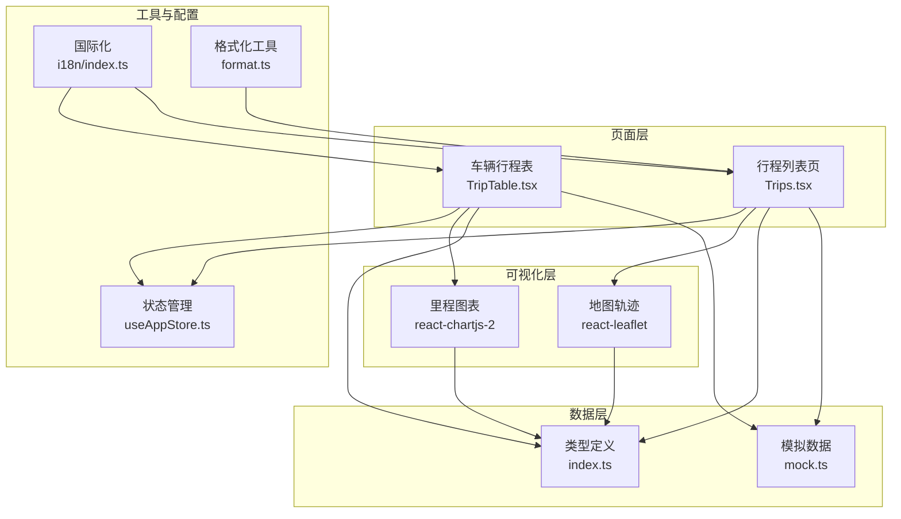
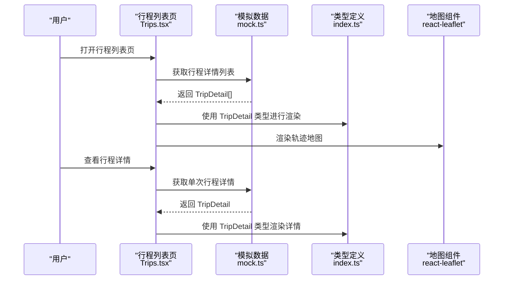
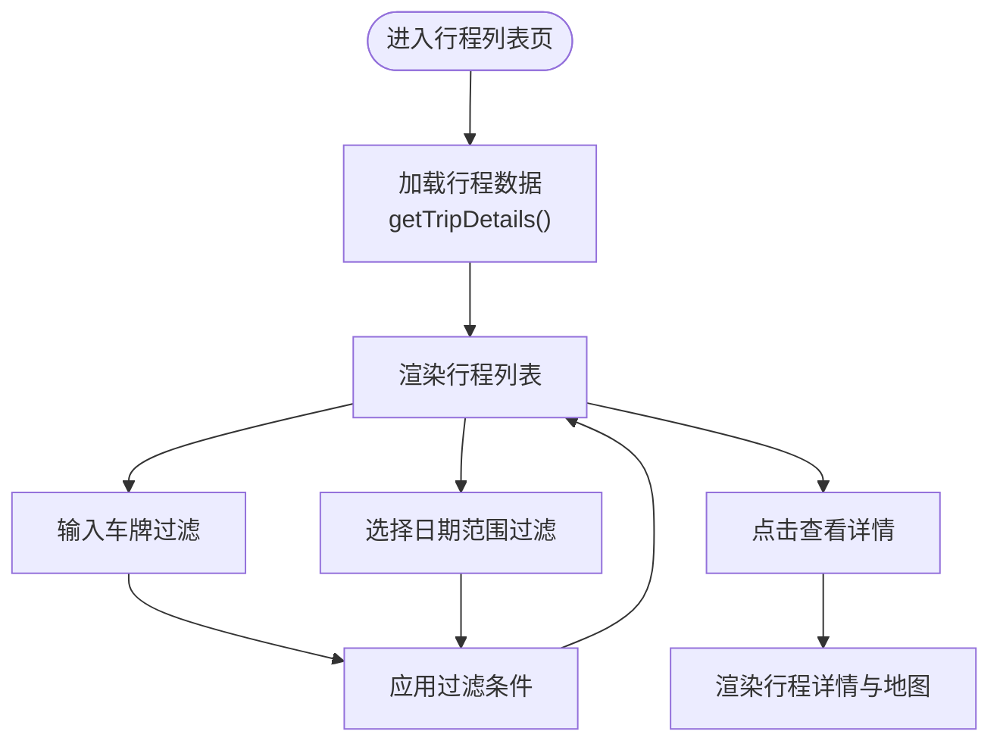
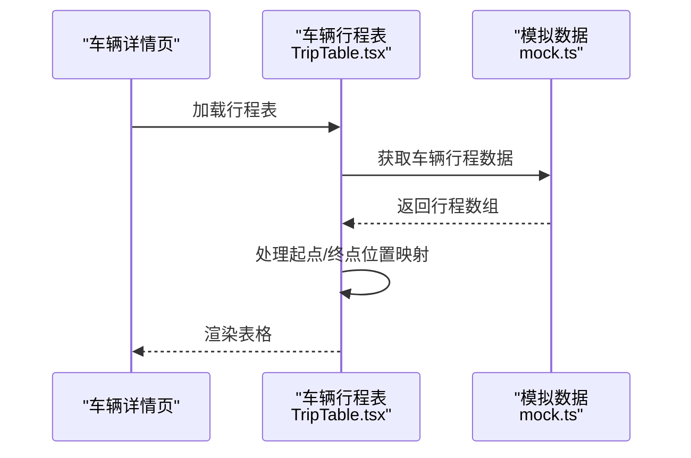
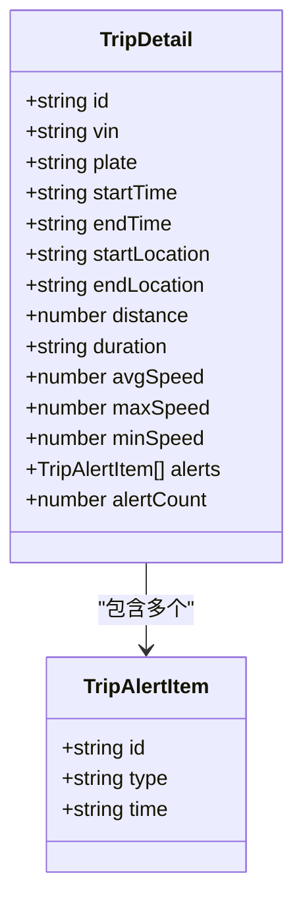
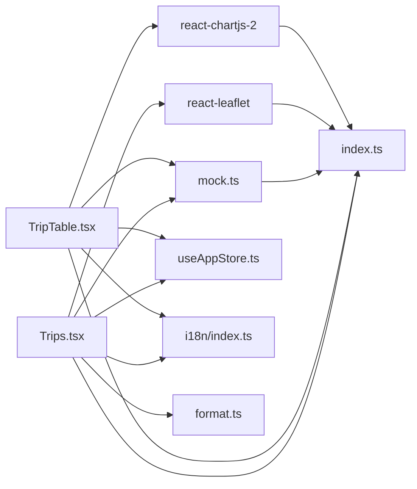

# 行程管理

<cite>
**本文档引用的文件**
- [Trips.tsx](file://weidu-fleet/src/pages/Trips.tsx)
- [TripTable.tsx](file://weidu-fleet/src/pages/Vehicles/TripTable.tsx)
- [index.ts（类型定义）](file://weidu-fleet/src/types/index.ts)
- [mock.ts（模拟数据）](file://weidu-fleet/src/api/mock.ts)
- [useAppStore.ts（状态管理）](file://weidu-fleet/src/store/useAppStore.ts)
- [package.json（依赖）](file://weidu-fleet/package.json)
- [MileageChart.tsx（里程图表）](file://weidu-fleet/src/pages/Vehicles/MileageChart.tsx)
- [AppLayout.tsx（布局）](file://weidu-fleet/src/components/Layout/AppLayout.tsx)
- [index.ts（国际化）](file://weidu-fleet/src/i18n/index.ts)
- [format.ts（格式化工具）](file://weidu-fleet/src/utils/format.ts)
</cite>

## 目录
1. [简介](#简介)
2. [项目结构](#项目结构)
3. [核心组件](#核心组件)
4. [架构概览](#架构概览)
5. [详细组件分析](#详细组件分析)
6. [依赖关系分析](#依赖关系分析)
7. [性能考虑](#性能考虑)
8. [故障排除指南](#故障排除指南)
9. [结论](#结论)
10. [附录](#附录)

## 简介
本文件为智利车队管理平台的行程管理模块综合文档，重点介绍行程数据的采集、存储与管理机制，涵盖行程轨迹记录、行程详情分析、历史行程查询等功能。文档详细说明了行程数据的格式规范、存储策略与检索优化方法，并提供行程统计分析、油耗计算、行程报告生成与异常行程识别的实现思路。同时包含行程数据的可视化展示、导出功能以及与监控系统的数据同步机制。

## 项目结构
行程管理模块主要由以下部分组成：
- 页面组件：行程列表页与车辆详情中的行程表格
- 类型定义：TripDetail、TripInfo、TrajectoryPoint 等核心数据模型
- 模拟数据：行程详情、轨迹点、车辆行程等 mock 数据
- 可视化：地图轨迹展示与里程图表
- 工具与配置：国际化、时间格式化、状态管理

**图表来源**
- [Trips.tsx:1-231](file://weidu-fleet/src/pages/Trips.tsx#L1-L231)
- [TripTable.tsx:1-30](file://weidu-fleet/src/pages/Vehicles/TripTable.tsx#L1-L30)
- [index.ts（类型定义）:159-202](file://weidu-fleet/src/types/index.ts#L159-L202)
- [mock.ts（模拟数据）:80-102](file://weidu-fleet/src/api/mock.ts#L80-L102)
- [MileageChart.tsx（里程图表）:1-76](file://weidu-fleet/src/pages/Vehicles/MileageChart.tsx#L1-L76)
- [useAppStore.ts（状态管理）:1-87](file://weidu-fleet/src/store/useAppStore.ts#L1-L87)
- [index.ts（国际化）:1-30](file://weidu-fleet/src/i18n/index.ts#L1-L30)
- [format.ts（格式化工具）:1-27](file://weidu-fleet/src/utils/format.ts#L1-L27)

**章节来源**
- [Trips.tsx:1-231](file://weidu-fleet/src/pages/Trips.tsx#L1-L231)
- [TripTable.tsx:1-30](file://weidu-fleet/src/pages/Vehicles/TripTable.tsx#L1-L30)
- [index.ts（类型定义）:159-202](file://weidu-fleet/src/types/index.ts#L159-L202)
- [mock.ts（模拟数据）:80-102](file://weidu-fleet/src/api/mock.ts#L80-L102)
- [MileageChart.tsx（里程图表）:1-76](file://weidu-fleet/src/pages/Vehicles/MileageChart.tsx#L1-L76)
- [useAppStore.ts（状态管理）:1-87](file://weidu-fleet/src/store/useAppStore.ts#L1-L87)
- [index.ts（国际化）:1-30](file://weidu-fleet/src/i18n/index.ts#L1-L30)
- [format.ts（格式化工具）:1-27](file://weidu-fleet/src/utils/format.ts#L1-L27)

## 核心组件
- 行程详情模型（TripDetail）
  - 字段：id、vin、plate、startTime、endTime、startLocation、endLocation、distance、duration、avgSpeed、maxSpeed、minSpeed、alerts、alertCount
  - 用途：用于展示单次行程的完整信息与异常事件
- 行程信息模型（TripInfo）
  - 字段：id、plate、startLocation、endLocation、startTime、endTime、duration、distance
  - 用途：用于列表页展示基础行程信息
- 轨迹点模型（TrajectoryPoint）
  - 字段：lat、lng、time
  - 用途：用于地图轨迹绘制
- 异常事件项（TripAlertItem）
  - 字段：id、type、time
  - 用途：记录行程过程中的异常事件

**章节来源**
- [index.ts（类型定义）:159-202](file://weidu-fleet/src/types/index.ts#L159-L202)

## 架构概览
行程管理模块采用前端模拟数据驱动的架构，通过 mock 数据提供完整的 CRUD 场景演示。页面组件负责数据展示与交互，类型定义确保数据一致性，可视化组件负责地图与图表渲染，工具与配置提供国际化与时间格式化支持。

**图表来源**
- [Trips.tsx:17-31](file://weidu-fleet/src/pages/Trips.tsx#L17-L31)
- [mock.ts（模拟数据）:380-387](file://weidu-fleet/src/api/mock.ts#L380-L387)
- [index.ts（类型定义）:187-202](file://weidu-fleet/src/types/index.ts#L187-L202)

## 详细组件分析

### 行程列表页（Trips.tsx）
- 功能概述
  - 支持按车牌过滤与时间范围筛选
  - 展示行程基础信息（开始/结束时间、起点/终点、里程、时长、平均速度、预警次数）
  - 提供“查看详情”跳转至行程详情页
- 关键实现要点
  - 使用本地状态维护筛选条件与数据集
  - 通过 mock 接口获取行程详情列表
  - 使用 Ant Design 的 Table 组件进行数据展示
  - 使用 react-leaflet 进行地图轨迹展示
- 交互流程
  - 输入车牌或选择日期范围后点击搜索
  - 点击“查看详情”进入详情模式，展示行程详情与异常事件列表

**图表来源**
- [Trips.tsx:30-60](file://weidu-fleet/src/pages/Trips.tsx#L30-L60)
- [Trips.tsx:185-225](file://weidu-fleet/src/pages/Trips.tsx#L185-L225)

**章节来源**
- [Trips.tsx:1-231](file://weidu-fleet/src/pages/Trips.tsx#L1-L231)

### 车辆行程表（TripTable.tsx）
- 功能概述
  - 在车辆详情页展示该车辆的历史行程
  - 显示开始/结束时间、起点/终点、里程、时长、平均速度、预警次数
- 关键实现要点
  - 使用 useMemo 缓存数据处理结果
  - 通过 mock 接口获取车辆行程数据
  - 基于 Ant Design Table 组件展示

**图表来源**
- [TripTable.tsx:8-15](file://weidu-fleet/src/pages/Vehicles/TripTable.tsx#L8-L15)
- [mock.ts（模拟数据）:574-583](file://weidu-fleet/src/api/mock.ts#L574-L583)

**章节来源**
- [TripTable.tsx:1-30](file://weidu-fleet/src/pages/Vehicles/TripTable.tsx#L1-L30)

### 行程详情模型（TripDetail）
- 数据结构
  - 基础信息：id、vin、plate、startTime、endTime、startLocation、endLocation
  - 行程指标：distance、duration、avgSpeed、maxSpeed、minSpeed
  - 异常事件：alerts（TripAlertItem 数组）、alertCount
- 用途
  - 作为详情页的数据载体，支撑地图轨迹与异常事件展示

**图表来源**
- [index.ts（类型定义）:187-202](file://weidu-fleet/src/types/index.ts#L187-L202)

**章节来源**
- [index.ts（类型定义）:187-202](file://weidu-fleet/src/types/index.ts#L187-L202)

### 轨迹点模型（TrajectoryPoint）
- 数据结构
  - lat、lng、time
- 用途
  - 作为地图轨迹绘制的基础数据

**章节来源**
- [index.ts（类型定义）:159-163](file://weidu-fleet/src/types/index.ts#L159-L163)

### 模拟数据接口（mock.ts）
- 行程详情数据
  - 提供 getTripDetails() 与 getTripDetailById() 接口
  - 返回 TripDetail[] 或单个 TripDetail
- 轨迹点数据
  - 提供 getTrajectoryPoints() 接口
  - 返回 TrajectoryPoint[] 用于地图轨迹绘制
- 车辆行程数据
  - 提供 getVehicleTrips() 接口
  - 返回行程基础字段数组，便于表格展示

**章节来源**
- [mock.ts（模拟数据）:80-102](file://weidu-fleet/src/api/mock.ts#L80-L102)
- [mock.ts（模拟数据）:380-387](file://weidu-fleet/src/api/mock.ts#L380-L387)
- [mock.ts（模拟数据）:574-583](file://weidu-fleet/src/api/mock.ts#L574-L583)

### 里程图表（MileageChart.tsx）
- 功能概述
  - 支持日/周/月/年周期切换
  - 使用 react-chartjs-2 渲染折线图
- 关键实现要点
  - 注册 Chart.js 组件以启用折线图功能
  - 通过 Radio.Group 切换周期
  - 配置 Chart.js 选项以优化显示效果

**章节来源**
- [MileageChart.tsx（里程图表）:1-76](file://weidu-fleet/src/pages/Vehicles/MileageChart.tsx#L1-L76)

### 国际化与时间格式化
- 国际化
  - 从本地存储恢复语言设置
  - 支持中/英/西三种语言
- 时间格式化
  - 使用 dayjs 进行时区处理与格式化
  - 提供时长格式化与年龄计算工具

**章节来源**
- [index.ts（国际化）:1-30](file://weidu-fleet/src/i18n/index.ts#L1-L30)
- [format.ts（格式化工具）:1-27](file://weidu-fleet/src/utils/format.ts#L1-L27)

## 依赖关系分析
- 组件依赖
  - Trips.tsx 依赖 mock.ts 提供的 getTripDetails() 与 react-leaflet 进行地图渲染
  - TripTable.tsx 依赖 mock.ts 提供的 getVehicleTrips() 与 react-chartjs-2 进行图表渲染
- 类型依赖
  - 所有组件均依赖 index.ts 中的类型定义，确保数据结构一致
- 工具依赖
  - format.ts 为时间与时长格式化提供统一工具
  - useAppStore.ts 提供全局状态管理能力

**图表来源**
- [Trips.tsx:1-20](file://weidu-fleet/src/pages/Trips.tsx#L1-L20)
- [TripTable.tsx:1-5](file://weidu-fleet/src/pages/Vehicles/TripTable.tsx#L1-L5)
- [mock.ts（模拟数据）:1-1](file://weidu-fleet/src/api/mock.ts#L1-L1)
- [index.ts（类型定义）:1-261](file://weidu-fleet/src/types/index.ts#L1-L261)
- [useAppStore.ts（状态管理）:1-87](file://weidu-fleet/src/store/useAppStore.ts#L1-L87)
- [index.ts（国际化）:1-30](file://weidu-fleet/src/i18n/index.ts#L1-L30)
- [format.ts（格式化工具）:1-27](file://weidu-fleet/src/utils/format.ts#L1-L27)

**章节来源**
- [package.json（依赖）:11-26](file://weidu-fleet/package.json#L11-L26)

## 性能考虑
- 数据缓存
  - 使用 useMemo 对车辆行程数据进行缓存，避免重复计算
- 渲染优化
  - 表格组件启用分页与横向滚动，提升大数据量下的渲染性能
- 图表优化
  - 折线图启用响应式与最小化插件配置，减少不必要的渲染开销
- 状态持久化
  - 使用 Zustand 的 persist 中间件将用户偏好与语言设置持久化到本地存储

**章节来源**
- [TripTable.tsx:9-15](file://weidu-fleet/src/pages/Vehicles/TripTable.tsx#L9-L15)
- [Trips.tsx:218-224](file://weidu-fleet/src/pages/Trips.tsx#L218-L224)
- [MileageChart.tsx（里程图表）:48-56](file://weidu-fleet/src/pages/Vehicles/MileageChart.tsx#L48-L56)
- [useAppStore.ts（状态管理）:76-85](file://weidu-fleet/src/store/useAppStore.ts#L76-L85)

## 故障排除指南
- 行程数据为空
  - 检查 mock 数据接口是否正确返回数据
  - 确认页面组件是否正确调用 getTripDetails() 或 getVehicleTrips()
- 地图不显示轨迹
  - 确认轨迹点数据格式符合 TrajectoryPoint 定义
  - 检查 react-leaflet 的 TileLayer 与 Polyline 配置
- 语言设置不生效
  - 检查本地存储中 weidu-fleet-storage 的 lang 字段
  - 确认 i18n 初始化逻辑是否正确读取语言设置
- 时间显示异常
  - 使用 format.ts 中的时间格式化工具进行统一处理
  - 确认时区设置与目标时区一致

**章节来源**
- [mock.ts（模拟数据）:80-102](file://weidu-fleet/src/api/mock.ts#L80-L102)
- [index.ts（类型定义）:159-163](file://weidu-fleet/src/types/index.ts#L159-L163)
- [index.ts（国际化）:7-20](file://weidu-fleet/src/i18n/index.ts#L7-L20)
- [format.ts（格式化工具）:25-27](file://weidu-fleet/src/utils/format.ts#L25-L27)

## 结论
本文件系统性地梳理了智利车队管理平台的行程管理模块，明确了数据模型、页面组件、可视化与工具链之间的关系。通过 mock 数据驱动的架构，模块实现了从数据采集、存储到展示与分析的完整闭环。未来可在此基础上接入真实后端服务，完善油耗计算、异常识别与数据导出等功能。

## 附录
- 数据格式规范
  - 行程详情：TripDetail
  - 行程信息：TripInfo
  - 轨迹点：TrajectoryPoint
  - 异常事件：TripAlertItem
- 存储策略建议
  - 使用本地持久化存储用户偏好与语言设置
  - 对高频访问数据进行缓存，减少重复请求
- 检索优化方法
  - 列表页支持按车牌与时间范围过滤
  - 表格组件启用分页与横向滚动
- 可视化展示
  - 地图轨迹使用 react-leaflet
  - 里程图表使用 react-chartjs-2
- 导出与同步
  - 可基于现有数据结构扩展导出功能
  - 与监控系统集成可通过 mock 接口抽象为真实 API