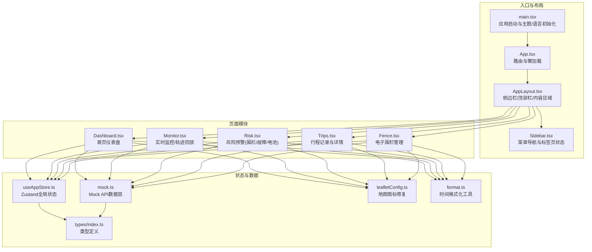
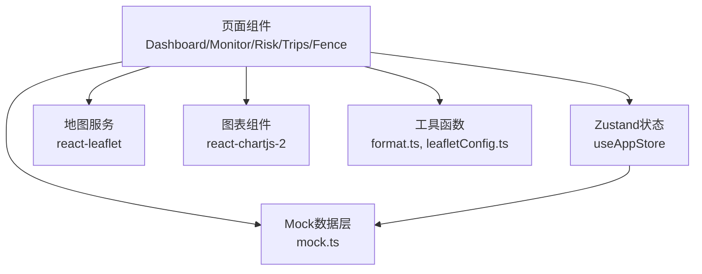
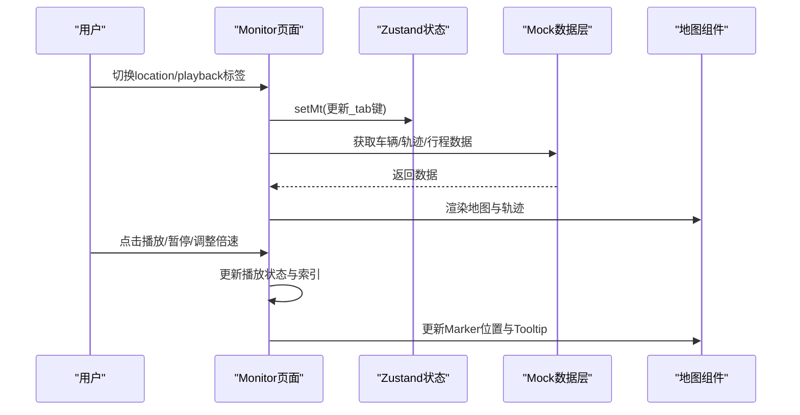
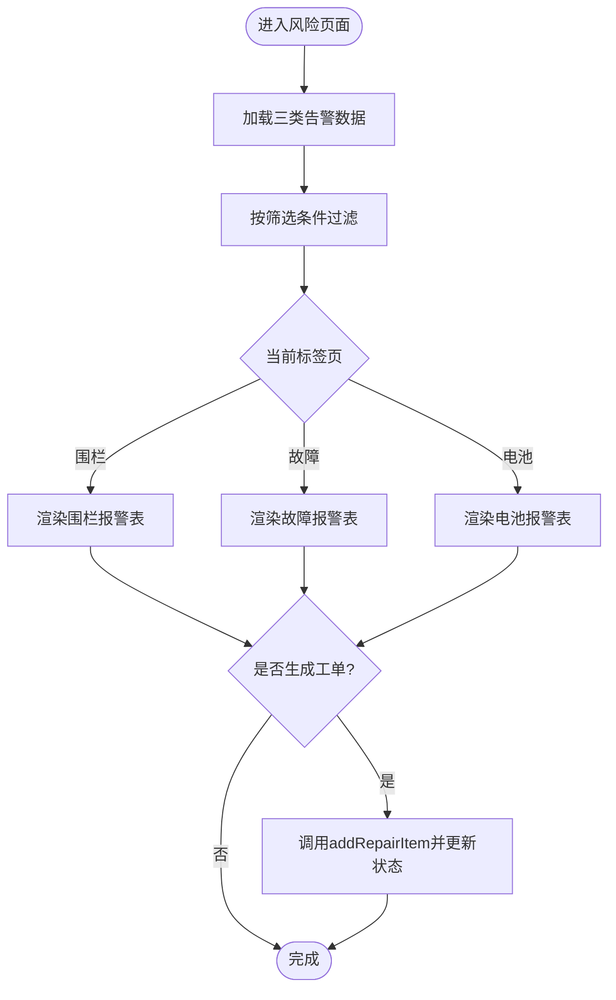
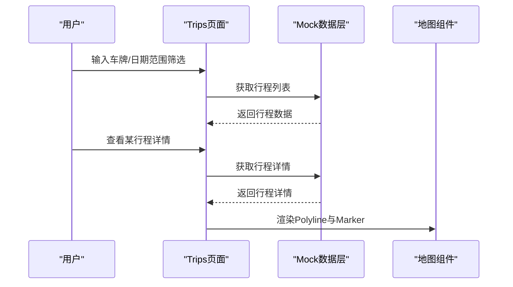
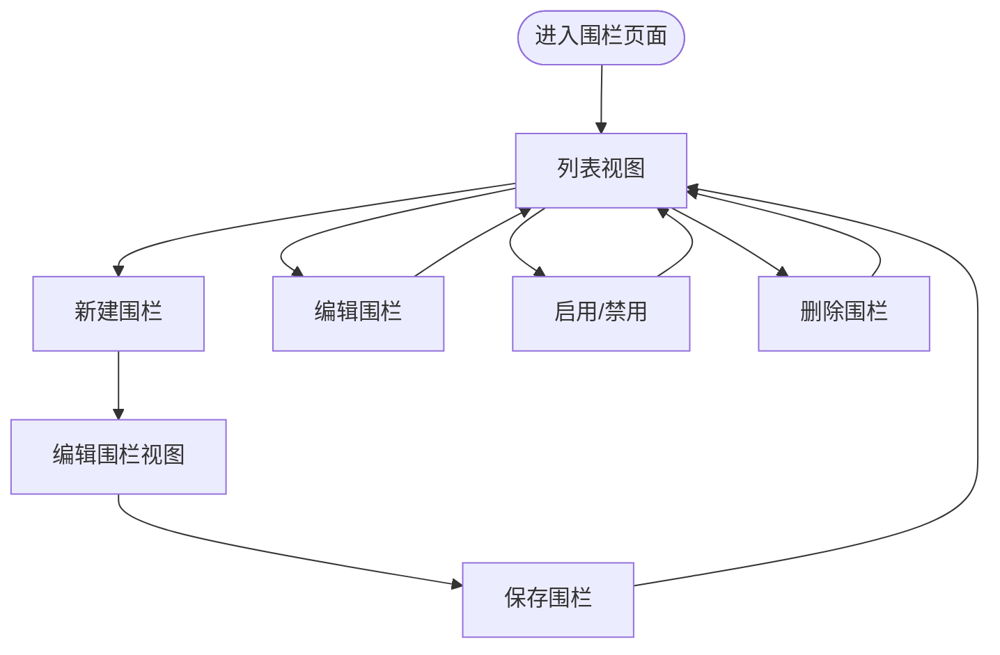
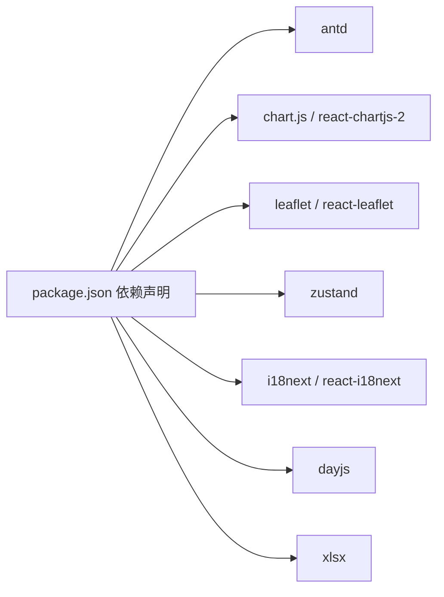

# 运营监控系统

<cite>
**本文档引用的文件**
- [App.tsx](file://weidu-fleet/src/App.tsx)
- [main.tsx](file://weidu-fleet/src/main.tsx)
- [Dashboard.tsx](file://weidu-fleet/src/pages/Dashboard.tsx)
- [Monitor.tsx](file://weidu-fleet/src/pages/Monitor.tsx)
- [Risk.tsx](file://weidu-fleet/src/pages/Risk.tsx)
- [Fence.tsx](file://weidu-fleet/src/pages/Fence.tsx)
- [Trips.tsx](file://weidu-fleet/src/pages/Trips.tsx)
- [useAppStore.ts](file://weidu-fleet/src/store/useAppStore.ts)
- [mock.ts](file://weidu-fleet/src/api/mock.ts)
- [index.ts](file://weidu-fleet/src/types/index.ts)
- [leafletConfig.ts](file://weidu-fleet/src/utils/leafletConfig.ts)
- [format.ts](file://weidu-fleet/src/utils/format.ts)
- [AppLayout.tsx](file://weidu-fleet/src/components/Layout/AppLayout.tsx)
- [Sidebar.tsx](file://weidu-fleet/src/components/Layout/Sidebar.tsx)
- [package.json](file://weidu-fleet/package.json)
</cite>

## 目录
1. [简介](#简介)
2. [项目结构](#项目结构)
3. [核心组件](#核心组件)
4. [架构总览](#架构总览)
5. [详细组件分析](#详细组件分析)
6. [依赖关系分析](#依赖关系分析)
7. [性能考虑](#性能考虑)
8. [故障排查指南](#故障排查指南)
9. [结论](#结论)
10. [附录](#附录)

## 简介
本文件为“运营监控系统”的综合技术文档，聚焦于实时监控面板的设计与实现，涵盖风险预警机制、驾驶行为分析、行程管理与电子围栏功能。文档从系统架构、数据采集与处理、图表与地图集成、监控指标与告警规则、数据分析方法到实际监控数据示例与故障排查进行完整说明，帮助开发者与运维人员快速理解与扩展系统。

## 项目结构
系统采用 React + TypeScript + Ant Design + Zustand 的前端架构，路由通过 React Router 管理，状态通过 Zustand 持久化存储，地图使用 react-leaflet + Leaflet，图表使用 react-chartjs-2 + Chart.js，国际化使用 react-i18next，Mock 数据通过统一的 API 层提供。

**图示来源**
- [main.tsx:1-49](file://weidu-fleet/src/main.tsx#L1-L49)
- [App.tsx:1-88](file://weidu-fleet/src/App.tsx#L1-L88)
- [AppLayout.tsx:1-85](file://weidu-fleet/src/components/Layout/AppLayout.tsx#L1-L85)
- [Sidebar.tsx:1-272](file://weidu-fleet/src/components/Layout/Sidebar.tsx#L1-L272)
- [Dashboard.tsx:1-257](file://weidu-fleet/src/pages/Dashboard.tsx#L1-L257)
- [Monitor.tsx:1-268](file://weidu-fleet/src/pages/Monitor.tsx#L1-L268)
- [Risk.tsx:1-435](file://weidu-fleet/src/pages/Risk.tsx#L1-L435)
- [Trips.tsx:1-231](file://weidu-fleet/src/pages/Trips.tsx#L1-L231)
- [Fence.tsx:1-353](file://weidu-fleet/src/pages/Fence.tsx#L1-L353)
- [useAppStore.ts:1-87](file://weidu-fleet/src/store/useAppStore.ts#L1-L87)
- [mock.ts:1-634](file://weidu-fleet/src/api/mock.ts#L1-L634)
- [types/index.ts:1-261](file://weidu-fleet/src/types/index.ts#L1-L261)
- [leafletConfig.ts:1-14](file://weidu-fleet/src/utils/leafletConfig.ts#L1-L14)
- [format.ts:1-27](file://weidu-fleet/src/utils/format.ts#L1-L27)

**章节来源**
- [main.tsx:1-49](file://weidu-fleet/src/main.tsx#L1-L49)
- [App.tsx:1-88](file://weidu-fleet/src/App.tsx#L1-L88)
- [AppLayout.tsx:1-85](file://weidu-fleet/src/components/Layout/AppLayout.tsx#L1-L85)
- [Sidebar.tsx:1-272](file://weidu-fleet/src/components/Layout/Sidebar.tsx#L1-L272)

## 核心组件
- 全局状态管理：通过 Zustand 的 useAppStore 统一维护页面键值、语言、租户、当前选中标签页等状态，支持持久化。
- 路由与懒加载：App.tsx 中对页面组件进行懒加载，提升首屏性能。
- 地图与图表：Dashboard、Monitor、Trips、Fence 页面均集成 react-leaflet 与 react-chartjs-2，实现可视化展示。
- Mock 数据层：mock.ts 提供车辆、告警、行程、围栏、维修等全量数据接口，便于演示与开发。
- 国际化与本地化：i18n 初始化与 dayjs 时区设置，确保时间显示与界面文案多语言支持。

**章节来源**
- [useAppStore.ts:1-87](file://weidu-fleet/src/store/useAppStore.ts#L1-L87)
- [mock.ts:1-634](file://weidu-fleet/src/api/mock.ts#L1-L634)
- [Dashboard.tsx:1-257](file://weidu-fleet/src/pages/Dashboard.tsx#L1-L257)
- [Monitor.tsx:1-268](file://weidu-fleet/src/pages/Monitor.tsx#L1-L268)
- [Risk.tsx:1-435](file://weidu-fleet/src/pages/Risk.tsx#L1-L435)
- [Trips.tsx:1-231](file://weidu-fleet/src/pages/Trips.tsx#L1-L231)
- [Fence.tsx:1-353](file://weidu-fleet/src/pages/Fence.tsx#L1-L353)
- [leafletConfig.ts:1-14](file://weidu-fleet/src/utils/leafletConfig.ts#L1-L14)
- [format.ts:1-27](file://weidu-fleet/src/utils/format.ts#L1-L27)

## 架构总览
系统采用“页面-状态-数据”三层架构：
- 页面层：各业务页面负责 UI 渲染与交互（Dashboard、Monitor、Risk、Trips、Fence）。
- 状态层：Zustand 管理全局状态（如当前标签页、筛选条件、用户信息），并持久化关键字段。
- 数据层：mock.ts 提供统一的 API 接口，封装车辆、告警、行程、围栏等数据；format.ts 提供时间格式化；leafletConfig.ts 修复地图默认图标问题。

**图示来源**
- [Dashboard.tsx:1-257](file://weidu-fleet/src/pages/Dashboard.tsx#L1-L257)
- [Monitor.tsx:1-268](file://weidu-fleet/src/pages/Monitor.tsx#L1-L268)
- [Risk.tsx:1-435](file://weidu-fleet/src/pages/Risk.tsx#L1-L435)
- [Trips.tsx:1-231](file://weidu-fleet/src/pages/Trips.tsx#L1-L231)
- [Fence.tsx:1-353](file://weidu-fleet/src/pages/Fence.tsx#L1-L353)
- [useAppStore.ts:1-87](file://weidu-fleet/src/store/useAppStore.ts#L1-L87)
- [mock.ts:1-634](file://weidu-fleet/src/api/mock.ts#L1-L634)
- [leafletConfig.ts:1-14](file://weidu-fleet/src/utils/leafletConfig.ts#L1-L14)
- [format.ts:1-27](file://weidu-fleet/src/utils/format.ts#L1-L27)

## 详细组件分析

### 实时监控面板（Monitor）
- 功能概览
  - 实时定位：基于 react-leaflet 在地图上展示在线车辆位置，支持树形筛选与弹窗信息。
  - 轨迹回放：按时间顺序播放历史轨迹，支持播放/暂停、倍速调整、里程计算。
  - 行程表格：展示行程起止、时长、距离等信息，支持分页与横向滚动。
- 关键流程
  - 数据获取：通过 mock.ts 的 getVehicles、getOnlineVehicles、getTrajectoryPoints、getTrips 获取数据。
  - 地图渲染：使用 MapContainer、TileLayer、CircleMarker、Polyline、Marker、Tooltip 渲染地图与轨迹。
  - 状态管理：通过 useAppStore 的 _mt 控制 location/playback 切换；通过 playIntervalRef 实现定时播放。
- 性能与体验
  - 使用 useMemo 缓存车辆与轨迹数据，减少重复计算。
  - 使用 useRef 引用 DOM 与定时器，避免闭包陷阱与内存泄漏。
  - 滚动到可视区域：在轨迹播放模式下自动滚动至播放区域。

**图示来源**
- [Monitor.tsx:1-268](file://weidu-fleet/src/pages/Monitor.tsx#L1-L268)
- [mock.ts:71-102](file://weidu-fleet/src/api/mock.ts#L71-L102)
- [useAppStore.ts:34-74](file://weidu-fleet/src/store/useAppStore.ts#L34-L74)

**章节来源**
- [Monitor.tsx:1-268](file://weidu-fleet/src/pages/Monitor.tsx#L1-L268)
- [mock.ts:71-102](file://weidu-fleet/src/api/mock.ts#L71-L102)
- [leafletConfig.ts:1-14](file://weidu-fleet/src/utils/leafletConfig.ts#L1-L14)

### 风险预警机制（Risk）
- 功能概览
  - 围栏报警：展示入栏/出栏报警，支持筛选、查看详情与生成工单。
  - 故障报警：按24类子系统分类展示故障，支持状态流转（待处理/已派单/已修复）。
  - 电池报警：按类型（低SOC/高温/跳变/充电异常/温差）展示电池异常，支持生成工单。
- 关键流程
  - 数据获取：getFenceAlerts、getFaultAlerts、getBatteryAlerts。
  - 状态管理：_rt 控制当前标签页（fence/fault/battery）。
  - 工单生成：调用 addRepairItem 将报警转为维修记录并更新状态。
- 告警规则建议
  - 围栏：根据围栏类型与时间窗口统计报警次数，超过阈值触发提醒。
  - 故障：按子系统聚合故障频率，结合等级（严重/一般）设定阈值。
  - 电池：基于 SOC、温度、温差与充电异常事件设定阈值与持续时间。

**图示来源**
- [Risk.tsx:1-435](file://weidu-fleet/src/pages/Risk.tsx#L1-L435)
- [mock.ts:104-170](file://weidu-fleet/src/api/mock.ts#L104-L170)
- [useAppStore.ts:30-74](file://weidu-fleet/src/store/useAppStore.ts#L30-L74)

**章节来源**
- [Risk.tsx:1-435](file://weidu-fleet/src/pages/Risk.tsx#L1-L435)
- [mock.ts:104-170](file://weidu-fleet/src/api/mock.ts#L104-L170)

### 驾驶行为分析（Driving）
- 功能概览
  - 驾驶告警：展示前碰撞预警、自动紧急制动、行人碰撞预警等事件。
  - 驾驶报告：按周/月维度统计风险次数、得分与等级。
- 数据来源
  - getDrivingAlerts、getDrivingReports、getDrivingTimeDistribution、getDrivingAreaDistribution。
- 分析方法
  - 时间分布：统计早/下午/晚/夜的驾驶时长占比。
  - 区域分布：高速/城市/乡村的里程占比。
  - 风险评分：结合风险次数与里程计算风险指数。

**章节来源**
- [mock.ts:172-200](file://weidu-fleet/src/api/mock.ts#L172-L200)

### 行程管理（Trips）
- 功能概览
  - 列表视图：筛选车牌、日期范围，展示行程基本信息与平均速度、预警次数。
  - 详情视图：展示行程起点/终点、时长、距离、最高速度、预警明细与轨迹。
- 关键流程
  - 数据获取：getTripDetails、getTripDetailById。
  - 地图渲染：Polyline 展示轨迹，Marker 标注起点/终点。
  - 状态切换：通过 detailMode 控制列表/详情视图。

**图示来源**
- [Trips.tsx:1-231](file://weidu-fleet/src/pages/Trips.tsx#L1-L231)
- [mock.ts:270-387](file://weidu-fleet/src/api/mock.ts#L270-L387)

**章节来源**
- [Trips.tsx:1-231](file://weidu-fleet/src/pages/Trips.tsx#L1-L231)
- [mock.ts:270-387](file://weidu-fleet/src/api/mock.ts#L270-L387)

### 电子围栏（Fence）
- 功能概览
  - 围栏类型：中心点围栏与自定义多边形围栏。
  - 围栏管理：新建/编辑/启用/禁用/删除；绑定使用车辆；查看围栏详情。
  - 地图交互：点击地图获取坐标，绘制圆形或多边形。
- 关键流程
  - 数据获取：getFenceItems、addFenceItem、deleteFenceItem。
  - 状态管理：viewMode 控制列表/配置车辆/编辑围栏三种视图。
  - 保存逻辑：根据围栏类型保存中心点/半径或多边形点集。

**图示来源**
- [Fence.tsx:1-353](file://weidu-fleet/src/pages/Fence.tsx#L1-L353)
- [mock.ts:389-420](file://weidu-fleet/src/api/mock.ts#L389-L420)

**章节来源**
- [Fence.tsx:1-353](file://weidu-fleet/src/pages/Fence.tsx#L1-L353)
- [mock.ts:389-420](file://weidu-fleet/src/api/mock.ts#L389-L420)

### 首页仪表盘（Dashboard）
- 功能概览
  - 统计卡片：在线/离线、今日里程、总里程、今日告警数、围栏告警数、低电量告警数、平均SOC/温度/续航。
  - 风险柱状图：按今日/7日/30日维度展示各类风险数量。
  - 实时地图：展示在线车辆位置，颜色区分低电量与正常电量。
  - 排行榜：按驾驶/围栏/故障/低电量统计总分并排序。
- 关键流程
  - 数据获取：getDashboardStats、getVehicles、getAlertRanking。
  - 图表配置：Chart.js 注册组件，配置响应式与样式。
  - 地图渲染：CircleMarker + Popup 展示车辆信息。

**章节来源**
- [Dashboard.tsx:1-257](file://weidu-fleet/src/pages/Dashboard.tsx#L1-L257)
- [mock.ts:35-69](file://weidu-fleet/src/api/mock.ts#L35-L69)

## 依赖关系分析
- 外部依赖
  - UI框架：Ant Design（布局、表单、表格、图表、地图组件）。
  - 可视化：Chart.js + react-chartjs-2（柱状图）、react-leaflet + Leaflet（地图）。
  - 状态管理：Zustand（轻量全局状态）。
  - 国际化：i18next + react-i18next。
  - 工具：dayjs（时区与格式化）、xlsx（导出）。
- 内部依赖
  - 页面依赖状态层（useAppStore）与数据层（mock.ts）。
  - 地图与图表组件依赖工具函数（format.ts、leafletConfig.ts）。

**图示来源**
- [package.json:11-26](file://weidu-fleet/package.json#L11-L26)

**章节来源**
- [package.json:11-26](file://weidu-fleet/package.json#L11-L26)

## 性能考虑
- 懒加载与分割：App.tsx 对页面组件进行懒加载，减少初始包体积。
- 状态持久化：useAppStore 使用 persist，仅持久化必要字段，降低存储压力。
- 计算优化：Dashboard、Monitor 使用 useMemo 缓存数据，避免重复渲染。
- 地图与图表：合理设置地图缩放与图层，避免频繁重绘；图表使用响应式配置。
- 时区与格式化：format.ts 统一时区设置，避免重复计算与格式化开销。

[本节为通用指导，无需特定文件引用]

## 故障排查指南
- 地图图标缺失
  - 现象：地图标记图标不显示。
  - 处理：确认已引入 leafletConfig.ts，修复默认图标路径。
  - 参考：[leafletConfig.ts:1-14](file://weidu-fleet/src/utils/leafletConfig.ts#L1-L14)
- 语言与时间显示异常
  - 现象：界面语言未生效或时间显示不正确。
  - 处理：检查 i18n 初始化与 dayjs 时区设置；确认本地存储中的语言键值。
  - 参考：[main.tsx:19-26](file://weidu-fleet/src/main.tsx#L19-L26)、[format.ts:1-27](file://weidu-fleet/src/utils/format.ts#L1-L27)
- 页面刷新后登录态丢失
  - 现象：刷新页面后被重定向到登录页。
  - 处理：AppLayout 中存在演示模式的特殊处理，确保 store.page 正确维护。
  - 参考：[AppLayout.tsx:20-26](file://weidu-fleet/src/components/Layout/AppLayout.tsx#L20-L26)
- 轨迹播放异常
  - 现象：播放按钮无响应或播放结束后未重置。
  - 处理：检查播放状态与定时器清理，确保在卸载时清理定时器。
  - 参考：[Monitor.tsx:36-59](file://weidu-fleet/src/pages/Monitor.tsx#L36-L59)
- 围栏编辑保存失败
  - 现象：编辑后无法保存或半径单位错误。
  - 处理：确认表单验证通过，半径以米为单位保存；检查 polygonPoints 是否为空。
  - 参考：[Fence.tsx:148-172](file://weidu-fleet/src/pages/Fence.tsx#L148-L172)

**章节来源**
- [leafletConfig.ts:1-14](file://weidu-fleet/src/utils/leafletConfig.ts#L1-L14)
- [main.tsx:19-26](file://weidu-fleet/src/main.tsx#L19-L26)
- [format.ts:1-27](file://weidu-fleet/src/utils/format.ts#L1-L27)
- [AppLayout.tsx:20-26](file://weidu-fleet/src/components/Layout/AppLayout.tsx#L20-L26)
- [Monitor.tsx:36-59](file://weidu-fleet/src/pages/Monitor.tsx#L36-L59)
- [Fence.tsx:148-172](file://weidu-fleet/src/pages/Fence.tsx#L148-L172)

## 结论
本系统通过清晰的页面-状态-数据分层架构，结合地图与图表组件，实现了从实时监控、风险预警、驾驶行为分析到行程与围栏管理的完整运营监控能力。Mock 数据层与统一的状态管理为后续对接真实后端提供了良好基础。建议在生产环境中逐步替换 Mock 数据，完善告警规则与数据分析模型，并加强权限与审计日志体系。

[本节为总结性内容，无需特定文件引用]

## 附录

### 监控指标定义与告警规则
- 指标定义
  - 在线率 = 在线车辆数 / 总车辆数
  - 今日里程 = 所有车辆今日累计里程
  - 今日告警数 = 各类告警总数
  - 低电量告警数 = SOC ≤ 20% 的车辆数
  - 平均SOC/温度/续航 = 全量车辆均值
- 告警规则建议
  - 围栏：连续10分钟内同一车辆多次出入同一围栏触发提醒。
  - 故障：同类型故障在7天内出现≥3次触发高优先级告警。
  - 电池：温度连续3次>50℃或SOC突变>20%触发预警。
  - 驾驶：急加速/急减速/急转弯/超速事件按频率阈值触发。

[本节为通用指导，无需特定文件引用]

### 数据模型与接口摘要
- 车辆信息：包含 VIN、车牌、状态、经纬度、SOC、SOH、温度、续航等。
- 告警类型：围栏报警、故障报警、电池报警、驾驶告警。
- 行程信息：包含起止位置、时间、距离、时长、平均/最大/最小速度、预警事件。
- 围栏信息：中心点/多边形围栏、绑定车辆、状态、预警类型。

**章节来源**
- [types/index.ts:1-261](file://weidu-fleet/src/types/index.ts#L1-L261)
- [mock.ts:35-69](file://weidu-fleet/src/api/mock.ts#L35-L69)