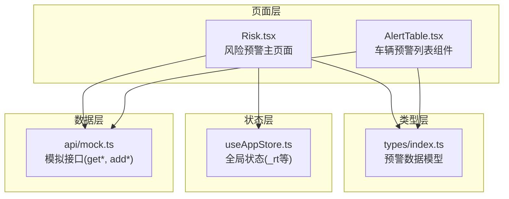
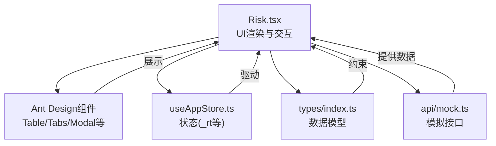
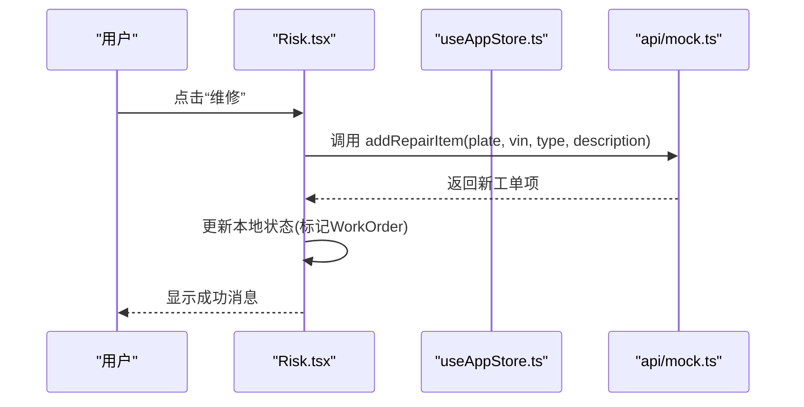
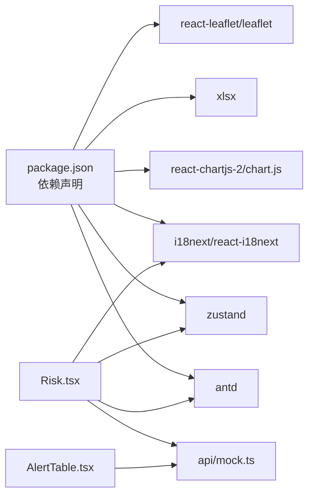

# 风险预警

<cite>
**本文引用的文件**
- [Risk.tsx](file://weidu-fleet/src/pages/Risk.tsx)
- [AlertTable.tsx](file://weidu-fleet/src/pages/Vehicles/AlertTable.tsx)
- [index.ts](file://weidu-fleet/src/types/index.ts)
- [useAppStore.ts](file://weidu-fleet/src/store/useAppStore.ts)
- [mock.ts](file://weidu-fleet/src/api/mock.ts)
- [package.json](file://weidu-fleet/package.json)
</cite>

## 目录
1. [简介](#简介)
2. [项目结构](#项目结构)
3. [核心组件](#核心组件)
4. [架构总览](#架构总览)
5. [详细组件分析](#详细组件分析)
6. [依赖关系分析](#依赖关系分析)
7. [性能考虑](#性能考虑)
8. [故障排查指南](#故障排查指南)
9. [结论](#结论)
10. [附录](#附录)

## 简介
本文件为“风险预警模块”的综合技术文档，面向产品、研发与运营人员，系统阐述该模块在当前代码库中的实现形态与扩展方向。当前仓库以前端模拟数据为主，风险预警模块通过页面组件、类型定义、状态存储与模拟接口协同工作，覆盖围栏报警、故障报警、电池报警三大类预警，并提供基础的筛选、详情查看与工单生成能力。同时，文档给出预警规则配置、风险等级分类、告警触发机制、处理流程、统计分析、历史记录与报表生成、风险评估模型、通知机制与应急响应流程的落地建议与实现路径。

## 项目结构
风险预警模块位于前端工程 weidu-fleet 中，采用按页面与功能分层组织：
- 页面层：Risk.tsx 提供风险预警主界面，内含围栏、故障、电池三类标签页与表格展示。
- 组件层：Vehicles/AlertTable.tsx 提供车辆级预警列表组件，用于在车辆详情或通用场景复用。
- 类型层：types/index.ts 定义了 FenceAlert、FaultAlert、BatteryAlert、DrivingAlert、DrivingReport 等核心数据模型。
- 状态层：store/useAppStore.ts 提供全局状态（如当前选中的风险标签页 _rt），支撑页面切换与筛选条件持久化。
- 数据层：api/mock.ts 提供 getFenceAlerts、getFaultAlerts、getBatteryAlerts 等模拟接口，返回结构化预警数据；并提供 addRepairItem 等可变更数据的演示方法。

图表来源
- [Risk.tsx:1-435](file://weidu-fleet/src/pages/Risk.tsx#L1-L435)
- [AlertTable.tsx:1-42](file://weidu-fleet/src/pages/Vehicles/AlertTable.tsx#L1-L42)
- [index.ts:1-261](file://weidu-fleet/src/types/index.ts#L1-L261)
- [useAppStore.ts:1-87](file://weidu-fleet/src/store/useAppStore.ts#L1-L87)
- [mock.ts:1-634](file://weidu-fleet/src/api/mock.ts#L1-L634)

章节来源
- [Risk.tsx:1-435](file://weidu-fleet/src/pages/Risk.tsx#L1-L435)
- [AlertTable.tsx:1-42](file://weidu-fleet/src/pages/Vehicles/AlertTable.tsx#L1-L42)
- [index.ts:1-261](file://weidu-fleet/src/types/index.ts#L1-L261)
- [useAppStore.ts:1-87](file://weidu-fleet/src/store/useAppStore.ts#L1-L87)
- [mock.ts:1-634](file://weidu-fleet/src/api/mock.ts#L1-L634)

## 核心组件
- 风险预警主页面（Risk.tsx）
  - 功能：提供围栏报警、故障报警、电池报警三类标签页，支持筛选、搜索、查看详情与生成工单。
  - 关键点：使用 Ant Design 的 Card、Table、Tabs、Tag、Button、Modal 等组件；通过 useAppStore 控制当前标签页 _rt；通过 mock 接口获取数据。
- 车辆预警列表组件（AlertTable.tsx）
  - 功能：以表格形式展示车辆级预警名称、内容与时间，支持横向滚动与分页。
  - 关键点：基于 getVehicleAlerts 的模拟数据进行映射显示。
- 类型定义（types/index.ts）
  - 功能：统一定义 FenceAlert、FaultAlert、BatteryAlert、DrivingAlert、DrivingReport 等数据模型，确保前后端一致的数据契约。
- 全局状态（useAppStore.ts）
  - 功能：维护当前页面、语言、用户信息、租户、筛选条件与标签页选择等；其中 _rt 决定 Risk 页面默认展示的标签页。
- 模拟接口（api/mock.ts）
  - 功能：提供 getFenceAlerts、getFaultAlerts、getBatteryAlerts 等数据源；addRepairItem 支持生成工单并更新状态。

章节来源
- [Risk.tsx:52-435](file://weidu-fleet/src/pages/Risk.tsx#L52-L435)
- [AlertTable.tsx:24-42](file://weidu-fleet/src/pages/Vehicles/AlertTable.tsx#L24-L42)
- [index.ts:59-117](file://weidu-fleet/src/types/index.ts#L59-L117)
- [useAppStore.ts:40-87](file://weidu-fleet/src/store/useAppStore.ts#L40-L87)
- [mock.ts:105-170](file://weidu-fleet/src/api/mock.ts#L105-L170)

## 架构总览
风险预警模块采用“页面-组件-类型-状态-数据”五层协作架构：
- 页面层负责交互与布局；
- 组件层负责可复用的展示逻辑；
- 类型层保证数据一致性；
- 状态层提供跨页面共享的状态；
- 数据层提供模拟数据与可变更操作。

图表来源
- [Risk.tsx:1-435](file://weidu-fleet/src/pages/Risk.tsx#L1-L435)
- [useAppStore.ts:1-87](file://weidu-fleet/src/store/useAppStore.ts#L1-L87)
- [index.ts:1-261](file://weidu-fleet/src/types/index.ts#L1-L261)
- [mock.ts:1-634](file://weidu-fleet/src/api/mock.ts#L1-L634)

## 详细组件分析

### 风险预警主页面（Risk.tsx）
- 结构与职责
  - 围栏报警标签页：支持按车牌、类型筛选，展示入栏/出栏报警、围栏名称、位置、时间，并提供查看详情弹窗。
  - 故障报警标签页：支持按车牌、平台类型、状态筛选，展示故障类型、内容、时间与状态，支持生成工单。
  - 电池报警标签页：支持按车牌、电池类型、状态筛选，展示电池异常类型、内容、时间与状态，支持生成工单。
  - 工单生成：点击“维修”按钮调用 addRepairItem，更新对应记录状态为“已生成工单”，并提示成功消息。
- 关键交互流程（生成工单）

图表来源
- [Risk.tsx:78-88](file://weidu-fleet/src/pages/Risk.tsx#L78-L88)
- [mock.ts:598-610](file://weidu-fleet/src/api/mock.ts#L598-L610)

章节来源
- [Risk.tsx:52-435](file://weidu-fleet/src/pages/Risk.tsx#L52-L435)
- [mock.ts:105-170](file://weidu-fleet/src/api/mock.ts#L105-L170)

### 车辆预警列表组件（AlertTable.tsx）
- 功能说明
  - 将原始预警数据映射为更易读的“预警名称”和“预警内容”，并展示时间字段。
  - 使用 Ant Design Table 进行展示，支持横向滚动与分页。
- 数据来源
  - 基于 getVehicleAlerts 的模拟数据，包含多种 CAN 通信相关的故障与电池异常类型。

章节来源
- [AlertTable.tsx:24-42](file://weidu-fleet/src/pages/Vehicles/AlertTable.tsx#L24-L42)
- [mock.ts:536-552](file://weidu-fleet/src/api/mock.ts#L536-L552)

### 数据模型（types/index.ts）
- 核心模型
  - FenceAlert：围栏报警，包含 id、车牌、VIN、类型(in/out)、围栏名、位置、时间。
  - FaultAlert：故障报警，包含 id、车牌、VIN/设备、类型(FaultType24)、内容、时间、状态(Pending/WorkOrder/Fixed)。
  - BatteryAlert：电池报警，包含 id、车牌、VIN/设备、类型(多种电池异常)、内容、时间、状态。
  - DrivingAlert：驾驶行为预警，包含 id、车牌、VIN、类型(多种驾驶风险)、位置、速度、时间。
  - DrivingReport：驾驶风险报告，包含 id、车牌、VIN、周期、里程、风险次数、等级(Safe/Low/Medium/High)、分数。
- 设计要点
  - 使用联合类型与字面量类型约束枚举值，提升类型安全。
  - 字段命名遵循统一风格，便于国际化与多语言适配。

章节来源
- [index.ts:59-117](file://weidu-fleet/src/types/index.ts#L59-L117)

### 全局状态（useAppStore.ts）
- 关键状态
  - _rt：当前风险标签页（fence/fault/battery），决定 Risk 页面默认展示。
  - _vf：筛选条件容器，支持 VIN/车牌/设备/电池版本/年龄等筛选。
  - 其他页面与视图状态：_dt、_dr、_bt、_mt、_vt、_dv、bz 等。
- 作用
  - 在页面间传递与持久化用户偏好与筛选条件，提升用户体验。

章节来源
- [useAppStore.ts:40-87](file://weidu-fleet/src/store/useAppStore.ts#L40-L87)

### 模拟接口（api/mock.ts）
- 数据提供
  - getFenceAlerts、getFaultAlerts、getBatteryAlerts：返回三类预警数据，包含时间戳、状态等。
  - getDrivingAlerts、getDrivingReports：提供驾驶行为与风险报告数据。
  - getVehicleAlerts：提供车辆级预警列表数据。
- 变更操作
  - addRepairItem：新增工单项，插入到列表头部并返回新项。
  - completeRepairItem：完成指定工单项（演示用途）。
- 扩展建议
  - 当接入真实后端时，应将 mock 替换为 axios 请求封装，保持接口签名与返回结构一致。

章节来源
- [mock.ts:105-170](file://weidu-fleet/src/api/mock.ts#L105-L170)
- [mock.ts:598-610](file://weidu-fleet/src/api/mock.ts#L598-L610)

## 依赖关系分析
- 组件耦合
  - Risk.tsx 依赖 Ant Design 组件库与 i18n；依赖 useAppStore 获取状态；依赖 mock 接口获取数据。
  - AlertTable.tsx 依赖 mock 接口与类型定义。
- 外部依赖
  - Ant Design、Zustand、i18n、Chart.js、XLSX 等。

图表来源
- [package.json:11-26](file://weidu-fleet/package.json#L11-L26)
- [Risk.tsx:1-10](file://weidu-fleet/src/pages/Risk.tsx#L1-L10)
- [AlertTable.tsx:1-5](file://weidu-fleet/src/pages/Vehicles/AlertTable.tsx#L1-L5)
- [mock.ts:1-1](file://weidu-fleet/src/api/mock.ts#L1-L1)

章节来源
- [package.json:11-26](file://weidu-fleet/package.json#L11-L26)
- [Risk.tsx:1-10](file://weidu-fleet/src/pages/Risk.tsx#L1-L10)
- [AlertTable.tsx:1-5](file://weidu-fleet/src/pages/Vehicles/AlertTable.tsx#L1-L5)
- [mock.ts:1-1](file://weidu-fleet/src/api/mock.ts#L1-L1)

## 性能考虑
- 渲染优化
  - 表格启用分页与横向滚动，避免一次性渲染大量数据导致卡顿。
  - 使用 useMemo 对数据映射进行缓存，减少重复计算。
- 状态管理
  - 使用 Zustand 管理轻量状态，避免过度拆分导致的频繁重渲染。
- 数据加载
  - 当接入真实后端时，建议引入请求去抖、并发限制与缓存策略，降低网络压力。
- 图表与导出
  - 报表生成可结合 Chart.js 与 XLSX，在前端进行聚合与导出，注意大数据量时的内存占用。

## 故障排查指南
- 常见问题
  - 无数据显示：检查 mock 接口是否正确返回数据；确认 _rt 是否指向正确的标签页。
  - 工单无法生成：确认 addRepairItem 调用路径与参数；检查本地状态更新逻辑。
  - 筛选无效：检查输入框绑定与过滤函数是否生效。
- 调试建议
  - 在 Risk.tsx 中打印筛选条件与数据源，定位问题范围。
  - 使用浏览器开发者工具查看网络请求与状态变化。

章节来源
- [Risk.tsx:78-88](file://weidu-fleet/src/pages/Risk.tsx#L78-L88)
- [mock.ts:598-610](file://weidu-fleet/src/api/mock.ts#L598-L610)

## 结论
当前风险预警模块以页面组件为核心，配合类型定义、状态存储与模拟接口，实现了围栏、故障、电池三类预警的展示与基础操作。模块具备良好的扩展性：未来可直接替换为真实后端接口，增加预警规则配置、风险等级分类、统计分析与报表生成等功能，形成完整的风险预警体系。

## 附录

### 预警类型与阈值建议（扩展设计）
- 围栏报警
  - 触发条件：进入/离开预设地理围栏边界。
  - 阈值：围栏半径、进入/离开判定时间窗口。
- 故障报警
  - 触发条件：CAN 总线通信错误、控制器错误码、传感器信号丢失等。
  - 阈值：错误码集合、信号超时时间、误报抑制窗口。
- 电池报警
  - 触发条件：SOC 过低、温度过高、SOC 突变、充电异常、电芯温差过大。
  - 阈值：SOC 下限、温度上限、SOC 变化率、充电中断时长、温差阈值。
- 驾驶行为预警
  - 触发条件：急加速、急减速、急转弯、超速、疲劳驾驶、碰撞风险。
  - 阈值：加速度阈值、速度阈值、持续时间、驾驶员状态识别模型阈值。

### 风险等级分类（扩展设计）
- 分级标准
  - Safe/Low/Medium/High：依据风险事件数量、严重程度与发生频率综合评估。
- 计算方式
  - 驾驶报告 DrivingReport：基于周期内里程、风险次数、评分计算等级。

章节来源
- [index.ts:108-117](file://weidu-fleet/src/types/index.ts#L108-L117)

### 告警触发机制与处理流程（扩展设计）
- 触发机制
  - 实时采集传感器与 CAN 数据，经规则引擎判断是否触发预警。
  - 支持多规则叠加与优先级排序。
- 处理流程
  - 告警生成 → 等级评估 → 通知下发 → 工单创建 → 处置闭环 → 统计分析。

### 统计分析、历史记录与报表（扩展设计）
- 统计分析
  - 预警趋势、区域分布、车型分布、故障类型占比。
- 历史记录
  - 保留完整告警日志与处置轨迹，支持检索与导出。
- 报表生成
  - 导出 Excel/PDF，支持自定义周期与维度。

### 风险评估模型（扩展设计）
- 指标体系
  - 风险事件计数、平均间隔、持续时间、影响范围。
- 模型建议
  - 基于机器学习的异常检测与预测模型，结合历史数据训练。

### 预警通知机制与应急响应（扩展设计）
- 通知渠道
  - 站内消息、邮件、短信、移动端推送。
- 应急流程
  - 快速定位、远程诊断、调度支援、现场处置、复盘改进。