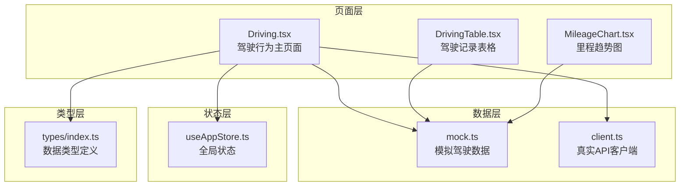
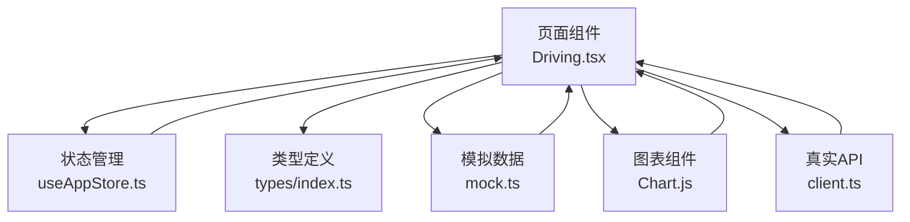
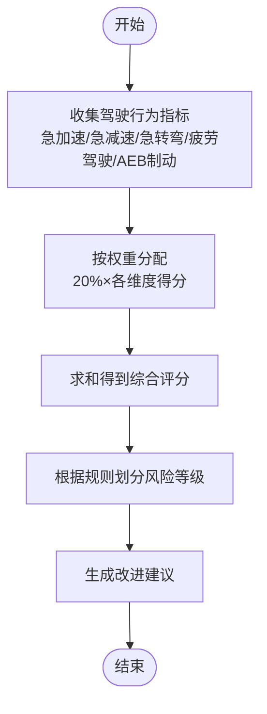
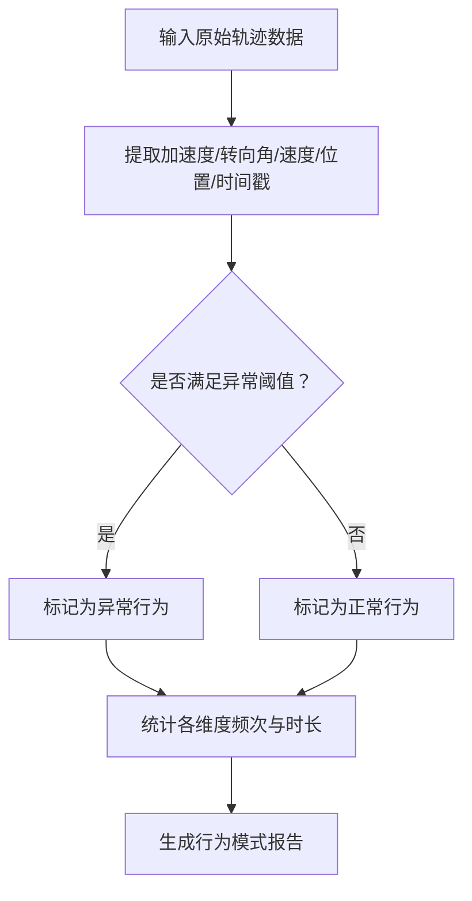
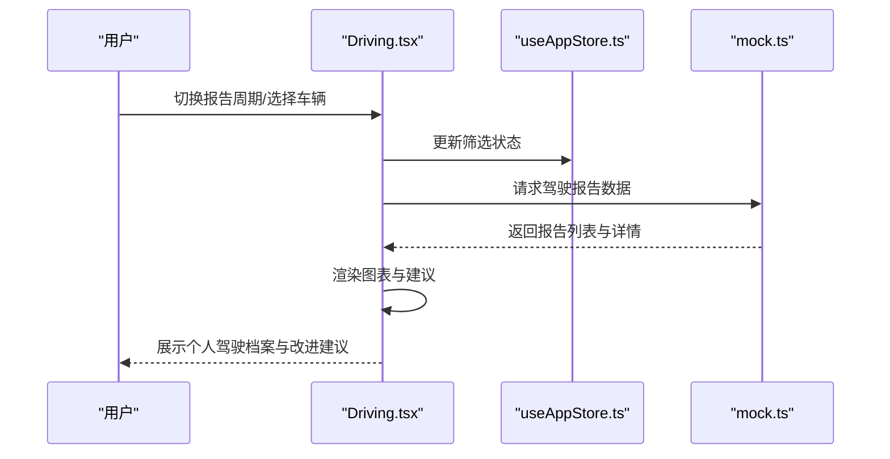
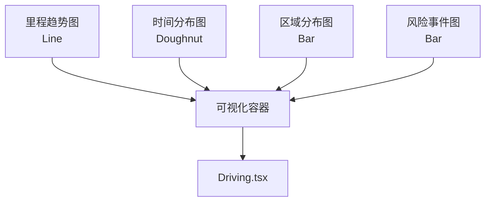
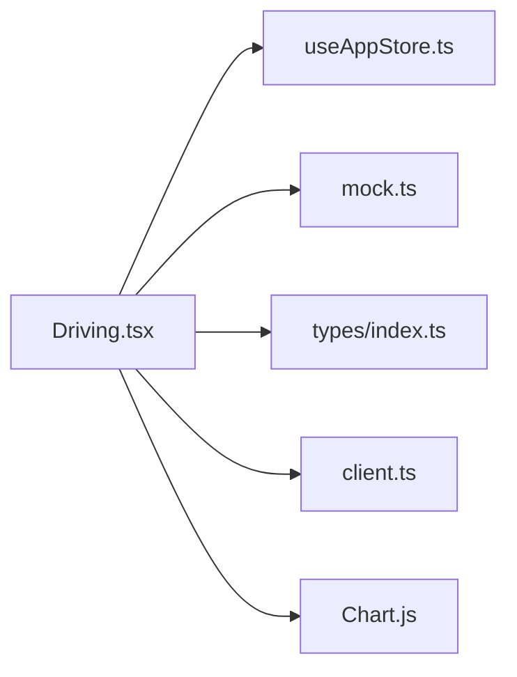

# 驾驶行为分析

<cite>
**本文引用的文件**
- [智利车队管理-详细设计.html](file://智利车队管理-详细设计.html)
- [Driving.tsx](file://weidu-fleet/src/pages/Driving.tsx)
- [mock.ts](file://weidu-fleet/src/api/mock.ts)
- [useAppStore.ts](file://weidu-fleet/src/store/useAppStore.ts)
- [index.ts](file://weidu-fleet/src/types/index.ts)
- [client.ts](file://weidu-fleet/src/api/client.ts)
- [DrivingTable.tsx](file://weidu-fleet/src/pages/Vehicles/DrivingTable.tsx)
- [MileageChart.tsx](file://weidu-fleet/src/pages/Vehicles/MileageChart.tsx)
</cite>

## 目录
1. [简介](#简介)
2. [项目结构](#项目结构)
3. [核心组件](#核心组件)
4. [架构总览](#架构总览)
5. [详细组件分析](#详细组件分析)
6. [依赖关系分析](#依赖关系分析)
7. [性能考虑](#性能考虑)
8. [故障排除指南](#故障排除指南)
9. [结论](#结论)
10. [附录](#附录)

## 简介
本文件面向“驾驶行为分析模块”，基于现有前端页面与模拟数据，系统梳理驾驶评分计算、行为模式识别、异常驾驶检测与趋势分析的实现思路与可视化呈现。文档同时给出数据采集方法、分析指标定义、评分标准制定、历史数据统计、个人驾驶档案管理与改进建议生成的实践指南，并提供图表展示、对比分析与预测模型使用建议。

## 项目结构
驾驶行为分析功能主要由以下部分组成：
- 页面层：驾驶行为主页面负责展示驾驶报告、风险事件、趋势图表与改进建议。
- 数据层：模拟数据接口提供驾驶警报与驾驶报告，支持本地开发与演示。
- 状态层：应用状态管理用于在页面间传递当前选中标签页与筛选条件。
- 类型层：统一的数据类型定义确保前后端字段一致性。
- 可视化层：基于 Chart.js 的折线图、柱状图、环形图展示驾驶行为趋势与分布。

**图表来源**
- [Driving.tsx:1-489](file://weidu-fleet/src/pages/Driving.tsx#L1-L489)
- [mock.ts:172-379](file://weidu-fleet/src/api/mock.ts#L172-L379)
- [useAppStore.ts](file://weidu-fleet/src/store/useAppStore.ts)
- [index.ts](file://weidu-fleet/src/types/index.ts)
- [client.ts](file://weidu-fleet/src/api/client.ts)
- [DrivingTable.tsx](file://weidu-fleet/src/pages/Vehicles/DrivingTable.tsx)
- [MileageChart.tsx](file://weidu-fleet/src/pages/Vehicles/MileageChart.tsx)

**章节来源**
- [Driving.tsx:1-489](file://weidu-fleet/src/pages/Driving.tsx#L1-L489)
- [mock.ts:172-379](file://weidu-fleet/src/api/mock.ts#L172-L379)

## 核心组件
- 驾驶行为主页面（Driving.tsx）
  - 功能：展示驾驶报告、风险事件、时间与区域分布、里程趋势；根据评分生成改进建议；支持周报/月报切换。
  - 关键实现点：使用 Chart.js 注册各类图表组件；通过 useMemo 缓存模拟数据；根据评分区间动态输出建议文本。
- 模拟数据接口（mock.ts）
  - 提供驾驶警报与驾驶报告两类数据，包含基础统计字段与风险事件列表，便于前端开发与演示。
- 应用状态（useAppStore.ts）
  - 维护当前标签页（警报/报告）、子标签页（周报/月报）与筛选条件，驱动页面渲染与交互。
- 数据类型（types/index.ts）
  - 定义驾驶报告、驾驶警报等核心数据结构，保证字段一致性和类型安全。
- 图表组件（MileageChart.tsx、DrivingTable.tsx）
  - 里程趋势图与驾驶记录表格作为驾驶行为分析的可视化补充。

**章节来源**
- [Driving.tsx:1-489](file://weidu-fleet/src/pages/Driving.tsx#L1-L489)
- [mock.ts:172-379](file://weidu-fleet/src/api/mock.ts#L172-L379)
- [useAppStore.ts](file://weidu-fleet/src/store/useAppStore.ts)
- [index.ts](file://weidu-fleet/src/types/index.ts)
- [DrivingTable.tsx](file://weidu-fleet/src/pages/Vehicles/DrivingTable.tsx)
- [MileageChart.tsx](file://weidu-fleet/src/pages/Vehicles/MileageChart.tsx)

## 架构总览
驾驶行为分析采用“页面-状态-数据-类型-可视化”的分层架构：
- 页面层负责用户交互与视图渲染；
- 状态层集中管理标签页与筛选状态；
- 数据层提供模拟数据与真实 API 接口；
- 类型层统一数据结构；
- 可视化层以图表形式直观呈现驾驶行为特征。

**图表来源**
- [Driving.tsx:1-489](file://weidu-fleet/src/pages/Driving.tsx#L1-L489)
- [useAppStore.ts](file://weidu-fleet/src/store/useAppStore.ts)
- [index.ts](file://weidu-fleet/src/types/index.ts)
- [mock.ts:172-379](file://weidu-fleet/src/api/mock.ts#L172-L379)
- [client.ts](file://weidu-fleet/src/api/client.ts)

## 详细组件分析

### 驾驶评分计算与风险等级
- 计算规则（来自设计文档）
  - 评估维度：急加速、急减速、急转弯、疲劳驾驶、AEB制动。
  - 权重：各维度权重相等（20%）。
  - 基础分值：0 次为满分，随着次数增加逐步扣分；时长与疲劳驾驶有额外扣分阈值。
  - 综合评分 = Σ(各维度分 × 权重)。
- 风险等级划分（来自设计文档）
  - 安全司机：最多1项中等风险，其余均为低风险或正常。
  - 低危司机：2~3项中等风险，无严重危险行为。
  - 中危司机：1项严重行为，或4项及以上中等风险。
  - 高危司机：2项及以上严重行为。

**图表来源**
- [智利车队管理-详细设计.html:717-774](file://智利车队管理-详细设计.html#L717-L774)

**章节来源**
- [智利车队管理-详细设计.html:717-774](file://智利车队管理-详细设计.html#L717-L774)

### 行为模式识别与异常检测
- 异常驾驶检测指标（来自设计文档）
  - 急减速频次：加速度 < -3 m/s²。
  - 急加速频次：加速度 > 2.5 m/s²。
  - 急转弯频次：≥ 40km/h 行驶下频繁急打方向。
  - 夜间行驶次数：凌晨 00:00 ~ 05:00 长时间驾驶。
  - 疲劳驾驶次数：单次连续驾驶超过 4 小时。
  - AEB制动频次：车辆多次自动介入制动。
- 行为模式识别
  - 时间段分布：早/午/晚/夜的驾驶时长占比。
  - 区域分布：高速公路/城市道路/乡村道路的行驶比例。
  - 风险事件统计：按周/月统计风险事件数量趋势。

**图表来源**
- [智利车队管理-详细设计.html:717-753](file://智利车队管理-详细设计.html#L717-L753)

**章节来源**
- [智利车队管理-详细设计.html:717-753](file://智利车队管理-详细设计.html#L717-L753)

### 历史数据统计与个人驾驶档案
- 历史数据统计
  - 报告周期：周报/月报，默认周报可切换。
  - 字段：VIN码/车牌号/报告时间/风险等级/行驶里程/触发风险数/驾驶评分。
  - 详情：累计行驶里程/时长/平均车速/评分 + 多维图表 + 改进建议。
- 个人驾驶档案
  - 以车辆为单位维护历史报告，支持筛选与导出。
  - 在驾驶详情弹窗中展示评分与建议，便于对比分析。

**图表来源**
- [Driving.tsx:36-489](file://weidu-fleet/src/pages/Driving.tsx#L36-L489)
- [mock.ts:189-200](file://weidu-fleet/src/api/mock.ts#L189-L200)
- [useAppStore.ts](file://weidu-fleet/src/store/useAppStore.ts)

**章节来源**
- [Driving.tsx:36-489](file://weidu-fleet/src/pages/Driving.tsx#L36-L489)
- [mock.ts:189-200](file://weidu-fleet/src/api/mock.ts#L189-L200)

### 图表展示与对比分析
- 里程趋势（折线图）：展示不同周期内的累计里程变化。
- 时间分布（环形图）：展示早/午/晚/夜的驾驶时长占比。
- 区域分布（柱状图）：展示高速公路/城市/乡村的行驶比例。
- 风险事件（折线图）：展示风险事件随时间的变化趋势。
- 对比分析：支持按车辆/时间段/区域进行多维对比，辅助制定个性化改进策略。

**图表来源**
- [Driving.tsx:258-371](file://weidu-fleet/src/pages/Driving.tsx#L258-L371)

**章节来源**
- [Driving.tsx:258-371](file://weidu-fleet/src/pages/Driving.tsx#L258-L371)

### 预测模型使用指南
- 输入特征：加速度、减速度、转向角、速度、时间、区域、驾驶员工时等。
- 模型类型：可选用时间序列模型（如 LSTM/ARIMA）预测未来风险事件，或分类模型（如 XGBoost/LightGBM）预测风险等级。
- 使用步骤：
  1) 数据预处理：清洗缺失值、标准化特征、构造时间窗口。
  2) 特征工程：提取滑动均值/方差、峰值、频域特征等。
  3) 模型训练：划分训练/验证/测试集，调参优化。
  4) 预测与回测：对历史数据进行回测，评估指标（准确率、召回率、AUC）。
  5) 在线推理：将实时数据推入模型，输出风险预警与改进建议。

[本节为通用指导，不直接分析具体源码文件]

## 依赖关系分析
- 页面到状态：Driving.tsx 通过 useAppStore.ts 获取与设置标签页状态。
- 页面到数据：Driving.tsx 通过 mock.ts 获取模拟数据；client.ts 提供真实 API 能力。
- 页面到类型：所有数据结构遵循 types/index.ts 的定义。
- 图表到页面：Chart.js 图表组件在 Driving.tsx 中注册并渲染。

**图表来源**
- [Driving.tsx:1-489](file://weidu-fleet/src/pages/Driving.tsx#L1-L489)
- [useAppStore.ts](file://weidu-fleet/src/store/useAppStore.ts)
- [mock.ts:172-379](file://weidu-fleet/src/api/mock.ts#L172-L379)
- [index.ts](file://weidu-fleet/src/types/index.ts)
- [client.ts](file://weidu-fleet/src/api/client.ts)

**章节来源**
- [Driving.tsx:1-489](file://weidu-fleet/src/pages/Driving.tsx#L1-L489)
- [useAppStore.ts](file://weidu-fleet/src/store/useAppStore.ts)
- [mock.ts:172-379](file://weidu-fleet/src/api/mock.ts#L172-L379)
- [index.ts](file://weidu-fleet/src/types/index.ts)
- [client.ts](file://weidu-fleet/src/api/client.ts)

## 性能考虑
- 数据缓存：使用 useMemo 缓存模拟数据，减少重复计算。
- 图表渲染：合理设置图表高度与数据量，避免一次性渲染过多点位。
- 状态更新：仅在必要时更新全局状态，避免不必要的重渲染。
- 分页与筛选：表格分页与筛选条件应结合后端接口，前端做轻量级过滤以提升响应速度。

[本节提供通用建议，不直接分析具体源码文件]

## 故障排除指南
- 无法显示图表
  - 检查 Chart.js 是否正确注册了所需组件（CategoryScale、LinearScale、BarElement、ArcElement、PointElement、LineElement、Filler）。
  - 确认数据格式符合 Chart.js 要求（labels/datasets）。
- 数据为空或不更新
  - 确认 mock.ts 中的 getDrivingAlerts/getDrivingReports 返回数据非空。
  - 若接入真实 API，检查 client.ts 的请求参数与返回结构。
- 状态未生效
  - 检查 useAppStore.ts 中的状态更新逻辑与组件订阅方式。
- 类型错误
  - 确保 types/index.ts 中的字段与实际数据一致，避免运行时报错。

**章节来源**
- [Driving.tsx:8-23](file://weidu-fleet/src/pages/Driving.tsx#L8-L23)
- [mock.ts:172-200](file://weidu-fleet/src/api/mock.ts#L172-L200)
- [client.ts](file://weidu-fleet/src/api/client.ts)
- [useAppStore.ts](file://weidu-fleet/src/store/useAppStore.ts)
- [index.ts](file://weidu-fleet/src/types/index.ts)

## 结论
驾驶行为分析模块以页面-状态-数据-类型-可视化为核心，实现了从驾驶评分、异常检测到趋势分析与改进建议的完整闭环。基于设计文档的评分规则与指标体系，结合前端图表组件，能够有效支撑车队管理中的安全驾驶监督与个性化培训。后续可引入真实传感器数据与机器学习模型，进一步提升预测精度与干预效果。

## 附录
- 数据采集方法
  - 传感器数据：加速度计、陀螺仪、GPS、CAN 总线数据。
  - 车辆状态：车速、档位、制动压力、转向角、发动机转速。
  - 环境数据：天气、光照、路面状况（可通过外部接口获取）。
- 分析指标定义
  - 急加速/急减速/急转弯：基于加速度与转向角阈值。
  - 疲劳驾驶：基于连续驾驶时长与昼夜分布。
  - AEB制动：基于制动系统事件日志。
- 评分标准制定
  - 参考设计文档的权重与扣分规则，结合业务场景调整阈值与区间。
- 历史数据统计与个人档案
  - 周报/月报切换、车辆筛选、导出报告。
- 改进建议生成
  - 基于评分区间与风险事件分布，自动生成针对性建议。

[本节为通用内容，不直接分析具体源码文件]