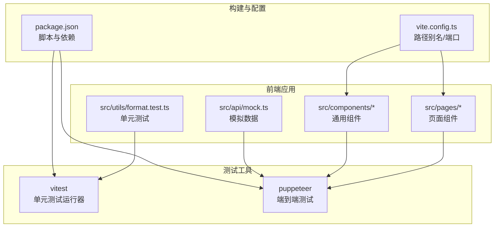
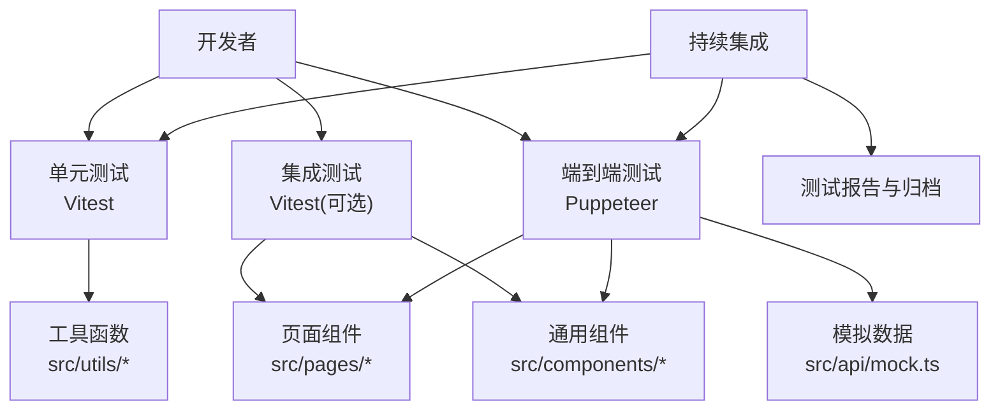
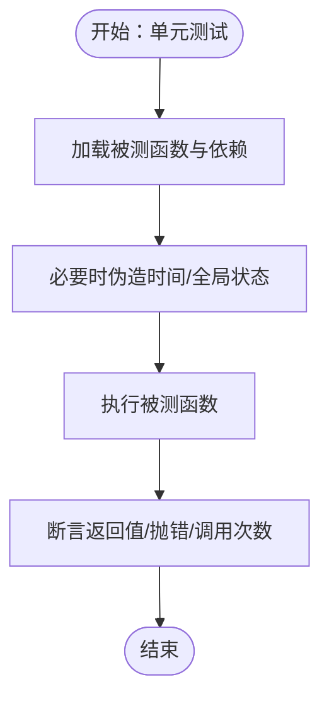
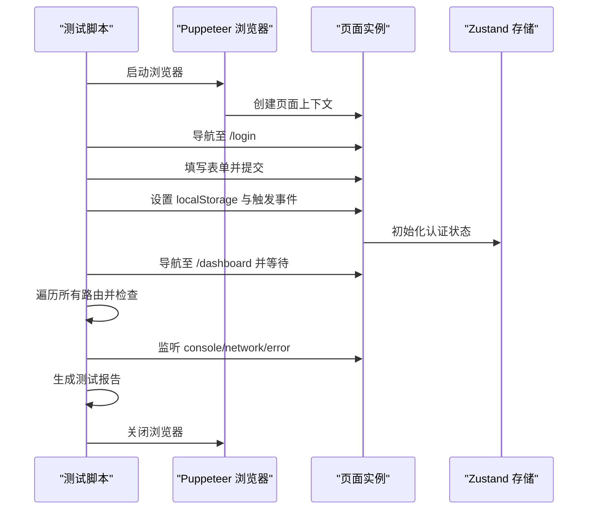
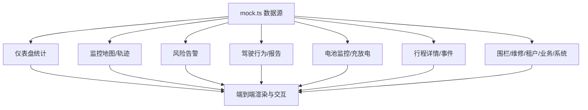
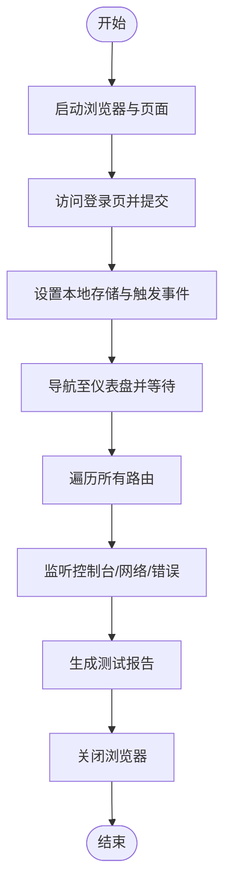
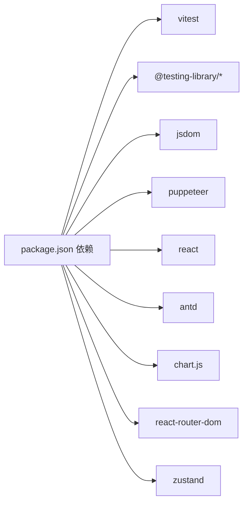

# 测试策略

<cite>
**本文引用的文件**   
- [package.json](file://weidu-fleet/package.json)
- [vite.config.ts](file://weidu-fleet/vite.config.ts)
- [test-automation.mjs](file://weidu-fleet/test-automation.mjs)
- [mock.ts](file://weidu-fleet/src/api/mock.ts)
- [format.test.ts](file://weidu-fleet/src/utils/format.test.ts)
- [Review_05-测试计划.md](file://Review_05-测试计划.md)
- [智利车队管理平台-测试用例.md](file://智利车队管理平台-测试用例.md)
- [自动化测试与Bug排查报告.md](file://weidu-fleet/自动化测试与Bug排查报告.md)
- [自动化测试与Bug排查报告-01.md](file://weidu-fleet/自动化测试与Bug排查报告-01.md)
- [自动化测试与Bug排查报告-02.md](file://weidu-fleet/自动化测试与Bug排查报告-02.md)
- [自动化测试与Bug排查报告-04.md](file://weidu-fleet/自动化测试与Bug排查报告-04.md)
- [自动化测试与Bug排查报告-05.md](file://weidu-fleet/自动化测试与Bug排查报告-05.md)
- [自动化测试与Bug排查报告-06.md](file://weidu-fleet/自动化测试与Bug排查报告-06.md)
</cite>

## 目录
1. [引言](#引言)
2. [项目结构](#项目结构)
3. [核心组件](#核心组件)
4. [架构总览](#架构总览)
5. [详细组件分析](#详细组件分析)
6. [依赖分析](#依赖分析)
7. [性能考虑](#性能考虑)
8. [故障排查指南](#故障排查指南)
9. [结论](#结论)
10. [附录](#附录)

## 引言
本测试策略面向“苇渡-智利车队管理”前端项目，目标是建立覆盖单元测试、集成测试与端到端（E2E）测试的完整测试体系，确保功能正确性、界面稳定性与用户体验一致性。项目已具备基于 Vitest 的单元测试框架与基于 Puppeteer 的自动化端到端测试脚本，并配套丰富的模拟数据与多语言支持。本文将结合现有实现与测试文档，给出可落地的测试策略、执行流程、覆盖率与质量标准、环境配置、Mock 策略、测试数据管理、CI/CD 中的测试流程以及调试与排障建议。

## 项目结构
项目采用 Vite + React + TypeScript 技术栈，测试相关的关键目录与文件如下：
- 单元测试：位于 src/utils/format.test.ts，使用 Vitest 框架
- 端到端测试：位于 test-automation.mjs，使用 Puppeteer
- 模拟数据：位于 src/api/mock.ts，提供各页面的数据桩
- 构建与别名：vite.config.ts 提供路径别名与开发服务器端口
- 依赖与脚本：package.json 包含测试相关依赖与脚本入口

图表来源
- [vite.config.ts:1-16](file://weidu-fleet/vite.config.ts#L1-L16)
- [package.json:1-41](file://weidu-fleet/package.json#L1-L41)
- [format.test.ts:1-45](file://weidu-fleet/src/utils/format.test.ts#L1-L45)
- [mock.ts:1-634](file://weidu-fleet/src/api/mock.ts#L1-L634)
- [test-automation.mjs:1-321](file://weidu-fleet/test-automation.mjs#L1-L321)

章节来源
- [vite.config.ts:1-16](file://weidu-fleet/vite.config.ts#L1-L16)
- [package.json:1-41](file://weidu-fleet/package.json#L1-L41)

## 核心组件
- 单元测试框架：Vitest，用于对工具函数与纯逻辑进行快速验证
- 端到端测试：Puppeteer，用于全菜单点击、路由导航、错误与网络监控
- 模拟数据：mock.ts 提供仪表盘、监控、风险、驾驶、电池、行程、围栏、维修、租户、业务与系统等页面的稳定数据
- 路由与页面：通过 mock 数据驱动页面渲染，避免真实后端依赖
- 国际化与主题：i18n 与 Ant Design 组件配合，测试需关注文案与样式一致性

章节来源
- [format.test.ts:1-45](file://weidu-fleet/src/utils/format.test.ts#L1-L45)
- [mock.ts:1-634](file://weidu-fleet/src/api/mock.ts#L1-L634)
- [test-automation.mjs:1-321](file://weidu-fleet/test-automation.mjs#L1-L321)

## 架构总览
下图展示测试策略在系统中的位置与交互关系：

图表来源
- [format.test.ts:1-45](file://weidu-fleet/src/utils/format.test.ts#L1-L45)
- [mock.ts:1-634](file://weidu-fleet/src/api/mock.ts#L1-L634)
- [test-automation.mjs:1-321](file://weidu-fleet/test-automation.mjs#L1-L321)

## 详细组件分析

### 单元测试策略
- 覆盖范围：优先覆盖工具函数、纯逻辑与边界条件；UI 组件建议以快照或渲染断言为主，复杂交互可拆分为可测试的纯函数
- 断言风格：使用 Vitest 的 expect 语法，关注输入输出映射与异常分支
- 时间与日期：对依赖当前时间的函数，使用时间伪造（如测试中对 Date.now 的替换）
- 示例参考：format.test.ts 展示了字符串格式化与年龄计算的测试用例设计思路

图表来源
- [format.test.ts:1-45](file://weidu-fleet/src/utils/format.test.ts#L1-L45)

章节来源
- [format.test.ts:1-45](file://weidu-fleet/src/utils/format.test.ts#L1-L45)

### 集成测试策略（可选）
- 目标：验证组件间协作、状态管理（如 Zustand）、路由与数据流
- 建议：使用 @testing-library/react 或 Vitest 的组件测试能力，结合 mock 数据与内存路由
- 重点：表单提交、分页、筛选、排序、图表渲染等交互链路

（本节为概念性指导，不直接分析具体文件）

### 端到端测试策略（Puppeteer）
- 全菜单遍历：自动访问所有路由，记录控制台错误、网络失败与页面状态
- 认证绕过：通过设置 localStorage 与触发自定义事件，使应用进入已登录态
- 错误监控：捕获 console.error、pageerror 与 requestfailed，生成统一报告
- 可靠性：固定视口尺寸、等待网络空闲、重试认证失败场景

图表来源
- [test-automation.mjs:114-247](file://weidu-fleet/test-automation.mjs#L114-L247)

章节来源
- [test-automation.mjs:1-321](file://weidu-fleet/test-automation.mjs#L1-L321)

### 模拟数据与测试数据管理
- mock.ts 提供全量页面数据，包括车辆、轨迹、行程、围栏、维修、租户、业务与系统等
- 建议：将 mock 数据作为“稳定契约”，保证不同环境与时间点的一致性；对可变操作（新增/删除/修改）提供受控变更接口
- 使用方式：端到端测试直接导入 mock 函数；单元测试可按需引入或注入

图表来源
- [mock.ts:1-634](file://weidu-fleet/src/api/mock.ts#L1-L634)

章节来源
- [mock.ts:1-634](file://weidu-fleet/src/api/mock.ts#L1-L634)

### 测试用例设计与测试数据准备
- 用例设计：遵循“输入-期望输出/副作用”的原则；覆盖正常、异常、边界与国际化场景
- 测试数据：优先使用 mock.ts 内置数据；对需要特定状态的数据，通过受控接口生成或注入
- 多语言：结合 i18n，在不同语言环境下验证文案与布局

章节来源
- [mock.ts:1-634](file://weidu-fleet/src/api/mock.ts#L1-L634)

### 自动化测试脚本编写与执行流程
- 执行入口：通过 Node 脚本启动 Puppeteer，按顺序完成登录、认证绕过、全菜单遍历与报告输出
- 环境要求：Chrome 可执行路径、无沙箱参数、窗口尺寸与超时控制
- 报告输出：汇总成功页面、控制台错误、网络失败与异常崩溃，并输出结论

图表来源
- [test-automation.mjs:114-247](file://weidu-fleet/test-automation.mjs#L114-L247)

章节来源
- [test-automation.mjs:1-321](file://weidu-fleet/test-automation.mjs#L1-L321)

### 测试覆盖率与质量标准
- 覆盖率目标（建议）：单元测试行覆盖率≥80%，分支覆盖率≥60%；端到端测试至少覆盖核心路径与关键交互
- 质量标准：
  - 控制台错误：零容忍
  - 网络失败：零容忍
  - 页面异常：零容忍
  - 文案与布局：多语言一致、无截断、无错位
- 报告与归档：每次测试输出结构化报告，保留历史记录以便趋势分析

章节来源
- [自动化测试与Bug排查报告.md](file://weidu-fleet/自动化测试与Bug排查报告.md)
- [自动化测试与Bug排查报告-01.md](file://weidu-fleet/自动化测试与Bug排查报告-01.md)
- [自动化测试与Bug排查报告-02.md](file://weidu-fleet/自动化测试与Bug排查报告-02.md)
- [自动化测试与Bug排查报告-04.md](file://weidu-fleet/自动化测试与Bug排查报告-04.md)
- [自动化测试与Bug排查报告-05.md](file://weidu-fleet/自动化测试与Bug排查报告-05.md)
- [自动化测试与Bug排查报告-06.md](file://weidu-fleet/自动化测试与Bug排查报告-06.md)

### 测试环境配置
- 开发服务器：端口 3000（vite.config.ts），端到端测试使用 3002（脚本内硬编码）
- 路径别名：@ 指向 src，便于组件与类型导入
- 依赖安装：使用 npm/yarn/pnpm 安装 devDependencies 中的 vitest、jsdom、@testing-library 等
- 浏览器：Puppeteer 使用指定 Chrome 可执行路径，启用 --no-sandbox 与 --disable-setuid-sandbox

章节来源
- [vite.config.ts:1-16](file://weidu-fleet/vite.config.ts#L1-L16)
- [package.json:1-41](file://weidu-fleet/package.json#L1-L41)
- [test-automation.mjs:7](file://weidu-fleet/test-automation.mjs#L7)

### Mock 策略
- 数据层：统一从 mock.ts 导出，保证跨组件与跨页面一致性
- 行为层：对异步请求、图表渲染、地图初始化等，使用内存数据与定时器控制
- 状态层：通过 localStorage 与自定义事件模拟认证状态，避免真实登录流程

章节来源
- [mock.ts:1-634](file://weidu-fleet/src/api/mock.ts#L1-L634)
- [test-automation.mjs:171-219](file://weidu-fleet/test-automation.mjs#L171-L219)

### 测试数据管理
- 静态数据：集中于 mock.ts，按页面维度组织，便于维护与扩展
- 动态数据：提供受控的增删改接口（如维修、围栏、租户），用于演示与回归验证
- 版本化：建议为 mock 数据增加版本号或注释，追踪变更影响

章节来源
- [mock.ts:596-634](file://weidu-fleet/src/api/mock.ts#L596-L634)

### 持续集成与自动化部署中的测试流程
- 触发条件：推送主分支、合并 Pull Request、定时任务
- 步骤建议：
  1) 安装依赖与构建
  2) 运行单元测试（可选：收集覆盖率）
  3) 启动前端服务（或使用静态预览）
  4) 运行 Puppeteer 端到端测试
  5) 生成并上传测试报告与覆盖率
  6) 失败时阻断发布或标记为警告
- 工具选择：GitHub Actions、GitLab CI、Jenkins 等均可接入上述步骤

（本节为概念性指导，不直接分析具体文件）

## 依赖分析
- 测试依赖：Vitest、@testing-library、jsdom、Puppeteer
- 运行时依赖：React、Ant Design、Chart.js、React Router、Zustand 等
- 构建依赖：Vite、TypeScript

图表来源
- [package.json:1-41](file://weidu-fleet/package.json#L1-L41)

章节来源
- [package.json:1-41](file://weidu-fleet/package.json#L1-L41)

## 性能考虑
- 单元测试：保持轻量与快速，避免外部 I/O；对耗时逻辑进行拆分与测试
- 端到端测试：合理设置等待策略，避免过度等待；对重复渲染与图表初始化进行节流
- 数据加载：mock 数据尽量精简，减少 DOM 与图表渲染压力
- 并发与资源：控制并发页面数量，避免内存泄漏与浏览器崩溃

（本节提供一般性建议，不直接分析具体文件）

## 故障排查指南
- 控制台错误：过滤已知无害警告，聚焦真实错误堆栈；定位到具体文件与行号
- 网络失败：检查请求方法、URL、状态码与失败原因；确认服务端地址与代理配置
- 页面异常：记录 URL、标题与页面内容预览，辅助复现与定位
- 认证绕不过：检查 localStorage 注入时机与自定义事件触发；必要时二次导航与刷新
- 报告解读：依据报告中的分类逐项排查，优先处理控制台错误与网络失败

章节来源
- [test-automation.mjs:23-112](file://weidu-fleet/test-automation.mjs#L23-L112)
- [test-automation.mjs:249-315](file://weidu-fleet/test-automation.mjs#L249-L315)

## 结论
本项目已具备完善的前端测试基础：单元测试、端到端测试与丰富模拟数据。建议在现有基础上完善覆盖率与质量标准，明确 CI 中的测试流程与阈值，持续优化测试脚本与报告，确保系统在迭代过程中保持高质量与高稳定性。

## 附录
- 测试计划与用例：参阅 Review_05-测试计划.md 与 智利车队管理平台-测试用例.md
- 历史报告：自动化测试与Bug排查报告系列文档，可用于对比与趋势分析

章节来源
- [Review_05-测试计划.md](file://Review_05-测试计划.md)
- [智利车队管理平台-测试用例.md](file://智利车队管理平台-测试用例.md)
- [自动化测试与Bug排查报告.md](file://weidu-fleet/自动化测试与Bug排查报告.md)
- [自动化测试与Bug排查报告-01.md](file://weidu-fleet/自动化测试与Bug排查报告-01.md)
- [自动化测试与Bug排查报告-02.md](file://weidu-fleet/自动化测试与Bug排查报告-02.md)
- [自动化测试与Bug排查报告-04.md](file://weidu-fleet/自动化测试与Bug排查报告-04.md)
- [自动化测试与Bug排查报告-05.md](file://weidu-fleet/自动化测试与Bug排查报告-05.md)
- [自动化测试与Bug排查报告-06.md](file://weidu-fleet/自动化测试与Bug排查报告-06.md)