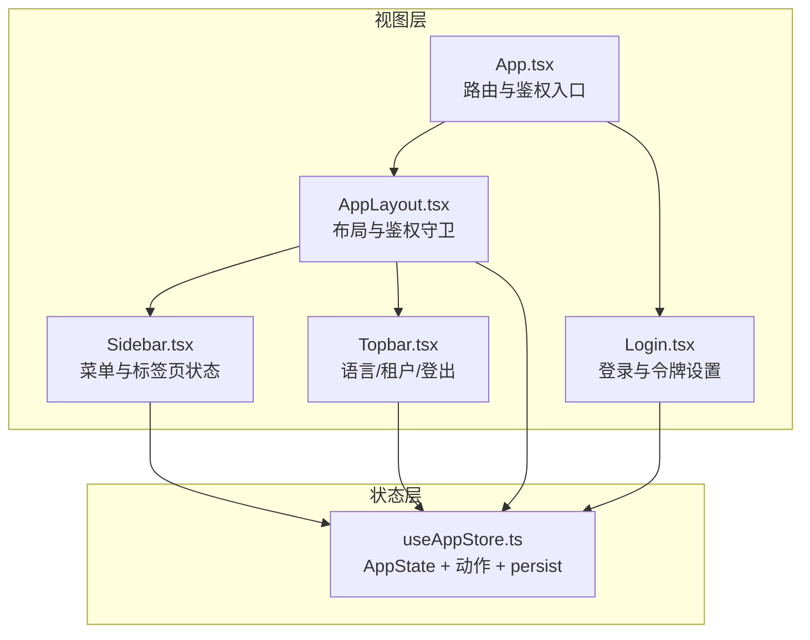
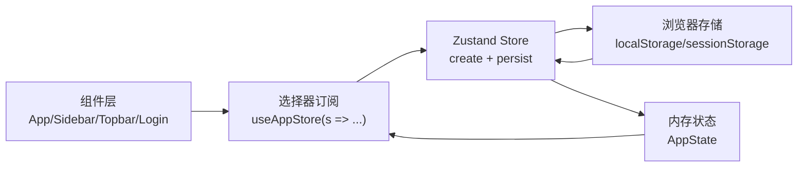
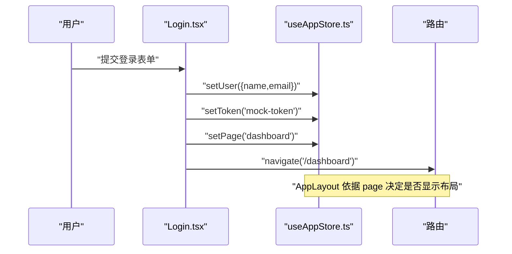
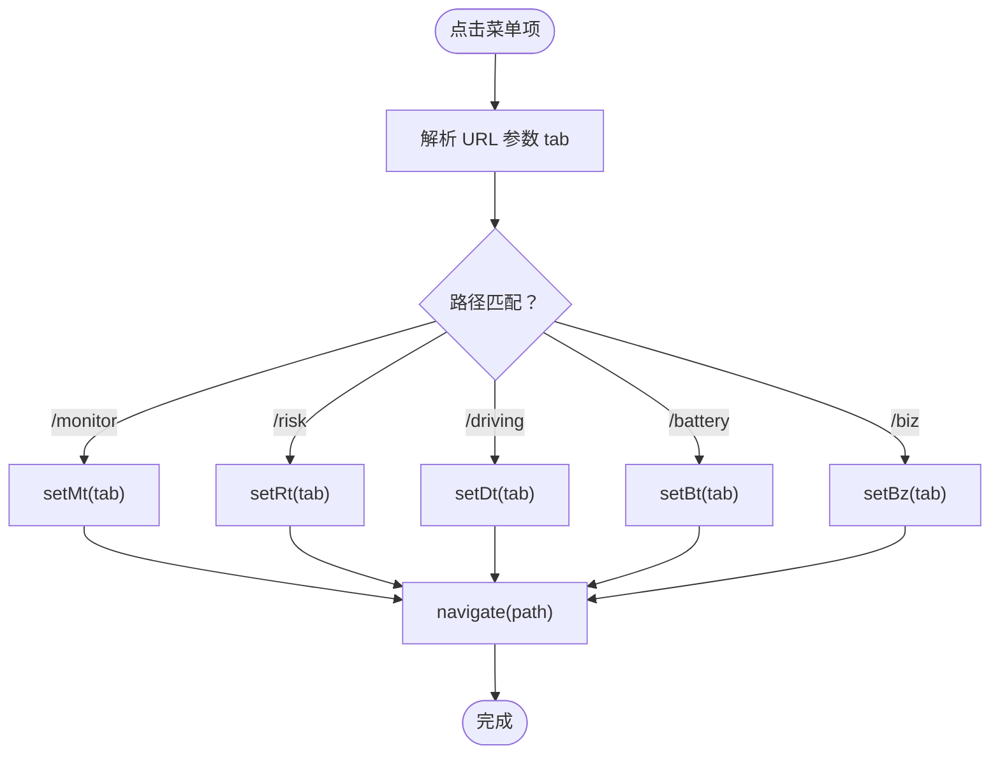
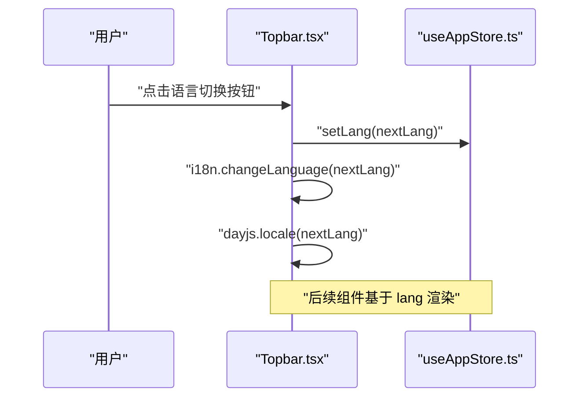
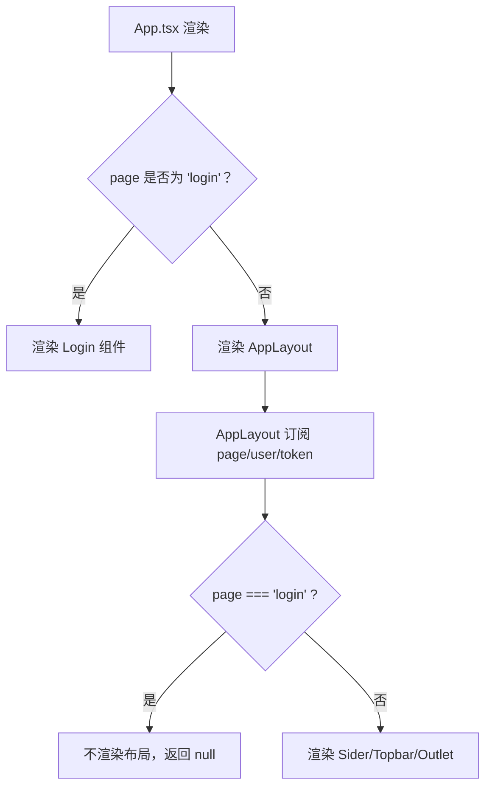
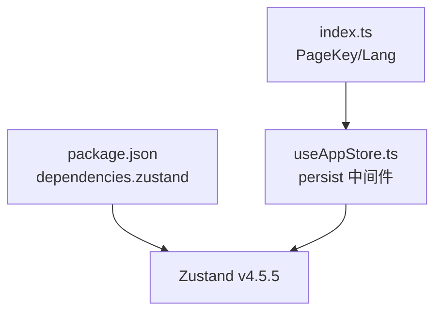

# 状态管理

<cite>
**本文引用的文件**
- [useAppStore.ts](file://weidu-fleet/src/store/useAppStore.ts)
- [App.tsx](file://weidu-fleet/src/App.tsx)
- [AppLayout.tsx](file://weidu-fleet/src/components/Layout/AppLayout.tsx)
- [Sidebar.tsx](file://weidu-fleet/src/components/Layout/Sidebar.tsx)
- [Topbar.tsx](file://weidu-fleet/src/components/Layout/Topbar.tsx)
- [Login.tsx](file://weidu-fleet/src/pages/Login.tsx)
- [index.ts](file://weidu-fleet/src/types/index.ts)
- [package.json](file://weidu-fleet/package.json)
</cite>

## 目录
1. [引言](#引言)
2. [项目结构](#项目结构)
3. [核心组件](#核心组件)
4. [架构总览](#架构总览)
5. [详细组件分析](#详细组件分析)
6. [依赖分析](#依赖分析)
7. [性能考虑](#性能考虑)
8. [故障排查指南](#故障排查指南)
9. [结论](#结论)
10. [附录](#附录)

## 引言
本文件系统性梳理苇渡-智利车队管理项目中的状态管理方案，聚焦于 Zustand 的使用与实践。项目采用 Zustand v4 作为全局状态容器，并通过 persist 中间件实现关键状态的本地持久化；在路由与布局层通过自定义 Hook 将状态与组件进行解耦绑定，形成清晰的“状态-视图”映射关系。本文将从全局状态结构、更新机制、持久化策略、最佳实践、性能优化与常见问题等方面展开，帮助开发者快速理解并高效维护状态管理。

## 项目结构
项目状态管理位于 src/store/useAppStore.ts，围绕 AppState 定义统一的状态模型与动作函数；在 App.tsx、AppLayout.tsx、Sidebar.tsx、Topbar.tsx、Login.tsx 等组件中以选择器订阅所需字段，实现细粒度的渲染控制。



图表来源
- [useAppStore.ts:40-86](file://weidu-fleet/src/store/useAppStore.ts#L40-L86)
- [App.tsx:36-84](file://weidu-fleet/src/App.tsx#L36-L84)
- [AppLayout.tsx:10-82](file://weidu-fleet/src/components/Layout/AppLayout.tsx#L10-L82)
- [Sidebar.tsx:25-178](file://weidu-fleet/src/components/Layout/Sidebar.tsx#L25-L178)
- [Topbar.tsx:35-229](file://weidu-fleet/src/components/Layout/Topbar.tsx#L35-L229)
- [Login.tsx:13-51](file://weidu-fleet/src/pages/Login.tsx#L13-L51)

章节来源
- [useAppStore.ts:1-87](file://weidu-fleet/src/store/useAppStore.ts#L1-L87)
- [App.tsx:1-88](file://weidu-fleet/src/App.tsx#L1-L88)
- [AppLayout.tsx:1-85](file://weidu-fleet/src/components/Layout/AppLayout.tsx#L1-L85)
- [Sidebar.tsx:1-272](file://weidu-fleet/src/components/Layout/Sidebar.tsx#L1-L272)
- [Topbar.tsx:1-233](file://weidu-fleet/src/components/Layout/Topbar.tsx#L1-L233)
- [Login.tsx:1-167](file://weidu-fleet/src/pages/Login.tsx#L1-L167)

## 核心组件
- 全局状态容器：useAppStore.ts
  - 使用 create 创建 Zustand 存储实例
  - 使用 persist 中间件对用户、令牌、语言、租户等关键字段进行持久化
  - 提供丰富的动作函数用于更新状态（如 setPage、setLang、setUser、setToken、setTenant、setTenants、setDetail、setVf、各_tab 状态等）
- 类型定义：index.ts
  - PageKey、Lang 等枚举与联合类型，为状态键提供类型约束
- 视图绑定：多组件通过选择器订阅状态，实现最小化重渲染

章节来源
- [useAppStore.ts:5-38](file://weidu-fleet/src/store/useAppStore.ts#L5-L38)
- [useAppStore.ts:40-86](file://weidu-fleet/src/store/useAppStore.ts#L40-L86)
- [index.ts:176-177](file://weidu-fleet/src/types/index.ts#L176-L177)

## 架构总览
Zustand 在本项目中的定位是“轻量、可组合、可持久化的全局状态中心”。其核心优势在于：
- 无 Provider 包装，按需订阅，降低心智负担
- 动作函数集中管理副作用与状态变更
- persist 中间件自动处理本地存储的读写与恢复



图表来源
- [useAppStore.ts:40-86](file://weidu-fleet/src/store/useAppStore.ts#L40-L86)
- [App.tsx:36-37](file://weidu-fleet/src/App.tsx#L36-L37)
- [Sidebar.tsx:30-34](file://weidu-fleet/src/components/Layout/Sidebar.tsx#L30-L34)
- [Topbar.tsx:39-45](file://weidu-fleet/src/components/Layout/Topbar.tsx#L39-L45)
- [Login.tsx:16-18](file://weidu-fleet/src/pages/Login.tsx#L16-L18)

## 详细组件分析

### 全局状态模型与持久化策略
- 状态键概览
  - 页面与鉴权：page、user、token、tenants、tenant、detail
  - 国际化：lang
  - 页面标签页状态：_rt、_dt、_dr、_bt、_mt、_vt、_dv、_vf、bz
- 更新机制
  - 基础字段：setPage、setLang、setUser、setToken、setTenant、setTenants、setDetail
  - 复合对象：setVf 使用浅合并策略更新 _vf
  - 标签页状态：setRt、setDt、setDr、setBt、setMt、setVt、setDv、setBz 分别更新对应 tab 字段
- 持久化配置
  - 存储键名：weidu-fleet-storage
  - 部分化策略：仅持久化 user、token、lang、tenant，避免敏感信息泄露与存储膨胀

```mermaid
classDiagram
class AppState {
+page : "login" | PageKey
+lang : Lang
+user : { name, email, mustChangePassword? } | null
+token : string | null
+tenant : string | null
+tenants : TenantItem[]
+detail : string | null
+_vf : { vin?, plate?, device?, batteryVer?, minAge?, maxAge? }
+_rt : string
+_dt : string
+_dr : string
+_bt : string
+_mt : string
+_vt : string
+_dv : string
+bz : string
+setPage(page)
+setLang(lang)
+setUser(user)
+setToken(token)
+setTenant(tenant)
+setTenants(tenants)
+setDetail(detail)
+setVf(vf)
+setRt(rt)
+setDt(dt)
+setDr(dr)
+setBt(bt)
+setMt(mt)
+setVt(vt)
+setDv(dv)
+setBz(bz)
}
```

图表来源
- [useAppStore.ts:5-38](file://weidu-fleet/src/store/useAppStore.ts#L5-L38)

章节来源
- [useAppStore.ts:40-86](file://weidu-fleet/src/store/useAppStore.ts#L40-L86)
- [index.ts:176-177](file://weidu-fleet/src/types/index.ts#L176-L177)

### 登录流程与状态联动
- 登录页在加载时将 page 设为 'login'，随后根据表单提交设置 user 与 token，并跳转至仪表盘
- 登出时清空 token、user、tenant 并将 page 设为 'login'



图表来源
- [Login.tsx:16-51](file://weidu-fleet/src/pages/Login.tsx#L16-L51)
- [useAppStore.ts:59-59](file://weidu-fleet/src/store/useAppStore.ts#L59-L59)
- [AppLayout.tsx:22-26](file://weidu-fleet/src/components/Layout/AppLayout.tsx#L22-L26)

章节来源
- [Login.tsx:13-51](file://weidu-fleet/src/pages/Login.tsx#L13-L51)
- [AppLayout.tsx:10-31](file://weidu-fleet/src/components/Layout/AppLayout.tsx#L10-L31)

### 菜单导航与标签页状态同步
- 侧边栏点击菜单项时，根据当前路径调用对应 setXxx 动作更新标签页状态
- 组件挂载后读取 store 当前状态，动态计算选中项与面包屑



图表来源
- [Sidebar.tsx:150-165](file://weidu-fleet/src/components/Layout/Sidebar.tsx#L150-L165)
- [Sidebar.tsx:168-178](file://weidu-fleet/src/components/Layout/Sidebar.tsx#L168-L178)

章节来源
- [Sidebar.tsx:25-178](file://weidu-fleet/src/components/Layout/Sidebar.tsx#L25-L178)

### 顶部栏国际化与租户切换
- 语言切换：循环切换 zh/en/es，并同步 i18n 与日期库语言
- 租户切换：通过下拉框选择租户 ID，触发 setTenant 更新



图表来源
- [Topbar.tsx:55-62](file://weidu-fleet/src/components/Layout/Topbar.tsx#L55-L62)
- [Topbar.tsx:128-146](file://weidu-fleet/src/components/Layout/Topbar.tsx#L128-L146)

章节来源
- [Topbar.tsx:35-229](file://weidu-fleet/src/components/Layout/Topbar.tsx#L35-L229)

### 鉴权守卫与布局渲染
- AppLayout 通过 store.page 判断是否处于登录态，决定是否渲染布局或重定向
- App.tsx 作为路由根组件，根据 page 控制登录页与受保护路由的展示



图表来源
- [App.tsx:36-84](file://weidu-fleet/src/App.tsx#L36-L84)
- [AppLayout.tsx:15-31](file://weidu-fleet/src/components/Layout/AppLayout.tsx#L15-L31)

章节来源
- [App.tsx:1-88](file://weidu-fleet/src/App.tsx#L1-L88)
- [AppLayout.tsx:10-82](file://weidu-fleet/src/components/Layout/AppLayout.tsx#L10-L82)

## 依赖分析
- Zustand 版本：v4.5.5
- 持久化中间件：zustand/middleware 的 persist
- 类型约束：通过 index.ts 的 PageKey、Lang 等类型确保状态键合法



图表来源
- [package.json:25](file://weidu-fleet/package.json#L25)
- [useAppStore.ts:1-2](file://weidu-fleet/src/store/useAppStore.ts#L1-L2)
- [index.ts:176-177](file://weidu-fleet/src/types/index.ts#L176-L177)

章节来源
- [package.json:11-26](file://weidu-fleet/package.json#L11-L26)
- [useAppStore.ts:1-2](file://weidu-fleet/src/store/useAppStore.ts#L1-L2)
- [index.ts:176-177](file://weidu-fleet/src/types/index.ts#L176-L177)

## 性能考虑
- 选择器订阅
  - 各组件仅订阅自身需要的字段，避免不必要的重渲染
  - 推荐：优先使用选择器而非直接传入整个状态对象
- 状态拆分
  - 将页面级标签页状态（_rt/_dt/_bt 等）与业务状态分离，降低耦合
- 持久化范围
  - 仅持久化必要字段，减少存储体积与序列化开销
- 异步状态
  - 对于网络请求结果，建议引入“加载/错误/数据”三态结构，避免直接污染基础状态
- 计算派生
  - 对于复杂筛选/排序逻辑，建议在组件内缓存结果或使用 useMemo，避免重复计算

## 故障排查指南
- 登录后仍显示登录页
  - 检查 LoginPage 是否正确调用 setPage('dashboard')
  - 确认 AppLayout 的鉴权守卫逻辑是否生效
- 语言切换无效
  - 确认 Topbar.tsx 中 setLang 已被调用且 i18n.changeLanguage 正常执行
- 标签页状态不同步
  - 检查 Sidebar.tsx 的菜单点击分支是否命中对应 setXxx 动作
  - 确认 getSelectedKey 中的 store._xxx 读取逻辑
- 登出后状态未清除
  - 确认 Topbar.tsx 的登出流程是否调用了 setToken(null)、setUser(null)、setTenant(null)、setPage('login')

章节来源
- [Login.tsx:16-51](file://weidu-fleet/src/pages/Login.tsx#L16-L51)
- [AppLayout.tsx:22-26](file://weidu-fleet/src/components/Layout/AppLayout.tsx#L22-L26)
- [Topbar.tsx:55-83](file://weidu-fleet/src/components/Layout/Topbar.tsx#L55-L83)
- [Sidebar.tsx:150-178](file://weidu-fleet/src/components/Layout/Sidebar.tsx#L150-L178)

## 结论
本项目以 Zustand 为核心构建了简洁高效的全局状态体系：通过明确的状态模型、细粒度的选择器订阅、以及合理的持久化策略，实现了良好的开发体验与运行性能。建议在后续迭代中继续坚持“状态拆分、最小订阅、边界清晰”的原则，并在异步场景中引入更完善的三态结构与错误处理，以进一步提升系统的稳定性与可维护性。

## 附录
- 最佳实践清单
  - 使用选择器订阅具体字段，避免订阅整块状态
  - 将页面标签页状态与业务状态分离，保持状态树扁平
  - 仅持久化必要字段，定期清理过期数据
  - 异步操作引入 loading/error/data 三态，避免直接污染基础状态
  - 对复杂计算使用缓存或 useMemo，减少重复计算
- 常见问题速查
  - 登录/登出状态未生效：检查动作调用链与鉴权守卫
  - 语言/租户切换无效：确认 setXxx 与 i18n/dayjs 同步
  - 标签页状态不同步：核对菜单点击分支与 getSelectedKey 逻辑