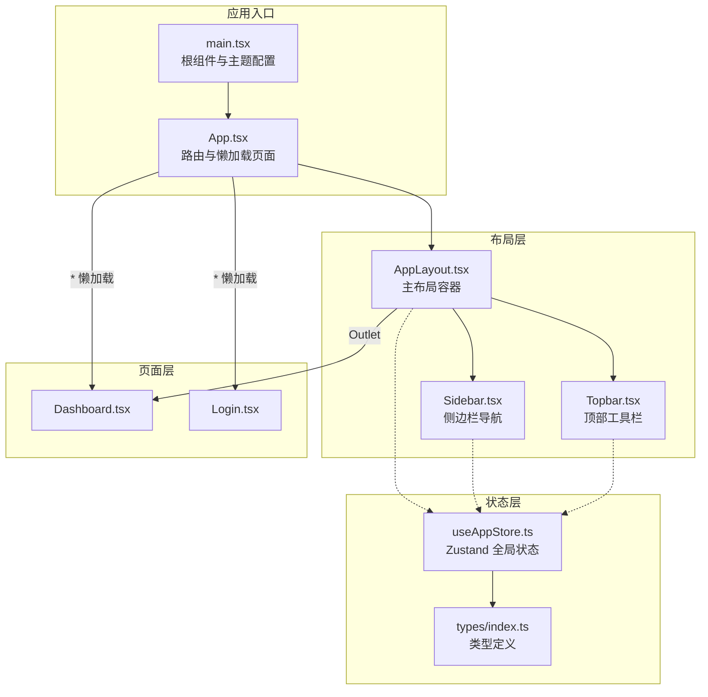
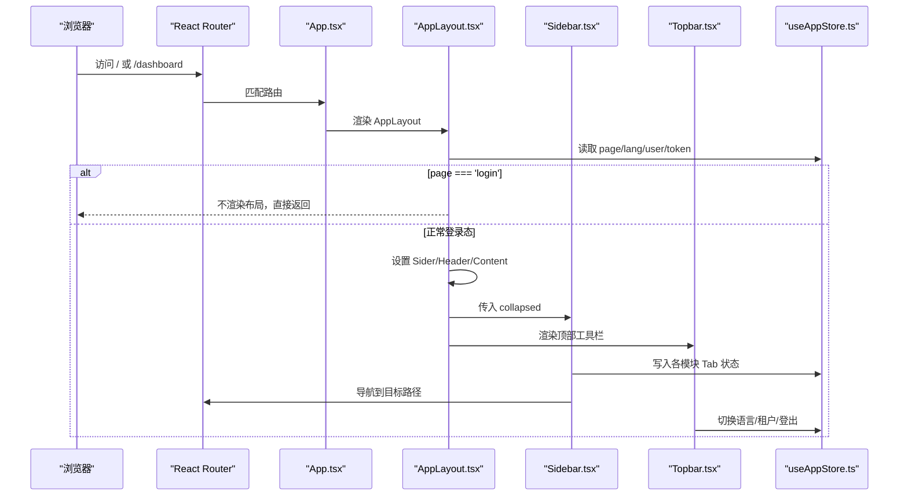
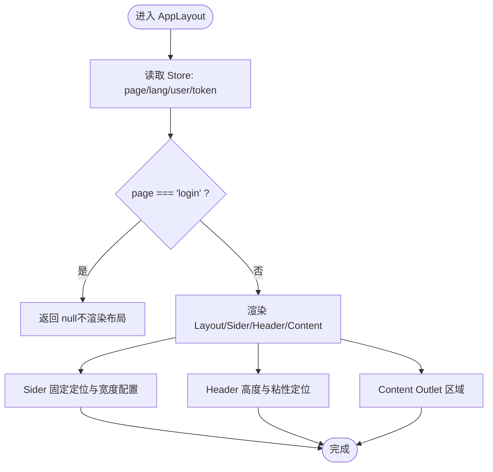
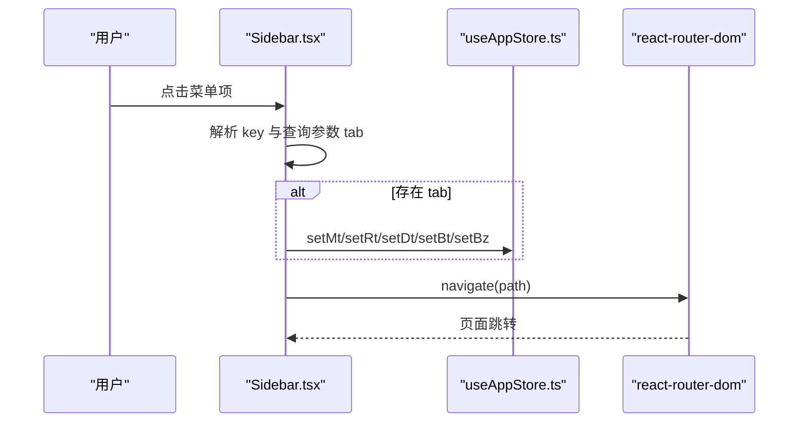
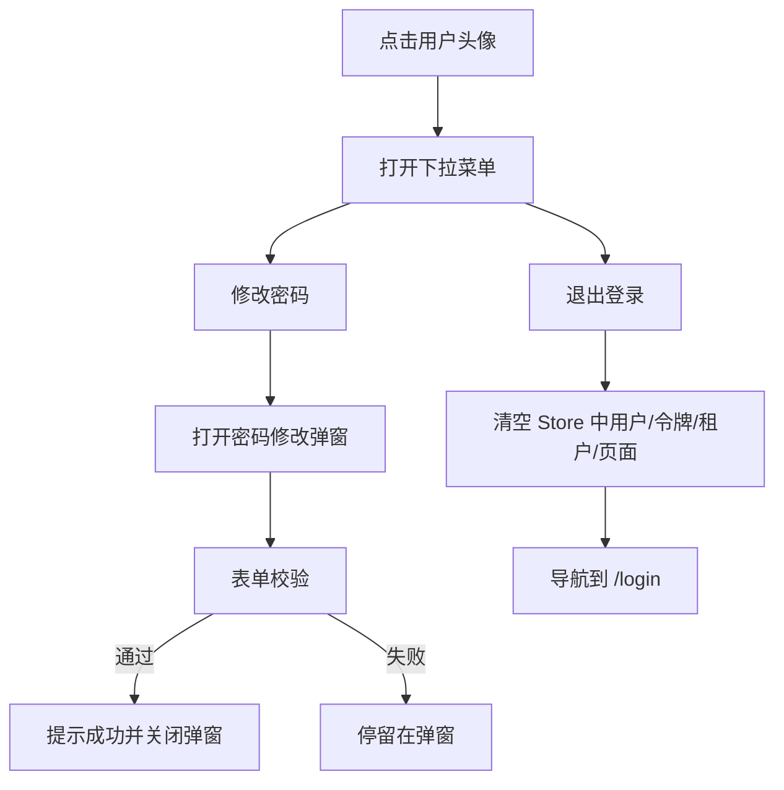
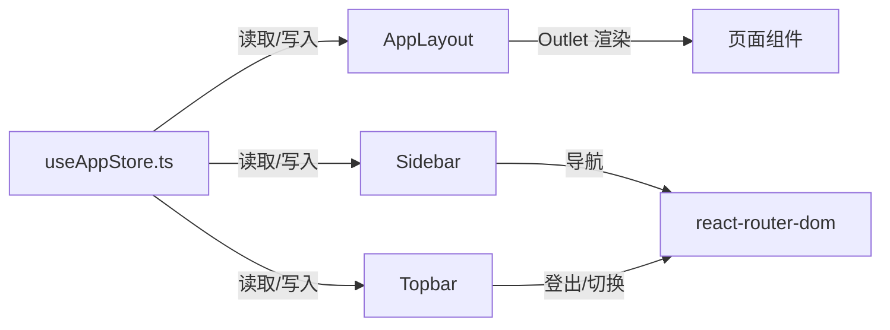
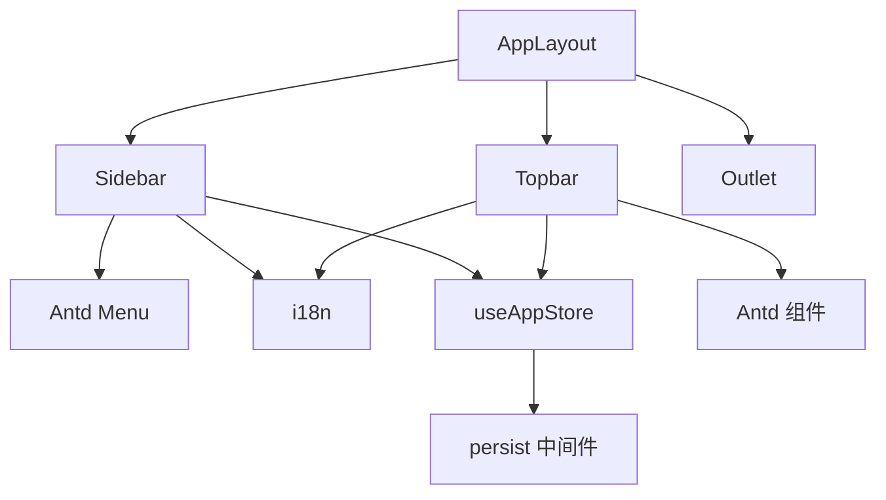

# 布局组件

<cite>
**本文引用的文件列表**
- [AppLayout.tsx](file://weidu-fleet/src/components/Layout/AppLayout.tsx)
- [Sidebar.tsx](file://weidu-fleet/src/components/Layout/Sidebar.tsx)
- [Topbar.tsx](file://weidu-fleet/src/components/Layout/Topbar.tsx)
- [useAppStore.ts](file://weidu-fleet/src/store/useAppStore.ts)
- [index.ts](file://weidu-fleet/src/types/index.ts)
- [App.tsx](file://weidu-fleet/src/App.tsx)
- [main.tsx](file://weidu-fleet/src/main.tsx)
- [index.ts](file://weidu-fleet/src/i18n/index.ts)
- [Dashboard.tsx](file://weidu-fleet/src/pages/Dashboard.tsx)
- [Login.tsx](file://weidu-fleet/src/pages/Login.tsx)
</cite>

## 目录
1. [简介](#简介)
2. [项目结构](#项目结构)
3. [核心组件](#核心组件)
4. [架构总览](#架构总览)
5. [组件详解](#组件详解)
6. [依赖关系分析](#依赖关系分析)
7. [性能考量](#性能考量)
8. [故障排查指南](#故障排查指南)
9. [结论](#结论)

## 简介
本文件面向“苇渡-智利车队管理”项目中的布局组件，系统性梳理 AppLayout 主布局、Sidebar 侧边栏导航与 Topbar 顶部工具栏的架构设计、数据流、交互逻辑与可扩展点。重点覆盖：
- 布局容器、路由出口与响应式布局实现
- 菜单项配置、路由跳转与 Tab 状态联动
- 顶部工具栏的用户信息、语言切换、租户切换与登出流程
- 组件属性接口、事件处理与样式定制方案
- 布局组件间通信机制与状态同步策略（基于 Zustand Store）

## 项目结构
布局组件位于 src/components/Layout 下，配合路由与全局状态管理共同构成页面骨架。整体采用 Ant Design 的 Layout 结构，结合 react-router-dom 的 Outlet 实现路由出口渲染。

图表来源
- [main.tsx:1-49](file://weidu-fleet/src/main.tsx#L1-L49)
- [App.tsx:1-88](file://weidu-fleet/src/App.tsx#L1-L88)
- [AppLayout.tsx:1-85](file://weidu-fleet/src/components/Layout/AppLayout.tsx#L1-L85)
- [Sidebar.tsx:1-272](file://weidu-fleet/src/components/Layout/Sidebar.tsx#L1-L272)
- [Topbar.tsx:1-233](file://weidu-fleet/src/components/Layout/Topbar.tsx#L1-L233)
- [useAppStore.ts:1-87](file://weidu-fleet/src/store/useAppStore.ts#L1-L87)
- [index.ts:176-177](file://weidu-fleet/src/types/index.ts#L176-L177)

章节来源
- [App.tsx:36-85](file://weidu-fleet/src/App.tsx#L36-L85)
- [main.tsx:21-42](file://weidu-fleet/src/main.tsx#L21-L42)

## 核心组件
- AppLayout：负责整体布局容器、Sider 定位与固定、Header 高度与粘性定位、Content 区域 Outlet 渲染以及登录态判断与重定向。
- Sidebar：提供菜单树、图标与文案国际化、子菜单展开状态、当前选中项高亮、Tab 参数联动写入 Store 并导航。
- Topbar：提供面包屑、语言切换、租户选择、用户下拉菜单（改密/登出）、密码修改弹窗与表单校验。

章节来源
- [AppLayout.tsx:10-82](file://weidu-fleet/src/components/Layout/AppLayout.tsx#L10-L82)
- [Sidebar.tsx:21-271](file://weidu-fleet/src/components/Layout/Sidebar.tsx#L21-L271)
- [Topbar.tsx:35-230](file://weidu-fleet/src/components/Layout/Topbar.tsx#L35-L230)

## 架构总览
布局组件通过路由 Outlet 将页面内容注入到 Content 区域；Sidebar 与 Topbar 分别承担导航与工具能力；全局状态 Store 提供跨组件共享的状态（如当前语言、用户、租户、各模块 Tab 状态等）。

图表来源
- [App.tsx:42-81](file://weidu-fleet/src/App.tsx#L42-L81)
- [AppLayout.tsx:15-31](file://weidu-fleet/src/components/Layout/AppLayout.tsx#L15-L31)
- [Sidebar.tsx:150-165](file://weidu-fleet/src/components/Layout/Sidebar.tsx#L150-L165)
- [Topbar.tsx:55-83](file://weidu-fleet/src/components/Layout/Topbar.tsx#L55-L83)
- [useAppStore.ts:40-75](file://weidu-fleet/src/store/useAppStore.ts#L40-L75)

## 组件详解

### AppLayout 主布局
- 布局容器与样式
  - 使用 Ant Design Layout 容器，左侧固定 Sider，右侧 Content 区域承载 Outlet。
  - Sider 固定在左侧，高度 100vh，支持折叠宽度与过渡动画。
  - Header 高度固定，粘性定位在顶部，Content 区域自适应高度并滚动。
- 登录态与路由控制
  - 从 Store 读取 page 字段，若为 'login' 则不渲染布局，直接返回空。
  - 若 Store 中 page 为 'login'，则通过 useNavigate 重定向至 /login。
- 响应式设计
  - 通过 collapsed 状态动态调整 Sider 宽度与 Content 左边距，实现侧边栏折叠/展开的平滑过渡。

图表来源
- [AppLayout.tsx:15-31](file://weidu-fleet/src/components/Layout/AppLayout.tsx#L15-L31)
- [AppLayout.tsx:33-81](file://weidu-fleet/src/components/Layout/AppLayout.tsx#L33-L81)

章节来源
- [AppLayout.tsx:10-82](file://weidu-fleet/src/components/Layout/AppLayout.tsx#L10-L82)

### Sidebar 侧边栏导航
- 菜单项配置
  - 使用 Ant Design Menu，支持多级子菜单与图标。
  - 菜单项键值与路径映射，部分路径携带 tab 查询参数（如 /monitor?tab=location）。
- 路由跳转与 Tab 状态联动
  - 点击菜单项时解析 key，若包含 tab 参数则调用对应 setXt 方法写入 Store 对应 Tab 状态，再执行导航。
  - 选中态计算逻辑会根据当前路径与 Store 中的 Tab 状态生成最终选中键，确保面包屑与菜单高亮一致。
- 展开状态与选中态
  - 手动维护 openKeys，根据当前路径自动展开父级菜单。
  - 支持折叠模式下的宽度变化与过渡动画。
- 权限控制
  - 当前实现未显式进行权限校验，菜单项可见性与可点击性由菜单项本身决定。如需权限控制，可在菜单构建阶段或 onClick 中增加鉴权逻辑。

图表来源
- [Sidebar.tsx:150-165](file://weidu-fleet/src/components/Layout/Sidebar.tsx#L150-L165)
- [Sidebar.tsx:167-178](file://weidu-fleet/src/components/Layout/Sidebar.tsx#L167-L178)
- [Sidebar.tsx:182-201](file://weidu-fleet/src/components/Layout/Sidebar.tsx#L182-L201)
- [useAppStore.ts:30-37](file://weidu-fleet/src/store/useAppStore.ts#L30-L37)

章节来源
- [Sidebar.tsx:21-271](file://weidu-fleet/src/components/Layout/Sidebar.tsx#L21-L271)

### Topbar 顶部工具栏
- 面包屑
  - 根据当前路径映射到对应的菜单文案，实现两级面包屑显示。
- 语言切换
  - 循环切换 zh/en/es，同时更新 i18n 语言与 dayjs 本地化。
- 租户切换
  - 通过下拉选择租户 ID，写入 Store；当租户列表为空时不显示切换控件。
- 用户下拉菜单
  - 提供“修改密码”和“退出登录”两项操作。
  - 退出登录时清空用户、令牌、租户与页面状态，并导航到 /login。
- 密码修改弹窗
  - 表单包含旧密码、新密码与确认密码字段，带基础校验规则。

图表来源
- [Topbar.tsx:64-83](file://weidu-fleet/src/components/Layout/Topbar.tsx#L64-L83)
- [Topbar.tsx:167-227](file://weidu-fleet/src/components/Layout/Topbar.tsx#L167-L227)
- [useAppStore.ts:22-27](file://weidu-fleet/src/store/useAppStore.ts#L22-L27)

章节来源
- [Topbar.tsx:35-230](file://weidu-fleet/src/components/Layout/Topbar.tsx#L35-L230)

### 布局组件属性接口、事件与样式定制
- AppLayout
  - 属性：无对外 props（内部通过 Store 与路由控制）
  - 事件：无
  - 样式：通过内联样式控制 Sider/Header/Content 的尺寸、定位与过渡
- Sidebar
  - 属性：collapsed: boolean
  - 事件：onClick、onOpenChange（菜单点击与展开状态变更）
  - 样式：Logo 区域与菜单区域宽度随折叠状态变化，支持过渡动画
- Topbar
  - 属性：无对外 props
  - 事件：语言切换、租户选择、下拉菜单项点击
  - 样式：面包屑、按钮、下拉菜单与弹窗的内联样式

章节来源
- [AppLayout.tsx:33-81](file://weidu-fleet/src/components/Layout/AppLayout.tsx#L33-L81)
- [Sidebar.tsx:21-269](file://weidu-fleet/src/components/Layout/Sidebar.tsx#L21-L269)
- [Topbar.tsx:101-228](file://weidu-fleet/src/components/Layout/Topbar.tsx#L101-L228)

### 布局组件间通信与状态同步
- 通信机制
  - AppLayout 通过 Store 读取 page、user、token 等状态，用于登录态判断与重定向。
  - Sidebar 在菜单点击时写入各模块 Tab 状态（如 _mt/_rt/_dt/_bt/_bz），并触发导航。
  - Topbar 写入 lang、tenant、user、token、page 等状态，影响语言、租户与登录态。
- 状态同步策略
  - Store 采用持久化中间件，仅持久化 user、token、lang、tenant，避免敏感信息泄露。
  - Tab 状态通过 Store 同步到各页面，保证刷新后仍保持上次访问的 Tab。
  - 语言与本地化在 main.tsx 中统一配置，Topbar 与 i18n 初始化文件协同生效。

图表来源
- [useAppStore.ts:40-75](file://weidu-fleet/src/store/useAppStore.ts#L40-L75)
- [AppLayout.tsx:15-26](file://weidu-fleet/src/components/Layout/AppLayout.tsx#L15-L26)
- [Sidebar.tsx:30-37](file://weidu-fleet/src/components/Layout/Sidebar.tsx#L30-L37)
- [Topbar.tsx:39-45](file://weidu-fleet/src/components/Layout/Topbar.tsx#L39-L45)

章节来源
- [useAppStore.ts:1-87](file://weidu-fleet/src/store/useAppStore.ts#L1-L87)
- [main.tsx:19-26](file://weidu-fleet/src/main.tsx#L19-L26)
- [index.ts:7-27](file://weidu-fleet/src/i18n/index.ts#L7-L27)

## 依赖关系分析
- 组件依赖
  - AppLayout 依赖 Sidebar、Topbar、Outlet 与路由导航。
  - Sidebar 依赖 Ant Design Menu、国际化与 Store。
  - Topbar 依赖 Ant Design 组件、国际化、dayjs 与 Store。
- 外部依赖
  - react-router-dom：路由与导航
  - Ant Design：布局、菜单、弹窗、下拉等 UI 组件
  - i18next/dayjs：国际化与本地化
  - zustand/persist：全局状态与持久化

图表来源
- [AppLayout.tsx:1-8](file://weidu-fleet/src/components/Layout/AppLayout.tsx#L1-L8)
- [Sidebar.tsx:1-19](file://weidu-fleet/src/components/Layout/Sidebar.tsx#L1-L19)
- [Topbar.tsx:1-10](file://weidu-fleet/src/components/Layout/Topbar.tsx#L1-L10)
- [useAppStore.ts:1-3](file://weidu-fleet/src/store/useAppStore.ts#L1-L3)

章节来源
- [App.tsx:1-21](file://weidu-fleet/src/App.tsx#L1-L21)
- [main.tsx:1-17](file://weidu-fleet/src/main.tsx#L1-L17)

## 性能考量
- 懒加载页面：App.tsx 中对页面组件使用 React.lazy 与 Suspense，减少首屏体积与初次渲染压力。
- Store 持久化：仅持久化必要字段，降低存储开销与初始化成本。
- 动画与布局：Sider 与 Content 的宽度过渡使用 CSS transition，避免复杂动画导致卡顿。
- 图标与国际化：Ant Design 图标按需引入，i18n 初始化在 main.tsx 中集中处理，避免重复初始化。

章节来源
- [App.tsx:22-34](file://weidu-fleet/src/App.tsx#L22-L34)
- [useAppStore.ts:76-85](file://weidu-fleet/src/store/useAppStore.ts#L76-L85)
- [AppLayout.tsx:54-50](file://weidu-fleet/src/components/Layout/AppLayout.tsx#L54-L50)

## 故障排查指南
- 登录后仍显示登录页
  - 检查 Store 中 page 是否被正确置为 'dashboard'，以及 AppLayout 的重定向逻辑是否执行。
  - 参考：[App.tsx:24-26](file://weidu-fleet/src/pages/Login.tsx#L24-L26)、[AppLayout.tsx:22-26](file://weidu-fleet/src/components/Layout/AppLayout.tsx#L22-L26)
- 侧边栏点击无反应
  - 确认菜单项 key 不以 'sub_' 开头，否则会被拦截；检查 setXt 写入与 navigate 调用。
  - 参考：[Sidebar.tsx:150-165](file://weidu-fleet/src/components/Layout/Sidebar.tsx#L150-L165)
- Tab 状态未保持
  - 检查对应 setXt 是否被调用，以及 Store 中 _mt/_rt/_dt/_bt/_bz 是否持久化。
  - 参考：[Sidebar.tsx:157-163](file://weidu-fleet/src/components/Layout/Sidebar.tsx#L157-L163)、[useAppStore.ts:70-74](file://weidu-fleet/src/store/useAppStore.ts#L70-L74)
- 语言切换无效
  - 确认 i18n.changeLanguage 与 dayjs.locale 是否被调用，以及 main.tsx 的 locale 配置。
  - 参考：[Topbar.tsx:55-62](file://weidu-fleet/src/components/Layout/Topbar.tsx#L55-L62)、[main.tsx:19-26](file://weidu-fleet/src/main.tsx#L19-L26)
- 退出登录后仍保留状态
  - 检查 Topbar 中 setToken/setUser/setTenant/setPage 是否被调用，以及 AppLayout 的登录态判断。
  - 参考：[Topbar.tsx:76-83](file://weidu-fleet/src/components/Layout/Topbar.tsx#L76-L83)、[AppLayout.tsx:28-31](file://weidu-fleet/src/components/Layout/AppLayout.tsx#L28-L31)

章节来源
- [Login.tsx:24-51](file://weidu-fleet/src/pages/Login.tsx#L24-L51)
- [Sidebar.tsx:150-165](file://weidu-fleet/src/components/Layout/Sidebar.tsx#L150-L165)
- [Topbar.tsx:55-83](file://weidu-fleet/src/components/Layout/Topbar.tsx#L55-L83)
- [AppLayout.tsx:22-31](file://weidu-fleet/src/components/Layout/AppLayout.tsx#L22-L31)

## 结论
本布局体系以 AppLayout 为核心容器，结合 Sidebar 与 Topbar 实现了完整的导航与工具能力，配合 Zustand Store 实现跨组件状态共享与持久化。通过路由 Outlet 注入页面内容，形成清晰的分层架构。建议后续增强：
- 在 Sidebar 中加入权限校验，按角色隐藏/禁用菜单项
- 在 Topbar 中增加通知中心与系统设置入口
- 对 Store 进行模块化拆分，提升可维护性