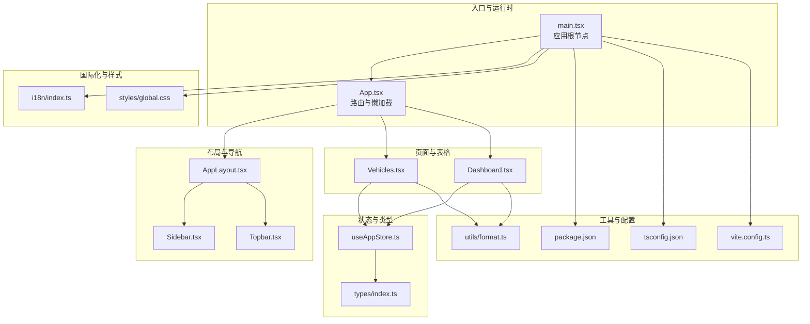
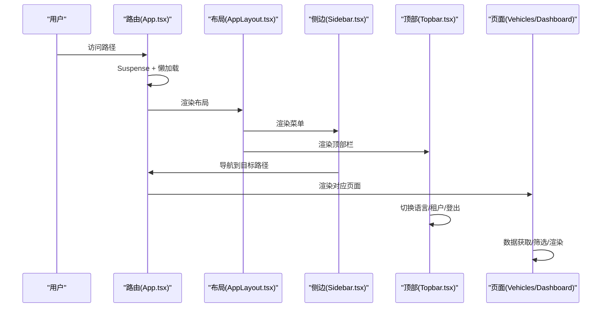
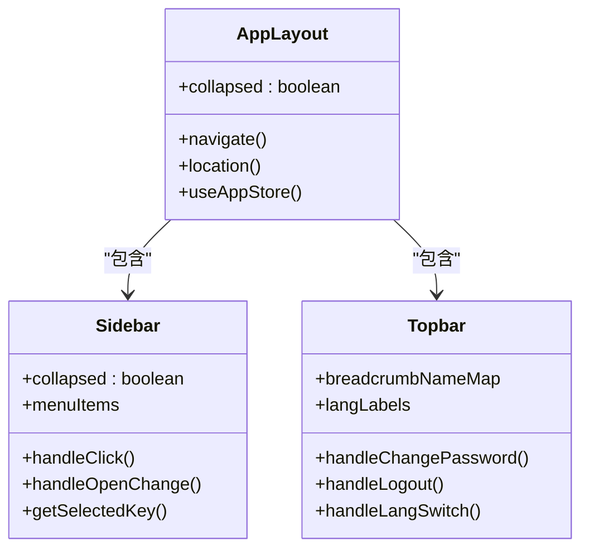
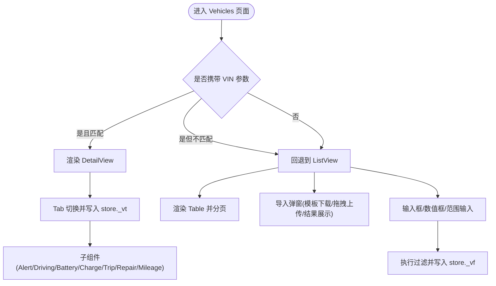
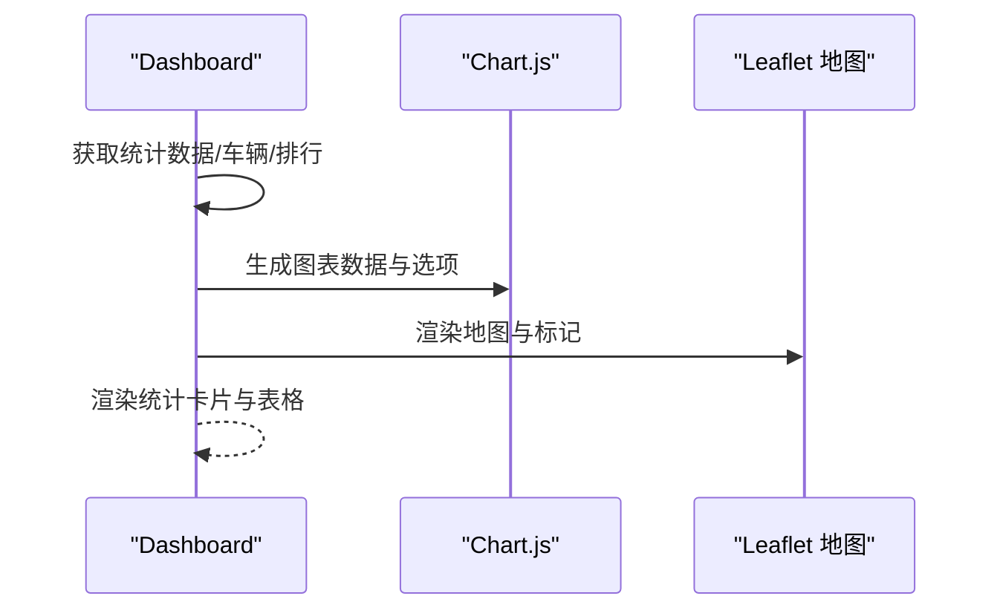
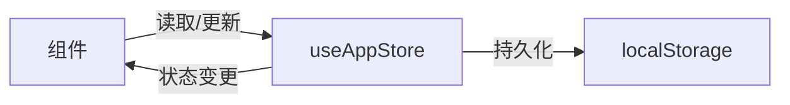
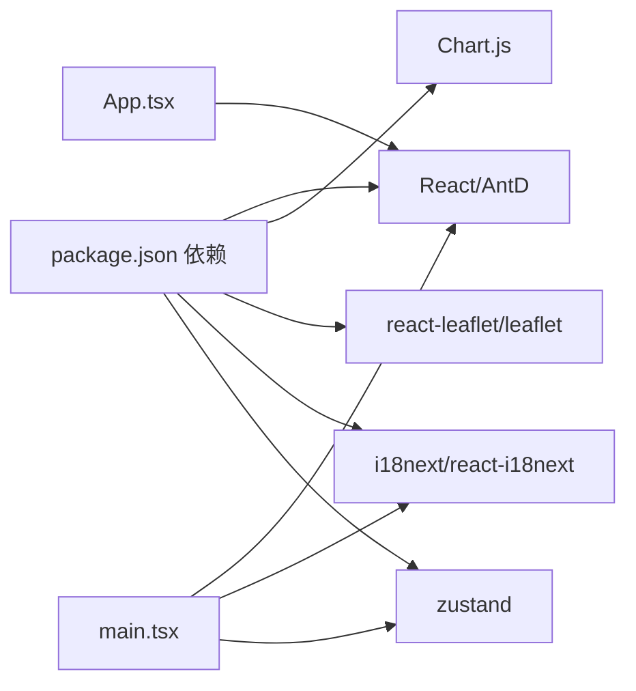

# 组件开发指南

<cite>
**本文引用的文件**
- [App.tsx](file://weidu-fleet/src/App.tsx)
- [main.tsx](file://weidu-fleet/src/main.tsx)
- [useAppStore.ts](file://weidu-fleet/src/store/useAppStore.ts)
- [index.ts（类型定义）](file://weidu-fleet/src/types/index.ts)
- [AppLayout.tsx](file://weidu-fleet/src/components/Layout/AppLayout.tsx)
- [Sidebar.tsx](file://weidu-fleet/src/components/Layout/Sidebar.tsx)
- [Topbar.tsx](file://weidu-fleet/src/components/Layout/Topbar.tsx)
- [Vehicles.tsx](file://weidu-fleet/src/pages/Vehicles.tsx)
- [Dashboard.tsx](file://weidu-fleet/src/pages/Dashboard.tsx)
- [format.ts（工具函数）](file://weidu-fleet/src/utils/format.ts)
- [global.css](file://weidu-fleet/src/styles/global.css)
- [index.ts（国际化）](file://weidu-fleet/src/i18n/index.ts)
- [package.json](file://weidu-fleet/package.json)
- [tsconfig.json](file://weidu-fleet/tsconfig.json)
- [vite.config.ts](file://weidu-fleet/vite.config.ts)
</cite>

## 目录
1. [引言](#引言)
2. [项目结构](#项目结构)
3. [核心组件](#核心组件)
4. [架构总览](#架构总览)
5. [组件详解](#组件详解)
6. [依赖关系分析](#依赖关系分析)
7. [性能考量](#性能考量)
8. [测试与调试](#测试与调试)
9. [样式与主题](#样式与主题)
10. [结论](#结论)
11. [附录：自定义组件开发流程与规范](#附录自定义组件开发流程与规范)

## 引言
本指南面向“苇渡-智利车队管理”项目，系统阐述组件开发最佳实践，覆盖 TypeScript 类型设计、Props 接口规范、状态管理模式、组件复用策略（HOC、Render Props、Hooks）、性能优化（memoization、懒加载、虚拟化）、测试与调试、样式与主题、以及从零到一的自定义组件开发流程。内容以仓库现有实现为依据，结合可扩展建议，帮助团队在保持一致性的同时提升开发效率与质量。

## 项目结构
项目采用基于功能域的组织方式，页面按业务模块划分，通用布局与工具函数分层存放，状态通过轻量状态库集中管理，国际化与全局样式统一注入。

图表来源
- [main.tsx:1-49](file://weidu-fleet/src/main.tsx#L1-L49)
- [App.tsx:1-88](file://weidu-fleet/src/App.tsx#L1-L88)
- [AppLayout.tsx:1-85](file://weidu-fleet/src/components/Layout/AppLayout.tsx#L1-L85)
- [Sidebar.tsx:1-272](file://weidu-fleet/src/components/Layout/Sidebar.tsx#L1-L272)
- [Topbar.tsx:1-233](file://weidu-fleet/src/components/Layout/Topbar.tsx#L1-L233)
- [Vehicles.tsx:1-440](file://weidu-fleet/src/pages/Vehicles.tsx#L1-L440)
- [Dashboard.tsx:1-257](file://weidu-fleet/src/pages/Dashboard.tsx#L1-L257)
- [useAppStore.ts:1-87](file://weidu-fleet/src/store/useAppStore.ts#L1-L87)
- [index.ts（类型定义）:1-261](file://weidu-fleet/src/types/index.ts#L1-L261)
- [format.ts（工具函数）:1-27](file://weidu-fleet/src/utils/format.ts#L1-L27)
- [global.css:1-7](file://weidu-fleet/src/styles/global.css#L1-L7)
- [index.ts（国际化）:1-30](file://weidu-fleet/src/i18n/index.ts#L1-L30)
- [package.json:1-41](file://weidu-fleet/package.json#L1-L41)
- [tsconfig.json:1-8](file://weidu-fleet/tsconfig.json#L1-L8)
- [vite.config.ts:1-16](file://weidu-fleet/vite.config.ts#L1-L16)

章节来源
- [main.tsx:1-49](file://weidu-fleet/src/main.tsx#L1-L49)
- [App.tsx:1-88](file://weidu-fleet/src/App.tsx#L1-L88)
- [package.json:1-41](file://weidu-fleet/package.json#L1-L41)
- [tsconfig.json:1-8](file://weidu-fleet/tsconfig.json#L1-L8)
- [vite.config.ts:1-16](file://weidu-fleet/vite.config.ts#L1-L16)

## 核心组件
- 应用根节点与运行时配置：负责路由、国际化、主题、全局样式注入与懒加载页面。
- 布局与导航：统一侧边栏菜单、顶部栏面包屑与用户操作、语言切换、租户切换等。
- 页面组件：如车辆列表/详情页、仪表盘等，承担数据获取、筛选、渲染与交互。
- 状态管理：使用轻量状态库集中存储页面键、语言、用户信息、查询参数等。
- 类型系统：集中定义业务实体与页面键，确保跨组件一致的数据契约。
- 工具函数：日期/时区处理、时长格式化、年龄计算等。

章节来源
- [main.tsx:1-49](file://weidu-fleet/src/main.tsx#L1-L49)
- [AppLayout.tsx:1-85](file://weidu-fleet/src/components/Layout/AppLayout.tsx#L1-L85)
- [Sidebar.tsx:1-272](file://weidu-fleet/src/components/Layout/Sidebar.tsx#L1-L272)
- [Topbar.tsx:1-233](file://weidu-fleet/src/components/Layout/Topbar.tsx#L1-L233)
- [Vehicles.tsx:1-440](file://weidu-fleet/src/pages/Vehicles.tsx#L1-L440)
- [Dashboard.tsx:1-257](file://weidu-fleet/src/pages/Dashboard.tsx#L1-L257)
- [useAppStore.ts:1-87](file://weidu-fleet/src/store/useAppStore.ts#L1-L87)
- [index.ts（类型定义）:1-261](file://weidu-fleet/src/types/index.ts#L1-L261)
- [format.ts（工具函数）:1-27](file://weidu-fleet/src/utils/format.ts#L1-L27)

## 架构总览
应用采用“路由驱动 + 轻量状态 + 国际化 + 全局样式”的前端架构。页面组件通过懒加载与 Suspense 提升首屏性能；状态通过集中 store 管理，避免深层 props 下传；国际化与 Ant Design 主题在根节点统一配置。

图表来源
- [App.tsx:1-88](file://weidu-fleet/src/App.tsx#L1-L88)
- [AppLayout.tsx:1-85](file://weidu-fleet/src/components/Layout/AppLayout.tsx#L1-L85)
- [Sidebar.tsx:1-272](file://weidu-fleet/src/components/Layout/Sidebar.tsx#L1-L272)
- [Topbar.tsx:1-233](file://weidu-fleet/src/components/Layout/Topbar.tsx#L1-L233)
- [Vehicles.tsx:1-440](file://weidu-fleet/src/pages/Vehicles.tsx#L1-L440)
- [Dashboard.tsx:1-257](file://weidu-fleet/src/pages/Dashboard.tsx#L1-L257)

## 组件详解

### 布局与导航组件
- AppLayout：负责布局骨架、折叠侧边栏、Outlet 内容区、鉴权态判断与登录态跳转。
- Sidebar：菜单项构建、选中态与展开态维护、Tab 参数同步至 store、点击导航。
- Topbar：面包屑、语言切换、租户选择、用户下拉、修改密码弹窗、登出。

图表来源
- [AppLayout.tsx:1-85](file://weidu-fleet/src/components/Layout/AppLayout.tsx#L1-L85)
- [Sidebar.tsx:1-272](file://weidu-fleet/src/components/Layout/Sidebar.tsx#L1-L272)
- [Topbar.tsx:1-233](file://weidu-fleet/src/components/Layout/Topbar.tsx#L1-L233)

章节来源
- [AppLayout.tsx:1-85](file://weidu-fleet/src/components/Layout/AppLayout.tsx#L1-L85)
- [Sidebar.tsx:1-272](file://weidu-fleet/src/components/Layout/Sidebar.tsx#L1-L272)
- [Topbar.tsx:1-233](file://weidu-fleet/src/components/Layout/Topbar.tsx#L1-L233)

### 页面组件：车辆列表与详情
- Vehicles：支持多条件筛选、导入模板下载、Excel/CSV 导入、失败明细导出、分页与响应式列宽。
- 详情页：Tab 切换风险/驾驶/电池/充电/行程/维修/里程趋势等子表单或图表。
- 使用 useMemo/useCallback 降低重渲染成本；使用 store 同步 Tab 与筛选条件。

图表来源
- [Vehicles.tsx:1-440](file://weidu-fleet/src/pages/Vehicles.tsx#L1-L440)

章节来源
- [Vehicles.tsx:1-440](file://weidu-fleet/src/pages/Vehicles.tsx#L1-L440)

### 页面组件：仪表盘
- Dashboard：统计卡片、柱状图（Chart.js）、Leaflet 实时地图、排行榜表格。
- 使用 useMemo 缓存图表数据与选项，减少不必要的重算。

图表来源
- [Dashboard.tsx:1-257](file://weidu-fleet/src/pages/Dashboard.tsx#L1-L257)

章节来源
- [Dashboard.tsx:1-257](file://weidu-fleet/src/pages/Dashboard.tsx#L1-L257)

### 状态管理：Zustand Store
- 集中存储页面键、语言、用户、租户、token、筛选与 Tab 参数等。
- 使用持久化中间件仅保存必要字段，避免本地存储膨胀。
- 提供细粒度 setter，便于组件局部订阅。

图表来源
- [useAppStore.ts:1-87](file://weidu-fleet/src/store/useAppStore.ts#L1-L87)

章节来源
- [useAppStore.ts:1-87](file://weidu-fleet/src/store/useAppStore.ts#L1-L87)

### 类型系统：统一契约
- 定义车辆、告警、围栏、行程、故障、电池、驾驶报告、业务实体等接口。
- 明确枚举值与字面量联合类型，保证跨组件数据一致性。

章节来源
- [index.ts（类型定义）:1-261](file://weidu-fleet/src/types/index.ts#L1-L261)

## 依赖关系分析
- 运行时依赖：React、Ant Design、Chart.js、react-leaflet、i18next、zustand 等。
- 开发依赖：@testing-library、vitest、typescript、vite 插件等。
- 路由与懒加载：react-router-dom + React.lazy + Suspense。
- 国际化：i18next + react-i18next，Ant Design 多语言包。
- 样式：全局字体与字号在 global.css 中统一；Ant Design 主题在根节点配置。

图表来源
- [package.json:1-41](file://weidu-fleet/package.json#L1-L41)
- [main.tsx:1-49](file://weidu-fleet/src/main.tsx#L1-L49)
- [App.tsx:1-88](file://weidu-fleet/src/App.tsx#L1-L88)

章节来源
- [package.json:1-41](file://weidu-fleet/package.json#L1-L41)
- [main.tsx:1-49](file://weidu-fleet/src/main.tsx#L1-L49)
- [App.tsx:1-88](file://weidu-fleet/src/App.tsx#L1-L88)

## 性能考量
- 懒加载与并发：页面组件通过 React.lazy 与 Suspense 实现按需加载，减少初始包体。
- 计算缓存：大量使用 useMemo 缓存复杂计算结果（如图表数据、筛选列表），避免重复渲染。
- 函数稳定：使用 useCallback 包裹事件处理器，降低子组件重渲染概率。
- 表格与列表：开启分页与横向滚动，避免一次性渲染超大数据集。
- 图表与地图：仅在需要时注册 Chart.js 组件，控制渲染范围与标记数量。
- 本地存储：store 持久化仅保存必要字段，避免无意义膨胀。

章节来源
- [App.tsx:1-88](file://weidu-fleet/src/App.tsx#L1-L88)
- [Vehicles.tsx:1-440](file://weidu-fleet/src/pages/Vehicles.tsx#L1-L440)
- [Dashboard.tsx:1-257](file://weidu-fleet/src/pages/Dashboard.tsx#L1-L257)
- [useAppStore.ts:1-87](file://weidu-fleet/src/store/useAppStore.ts#L1-L87)

## 测试与调试
- 单元测试与集成测试：使用 Vitest 与 @testing-library/react，建议对工具函数、纯组件与状态逻辑进行断言。
- 调试技巧：利用 React DevTools 的组件树与 Hooks 面板定位渲染问题；store 变更可通过浏览器控制台查看；日志与消息提示辅助定位交互问题。
- 国际化测试：验证多语言文案在不同语言下的显示与长度变化，防止布局溢出。
- 性能测试：使用 React Profiler 或浏览器性能面板观察重渲染热点，结合 useMemo/useCallback 优化。

章节来源
- [package.json:1-41](file://weidu-fleet/package.json#L1-L41)

## 样式与主题
- 全局样式：统一字体与字号，确保基础排版一致。
- Ant Design 主题：在根节点通过 ConfigProvider 设置语言与主题 token，如字号等。
- 响应式布局：页面组件广泛使用栅格与响应式断点，适配移动端与桌面端。
- 图标与颜色：使用 Ant Design 图标库与语义化颜色，保持视觉一致性。

章节来源
- [global.css:1-7](file://weidu-fleet/src/styles/global.css#L1-L7)
- [main.tsx:1-49](file://weidu-fleet/src/main.tsx#L1-L49)
- [Vehicles.tsx:1-440](file://weidu-fleet/src/pages/Vehicles.tsx#L1-L440)
- [Dashboard.tsx:1-257](file://weidu-fleet/src/pages/Dashboard.tsx#L1-L257)

## 结论
本指南总结了项目在组件开发中的实践要点：以类型系统为先、以状态集中为纲、以懒加载与缓存为要、以国际化与主题为基、以测试与调试为保障。遵循这些原则，可在保证一致性的同时显著提升开发效率与用户体验。

## 附录：自定义组件开发流程与规范
- 设计阶段
  - 明确职责边界，单一职责优先。
  - 定义 Props 接口与默认值，区分必需与可选属性。
  - 规划状态与副作用：内部状态 vs 外部状态，必要时通过回调暴露。
- 实现阶段
  - 使用 TypeScript 严格声明类型，优先使用联合类型与字面量类型。
  - 将可复用 UI 与逻辑拆分为独立模块，避免过度耦合。
  - 对昂贵计算使用 useMemo/useCallback，对事件处理器使用 useCallback。
  - 通过 store 或上下文传递共享状态，避免深层 props 下传。
- 复用与组合
  - 组合优于继承：优先使用 Render Props/Hooks 组合模式，而非 HOC。
  - 抽象公共容器组件，封装查询、分页、筛选等横切关注点。
- 性能优化
  - 懒加载重型组件与图表；对列表使用虚拟化（如虚拟滚动）。
  - 控制重渲染：合理拆分组件、使用 memo、稳定回调。
- 测试与调试
  - 为组件编写单元测试，覆盖正常/异常分支与边界条件。
  - 使用测试工具链与可视化调试手段，持续回归。
- 样式与主题
  - 统一使用 Ant Design 组件与主题 token，避免内联样式泛滥。
  - 采用响应式断点与弹性布局，保证多端一致体验。
- 发布与维护
  - 保持类型与接口稳定性，遵循语义化版本。
  - 文档化 Props、事件与行为，便于后续演进。