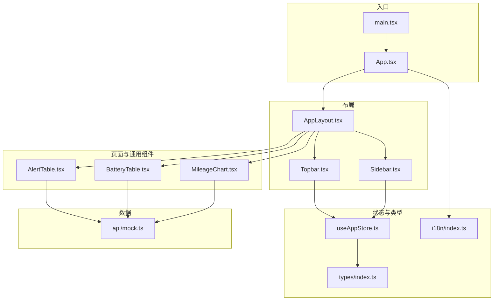
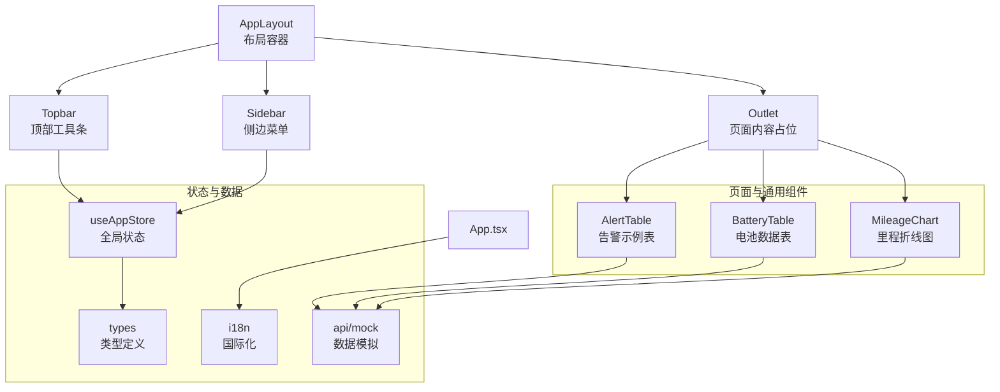
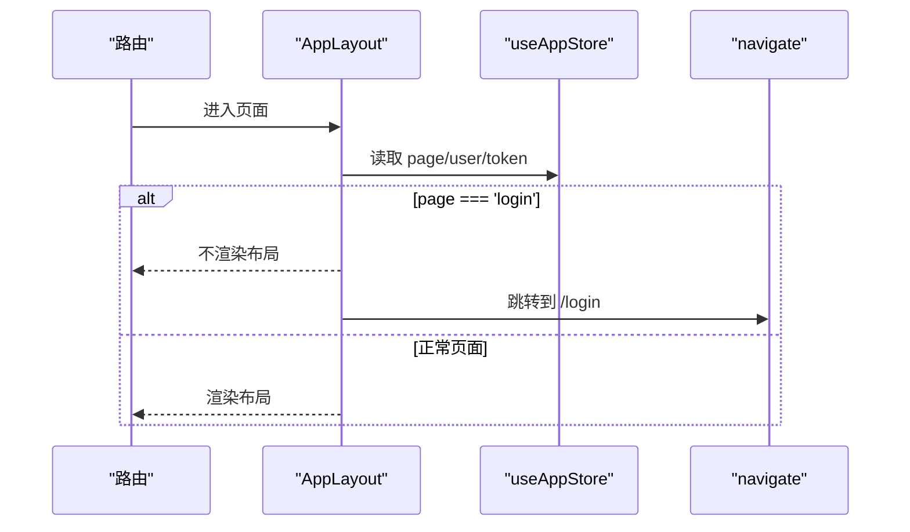
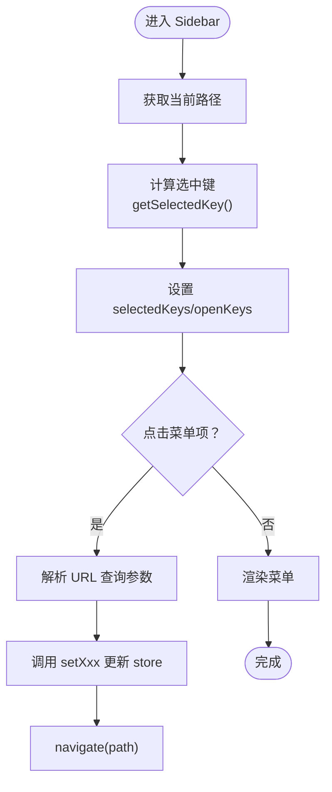
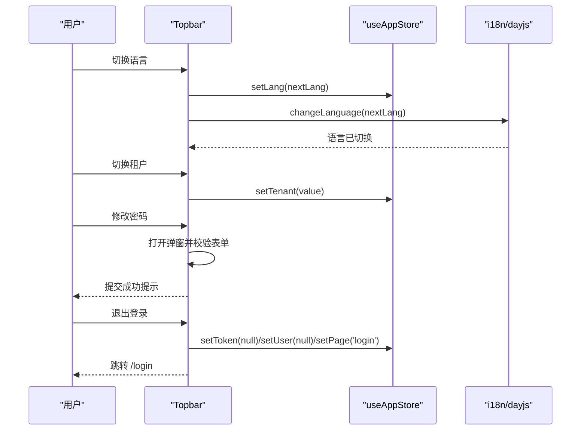
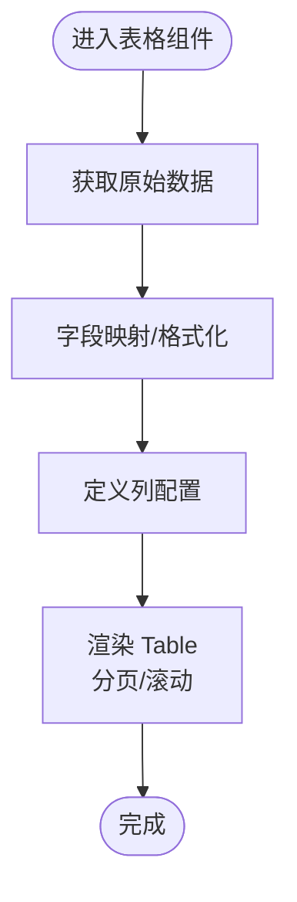
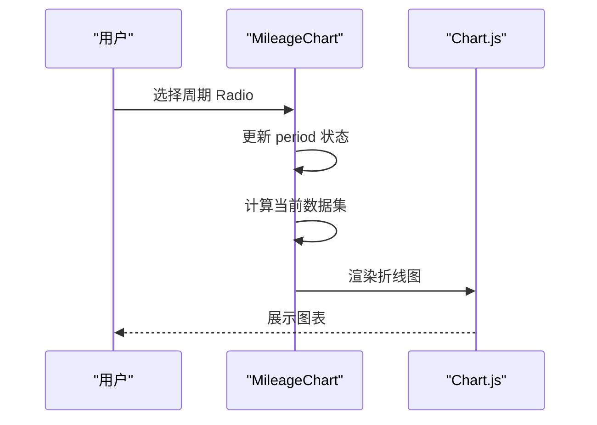
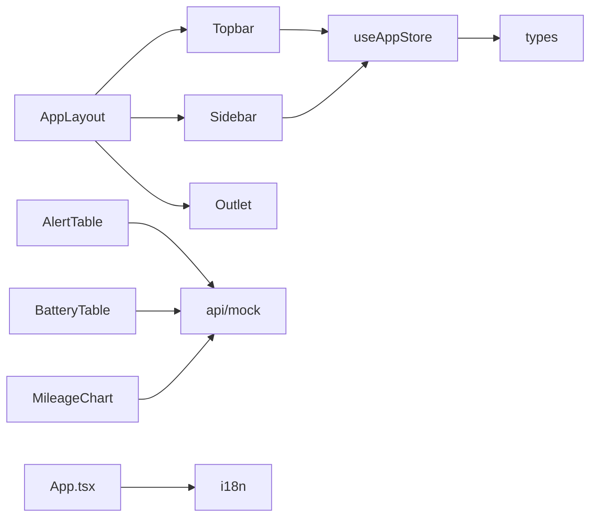

# 组件系统

<cite>
**本文引用的文件**
- [AppLayout.tsx](file://weidu-fleet/src/components/Layout/AppLayout.tsx)
- [Sidebar.tsx](file://weidu-fleet/src/components/Layout/Sidebar.tsx)
- [Topbar.tsx](file://weidu-fleet/src/components/Layout/Topbar.tsx)
- [AlertTable.tsx](file://weidu-fleet/src/pages/Vehicles/AlertTable.tsx)
- [BatteryTable.tsx](file://weidu-fleet/src/pages/Vehicles/BatteryTable.tsx)
- [MileageChart.tsx](file://weidu-fleet/src/pages/Vehicles/MileageChart.tsx)
- [useAppStore.ts](file://weidu-fleet/src/store/useAppStore.ts)
- [index.ts](file://weidu-fleet/src/types/index.ts)
- [index.ts](file://weidu-fleet/src/i18n/index.ts)
- [mock.ts](file://weidu-fleet/src/api/mock.ts)
- [App.tsx](file://weidu-fleet/src/App.tsx)
- [main.tsx](file://weidu-fleet/src/main.tsx)
</cite>

## 目录
1. [简介](#简介)
2. [项目结构](#项目结构)
3. [核心组件](#核心组件)
4. [架构总览](#架构总览)
5. [组件详解](#组件详解)
6. [依赖关系分析](#依赖关系分析)
7. [性能考量](#性能考量)
8. [故障排查指南](#故障排查指南)
9. [结论](#结论)
10. [附录](#附录)

## 简介
本文件面向“苇渡-智利车队管理”项目的前端组件系统，聚焦于UI组件的设计模式、复用策略与实现细节，系统性梳理布局组件（AppLayout、Sidebar、Topbar）的职责与协作方式，并对表格、图表、表单等通用组件进行设计原理与使用方法说明。同时给出组件属性接口、事件处理与状态管理的最佳实践，以及组件组合模式与自定义组件开发指南，帮助开发者在保持一致性的同时提升可维护性与扩展性。

## 项目结构
项目采用按功能域分层的组织方式：布局组件位于 components/Layout，业务页面位于 pages，状态管理通过 zustand 的 useAppStore 实现，类型定义集中在 types，国际化配置在 i18n，数据模拟在 api/mock。入口文件 main.tsx 渲染根组件 App.tsx，App.tsx 中通过路由挂载 AppLayout，再由 AppLayout 内部渲染 Sidebar 与 Topbar，并通过 Outlet 呈现代理页面内容。

图示来源
- [main.tsx](file://weidu-fleet/src/main.tsx)
- [App.tsx](file://weidu-fleet/src/App.tsx)
- [AppLayout.tsx](file://weidu-fleet/src/components/Layout/AppLayout.tsx)
- [Sidebar.tsx](file://weidu-fleet/src/components/Layout/Sidebar.tsx)
- [Topbar.tsx](file://weidu-fleet/src/components/Layout/Topbar.tsx)
- [AlertTable.tsx](file://weidu-fleet/src/pages/Vehicles/AlertTable.tsx)
- [BatteryTable.tsx](file://weidu-fleet/src/pages/Vehicles/BatteryTable.tsx)
- [MileageChart.tsx](file://weidu-fleet/src/pages/Vehicles/MileageChart.tsx)
- [useAppStore.ts](file://weidu-fleet/src/store/useAppStore.ts)
- [index.ts](file://weidu-fleet/src/types/index.ts)
- [index.ts](file://weidu-fleet/src/i18n/index.ts)
- [mock.ts](file://weidu-fleet/src/api/mock.ts)

章节来源
- [main.tsx](file://weidu-fleet/src/main.tsx)
- [App.tsx](file://weidu-fleet/src/App.tsx)
- [AppLayout.tsx](file://weidu-fleet/src/components/Layout/AppLayout.tsx)

## 核心组件
- 布局容器 AppLayout：负责整体页面骨架、侧边栏折叠状态、登录态判定与 Outlet 内容渲染。
- 侧边菜单 Sidebar：基于 Ant Design Menu 构建，支持多级子菜单、当前选中态与 Tab 参数同步。
- 顶部工具条 Topbar：集成面包屑、语言切换、租户切换、用户下拉菜单与密码修改弹窗。
- 通用表格组件：如 AlertTable、BatteryTable，封装数据获取、列映射与分页配置。
- 图表组件：如 MileageChart，封装 Chart.js 注册、数据映射与交互控件。
- 状态管理 useAppStore：集中管理页面键、语言、用户、令牌、租户、各 Tab 选择等全局状态。
- 类型系统 types：统一定义车辆、告警、维修、围栏、业务与系统相关实体类型。
- 国际化 i18n：初始化多语言资源与本地持久化语言偏好。
- 数据模拟 api/mock：提供全量业务数据的 mock 接口，支撑演示与联调。

章节来源
- [AppLayout.tsx](file://weidu-fleet/src/components/Layout/AppLayout.tsx)
- [Sidebar.tsx](file://weidu-fleet/src/components/Layout/Sidebar.tsx)
- [Topbar.tsx](file://weidu-fleet/src/components/Layout/Topbar.tsx)
- [AlertTable.tsx](file://weidu-fleet/src/pages/Vehicles/AlertTable.tsx)
- [BatteryTable.tsx](file://weidu-fleet/src/pages/Vehicles/BatteryTable.tsx)
- [MileageChart.tsx](file://weidu-fleet/src/pages/Vehicles/MileageChart.tsx)
- [useAppStore.ts](file://weidu-fleet/src/store/useAppStore.ts)
- [index.ts](file://weidu-fleet/src/types/index.ts)
- [index.ts](file://weidu-fleet/src/i18n/index.ts)
- [mock.ts](file://weidu-fleet/src/api/mock.ts)

## 架构总览
应用采用“布局容器 + 页面组件 + 通用组件 + 状态与数据”的分层架构。AppLayout 作为根容器，承载 Sidebar 与 Topbar；页面组件通过路由挂载到 AppLayout 的 Outlet；通用组件（表格、图表）在页面内复用；状态通过 useAppStore 集中式管理，类型与国际化贯穿全局。

图示来源
- [AppLayout.tsx](file://weidu-fleet/src/components/Layout/AppLayout.tsx)
- [Sidebar.tsx](file://weidu-fleet/src/components/Layout/Sidebar.tsx)
- [Topbar.tsx](file://weidu-fleet/src/components/Layout/Topbar.tsx)
- [AlertTable.tsx](file://weidu-fleet/src/pages/Vehicles/AlertTable.tsx)
- [BatteryTable.tsx](file://weidu-fleet/src/pages/Vehicles/BatteryTable.tsx)
- [MileageChart.tsx](file://weidu-fleet/src/pages/Vehicles/MileageChart.tsx)
- [useAppStore.ts](file://weidu-fleet/src/store/useAppStore.ts)
- [index.ts](file://weidu-fleet/src/types/index.ts)
- [index.ts](file://weidu-fleet/src/i18n/index.ts)
- [mock.ts](file://weidu-fleet/src/api/mock.ts)
- [App.tsx](file://weidu-fleet/src/App.tsx)

## 组件详解

### 布局组件：AppLayout、Sidebar、Topbar

#### AppLayout 设计与职责
- 职责：统一页面骨架、控制登录态、管理侧边栏折叠、渲染 Outlet。
- 关键点：
  - 使用路由钩子获取 location 与 navigate，结合 store 的 page 字段决定是否跳转至登录。
  - 通过 useState 维护 collapsed 状态，传递给 Sidebar 控制宽度与图标显示。
  - Header 固顶，Content 区域滚动，布局稳定且响应式。
- 登录态与导航：
  - 当 store.page 为 'login' 时，不渲染布局，直接返回空，避免循环跳转。
  - 其他页面均通过 AppLayout 包裹，确保统一风格。

图示来源
- [AppLayout.tsx](file://weidu-fleet/src/components/Layout/AppLayout.tsx)
- [useAppStore.ts](file://weidu-fleet/src/store/useAppStore.ts)

章节来源
- [AppLayout.tsx](file://weidu-fleet/src/components/Layout/AppLayout.tsx)

#### Sidebar 设计与职责
- 职责：构建左侧导航菜单，支持多级子菜单、当前路径高亮、Tab 参数同步。
- 关键点：
  - 使用 Ant Design Menu，items 由多级对象构成，支持图标与文案国际化。
  - 通过 useLocation 获取当前路径，结合 store 的各 Tab 键值（如 _mt/_rt/_dt/_bt/_bz）计算选中项。
  - handleClick 处理点击事件，解析 URL 查询参数并调用对应 setXxx 方法更新 store。
  - handleOpenChange 控制父级菜单展开状态，getSelectedKey 动态计算选中键集合。
- 交互与联动：
  - 侧边栏折叠时，Logo 文案隐藏，菜单宽度从 200 缩减至 80，保证空间利用。
  - 顶部 Topbar 的面包屑与 Sidebar 的选中态保持一致。

图示来源
- [Sidebar.tsx](file://weidu-fleet/src/components/Layout/Sidebar.tsx)
- [useAppStore.ts](file://weidu-fleet/src/store/useAppStore.ts)

章节来源
- [Sidebar.tsx](file://weidu-fleet/src/components/Layout/Sidebar.tsx)

#### Topbar 设计与职责
- 职责：顶部工具条，包含面包屑、语言切换、租户切换、用户下拉菜单与密码修改弹窗。
- 关键点：
  - 面包屑根据当前路径映射到国际化文案，保持与 Sidebar 一致。
  - 语言切换按 zh/en/es 循环切换，同时更新 i18n 与 dayjs 本地化。
  - 租户切换 Select 从 mock 数据源加载，支持空值占位。
  - 用户下拉菜单提供“修改密码”和“退出登录”，退出后清空 store 并跳转登录。
  - 密码修改弹窗使用 Ant Design Form，包含必填与长度校验，提交成功提示消息。
- 与 Sidebar 的协同：
  - 二者共同依赖 useAppStore 的语言、租户、用户、令牌与页面键，形成统一上下文。

图示来源
- [Topbar.tsx](file://weidu-fleet/src/components/Layout/Topbar.tsx)
- [useAppStore.ts](file://weidu-fleet/src/store/useAppStore.ts)
- [index.ts](file://weidu-fleet/src/i18n/index.ts)
- [mock.ts](file://weidu-fleet/src/api/mock.ts)

章节来源
- [Topbar.tsx](file://weidu-fleet/src/components/Layout/Topbar.tsx)

### 通用组件：表格、图表、表单

#### 表格组件：AlertTable、BatteryTable
- 设计原则：
  - 使用 useMemo 缓存数据与列映射，减少重复计算。
  - 列定义简洁明确，支持小尺寸与横向滚动，适配移动端。
  - 分页默认每页 20 条，支持切换页大小。
- AlertTable：
  - 将英文告警名与内容映射为中文，增强可读性。
  - 数据来源于 mock 的 getVehicleAlerts。
- BatteryTable：
  - 对数值列进行格式化（百分比、温度单位、续航单位），提升可读性。
  - 接收外部传入的 Vehicle 类型，便于在详情页复用。

图示来源
- [AlertTable.tsx](file://weidu-fleet/src/pages/Vehicles/AlertTable.tsx)
- [BatteryTable.tsx](file://weidu-fleet/src/pages/Vehicles/BatteryTable.tsx)
- [mock.ts](file://weidu-fleet/src/api/mock.ts)

章节来源
- [AlertTable.tsx](file://weidu-fleet/src/pages/Vehicles/AlertTable.tsx)
- [BatteryTable.tsx](file://weidu-fleet/src/pages/Vehicles/BatteryTable.tsx)

#### 图表组件：MileageChart
- 设计原则：
  - 使用 Chart.js 注册必要组件，确保折线图渲染能力。
  - 通过 Radio.Group 切换统计周期（日/周/月/年），动态生成数据集。
  - 配置响应式与网格样式，优化视觉体验。
- 交互与状态：
  - 内部 useState 维护 period，外部无需传参即可使用。

图示来源
- [MileageChart.tsx](file://weidu-fleet/src/pages/Vehicles/MileageChart.tsx)

章节来源
- [MileageChart.tsx](file://weidu-fleet/src/pages/Vehicles/MileageChart.tsx)

#### 表单组件：Topbar 中的密码修改弹窗
- 设计原则：
  - 使用 Ant Design Form 与 Form.Item 定义字段与规则。
  - 旧密码、新密码、确认密码之间存在依赖校验，防止新旧密码相同或不一致。
  - 提交成功后提示消息并重置表单，提升用户体验。
- 最佳实践：
  - 表单验证应尽量在客户端即时反馈，减少无效提交。
  - 对敏感操作（如修改密码）建议增加二次确认或服务端校验。

章节来源
- [Topbar.tsx](file://weidu-fleet/src/components/Layout/Topbar.tsx)

### 组件属性接口、事件处理与状态管理最佳实践

#### 属性接口
- SidebarProps：接收 collapsed 布尔值，用于控制菜单宽度与图标显示。
- BatteryTable Props：接收 Vehicle 类型，便于在不同上下文中复用。
- 其他通用组件：尽量以只读 props 传入数据与配置，避免内部直接访问全局状态。

章节来源
- [Sidebar.tsx](file://weidu-fleet/src/components/Layout/Sidebar.tsx)
- [BatteryTable.tsx](file://weidu-fleet/src/pages/Vehicles/BatteryTable.tsx)
- [index.ts](file://weidu-fleet/src/types/index.ts)

#### 事件处理
- Sidebar：onClick 解析 URL 查询参数并调用 store 的 setXxx 方法，随后 navigate 到目标路径。
- Topbar：语言切换、租户切换、用户下拉菜单、密码修改弹窗提交均通过事件回调更新 store 或触发导航。
- 通用组件：表格与图表的交互（如 Radio 切换）通过内部状态更新视图。

章节来源
- [Sidebar.tsx](file://weidu-fleet/src/components/Layout/Sidebar.tsx)
- [Topbar.tsx](file://weidu-fleet/src/components/Layout/Topbar.tsx)
- [MileageChart.tsx](file://weidu-fleet/src/pages/Vehicles/MileageChart.tsx)

#### 状态管理最佳实践
- 集中式：所有页面键、语言、用户、令牌、租户、Tab 选择等状态统一存储在 useAppStore。
- 持久化：仅持久化必要的用户态信息（用户、令牌、语言、租户），避免污染本地存储。
- 选择性订阅：AppLayout 仅订阅 page/user/token，Sidebar/Topbar 各自订阅所需字段，降低重渲染成本。
- 状态粒度：Tab 选择键（如 _mt/_rt/_dt/_bt/_bz）独立管理，便于跨页面共享状态。

章节来源
- [useAppStore.ts](file://weidu-fleet/src/store/useAppStore.ts)

### 组件组合模式与自定义组件开发指南
- 组合模式：
  - AppLayout 作为根容器，组合 Sidebar 与 Topbar，再通过 Outlet 插槽挂载页面。
  - 页面内组合通用组件（表格、图表），并通过 props 传递数据与配置。
- 自定义组件开发建议：
  - 明确单一职责：每个组件只负责一个功能域（如仅渲染列表或仅绘制图表）。
  - 抽象可复用逻辑：将数据获取、列定义、格式化函数抽取为可复用的 hooks 或工具函数。
  - 规范属性命名：使用语义化 props，避免过度耦合。
  - 事件透传：对外暴露受控属性与回调，便于上层统一处理。
  - 主题与样式：遵循 Ant Design 设计规范，避免硬编码颜色与尺寸。

## 依赖关系分析

图示来源
- [AppLayout.tsx](file://weidu-fleet/src/components/Layout/AppLayout.tsx)
- [Sidebar.tsx](file://weidu-fleet/src/components/Layout/Sidebar.tsx)
- [Topbar.tsx](file://weidu-fleet/src/components/Layout/Topbar.tsx)
- [AlertTable.tsx](file://weidu-fleet/src/pages/Vehicles/AlertTable.tsx)
- [BatteryTable.tsx](file://weidu-fleet/src/pages/Vehicles/BatteryTable.tsx)
- [MileageChart.tsx](file://weidu-fleet/src/pages/Vehicles/MileageChart.tsx)
- [useAppStore.ts](file://weidu-fleet/src/store/useAppStore.ts)
- [index.ts](file://weidu-fleet/src/types/index.ts)
- [index.ts](file://weidu-fleet/src/i18n/index.ts)
- [mock.ts](file://weidu-fleet/src/api/mock.ts)
- [App.tsx](file://weidu-fleet/src/App.tsx)

章节来源
- [useAppStore.ts](file://weidu-fleet/src/store/useAppStore.ts)
- [mock.ts](file://weidu-fleet/src/api/mock.ts)
- [index.ts](file://weidu-fleet/src/types/index.ts)
- [index.ts](file://weidu-fleet/src/i18n/index.ts)

## 性能考量
- 渲染优化：
  - Sidebar 与 Topbar 仅订阅所需字段，避免不必要的重渲染。
  - 表格组件使用 useMemo 缓存数据与列映射，减少重复计算。
- 资源加载：
  - 图表组件按需注册 Chart.js 组件，避免引入冗余模块。
- 交互体验：
  - 侧边栏折叠动画与布局过渡平滑，提升可用性。
- 存储与缓存：
  - useAppStore 仅持久化必要字段，降低本地存储压力。

## 故障排查指南
- 登录态问题：
  - 若刷新后被重定向至登录，检查 store.page 是否为 'login'，确认 setToken/setUser 是否正确清空。
- 菜单选中异常：
  - 检查 getSelectedKey 逻辑与当前路径匹配，确认 store 中对应 Tab 键值是否正确更新。
- 语言切换失效：
  - 确认 i18n 初始化与 changeLanguage 调用顺序，检查本地存储中的语言键是否存在。
- 表单校验失败：
  - 查看密码修改弹窗的规则与依赖字段，确保旧/新密码不一致且符合最小长度要求。
- 图表不显示：
  - 确认 Chart.js 组件已注册，数据映射与选项配置正确。

章节来源
- [AppLayout.tsx](file://weidu-fleet/src/components/Layout/AppLayout.tsx)
- [Sidebar.tsx](file://weidu-fleet/src/components/Layout/Sidebar.tsx)
- [Topbar.tsx](file://weidu-fleet/src/components/Layout/Topbar.tsx)
- [MileageChart.tsx](file://weidu-fleet/src/pages/Vehicles/MileageChart.tsx)
- [useAppStore.ts](file://weidu-fleet/src/store/useAppStore.ts)
- [index.ts](file://weidu-fleet/src/i18n/index.ts)

## 结论
本组件系统以 AppLayout 为核心容器，配合 Sidebar 与 Topbar 形成统一的布局与交互体系；通过通用表格与图表组件实现数据可视化与信息呈现；借助 useAppStore 实现集中式状态管理与持久化；类型系统与国际化贯穿始终，保障了系统的可维护性与可扩展性。遵循本文提供的最佳实践与开发指南，可在保证一致性的同时快速迭代新功能。

## 附录
- 快速定位参考：
  - 布局与导航：[AppLayout.tsx](file://weidu-fleet/src/components/Layout/AppLayout.tsx)、[Sidebar.tsx](file://weidu-fleet/src/components/Layout/Sidebar.tsx)、[Topbar.tsx](file://weidu-fleet/src/components/Layout/Topbar.tsx)
  - 通用组件：[AlertTable.tsx](file://weidu-fleet/src/pages/Vehicles/AlertTable.tsx)、[BatteryTable.tsx](file://weidu-fleet/src/pages/Vehicles/BatteryTable.tsx)、[MileageChart.tsx](file://weidu-fleet/src/pages/Vehicles/MileageChart.tsx)
  - 状态与类型：[useAppStore.ts](file://weidu-fleet/src/store/useAppStore.ts)、[index.ts](file://weidu-fleet/src/types/index.ts)
  - 国际化与数据：[index.ts](file://weidu-fleet/src/i18n/index.ts)、[mock.ts](file://weidu-fleet/src/api/mock.ts)
  - 应用入口：[App.tsx](file://weidu-fleet/src/App.tsx)、[main.tsx](file://weidu-fleet/src/main.tsx)