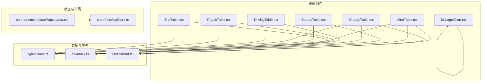
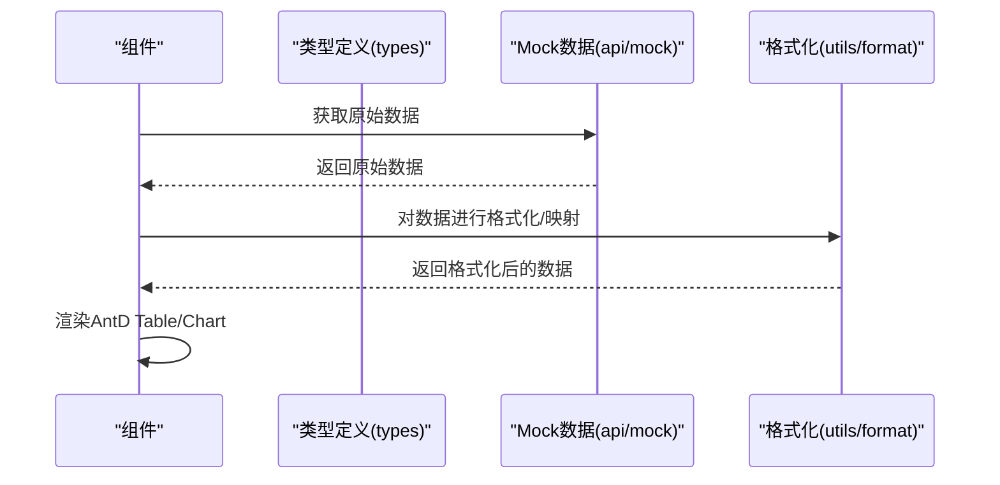
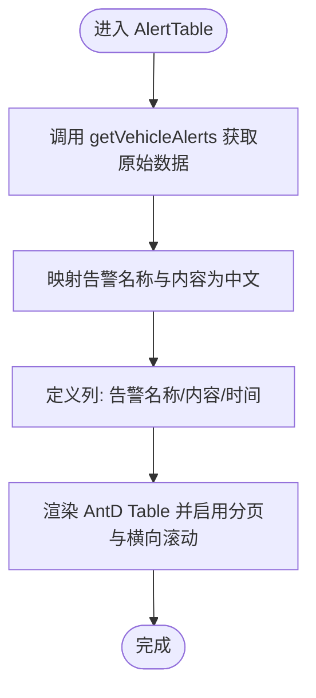
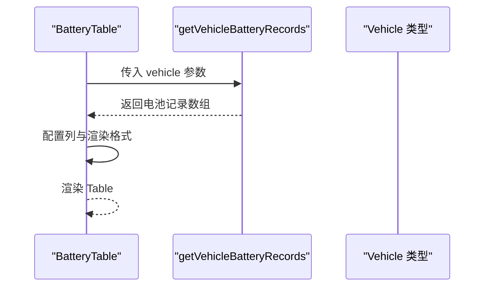
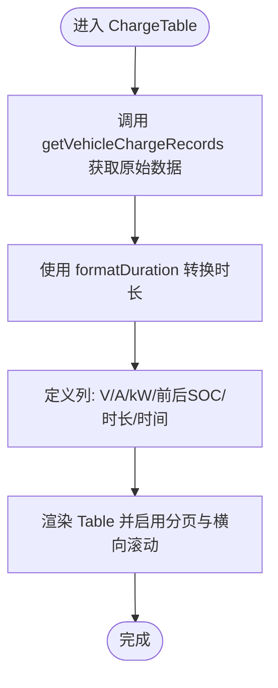
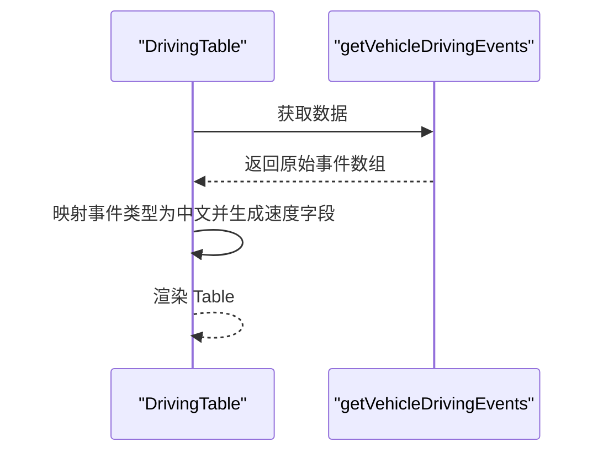
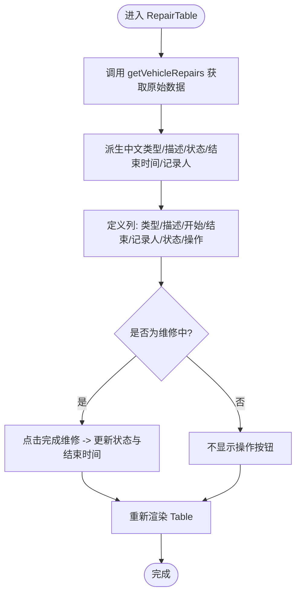
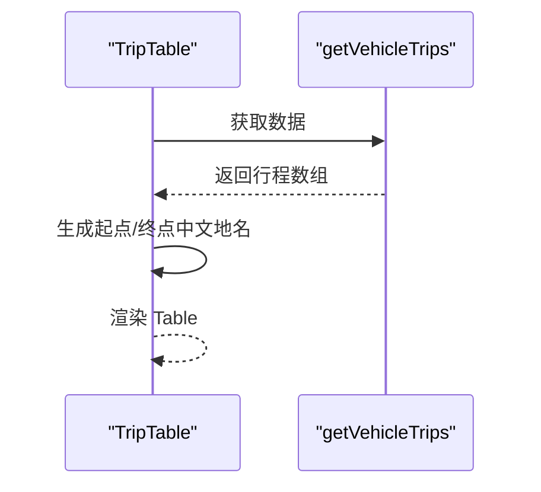
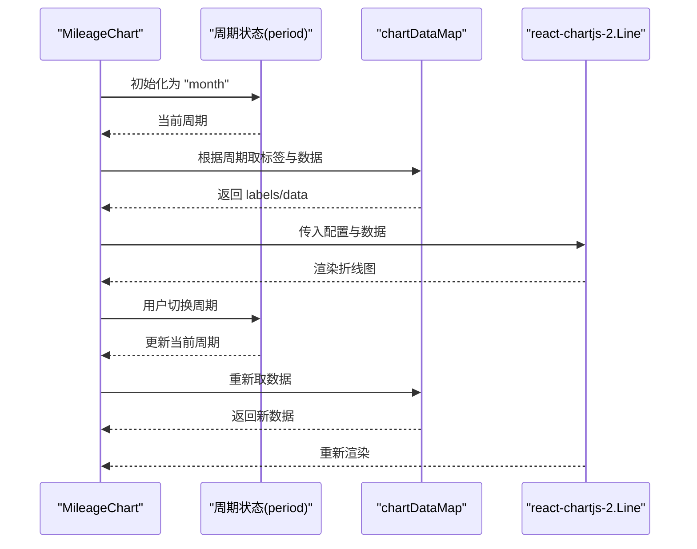
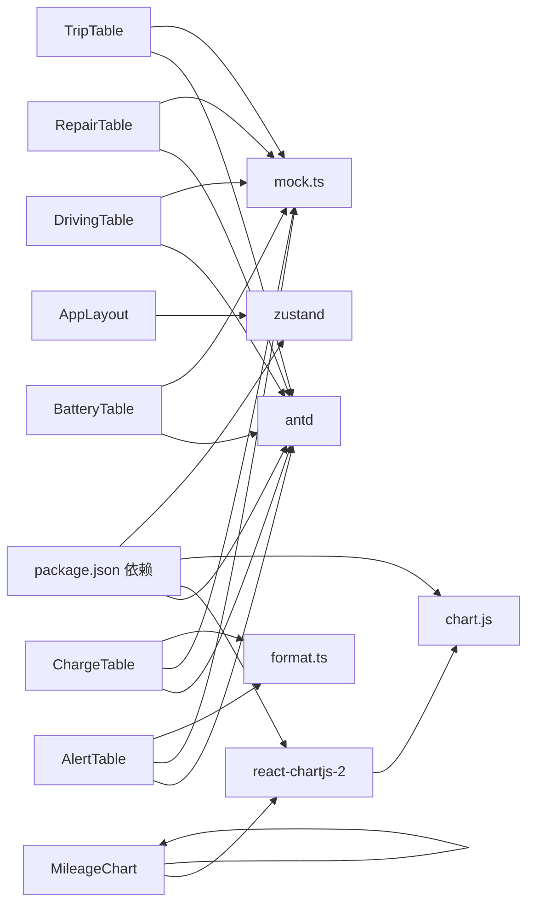

# 通用UI组件

<cite>
**本文引用的文件**
- [AlertTable.tsx](file://weidu-fleet/src/pages/Vehicles/AlertTable.tsx)
- [BatteryTable.tsx](file://weidu-fleet/src/pages/Vehicles/BatteryTable.tsx)
- [ChargeTable.tsx](file://weidu-fleet/src/pages/Vehicles/ChargeTable.tsx)
- [DrivingTable.tsx](file://weidu-fleet/src/pages/Vehicles/DrivingTable.tsx)
- [RepairTable.tsx](file://weidu-fleet/src/pages/Vehicles/RepairTable.tsx)
- [TripTable.tsx](file://weidu-fleet/src/pages/Vehicles/TripTable.tsx)
- [MileageChart.tsx](file://weidu-fleet/src/pages/Vehicles/MileageChart.tsx)
- [index.ts](file://weidu-fleet/src/types/index.ts)
- [mock.ts](file://weidu-fleet/src/api/mock.ts)
- [format.ts](file://weidu-fleet/src/utils/format.ts)
- [useAppStore.ts](file://weidu-fleet/src/store/useAppStore.ts)
- [AppLayout.tsx](file://weidu-fleet/src/components/Layout/AppLayout.tsx)
- [package.json](file://weidu-fleet/package.json)
</cite>

## 目录
1. [简介](#简介)
2. [项目结构](#项目结构)
3. [核心组件](#核心组件)
4. [架构总览](#架构总览)
5. [详细组件分析](#详细组件分析)
6. [依赖关系分析](#依赖关系分析)
7. [性能考虑](#性能考虑)
8. [故障排查指南](#故障排查指南)
9. [结论](#结论)
10. [附录](#附录)

## 简介
本文件面向“苇渡-智利车队管理”项目中的通用UI组件，重点围绕车辆相关页面的表格与图表组件进行系统化说明。内容涵盖：
- 表格组件（AlertTable、BatteryTable、ChargeTable、DrivingTable、RepairTable、TripTable）的设计模式与实现细节：数据绑定、排序筛选、分页处理、行操作。
- 图表组件（MileageChart）的数据可视化实现：图表配置、数据格式转换、交互功能。
- 组件属性接口定义、事件回调机制与状态管理策略。
- 组件复用模式、性能优化技巧与自定义扩展方法。
- 组件间的数据传递与通信机制。

## 项目结构
本项目采用按页面组织的前端结构，车辆相关组件集中于 Vehicles 页面目录下，配合类型定义、Mock 数据与工具函数共同构成完整的展示层。

图示来源
- [AlertTable.tsx:1-42](file://weidu-fleet/src/pages/Vehicles/AlertTable.tsx#L1-L42)
- [BatteryTable.tsx:1-20](file://weidu-fleet/src/pages/Vehicles/BatteryTable.tsx#L1-L20)
- [ChargeTable.tsx:1-27](file://weidu-fleet/src/pages/Vehicles/ChargeTable.tsx#L1-L27)
- [DrivingTable.tsx:1-33](file://weidu-fleet/src/pages/Vehicles/DrivingTable.tsx#L1-L33)
- [RepairTable.tsx:1-57](file://weidu-fleet/src/pages/Vehicles/RepairTable.tsx#L1-L57)
- [TripTable.tsx:1-30](file://weidu-fleet/src/pages/Vehicles/TripTable.tsx#L1-L30)
- [MileageChart.tsx:1-76](file://weidu-fleet/src/pages/Vehicles/MileageChart.tsx#L1-L76)
- [index.ts:1-261](file://weidu-fleet/src/types/index.ts#L1-L261)
- [mock.ts:1-634](file://weidu-fleet/src/api/mock.ts#L1-L634)
- [format.ts:1-27](file://weidu-fleet/src/utils/format.ts#L1-L27)
- [useAppStore.ts:1-87](file://weidu-fleet/src/store/useAppStore.ts#L1-L87)
- [AppLayout.tsx:1-85](file://weidu-fleet/src/components/Layout/AppLayout.tsx#L1-L85)

章节来源
- [AlertTable.tsx:1-42](file://weidu-fleet/src/pages/Vehicles/AlertTable.tsx#L1-L42)
- [BatteryTable.tsx:1-20](file://weidu-fleet/src/pages/Vehicles/BatteryTable.tsx#L1-L20)
- [ChargeTable.tsx:1-27](file://weidu-fleet/src/pages/Vehicles/ChargeTable.tsx#L1-L27)
- [DrivingTable.tsx:1-33](file://weidu-fleet/src/pages/Vehicles/DrivingTable.tsx#L1-L33)
- [RepairTable.tsx:1-57](file://weidu-fleet/src/pages/Vehicles/RepairTable.tsx#L1-L57)
- [TripTable.tsx:1-30](file://weidu-fleet/src/pages/Vehicles/TripTable.tsx#L1-L30)
- [MileageChart.tsx:1-76](file://weidu-fleet/src/pages/Vehicles/MileageChart.tsx#L1-L76)
- [index.ts:1-261](file://weidu-fleet/src/types/index.ts#L1-L261)
- [mock.ts:1-634](file://weidu-fleet/src/api/mock.ts#L1-L634)
- [format.ts:1-27](file://weidu-fleet/src/utils/format.ts#L1-L27)
- [useAppStore.ts:1-87](file://weidu-fleet/src/store/useAppStore.ts#L1-L87)
- [AppLayout.tsx:1-85](file://weidu-fleet/src/components/Layout/AppLayout.tsx#L1-L85)

## 核心组件
本节概述各组件的职责与共性特征：
- 表格组件均基于 Ant Design 的 Table 组件，统一使用小尺寸、横向滚动与可配置分页。
- 数据来源统一通过 Mock API 提供，部分组件在渲染阶段进行本地格式化或映射。
- 图表组件基于 react-chartjs-2 与 Chart.js，提供周期切换与基础样式配置。

章节来源
- [AlertTable.tsx:24-39](file://weidu-fleet/src/pages/Vehicles/AlertTable.tsx#L24-L39)
- [BatteryTable.tsx:7-17](file://weidu-fleet/src/pages/Vehicles/BatteryTable.tsx#L7-L17)
- [ChargeTable.tsx:7-24](file://weidu-fleet/src/pages/Vehicles/ChargeTable.tsx#L7-L24)
- [MileageChart.tsx:19-73](file://weidu-fleet/src/pages/Vehicles/MileageChart.tsx#L19-L73)

## 架构总览
组件间的数据流与依赖关系如下：

图示来源
- [AlertTable.tsx:26-31](file://weidu-fleet/src/pages/Vehicles/AlertTable.tsx#L26-L31)
- [BatteryTable.tsx:9-9](file://weidu-fleet/src/pages/Vehicles/BatteryTable.tsx#L9-L9)
- [ChargeTable.tsx:9-13](file://weidu-fleet/src/pages/Vehicles/ChargeTable.tsx#L9-L13)
- [DrivingTable.tsx:17-22](file://weidu-fleet/src/pages/Vehicles/DrivingTable.tsx#L17-L22)
- [RepairTable.tsx:8-22](file://weidu-fleet/src/pages/Vehicles/RepairTable.tsx#L8-L22)
- [TripTable.tsx:10-15](file://weidu-fleet/src/pages/Vehicles/TripTable.tsx#L10-L15)
- [mock.ts:536-594](file://weidu-fleet/src/api/mock.ts#L536-L594)
- [format.ts:9-16](file://weidu-fleet/src/utils/format.ts#L9-L16)

## 详细组件分析

### 表格组件设计模式与实现要点
- 数据绑定：使用 useMemo 缓存原始数据与派生数据，避免重复计算。
- 排序筛选：当前组件未显式传入排序/筛选参数，默认由 AntD Table 处理。
- 分页处理：统一配置默认每页条数与页码选项，支持页码变更。
- 行操作：部分组件（如 RepairTable）提供按钮触发的操作逻辑。

章节来源
- [AlertTable.tsx:26-39](file://weidu-fleet/src/pages/Vehicles/AlertTable.tsx#L26-L39)
- [BatteryTable.tsx:9-17](file://weidu-fleet/src/pages/Vehicles/BatteryTable.tsx#L9-L17)
- [ChargeTable.tsx:9-24](file://weidu-fleet/src/pages/Vehicles/ChargeTable.tsx#L9-L24)
- [DrivingTable.tsx:17-30](file://weidu-fleet/src/pages/Vehicles/DrivingTable.tsx#L17-L30)
- [RepairTable.tsx:8-54](file://weidu-fleet/src/pages/Vehicles/RepairTable.tsx#L8-L54)
- [TripTable.tsx:10-27](file://weidu-fleet/src/pages/Vehicles/TripTable.tsx#L10-L27)

#### AlertTable 组件
- 功能：展示车辆告警列表，包含告警名称、内容与时间。
- 数据来源：getVehicleAlerts。
- 本地映射：将英文告警键与内容映射为中文显示。
- 列定义：包含告警名称、告警内容、告警时间三列。
- 分页与滚动：小尺寸、横向滚动、默认分页配置。

图示来源
- [AlertTable.tsx:24-39](file://weidu-fleet/src/pages/Vehicles/AlertTable.tsx#L24-L39)
- [mock.ts:551-551](file://weidu-fleet/src/api/mock.ts#L551-L551)

章节来源
- [AlertTable.tsx:1-42](file://weidu-fleet/src/pages/Vehicles/AlertTable.tsx#L1-L42)
- [mock.ts:536-543](file://weidu-fleet/src/api/mock.ts#L536-L543)

#### BatteryTable 组件
- 功能：展示单辆车的电池监控记录（SOC、SOH、温度、续航）。
- 数据来源：getVehicleBatteryRecords(vehicle)。
- 渲染格式：数值以百分比或单位形式显示。
- 列定义：SOC、SOH、温度、续航四列。

图示来源
- [BatteryTable.tsx:7-17](file://weidu-fleet/src/pages/Vehicles/BatteryTable.tsx#L7-L17)
- [mock.ts:553-562](file://weidu-fleet/src/api/mock.ts#L553-L562)
- [index.ts:1-19](file://weidu-fleet/src/types/index.ts#L1-L19)

章节来源
- [BatteryTable.tsx:1-20](file://weidu-fleet/src/pages/Vehicles/BatteryTable.tsx#L1-L20)
- [mock.ts:553-562](file://weidu-fleet/src/api/mock.ts#L553-L562)
- [index.ts:1-19](file://weidu-fleet/src/types/index.ts#L1-L19)

#### ChargeTable 组件
- 功能：展示充电记录（电压、电流、功率、充电前后SOC、充电时长、时间）。
- 数据来源：getVehicleChargeRecords。
- 本地格式化：使用 formatDuration 将时长字符串转换为本地化格式。
- 列定义：电压、电流、功率、充电前后SOC、充电时长、时间。

图示来源
- [ChargeTable.tsx:7-24](file://weidu-fleet/src/pages/Vehicles/ChargeTable.tsx#L7-L24)
- [format.ts:9-16](file://weidu-fleet/src/utils/format.ts#L9-L16)
- [mock.ts:563-573](file://weidu-fleet/src/api/mock.ts#L563-L573)

章节来源
- [ChargeTable.tsx:1-27](file://weidu-fleet/src/pages/Vehicles/ChargeTable.tsx#L1-L27)
- [format.ts:9-16](file://weidu-fleet/src/utils/format.ts#L9-L16)
- [mock.ts:563-573](file://weidu-fleet/src/api/mock.ts#L563-L573)

#### DrivingTable 组件
- 功能：展示驾驶相关事件（如碰撞风险、AEB制动等）。
- 数据来源：getVehicleDrivingEvents。
- 本地映射：将英文事件类型映射为中文显示。
- 列定义：预警名称、车速、预警时间。

图示来源
- [DrivingTable.tsx:15-30](file://weidu-fleet/src/pages/Vehicles/DrivingTable.tsx#L15-L30)
- [mock.ts:552-552](file://weidu-fleet/src/api/mock.ts#L552-L552)

章节来源
- [DrivingTable.tsx:1-33](file://weidu-fleet/src/pages/Vehicles/DrivingTable.tsx#L1-L33)
- [mock.ts:544-549](file://weidu-fleet/src/api/mock.ts#L544-L549)

#### RepairTable 组件
- 功能：展示维修记录（类型、描述、开始/结束时间、记录人、状态），并支持“完成维修”按钮。
- 数据来源：getVehicleRepairs。
- 状态管理：内部使用 useState 保存派生数据；useEffect 在数据变化时更新。
- 操作：根据状态渲染“完成维修”按钮，点击后更新对应行的状态与结束时间。

图示来源
- [RepairTable.tsx:6-54](file://weidu-fleet/src/pages/Vehicles/RepairTable.tsx#L6-L54)
- [mock.ts:584-591](file://weidu-fleet/src/api/mock.ts#L584-L591)

章节来源
- [RepairTable.tsx:1-57](file://weidu-fleet/src/pages/Vehicles/RepairTable.tsx#L1-L57)
- [mock.ts:584-591](file://weidu-fleet/src/api/mock.ts#L584-L591)

#### TripTable 组件
- 功能：展示行程信息（开始/结束时间、起点/终点、里程、时长、平均速度、预警次数）。
- 数据来源：getVehicleTrips。
- 本地映射：将索引映射到智利地名集合，生成起点与终点。
- 列定义：开始/结束时间、起点/终点、里程、时长、平均速度、预警次数。

图示来源
- [TripTable.tsx:8-27](file://weidu-fleet/src/pages/Vehicles/TripTable.tsx#L8-L27)
- [mock.ts:574-583](file://weidu-fleet/src/api/mock.ts#L574-L583)

章节来源
- [TripTable.tsx:1-30](file://weidu-fleet/src/pages/Vehicles/TripTable.tsx#L1-L30)
- [mock.ts:574-583](file://weidu-fleet/src/api/mock.ts#L574-L583)

### 图表组件设计模式与实现要点
- 数据源：MileageChart 内部维护多周期数据映射（日/周/月/年），通过状态切换选择当前数据。
- 图表配置：注册 Chart.js 组件，设置响应式、网格、图例等基础配置。
- 交互：提供周期切换的 Radio.Group，实时更新图表数据。

图示来源
- [MileageChart.tsx:19-73](file://weidu-fleet/src/pages/Vehicles/MileageChart.tsx#L19-L73)

章节来源
- [MileageChart.tsx:1-76](file://weidu-fleet/src/pages/Vehicles/MileageChart.tsx#L1-L76)

### 组件属性接口定义
- 表格组件普遍使用 AntD Table 的标准列配置，列对象包含标题、数据索引、键值与可选渲染函数。
- 图表组件使用 Chart.js 的 datasets 与 options 结构，包含标签、数据、填充、线条样式与插件配置。

章节来源
- [AlertTable.tsx:33-37](file://weidu-fleet/src/pages/Vehicles/AlertTable.tsx#L33-L37)
- [BatteryTable.tsx:10-15](file://weidu-fleet/src/pages/Vehicles/BatteryTable.tsx#L10-L15)
- [ChargeTable.tsx:14-22](file://weidu-fleet/src/pages/Vehicles/ChargeTable.tsx#L14-L22)
- [MileageChart.tsx:32-56](file://weidu-fleet/src/pages/Vehicles/MileageChart.tsx#L32-L56)

### 事件回调机制与状态管理策略
- 表格组件：
  - AlertTable、DrivingTable、TripTable 使用 useMemo 缓存数据，减少重渲染。
  - RepairTable 使用 useState 与 useEffect 管理派生数据与状态更新。
- 图表组件：
  - MileageChart 使用 useState 管理周期状态，通过受控组件方式更新图表数据。
- 全局状态：
  - 应用布局与路由状态由 Zustand 管理，用于控制页面切换与用户会话。

章节来源
- [AlertTable.tsx:26-31](file://weidu-fleet/src/pages/Vehicles/AlertTable.tsx#L26-L31)
- [RepairTable.tsx:8-26](file://weidu-fleet/src/pages/Vehicles/RepairTable.tsx#L8-L26)
- [MileageChart.tsx:21-21](file://weidu-fleet/src/pages/Vehicles/MileageChart.tsx#L21-L21)
- [useAppStore.ts:40-86](file://weidu-fleet/src/store/useAppStore.ts#L40-L86)

### 组件复用模式与扩展建议
- 复用模式：
  - 表格组件遵循统一的数据获取与列定义模式，便于复制到其他页面。
  - 可将列定义抽离为可复用的常量，结合国际化函数动态生成标题。
- 扩展建议：
  - 为表格增加排序/筛选参数，结合后端接口实现服务端分页。
  - 为图表增加更多交互（缩放、点击详情、导出）。
  - 为表格增加批量操作与行内编辑能力。

## 依赖关系分析
- 组件依赖 Ant Design 的 Table 与 Radio 组件，以及 react-chartjs-2 与 Chart.js 进行可视化。
- 工具函数 format.ts 提供时长格式化与时间格式化能力。
- 类型定义 index.ts 提供车辆、告警、行程、维修等核心数据模型。
- Mock 数据 mock.ts 提供所有组件所需的数据源。

图示来源
- [package.json:11-25](file://weidu-fleet/package.json#L11-L25)
- [AlertTable.tsx:3-3](file://weidu-fleet/src/pages/Vehicles/AlertTable.tsx#L3-L3)
- [BatteryTable.tsx:3-3](file://weidu-fleet/src/pages/Vehicles/BatteryTable.tsx#L3-L3)
- [ChargeTable.tsx:3-3](file://weidu-fleet/src/pages/Vehicles/ChargeTable.tsx#L3-L3)
- [DrivingTable.tsx:3-3](file://weidu-fleet/src/pages/Vehicles/DrivingTable.tsx#L3-L3)
- [RepairTable.tsx:3-3](file://weidu-fleet/src/pages/Vehicles/RepairTable.tsx#L3-L3)
- [TripTable.tsx:3-3](file://weidu-fleet/src/pages/Vehicles/TripTable.tsx#L3-L3)
- [MileageChart.tsx:3-3](file://weidu-fleet/src/pages/Vehicles/MileageChart.tsx#L3-L3)
- [mock.ts:1-1](file://weidu-fleet/src/api/mock.ts#L1-L1)
- [format.ts:1-1](file://weidu-fleet/src/utils/format.ts#L1-L1)
- [AppLayout.tsx:6-6](file://weidu-fleet/src/components/Layout/AppLayout.tsx#L6-L6)
- [useAppStore.ts:1-2](file://weidu-fleet/src/store/useAppStore.ts#L1-L2)

章节来源
- [package.json:11-25](file://weidu-fleet/package.json#L11-L25)
- [mock.ts:1-1](file://weidu-fleet/src/api/mock.ts#L1-L1)
- [format.ts:1-1](file://weidu-fleet/src/utils/format.ts#L1-L1)
- [useAppStore.ts:1-2](file://weidu-fleet/src/store/useAppStore.ts#L1-L2)

## 性能考虑
- 计算缓存：使用 useMemo 缓存原始数据与派生数据，避免不必要的重渲染。
- 渲染优化：表格启用小尺寸与横向滚动，减少 DOM 节点数量。
- 图表优化：仅在周期状态变化时更新数据，避免频繁重建图表实例。
- 状态持久化：应用状态使用 zustand/persist，减少刷新后的状态丢失。

章节来源
- [AlertTable.tsx:26-31](file://weidu-fleet/src/pages/Vehicles/AlertTable.tsx#L26-L31)
- [BatteryTable.tsx:9-9](file://weidu-fleet/src/pages/Vehicles/BatteryTable.tsx#L9-L9)
- [ChargeTable.tsx:9-13](file://weidu-fleet/src/pages/Vehicles/ChargeTable.tsx#L9-L13)
- [MileageChart.tsx:21-30](file://weidu-fleet/src/pages/Vehicles/MileageChart.tsx#L21-L30)
- [useAppStore.ts:76-85](file://weidu-fleet/src/store/useAppStore.ts#L76-L85)

## 故障排查指南
- 表格无数据显示：
  - 检查 Mock 数据是否返回空数组或字段不匹配。
  - 确认列的 dataIndex 是否与数据对象键一致。
- 图表不显示或报错：
  - 确认 Chart.js 注册了必需的组件（CategoryScale、LinearScale、PointElement、LineElement、Title、Tooltip、Legend、Filler）。
  - 检查 labels 与 data 数组长度是否一致。
- 本地化显示异常：
  - 检查翻译资源与 useTranslation 是否正确初始化。
- 交互无效：
  - 检查按钮事件绑定与状态更新逻辑是否正确执行。

章节来源
- [AlertTable.tsx:26-31](file://weidu-fleet/src/pages/Vehicles/AlertTable.tsx#L26-L31)
- [MileageChart.tsx:17-17](file://weidu-fleet/src/pages/Vehicles/MileageChart.tsx#L17-L17)
- [useAppStore.ts:40-86](file://weidu-fleet/src/store/useAppStore.ts#L40-L86)

## 结论
本项目中的通用UI组件以 Ant Design 为基础，结合本地 Mock 数据与工具函数，实现了清晰的数据绑定、统一的分页与渲染策略。图表组件提供了直观的时间维度切换能力。通过 useMemo、useState 与 zustand 的组合，组件在保证易用性的同时兼顾了性能与可维护性。后续可在排序筛选、服务端分页、交互增强与可配置化方面进一步扩展。

## 附录
- 组件间通信机制：
  - 表格组件之间通过各自独立的数据源与列定义进行通信，无需跨组件直接通信。
  - 图表组件通过状态驱动数据更新，实现与外部交互（如周期切换）。
- 布局与导航：
  - AppLayout 通过 Zustand 管理页面状态与用户信息，实现登录态与路由控制。

章节来源
- [AppLayout.tsx:10-31](file://weidu-fleet/src/components/Layout/AppLayout.tsx#L10-L31)
- [useAppStore.ts:40-86](file://weidu-fleet/src/store/useAppStore.ts#L40-L86)