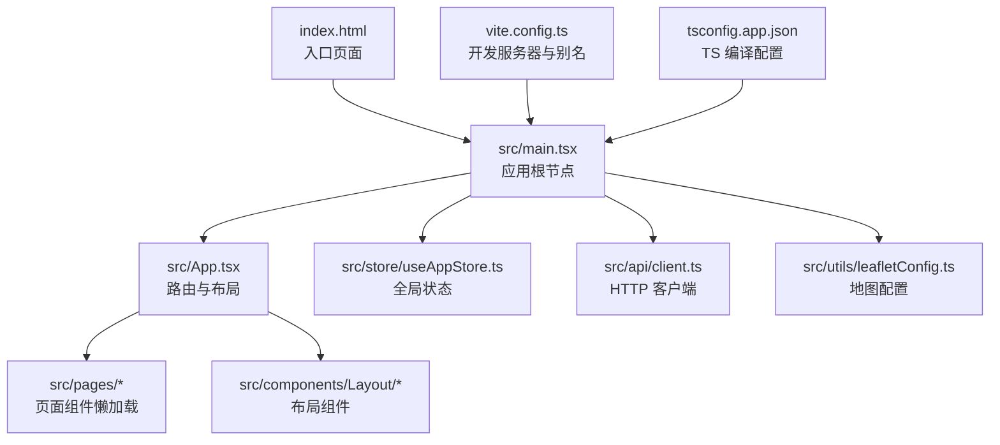
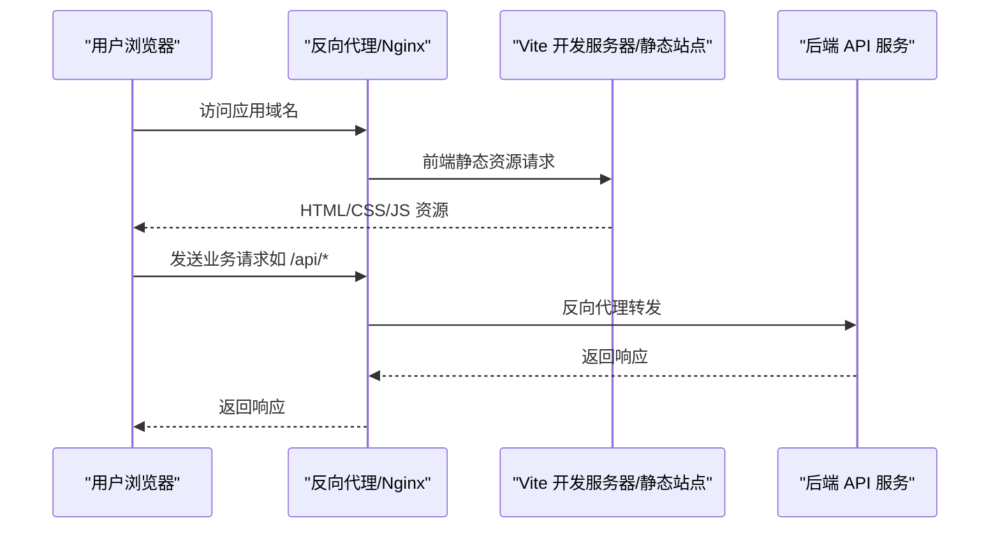

# 部署指南

<cite>
**本文引用的文件**
- [package.json](file://weidu-fleet/package.json)
- [vite.config.ts](file://weidu-fleet/vite.config.ts)
- [index.html](file://weidu-fleet/index.html)
- [main.tsx](file://weidu-fleet/src/main.tsx)
- [App.tsx](file://weidu-fleet/src/App.tsx)
- [client.ts](file://weidu-fleet/src/api/client.ts)
- [leafletConfig.ts](file://weidu-fleet/src/utils/leafletConfig.ts)
- [useAppStore.ts](file://weidu-fleet/src/store/useAppStore.ts)
- [tsconfig.json](file://weidu-fleet/tsconfig.json)
- [tsconfig.app.json](file://weidu-fleet/tsconfig.app.json)
</cite>

## 目录
1. [简介](#简介)
2. [项目结构](#项目结构)
3. [核心组件](#核心组件)
4. [架构总览](#架构总览)
5. [详细组件分析](#详细组件分析)
6. [依赖分析](#依赖分析)
7. [性能考虑](#性能考虑)
8. [故障排除指南](#故障排除指南)
9. [结论](#结论)
10. [附录](#附录)

## 简介
本指南面向苇渡-智利车队管理前端应用的生产部署，覆盖构建流程、环境变量配置、部署准备、多环境部署（Docker/Nginx/CDN）、静态资源优化、域名与 HTTPS 设置、CI/CD 流水线与自动化部署策略、部署后监控与日志管理、故障恢复以及版本发布与回滚策略。由于当前仓库未包含后端服务与部署脚本，本文在“后端接口代理”“静态资源分发”“容器编排”等环节提供通用实践建议，并以现有前端工程配置为依据进行落地。

## 项目结构
前端采用 Vite + React + TypeScript 技术栈，使用 React Router 实现单页路由，Ant Design 提供 UI 组件，Zustand 管理全局状态，Axios 封装请求客户端，Leaflet 地图组件通过 CDN 修复默认图标路径问题。

图表来源
- [index.html:1-13](file://weidu-fleet/index.html#L1-L13)
- [main.tsx:1-49](file://weidu-fleet/src/main.tsx#L1-L49)
- [App.tsx:1-88](file://weidu-fleet/src/App.tsx#L1-L88)
- [vite.config.ts:1-16](file://weidu-fleet/vite.config.ts#L1-L16)
- [tsconfig.app.json:1-27](file://weidu-fleet/tsconfig.app.json#L1-L27)

章节来源
- [package.json:1-41](file://weidu-fleet/package.json#L1-L41)
- [vite.config.ts:1-16](file://weidu-fleet/vite.config.ts#L1-L16)
- [index.html:1-13](file://weidu-fleet/index.html#L1-L13)
- [tsconfig.app.json:1-27](file://weidu-fleet/tsconfig.app.json#L1-L27)

## 核心组件
- 应用入口与国际化主题：应用在根节点初始化语言、时区、地图与国际化主题，确保运行期本地化体验一致。
- 路由与权限：登录路由无需鉴权，其余路由受保护；未登录自动跳转登录页。
- 全局状态：使用 Zustand 管理用户、语言、租户、查询参数等，持久化部分关键字段。
- 请求客户端：Axios 实例统一设置基础路径与超时，拦截器处理鉴权头与 401 无感登出。
- 地图组件：通过 CDN 固定 Leaflet 默认图标路径，避免打包工具导致的资源解析问题。

章节来源
- [main.tsx:19-42](file://weidu-fleet/src/main.tsx#L19-L42)
- [App.tsx:36-84](file://weidu-fleet/src/App.tsx#L36-L84)
- [useAppStore.ts:40-86](file://weidu-fleet/src/store/useAppStore.ts#L40-L86)
- [client.ts:4-29](file://weidu-fleet/src/api/client.ts#L4-L29)
- [leafletConfig.ts:1-14](file://weidu-fleet/src/utils/leafletConfig.ts#L1-L14)

## 架构总览
前端构建产物为静态资源，需配合后端接口代理或反向代理实现完整功能。下图展示从浏览器到后端 API 的典型交互链路。

图表来源
- [client.ts:4-7](file://weidu-fleet/src/api/client.ts#L4-L7)
- [vite.config.ts:12-14](file://weidu-fleet/vite.config.ts#L12-L14)

## 详细组件分析

### 构建与预览
- 构建命令：先执行类型检查与增量编译，再进行 Vite 打包。
- 预览命令：本地预览生产构建产物。
- 开发服务器：默认端口 3000，支持路径别名 @ 指向 src。

章节来源
- [package.json:6-10](file://weidu-fleet/package.json#L6-L10)
- [vite.config.ts:12-14](file://weidu-fleet/vite.config.ts#L12-L14)

### 路由与权限控制
- 登录路由开放访问，其他路由受保护。
- 未登录状态下访问受保护路由将重定向至登录页。
- 页面级懒加载提升首屏性能。

章节来源
- [App.tsx:44-50](file://weidu-fleet/src/App.tsx#L44-L50)
- [App.tsx:52-81](file://weidu-fleet/src/App.tsx#L52-L81)

### 全局状态与本地存储
- 使用 Zustand 管理应用状态，持久化用户、令牌、语言与租户等关键字段。
- 部分查询参数与视图状态不持久化，减少本地存储压力。

章节来源
- [useAppStore.ts:40-86](file://weidu-fleet/src/store/useAppStore.ts#L40-L86)

### HTTP 客户端与鉴权
- 基础路径固定为 /api，便于反向代理统一转发。
- 自动注入 Bearer Token 头部。
- 401 响应触发登出与页面切换，保证会话一致性。

章节来源
- [client.ts:4-29](file://weidu-fleet/src/api/client.ts#L4-L29)

### 地图组件配置
- 通过 CDN 固定 Leaflet 默认图标路径，避免打包工具的资源解析问题。
- 适用于生产环境直接引入 CDN 资源，减少本地体积。

章节来源
- [leafletConfig.ts:1-14](file://weidu-fleet/src/utils/leafletConfig.ts#L1-L14)

### TypeScript 与路径别名
- TS 引用关系拆分为 app 与 node 两套配置，便于区分编译目标。
- 路径别名 @ 指向 src，提升导入可读性。

章节来源
- [tsconfig.json:1-8](file://weidu-fleet/tsconfig.json#L1-L8)
- [tsconfig.app.json:20-22](file://weidu-fleet/tsconfig.app.json#L20-L22)
- [vite.config.ts:7-11](file://weidu-fleet/vite.config.ts#L7-L11)

## 依赖分析
- 运行时依赖：React 生态、Ant Design、Chart.js、Leaflet、i18n、Axios、xlsx、Zustand。
- 开发依赖：Vite、TypeScript、React 插件、测试工具等。
- 依赖关系耦合度低，主要通过应用层组合使用，利于按需裁剪与升级。

章节来源
- [package.json:11-39](file://weidu-fleet/package.json#L11-L39)

## 性能考虑
- 代码分割与懒加载：页面组件按需加载，降低首屏 JS 体积。
- 图标与地图资源：通过 CDN 加速，减少本地打包体积。
- 构建产物缓存：利用浏览器缓存与 CDN 缓存策略，结合文件指纹命名提升缓存命中率。
- 资源压缩：生产构建默认启用压缩与 Tree-shaking。
- 静态资源优化建议：开启 Gzip/Brotli 压缩、合理设置缓存头、使用 CDN 边缘节点就近分发。

## 故障排除指南
- 登录后仍提示未登录
  - 检查鉴权拦截器是否正确注入 Token。
  - 确认后端返回的 401 是否触发登出逻辑。
- 地图图标缺失或显示异常
  - 确认已加载地图配置脚本，且网络可达 CDN。
- 路由跳转异常
  - 检查路由守卫与懒加载组件是否正确渲染。
- 构建失败或预览异常
  - 确认 Node 版本与依赖安装完整，清理缓存后重试。

章节来源
- [client.ts:17-29](file://weidu-fleet/src/api/client.ts#L17-L29)
- [leafletConfig.ts:1-14](file://weidu-fleet/src/utils/leafletConfig.ts#L1-L14)
- [App.tsx:36-84](file://weidu-fleet/src/App.tsx#L36-L84)
- [package.json:6-10](file://weidu-fleet/package.json#L6-L10)

## 结论
本指南基于现有前端工程配置，提供了生产环境构建、部署准备、多环境部署实践、静态资源优化、域名与 HTTPS 设置、CI/CD 自动化策略、监控与日志管理、故障恢复与版本回滚的系统性建议。由于仓库未包含后端与容器编排文件，建议在实际落地时补充相应配置并与前端基础路径、鉴权与静态资源策略协同。

## 附录

### 生产环境构建流程
- 安装依赖并执行构建命令，生成 dist 目录下的静态资源。
- 在反向代理中指向 dist 目录，配置 /api 前缀转发至后端服务。
- 配置缓存头与安全响应头，启用 HTTPS。

章节来源
- [package.json:6-10](file://weidu-fleet/package.json#L6-L10)
- [client.ts:4-7](file://weidu-fleet/src/api/client.ts#L4-L7)

### 环境变量与配置
- 基础路径与代理：前端基础路径固定为 /api，建议通过反向代理统一转发。
- 本地开发：Vite 默认端口 3000，可通过环境变量调整。
- 生产环境：通过反向代理或 CDN 设置缓存与安全头。

章节来源
- [vite.config.ts:12-14](file://weidu-fleet/vite.config.ts#L12-L14)
- [client.ts:4-7](file://weidu-fleet/src/api/client.ts#L4-L7)

### Docker 部署（通用实践）
- 使用 Nginx 镜像作为静态资源服务器，挂载 dist 目录。
- 配置 Nginx 将 /api 前缀转发至后端服务。
- 启用 HTTPS 与缓存头，结合健康检查与日志输出。

[本节为通用实践说明，不直接对应具体源码文件]

### Nginx 部署（通用实践）
- 静态资源：指向构建产物目录，设置强缓存与压缩。
- 接口代理：将 /api 前缀转发至后端服务，保持跨域与鉴权头透传。
- 安全头：添加 CSP、HSTS、X-Frame-Options 等。

[本节为通用实践说明，不直接对应具体源码文件]

### CDN 部署（通用实践）
- 将静态资源上传至 CDN，配置边缘缓存与回源策略。
- 对 /api 前缀保留直连后端，避免被 CDN 缓存。
- 结合 HTTPS 证书与全球加速节点提升访问速度。

[本节为通用实践说明，不直接对应具体源码文件]

### CI/CD 流水线与自动化部署（通用实践）
- 触发条件：主分支推送或打标签。
- 步骤：安装依赖 → 类型检查 → 单元测试 → 构建 → 产物上传 → 部署到目标环境。
- 环境：为不同环境（测试/预发/生产）设置独立的部署目标与变量。
- 回滚：支持一键回滚至上一版本，记录部署日志与产物指纹。

[本节为通用实践说明，不直接对应具体源码文件]

### 部署后监控、日志与故障恢复
- 监控：前端错误上报（如 Sentry）、资源加载监控、接口成功率与延迟。
- 日志：浏览器控制台与网络面板排查、Nginx 访问日志、后端服务日志聚合。
- 故障恢复：蓝绿/金丝雀发布，快速回滚；健康检查失败自动摘除实例。

[本节为通用实践说明，不直接对应具体源码文件]

### 版本发布与回滚策略
- 版本号：语义化版本管理，打标签发布。
- 回滚：保留最近 N 个版本镜像/产物，支持一键回滚。
- 发布窗口：避开业务高峰期，灰度发布验证后再全量上线。

[本节为通用实践说明，不直接对应具体源码文件]