# 技术栈

<cite>
**本文引用的文件**
- [package.json](file://weidu-fleet/package.json)
- [vite.config.ts](file://weidu-fleet/vite.config.ts)
- [tsconfig.json](file://weidu-fleet/tsconfig.json)
- [tsconfig.app.json](file://weidu-fleet/tsconfig.app.json)
- [src/main.tsx](file://weidu-fleet/src/main.tsx)
- [src/App.tsx](file://weidu-fleet/src/App.tsx)
- [src/store/useAppStore.ts](file://weidu-fleet/src/store/useAppStore.ts)
- [src/utils/leafletConfig.ts](file://weidu-fleet/src/utils/leafletConfig.ts)
- [src/i18n/index.ts](file://weidu-fleet/src/i18n/index.ts)
- [src/components/Layout/AppLayout.tsx](file://weidu-fleet/src/components/Layout/AppLayout.tsx)
- [src/api/client.ts](file://weidu-fleet/src/api/client.ts)
- [src/pages/Vehicles.tsx](file://weidu-fleet/src/pages/Vehicles.tsx)
- [src/types/index.ts](file://weidu-fleet/src/types/index.ts)
- [src/utils/format.ts](file://weidu-fleet/src/utils/format.ts)
</cite>

## 目录
1. [引言](#引言)
2. [项目结构](#项目结构)
3. [核心组件](#核心组件)
4. [架构总览](#架构总览)
5. [详细组件分析](#详细组件分析)
6. [依赖分析](#依赖分析)
7. [性能考虑](#性能考虑)
8. [故障排查指南](#故障排查指南)
9. [结论](#结论)
10. [附录](#附录)

## 引言
本文件系统性梳理苇渡-智利车队管理项目的前端技术栈，重点覆盖以下方面：
- 核心技术组合：React 18、TypeScript、Vite 及其生态（Ant Design、Zustand、Axios、React Router、i18next、Leaflet 等）
- 技术选型动机与优势：并发渲染、类型安全、快速开发与热更新、状态管理、国际化与地图能力
- 版本信息与兼容性：基于当前仓库配置的版本范围与编译目标
- 架构与数据流：从入口到页面、路由、状态、API 的整体链路

## 项目结构
该工程采用“按功能域分层”的组织方式，核心目录与职责如下：
- src/main.tsx：应用入口，挂载根组件、配置国际化、主题与路由
- src/App.tsx：应用路由与懒加载页面
- src/components/Layout：布局组件（侧边栏、顶部栏、主框架）
- src/store：全局状态（Zustand）
- src/api：HTTP 客户端与拦截器
- src/i18n：多语言初始化
- src/utils：通用工具（地图默认图标修复、时区与格式化）
- src/pages：业务页面（车辆、监控、风险、驾驶、电池、行程、围栏、维修、租户、运营、系统）
- src/types：共享类型定义
- 配置：vite.config.ts（插件、别名、开发服务器）、tsconfig.*（编译选项）

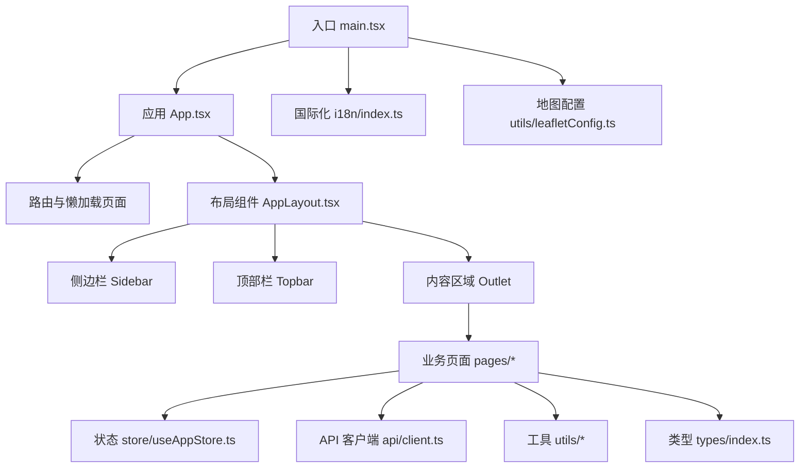

图表来源
- [src/main.tsx:1-49](file://weidu-fleet/src/main.tsx#L1-L49)
- [src/App.tsx:1-88](file://weidu-fleet/src/App.tsx#L1-L88)
- [src/components/Layout/AppLayout.tsx:1-85](file://weidu-fleet/src/components/Layout/AppLayout.tsx#L1-L85)
- [src/store/useAppStore.ts:1-87](file://weidu-fleet/src/store/useAppStore.ts#L1-L87)
- [src/api/client.ts:1-32](file://weidu-fleet/src/api/client.ts#L1-L32)
- [src/utils/leafletConfig.ts:1-14](file://weidu-fleet/src/utils/leafletConfig.ts#L1-L14)
- [src/i18n/index.ts:1-30](file://weidu-fleet/src/i18n/index.ts#L1-L30)

章节来源
- [src/main.tsx:1-49](file://weidu-fleet/src/main.tsx#L1-L49)
- [src/App.tsx:1-88](file://weidu-fleet/src/App.tsx#L1-L88)
- [vite.config.ts:1-16](file://weidu-fleet/vite.config.ts#L1-L16)
- [tsconfig.json:1-8](file://weidu-fleet/tsconfig.json#L1-L8)
- [tsconfig.app.json:1-27](file://weidu-fleet/tsconfig.app.json#L1-L27)

## 核心组件
- React 18：并发特性（Suspense、并发模式）用于页面懒加载与渐进式渲染；StrictMode 提升开发期质量
- TypeScript：严格类型检查、路径别名、模块解析策略，保障大型项目可维护性
- Vite：快速冷启动与热更新、原生 ES 模块支持、零配置 React 插件
- Ant Design + @ant-design/icons：企业级 UI 组件库与图标体系
- Zustand：轻量状态管理，支持持久化中间件
- Axios：HTTP 客户端，统一请求/响应拦截器
- React Router：单页路由与懒加载
- i18next + react-i18next：多语言方案，支持本地存储初始语言
- Leaflet + react-leaflet：地图可视化与轨迹展示
- Chart.js + react-chartjs-2：图表绘制
- xlsx：Excel 导入导出

章节来源
- [package.json:11-26](file://weidu-fleet/package.json#L11-L26)
- [package.json:27-39](file://weidu-fleet/package.json#L27-L39)
- [src/main.tsx:1-49](file://weidu-fleet/src/main.tsx#L1-L49)
- [src/App.tsx:1-88](file://weidu-fleet/src/App.tsx#L1-L88)
- [src/store/useAppStore.ts:1-87](file://weidu-fleet/src/store/useAppStore.ts#L1-L87)
- [src/api/client.ts:1-32](file://weidu-fleet/src/api/client.ts#L1-L32)
- [src/i18n/index.ts:1-30](file://weidu-fleet/src/i18n/index.ts#L1-L30)
- [src/utils/leafletConfig.ts:1-14](file://weidu-fleet/src/utils/leafletConfig.ts#L1-L14)

## 架构总览
下图展示了从浏览器到后端 API 的典型交互流程，以及状态与国际化在应用中的位置。

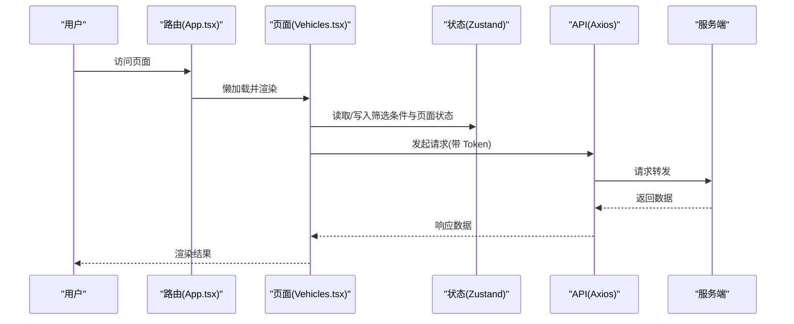

图表来源
- [src/App.tsx:1-88](file://weidu-fleet/src/App.tsx#L1-L88)
- [src/pages/Vehicles.tsx:1-440](file://weidu-fleet/src/pages/Vehicles.tsx#L1-L440)
- [src/store/useAppStore.ts:1-87](file://weidu-fleet/src/store/useAppStore.ts#L1-L87)
- [src/api/client.ts:1-32](file://weidu-fleet/src/api/client.ts#L1-L32)

## 详细组件分析

### React 18 与并发渲染
- 入口使用 StrictMode 包裹，启用并发渲染与开发期副作用检测
- 页面通过 React.lazy + Suspense 实现懒加载与骨架占位
- 路由守卫结合全局状态判断登录态，避免非预期跳转

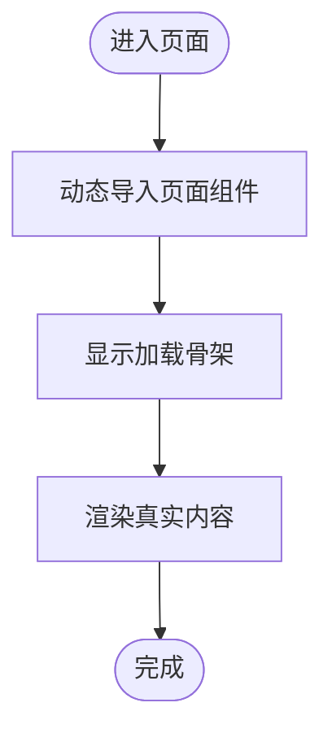

图表来源
- [src/App.tsx:1-88](file://weidu-fleet/src/App.tsx#L1-L88)
- [src/main.tsx:21-42](file://weidu-fleet/src/main.tsx#L21-L42)

章节来源
- [src/main.tsx:1-49](file://weidu-fleet/src/main.tsx#L1-L49)
- [src/App.tsx:1-88](file://weidu-fleet/src/App.tsx#L1-L88)

### TypeScript 类型系统与编译配置
- 编译目标：ES2020，模块解析：bundler，JSX：react-jsx
- 路径别名：@/* 对应 src/*
- 严格模式：noUnusedLocals/Parameters、noUncheckedIndexedAccess 等
- 多 tsconfig 文件组织：根 tsconfig.json 引用 app 与 node 两套配置

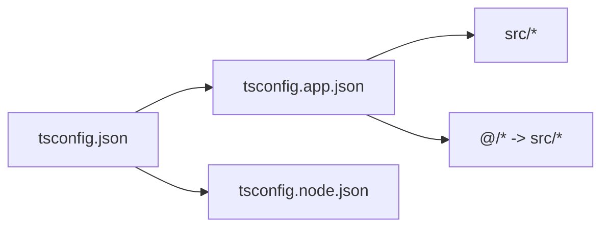

图表来源
- [tsconfig.json:1-8](file://weidu-fleet/tsconfig.json#L1-L8)
- [tsconfig.app.json:1-27](file://weidu-fleet/tsconfig.app.json#L1-L27)

章节来源
- [tsconfig.json:1-8](file://weidu-fleet/tsconfig.json#L1-L8)
- [tsconfig.app.json:1-27](file://weidu-fleet/tsconfig.app.json#L1-L27)

### Ant Design 主题与国际化
- ConfigProvider 设置语言与主题参数，按语言切换本地化
- dayjs 国际化与时区初始化，确保日期显示一致
- i18n 初始化从本地存储恢复语言，回退至英文

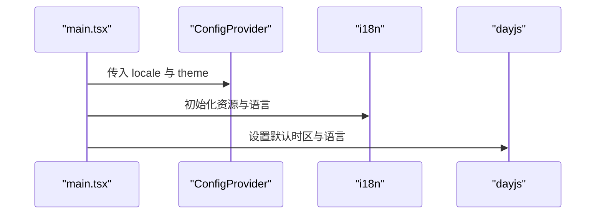

图表来源
- [src/main.tsx:19-31](file://weidu-fleet/src/main.tsx#L19-L31)
- [src/i18n/index.ts:1-30](file://weidu-fleet/src/i18n/index.ts#L1-L30)
- [src/utils/format.ts:1-27](file://weidu-fleet/src/utils/format.ts#L1-L27)

章节来源
- [src/main.tsx:1-49](file://weidu-fleet/src/main.tsx#L1-L49)
- [src/i18n/index.ts:1-30](file://weidu-fleet/src/i18n/index.ts#L1-L30)
- [src/utils/format.ts:1-27](file://weidu-fleet/src/utils/format.ts#L1-L27)

### Zustand 全局状态与持久化
- 状态包含页面、语言、用户、租户、筛选条件等
- 使用 persist 中间件仅持久化必要字段，减少存储开销
- 页面内通过 hooks 读写状态，实现跨组件共享

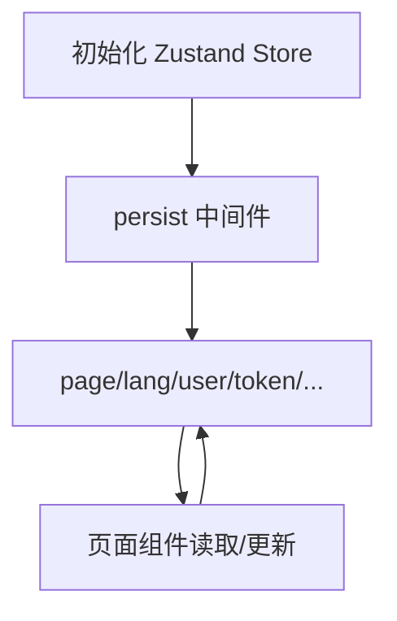

图表来源
- [src/store/useAppStore.ts:1-87](file://weidu-fleet/src/store/useAppStore.ts#L1-L87)

章节来源
- [src/store/useAppStore.ts:1-87](file://weidu-fleet/src/store/useAppStore.ts#L1-L87)

### Axios 客户端与拦截器
- 基础地址指向 /api，统一设置 Authorization
- 401 统一处理：清空 token、用户信息并重定向登录
- 页面通过 store.getState() 获取 token，避免循环依赖

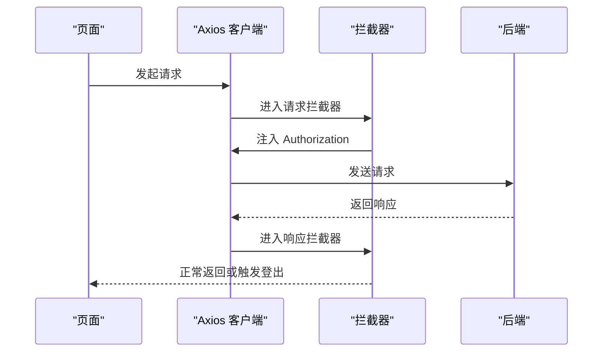

图表来源
- [src/api/client.ts:1-32](file://weidu-fleet/src/api/client.ts#L1-L32)

章节来源
- [src/api/client.ts:1-32](file://weidu-fleet/src/api/client.ts#L1-L32)

### 地图与可视化
- 修复 Leaflet 默认图标在打包环境下的路径问题
- react-leaflet 与 Chart.js 结合用于地图与图表展示

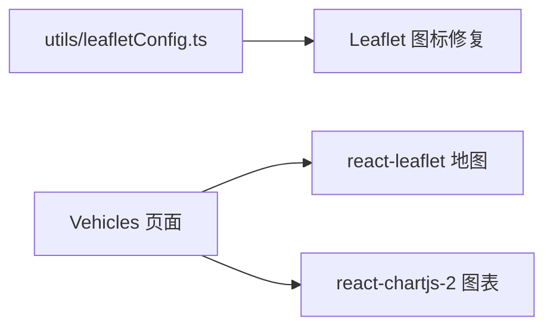

图表来源
- [src/utils/leafletConfig.ts:1-14](file://weidu-fleet/src/utils/leafletConfig.ts#L1-L14)
- [src/pages/Vehicles.tsx:1-440](file://weidu-fleet/src/pages/Vehicles.tsx#L1-L440)

章节来源
- [src/utils/leafletConfig.ts:1-14](file://weidu-fleet/src/utils/leafletConfig.ts#L1-L14)
- [src/pages/Vehicles.tsx:1-440](file://weidu-fleet/src/pages/Vehicles.tsx#L1-L440)

### 布局与导航
- AppLayout 将页面内容包裹在 Ant Design Layout 中，支持侧边栏折叠与头部固定
- 通过 useNavigate/useLocation 控制路由跳转与面包屑

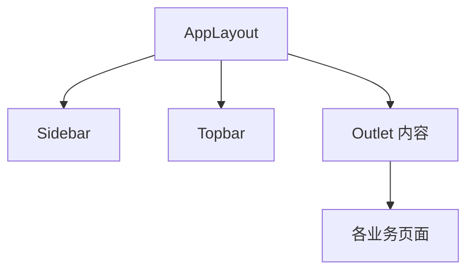

图表来源
- [src/components/Layout/AppLayout.tsx:1-85](file://weidu-fleet/src/components/Layout/AppLayout.tsx#L1-L85)

章节来源
- [src/components/Layout/AppLayout.tsx:1-85](file://weidu-fleet/src/components/Layout/AppLayout.tsx#L1-L85)

### 数据模型与类型约束
- types/index.ts 定义了车辆、告警、围栏、行程、维修、租户、业务用户等核心实体与枚举
- 为页面与 API 层提供强类型支撑，降低运行期错误

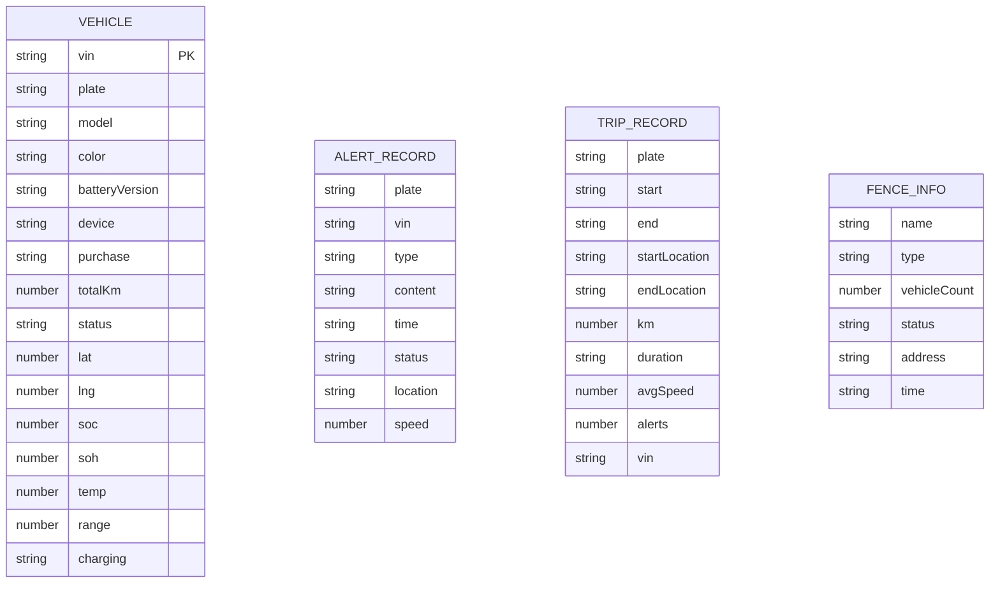

图表来源
- [src/types/index.ts:1-261](file://weidu-fleet/src/types/index.ts#L1-L261)

章节来源
- [src/types/index.ts:1-261](file://weidu-fleet/src/types/index.ts#L1-L261)

## 依赖分析
- 运行时依赖：React 18、Ant Design、Axios、Chart.js、i18next、Leaflet、Zustand、XLSX 等
- 开发依赖：Vite、TypeScript、React 插件、Testing Library、jsdom、Vitest 等
- 构建脚本：dev/build/preview，分别对应开发、构建与预览

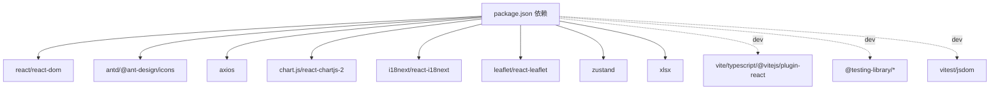

图表来源
- [package.json:11-39](file://weidu-fleet/package.json#L11-L39)

章节来源
- [package.json:11-39](file://weidu-fleet/package.json#L11-L39)

## 性能考虑
- 懒加载与骨架屏：通过 React.lazy 与 Suspense 减少首屏体积与白屏时间
- 并发渲染：利用 React 18 的并发特性，提升复杂页面的交互流畅度
- 状态最小化：Zustand 持久化仅保存必要字段，避免本地存储膨胀
- 构建优化：Vite 原生 ESM 与按需编译，缩短构建时间
- 图表与地图：按需引入与懒加载，避免一次性加载过多资源

## 故障排查指南
- 登录态异常：检查 Axios 拦截器对 401 的处理是否触发，确认 store 中 token 与 user 是否被清空
- 语言不生效：确认 i18n 初始化逻辑与本地存储键值，检查 ConfigProvider locale 传参
- 地图图标缺失：确认 utils/leafletConfig.ts 是否在入口处被引入
- 时区显示异常：确认 dayjs 插件与默认时区设置
- 页面跳转循环：检查 AppLayout 中对 page 状态的判断与 useNavigate 的调用时机

章节来源
- [src/api/client.ts:17-29](file://weidu-fleet/src/api/client.ts#L17-L29)
- [src/i18n/index.ts:7-27](file://weidu-fleet/src/i18n/index.ts#L7-L27)
- [src/utils/leafletConfig.ts:1-14](file://weidu-fleet/src/utils/leafletConfig.ts#L1-L14)
- [src/utils/format.ts:1-27](file://weidu-fleet/src/utils/format.ts#L1-L27)
- [src/components/Layout/AppLayout.tsx:20-26](file://weidu-fleet/src/components/Layout/AppLayout.tsx#L20-L26)

## 结论
本项目以 React 18 为核心，配合 TypeScript 与 Vite，构建了现代化、可扩展且具备良好开发体验的前端架构。通过 Ant Design 提供一致的 UI 体验，Zustand 管理全局状态，Axios 统一网络访问，i18next 支持多语言，Leaflet 与图表库满足可视化需求。整体技术栈在性能、可维护性与团队协作上取得平衡，适合持续迭代与规模化扩展。

## 附录

### 版本与兼容性要点
- React 生态：react ^18.3.1、react-dom ^18.3.1、react-router-dom ^6.28.0
- Ant Design：antd ^5.21.0、@ant-design/icons ^5.5.1
- 状态管理：zustand ^4.5.5（含 persist 中间件）
- HTTP 客户端：axios ^1.7.7
- 国际化：i18next ^23.16.4、react-i18next ^15.1.0
- 地图：leaflet ^1.9.4、react-leaflet ^4.2.1
- 图表：chart.js ^4.4.4、react-chartjs-2 ^5.2.0
- 表格导入：xlsx ^0.18.5
- 构建与类型：vite ^6.0.1、typescript ~5.6.2、@vitejs/plugin-react ^4.3.4
- 测试：@testing-library/react、vitest、jsdom

章节来源
- [package.json:11-39](file://weidu-fleet/package.json#L11-L39)