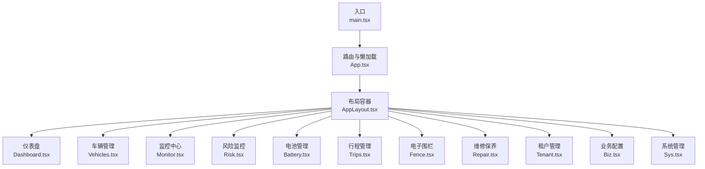
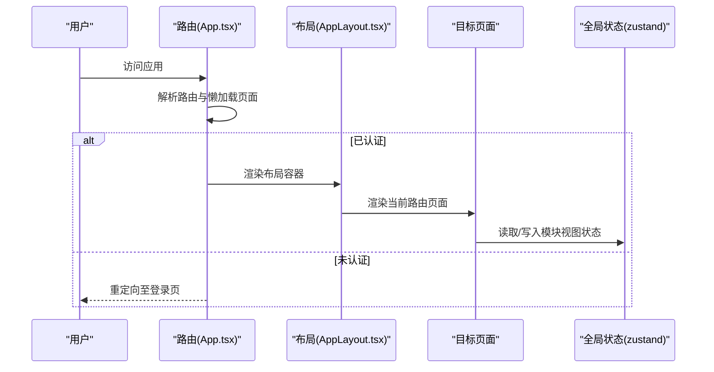
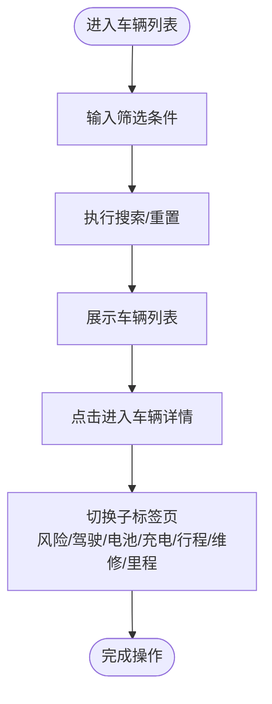
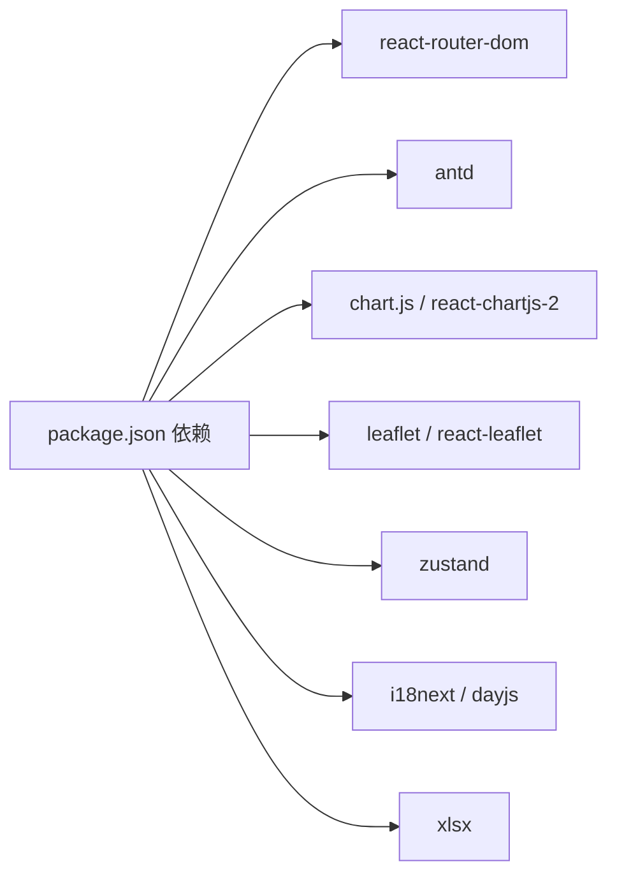

# 核心功能

<cite>
**本文引用的文件**
- [App.tsx](file://weidu-fleet/src/App.tsx)
- [main.tsx](file://weidu-fleet/src/main.tsx)
- [AppLayout.tsx](file://weidu-fleet/src/components/Layout/AppLayout.tsx)
- [Dashboard.tsx](file://weidu-fleet/src/pages/Dashboard.tsx)
- [Vehicles.tsx](file://weidu-fleet/src/pages/Vehicles.tsx)
- [Monitor.tsx](file://weidu-fleet/src/pages/Monitor.tsx)
- [Risk.tsx](file://weidu-fleet/src/pages/Risk.tsx)
- [Battery.tsx](file://weidu-fleet/src/pages/Battery.tsx)
- [Trips.tsx](file://weidu-fleet/src/pages/Trips.tsx)
- [Fence.tsx](file://weidu-fleet/src/pages/Fence.tsx)
- [Repair.tsx](file://weidu-fleet/src/pages/Repair.tsx)
- [Tenant.tsx](file://weidu-fleet/src/pages/Tenant.tsx)
- [Biz.tsx](file://weidu-fleet/src/pages/Biz.tsx)
- [Sys.tsx](file://weidu-fleet/src/pages/Sys.tsx)
- [package.json](file://weidu-fleet/package.json)
</cite>

## 目录
1. [引言](#引言)
2. [项目结构](#项目结构)
3. [核心组件](#核心组件)
4. [架构总览](#架构总览)
5. [详细组件分析](#详细组件分析)
6. [依赖分析](#依赖分析)
7. [性能考虑](#性能考虑)
8. [故障排查指南](#故障排查指南)
9. [结论](#结论)
10. [附录](#附录)

## 引言
本文件面向“苇渡-智利车队管理”项目的使用者与维护者，系统性梳理并解读项目的核心功能模块。项目以 React + Ant Design + TypeScript 构建，采用路由驱动的页面组织方式，并通过全局状态管理实现模块间的状态协同。本文围绕以下十大功能模块展开：车辆管理、风险监控、电池管理、维修保养、驾驶行为分析、行程管理、电子围栏、租户管理、业务配置、系统管理。每个模块均包含核心能力、典型应用场景、业务价值以及与其他模块的协作关系说明，并提供导航结构图与使用流程示意，帮助快速掌握系统功能布局与操作路径。

## 项目结构
项目前端采用单页应用（SPA）架构，路由在入口处集中声明，页面按功能域划分至 pages 目录；布局由 AppLayout 统一承载，侧边栏与顶部工具条在布局组件内完成；全局样式与国际化在入口文件初始化；状态管理采用轻量的 zustand store，用于存储语言、页面状态与各模块的视图状态。

图表来源
- [App.tsx:36-85](file://weidu-fleet/src/App.tsx#L36-L85)
- [AppLayout.tsx:10-82](file://weidu-fleet/src/components/Layout/AppLayout.tsx#L10-L82)
- [main.tsx:21-42](file://weidu-fleet/src/main.tsx#L21-L42)

章节来源
- [App.tsx:36-85](file://weidu-fleet/src/App.tsx#L36-L85)
- [main.tsx:21-42](file://weidu-fleet/src/main.tsx#L21-L42)
- [package.json:1-41](file://weidu-fleet/package.json#L1-L41)

## 核心组件
- 路由与页面装载
  - 应用通过 React Router 配置路由表，支持登录页与受保护页面的区分；所有页面采用动态导入实现懒加载，提升首屏性能。
  - 登录页路由独立，未认证状态下可访问；认证后重定向到仪表盘。
- 布局与导航
  - AppLayout 提供统一侧边栏与顶部工具条，支持折叠与响应式布局；内容区域通过 Outlet 渲染当前路由页面。
- 全局状态
  - 使用 zustand store 管理语言、页面状态与各模块视图状态（如车辆详情页标签、监控页子标签等），避免跨层级传递。
- 国际化与主题
  - 支持多语言切换，Ant Design 主题可配置，dayjs 本地化随语言切换更新。

章节来源
- [App.tsx:36-85](file://weidu-fleet/src/App.tsx#L36-L85)
- [AppLayout.tsx:10-82](file://weidu-fleet/src/components/Layout/AppLayout.tsx#L10-L82)
- [main.tsx:19-42](file://weidu-fleet/src/main.tsx#L19-L42)

## 架构总览
下图展示从入口到页面渲染、布局承载与模块交互的整体流程：

图表来源
- [App.tsx:36-85](file://weidu-fleet/src/App.tsx#L36-L85)
- [AppLayout.tsx:10-82](file://weidu-fleet/src/components/Layout/AppLayout.tsx#L10-L82)

## 详细组件分析

### 车辆管理（Vehicles）
- 核心能力
  - 列表筛选：支持 VIN、车牌、设备 ID、电池版本、车龄范围等条件过滤；提供批量导入模板下载与导入结果反馈。
  - 详情页：聚合风险、驾驶、电池、充电、行程、维修、里程趋势等子表格与图表。
  - 可视化：地图标记在线车辆、基础统计卡片与柱状图。
- 典型场景
  - 快速定位异常车辆、查看某辆车的全生命周期数据、批量导入/更新车辆档案。
- 业务价值
  - 提升资产管理透明度与运营效率，支撑后续维修保养与风险监控联动。
- 与其他模块关系
  - 与监控中心联动显示实时位置；与风险监控共享告警数据；与电池管理共享电量与健康度指标；与行程管理共享轨迹与行程统计。

图表来源
- [Vehicles.tsx:47-337](file://weidu-fleet/src/pages/Vehicles.tsx#L47-L337)

章节来源
- [Vehicles.tsx:47-440](file://weidu-fleet/src/pages/Vehicles.tsx#L47-L440)

### 风险监控（Risk）
- 核心能力
  - 多维度告警：电子围栏出入栏、系统故障、电池异常三类告警，支持按类型、状态、平台等筛选。
  - 工单联动：对故障与电池异常告警可一键生成维修工单，状态流转为“已生成工单”。
  - 详情查看：弹窗展示告警详情，便于快速处置。
- 典型场景
  - 实时监控围栏越界、设备故障与电池异常，触发维修与调度响应。
- 业务价值
  - 降低运营风险，减少事故与停运损失，提高安全与合规水平。
- 与其他模块关系
  - 与电子围栏联动产生出入栏告警；与维修保养模块对接生成工单；与监控中心联动展示告警位置。

章节来源
- [Risk.tsx:52-435](file://weidu-fleet/src/pages/Risk.tsx#L52-L435)

### 电池管理（Battery）
- 核心能力
  - 实时监控：SOC、SOH、温度、续航、充电次数、状态等指标展示与筛选。
  - 充放电记录：充电/放电明细查询与筛选。
  - 日常消耗：30天日耗电量折线图可视化。
  - 详情面板：弹窗展示每日消耗曲线与关键指标摘要。
- 典型场景
  - 远程监控电池健康，预测维护窗口，优化充电策略。
- 业务价值
  - 延长电池寿命，降低更换成本，保障运营连续性。
- 与其他模块关系
  - 与车辆管理共享车辆维度数据；与维修保养联动异常处理。

章节来源
- [Battery.tsx:33-343](file://weidu-fleet/src/pages/Battery.tsx#L33-L343)

### 维修保养（Repair）
- 核心能力
  - 报修工单：按车辆 VIN 选择、类型（故障/电池）、描述、起止时间等创建工单。
  - 状态管理：进行中/已完成两种状态，支持完成操作。
  - 查询筛选：按车牌、类型、状态、时间范围筛选。
- 典型场景
  - 对风险监控产生的告警进行闭环处理，形成维修工单并跟踪进度。
- 业务价值
  - 规范维修流程，提升响应效率与质量。
- 与其他模块关系
  - 与风险监控联动生成工单；与车辆管理关联具体资产。

章节来源
- [Repair.tsx:33-263](file://weidu-fleet/src/pages/Repair.tsx#L33-L263)

### 驾驶行为分析（Driving）
- 当前状态
  - 页面存在但未在路由中注册，属于预留模块。
- 业务价值
  - 通过对急加速、急刹车、急转弯、疲劳驾驶、AEB触发等行为的统计与可视化，辅助驾驶员行为改善与安全培训。
- 与其他模块关系
  - 与仪表盘联动展示风险指标；与车辆管理共享车辆维度数据。

章节来源
- [App.tsx:13-20](file://weidu-fleet/src/App.tsx#L13-L20)

### 行程管理（Trips）
- 核心能力
  - 行程列表：按车牌、时间范围筛选，展示起止地点、距离、时长、平均/最高/最低速度、预警次数。
  - 行程详情：展示行程信息与途经预警，结合地图轨迹回放。
- 典型场景
  - 分析运营效率、识别异常路线、评估驾驶行为与能耗表现。
- 业务价值
  - 优化调度与路线规划，降低油耗与磨损。
- 与其他模块关系
  - 与监控中心联动展示轨迹；与车辆管理共享车辆维度数据。

章节来源
- [Trips.tsx:29-231](file://weidu-fleet/src/pages/Trips.tsx#L29-L231)

### 电子围栏（Fence）
- 核心能力
  - 围栏管理：支持中心点围栏与自定义多边形围栏，设置预警类型（入栏/出栏），启用/禁用状态。
  - 车辆绑定：为围栏绑定使用车辆，支持增删改查。
  - 地图绘制：支持点击地图生成中心点围栏或绘制多边形围栏。
- 典型场景
  - 设定作业区域、禁行区、停车场边界，实现越界报警与可视化管理。
- 业务价值
  - 强化资产安全与作业合规，降低失窃与违规风险。
- 与其他模块关系
  - 与风险监控联动产生出入栏告警；与监控中心联动展示围栏与车辆位置。

章节来源
- [Fence.tsx:46-353](file://weidu-fleet/src/pages/Fence.tsx#L46-L353)

### 租户管理（Tenant）
- 核心能力
  - 租户列表：按名称、编码、管理员账号筛选，支持新建租户与删除。
  - 管理员配置：为租户设置管理员账号与密码，支持随机生成并弹窗提示。
- 典型场景
  - 在多租户体系下为不同客户分配独立账户与权限。
- 业务价值
  - 实现多客户隔离与独立运营，满足 SaaS 化部署需求。
- 与其他模块关系
  - 与业务配置联动进行资产与用户分配；与系统管理联动进行全局用户与角色管理。

章节来源
- [Tenant.tsx:28-288](file://weidu-fleet/src/pages/Tenant.tsx#L28-L288)

### 业务配置（Biz）
- 核心能力
  - 权限配置：基于功能模块勾选权限，支持按租户树选择。
  - 资产管理：VIN 查询、租户筛选、资产同步、批量划拨与历史记录查看。
  - 用户与角色：用户增删改查、角色管理与权限分配。
  - 企业信息：展示租户基本信息。
- 典型场景
  - 为不同租户配置功能权限、分配资产与人员角色。
- 业务价值
  - 实现精细化权限治理与资产运营。
- 与其他模块关系
  - 与租户管理联动；与系统管理联动进行全局角色与用户管理。

章节来源
- [Biz.tsx:117-609](file://weidu-fleet/src/pages/Biz.tsx#L117-L609)

### 系统管理（Sys）
- 核心能力
  - 系统用户：用户增删改查、角色分配、重置密码等。
  - 系统角色：角色创建与权限配置，覆盖系统级功能。
- 典型场景
  - 平台级用户与角色维护，保障系统安全与合规。
- 业务价值
  - 提供平台运维与审计能力。
- 与其他模块关系
  - 与业务配置、租户管理共同构成完整的权限体系。

章节来源
- [Sys.tsx:50-349](file://weidu-fleet/src/pages/Sys.tsx#L50-L349)

### 监控中心（Monitor）
- 核心能力
  - 实时定位：按企业树选择车辆，展示在线车辆位置与设备状态。
  - 轨迹回放：选择车辆与日期，播放轨迹动画，支持倍速控制与里程计算。
  - 行程列表：展示行程起止、时长与里程等信息。
- 典型场景
  - 实时掌握车队分布，回放历史轨迹，辅助调度与应急响应。
- 业务价值
  - 提升可视化与响应效率。
- 与其他模块关系
  - 与车辆管理共享位置与状态；与行程管理共享轨迹数据。

章节来源
- [Monitor.tsx:13-268](file://weidu-fleet/src/pages/Monitor.tsx#L13-L268)

### 仪表盘（Dashboard）
- 核心能力
  - 总览卡片：在线/离线、今日里程、总里程、今日告警数、围栏告警数。
  - 风险统计：按今日/7日/30日维度展示各类驾驶风险指标。
  - 实时地图：展示在线车辆位置与状态。
  - 排行榜：按告警总数排序展示车辆风险排行。
- 典型场景
  - 作为运营中枢，快速掌握整体态势。
- 业务价值
  - 提供全局视角与决策依据。
- 与其他模块关系
  - 汇总车辆、风险、行程、围栏等模块关键指标。

章节来源
- [Dashboard.tsx:34-257](file://weidu-fleet/src/pages/Dashboard.tsx#L34-L257)

## 依赖分析
- 前端技术栈
  - React 18、React Router、Ant Design、Chart.js、React Chart.js 2、React Leaflet、Axios、Zustand、i18next、dayjs、xlsx 等。
- 关键依赖作用
  - 路由与懒加载：react-router-dom
  - UI 组件库：antd
  - 图表：chart.js、react-chartjs-2
  - 地图：leaflet、react-leaflet
  - 状态管理：zustand
  - 国际化与本地化：i18next、dayjs
  - 数据处理：xlsx
- 模块耦合
  - 页面间通过路由解耦；布局统一承载；全局状态在模块内部自治，避免跨模块强耦合。

图表来源
- [package.json:11-26](file://weidu-fleet/package.json#L11-L26)

章节来源
- [package.json:11-41](file://weidu-fleet/package.json#L11-L41)

## 性能考虑
- 懒加载与代码分割
  - 页面采用动态导入，减少首屏体积，提升加载速度。
- 图表与地图
  - 图表与地图组件按需渲染，避免不必要的重绘；地图缩放与轨迹播放使用节流/定时器控制。
- 状态管理
  - 使用 zustand 简化状态逻辑，避免深层 props 传递导致的重渲染。
- 国际化与主题
  - 语言切换与主题配置在入口层一次性初始化，减少运行时开销。

## 故障排查指南
- 登录态问题
  - 若刷新后被重定向至登录页，请检查全局状态中的页面标识是否正确；确认登录路由未被拦截。
- 路由跳转异常
  - 检查路由表中是否存在对应路径；确认 AppLayout 的 Outlet 是否正确渲染。
- 地图/轨迹不显示
  - 检查地图依赖初始化与网络访问；确认轨迹数据结构与渲染参数正确。
- 导入失败
  - 检查文件格式与大小限制；查看导入结果反馈与失败明细导出。
- 权限与角色
  - 确认业务配置的角色权限勾选与系统管理的角色配置一致；核对租户树选择与资产分配。

章节来源
- [App.tsx:22-34](file://weidu-fleet/src/App.tsx#L22-L34)
- [AppLayout.tsx:20-26](file://weidu-fleet/src/components/Layout/AppLayout.tsx#L20-L26)

## 结论
本项目以清晰的功能域划分与统一的布局架构为基础，结合路由懒加载与全局状态管理，实现了从仪表盘到各功能模块的高效协同。十大功能模块覆盖了智利车队管理的核心业务场景，既可独立使用，又可通过告警、轨迹、资产等数据实现深度联动。建议在后续迭代中完善缺失模块（如驾驶行为分析）并持续优化性能与用户体验。

## 附录
- 功能模块导航结构（文字版）
  - 仪表盘 → 车辆管理 → 风险监控 → 电池管理 → 行程管理 → 电子围栏 → 维修保养 → 监控中心
  - 业务配置 → 租户管理 → 系统管理
- 使用流程示例（以“生成维修工单”为例）
  1) 在风险监控中发现故障/电池异常告警；
  2) 点击“生成工单”，状态变为“已生成工单”；
  3) 在维修保养中查看工单状态，完成后标记为“已完成”。