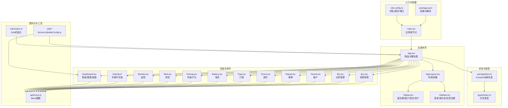
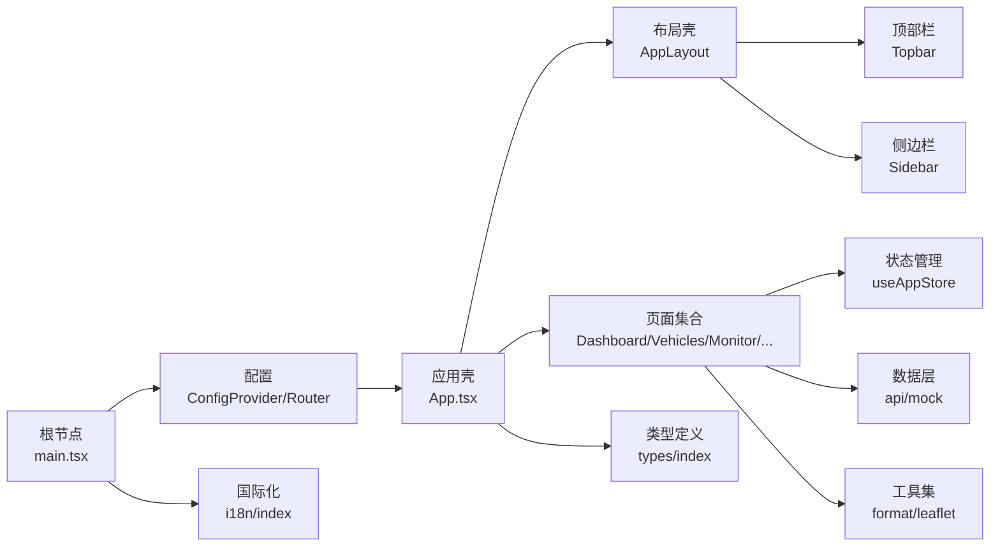
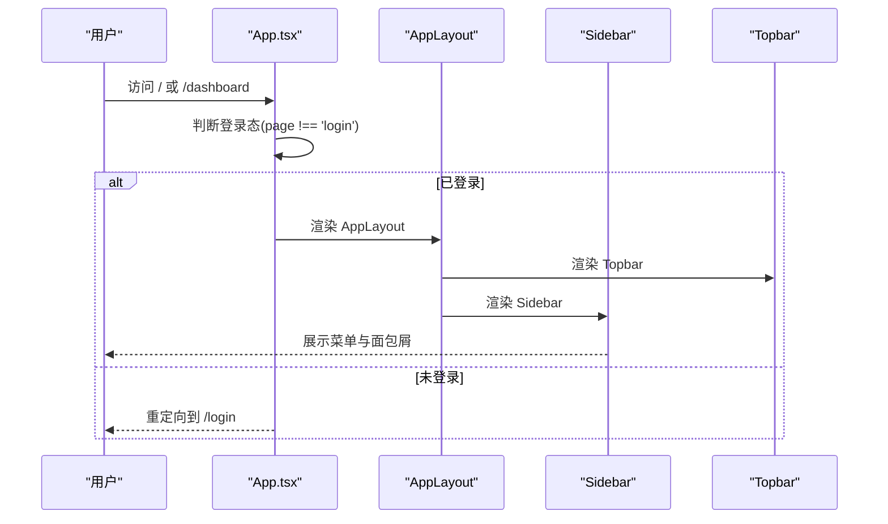
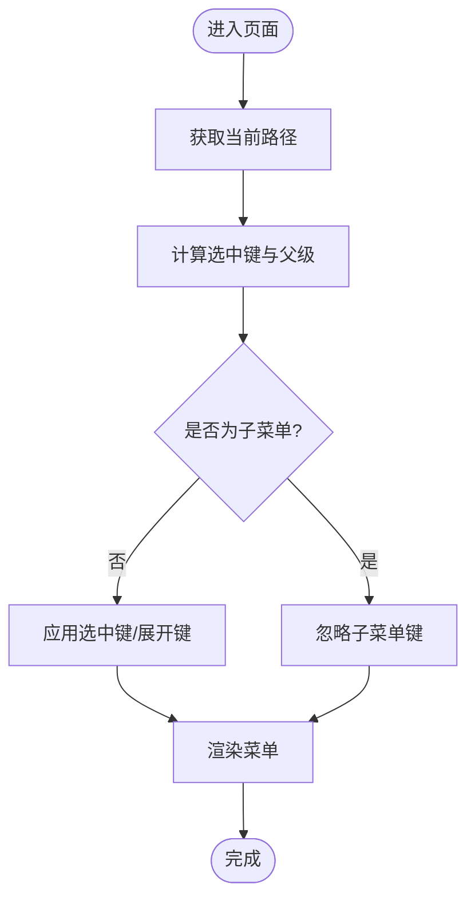
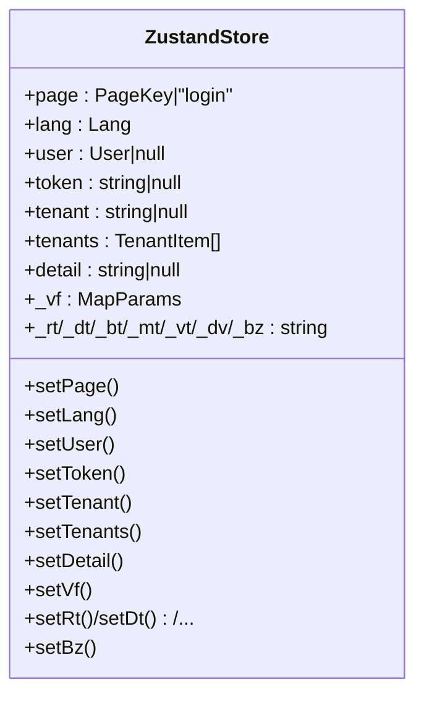
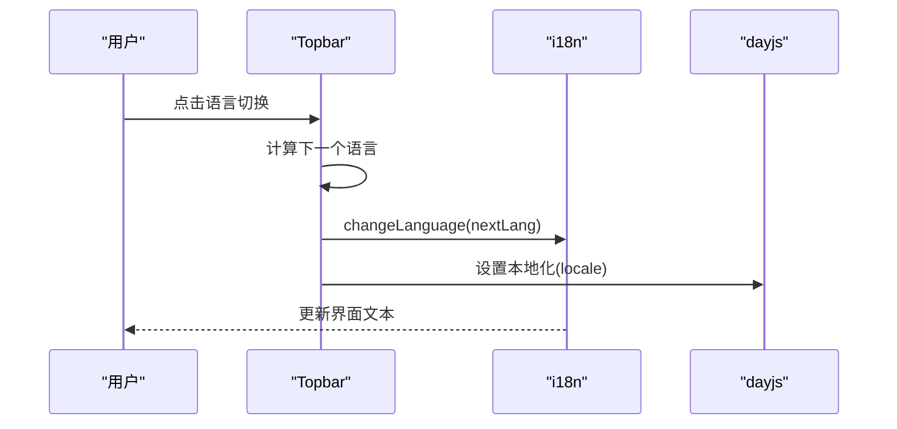
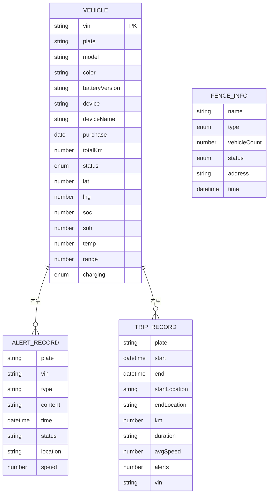
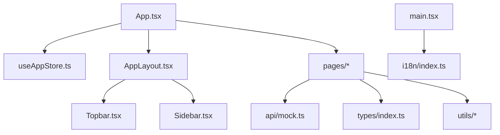

# 系统架构

<cite>
**本文引用的文件**   
- [main.tsx](file://weidu-fleet/src/main.tsx)
- [App.tsx](file://weidu-fleet/src/App.tsx)
- [useAppStore.ts](file://weidu-fleet/src/store/useAppStore.ts)
- [AppLayout.tsx](file://weidu-fleet/src/components/Layout/AppLayout.tsx)
- [Sidebar.tsx](file://weidu-fleet/src/components/Layout/Sidebar.tsx)
- [Topbar.tsx](file://weidu-fleet/src/components/Layout/Topbar.tsx)
- [Dashboard.tsx](file://weidu-fleet/src/pages/Dashboard.tsx)
- [index.ts](file://weidu-fleet/src/types/index.ts)
- [index.ts](file://weidu-fleet/src/i18n/index.ts)
- [mock.ts](file://weidu-fleet/src/api/mock.ts)
- [leafletConfig.ts](file://weidu-fleet/src/utils/leafletConfig.ts)
- [format.ts](file://weidu-fleet/src/utils/format.ts)
- [package.json](file://weidu-fleet/package.json)
- [vite.config.ts](file://weidu-fleet/vite.config.ts)
</cite>

## 目录
1. [引言](#引言)
2. [项目结构](#项目结构)
3. [核心组件](#核心组件)
4. [架构总览](#架构总览)
5. [详细组件分析](#详细组件分析)
6. [依赖分析](#依赖分析)
7. [性能考虑](#性能考虑)
8. [故障排查指南](#故障排查指南)
9. [结论](#结论)
10. [附录](#附录)

## 引言
本文件面向“苇渡-智利车队管理”项目，系统性阐述前端SPA的整体架构设计与实现要点，覆盖组件化设计模式、状态管理模式、路由系统、国际化与本地化、数据流与Mock层、以及工程化配置等方面。文档旨在帮助开发者快速理解系统的分层职责、组件协作关系与数据流向，并提供可操作的优化建议与排障指引。

## 项目结构
项目采用以“功能域+分层”的组织方式，核心目录与职责如下：
- src/api：统一的Mock数据层，提供各页面所需的数据接口
- src/components/Layout：布局与导航组件（侧边栏、顶部栏、主框架）
- src/pages：页面级组件，按业务域划分（Dashboard、Vehicles、Monitor、Risk、Driving、Battery、Trips、Fence、Repair、Tenant、Biz、Sys）
- src/store：全局状态管理（Zustand + persist）
- src/types：共享类型定义
- src/i18n：多语言资源与初始化
- src/utils：通用工具（Leaflet图标修复、时间格式化等）
- public：静态资源
- 根目录：构建与运行配置（Vite、TypeScript、依赖）

**图示来源**
- [main.tsx:1-49](file://weidu-fleet/src/main.tsx#L1-L49)
- [App.tsx:1-88](file://weidu-fleet/src/App.tsx#L1-L88)
- [AppLayout.tsx:1-85](file://weidu-fleet/src/components/Layout/AppLayout.tsx#L1-L85)
- [Topbar.tsx:1-233](file://weidu-fleet/src/components/Layout/Topbar.tsx#L1-L233)
- [Sidebar.tsx:1-272](file://weidu-fleet/src/components/Layout/Sidebar.tsx#L1-L272)
- [Dashboard.tsx:1-257](file://weidu-fleet/src/pages/Dashboard.tsx#L1-L257)
- [useAppStore.ts:1-87](file://weidu-fleet/src/store/useAppStore.ts#L1-L87)
- [types/index.ts:1-261](file://weidu-fleet/src/types/index.ts#L1-L261)
- [i18n/index.ts:1-30](file://weidu-fleet/src/i18n/index.ts#L1-L30)
- [mock.ts:1-634](file://weidu-fleet/src/api/mock.ts#L1-L634)
- [leafletConfig.ts:1-14](file://weidu-fleet/src/utils/leafletConfig.ts#L1-L14)
- [format.ts:1-27](file://weidu-fleet/src/utils/format.ts#L1-L27)
- [vite.config.ts:1-16](file://weidu-fleet/vite.config.ts#L1-L16)
- [package.json:1-41](file://weidu-fleet/package.json#L1-L41)

**章节来源**
- [main.tsx:1-49](file://weidu-fleet/src/main.tsx#L1-L49)
- [App.tsx:1-88](file://weidu-fleet/src/App.tsx#L1-L88)
- [vite.config.ts:1-16](file://weidu-fleet/vite.config.ts#L1-L16)
- [package.json:1-41](file://weidu-fleet/package.json#L1-L41)

## 核心组件
- 应用根节点与主题/国际化注入：在根节点集中注入Ant Design主题、语言环境与dayjs时区，确保全站一致的UI与本地化体验。
- 路由与懒加载：使用React Router的动态导入实现页面级懒加载，结合Suspense占位，提升首屏性能与交互体验。
- 布局与导航：AppLayout作为受保护路由的容器，Topbar负责面包屑、租户切换、语言切换与用户操作；Sidebar负责菜单项与标签页键的持久化。
- 全局状态：Zustand + persist实现轻量全局状态，包含当前页面、语言、用户、租户、筛选参数等，减少跨组件传递成本。
- 数据与Mock：所有页面通过统一的Mock模块获取数据，便于演示与联调，同时为后续接入真实API预留接口。
- 国际化：i18next初始化并从localStorage恢复语言偏好，Topbar提供语言切换逻辑。
- 工具与地图：Leaflet图标修复解决打包器默认路径问题；format模块统一时间格式化与时区处理。

**章节来源**
- [main.tsx:19-42](file://weidu-fleet/src/main.tsx#L19-L42)
- [App.tsx:7-34](file://weidu-fleet/src/App.tsx#L7-L34)
- [AppLayout.tsx:10-31](file://weidu-fleet/src/components/Layout/AppLayout.tsx#L10-L31)
- [Topbar.tsx:35-100](file://weidu-fleet/src/components/Layout/Topbar.tsx#L35-L100)
- [Sidebar.tsx:25-181](file://weidu-fleet/src/components/Layout/Sidebar.tsx#L25-L181)
- [useAppStore.ts:40-86](file://weidu-fleet/src/store/useAppStore.ts#L40-L86)
- [i18n/index.ts:7-27](file://weidu-fleet/src/i18n/index.ts#L7-L27)
- [leafletConfig.ts:1-14](file://weidu-fleet/src/utils/leafletConfig.ts#L1-L14)
- [format.ts:1-27](file://weidu-fleet/src/utils/format.ts#L1-L27)

## 架构总览
系统采用“入口 -> 路由 -> 布局 -> 页面 -> 状态/数据”的分层架构，配合国际化与地图工具形成完整的前端体验闭环。

**图示来源**
- [main.tsx:1-49](file://weidu-fleet/src/main.tsx#L1-L49)
- [App.tsx:1-88](file://weidu-fleet/src/App.tsx#L1-L88)
- [AppLayout.tsx:1-85](file://weidu-fleet/src/components/Layout/AppLayout.tsx#L1-L85)
- [Topbar.tsx:1-233](file://weidu-fleet/src/components/Layout/Topbar.tsx#L1-L233)
- [Sidebar.tsx:1-272](file://weidu-fleet/src/components/Layout/Sidebar.tsx#L1-L272)
- [Dashboard.tsx:1-257](file://weidu-fleet/src/pages/Dashboard.tsx#L1-L257)
- [useAppStore.ts:1-87](file://weidu-fleet/src/store/useAppStore.ts#L1-L87)
- [mock.ts:1-634](file://weidu-fleet/src/api/mock.ts#L1-L634)
- [format.ts:1-27](file://weidu-fleet/src/utils/format.ts#L1-L27)
- [leafletConfig.ts:1-14](file://weidu-fleet/src/utils/leafletConfig.ts#L1-L14)
- [types/index.ts:1-261](file://weidu-fleet/src/types/index.ts#L1-L261)
- [i18n/index.ts:1-30](file://weidu-fleet/src/i18n/index.ts#L1-L30)

## 详细组件分析

### 路由与页面组织
- 登录路由与鉴权：Login路由独立于AppLayout，通过全局状态判断是否处于登录态，避免刷新后跳转。
- 受保护路由：除/login外的所有路由均包裹AppLayout，实现统一布局与导航。
- 懒加载与骨架：页面组件通过React.lazy与Suspense实现懒加载，减少初始包体。
- 通配与重定向：根路径重定向至/dashboard，未知路径统一重定向到/dashboard，保证健壮性。

**图示来源**
- [App.tsx:36-84](file://weidu-fleet/src/App.tsx#L36-L84)
- [AppLayout.tsx:10-31](file://weidu-fleet/src/components/Layout/AppLayout.tsx#L10-L31)
- [Topbar.tsx:35-100](file://weidu-fleet/src/components/Layout/Topbar.tsx#L35-L100)
- [Sidebar.tsx:25-181](file://weidu-fleet/src/components/Layout/Sidebar.tsx#L25-L181)

**章节来源**
- [App.tsx:4-84](file://weidu-fleet/src/App.tsx#L4-L84)
- [AppLayout.tsx:10-31](file://weidu-fleet/src/components/Layout/AppLayout.tsx#L10-L31)

### 布局与导航
- 侧边栏菜单：按功能域分组，支持折叠与子菜单展开；根据当前路径与store中的标签页键自动选中与展开。
- 顶部栏：包含面包屑、租户切换、语言切换、用户下拉菜单与密码修改弹窗。
- 布局容器：固定侧边栏宽度，随折叠变化调整内容区margin，保证响应式与一致性。

**图示来源**
- [Sidebar.tsx:167-181](file://weidu-fleet/src/components/Layout/Sidebar.tsx#L167-L181)
- [Sidebar.tsx:182-201](file://weidu-fleet/src/components/Layout/Sidebar.tsx#L182-L201)

**章节来源**
- [Sidebar.tsx:25-181](file://weidu-fleet/src/components/Layout/Sidebar.tsx#L25-L181)
- [Topbar.tsx:35-100](file://weidu-fleet/src/components/Layout/Topbar.tsx#L35-L100)

### 状态管理与数据流
- 全局状态：useAppStore集中管理页面键、语言、用户、租户、筛选参数等，支持持久化，减少props钻取。
- 参数键命名：以“_前缀”区分页面内局部参数（如_rt/_dt/_bt/_mt/_vt/_dv/_bz），避免命名冲突。
- 页面内状态：页面组件内部使用useState/自定义hook维护视图状态，与全局状态解耦。

**图示来源**
- [useAppStore.ts:5-75](file://weidu-fleet/src/store/useAppStore.ts#L5-L75)

**章节来源**
- [useAppStore.ts:40-86](file://weidu-fleet/src/store/useAppStore.ts#L40-L86)

### 国际化与本地化
- 初始化：i18n从localStorage恢复语言偏好，默认中文；fallback至英文。
- 运行时切换：Topbar提供语言循环切换，同时更新dayjs本地化。
- 资源：中文/英文/西班牙文翻译键值集中管理，便于扩展。

**图示来源**
- [Topbar.tsx:55-62](file://weidu-fleet/src/components/Layout/Topbar.tsx#L55-L62)
- [i18n/index.ts:7-27](file://weidu-fleet/src/i18n/index.ts#L7-L27)

**章节来源**
- [i18n/index.ts:1-30](file://weidu-fleet/src/i18n/index.ts#L1-L30)
- [Topbar.tsx:35-100](file://weidu-fleet/src/components/Layout/Topbar.tsx#L35-L100)

### 数据模型与Mock
- 类型体系：types/index.ts定义了车辆、报警、围栏、行程、维修、租户、业务与系统相关的完整类型，支撑页面表单与表格。
- Mock数据：api/mock.ts提供Dashboard、Monitor、Risk、Driving、Battery、Trips、Fence、Repair、Tenant、Biz、Sys等页面的模拟数据，含可变CRUD示例，便于演示与联调。
- 地图与图表：Dashboard集成react-leaflet与Chart.js，展示实时位置与风险分布。

**图示来源**
- [types/index.ts:1-261](file://weidu-fleet/src/types/index.ts#L1-L261)
- [mock.ts:1-634](file://weidu-fleet/src/api/mock.ts#L1-L634)

**章节来源**
- [types/index.ts:1-261](file://weidu-fleet/src/types/index.ts#L1-L261)
- [mock.ts:1-634](file://weidu-fleet/src/api/mock.ts#L1-L634)

### 工程化与工具
- Vite别名：@指向src，简化导入路径。
- 依赖：React、React Router、Ant Design、i18next、Chart.js、Leaflet、Zustand等。
- 地图修复：Leaflet默认图标路径在打包器中缺失，通过mergeOptions修复CDN资源。
- 时间格式化：统一使用dayjs与时区插件，设置默认时区为智利圣地亚哥。

**章节来源**
- [vite.config.ts:1-16](file://weidu-fleet/vite.config.ts#L1-L16)
- [package.json:11-26](file://weidu-fleet/package.json#L11-L26)
- [leafletConfig.ts:1-14](file://weidu-fleet/src/utils/leafletConfig.ts#L1-L14)
- [format.ts:1-27](file://weidu-fleet/src/utils/format.ts#L1-L27)

## 依赖分析
- 组件耦合：页面组件仅依赖状态与数据层，布局组件仅负责导航与容器，降低耦合度。
- 外部依赖：Ant Design提供UI与国际化能力；Zustand提供轻量状态；i18next提供多语言；Chart.js与react-leaflet用于可视化。
- 循环依赖：当前结构无明显循环依赖迹象，状态与数据层通过函数式调用解耦。

**图示来源**
- [App.tsx:1-88](file://weidu-fleet/src/App.tsx#L1-L88)
- [useAppStore.ts:1-87](file://weidu-fleet/src/store/useAppStore.ts#L1-L87)
- [AppLayout.tsx:1-85](file://weidu-fleet/src/components/Layout/AppLayout.tsx#L1-L85)
- [Topbar.tsx:1-233](file://weidu-fleet/src/components/Layout/Topbar.tsx#L1-L233)
- [Sidebar.tsx:1-272](file://weidu-fleet/src/components/Layout/Sidebar.tsx#L1-L272)
- [mock.ts:1-634](file://weidu-fleet/src/api/mock.ts#L1-L634)
- [types/index.ts:1-261](file://weidu-fleet/src/types/index.ts#L1-L261)
- [main.tsx:1-49](file://weidu-fleet/src/main.tsx#L1-L49)
- [i18n/index.ts:1-30](file://weidu-fleet/src/i18n/index.ts#L1-L30)

**章节来源**
- [package.json:11-26](file://weidu-fleet/package.json#L11-L26)

## 性能考虑
- 懒加载与骨架：页面组件懒加载与Suspense占位有效降低首屏负载，提升感知性能。
- 状态持久化：Zustand persist仅持久化必要字段，避免存储膨胀。
- 图表与地图：Dashboard中图表与地图在首次渲染时初始化，建议在大数据场景下增加虚拟化与分页策略。
- 依赖体积：按需引入Ant Design组件与i18n资源，避免全量引入导致包体增大。

[本节为通用指导，无需特定文件引用]

## 故障排查指南
- 地图图标缺失：若出现marker图标缺失，检查Leaflet默认图标修复是否执行。
- 语言切换无效：确认i18n初始化与changeLanguage调用顺序，以及dayjs本地化是否同步更新。
- 菜单选中异常：检查当前路径与store中的标签页键映射逻辑，确保子路径归一化处理。
- 首次加载白屏：检查Suspense fallback与路由懒加载是否正确配置。
- 时区显示异常：确认format模块中时区设置与dayjs.tz.setDefault调用。

**章节来源**
- [leafletConfig.ts:1-14](file://weidu-fleet/src/utils/leafletConfig.ts#L1-L14)
- [Topbar.tsx:55-62](file://weidu-fleet/src/components/Layout/Topbar.tsx#L55-L62)
- [Sidebar.tsx:167-181](file://weidu-fleet/src/components/Layout/Sidebar.tsx#L167-L181)
- [format.ts:1-27](file://weidu-fleet/src/utils/format.ts#L1-L27)

## 结论
本项目以React + TypeScript为基础，采用Ant Design与Zustand构建了清晰的SPA架构：路由与布局分离、状态与数据解耦、国际化与地图工具完善。通过Mock数据与类型体系，系统具备良好的可扩展性与可维护性。建议在后续迭代中逐步替换Mock为真实API，并引入更完善的错误边界与性能监控。

[本节为总结性内容，无需特定文件引用]

## 附录
- 快速启动：安装依赖后执行开发服务器，访问配置的端口即可。
- 目录速览：src/components/Layout、src/pages、src/store、src/types、src/i18n、src/utils、src/api、public、根目录配置文件。

**章节来源**
- [package.json:6-10](file://weidu-fleet/package.json#L6-L10)
- [vite.config.ts:12-15](file://weidu-fleet/vite.config.ts#L12-L15)