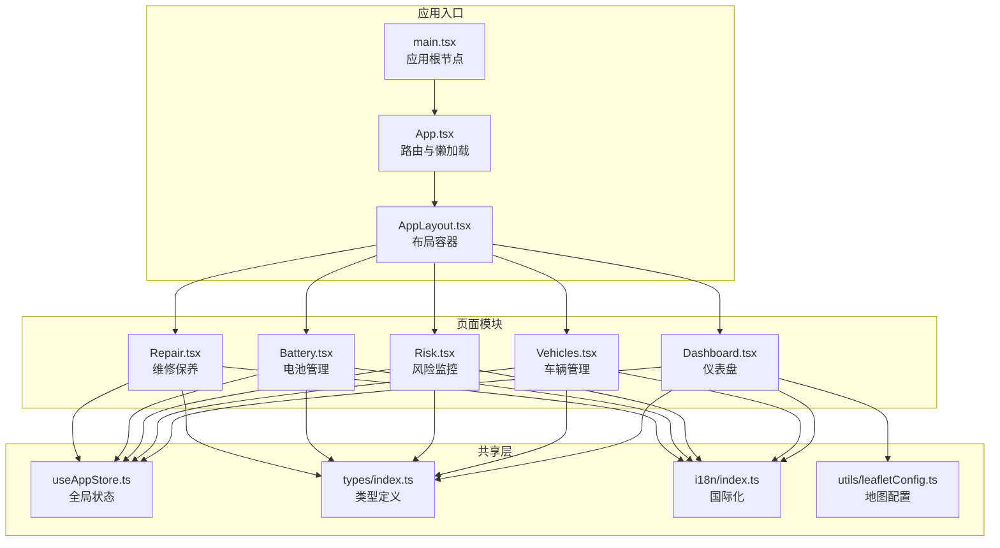
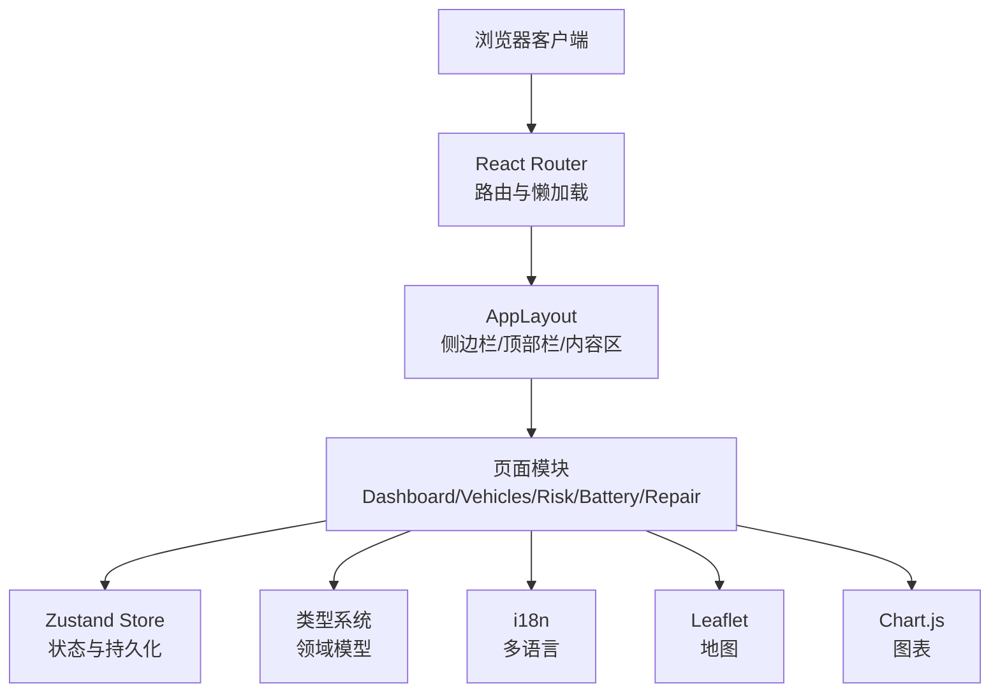
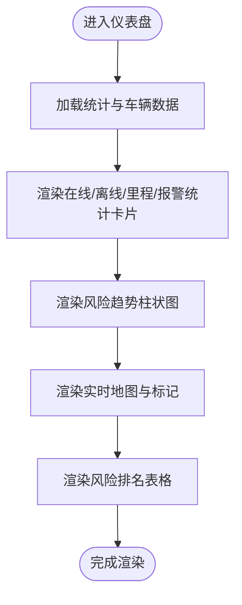
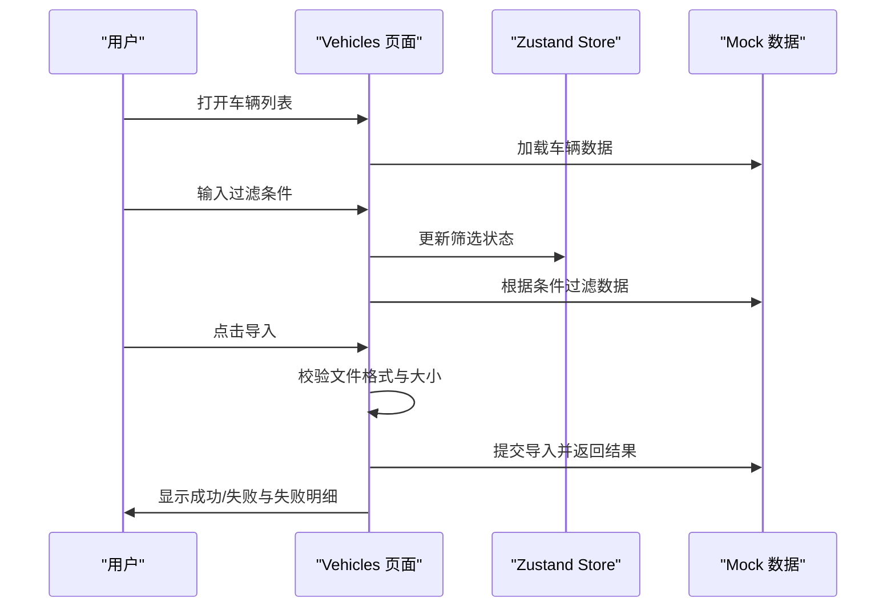
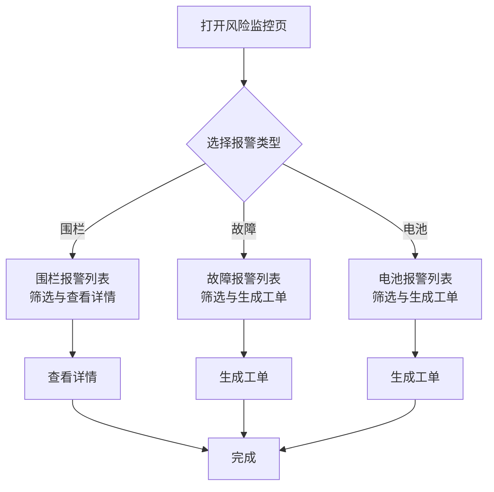
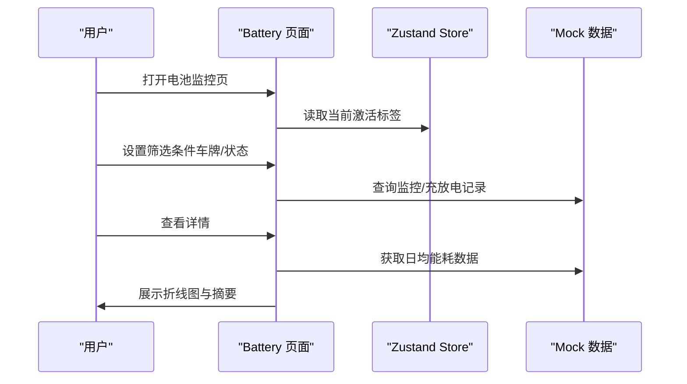
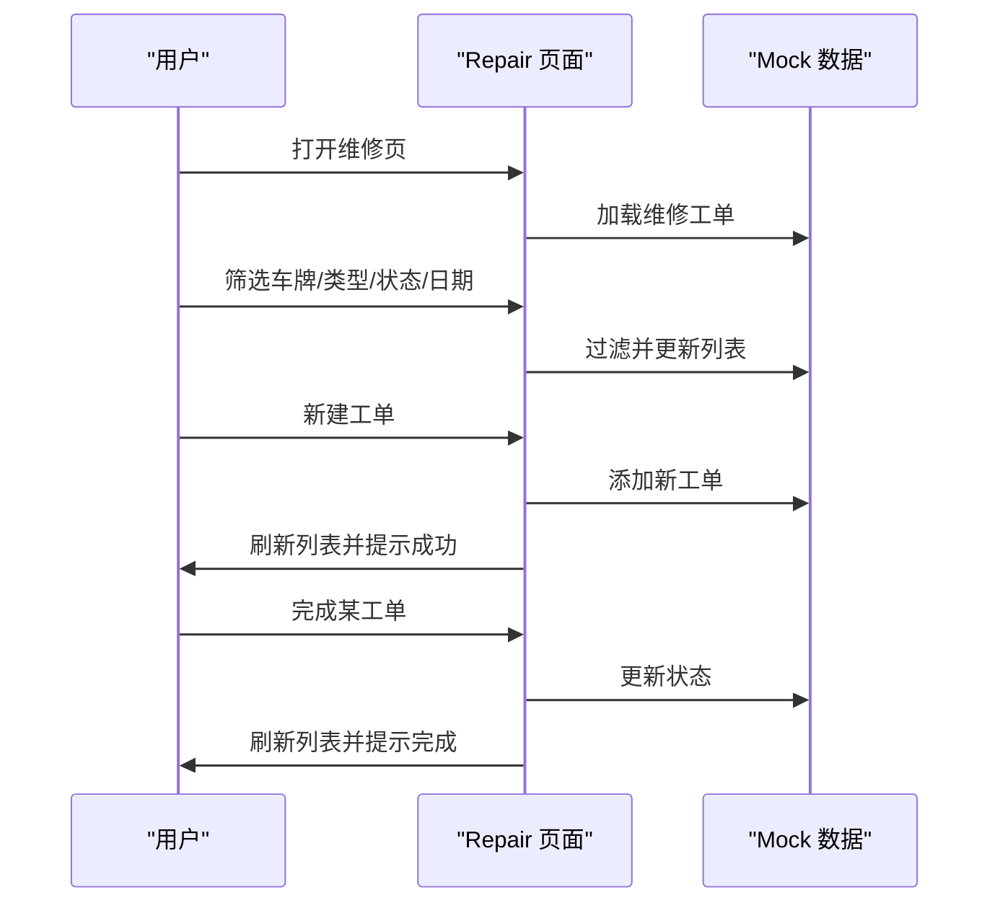
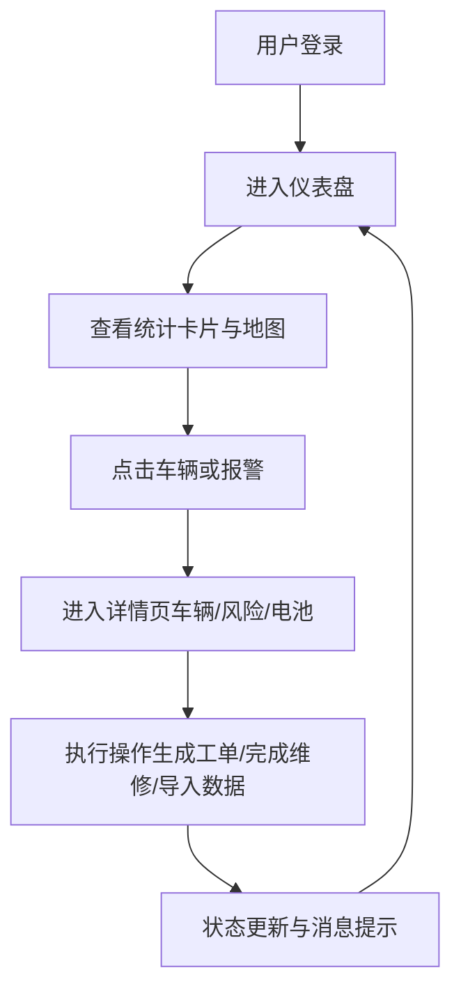

# 项目概述

<cite>
**本文档引用的文件**
- [package.json](file://weidu-fleet/package.json)
- [vite.config.ts](file://weidu-fleet/vite.config.ts)
- [tsconfig.json](file://weidu-fleet/tsconfig.json)
- [src/main.tsx](file://weidu-fleet/src/main.tsx)
- [src/App.tsx](file://weidu-fleet/src/App.tsx)
- [src/components/Layout/AppLayout.tsx](file://weidu-fleet/src/components/Layout/AppLayout.tsx)
- [src/store/useAppStore.ts](file://weidu-fleet/src/store/useAppStore.ts)
- [src/types/index.ts](file://weidu-fleet/src/types/index.ts)
- [src/i18n/index.ts](file://weidu-fleet/src/i18n/index.ts)
- [src/utils/leafletConfig.ts](file://weidu-fleet/src/utils/leafletConfig.ts)
- [src/pages/Dashboard.tsx](file://weidu-fleet/src/pages/Dashboard.tsx)
- [src/pages/Vehicles.tsx](file://weidu-fleet/src/pages/Vehicles.tsx)
- [src/pages/Risk.tsx](file://weidu-fleet/src/pages/Risk.tsx)
- [src/pages/Battery.tsx](file://weidu-fleet/src/pages/Battery.tsx)
- [src/pages/Repair.tsx](file://weidu-fleet/src/pages/Repair.tsx)
</cite>

## 目录
1. [引言](#引言)
2. [项目结构](#项目结构)
3. [核心组件](#核心组件)
4. [架构总览](#架构总览)
5. [详细组件分析](#详细组件分析)
6. [依赖分析](#依赖分析)
7. [性能考虑](#性能考虑)
8. [故障排除指南](#故障排除指南)
9. [结论](#结论)
10. [附录](#附录)

## 引言
苇渡-智利车队管理项目旨在为智利地区的电动车辆车队提供一体化的数字化运营与监管平台。项目围绕“车队管理、风险监控、电池管理、维修保养”四大核心业务场景构建，通过可视化仪表盘、实时地图、多维度数据报表与交互式工作流，帮助运营方实现对车队状态的全面掌控与高效决策。

技术上，项目采用 React 18 + TypeScript + Vite 的现代前端技术栈，结合 Ant Design 组件库、React Router 进行路由管理、Zustand 状态管理、i18n 国际化以及 Chart.js、Leaflet 地图等生态工具，形成高可维护性与良好开发体验的工程化方案。

## 项目结构
项目采用按功能域分层的组织方式：页面（pages）、通用组件（components）、国际化（i18n）、类型定义（types）、状态管理（store）、工具函数（utils）与入口配置（main、App、vite.config）。整体结构清晰、职责明确，便于扩展与维护。

图表来源
- [src/main.tsx:1-49](file://weidu-fleet/src/main.tsx#L1-L49)
- [src/App.tsx:1-88](file://weidu-fleet/src/App.tsx#L1-L88)
- [src/components/Layout/AppLayout.tsx:1-85](file://weidu-fleet/src/components/Layout/AppLayout.tsx#L1-L85)
- [src/store/useAppStore.ts:1-87](file://weidu-fleet/src/store/useAppStore.ts#L1-L87)
- [src/types/index.ts:1-261](file://weidu-fleet/src/types/index.ts#L1-L261)
- [src/i18n/index.ts:1-30](file://weidu-fleet/src/i18n/index.ts#L1-L30)
- [src/utils/leafletConfig.ts:1-14](file://weidu-fleet/src/utils/leafletConfig.ts#L1-L14)

章节来源
- [src/main.tsx:1-49](file://weidu-fleet/src/main.tsx#L1-L49)
- [src/App.tsx:1-88](file://weidu-fleet/src/App.tsx#L1-L88)
- [src/components/Layout/AppLayout.tsx:1-85](file://weidu-fleet/src/components/Layout/AppLayout.tsx#L1-L85)

## 核心组件
- 应用入口与配置
  - 入口文件负责初始化国际化、Ant Design 主题与本地化、Leaflet 图标修复、全局样式与路由容器，并在严格模式下挂载应用。
  - Vite 配置启用 React 插件与路径别名，端口默认 3000，便于本地开发。
  - TypeScript 使用复合项目配置，分别管理应用与 Node 工具链。
- 路由与布局
  - App 组件使用 React Router 进行路由声明，支持登录页免鉴权访问与受保护页面的懒加载渲染。
  - AppLayout 提供侧边栏、顶部栏与内容区域的统一布局，支持折叠与响应式适配。
- 全局状态管理
  - Zustand Store 统一管理语言、用户、租户、令牌、页面状态与各模块筛选参数，持久化存储关键字段，提升用户体验与会话连续性。
- 类型系统
  - types/index.ts 定义了车辆、报警、围栏、行程、维修等核心领域模型，确保跨页面的数据一致性与开发时的类型安全。
- 国际化与地图
  - i18n 初始化支持中/英/西三语，优先从本地持久化存储读取语言设置。
  - Leaflet 配置修复默认图标路径问题，保证地图组件在打包后正常显示标记。

章节来源
- [src/main.tsx:1-49](file://weidu-fleet/src/main.tsx#L1-L49)
- [vite.config.ts:1-16](file://weidu-fleet/vite.config.ts#L1-L16)
- [tsconfig.json:1-8](file://weidu-fleet/tsconfig.json#L1-L8)
- [src/App.tsx:1-88](file://weidu-fleet/src/App.tsx#L1-L88)
- [src/components/Layout/AppLayout.tsx:1-85](file://weidu-fleet/src/components/Layout/AppLayout.tsx#L1-L85)
- [src/store/useAppStore.ts:1-87](file://weidu-fleet/src/store/useAppStore.ts#L1-L87)
- [src/types/index.ts:1-261](file://weidu-fleet/src/types/index.ts#L1-L261)
- [src/i18n/index.ts:1-30](file://weidu-fleet/src/i18n/index.ts#L1-L30)
- [src/utils/leafletConfig.ts:1-14](file://weidu-fleet/src/utils/leafletConfig.ts#L1-L14)

## 架构总览
本项目采用“入口配置 → 路由与布局 → 页面模块 → 共享层”的分层架构。页面模块之间通过全局状态与类型系统解耦；共享层提供跨模块复用的能力（国际化、地图、状态、类型）。数据流以“Mock 数据 + 可替换的 API 客户端”为主，便于后续对接真实后端。

图表来源
- [src/App.tsx:1-88](file://weidu-fleet/src/App.tsx#L1-L88)
- [src/components/Layout/AppLayout.tsx:1-85](file://weidu-fleet/src/components/Layout/AppLayout.tsx#L1-L85)
- [src/store/useAppStore.ts:1-87](file://weidu-fleet/src/store/useAppStore.ts#L1-L87)
- [src/types/index.ts:1-261](file://weidu-fleet/src/types/index.ts#L1-L261)
- [src/i18n/index.ts:1-30](file://weidu-fleet/src/i18n/index.ts#L1-L30)
- [src/utils/leafletConfig.ts:1-14](file://weidu-fleet/src/utils/leafletConfig.ts#L1-L14)

## 详细组件分析

### 仪表盘（Dashboard）
- 功能要点
  - 实时统计卡片：在线/离线、当日里程、总里程、今日报警数、围栏报警数。
  - 风险趋势柱状图：按日、周、月维度展示不同风险类型的报警数量。
  - 实时地图：基于 Leaflet 展示在线车辆位置与状态（SOC 阈值决定颜色）。
  - 车队排名表：按风险指标聚合的车辆排行。
- 技术实现
  - 使用 Chart.js 注册必要组件，构建响应式柱状图。
  - 使用 react-leaflet 渲染地图瓦片与圆点标记，弹窗展示车辆详情。
  - 国际化文本通过 useTranslation 获取，确保多语言文案一致。
- 用户价值
  - 为管理者提供全局视图，快速识别异常与热点区域，辅助调度与预警。

图表来源
- [src/pages/Dashboard.tsx:1-257](file://weidu-fleet/src/pages/Dashboard.tsx#L1-L257)

章节来源
- [src/pages/Dashboard.tsx:1-257](file://weidu-fleet/src/pages/Dashboard.tsx#L1-L257)

### 车辆管理（Vehicles）
- 功能要点
  - 列表视图：支持 VIN、车牌、设备 ID、电池版本、车龄范围等多维过滤；支持导入模板下载与批量导入结果导出。
  - 详情视图：按标签页展示风险报警、驾驶行为、电池状态、充电记录、行程与维修等子表与图表。
  - 导入流程：拖拽上传、格式校验、大小限制、结果反馈与失败明细导出。
- 技术实现
  - 使用 Ant Design 表格与分页，支持横向滚动与多种尺寸。
  - 通过 useAppStore 维护筛选条件与当前激活标签页，提升交互连贯性。
  - 导入使用 xlsx 进行结果写入，消息提示增强用户体验。
- 用户价值
  - 提升车辆数据治理效率，支持快速定位异常与制定保养策略。

图表来源
- [src/pages/Vehicles.tsx:1-440](file://weidu-fleet/src/pages/Vehicles.tsx#L1-L440)
- [src/store/useAppStore.ts:1-87](file://weidu-fleet/src/store/useAppStore.ts#L1-L87)

章节来源
- [src/pages/Vehicles.tsx:1-440](file://weidu-fleet/src/pages/Vehicles.tsx#L1-L440)
- [src/store/useAppStore.ts:1-87](file://weidu-fleet/src/store/useAppStore.ts#L1-L87)

### 风险监控（Risk）
- 功能要点
  - 围栏报警：入栏/出栏报警列表，支持按车牌与类型筛选，查看报警详情。
  - 故障报警：按平台（VCU/MCU/BMS 等）与状态筛选，支持一键生成工单。
  - 电池报警：按类型（低 SOC/高温/跳变等）与状态筛选，支持生成电池类工单。
- 技术实现
  - 使用 Ant Design 表格与标签进行状态与类型可视化。
  - 通过 addRepairItem 生成工单并更新状态，消息提示确认操作结果。
  - 本地化映射不同类型到中文标签，提升可读性。
- 用户价值
  - 快速定位风险事件，规范处置流程，降低事故与停运风险。

图表来源
- [src/pages/Risk.tsx:1-435](file://weidu-fleet/src/pages/Risk.tsx#L1-L435)

章节来源
- [src/pages/Risk.tsx:1-435](file://weidu-fleet/src/pages/Risk.tsx#L1-L435)

### 电池管理（Battery）
- 功能要点
  - 监控：按车牌与状态筛选电池监控项，查看 SOC、SOH、温度、续航、充电次数与状态。
  - 充电/放电：按车牌筛选充电/放电记录，展示电压、电流、功率、前后电量、耗时与能耗。
  - 统计：平均 SOC、平均温度、平均续航与低电量报警数。
  - 详情：展示 30 天日均能耗折线图与摘要信息。
- 技术实现
  - 使用 Chart.js 注册折线图组件，绘制日均能耗曲线。
  - 通过 formatDuration 等工具函数优化数值展示。
  - 通过 Modal 展示详情卡片，提升信息密度与可读性。
- 用户价值
  - 建立电池健康度与能耗的量化指标，支撑换电与运维策略制定。

图表来源
- [src/pages/Battery.tsx:1-343](file://weidu-fleet/src/pages/Battery.tsx#L1-L343)
- [src/store/useAppStore.ts:1-87](file://weidu-fleet/src/store/useAppStore.ts#L1-L87)

章节来源
- [src/pages/Battery.tsx:1-343](file://weidu-fleet/src/pages/Battery.tsx#L1-L343)
- [src/store/useAppStore.ts:1-87](file://weidu-fleet/src/store/useAppStore.ts#L1-L87)

### 维修保养（Repair）
- 功能要点
  - 列表：按车牌、类型（故障/电池）、状态（维修中/已完成）与日期区间筛选维修工单。
  - 新建：选择车辆、类型与描述，填写开始日期，提交后刷新列表。
  - 完成：将进行中的工单标记为已完成。
- 技术实现
  - 使用 Ant Design 表单与模态框，保证表单校验与交互一致性。
  - 通过 addRepairItem 与 getRepairItems 模拟 CRUD 流程。
- 用户价值
  - 规范维修流程，提升工单透明度与处理效率。

图表来源
- [src/pages/Repair.tsx:1-263](file://weidu-fleet/src/pages/Repair.tsx#L1-L263)

章节来源
- [src/pages/Repair.tsx:1-263](file://weidu-fleet/src/pages/Repair.tsx#L1-L263)

### 概念性概览
以下为概念性流程图，展示从用户操作到数据呈现的整体过程，不绑定具体源码文件。

## 依赖分析
- 运行时依赖
  - React 18：提供组件化与并发特性，支持 Suspense 与并发渲染。
  - Ant Design：提供丰富的 UI 组件与主题定制能力。
  - React Router DOM：实现 SPA 路由与懒加载。
  - Chart.js 与 react-chartjs-2：用于数据可视化。
  - Leaflet 与 react-leaflet：地图底图与标记展示。
  - xlsx：导入/导出 Excel 文件。
  - zustand：轻量级状态管理，支持持久化。
  - axios：HTTP 客户端（预留，当前使用 Mock 数据）。
- 开发依赖
  - Vite：构建工具与开发服务器。
  - TypeScript：类型系统保障代码质量。
  - React Testing Library 与 Vitest：单元测试与 DOM 测试。
- 设计理念
  - 分层清晰：页面、布局、共享层职责分离。
  - 状态集中：Zustand 统一管理页面状态与筛选参数。
  - 可扩展：Mock 数据与 API 客户端解耦，便于替换。
  - 国际化先行：i18n 初始化与 Ant Design 本地化集成。

章节来源
- [package.json:1-41](file://weidu-fleet/package.json#L1-L41)

## 性能考虑
- 代码分割与懒加载
  - 页面组件通过 React.lazy 与 Suspense 实现按需加载，减少首屏体积与加载时间。
- 路由与布局
  - AppLayout 将公共布局抽离，避免重复渲染，提高切换页面的流畅度。
- 图表与地图
  - Chart.js 与 react-leaflet 在需要时才渲染，避免不必要的计算与 DOM 操作。
- 状态持久化
  - Zustand 持久化关键状态（用户、语言、令牌、租户），减少刷新后的状态丢失。
- 构建与开发
  - Vite 提供快速冷启动与热更新，tsconfig 复合配置提升编译效率。

## 故障排除指南
- 地图图标缺失
  - 现象：地图标记图标不显示。
  - 排查：检查 Leaflet 默认图标路径修复是否生效。
  - 解决：确认 utils/leafletConfig.ts 已被引入。
- 国际化语言不生效
  - 现象：界面语言未按预期切换。
  - 排查：检查 i18n 初始化逻辑与本地持久化语言键值。
  - 解决：确认 i18n/index.ts 中的初始语言读取逻辑与 Ant Design 本地化配置。
- 页面空白或路由异常
  - 现象：进入受保护页面出现空白或反复跳转。
  - 排查：检查 AppLayout 中的鉴权逻辑与 store.page 状态。
  - 解决：确认登录状态与路由守卫逻辑一致。
- 导入文件失败
  - 现象：导入 CSV/XLSX 失败或无结果。
  - 排查：检查文件格式、大小限制与上传回调。
  - 解决：根据提示修正文件格式与大小，重新上传。

章节来源
- [src/utils/leafletConfig.ts:1-14](file://weidu-fleet/src/utils/leafletConfig.ts#L1-L14)
- [src/i18n/index.ts:1-30](file://weidu-fleet/src/i18n/index.ts#L1-L30)
- [src/components/Layout/AppLayout.tsx:1-85](file://weidu-fleet/src/components/Layout/AppLayout.tsx#L1-L85)
- [src/pages/Vehicles.tsx:1-440](file://weidu-fleet/src/pages/Vehicles.tsx#L1-L440)

## 结论
苇渡-智利车队管理项目以 React 18 + TypeScript + Vite 为基础，结合 Ant Design、Zustand、Chart.js 与 Leaflet 等成熟生态，构建了覆盖“车队管理、风险监控、电池管理、维修保养”的完整前端体系。通过清晰的分层架构、完善的类型系统与国际化支持，项目在可维护性、可扩展性与用户体验方面具备良好基础。建议后续重点推进 API 客户端替换、真实数据接入与测试覆盖率提升，以进一步完善产品化能力。

## 附录
- 术语
  - 车队：一组运营中的电动车辆集合。
  - 风险监控：对车辆运行中的异常事件进行监测与处置。
  - 电池管理：对电池健康度、能耗与充放电过程进行跟踪与分析。
  - 维修保养：对故障与电池问题进行工单化管理与闭环追踪。
- 版本与环境
  - React 18、TypeScript、Vite、Ant Design、Chart.js、Leaflet、Zustand、i18n 等版本详见 package.json。
- 开发与构建
  - 启动：npm run dev（默认端口 3000）。
  - 构建：npm run build。
  - 预览：npm run preview。