# 基于 CAN-OBD 的海外新能源商用车车队数据管理平台 V1.0 操作手册

## 页面 1：登录页

操作者打开系统登录页面,进入登录界面。系统支持邮箱密码登录,首次登录或密码被重置后系统将要求修改密码,页面支持中文和英文语言切换。

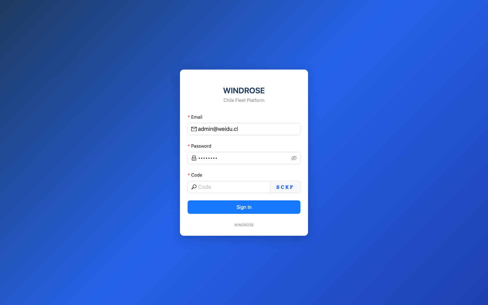

---

## 页面 2：仪表盘

操作者登录系统后,默认进入仪表盘(首页看板)界面。顶部统计卡片展示车辆总数、在线数、离线数、今日里程、累计总里程及今日各类预警数;中部左侧为驾驶风险分布柱状图(支持切换今日/近7日/近30日),右侧为车辆实时位置地图(可拖动缩放查看车辆分布);底部为今日预警排行榜(按车辆预警总数由高到低排序)。

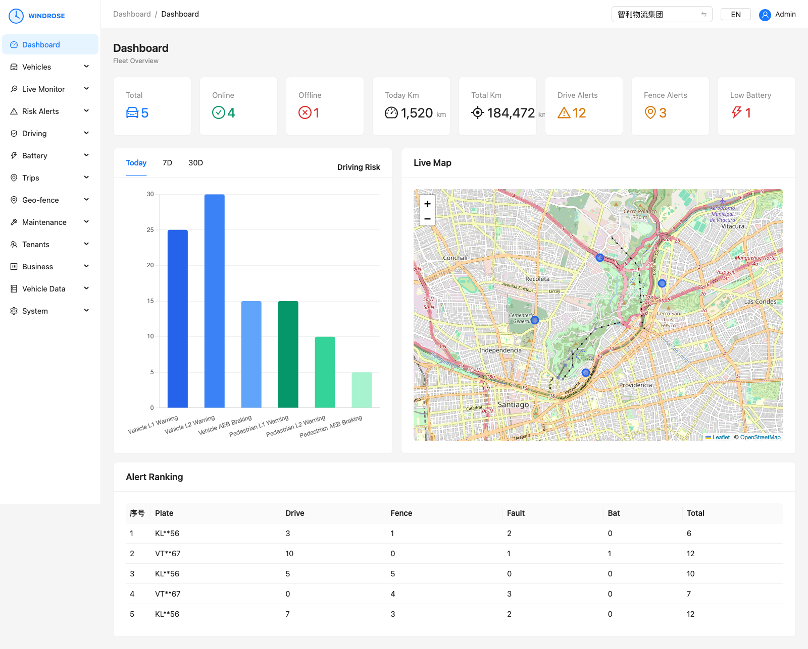

---

## 页面 3：车辆管理

操作者点击左侧导航栏「车辆管理」→「车辆列表」,进入车辆管理界面。搜索区域支持按 VIN 码、车牌号、设备 ID、电池版本、车龄范围筛选车辆;列表展示每辆车的 VIN 码、车牌号、车型、车龄、总里程、最后位置等信息;点击「查看详情」可进入车辆详情页,点击「批量导入」可通过 Excel 批量更新车辆扩展信息。

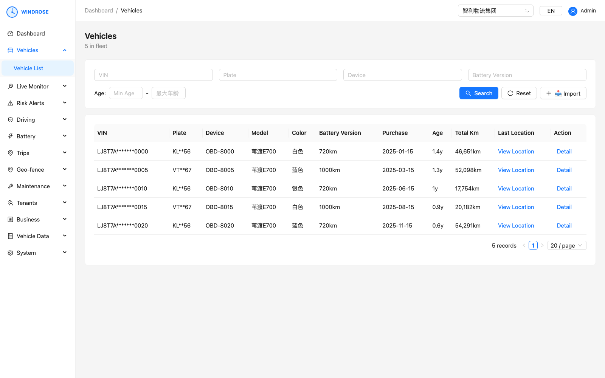

### 弹窗 1：导入车辆

操作者在车辆列表页点击「批量导入」按钮,弹出导入窗口。系统支持下载标准导入模板(VIN 码为必填项),上传后自动校验文件格式、大小及数据合法性,完成后展示成功条数和失败条数,支持下载失败明细。支持的文件格式为 .xls、.xlsx、.csv,单次上传不超过 50MB。

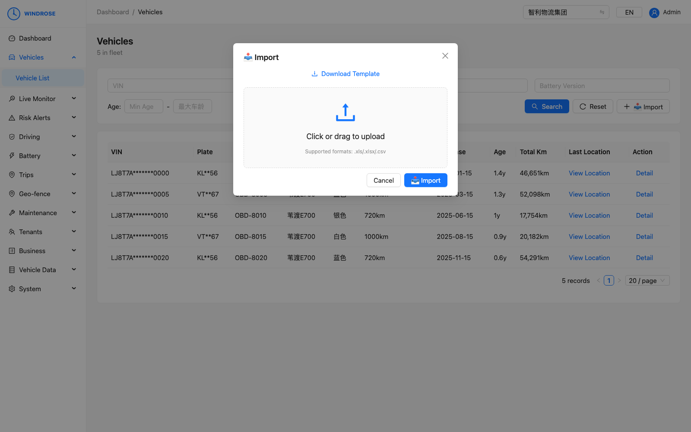

---

## 页面 4：车辆详情

操作者在车辆列表页点击任意车辆的「查看详情」,进入车辆详情界面。左侧展示车辆基础信息(VIN 码、车牌号、车型、外观、购车时间、车龄、电池版本、总里程、最后位置)和关联设备信息(设备 ID、名称、类型、型号);右侧为台账区域,默认展示风控预警记录 Tab,支持切换查看驾驶预警记录、电池监控信息、充电记录、行程记录、维修记录、里程报表七类数据。

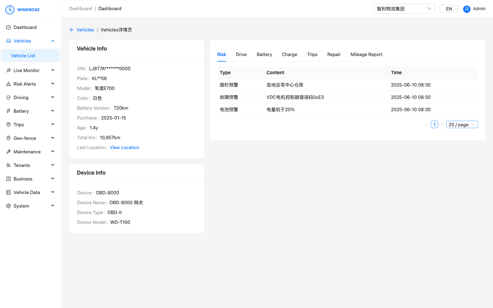

#### 驾驶预警记录 Tab

切换到驾驶预警记录 Tab,展示该车行驶过程中 ADAS 系统上报的碰撞预警事件,包含对车一级/二级预警、对车 AEB 制动、对人一级/二级预警、对人 AEB 制动六种类型,以及预警时间、位置和行车速度。

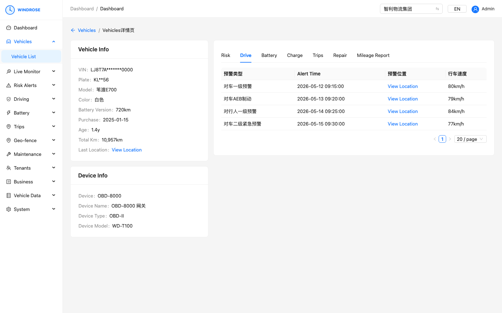

#### 电池监控信息 Tab

切换到电池监控信息 Tab,展示该车电池的 SOC、温度、续航里程、日均电耗、健康度及充电状态(未充电/准备充电/充电中/对方放电/故障&异常)等信息。

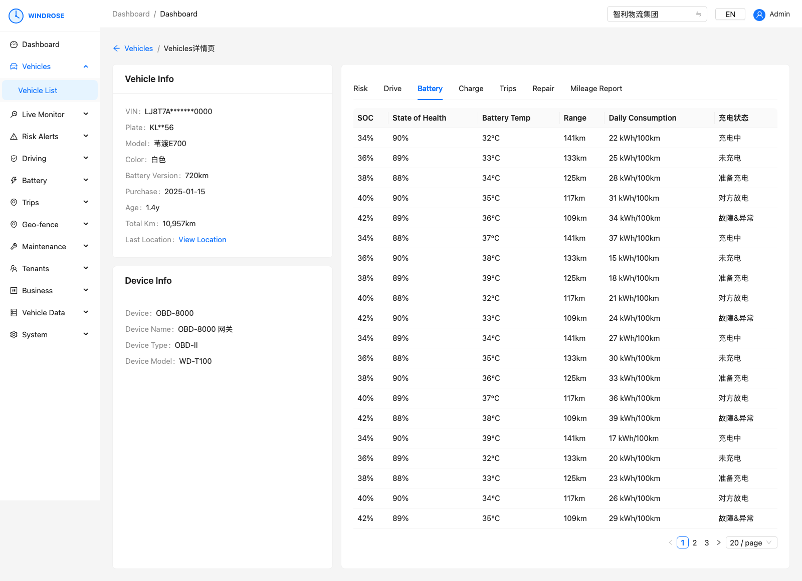

#### 充电记录 Tab

切换到充电记录 Tab,展示该车每次充电的电压、电流、功率、充电前后电量及充电时长等明细数据,按记录时间倒序排列。

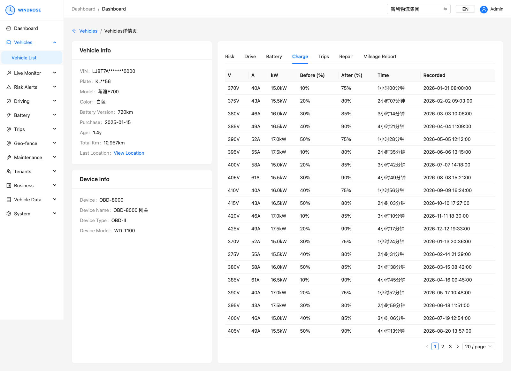

#### 行程记录 Tab

切换到行程记录 Tab,按行程维度展示该车每次出行的开始/结束时间、起终点位置、行驶里程、行程时长、平均车速及关联预警次数。

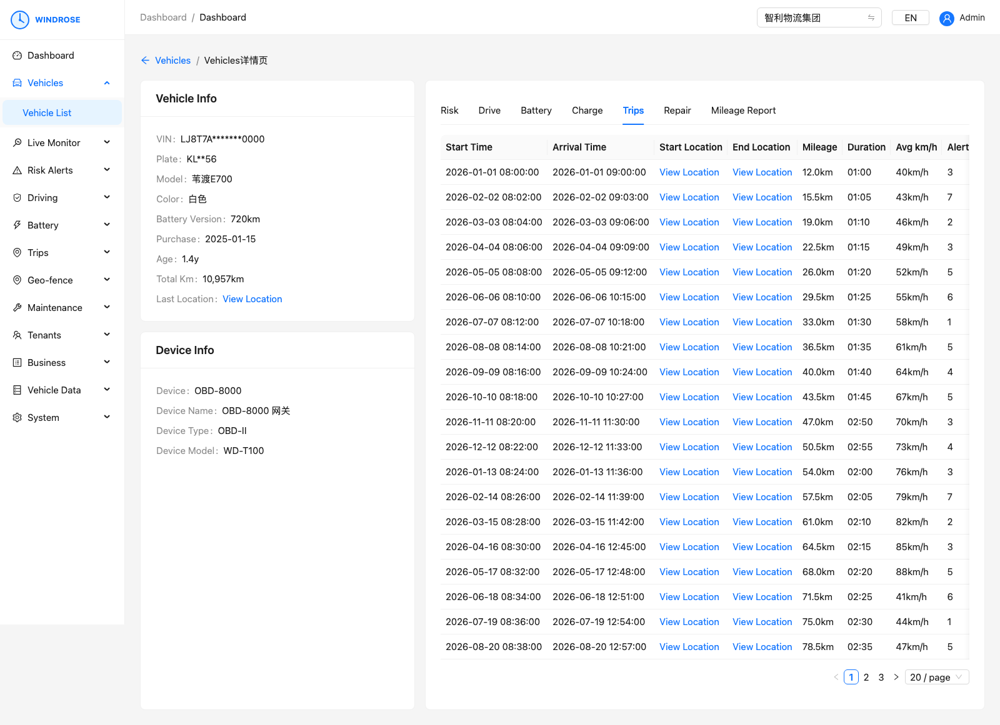

#### 维修记录 Tab

切换到维修记录 Tab,展示该车从故障预警或电池预警一键报修生成的维修工单,以及手动创建的维修记录。每条记录包含维修类型、描述、开始/结束时间、操作人和维修状态。

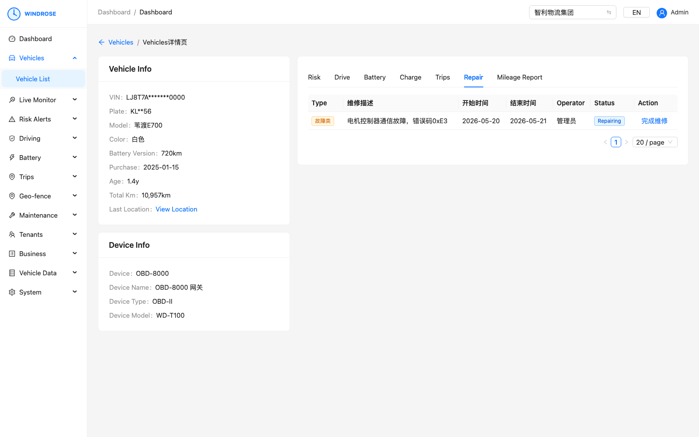

#### 里程报表 Tab

切换到里程报表 Tab,以折线图展示该车的行驶里程趋势。支持按日(近 30 天)、周(近 30 周)、月(近 12 个月)、年(近 3 年)四种时间维度切换查看,Y 轴单位为 km。

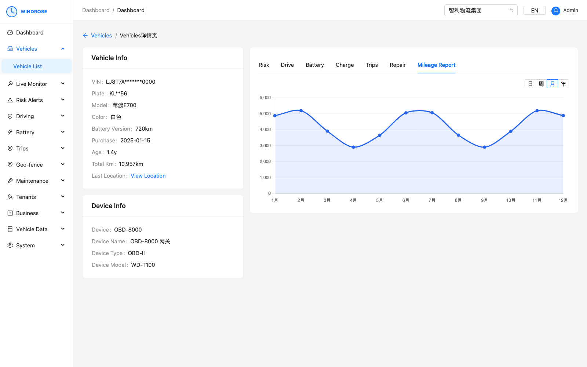

---

## 页面 5：实时监控

操作者点击左侧导航栏「实时监控」→「实时位置」,进入实时位置界面。左侧按企业层级展示租户结构及下属车辆,支持按企业名称/VIN 码模糊搜索和多选(选中企业可一键全选该企业下所有车辆);右侧地图展示所选车辆的实时位置图标,点击图标可查看车辆详情气泡(VIN、车牌号、所属企业、设备名称及状态、当前车速、数据上报时间),地图支持拖拽和缩放,车辆较多时自动聚合显示。

操作者点击「实时监控」→「轨迹回放」,进入轨迹回放界面。选择日期(仅支持最近 30 天)和车辆(单选),右侧地图展示当日行驶轨迹,绿色标记起点、红色标记终点;点击播放按钮可动态观看轨迹,支持 1/2/4/8 倍速切换;下方行程列表展示该车当日的所有行程段,点击某一行程可切换地图至对应轨迹。

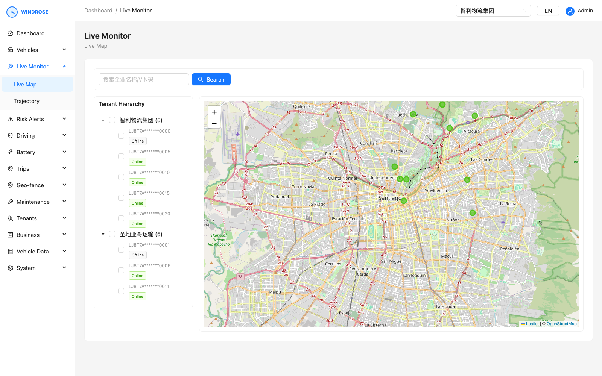

---

## 页面 6：风控预警

操作者点击「风控预警」→「围栏预警」,进入围栏预警列表界面。列表展示车辆进出电子围栏时触发的预警记录,包含 VIN 码、车牌号、设备 ID、预警类型(出栏/入栏)、围栏名称、预警位置和预警时间,点击「查看详情」可查看预警详细信息及地图标注。

### 弹窗 2：围栏预警详情

操作者点击围栏预警记录的「查看详情」,进入预警详情界面。页面展示触发预警的车辆基本信息(车牌号、VIN 码)、围栏信息(围栏名称)、设备数据(预警时车速、预警位置、预警时间)以及地图标注(预警上报点位与围栏范围)。

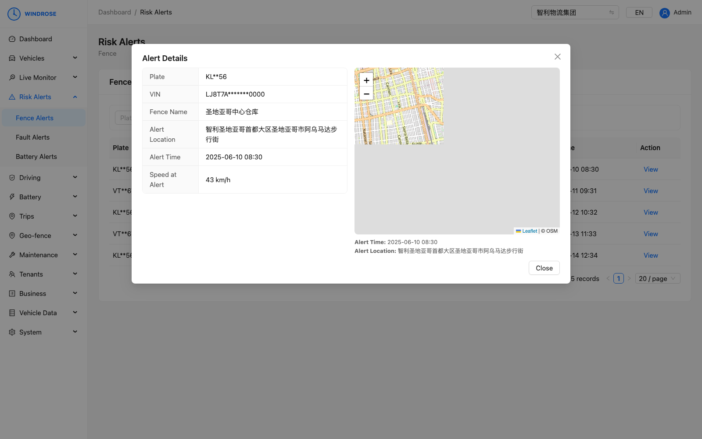

操作者点击「风控预警」→「故障预警」,进入故障预警列表界面。列表展示车辆整车故障预警记录(VDC、CDCU、BDCU、ADAS、DC-DC、驱动电机、高压互锁等故障),每条记录包含 VIN 码、预警类型、预警内容、预警时间和处理状态(未处理/维修中/维修完成);对「未处理」状态的预警,点击「一键报修」可自动生成维修工单,状态同步变更为「维修中」。

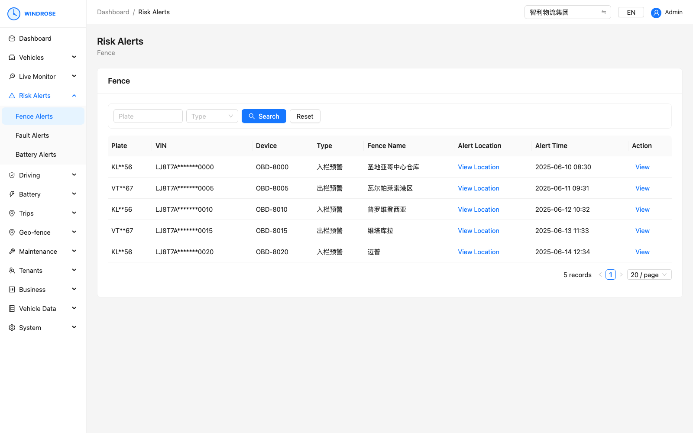

操作者点击「风控预警」→「电池预警」,进入电池预警列表界面。列表展示车辆电池类预警记录(温度差异、电池高温、过压/欠压、SOC 异常、绝缘故障、充电故障等),支持对「未处理」状态的预警一键报修生成维修工单。

---

## 页面 7：驾驶行为

操作者点击「驾驶行为」→「驾驶预警」,进入驾驶预警列表界面。可按预警类型(对车一级/二级/AEB、对人一级/二级/AEB)、时间范围和车牌号筛选查询;列表展示每条预警的 VIN 码、预警类型、预警时间、预警位置(默认收起,点击查看)和行车速度。

操作者点击「驾驶行为」→「驾驶报告」,进入驾驶报告列表界面。默认展示周报,可切换至月报 Tab。列表展示每辆车的报告时间、风险等级(安全/低危/中危/高危司机)、行驶里程、触发风险数和驾驶评分,支持按车牌号和风险等级筛选。

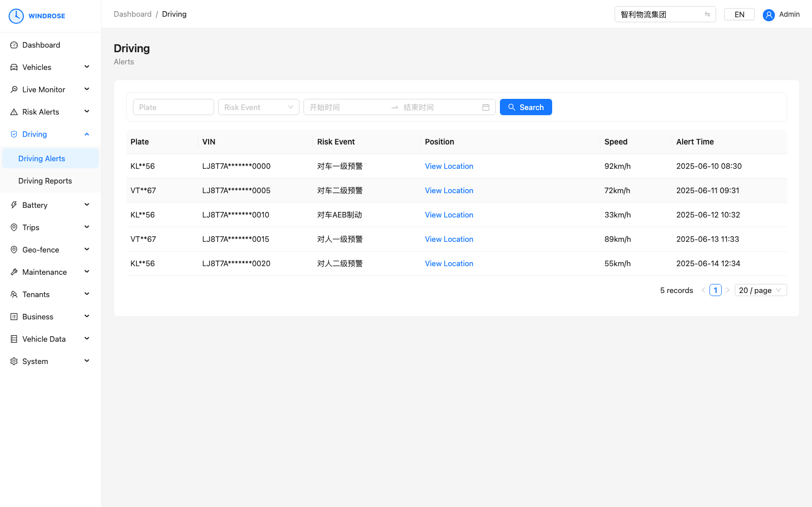

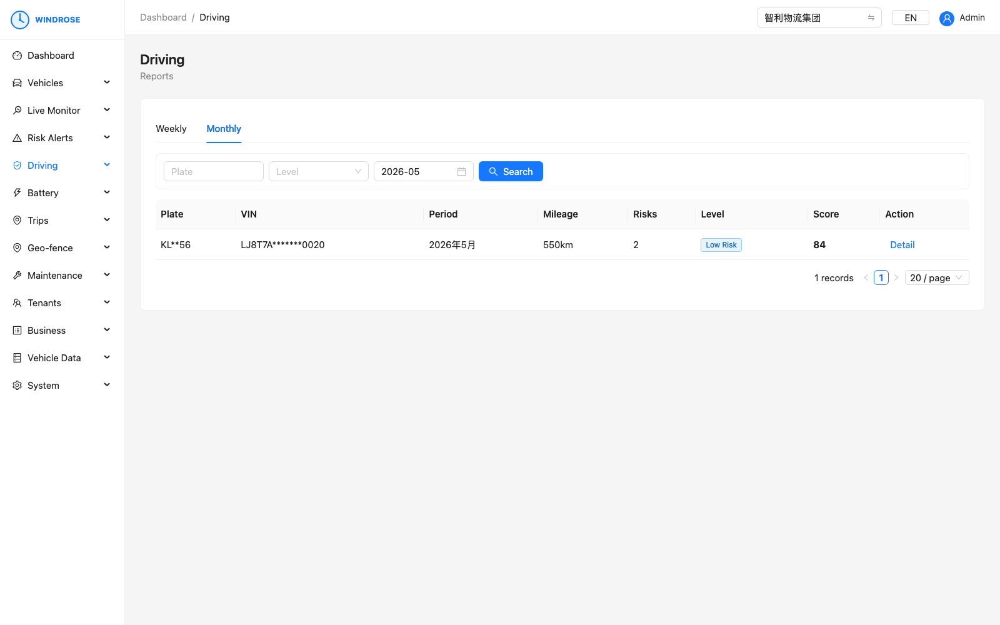

### 弹窗 3：驾驶报告详情

操作者点击报告列表中任意报告的「查看详情」,弹出详情窗口。顶部展示车辆基本信息(VIN 码、车牌号、车型、外观、车龄)和报告时间;数据指标区展示累计行驶里程、累计行驶时长、平均车速和驾驶评分;行驶里程趋势折线图展示报告周期内每日行驶里程变化,行驶区域分布柱状图展示各城市行驶里程分布;底部为系统根据驾驶行为自动生成的驾驶改善建议。

---

## 页面 8：电池管理

操作者点击「电池管理」→「电池监控」,进入电池监控列表界面。顶部展示平均 SOC、平均电池温度、平均续航里程和低电量预警数四项汇总指标;列表展示每辆车最新的 SOC、电池温度、续航里程、日均电耗、累计充电次数、电池健康度和充电状态(未充电/准备充电/充电中/对方放电/故障&异常)。

### 弹窗 4：电池监控详情

操作者点击「查看详情」,进入电池监控详情界面。顶部展示该车当前的 SOC 值、电池健康度和电池温度三项核心指标;下方为近 30 天日均电耗趋势折线图,单位 kWh/100km。

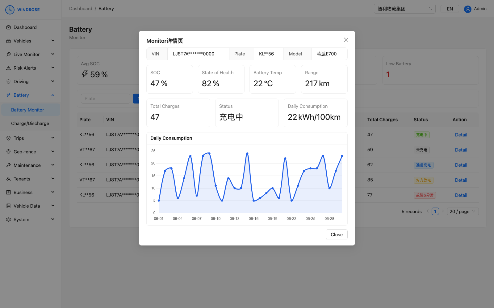

操作者点击「电池管理」→「充放电记录」,默认进入充电记录列表界面。可按车辆和时间范围查询,列表展示每次充电的电压、电流、功率、充电前/后电量和充电时长。

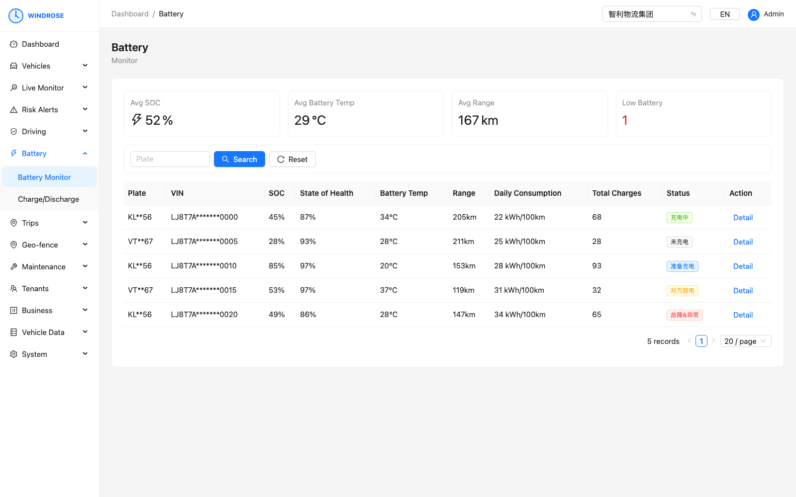

切换到「放电记录」Tab 可查看车辆放电明细。充电判定条件为充电状态信号 0100b/0011b 且电流大于 +2A 持续 1 分钟;放电判定条件为信号 0000b 且电流小于 -2A 且车速大于 0 持续 1 分钟。

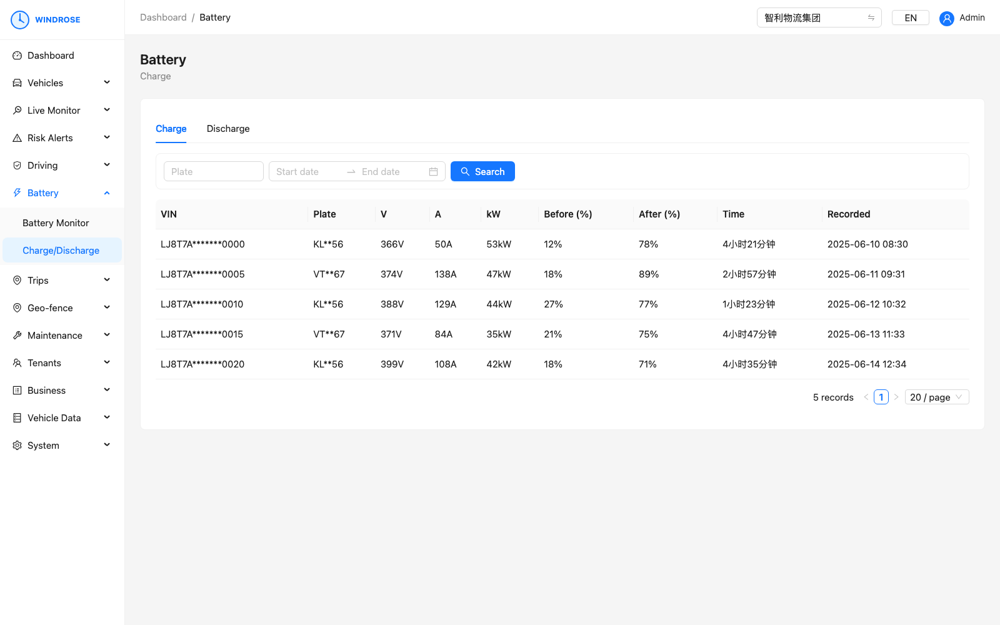

---

## 页面 9：行程记录

操作者点击「行程管理」→「行程记录」,进入行程记录列表界面。可按车辆和时间范围查询,列表展示每段行程的开始时间、结束时间、起点、终点、行驶里程、行程时长、平均车速和关联预警次数。

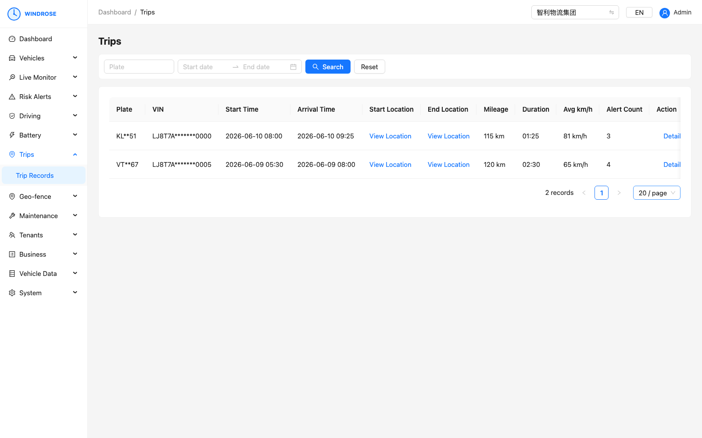

操作者点击任意行程的「查看详情」,进入行程详情界面。左侧展示行程详细数据(VIN 码、车牌号、行驶里程、行程时长、平均车速、最高/最低车速、起点、终点);右侧地图展示该行程的完整行驶轨迹,支持拖拽和缩放。行驶轨迹有效期为 30 天,超期显示"行驶轨迹已过期"。

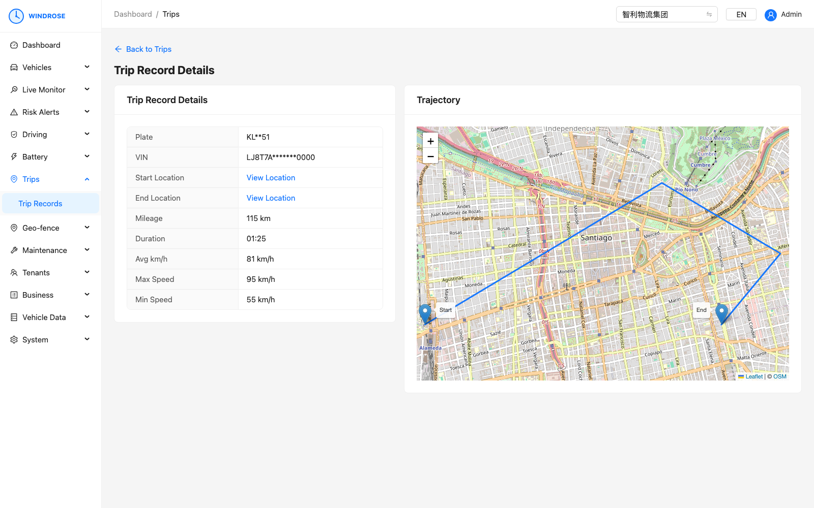

---

## 页面 10：围栏管理

操作者点击「围栏管理」,进入围栏管理列表界面。列表展示所有围栏的名称、类型(中心点/自定义)、使用车辆数、预警类型(出栏/入栏)、状态(生效中/未生效)、围栏地址、操作人和操作时间。可点击「新建围栏」创建围栏,点击「使用车辆」配置关联车辆,点击开关按钮启用或停用围栏;围栏关闭状态下支持编辑和删除。

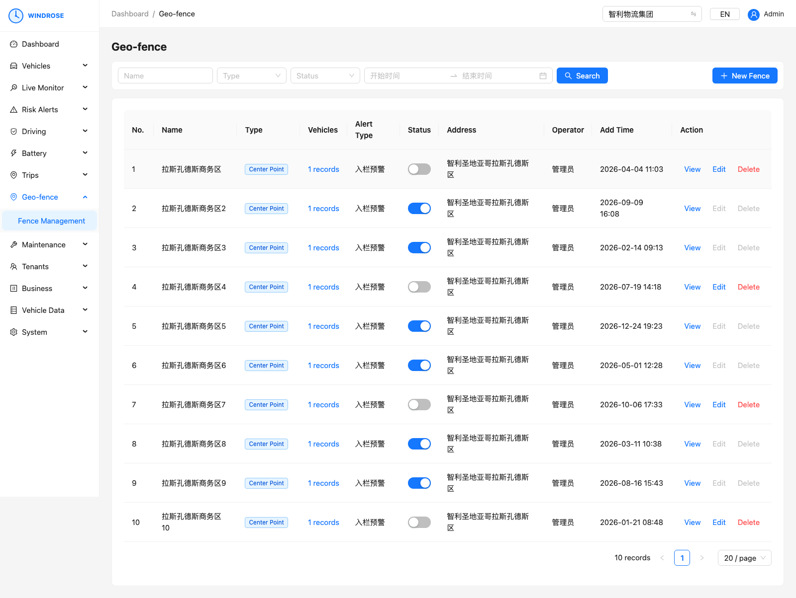

### 弹窗 5：新建围栏

操作者点击「新建围栏」,弹出新建窗口。输入围栏名称(最长 30 字符),选择围栏类型(中心点围栏或自定义围栏)和预警类型(出栏或入栏)。中心点围栏需搜索地址定位中心点并设置半径(0~100km),自定义围栏需在地图上点击标记最多 99 个点位,系统自动连接闭合形成多边形区域。

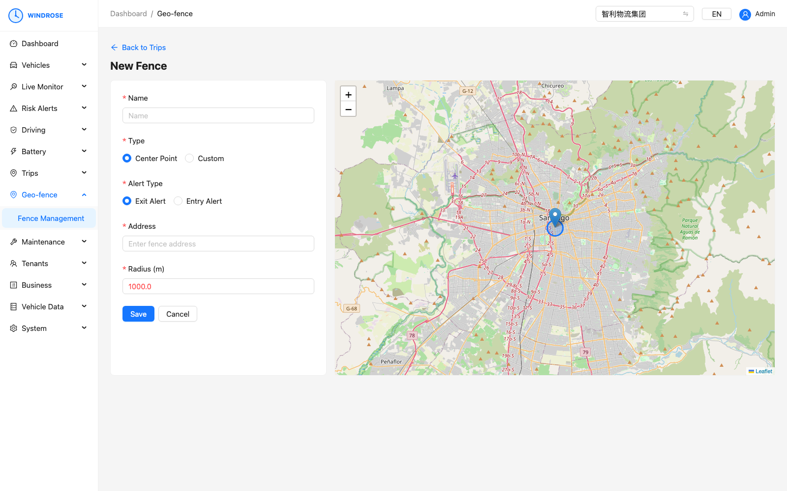

### 弹窗 5.5：车辆配置

操作者点击围栏列表中「使用车辆」的数字链接,进入车辆配置界面。列表展示已关联该围栏的车辆(VIN 码、车牌号、添加时间)。点击「添加车辆」可搜索并勾选车辆加入围栏监控范围,点击「删除」可移除车辆(二次确认后生效)。

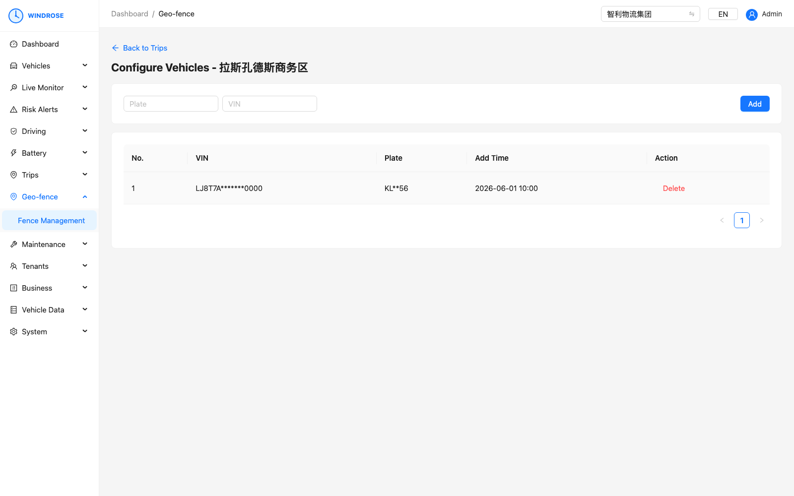

---

## 页面 11：维修管理

操作者点击「维修管理」→「维修记录」,进入维修管理列表界面。列表展示维修工单记录,包含 VIN 码、车牌号、维修类型(故障类/电池类)、维修描述、开始时间、结束时间、操作人和维修状态(维修中/维修完成)。可按车牌号、维修类型、维修状态和时间范围筛选,点击「新建维修」手动创建工单,对「维修中」的记录点击「完成维修」变更状态。

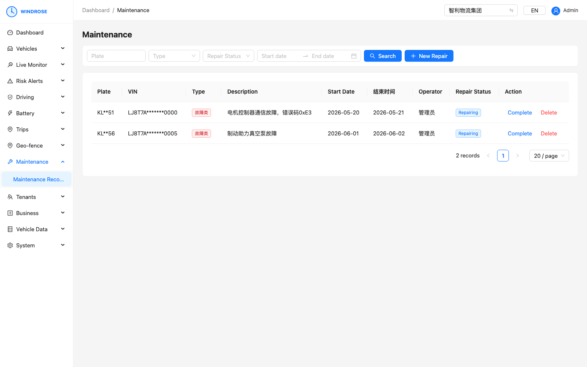

### 弹窗 6：新建维修

操作者点击「新建维修」,弹出新建窗口。依次选择维修车辆(通过车牌号/VIN 码搜索)、维修类型(故障类或电池类)和维修描述(对应具体预警类型)。点击「提交」校验必填项并创建维修工单,成功后列表自动刷新并提示"新建维修记录成功"。

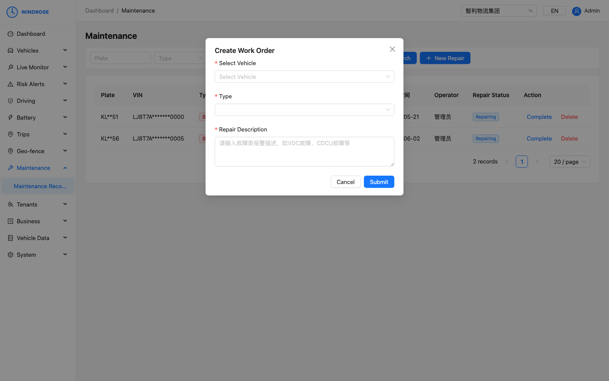

---

## 页面 12：租户管理

操作者点击「租户管理」,进入租户管理列表界面。列表展示下级租户的企业信息(企业编码、企业名称、地址、联系人、联系电话)、管理员账号和创建时间。可按企业编码、企业名称、管理员账号和创建时间筛选。点击「新增租户」创建下级租户,点击「编辑」修改企业信息(企业编码不可改),点击「开通账号」为租户配置主管理员,未开通账号的租户可点击「删除」移除。

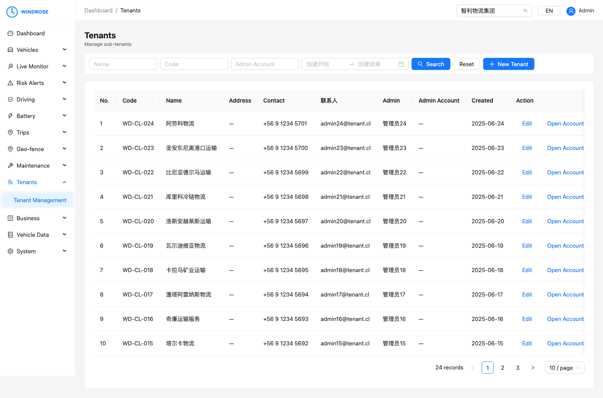

### 弹窗 7：新建/编辑租户

操作者点击「新增租户」,弹出新建窗口。填写企业名称和企业编码(必填且不可重复,编码仅支持英文和数字),选填企业地址、联系人和联系电话。编辑租户时企业编码置灰不可修改,其余字段可更新。

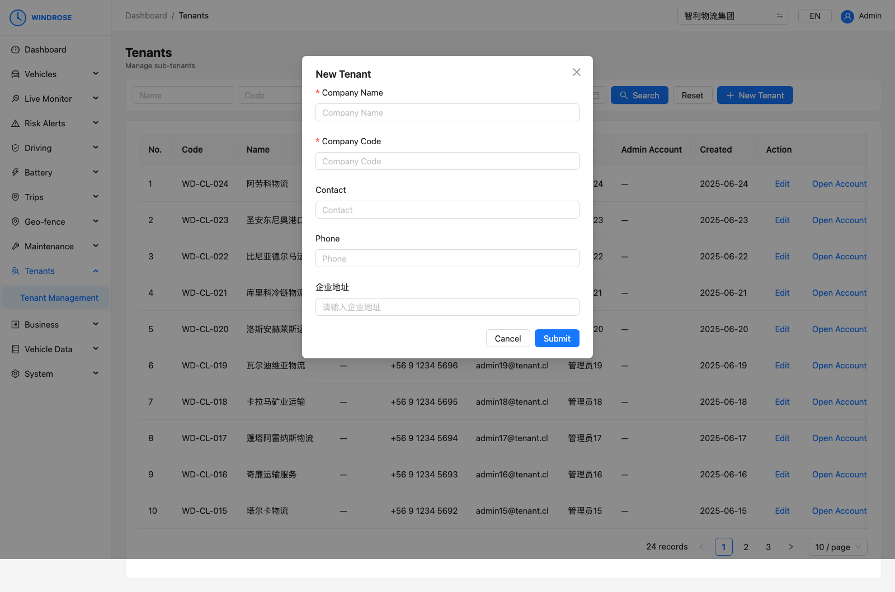

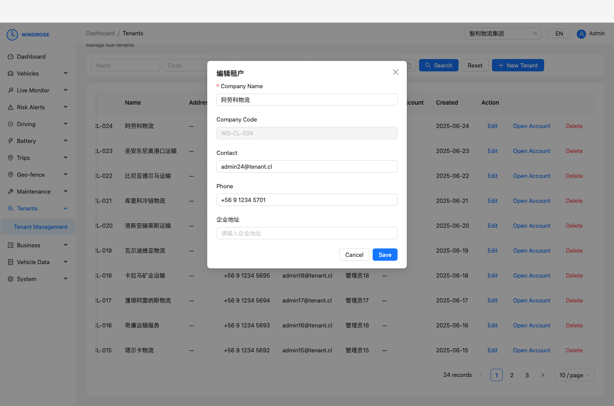

### 弹窗 8：配置管理员

操作者点击「开通账号」,进入配置管理员界面。输入用户昵称和登录邮箱,角色默认为管理员不可更改。若账号不存在,系统自动创建新账号并生成初始密码(8 位大写字母+数字随机组合),展示用户 ID、登录邮箱和初始密码。点击「完成」返回租户列表。

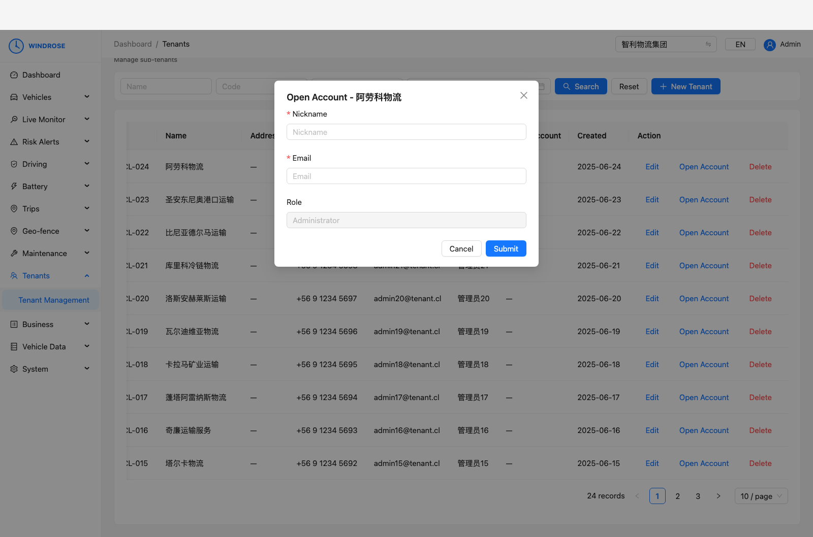

---

## 页面 13：企业管理

操作者使用应用管理员账号登录,进入业务管理模块。点击「业务管理」→「租户权限」,左侧为租户层级树(根级→一级→二级及以下),一级租户数据来源于租户管理不可编辑删除,仅可添加一个下级;选中二级及以下层级可编辑名称或继续添加下级;右侧为功能权限树,选中目标层级后可勾选该层级租户的菜单和按钮权限范围。

点击「业务管理」→「租户信息」,左侧以树形结构展示全应用所有租户的层级关系,支持关键词模糊搜索;点击任意租户节点(除根级外),右侧展示该租户的企业基础信息和主管理员账号信息。

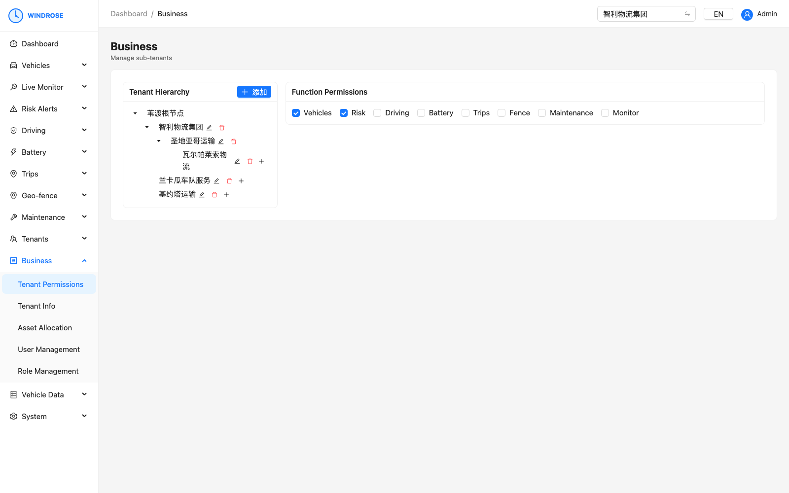

点击「业务管理」→「资产划拨」,进入资产划拨界面。点击「同步数据」可从 IOT 平台同步车辆 VIN 码入库;列表展示全应用所有车辆资产及归属租户,可点击「资产划拨」将单辆车分配至指定租户,勾选多辆车后点击「批量资产划拨」批量操作,点击「划拨记录」查看归属变更历史,点击「删除」移除未关联设备的车辆资产。

点击「业务管理」→「用户管理」,进入用户管理界面。左侧租户树选择目标租户(默认根级),右侧展示该租户下用户列表。支持新增、编辑、删除用户和重置密码操作,数据范围为全应用所有租户。

点击「业务管理」→「角色管理」,进入角色管理界面。左侧租户树选择目标租户,右侧展示该租户下角色列表。支持新增、编辑、删除角色及配置功能权限,数据范围为全应用所有租户。

---

## 页面 14：系统管理

操作者点击「系统管理」→「用户管理」,进入用户管理界面。列表展示本租户下的用户信息(昵称、登录邮箱、角色、创建时间)。点击「新增用户」创建账号并分配角色,点击「编辑」修改用户信息,点击「重置密码」将密码恢复为初始密码,点击「删除」移除用户与本租户的关联。管理员账号不可删除,编辑时角色不可修改。

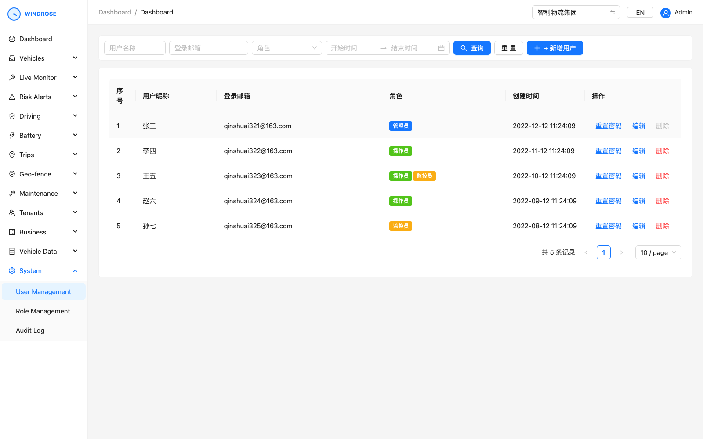

### 弹窗 9：创建系统用户(两步向导)

操作者点击「新增用户」,进入创建账号第一步。输入用户昵称(最长 20 字符)和登录邮箱(须符合邮箱格式),选择角色(多选,数据来源为本租户下已创建的非管理员角色)。若账号不存在,自动创建新账号并生成初始密码(8 位大写字母+数字随机组合),展示用户 ID、登录邮箱和初始密码,点击「复制信息」可复制到剪贴板。

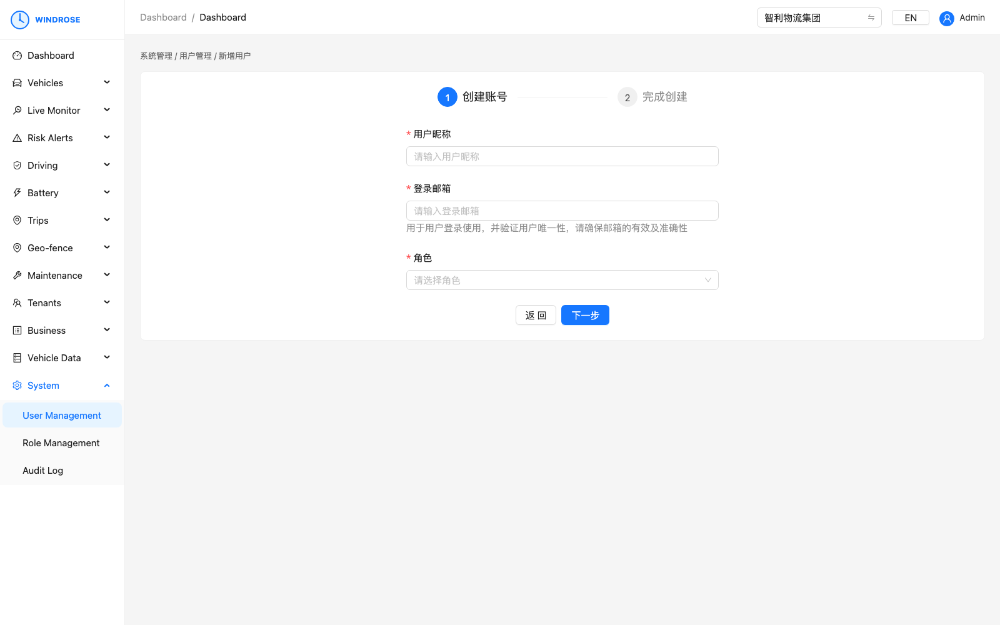

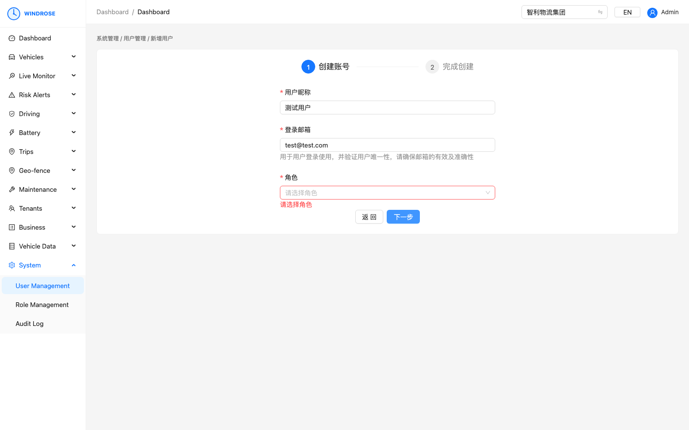

### 弹窗 10：编辑系统用户

操作者点击「编辑」,弹出编辑用户窗口。可修改用户昵称、登录邮箱和角色。若修改邮箱,系统校验是否已被其他用户使用,重复时输入框飘红提示。管理员角色的用户编辑时角色置灰不可更改。点击「确定」保存。

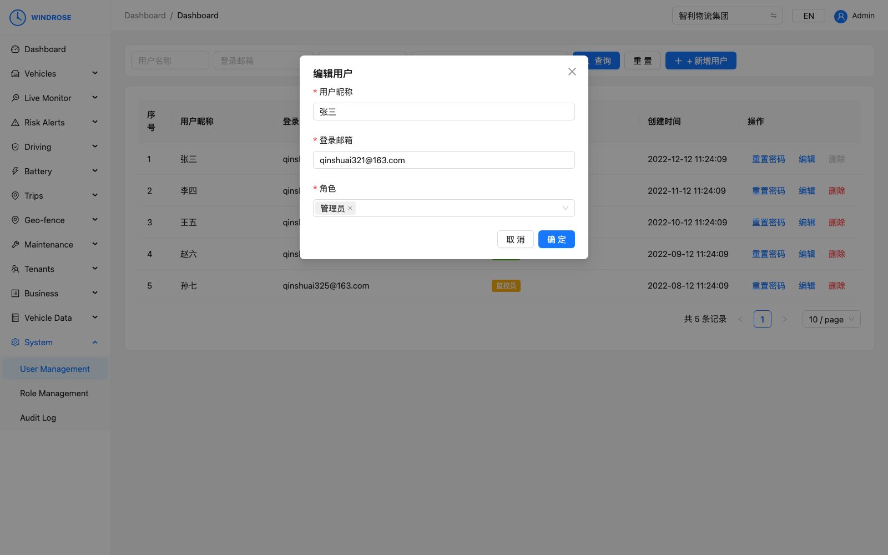

### 弹窗 11：重置密码

操作者点击「重置密码」,弹出二次确认弹窗。点击「确认」后系统将该用户密码重置为初始密码(8 位大写字母+数字随机组合),弹出结果窗口展示用户昵称、登录邮箱和新密码。点击「复制信息」可将邮箱和密码复制到剪贴板。

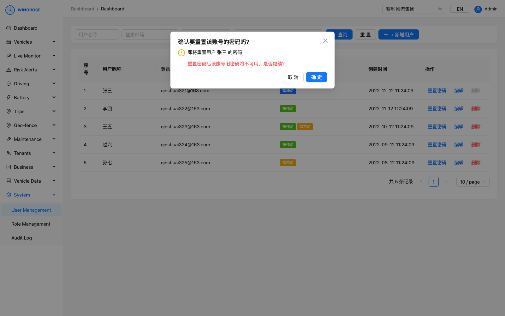

操作者点击「系统管理」→「角色管理」,进入角色管理界面。列表展示本租户下的角色,管理员角色由开通租户时自动创建(不可编辑、删除、修改权限)。点击「新增角色」输入名称后在右侧功能权限树勾选权限。鼠标移入角色可编辑或删除。

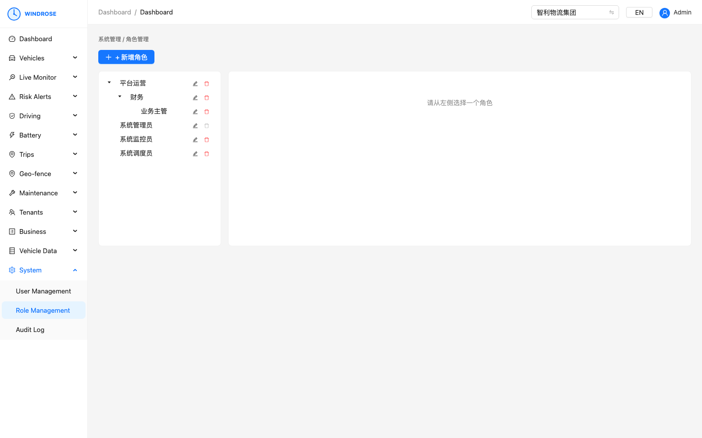

操作者点击「系统管理」→「日志审计」,进入日志审计界面。可按操作人、操作账号、所属租户、操作菜单、操作功能、时间范围和操作结果多维筛选。列表展示操作时间、操作人、操作账号、所属租户、操作菜单、操作功能、操作内容和操作结果。日志数据保留至少 180 天。

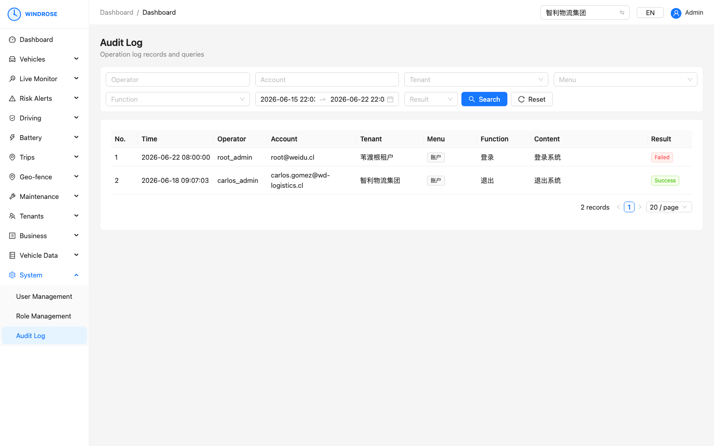

---

## 页面 15：车辆信号与数据导出

操作者点击「车辆数据」→「车辆信号数据」,进入车辆信号数据查询界面。选择车辆(最多 10 辆)、信号指标(支持按信号组一键全选,信号组包括电池信号、充电信号、风控预警、驾驶预警)和时间范围(最长 180 天),点击「查询」展示结果。表格列根据所选信号动态生成,同一时间戳的各信号自动对齐成行,无值信号显示"--"。点击「导出数据」提交异步导出任务,数据量超过 20 万行时系统将提示缩小查询范围。

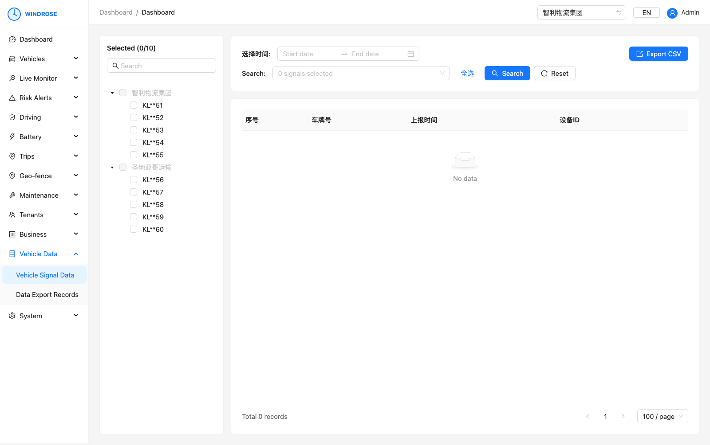

操作者点击「车辆数据」→「数据导出记录」,进入导出记录界面。列表展示所有导出任务的文件名、数据条数、创建时间和状态(处理中/已完成/已失败/已过期)。对已完成的任务,点击「下载」保存 CSV 文件到本地。文件有效期为 7 天,超期显示已过期无法下载。导出的车牌号和 VIN 码为明文。

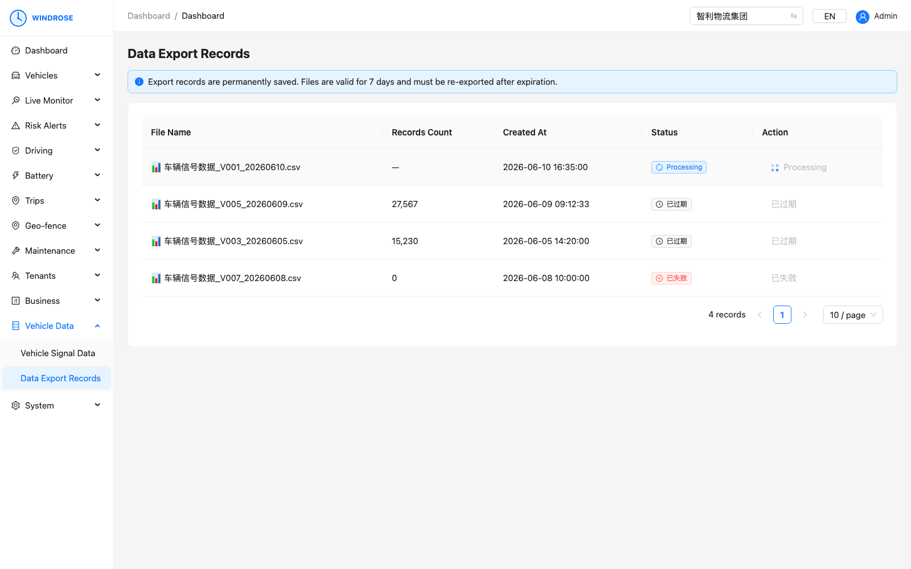
